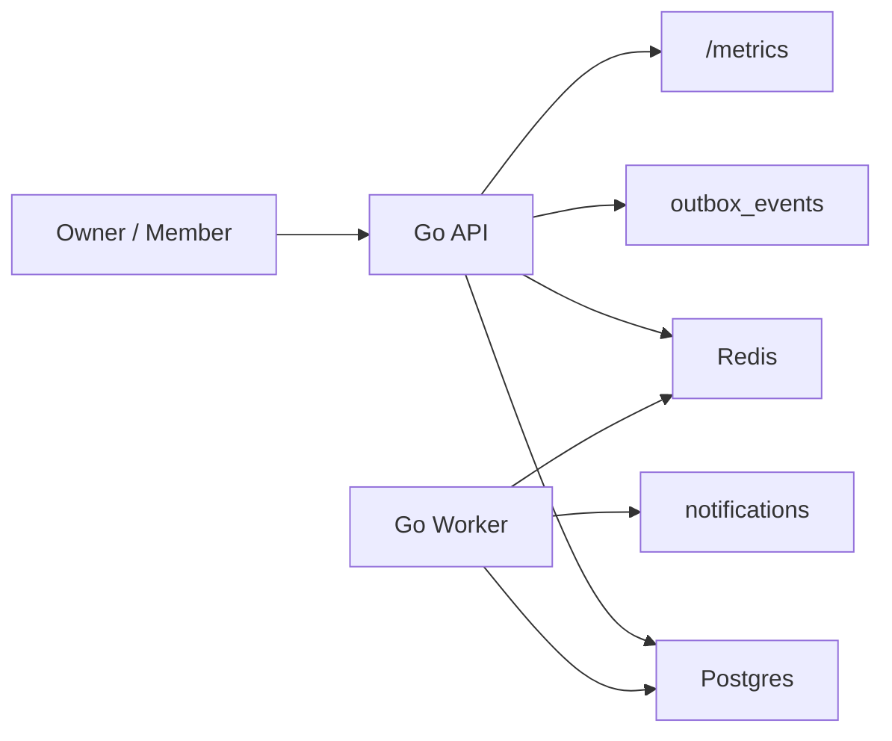

# Workspace SaaS API Presentation

## 발표 목적

- CRUD API가 아니라, 웹 백엔드 실무에서 자주 나오는 흐름을 한 프로젝트로 묶어 설명한다.
- `auth`, `RBAC`, `tenant boundary`, `idempotency`, `optimistic locking`,
  `async notification`, `cache`, `observability`, `local reproducibility`를 모두 보여 준다.

## Slide 1. 한 줄 소개

- 팀 협업용 B2B SaaS 백엔드다.
- 조직 소유자가 워크스페이스를 만들고, 팀원을 초대하고, 이슈를 생성하고,
  댓글과 알림, 대시보드 요약까지 이어지는 흐름을 제공한다.
- API 서버와 worker를 분리해 비동기 처리 경계를 명확히 했다.

## Slide 2. 왜 이 프로젝트를 만들었나

- 학습용 capstone은 아키텍처 학습에는 좋지만, 채용 공고에서 바로 읽히는
  제품형 API와는 결이 다르다.
- 그래서 별도 대표작으로 “회사에서 바로 상상할 수 있는 도메인”을 택했다.
- 발표 포인트는 기술 이름 나열이 아니라, 끝까지 이어지는 사용 흐름과 경계 조건이다.

## Slide 3. 시스템 구조



- access token은 JWT 15분 TTL이다.
- refresh token은 opaque token 7일 TTL이고 Redis를 필수 저장소로 사용한다.
- issue/comment 변경은 outbox 이벤트를 남기고 worker가 notification row를 생성한다.
- dashboard summary는 Redis cache를 우선 사용하고, 실패 시 DB fallback으로 처리한다.

## Slide 4. 발표 시나리오

1. owner가 organization을 생성하며 가입한다.
2. owner가 project를 만든다.
3. owner가 member를 초대한다.
4. member가 invitation을 수락한다.
5. member가 issue를 만들고, 같은 idempotency key로 재요청한다.
6. owner가 잘못된 version으로 update해서 conflict를 본 뒤, 정상 update를 수행한다.
7. member가 comment를 남기고 worker가 notification을 만든다.
8. owner가 dashboard summary를 조회한다.
9. owner가 refresh rotation과 logout revoke를 확인한다.
10. 다른 organization owner로 cross-tenant 접근을 시도해 403을 확인한다.

## Slide 5. 실제 캡처 1: 가입과 조직 생성

캡처 파일:
- [01-register-owner.json](presentation-assets/demo-2026-03-07/01-register-owner.json)
- [02-create-project.json](presentation-assets/demo-2026-03-07/02-create-project.json)

핵심 설명:
- 가입 직후 `access_token`, `refresh_token`, `memberships`가 함께 온다.
- membership 응답에 `organization_id`, `organization_slug`, `role`을 바로 포함해
  클라이언트가 첫 화면에서 tenant context를 잃지 않게 했다.

발표용 발췌:

```json
{
  "user": {
    "email": "owner-...@example.com"
  },
  "memberships": [
    {
      "organization_slug": "workspace-...",
      "role": "owner"
    }
  ]
}
```

## Slide 6. 실제 캡처 2: 초대와 멤버 수락

캡처 파일:
- [03-create-invitation.json](presentation-assets/demo-2026-03-07/03-create-invitation.json)
- [04-accept-invitation.json](presentation-assets/demo-2026-03-07/04-accept-invitation.json)

핵심 설명:
- invitation은 `Idempotency-Key`를 받는다.
- 실제 서비스라면 메일 발송이 들어가겠지만, 대표작 v1에서는 SMTP를 범위 밖으로 두고
  `accept_token_preview`로 시나리오를 닫았다.
- 수락이 끝나면 member도 바로 token pair와 membership 정보를 받는다.

발표용 발췌:

```json
{
  "invitation": {
    "email": "member-...@example.com",
    "role": "member",
    "status": "pending"
  },
  "accept_token_preview": "<redacted-demo-invite-token>"
}
```

## Slide 7. 실제 캡처 3: 이슈 생성, idempotency, optimistic locking

캡처 파일:
- [05-create-issue.json](presentation-assets/demo-2026-03-07/05-create-issue.json)
- [06-replay-issue.json](presentation-assets/demo-2026-03-07/06-replay-issue.json)
- [07-update-conflict.json](presentation-assets/demo-2026-03-07/07-update-conflict.json)
- [08-update-issue.json](presentation-assets/demo-2026-03-07/08-update-issue.json)

핵심 설명:
- `POST /issues`는 idempotency key를 받아 재전송에도 같은 이슈를 돌려준다.
- `PATCH /issues/{id}`는 `version`을 요구하고, 어긋나면 409로 막는다.
- 이 두 가지를 같이 보여 주면 “쓰기 API의 안정성”을 설명하기 좋다.

발표용 발췌:

```json
{
  "error": {
    "code": "version_conflict",
    "message": "issue version conflict"
  }
}
```

## Slide 8. 실제 캡처 4: worker, notification, dashboard summary

캡처 파일:
- [09-add-comment.json](presentation-assets/demo-2026-03-07/09-add-comment.json)
- [10-notifications.json](presentation-assets/demo-2026-03-07/10-notifications.json)
- [11-dashboard-summary.json](presentation-assets/demo-2026-03-07/11-dashboard-summary.json)
- [17-metrics.txt](presentation-assets/demo-2026-03-07/17-metrics.txt)

핵심 설명:
- comment를 쓰면 API는 outbox를 남기고 끝낸다.
- worker가 별도 프로세스로 notification을 만든다.
- summary는 `projects_total`, `issues_in_progress`, `unread_notifications`를 한 번에 보여 준다.
- `/metrics`를 열면 요청 수, 로그인 수, cache miss를 바로 볼 수 있다.

발표용 발췌:

```json
{
  "summary": {
    "projects_total": 1,
    "issues_in_progress": 1,
    "unread_notifications": 3
  }
}
```

## Slide 9. 실제 캡처 5: session security와 tenant boundary

캡처 파일:
- [12-refresh.json](presentation-assets/demo-2026-03-07/12-refresh.json)
- [13-logout.status](presentation-assets/demo-2026-03-07/13-logout.status)
- [14-refresh-after-logout.json](presentation-assets/demo-2026-03-07/14-refresh-after-logout.json)
- [16-cross-tenant-forbidden.json](presentation-assets/demo-2026-03-07/16-cross-tenant-forbidden.json)

핵심 설명:
- refresh는 rotation을 강제한다.
- logout 이후 같은 refresh token으로 다시 호출하면 401이 나온다.
- 다른 organization owner가 기존 org에 접근하면 403이 나온다.
- 면접에서는 이 장면으로 “인증이 아니라 인가까지 확인했다”는 점을 강조하면 된다.

발표용 발췌:

```json
{
  "error": {
    "code": "forbidden",
    "message": "you are not a member of this organization"
  }
}
```

## Slide 10. 검증과 운영 관점

- 단위 테스트: `go test ./...`
- e2e: `make e2e`
- curl smoke: `make smoke`
- 발표 캡처 재생성: `make demo-capture`
- 전체 포트폴리오 재현: `make test-portfolio-repro`

이 프로젝트가 포트폴리오로 좋은 이유:
- toy CRUD가 아니라 write safety와 tenant safety를 같이 보여 준다.
- API와 worker를 분리해 비동기 경계를 설명할 수 있다.
- README, OpenAPI, smoke script, captured demo assets가 한 세트로 남아 재현성이 높다.

## Live Demo Runbook

발표를 라이브로 하면 이 순서를 권장한다.

1. `cd 05-portfolio-projects/18-workspace-saas-api/go`
2. `make up`
3. `make migrate`
4. 터미널 1에서 `make run-api`
5. 터미널 2에서 `make run-worker`
6. 터미널 3에서 `./scripts/smoke.sh`
7. 마지막에 `/metrics`와 `docs/presentation-assets/demo-2026-03-07/`를 보여 준다.

## Appendix: 실제 캡처 자산

- 로그: [00-demo.log](presentation-assets/demo-2026-03-07/00-demo.log)
- API 로그: [90-api.log](presentation-assets/demo-2026-03-07/90-api.log)
- Worker 로그: [91-worker.log](presentation-assets/demo-2026-03-07/91-worker.log)
