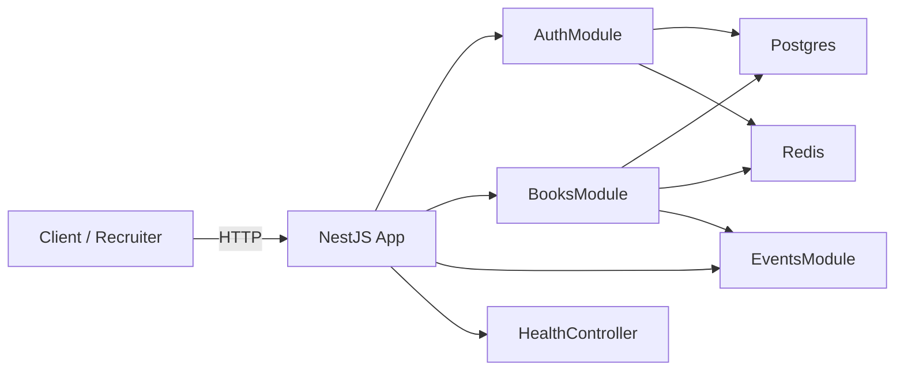
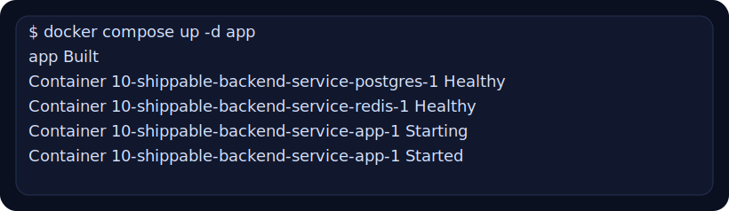
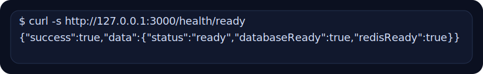
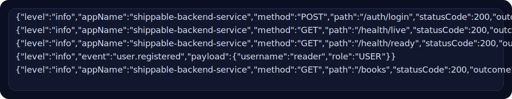
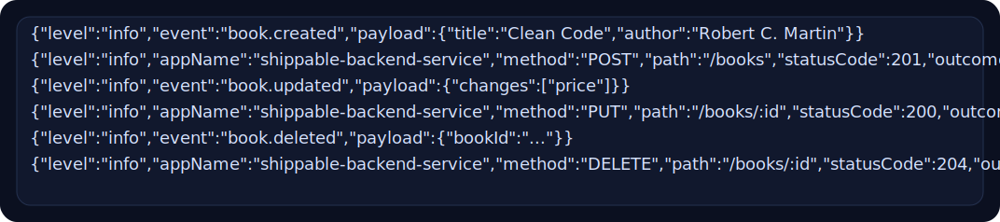
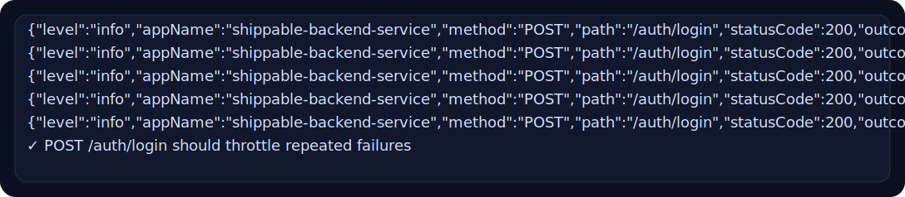
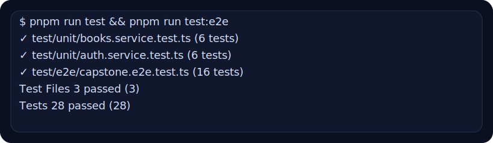

# 10-shippable-backend-service 발표 문서

## 발표 목적

- 이 프로젝트가 왜 `09-platform-capstone`과 별도로 존재하는지 설명한다.
- recruiter 또는 면접관에게 “실제로 실행 가능하고, 주니어 웹 백엔드 포트폴리오로 제출 가능한 서비스”라는 인상을 준다.
- 5~7분 안에 핵심 기능, 운영 요소, 검증 수준을 전달한다.

## 1. 오프닝

발표 멘트:

`09-platform-capstone`이 학습용 통합 과제였다면, `10-shippable-backend-service`는 그 결과물을 채용 제출용으로 다시 패키징한 서비스입니다. 기능을 더 많이 넣는 대신, Postgres migration, Redis cache/throttling, Docker Compose, Swagger, health endpoint처럼 reviewer가 바로 읽고 실행할 수 있는 요소를 보강했습니다.

## 2. 왜 10번 과제를 추가했는가

핵심 포인트:

- `09`는 개념 통합에는 충분했지만 제출용 패키지로는 약했다.
- `10`은 기능보다 실행성, 재현성, 문서성을 강화한다.
- Postgres + Redis + Compose + Swagger가 주니어 지원 경쟁력과 직접 연결된다.

## 3. 아키텍처 요약

발표 멘트:

Auth, Books, Events를 feature module로 나눴고, Postgres는 migration 기반으로, Redis는 read cache와 login throttling에만 사용했습니다. queue나 worker는 일부러 제외해서 설명 비용을 낮췄습니다.

## 4. 시연 시나리오

순서:

1. Docker Compose로 앱이 실제로 올라오는지 보여 준다.
2. `/health/ready`로 Postgres와 Redis 준비 상태를 확인한다.
3. `auth/login`, `auth/register`, public `GET /books` 흐름을 설명한다.
4. admin write와 event log를 보여 준다.
5. 반복 로그인 실패 시 throttling이 동작함을 보여 준다.
6. 마지막으로 unit + e2e 검증 수준을 정리한다.

## 5. 시연 캡처 1: Compose 기동

발표 멘트:

이 프로젝트는 로컬 재현성을 최우선으로 둡니다. reviewer는 Docker Compose만으로 Postgres, Redis, app을 함께 띄울 수 있고, 이게 첫 번째 인상 포인트입니다.

## 6. 시연 캡처 2: Readiness 확인

발표 멘트:

단순히 서버가 떠 있는지보다, DB와 Redis가 준비됐는지까지 보여 주는 readiness endpoint를 두었습니다. 운영 준비도를 설명할 때 가장 먼저 보여 주기 좋은 화면입니다.

## 7. 시연 캡처 3: 인증과 public read

발표 멘트:

admin 로그인, 일반 사용자 등록, public books 조회가 모두 실제 요청으로 검증됩니다. 여기서 JWT 기반 인증, public/private 경계, request logging 규약을 함께 설명할 수 있습니다.

## 8. 시연 캡처 4: 관리자 쓰기와 이벤트

발표 멘트:

책 생성, 수정, 삭제는 ADMIN만 가능하고, 성공 시 이벤트가 발행됩니다. 이 장면에서 RBAC, write 후 cache invalidation, event-driven side effect 분리를 한 번에 설명할 수 있습니다.

## 9. 시연 캡처 5: 로그인 throttling

발표 멘트:

이 프로젝트에서 Redis는 캐시뿐 아니라 auth failure state 저장에도 사용됩니다. 반복 실패 시 throttling이 걸리도록 구현했고, 이 부분이 단순 CRUD 과제와 가장 차별화되는 운영 포인트입니다.

## 10. 시연 캡처 6: 검증 수준

발표 멘트:

포트폴리오 프로젝트는 “돌아간다”보다 “검증됐다”가 중요합니다. 이 프로젝트는 unit 12개, e2e 16개를 통과했고, health, docs, auth, RBAC, cache, throttling까지 시나리오에 포함했습니다.

## 11. 마무리 멘트

이 프로젝트의 핵심은 기술 스택을 많이 쓴 것이 아니라, reviewer가 10분 안에 실행하고 구조를 이해할 수 있게 만든 점입니다. 학습용 capstone을 제출용 backend service로 올리기 위해 어떤 요소를 추가해야 하는지 보여 주는 예제로 이해해 주시면 됩니다.

## 12. 예상 질문

- 왜 `09`를 수정하지 않고 `10`을 따로 만들었나
- 왜 Postgres + Redis를 선택했고 queue는 뺐나
- Swagger와 health endpoint를 왜 중요한 포인트로 보나
- 캐시 invalidation과 throttling 설계에서 더 확장한다면 무엇을 먼저 하겠나
