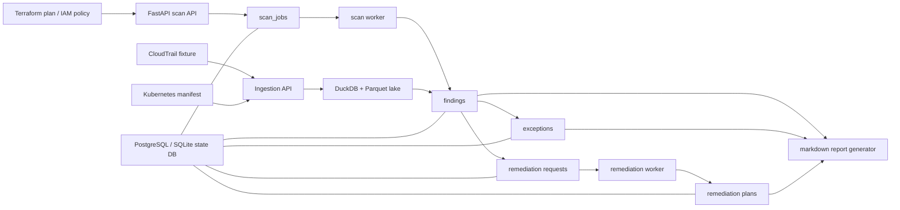

# Control Plane 아키텍처

## 읽는 포인트

- API는 스캔 요청과 로그/manifest 적재 요청을 받습니다.
- worker는 시간이 걸리는 처리와 상태 전이를 담당합니다.
- 상태 저장소는 기본 PostgreSQL이고, 데모 fallback에서는 SQLite를 사용합니다.
- lake 계층은 DuckDB + Parquet로 유지해 CloudTrail 같은 로그를 로컬에서도 queryable하게 만듭니다.
- 최종 산출물은 markdown report이며, findings, exceptions, remediation 결과를 함께 보여 줍니다.

## 이 구조가 좋은 이유

- 공고에서 자주 요구하는 `탐지 -> triage -> 예외 -> 조치안 -> 리포트` 흐름을 한 화면에서 설명할 수 있습니다.
- 앞선 프로젝트의 로직을 재사용하기 때문에 “캡스톤 하나를 갑자기 만들었다”는 느낌이 줄어듭니다.
- PostgreSQL이 없어도 SQLite fallback으로 전체 흐름을 시연할 수 있습니다.
