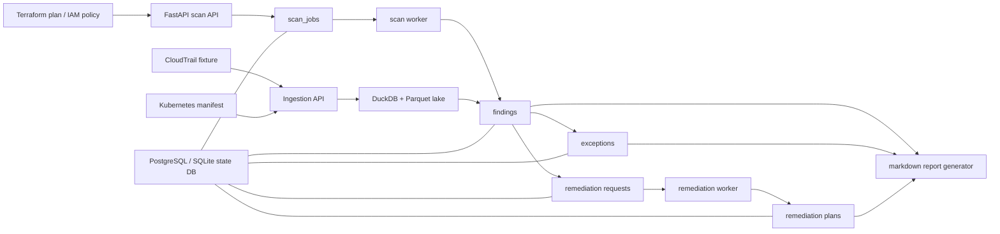

# Architecture

## Reading Guide

- API는 두 종류의 입력을 받는다.
  - scan request: Terraform plan, IAM policy
  - ingestion request: CloudTrail, Kubernetes manifest
- 상태 저장소는 기본적으로 PostgreSQL이고, 테스트나 데모 fallback에서는 SQLite도 허용한다.
- lake 계층은 DuckDB + Parquet로 유지해서 CloudTrail 같은 로그를 로컬에서도 queryable하게 만든다.
- worker는 pending row를 polling해서 findings와 remediation plan을 만든다.
- exception과 remediation은 finding life cycle을 보여 주기 위한 triage 계층이다.
- 최종 산출물은 markdown report이며, 발표나 README에서 핵심 결과를 빠르게 보여 주는 역할을 한다.

## Why This Shape Fits The Job

- 공고의 CSPM 대응은 `scan -> findings -> remediation` 흐름으로 대응했다.
- 공고의 보안 로그 통합은 `CloudTrail -> lake -> detection query` 흐름으로 대응했다.
- 공고의 IAM 지원은 `IAM policy scan + least privilege finding`으로 대응했다.
- 공고의 운영 자동화는 worker와 remediation plan generator로 대응했다.
