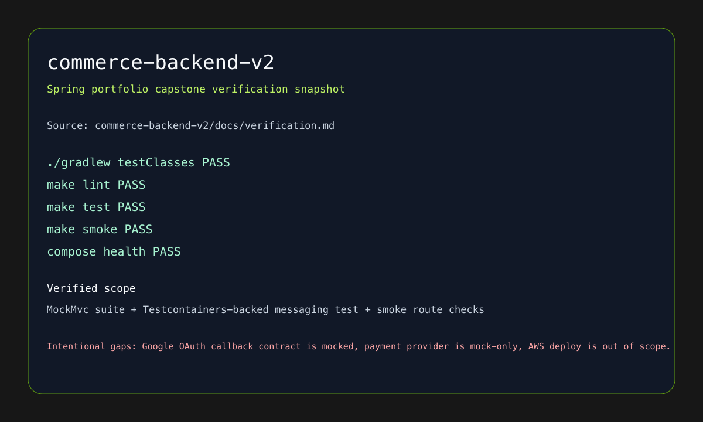

# Spring Backend Portfolio

> PDF/Notion 제출용 조립본입니다. 기준일: 2026년 3월 13일

| 항목 | 내용 |
| --- | --- |
| 포지션 | Spring Backend Engineer |
| 한 줄 포지셔닝 | modular monolith, JPA/Flyway, Redis, outbox/Kafka, Testcontainers를 함께 설계하는 Spring 백엔드 개발자 |
| 핵심 스택 | Spring Boot, JPA, Flyway, Redis, Kafka, Testcontainers, MockMvc |
| 대표 프로젝트 | `commerce-backend-v2`, `workspace-backend-v2-msa`, `B-federation-security-lab` |
| 링크 | [backend-spring](../../../backend-spring/README.md) · [backend-fastapi](../../../backend-fastapi/README.md) |

## 공통 코어 요약

- 42서울 정규과정과 공통 코어 프로젝트로 시스템/네트워크/데이터 기반을 다졌습니다.
- `ft_transcendence`는 Django 백엔드 전담, 42 OAuth, JWT, TOTP 기반 2FA 경험으로 정리합니다.

## backend-common 요약

FastAPI 기반 `workspace-backend` 계열을 통해 인증/인가, API 경계, async notification, verification report 구조를 공통 백엔드 감각으로 쌓았습니다.

## 대표 프로젝트 1. commerce-backend-v2

같은 커머스 도메인을 baseline보다 더 깊게 구현한 portfolio-grade capstone입니다. persisted auth, JPA + Flyway domain modeling, Redis cart/throttling, idempotent payment, outbox + Kafka notification을 modular monolith 구조로 묶었습니다.

## 대표 프로젝트 2. B-federation-security-lab

OAuth2 federation, 2FA, audit를 Spring 관점에서 정리한 보조 근거입니다. 인증 강화 랩을 통해 capstone의 보안 흐름이 어떤 기초 위에서 올라왔는지 설명할 수 있습니다.

## 선택 부착 모듈

> 삭제 가능 - Infobank 제출 경험을 함께 보여 주고 싶을 때만 유지

`Infobank` 모듈을 붙이면 release gate, compare artifact, 발표 자료까지 닫힌 과제형 결과물을 보강할 수 있습니다.

> 삭제 가능 - 보안/운영 흐름을 함께 보여 주고 싶을 때만 유지

`Bithumb` 모듈을 붙이면 cloud security control plane과 remediation/report 흐름을 보조 사례로 추가할 수 있습니다.

## 마무리

이 제출본은 Spring 백엔드를 키워드 나열보다, 같은 도메인을 baseline에서 portfolio-grade로 끌어올린 구조와 검증으로 보여 줍니다. 인증, 데이터, 이벤트, 운영성, 테스트가 함께 설명된다는 점이 핵심입니다.
