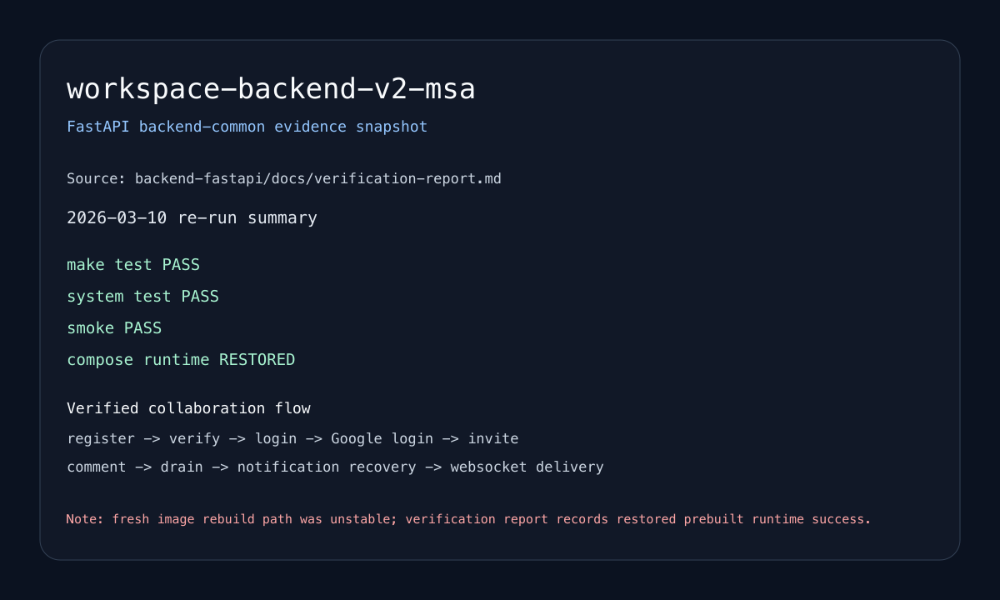

# Backend Common Portfolio Module

> FastAPI를 중심으로 백엔드 공통 기반을 정리한 모듈입니다.

| 항목 | 내용 |
| --- | --- |
| 포지셔닝 | 인증/인가, API 경계, async job, event/outbox, 관측성, 재현 가능한 실행 |
| 핵심 스택 | FastAPI, SQLAlchemy, PostgreSQL, Redis Streams, WebSocket, Docker |
| 대표 근거 | `workspace-backend`, `workspace-backend-v2-msa` |

## 대표 프로젝트

### workspace-backend

단일 백엔드 기준선으로, 인증, 워크스페이스 도메인, 알림을 하나의 서비스 안에서 통합해 설명 가능한 제품형 API로 정리했습니다.

### workspace-backend-v2-msa

같은 협업형 도메인을 `gateway + identity-service + workspace-service + notification-service`로 분리해, public API는 유지하면서 내부 경계와 분산 복잡성을 설명하는 버전입니다.

## 공통으로 보여 주는 역량

- 인증/인가: login, verify, refresh, role/membership 경계
- API 표면: public route shape 유지와 문서화
- 비동기 처리: outbox, Redis Streams consumer, websocket fan-out
- 운영성: `make test`, `make smoke`, compose runtime, verification report

## 메인 증빙

## 마무리

이 모듈은 특정 언어나 프레임워크 지원본에 쉽게 덧붙일 수 있는 공통 백엔드 기반입니다. 이후 `go`, `node`, `spring`, `fullstack`, `infobank`, `bithumb` 조립본에서는 이 모듈을 공통 백엔드 토대처럼 붙입니다.
