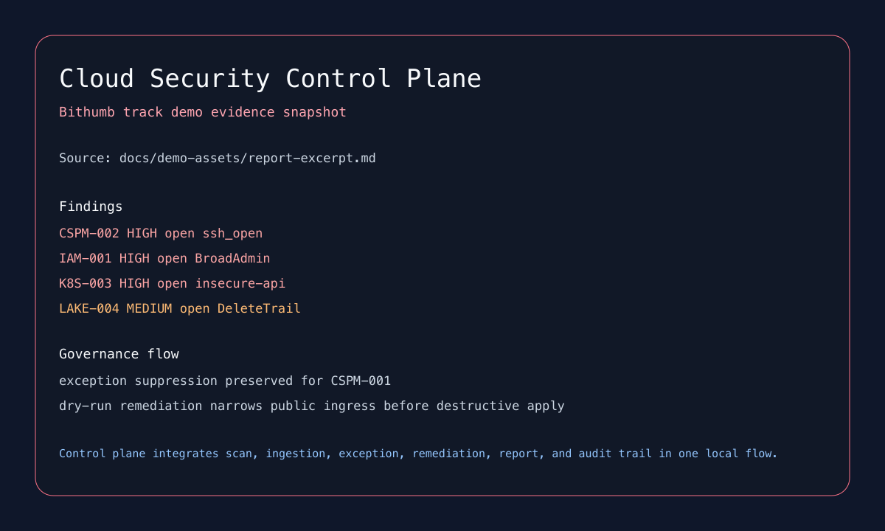

# Bithumb Portfolio Module

| 항목 | 내용 |
| --- | --- |
| 포지셔닝 | scan, finding, exception, remediation, report를 하나의 local control plane으로 통합한 보안 플랫폼 모듈 |
| 대표 프로젝트 | `Cloud Security Control Plane` |
| 핵심 스택 | Python, FastAPI, PostgreSQL, SQLite fallback, worker, report pipeline |

## 메인 프로젝트

### 10 Cloud Security Control Plane

Terraform plan, IAM policy, CloudTrail fixture, Kubernetes manifest를 공통 finding 흐름으로 통합한 capstone입니다. FastAPI API, scan worker, remediation worker, 상태 저장소, markdown report를 한 서비스 레이어에서 연결했고, Docker가 없어도 SQLite fallback으로 demo를 재현할 수 있게 했습니다.

## 메인 캡처

## 보조 근거

- IAM Policy Analyzer
- CSPM Rule Engine
- Exception and Evidence Manager

## 마무리

이 모듈은 개별 보안 판단 로직을 하나의 운영 흐름으로 묶어 설명하는 경험을 보여 줍니다. 독립 제출본으로도 쓰고, 필요하면 백엔드 조립본의 보안/운영 보조 모듈로 붙일 수 있습니다.
