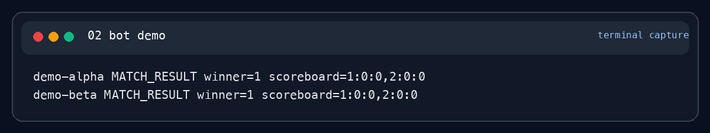
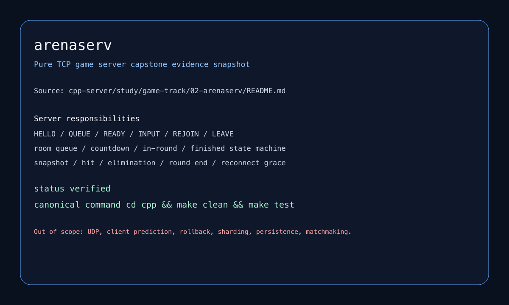

# Game Server Portfolio Module

| 항목 | 내용 |
| --- | --- |
| 포지셔닝 | authoritative state, protocol, state machine, deterministic test 중심의 실시간 서버 모듈 |
| 대표 프로젝트 | `Tactical Arena Server`, `arenaserv`, `Network & Systems Foundations` |
| 핵심 스택 | C++, Boost.Asio, TCP, UDP, SQLite, CMake, deterministic test |

## 메인 프로젝트

### Tactical Arena Server

`C++20 + Boost.Asio + SQLite + CMake/CTest` 기반의 authoritative tactical arena server입니다. line-based TCP control protocol과 binary UDP packet을 함께 설계하고, reconnect, fixed tick, respawn, load smoke를 설명 가능한 구조로 정리했습니다.

### arenaserv

pure TCP capstone으로, room queue, countdown, in-round, reconnect grace를 하나의 상태 머신으로 묶었습니다. 화려한 기능보다 authoritative 상태와 세션 연속성 검증에 집중했습니다.

## 메인 캡처

## 보조 근거

- [cpp-server](../../../cpp-server/README.md)
- [network-atda](../../../network-atda/README.md)
- [cs-core](../../../cs-core/README.md)

## 마무리

이 모듈은 게임서버를 웹 백엔드의 변형이 아니라, authoritative state와 네트워크 조건을 함께 다루는 별도 문제로 접근해 온 결과물을 보여 줍니다.
