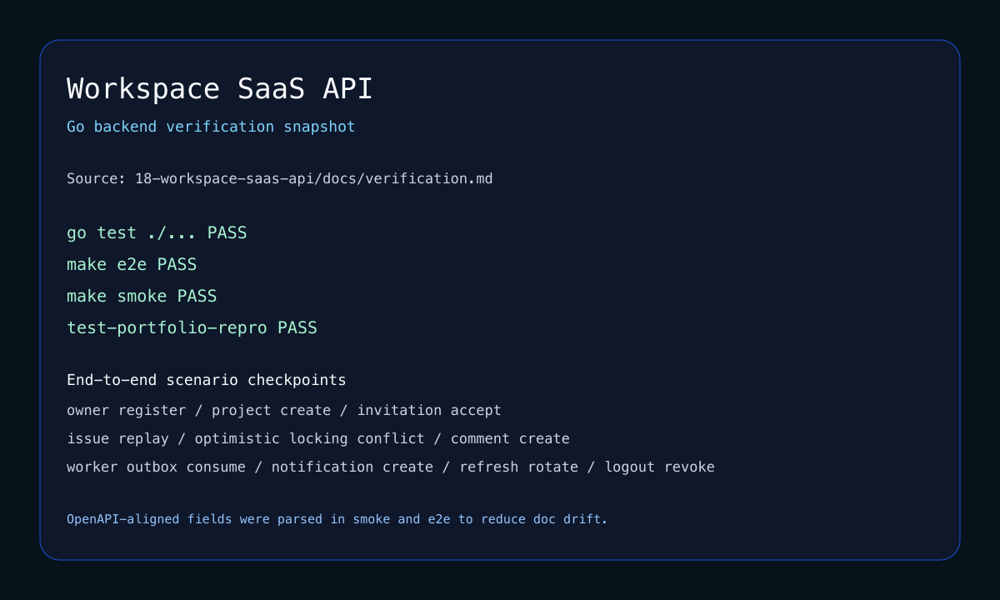

# Go Backend Portfolio Module

| 항목 | 내용 |
| --- | --- |
| 포지셔닝 | JWT auth, RBAC, worker 분리, Postgres/Redis 재현성을 갖춘 제품형 Go API |
| 대표 프로젝트 | `18 Workspace SaaS API`, `17 Game Store Capstone`, `15 Event Pipeline` |
| 핵심 스택 | Go, PostgreSQL, Redis, JWT, RBAC, OpenAPI, Docker |

## 메인 프로젝트

### 18 Workspace SaaS API

채용 제출용 B2B SaaS API를 로컬에서 완결형으로 재현하는 대표 결과물입니다. owner/admin/member RBAC, invitation, issue/comment workflow, async notification, OpenAPI 정합성까지 하나의 제품형 API로 묶었습니다.

### 보조 근거

- `17 Game Store Capstone`: transaction, outbox, 운영 기본 요소를 게임 상점 도메인으로 통합
- `15 Event Pipeline`: outbox relay, idempotent consumer, 비동기 전달 경계 기초

## 메인 캡처

## 마무리

이 모듈은 Go를 언어 자체보다 제품형 API와 재현 가능한 검증의 관점에서 보여 줍니다. 권한 경계, 데이터 모델, 비동기 처리, smoke/e2e를 한 결과물 안에서 함께 설명할 수 있다는 점이 핵심입니다.
