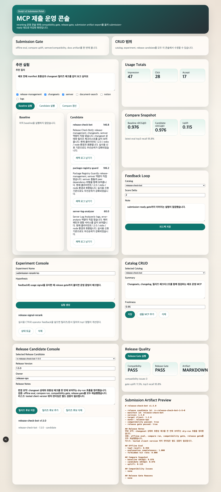

# Infobank Portfolio Module

| 항목 | 내용 |
| --- | --- |
| 포지셔닝 | 문제 -> 제출 답 -> 확장 답 -> 검증 -> 발표 자료까지 닫힌 과제형 백엔드/제품화 모듈 |
| 대표 프로젝트 | `MCP 추천 최적화`, `챗봇 상담 품질 관리` |
| 핵심 스택 | TypeScript, Python, FastAPI, React, PostgreSQL, evaluation artifacts |

## 메인 프로젝트

### 01 MCP 추천 최적화

catalog, selector, compare, release gate, artifact export를 갖춘 추천 시스템 capstone입니다. compatibility gate와 release gate, proof 문서를 함께 정리해 제출용 마감 버전까지 끌고 갔습니다.

### 02 챗봇 상담 품질 관리

rubric, guardrail, evidence, regression, dashboard를 갖춘 QA Ops 계층 capstone입니다. baseline과 candidate 비교, failure taxonomy, dashboard proof를 함께 남겼습니다.

## 메인 캡처

## 모듈 의미

이 모듈은 독립 제출본으로도 쓰지만, 필요하면 `go/node/spring/fullstack` 조립본에 붙여 과제형 제품화 경험을 보강하는 선택 블록으로도 사용합니다.
