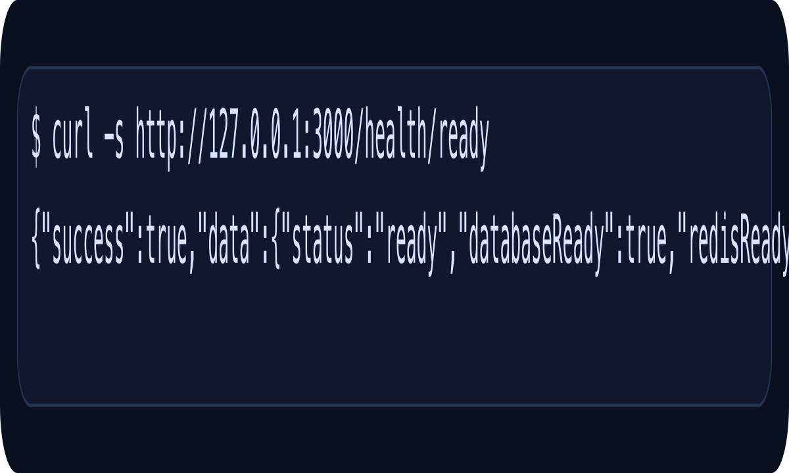

# Node Backend Portfolio Module

| 항목 | 내용 |
| --- | --- |
| 포지셔닝 | NestJS 기반 제출용 서비스 표면, Postgres/Redis, Swagger, Docker Compose 재현성 |
| 대표 프로젝트 | `10 shippable-backend-service`, `09 platform-capstone`, `08 production-readiness` |
| 핵심 스택 | Node.js, TypeScript, NestJS, PostgreSQL, Redis, Swagger, Docker Compose |

## 메인 프로젝트

### 10 shippable-backend-service

학습용 capstone을 Postgres, Redis, Docker Compose, Swagger까지 포함한 채용 제출용 NestJS 서비스 표면으로 다시 패키징한 프로젝트입니다. JWT auth, RBAC, Books CRUD, migration, cache, throttling을 한 서비스 표면에서 설명할 수 있습니다.

### 보조 근거

- `09 platform-capstone`: REST, auth, persistence, events, 운영성 규약의 통합 버전
- `08 production-readiness`: health, config, logging, cache, queue, rate limiting 같은 운영성 확장

## 메인 캡처

## 마무리

이 모듈은 Node.js 백엔드를 단순 언어 학습이 아니라, 채용 제출용 서비스 표면으로 정리한 경험을 보여 줍니다. 서비스 실행, Swagger, Postgres/Redis 의존성, 검증 루프를 함께 설명할 수 있다는 점이 핵심입니다.
