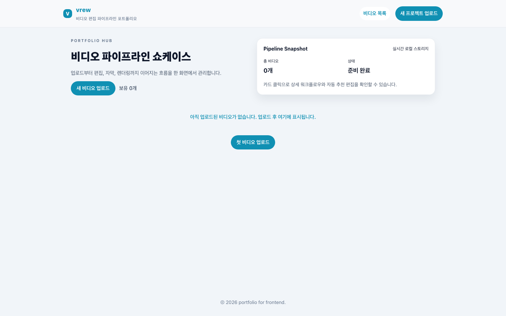
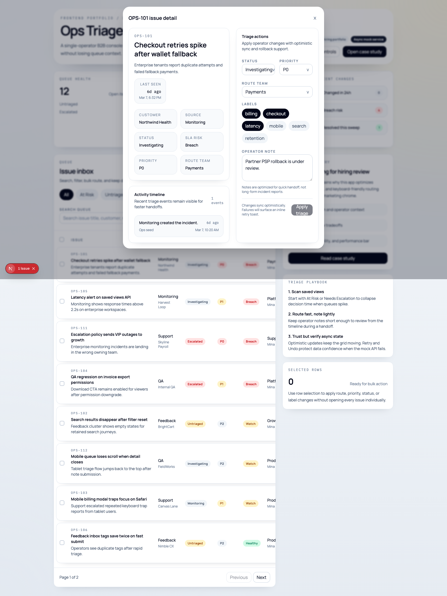
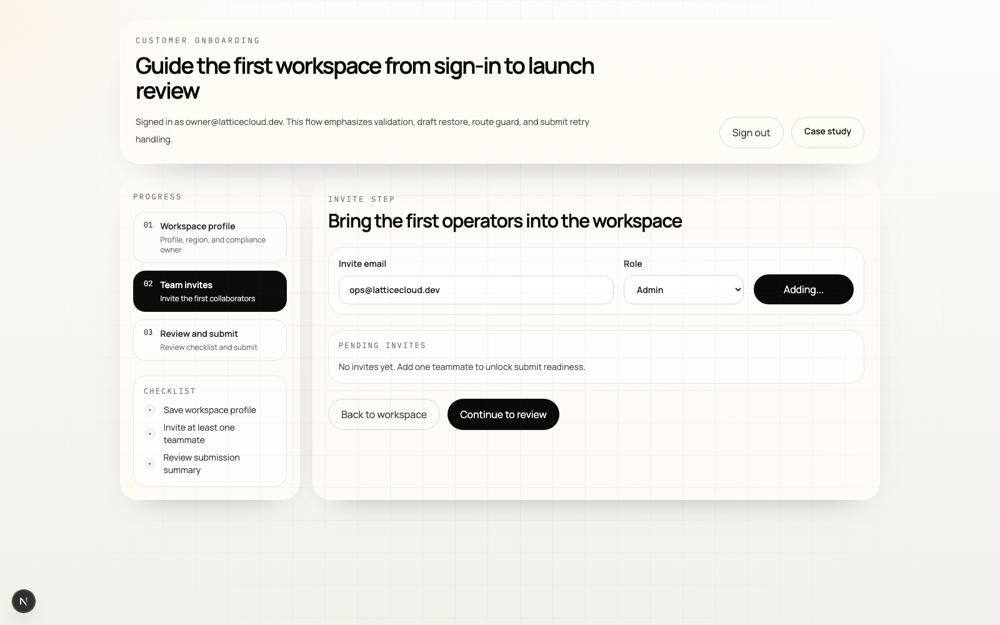

# 포트폴리오

> 이 문서는 2026년 3월 13일 기준으로 정리한 포트폴리오 초안입니다.  
> 스크린샷은 같은 날짜에 실제 실행 또는 공개 배포본에서 직접 캡처했습니다.

## 한 줄 소개

42서울 정규과정 수료 이후, 프론트엔드 단독 배포 프로젝트를 직접 완성하고, 현재 워크스페이스에서는 프론트엔드부터 백엔드, 모바일, 보안, 네트워크, CS 기초까지 학습 순서에 맞춘 대규모 프로젝트 세트를 순차적으로 끝까지 구현하고 검증해 온 개발자입니다.

핵심 강점은 세 가지입니다.

- 화면을 만드는 프론트엔드 감각과 시스템 단위의 구조 이해를 함께 가져가려는 태도
- 프로젝트를 `문제 정의 -> 구현 -> 검증 -> 문서화` 흐름으로 끝까지 정리하는 실행력
- "동작했다" 수준이 아니라 다시 실행 가능한 상태로 남기는 재현성 중심 습관

## 대표 프로젝트 1. mini-vrew

- 형태: 프론트엔드 단독 개발 및 배포
- 링크:
  - GitHub: <https://github.com/seungwoo7050/mini-vrew>
  - Deploy: <https://mini-vrew.vercel.app>
- 핵심 설명:
  - 브라우저에서 동작하는 AI 비디오 편집기 성격의 웹앱
  - FFmpeg WASM, WebGL 2.0, Web Audio API, IndexedDB를 조합해 업로드부터 편집, 자막, 필터, 내보내기 흐름을 프론트엔드에서 직접 처리
- 내가 보여 줄 수 있는 역량:
  - React 19, TypeScript, Vite 기반 제품형 UI 구성
  - 비디오 플레이어, 파형 시각화, 트리밍, 자막 편집, 필터, 썸네일, 내보내기까지 이어지는 복합 UI 설계
  - 브라우저 API를 이용한 무거운 클라이언트 작업 분리와 사용자 경험 구성



## 대표 프로젝트 2. Frontend Portfolio Track

현재 워크스페이스의 [`front-react`](../front-react/README.md)는 웹 기초, React internal, 제품형 UI까지 이어지는 흐름으로 정리되어 있고, 마지막 `frontend-portfolio` 트랙에서 채용용으로 설명 가능한 결과물을 만들었습니다.

### 2-1. Ops Triage Console

- 위치: [`front-react/study/frontend-portfolio/01-ops-triage-console`](../front-react/study/frontend-portfolio/01-ops-triage-console/README.md)
- 문제:
  - 데이터가 많은 운영 화면에서 triage workflow를 어떻게 설계하고 검증할 것인가
- 구현 포인트:
  - dashboard summary, triage queue, saved view, bulk action, optimistic update, rollback, retry
  - Next.js App Router 기반 구조
  - typecheck, Vitest, Playwright를 묶은 검증 루프



### 2-2. Client Onboarding Portal

- 위치: [`front-react/study/frontend-portfolio/02-client-onboarding-portal`](../front-react/study/frontend-portfolio/02-client-onboarding-portal/README.md)
- 문제:
  - 고객-facing onboarding flow에서 validation, draft restore, route guard, submit retry를 어떻게 하나의 제품 흐름으로 묶을 것인가
- 구현 포인트:
  - sign-in, onboarding wizard, invite flow, review, retry 처리
  - React Hook Form, Zod, TanStack Query 중심 구성
  - 단순 폼이 아니라 "실패 가능한 실제 제품 흐름"을 가정한 UX 설계



## 대표 프로젝트 3. 현재 워크스페이스 전체 학습 아카이브

이 저장소의 강점은 프로젝트 수 자체보다, 각 저장소가 학습 순서와 검증 상태를 함께 공개한다는 점입니다. 대표 영역은 아래와 같습니다.

| 영역 | 대표 저장소 | 핵심 포인트 |
| --- | --- | --- |
| Frontend | [`front-react`](../front-react/README.md) | `9`개 프로젝트를 통해 웹 기초, React internals, 제품형 UI까지 순차적으로 구성 |
| Backend | [`backend-go`](../backend-go/README.md), [`backend-fastapi`](../backend-fastapi/README.md), [`backend-node`](../backend-node/README.md), [`backend-spring`](../backend-spring/README.md) | Go `18`개 verified 프로젝트, FastAPI 랩/캡스톤, Node/NestJS 트랙, Spring Boot 커머스 캡스톤 |
| Algorithm / CS | [`algorithm`](../algorithm/README.md), [`cs-core`](../cs-core/README.md), [`cpp-server`](../cpp-server/README.md), [`network-atda`](../network-atda/README.md) | 알고리즘 `53/53 verified`, 시스템 프로그래밍, 운영체제, 프로그래밍 언어 기초, 네트워크/서버 캡스톤 |
| Mobile | [`mobile`](../mobile/README.md) | React Native `10`개 verified 프로젝트와 incident-ops capstone |
| Security / Cloud | [`security-core`](../security-core/README.md), [`bithumb`](../bithumb/README.md) | 보안 판단 기준을 CLI와 artifact로 재현하는 `5`개 프로젝트, AWS-first cloud security `10`개 프로젝트 |
| 과제형 Capstone | [`infobank`](../infobank/README.md) | 추천 시스템, 챗봇 QA Ops 등 과제형 결과물을 `공식 답 -> 확장 답 -> 검증` 흐름으로 정리 |

이 워크스페이스에서 제가 일관되게 유지한 방식은 다음과 같습니다.

- 각 프로젝트를 작은 문제 단위로 분해하고 순서를 다시 설계한다.
- `README`, `problem`, `docs`, `notion`, `blog`를 분리해 읽는 사람에게 맥락을 남긴다.
- 테스트, E2E, benchmark, demo CLI 등으로 다시 검증 가능한 상태를 남긴다.

## CLI 기반 결과물 예시

웹 화면이 없는 프로젝트에서는 실제 실행 로그와 생성 산출물이 중요한 증거가 됩니다. 아래는 [`security-core`](../security-core/README.md)의 capstone 데모를 2026년 3월 13일에 실제 실행한 예시입니다.

```bash
$ cd security-core
$ make demo-capstone
rm -rf .artifacts/capstone/demo
mkdir -p .artifacts/capstone/demo
PYTHONPATH=study/90-capstone-collab-saas-security-review/python/src .venv/bin/python -m collab_saas_security_review.cli demo study/90-capstone-collab-saas-security-review/problem/data/demo_bundle.json
demo 산출물을 .artifacts/capstone/demo에 기록했습니다
```

생성 결과물:

```text
.artifacts/capstone/demo/01-service-profile.json
.artifacts/capstone/demo/02-crypto-findings.json
.artifacts/capstone/demo/03-auth-findings.json
.artifacts/capstone/demo/04-backend-findings.json
.artifacts/capstone/demo/05-dependency-items.json
.artifacts/capstone/demo/06-remediation-board.json
.artifacts/capstone/demo/07-report.md
```

리포트 일부:

```text
- 서비스 이름: collab-saas-demo
- crypto finding 수: 4
- auth finding 수: 7
- backend finding 수: 4
- remediation item 수: 17
```

이런 형태의 프로젝트는 "이론을 공부했다"가 아니라 "판단 기준을 코드와 산출물로 남겼다"는 점을 보여 줍니다.

## 기술 스택

- Frontend: React, Next.js, TypeScript, Vite, TanStack Query, React Hook Form, Zod, Tailwind CSS
- Rich Client / Browser API: FFmpeg WASM, WebGL 2.0, Web Audio API, IndexedDB, Web Workers
- Backend: Go, FastAPI, Node.js, NestJS, Spring Boot, REST API, JWT, RBAC, WebSocket, async jobs, cache, queue, outbox
- CS / Infra / Tooling: algorithms, operating systems, networking, database internals, Docker, Helm, ArgoCD, Terraform, Playwright, Vitest, pytest, go test

## 마무리

저는 한두 개의 예쁜 프로젝트만 만드는 방식보다, 문제를 단계적으로 설계하고 끝까지 검증하는 방식으로 성장해 왔습니다. 프론트엔드 단독 배포 경험과 현재 워크스페이스의 넓은 학습 아카이브는, 제가 화면을 만드는 사람에 머무르지 않고 제품과 시스템 전체를 함께 이해하려는 개발자라는 점을 보여 줍니다.
