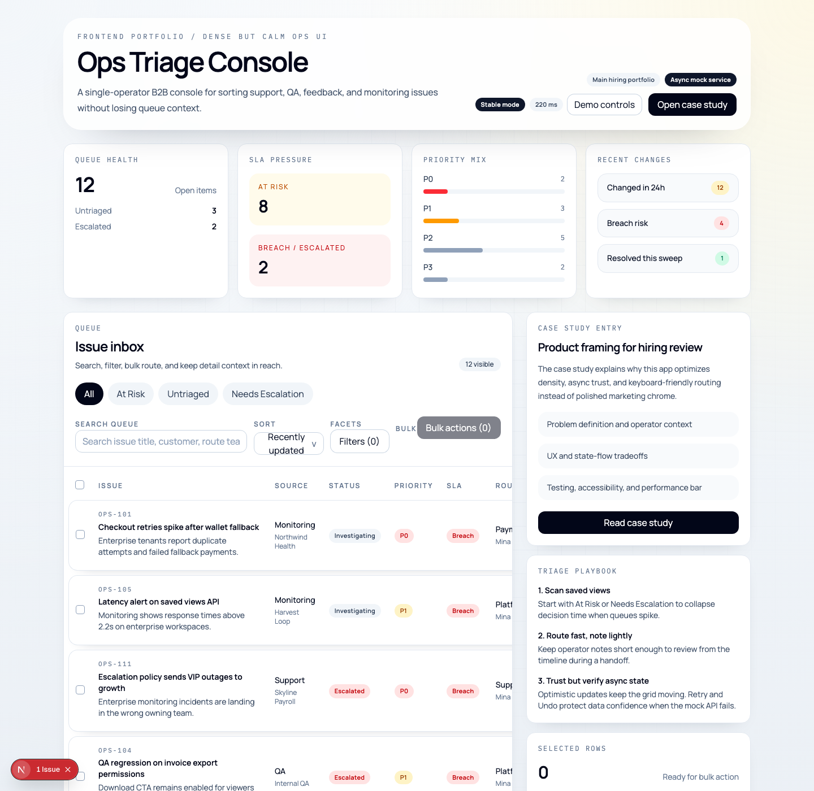
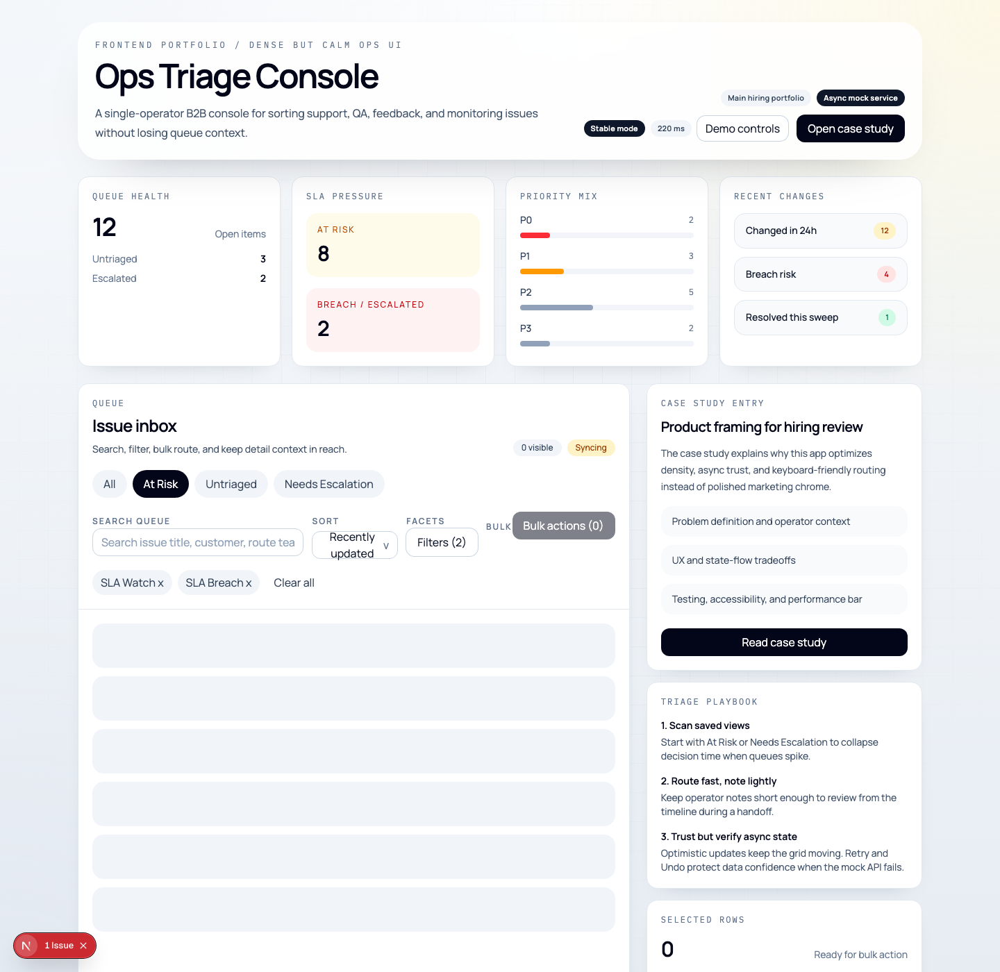
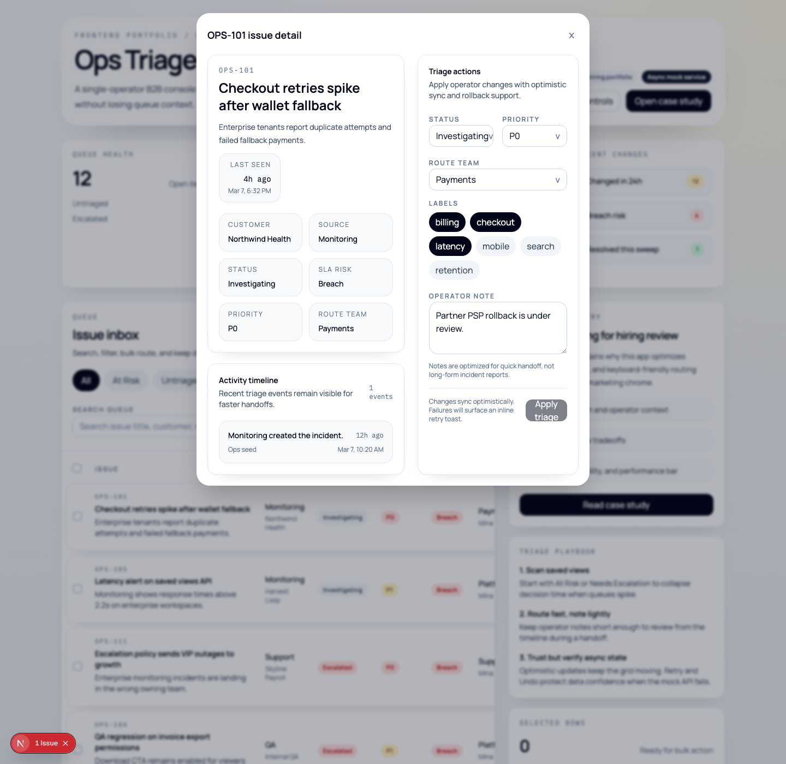
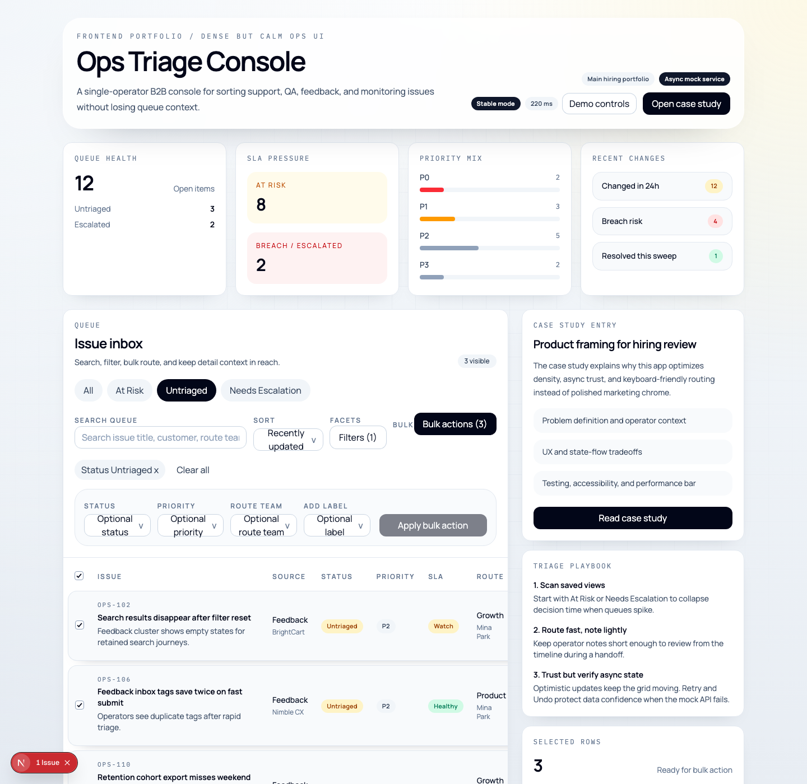
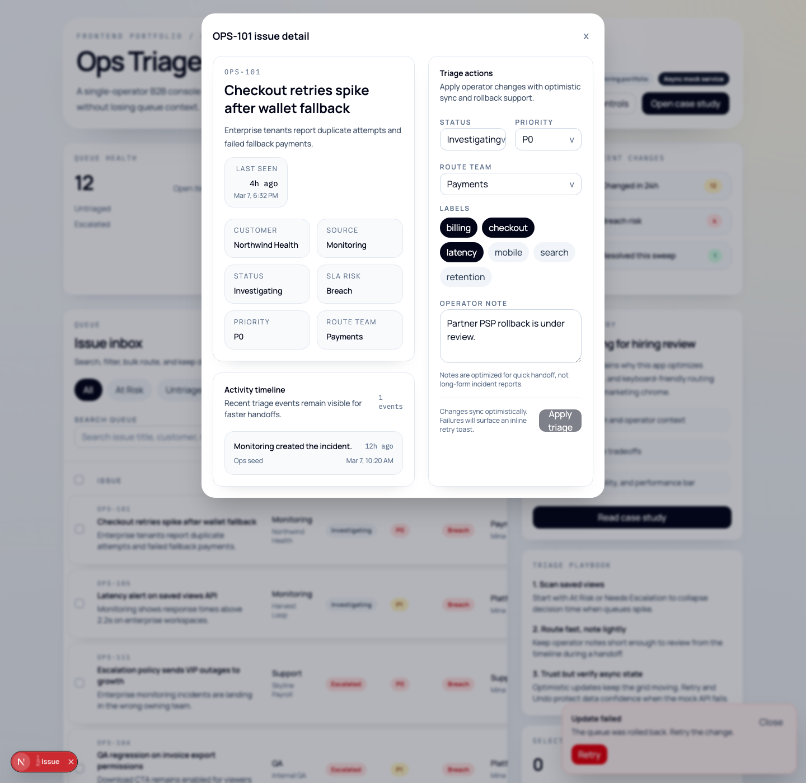
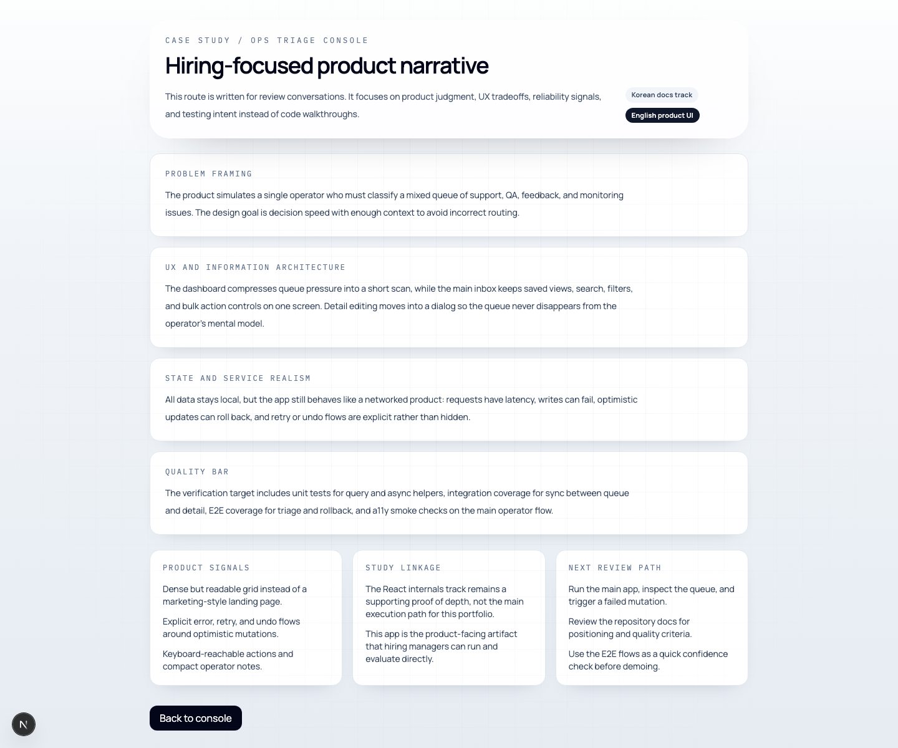

# Ops Triage Console 발표 문서

이 문서는 면접이나 포트폴리오 리뷰 자리에서 `Ops Triage Console`을 6분에서 8분 안에 설명하기 위한 발표용 문서다. 라이브 데모가 가능하면 그대로 따라가고, 환경이 불안정하면 아래 캡처 순서대로 진행하면 된다.

## 발표 목표

- 이 앱이 "예쁜 데모"가 아니라 실제 운영 콘솔 문제를 푼 결과물이라는 점을 보여 준다.
- 데이터가 많은 화면에서도 정보 구조, 상태 전이, 오류 복구를 설계할 수 있다는 점을 보여 준다.
- mock 환경이어도 제품형 품질 기준과 테스트 문화를 같이 가져갔다는 점을 증명한다.

## 발표 구성

1. 문제와 사용자
2. Dashboard와 queue overview
3. Saved view 기반 triage 흐름
4. Issue detail 편집과 optimistic update
5. Bulk action과 운영 효율
6. 실패 주입, retry, undo
7. 품질 검증과 한계

## 1. 문제와 사용자

한 명의 운영자가 support, QA, customer feedback, monitoring에서 올라온 이슈를 한곳에서 분류해야 한다는 가정으로 시작한다. 이 앱은 "무엇을 우선 처리할지", "어느 팀으로 보낼지", "잘못된 변경을 어떻게 복구할지"를 한 화면 흐름 안에서 해결하도록 설계했다.

발표 멘트:

- consumer UI보다 운영 화면을 택한 이유는 정보 밀도와 상태 전이 설계 능력을 더 직접적으로 보여 주기 위해서다.
- queue를 잃지 않는 것이 중요하므로 detail은 별도 페이지가 아니라 dialog로 열리게 했다.

## 2. Dashboard와 queue overview



설명 포인트:

- 상단 summary는 queue health, SLA pressure, priority mix, recent changes를 짧은 스캔으로 압축한다.
- 아래 queue는 saved views, 검색, facet filter, 정렬, selection을 같은 작업 공간에 모아 두었다.
- 화면 톤은 밝지만 차분하게 유지해서 B2B 콘솔처럼 느껴지도록 했다.

## 3. Saved view 기반 triage 흐름



시나리오:

- `At Risk` saved view를 누른다.
- 운영자는 전체 queue를 뒤지는 대신 SLA 위험이 높은 subset만 바로 본다.
- 필터 조합을 매번 손으로 만드는 대신, 반복 작업을 saved view로 단축한다.

발표 멘트:

- "search first"보다 "view first"가 더 빠른 운영 상황을 가정했다.
- 채용 관점에서는 이 지점이 단순 CRUD가 아니라 업무 흐름을 모델링했다는 증거다.

## 4. Issue detail 편집과 optimistic update



시나리오:

- `OPS-101`을 열고 status, priority, route team, operator note를 바꾼다.
- 적용 즉시 queue와 summary가 갱신된다.
- 성공 이후에는 `Undo`를 보여 줘서 "실패 복구"가 아니라 "잘못된 성공 복구"까지 다룬다.

발표 멘트:

- detail을 dialog로 둔 이유는 queue 문맥을 유지하려는 판단이다.
- optimistic update를 썼기 때문에 체감 속도는 빠르지만, 그만큼 rollback과 sync 전략을 같이 설계해야 했다.

## 5. Bulk action과 운영 효율



시나리오:

- `Untriaged` view로 이동한다.
- 여러 row를 선택하고 한 번에 status와 route를 바꾼다.
- 결과가 비면 empty state가 자연스럽게 이어진다.

발표 멘트:

- 운영 콘솔에서는 개별 수정만큼 묶음 작업이 중요하다.
- 이 동선은 "사용자가 반복 클릭을 몇 번 덜 하게 했는가"를 설명하기 좋은 장면이다.

## 6. 실패 주입, retry, undo



시나리오:

- runtime control로 실패를 주입하거나, 미리 설정된 failure 상태에서 triage를 시도한다.
- 변경이 실패하면 rollback하고 `Retry` action을 노출한다.
- 성공하면 다시 `Undo` 흐름을 보여 줄 수 있다.

발표 멘트:

- mock 앱이어도 네트워크형 UX를 숨기지 않았다.
- 이 프로젝트의 핵심은 happy path보다 error, retry, rollback을 공개적으로 설계했다는 점이다.

## 7. Case study route와 품질 근거



설명 포인트:

- `/case-study`는 코드 대신 제품 판단을 설명하는 면접용 진입점이다.
- 테스트 범위는 unit, integration, E2E로 나누었고 keyboard-only 흐름도 실제로 검증했다.
- live demo가 불안정하면 이 route와 캡처만으로도 제품 의도를 설명할 수 있다.

## 발표 마무리

마지막 멘트 예시:

- 이 앱은 "React를 직접 만들 수 있다"보다 "운영자가 실제로 쓸 만한 화면을 설계하고 검증할 수 있다"를 보여 주는 포트폴리오다.
- 다음 단계로는 command palette, column customization, multi-operator audit trail을 추가해 제품성을 더 높일 수 있다.

## 라이브 데모 체크리스트

```bash
cd study
npm run dev:portfolio
```

데모 순서:

1. 홈 진입 후 summary와 queue를 20초 안에 소개한다.
2. `At Risk` view를 열고 `OPS-101` detail dialog를 보여 준다.
3. status를 바꾸고 `Undo`를 시연한다.
4. `Untriaged` view에서 bulk update를 보여 준다.
5. failure simulation 후 `Retry`를 시연한다.
6. `/case-study`로 이동해 품질 근거와 한계를 설명한다.
