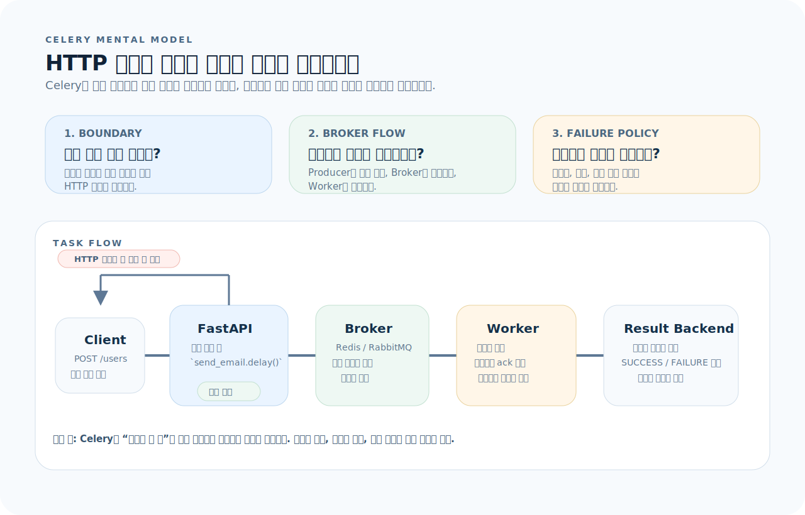
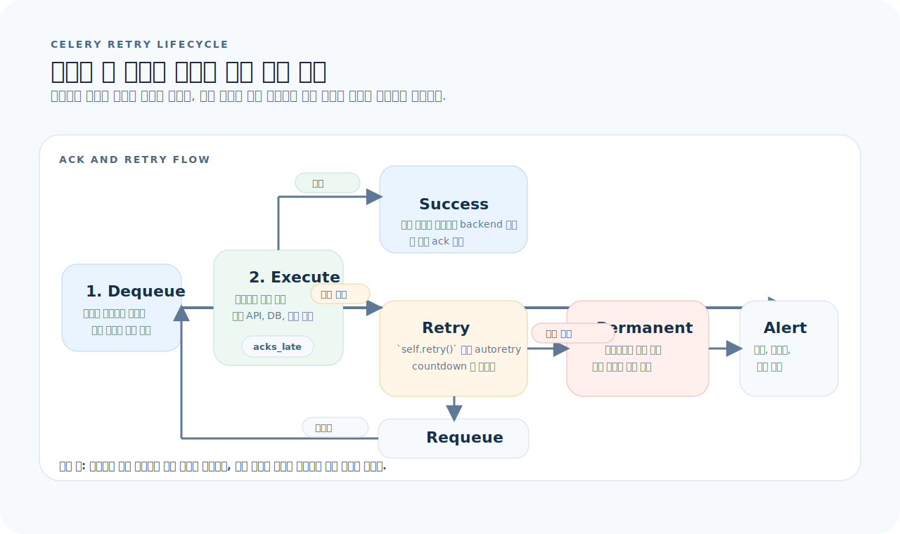
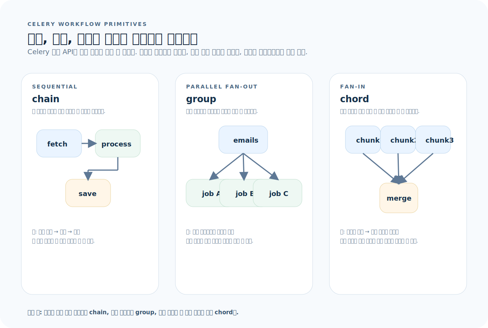

# Celery 완전 가이드

Celery는 Python 비동기 작업 큐다. 무거운 작업(이메일 전송, 이미지 처리, 리포트 생성)을 HTTP 요청 밖으로 밀어내고, 별도 워커 프로세스에서 실행한다. 브로커(Redis, RabbitMQ)가 메시지를 전달하고, 워커가 소비하며, 백엔드가 결과를 저장한다. 이 글을 읽고 나면 Celery 태스크를 정의하고, 스케줄링하며, 장애 시 재시도하는 패턴을 다룰 수 있다.

먼저 아래 세 질문을 기준으로 읽으면 Celery 코드가 훨씬 빨리 정리된다.

1. **태스크 경계:** 이 작업이 HTTP 응답 안에서 끝나야 하는가, 아니면 큐로 밀어내야 하는가?
2. **브로커 흐름:** 메시지가 Producer → Broker → Worker → Result Backend를 어떤 순서로 통과하는가?
3. **실패 전략:** 이 태스크가 실패하면 재시도할 것인가, 버릴 것인가, 보상 작업을 실행할 것인가?

---

## 1. Celery의 사고방식

Celery는 "지금 당장 끝내지 않아도 되는 작업을 나중에, 다른 곳에서 실행하는" 시스템이다.



이 그림은 이 문서 전체를 읽는 기준표다. 먼저 아래 세 질문으로 읽으면 된다.

1. **태스크 경계:** 이 작업은 HTTP 응답을 붙잡아 두는가, 아니면 `delay()`로 큐에 밀어내는가?
2. **브로커 흐름:** Producer, Broker, Worker, Result Backend가 어떤 순서로 책임을 나누는가?
3. **실패 전략:** 재시도, 폐기, 보상 작업 중 무엇이 이 태스크의 기본 정책인가?

그림을 왼쪽에서 오른쪽으로 읽으면 핵심은 단순하다. 애플리케이션은 "일을 직접 끝내는" 대신 "일을 큐에 등록"하고, 워커는 그 큐를 비동기로 소모한다. 즉 Celery 설계는 `HTTP 응답 분리`, `브로커 기반 전달`, `실패 후 재처리 정책` 세 축으로 정리된다.

**핵심 구분:**
- **Producer**: 태스크를 큐에 넣는 쪽 (FastAPI, Django, 스크립트)
- **Broker**: 메시지를 버퍼링하고 전달하는 중간자 (Redis가 가장 흔함)
- **Worker**: 메시지를 꺼내 태스크를 실행하는 프로세스
- **Result Backend**: 태스크 반환값을 저장하는 저장소 (필요할 때만)

---

## 2. 설치와 초기 설정

```bash
uv add celery[redis]
# 또는
pip install celery[redis]
```

### Celery 인스턴스

```python
# app/worker.py
from celery import Celery

celery_app = Celery(
    "myapp",
    broker="redis://localhost:6379/0",
    backend="redis://localhost:6379/1",
)

celery_app.conf.update(
    task_serializer="json",
    accept_content=["json"],
    result_serializer="json",
    timezone="Asia/Seoul",
    enable_utc=True,
    task_track_started=True,
    task_acks_late=True,          # 실행 완료 후 ack (장애 시 재전달)
    worker_prefetch_multiplier=1,  # 워커당 한 태스크씩 가져오기
)
```

### 프로젝트 구조

```
app/
├── worker.py              # Celery 인스턴스
├── tasks/
│   ├── __init__.py
│   ├── email.py           # 이메일 관련 태스크
│   ├── report.py          # 리포트 생성 태스크
│   └── cleanup.py         # 정리 태스크
├── config.py              # 설정
└── main.py                # FastAPI 앱
```

---

## 3. 태스크 정의

### 기본 태스크

```python
# app/tasks/email.py
from app.worker import celery_app

@celery_app.task
def send_welcome_email(user_id: int, email: str) -> dict:
    """환영 이메일을 보낸다."""
    # 실제 이메일 전송 로직
    result = email_service.send(
        to=email,
        subject="환영합니다",
        template="welcome",
    )
    return {"status": "sent", "message_id": result.id}
```

### 태스크 호출

```python
# 비동기 호출 (가장 흔한 패턴)
send_welcome_email.delay(user_id=1, email="alice@example.com")

# 옵션 지정 호출
send_welcome_email.apply_async(
    args=[1, "alice@example.com"],
    countdown=60,              # 60초 후 실행
    expires=3600,              # 1시간 내 실행 안 되면 폐기
    queue="email",             # 특정 큐로 전송
)

# 결과 받기 (필요한 경우만)
result = send_welcome_email.delay(1, "alice@example.com")
result.id                      # 태스크 ID
result.status                  # PENDING, STARTED, SUCCESS, FAILURE
result.get(timeout=30)         # 결과 대기 (블로킹)
```

### FastAPI에서 호출

```python
from fastapi import APIRouter
from app.tasks.email import send_welcome_email

router = APIRouter()

@router.post("/users")
async def create_user(request: UserCreateRequest):
    user = await user_service.create(request)
    # 이메일은 비동기로 보낸다 — HTTP 응답을 기다리게 하지 않는다
    send_welcome_email.delay(user.id, user.email)
    return UserResponse.from_model(user)
```

---

## 4. 재시도

태스크 실패 시 자동 재시도는 Celery의 핵심 기능이다.



- `ConnectionError`, `TimeoutError`처럼 일시적 장애는 재큐잉 대상으로 본다.
- `task_acks_late=True`를 켜면 성공 시점에만 ack해서 워커 crash 시 재전달을 기대할 수 있다.
- 영구 오류는 무한 재시도보다 실패 상태 기록, 알림, 보상 작업으로 끊어 주는 편이 안전하다.

```python
@celery_app.task(
    bind=True,                    # self 접근 가능
    max_retries=3,
    default_retry_delay=60,       # 60초 후 재시도
)
def send_notification(self, user_id: int, message: str):
    try:
        result = notification_service.send(user_id, message)
        return {"status": "sent"}
    except ConnectionError as exc:
        # 지수 백오프 재시도
        raise self.retry(exc=exc, countdown=2 ** self.request.retries * 30)
    except PermanentError:
        # 재시도하지 않는 영구 오류
        return {"status": "failed", "reason": "permanent"}
```

### autoretry 데코레이터

```python
@celery_app.task(
    autoretry_for=(ConnectionError, TimeoutError),
    retry_backoff=True,            # 지수 백오프
    retry_backoff_max=600,         # 최대 10분
    retry_kwargs={"max_retries": 5},
)
def fetch_external_data(url: str) -> dict:
    response = httpx.get(url, timeout=10)
    response.raise_for_status()
    return response.json()
```

---

## 5. 워크플로 — 태스크 합성

태스크 합성은 "무엇을 언제 병렬화할지"를 드러내는 구간이다. `chain`, `group`, `chord`는 이름보다 데이터 흐름으로 읽는 편이 빠르다.



- `chain`: 앞 태스크의 결과를 다음 태스크 입력으로 넘기는 순차 파이프라인
- `group`: 서로 독립적인 태스크를 팬아웃해서 병렬 처리
- `chord`: 병렬 태스크가 모두 끝난 뒤 집계 콜백을 한 번 실행

```python
from celery import chain, group, chord

# chain — 순차 실행 (앞 태스크의 결과가 다음의 첫 인자로)
workflow = chain(
    fetch_data.s(url),
    process_data.s(),
    save_result.s(),
)
workflow.delay()

# group — 병렬 실행
batch = group(
    send_email.s(email) for email in email_list
)
result = batch.delay()

# chord — 병렬 실행 후 콜백
workflow = chord(
    [process_chunk.s(chunk) for chunk in chunks],
    merge_results.s()
)
workflow.delay()
```

---

## 6. 주기적 태스크 — Celery Beat

```python
# app/worker.py
from celery.schedules import crontab

celery_app.conf.beat_schedule = {
    "cleanup-expired-sessions": {
        "task": "app.tasks.cleanup.cleanup_expired_sessions",
        "schedule": crontab(minute=0, hour="*/6"),    # 6시간마다
    },
    "daily-report": {
        "task": "app.tasks.report.generate_daily_report",
        "schedule": crontab(minute=0, hour=9),         # 매일 09:00
    },
    "health-check": {
        "task": "app.tasks.health.ping_services",
        "schedule": 300.0,                             # 5분마다 (초 단위)
    },
}
```

```bash
# Beat 스케줄러 실행 (워커와 별도 프로세스)
celery -A app.worker beat --loglevel=info
```

---

## 7. 큐와 라우팅

```python
# 큐 정의
celery_app.conf.task_queues = {
    "default": {"exchange": "default", "routing_key": "default"},
    "email": {"exchange": "email", "routing_key": "email"},
    "heavy": {"exchange": "heavy", "routing_key": "heavy"},
}

celery_app.conf.task_routes = {
    "app.tasks.email.*": {"queue": "email"},
    "app.tasks.report.*": {"queue": "heavy"},
}
```

```bash
# 특정 큐만 소비하는 워커
celery -A app.worker worker -Q email --concurrency=2
celery -A app.worker worker -Q heavy --concurrency=1
celery -A app.worker worker -Q default,email --concurrency=4
```

---

## 8. 모니터링

### Flower — 웹 대시보드

```bash
uv add flower
celery -A app.worker flower --port=5555
# http://localhost:5555
```

### CLI 도구

```bash
# 활성 태스크 확인
celery -A app.worker inspect active

# 등록된 태스크 목록
celery -A app.worker inspect registered

# 큐 상태
celery -A app.worker inspect active_queues

# 통계
celery -A app.worker inspect stats
```

---

## 9. Docker Compose 구성

```yaml
services:
  redis:
    image: redis:7-alpine
    ports: ["6379:6379"]

  worker:
    build: .
    command: celery -A app.worker worker --loglevel=info --concurrency=4
    depends_on: [redis]
    environment:
      CELERY_BROKER_URL: redis://redis:6379/0
      CELERY_RESULT_BACKEND: redis://redis:6379/1

  beat:
    build: .
    command: celery -A app.worker beat --loglevel=info
    depends_on: [redis]
    environment:
      CELERY_BROKER_URL: redis://redis:6379/0

  flower:
    build: .
    command: celery -A app.worker flower --port=5555
    ports: ["5555:5555"]
    depends_on: [redis]
    environment:
      CELERY_BROKER_URL: redis://redis:6379/0
```

---

## 10. 테스트

```python
# conftest.py
import pytest
from app.worker import celery_app

@pytest.fixture(autouse=True)
def celery_eager_mode():
    """태스크를 동기적으로 즉시 실행한다."""
    celery_app.conf.task_always_eager = True
    celery_app.conf.task_eager_propagates = True
    yield
    celery_app.conf.task_always_eager = False
    celery_app.conf.task_eager_propagates = False

# test_tasks.py
def test_send_welcome_email():
    result = send_welcome_email.delay(1, "test@example.com")
    assert result.get()["status"] == "sent"

def test_retry_on_failure(mocker):
    mocker.patch("app.tasks.email.email_service.send",
                 side_effect=ConnectionError)
    with pytest.raises(ConnectionError):
        send_welcome_email.delay(1, "test@example.com")
```

---

## 11. 자주 하는 실수

| 실수 | 올바른 방법 |
|------|-------------|
| 태스크에 ORM 객체를 인자로 전달 | ID만 전달하고 워커에서 다시 조회 |
| `result.get()`으로 HTTP 핸들러에서 블로킹 | 결과가 필요하면 폴링 엔드포인트를 만든다 |
| `task_acks_late` 없이 운영 | 워커 crash 시 메시지 유실 방지를 위해 켠다 |
| 브로커 연결 실패 시 재시도 없음 | `autoretry_for`와 `retry_backoff` 설정 |
| Beat와 Worker를 같은 프로세스로 실행 | 별도 프로세스로 분리 |
| 모든 태스크를 default 큐에 넣기 | 우선순위에 따라 큐를 분리 |
| 태스크 결과를 항상 저장 | `ignore_result=True`로 불필요한 저장 방지 |

---

## 12. 빠른 참조

```python
# ── 인스턴스 ──
app = Celery("myapp", broker="redis://localhost:6379/0")

# ── 태스크 정의 ──
@app.task
def my_task(arg): return result

@app.task(bind=True, max_retries=3)
def retry_task(self, arg):
    try: ...
    except Error as e: raise self.retry(exc=e, countdown=60)

# ── 호출 ──
my_task.delay(arg)                      # 즉시 큐 전송
my_task.apply_async(args=[arg], countdown=60)  # 60초 후
my_task.apply_async(args=[arg], queue="heavy") # 특정 큐

# ── 워크플로 ──
chain(a.s(), b.s(), c.s())()            # 순차
group(a.s(x) for x in items)()          # 병렬
chord([a.s(x) for x in items], b.s())() # 병렬 → 콜백

# ── 실행 ──
# celery -A app.worker worker --loglevel=info
# celery -A app.worker beat --loglevel=info
# celery -A app.worker flower --port=5555
```
