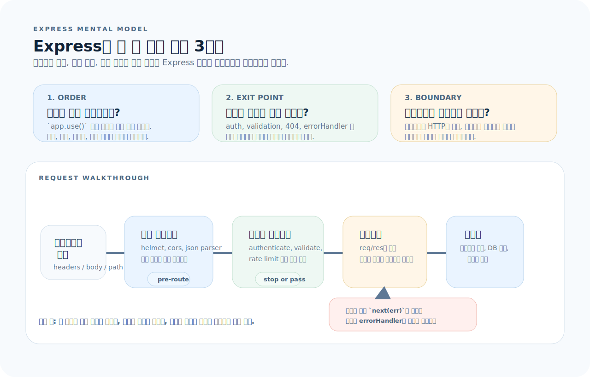
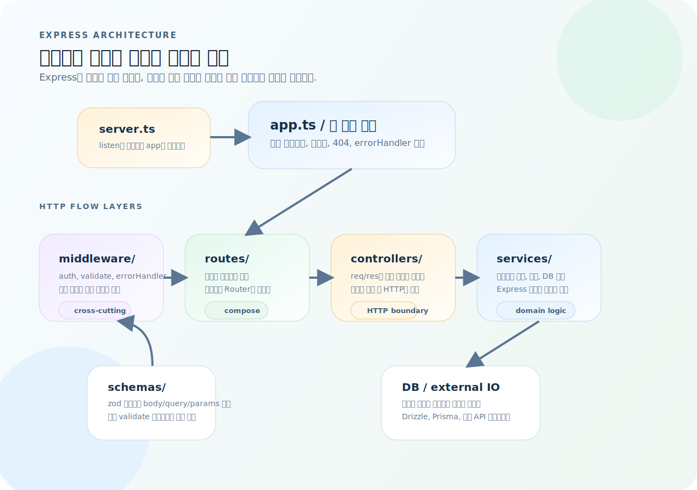
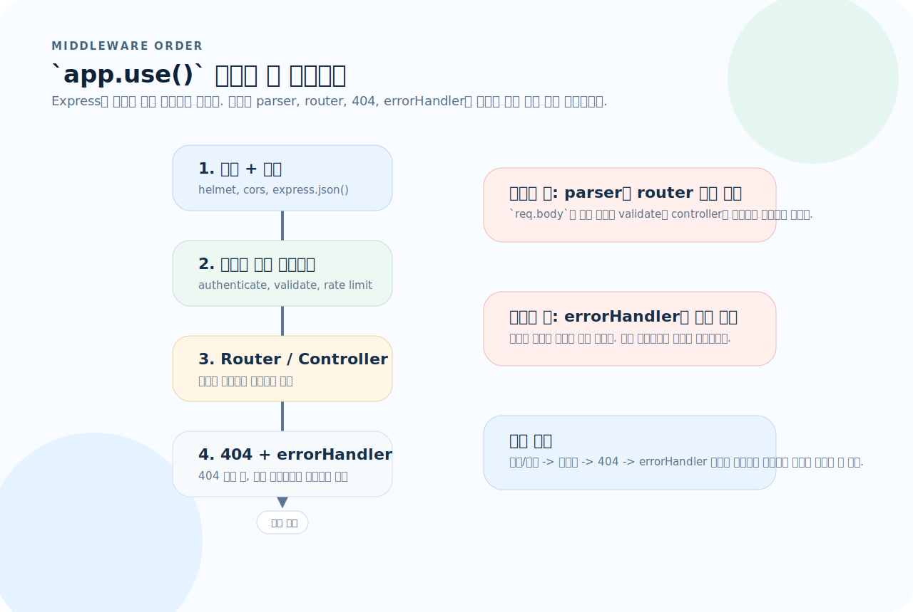
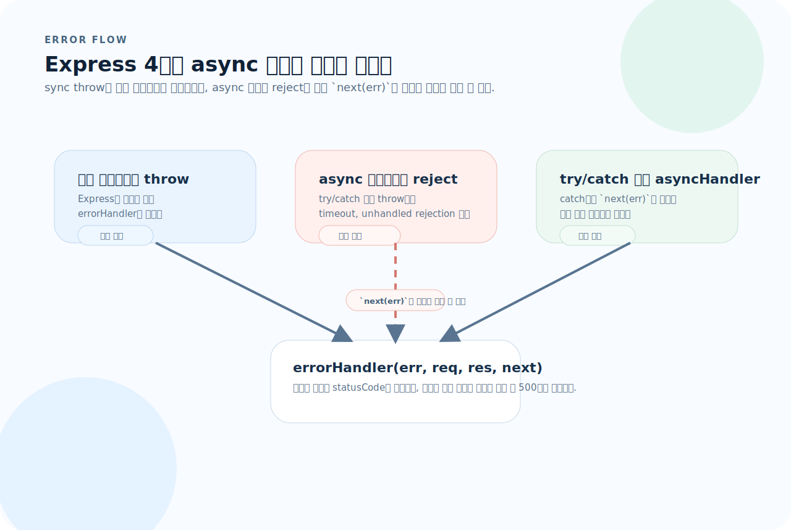

# Express 완전 가이드

Express는 Node.js 위에서 HTTP 서버를 만드는 가장 널리 쓰이는 프레임워크다. 의도적으로 얇게 설계되어 있어서 "미들웨어 파이프라인"이라는 단 하나의 개념만 제대로 잡으면 나머지는 자연스럽게 따라온다. 이 글을 읽고 나면 Express로 프로덕션 수준의 REST API를 설계하고 구현할 수 있게 된다.

---

## 1. Express의 사고방식

Express는 기능 목록으로 외우기보다, 요청 하나가 어떤 순서로 흐르고 어디서 멈추는지를 먼저 잡는 편이 훨씬 이해가 빠르다.



이 그림은 이 문서 전체를 읽는 기준표다. 먼저 아래 세 질문으로 읽으면 된다.

1. **순서:** 어떤 미들웨어가 먼저 실행되고, 무엇이 라우터 앞에서 요청을 가공하는가?
2. **종료 지점:** 인증, 검증, 404, 에러 처리 중 어디서 응답을 끝낼 수 있는가?
3. **경계:** 컨트롤러에 남길 것과 서비스로 내릴 것을 어떻게 나눌 것인가?

NestJS 같은 "자기주장이 강한" 프레임워크와 달리, Express는 아무것도 강제하지 않는다. 구조도, 검증도, 에러 처리도 전부 개발자가 직접 구성해야 한다. 이것이 장점이자 단점이다.

---

## 2. 프로젝트 초기 설정

아래 구조도는 최소 폴더 구조를 "책임의 흐름"으로 다시 정리한 것이다. Express는 자유도가 높아서, 디렉터리 이름보다 어떤 계층이 어느 계층을 호출하는지가 더 중요하다.



이 그림을 기준으로 보면 구조가 빠르게 잡힌다.

- `server.ts`는 listen만 담당하고 `app`을 실행한다.
- `app.ts`는 전역 미들웨어, 라우터, 404, errorHandler를 조립한다.
- `routes/ -> controllers/ -> services/` 순서로 HTTP와 비즈니스 로직을 분리한다.
- `middleware/`와 `schemas/`는 횡단 관심사와 검증 규칙을 공급한다.

### 최소 프로젝트 구조

```
src/
├── app.ts              # Express 앱 생성, 미들웨어·라우터 등록
├── server.ts           # 서버 기동 (listen)
├── routes/
│   ├── index.ts        # 라우터 집합
│   └── book.routes.ts  # 개별 도메인 라우터
├── controllers/
│   └── book.controller.ts
├── services/
│   └── book.service.ts
├── middleware/
│   ├── auth.ts
│   ├── validate.ts
│   └── errorHandler.ts
├── schemas/
│   └── book.schema.ts  # zod 등 검증 스키마
└── types/
    └── express.d.ts    # req 확장 타입
```

### 초기화

```bash
mkdir my-api && cd my-api
npm init -y
npm install express cors helmet
npm install -D typescript @types/express @types/node @types/cors tsx
npx tsc --init
```

`tsconfig.json` 핵심 설정:

```json
{
  "compilerOptions": {
    "target": "ES2022",
    "module": "NodeNext",
    "moduleResolution": "NodeNext",
    "outDir": "dist",
    "rootDir": "src",
    "strict": true,
    "esModuleInterop": true,
    "skipLibCheck": true
  },
  "include": ["src"]
}
```

`package.json` scripts:

```json
{
  "scripts": {
    "dev": "tsx watch src/server.ts",
    "build": "tsc",
    "start": "node dist/server.js",
    "test": "vitest run"
  }
}
```

---

## 3. 앱 생성과 미들웨어 파이프라인

Express에서는 "무엇을 등록했는가"보다 "어떤 순서로 등록했는가"가 더 중요하다. 아래 다이어그램은 `app.ts`를 읽을 때 따라야 할 기본 순서를 보여준다.



그림 기준으로 보면 운영 규칙은 단순하다.

- parser와 보안 미들웨어는 라우터보다 먼저 둔다.
- 404 처리는 라우터 뒤에 둔다.
- `errorHandler`는 반드시 마지막에 둔다.

### app.ts — 미들웨어 등록 순서가 곧 동작이다

```ts
import express from "express";
import cors from "cors";
import helmet from "helmet";
import { bookRouter } from "./routes/book.routes";
import { errorHandler } from "./middleware/errorHandler";

const app = express();

// ── 1단계: 보안·파싱 미들웨어 (가장 먼저) ──
app.use(helmet());                         // 보안 헤더 자동 설정
app.use(cors({ origin: "http://localhost:3000" }));
app.use(express.json({ limit: "10kb" }));  // body 파싱 + 크기 제한

// ── 2단계: 라우터 등록 ──
app.use("/api/books", bookRouter);

// ── 3단계: 404 처리 ──
app.use((_req, res) => {
  res.status(404).json({ message: "Not Found" });
});

// ── 4단계: 전역 에러 핸들러 (반드시 마지막) ──
app.use(errorHandler);

export { app };
```

**핵심 규칙:** 미들웨어 등록 순서를 바꾸면 동작이 완전히 달라진다. `express.json()`을 라우터 뒤에 두면 body 파싱이 안 된다. `errorHandler`를 라우터 앞에 두면 에러를 잡지 못한다.

### server.ts — 앱과 서버를 분리한다

```ts
import { app } from "./app";

const PORT = process.env.PORT ?? 3000;

app.listen(PORT, () => {
  console.log(`Server running on port ${PORT}`);
});
```

앱(`app.ts`)과 서버(`server.ts`)를 분리하면 테스트에서 `app`만 import해서 supertest로 검증할 수 있다.

---

## 4. 라우팅

### Router로 도메인 분리

Express의 `Router`는 미니 앱이다. 각 도메인(books, users, orders 등)별로 라우터를 분리한다.

```ts
// src/routes/book.routes.ts
import { Router } from "express";
import { BookController } from "../controllers/book.controller";
import { validate } from "../middleware/validate";
import { createBookSchema, updateBookSchema } from "../schemas/book.schema";
import { authenticate } from "../middleware/auth";

const router = Router();
const controller = new BookController();

router.get("/", controller.findAll);
router.get("/:id", controller.findOne);
router.post("/", authenticate, validate(createBookSchema), controller.create);
router.put("/:id", authenticate, validate(updateBookSchema), controller.update);
router.delete("/:id", authenticate, controller.remove);

export { router as bookRouter };
```

### 라우트 파라미터와 쿼리

```ts
// GET /api/books/42          → req.params.id === "42"
// GET /api/books?page=2&size=10 → req.query.page === "2"

router.get("/:id", (req, res) => {
  const { id } = req.params;       // 항상 string
  const page = Number(req.query.page) || 1;
  // ...
});
```

**주의:** `req.params`와 `req.query`의 값은 항상 `string`이다. 숫자로 쓰려면 명시적으로 변환해야 한다.

### 라우터 중첩

```ts
// src/routes/index.ts
import { Router } from "express";
import { bookRouter } from "./book.routes";
import { userRouter } from "./user.routes";

const router = Router();
router.use("/books", bookRouter);
router.use("/users", userRouter);

export { router as apiRouter };
```

```ts
// app.ts
app.use("/api", apiRouter);
// 결과: /api/books/..., /api/users/...
```

---

## 5. 미들웨어 심화

미들웨어는 `(req, res, next) => void` 시그니처를 가진 함수다. `next()`를 호출하면 다음 미들웨어로 넘어가고, 호출하지 않으면 체인이 끊긴다.

### 미들웨어의 세 가지 역할

```ts
// 1. 통과형 — 요청을 가공하고 다음으로 넘긴다
const requestLogger = (req: Request, _res: Response, next: NextFunction) => {
  console.log(`${req.method} ${req.path}`);
  next();
};

// 2. 차단형 — 조건에 따라 응답을 끊는다
const authenticate = (req: Request, res: Response, next: NextFunction) => {
  const token = req.headers.authorization?.split(" ")[1];
  if (!token) {
    res.status(401).json({ message: "Unauthorized" });
    return;
  }
  try {
    const payload = verifyToken(token);
    req.user = payload;     // 요청 스코프에 정보 저장
    next();
  } catch {
    res.status(401).json({ message: "Invalid token" });
  }
};

// 3. 에러 핸들러 — 인자가 4개면 에러 미들웨어다
const errorHandler = (
  err: Error,
  _req: Request,
  res: Response,
  _next: NextFunction,
) => {
  console.error(err.stack);
  res.status(500).json({ message: "Internal Server Error" });
};
```

### 미들웨어 적용 범위

```ts
// 전역 — 모든 요청에 적용
app.use(requestLogger);

// 경로별 — 특정 prefix 아래에만 적용
app.use("/api/admin", adminAuth, adminRouter);

// 라우트별 — 특정 엔드포인트에만 적용
router.post("/", authenticate, validate(schema), controller.create);
```

### req 확장 타입

Express의 `req`에 커스텀 속성(예: `req.user`)을 추가하려면 타입을 확장해야 한다.

```ts
// src/types/express.d.ts
declare global {
  namespace Express {
    interface Request {
      user?: {
        id: string;
        email: string;
        role: string;
      };
    }
  }
}
export {};
```

---

## 6. 컨트롤러와 서비스 분리

위 구조도에서 `routes` 뒤에 오는 계층이 컨트롤러와 서비스다. Express가 강제하지 않지만, 반드시 지켜야 하는 아키텍처 원칙이 있다.

- **컨트롤러:** HTTP 요청을 받아 서비스에 전달하고, 응답을 구성한다. `req`와 `res`를 아는 유일한 계층이다.
- **서비스:** 비즈니스 로직을 담당한다. HTTP 개념(`req`, `res`)을 모른다.

### 컨트롤러

```ts
// src/controllers/book.controller.ts
import { Request, Response, NextFunction } from "express";
import { BookService } from "../services/book.service";

export class BookController {
  private service = new BookService();

  findAll = async (_req: Request, res: Response, next: NextFunction) => {
    try {
      const books = await this.service.findAll();
      res.json(books);
    } catch (err) {
      next(err);   // 에러는 next()로 넘겨서 전역 핸들러가 처리
    }
  };

  findOne = async (req: Request, res: Response, next: NextFunction) => {
    try {
      const book = await this.service.findById(req.params.id);
      if (!book) {
        res.status(404).json({ message: "Book not found" });
        return;
      }
      res.json(book);
    } catch (err) {
      next(err);
    }
  };

  create = async (req: Request, res: Response, next: NextFunction) => {
    try {
      const book = await this.service.create(req.body);
      res.status(201).json(book);
    } catch (err) {
      next(err);
    }
  };

  update = async (req: Request, res: Response, next: NextFunction) => {
    try {
      const book = await this.service.update(req.params.id, req.body);
      if (!book) {
        res.status(404).json({ message: "Book not found" });
        return;
      }
      res.json(book);
    } catch (err) {
      next(err);
    }
  };

  remove = async (req: Request, res: Response, next: NextFunction) => {
    try {
      await this.service.remove(req.params.id);
      res.status(204).end();
    } catch (err) {
      next(err);
    }
  };
}
```

### 서비스

```ts
// src/services/book.service.ts
import { db } from "../db";
import { books } from "../db/schema";
import { eq } from "drizzle-orm";

interface CreateBookInput {
  title: string;
  author: string;
  isbn: string;
}

export class BookService {
  async findAll() {
    return db.select().from(books);
  }

  async findById(id: string) {
    const [book] = await db.select().from(books).where(eq(books.id, id));
    return book ?? null;
  }

  async create(input: CreateBookInput) {
    const [book] = await db.insert(books).values(input).returning();
    return book;
  }

  async update(id: string, input: Partial<CreateBookInput>) {
    const [book] = await db
      .update(books)
      .set(input)
      .where(eq(books.id, id))
      .returning();
    return book ?? null;
  }

  async remove(id: string) {
    await db.delete(books).where(eq(books.id, id));
  }
}
```

---

## 7. 요청 검증 (Validation)

Express는 검증을 내장하지 않는다. `zod`를 사용하면 타입 안전한 검증 미들웨어를 만들 수 있다.

```bash
npm install zod
```

### 검증 스키마

```ts
// src/schemas/book.schema.ts
import { z } from "zod";

export const createBookSchema = z.object({
  body: z.object({
    title: z.string().min(1).max(200),
    author: z.string().min(1).max(100),
    isbn: z.string().regex(/^\d{13}$/, "ISBN must be 13 digits"),
    publishedYear: z.number().int().min(1000).max(2100).optional(),
  }),
});

export const updateBookSchema = z.object({
  body: z.object({
    title: z.string().min(1).max(200).optional(),
    author: z.string().min(1).max(100).optional(),
    isbn: z.string().regex(/^\d{13}$/).optional(),
    publishedYear: z.number().int().min(1000).max(2100).optional(),
  }),
});

export type CreateBookInput = z.infer<typeof createBookSchema>["body"];
```

### 범용 검증 미들웨어

```ts
// src/middleware/validate.ts
import { Request, Response, NextFunction } from "express";
import { AnyZodObject, ZodError } from "zod";

export const validate =
  (schema: AnyZodObject) =>
  (req: Request, res: Response, next: NextFunction) => {
    try {
      schema.parse({
        body: req.body,
        query: req.query,
        params: req.params,
      });
      next();
    } catch (err) {
      if (err instanceof ZodError) {
        res.status(400).json({
          message: "Validation failed",
          errors: err.errors.map((e) => ({
            path: e.path.join("."),
            message: e.message,
          })),
        });
        return;
      }
      next(err);
    }
  };
```

---

## 8. 에러 처리

Express에서 에러 처리는 가장 많이 실수하는 영역이다.



특히 Express 4에서는 아래 원칙을 먼저 잡아야 한다.

- 동기 핸들러의 throw는 에러 미들웨어로 비교적 자연스럽게 흐른다.
- async 함수의 reject는 직접 `next(err)`로 넘기지 않으면 빠질 수 있다.
- 가장 안전한 습관은 `try/catch + next(err)` 또는 `asyncHandler` 래퍼를 표준으로 두는 것이다.

### 커스텀 에러 클래스

```ts
// src/errors/AppError.ts
export class AppError extends Error {
  constructor(
    public statusCode: number,
    message: string,
  ) {
    super(message);
    this.name = "AppError";
  }
}

export class NotFoundError extends AppError {
  constructor(resource: string) {
    super(404, `${resource} not found`);
  }
}

export class UnauthorizedError extends AppError {
  constructor(message = "Unauthorized") {
    super(401, message);
  }
}
```

### 전역 에러 핸들러

```ts
// src/middleware/errorHandler.ts
import { Request, Response, NextFunction } from "express";
import { AppError } from "../errors/AppError";

export const errorHandler = (
  err: Error,
  _req: Request,
  res: Response,
  _next: NextFunction,
) => {
  // 커스텀 에러 — 의도된 에러
  if (err instanceof AppError) {
    res.status(err.statusCode).json({ message: err.message });
    return;
  }

  // 예상치 못한 에러 — 500으로 처리
  console.error("Unexpected error:", err);
  res.status(500).json({ message: "Internal Server Error" });
};
```

### async 에러 처리의 함정

Express 4에서 async 함수의 에러는 자동으로 `next()`로 전달되지 않는다.

```ts
// ❌ 에러가 사라진다
router.get("/", async (req, res) => {
  const data = await someAsyncOp();   // 여기서 throw되면?
  res.json(data);                     // → 클라이언트는 응답 없이 timeout
});

// ✅ 방법 1: try/catch + next()
router.get("/", async (req, res, next) => {
  try {
    const data = await someAsyncOp();
    res.json(data);
  } catch (err) {
    next(err);
  }
});

// ✅ 방법 2: 래퍼 함수
const asyncHandler =
  (fn: (req: Request, res: Response, next: NextFunction) => Promise<void>) =>
  (req: Request, res: Response, next: NextFunction) =>
    fn(req, res, next).catch(next);

router.get("/", asyncHandler(async (req, res) => {
  const data = await someAsyncOp();
  res.json(data);
}));

// ✅ 방법 3: express-async-errors 패키지 (가장 간단)
// npm install express-async-errors
// app.ts 최상단에 import "express-async-errors";
```

> **Express 5(베타)** 에서는 async 에러가 자동으로 `next()`로 전달된다.

---

## 9. 인증과 인가

### JWT 인증 미들웨어

```ts
// src/middleware/auth.ts
import { Request, Response, NextFunction } from "express";
import jwt from "jsonwebtoken";
import { UnauthorizedError } from "../errors/AppError";

const JWT_SECRET = process.env.JWT_SECRET!;

export const authenticate = (
  req: Request,
  _res: Response,
  next: NextFunction,
) => {
  const header = req.headers.authorization;
  if (!header?.startsWith("Bearer ")) {
    throw new UnauthorizedError("Missing token");
  }

  try {
    const token = header.split(" ")[1];
    const payload = jwt.verify(token, JWT_SECRET) as {
      id: string;
      email: string;
      role: string;
    };
    req.user = payload;
    next();
  } catch {
    throw new UnauthorizedError("Invalid token");
  }
};
```

### 역할 기반 인가

```ts
export const authorize =
  (...roles: string[]) =>
  (req: Request, _res: Response, next: NextFunction) => {
    if (!req.user || !roles.includes(req.user.role)) {
      throw new AppError(403, "Forbidden");
    }
    next();
  };

// 사용
router.delete("/:id", authenticate, authorize("admin"), controller.remove);
```

---

## 10. 테스트

Express 앱 테스트는 `supertest`로 HTTP 레벨에서 검증한다.

```bash
npm install -D vitest supertest @types/supertest
```

```ts
// tests/book.test.ts
import { describe, it, expect, beforeEach } from "vitest";
import request from "supertest";
import { app } from "../src/app";

describe("GET /api/books", () => {
  it("returns 200 with book list", async () => {
    const res = await request(app).get("/api/books");

    expect(res.status).toBe(200);
    expect(Array.isArray(res.body)).toBe(true);
  });
});

describe("POST /api/books", () => {
  it("returns 400 when body is invalid", async () => {
    const res = await request(app)
      .post("/api/books")
      .set("Authorization", `Bearer ${testToken}`)
      .send({ title: "" });    // 빈 title → validation 실패

    expect(res.status).toBe(400);
    expect(res.body.errors).toBeDefined();
  });

  it("returns 201 when valid", async () => {
    const res = await request(app)
      .post("/api/books")
      .set("Authorization", `Bearer ${testToken}`)
      .send({
        title: "Clean Code",
        author: "Robert Martin",
        isbn: "9780132350884",
      });

    expect(res.status).toBe(201);
    expect(res.body.title).toBe("Clean Code");
  });

  it("returns 401 without token", async () => {
    const res = await request(app)
      .post("/api/books")
      .send({ title: "Test" });

    expect(res.status).toBe(401);
  });
});
```

---

## 11. 프로덕션 체크리스트

### 보안

```ts
import helmet from "helmet";
import rateLimit from "express-rate-limit";

app.use(helmet());   // 보안 헤더 자동 설정

// Rate limiting — 무차별 요청 방지
const limiter = rateLimit({
  windowMs: 15 * 60 * 1000,    // 15분
  max: 100,                     // IP당 100회
  standardHeaders: true,
  message: { message: "Too many requests" },
});
app.use("/api/", limiter);

// Body 크기 제한 — 대용량 payload 방지
app.use(express.json({ limit: "10kb" }));

// CORS — 허용 origin 명시
app.use(cors({
  origin: ["https://myapp.com"],
  credentials: true,
}));
```

### 로깅

```ts
import morgan from "morgan";

// 개발: 컬러 로그, 프로덕션: 구조화된 로그
if (process.env.NODE_ENV === "production") {
  app.use(morgan("combined"));
} else {
  app.use(morgan("dev"));
}
```

### 헬스체크

```ts
app.get("/health", (_req, res) => {
  res.json({ status: "ok", timestamp: new Date().toISOString() });
});
```

### graceful shutdown

```ts
const server = app.listen(PORT, () => {
  console.log(`Server running on port ${PORT}`);
});

process.on("SIGTERM", () => {
  console.log("SIGTERM received. Shutting down gracefully...");
  server.close(() => {
    console.log("Server closed");
    process.exit(0);
  });
});
```

---

## 12. 실전 패턴 모음

### 페이지네이션

```ts
router.get("/", async (req, res) => {
  const page = Math.max(1, Number(req.query.page) || 1);
  const size = Math.min(100, Math.max(1, Number(req.query.size) || 20));
  const offset = (page - 1) * size;

  const [items, [{ count }]] = await Promise.all([
    db.select().from(books).limit(size).offset(offset),
    db.select({ count: sql`count(*)` }).from(books),
  ]);

  res.json({
    data: items,
    pagination: {
      page,
      size,
      total: Number(count),
      totalPages: Math.ceil(Number(count) / size),
    },
  });
});
```

### 파일 업로드

```ts
import multer from "multer";

const upload = multer({
  limits: { fileSize: 5 * 1024 * 1024 },   // 5MB 제한
  fileFilter: (_req, file, cb) => {
    if (file.mimetype.startsWith("image/")) {
      cb(null, true);
    } else {
      cb(new AppError(400, "Only images are allowed"));
    }
  },
});

router.post("/avatar", authenticate, upload.single("file"), async (req, res) => {
  if (!req.file) {
    throw new AppError(400, "No file uploaded");
  }
  // req.file.buffer, req.file.mimetype, req.file.size
  const url = await storageService.upload(req.file);
  res.json({ url });
});
```

### 환경변수 관리

```ts
// src/config.ts
import { z } from "zod";

const envSchema = z.object({
  PORT: z.coerce.number().default(3000),
  NODE_ENV: z.enum(["development", "production", "test"]).default("development"),
  DATABASE_URL: z.string().url(),
  JWT_SECRET: z.string().min(32),
});

export const config = envSchema.parse(process.env);
```

---

## 13. Express vs NestJS — 언제 무엇을 쓸까

| 기준 | Express | NestJS |
|------|---------|--------|
| 구조 | 자유롭게 구성 | 모듈·컨트롤러·서비스 강제 |
| 학습 곡선 | 낮음 | 높음 (DI, 데코레이터) |
| 검증 | 직접 구성 (zod 등) | @nestjs/class-validator 내장 |
| 에러 처리 | 직접 구성 | Exception Filter 내장 |
| 적합한 규모 | 소~중규모 API, 마이크로서비스 | 대규모 모놀리스, 팀 프로젝트 |
| DI | 없음 (직접 구성) | 내장 IoC 컨테이너 |

---

## 14. 자주 하는 실수

| 실수 | 원인과 해결 |
|------|-------------|
| 미들웨어 등록 순서 무시 | `app.use()` 순서를 바꾸면 auth가 적용 안 되거나 body 파싱이 안 된다 |
| 컨트롤러에 비즈니스 로직 혼재 | 컨트롤러는 req/res 매핑만, 로직은 서비스에 둔다 |
| async 에러가 `next()` 없이 사라짐 | try/catch + next(), 래퍼 함수, 또는 express-async-errors 사용 |
| `res.json()` 후 추가 코드 실행 | `return res.json()`으로 함수를 즉시 종료하거나 `return` 추가 |
| 에러 핸들러 인자가 3개 | 에러 핸들러는 반드시 `(err, req, res, next)` 4개 인자여야 한다 |
| `req.params.id`를 숫자로 착각 | Express params/query는 항상 string. 명시적 변환 필요 |
| CORS 설정 누락 | 프론트엔드 다른 origin에서 호출 시 cors 미들웨어 필수 |
| 환경변수 검증 없이 사용 | 서버 시작 시 zod로 환경변수를 검증하면 런타임 에러를 방지한다 |

---

## 15. 빠른 참조

```ts
// ── 앱 생성 ──
const app = express();
app.use(express.json());
app.use(express.urlencoded({ extended: true }));

// ── 라우터 ──
const router = Router();
router.get("/", handler);
router.post("/", handler);
router.put("/:id", handler);
router.delete("/:id", handler);
app.use("/api/resource", router);

// ── 미들웨어 시그니처 ──
// 일반: (req, res, next) => void
// 에러: (err, req, res, next) => void   ← 반드시 4개

// ── 응답 메서드 ──
res.json(data);                  // JSON 응답
res.status(201).json(data);      // 상태코드 + JSON
res.status(204).end();           // No Content
res.redirect("/other");          // 리다이렉트
res.sendFile(absolutePath);      // 파일 전송

// ── 요청 데이터 접근 ──
req.body                 // POST/PUT body (express.json() 필요)
req.params.id            // URL 파라미터 (/books/:id)
req.query.page           // 쿼리스트링 (?page=1)
req.headers.authorization
req.cookies              // cookie-parser 필요
req.ip
req.method
req.path
```
