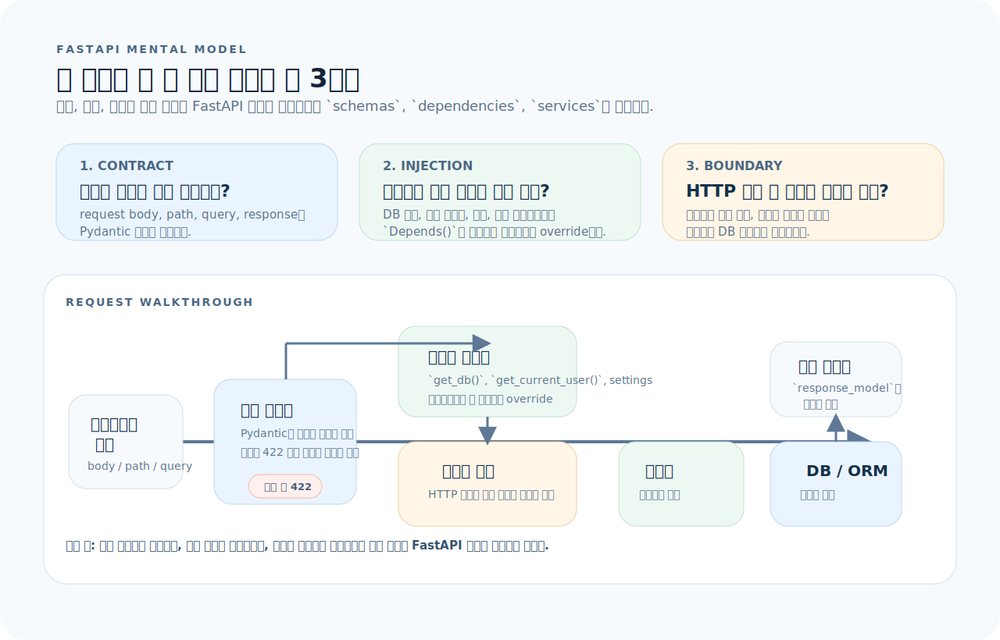
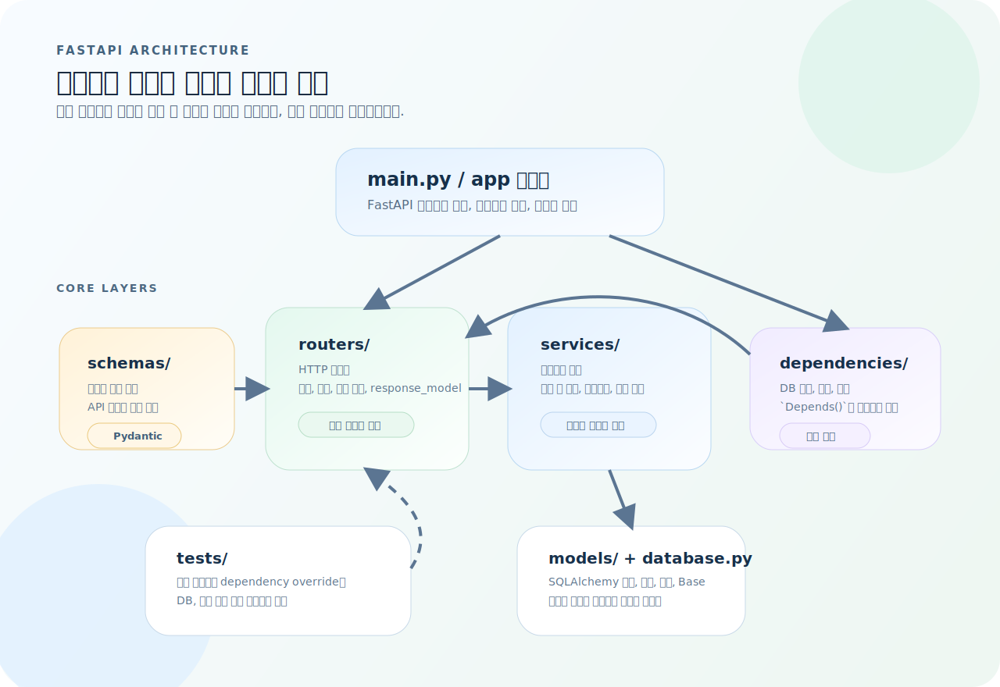
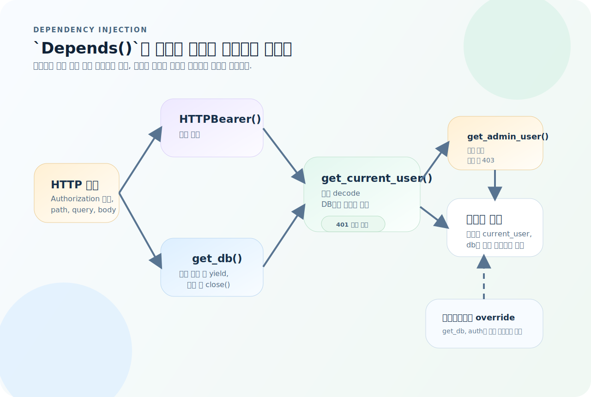
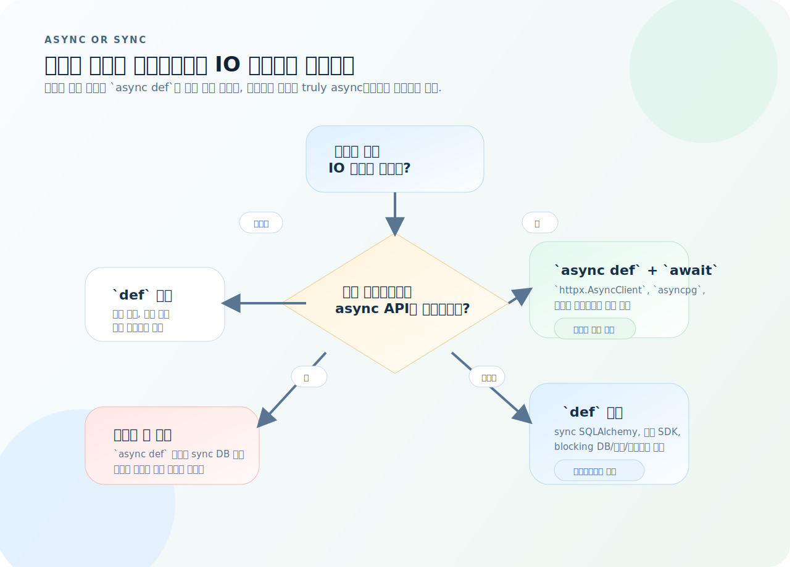

# FastAPI 완전 가이드

FastAPI는 Python으로 고성능 REST API를 만드는 현대적 프레임워크다. Pydantic 모델로 입출력을 선언하면 자동 검증·직렬화·OpenAPI 문서 생성이 따라오고, 의존성 주입(`Depends`)이 테스트와 구조를 동시에 잡아 준다. 이 글을 읽고 나면 FastAPI로 프로덕션 수준의 API 서버를 설계하고 구현할 수 있다.

---

## 1. FastAPI의 사고방식

FastAPI는 기능 목록으로 외우기보다, 요청 하나를 어떤 규칙으로 흘릴지 먼저 잡는 편이 훨씬 이해가 빠르다.



이 섹션의 그림은 장식이 아니라 이후 장 전체를 읽는 기준표다. 먼저 아래 세 질문으로 읽으면 된다.

1. **계약:** 이 엔드포인트의 입력과 출력은 어떤 Pydantic 모델로 고정되는가?
2. **주입:** 이 라우트가 직접 만들지 않고 `Depends()`로 받아야 할 자원은 무엇인가?
3. **경계:** HTTP 처리 외의 어떤 로직을 서비스 계층으로 내려보낼 것인가?

그림을 왼쪽에서 오른쪽으로 읽으면 요청은 스키마 검증을 통과하고, 의존성 그래프에서 필요한 자원을 공급받은 뒤, 얇은 라우트가 서비스를 호출하고, 마지막에 `response_model`로 다시 출력 계약에 맞춰 정리된다.

즉 FastAPI의 핵심은 `검증`, `주입`, `분리` 세 단어로 요약할 수 있고, 뒤 섹션들은 각각 이 세 축을 구체화한다.

---

## 2. 프로젝트 구조

아래 구조도는 이 문서 전체의 기준점이다. FastAPI 프로젝트는 보통 `라우트`, `스키마`, `서비스`, `의존성`, `DB 레이어`를 분리해서 읽는다.



이 그림을 기준으로 보면 역할이 빠르게 정리된다.

- `schemas/`는 요청과 응답의 계약을 정의한다.
- `routers/`는 HTTP 입구이며 검증된 입력을 서비스에 전달한다.
- `services/`는 비즈니스 로직과 트랜잭션 경계를 가진다.
- `dependencies/`는 DB 세션, 인증, 설정처럼 공통 자원을 주입한다.
- `tests/`는 실제 구현 대신 override를 넣어 구조를 검증한다.

```
app/
├── main.py              # FastAPI 인스턴스, 미들웨어, 라우터 등록
├── config.py            # 환경설정 (BaseSettings)
├── database.py          # 엔진, 세션, Base 선언
├── models/              # SQLAlchemy ORM 모델
│   ├── __init__.py
│   └── user.py
├── schemas/             # Pydantic 모델 (API 계약)
│   ├── __init__.py
│   └── user.py
├── routers/             # APIRouter별 라우트
│   ├── __init__.py
│   └── user.py
├── services/            # 비즈니스 로직
│   └── user.py
├── dependencies/        # 공통 Depends 함수
│   ├── auth.py
│   └── db.py
└── tests/
    ├── conftest.py
    └── test_user.py
```

### 초기 설정

```bash
uv init my-api && cd my-api
uv add fastapi uvicorn[standard] pydantic-settings sqlalchemy alembic
uv add --dev pytest httpx
```

---

## 3. 앱 생성과 구성

### main.py

```python
from contextlib import asynccontextmanager
from fastapi import FastAPI
from fastapi.middleware.cors import CORSMiddleware

from app.config import settings
from app.database import engine, Base
from app.routers import user_router, item_router


@asynccontextmanager
async def lifespan(app: FastAPI):
    # 시작 시 — DB 테이블 생성 (개발용)
    Base.metadata.create_all(bind=engine)
    yield
    # 종료 시 — 정리 작업


app = FastAPI(
    title="My API",
    version="0.1.0",
    lifespan=lifespan,
)

# CORS — 프론트엔드 연동 시 필수
app.add_middleware(
    CORSMiddleware,
    allow_origins=settings.cors_origins,
    allow_credentials=True,
    allow_methods=["*"],
    allow_headers=["*"],
)

# 라우터 등록
app.include_router(user_router, prefix="/api/users", tags=["users"])
app.include_router(item_router, prefix="/api/items", tags=["items"])


@app.get("/health")
def health():
    return {"status": "ok"}
```

### config.py — 환경변수 타입 안전 로드

```python
from pydantic_settings import BaseSettings


class Settings(BaseSettings):
    database_url: str = "sqlite:///./dev.db"
    jwt_secret: str = "change-me-in-production"
    jwt_algorithm: str = "HS256"
    jwt_expire_minutes: int = 30
    cors_origins: list[str] = ["http://localhost:3000"]
    debug: bool = False

    model_config = {"env_file": ".env"}


settings = Settings()
```

### 실행

```bash
uv run uvicorn app.main:app --reload                # 개발 서버
uv run uvicorn app.main:app --host 0.0.0.0 --port 8000  # 외부 접근
```

서버 시작 후 `http://localhost:8000/docs`에서 Swagger UI, `/redoc`에서 ReDoc 문서를 자동으로 볼 수 있다.

---

## 4. Pydantic 스키마 — API 계약

FastAPI에서 Pydantic 모델은 단순한 데이터 클래스가 아니라 **API 계약**이다. 타입이 맞지 않으면 422 응답이 자동 반환된다.

```python
# app/schemas/user.py
from pydantic import BaseModel, Field, EmailStr
from datetime import datetime


# ── 요청 모델 ──
class UserCreate(BaseModel):
    email: EmailStr
    password: str = Field(min_length=8, max_length=128)
    name: str = Field(min_length=1, max_length=100)


class UserUpdate(BaseModel):
    name: str | None = Field(None, min_length=1, max_length=100)
    email: EmailStr | None = None


# ── 응답 모델 ──
class UserResponse(BaseModel):
    id: int
    email: str
    name: str
    created_at: datetime

    model_config = {"from_attributes": True}    # ORM 객체 → Pydantic 변환 허용


# ── 목록 응답 (페이지네이션 포함) ──
class UserListResponse(BaseModel):
    data: list[UserResponse]
    total: int
    page: int
    size: int
```

**핵심 규칙:**
- **요청 모델과 응답 모델을 반드시 분리한다.** `UserCreate`에는 `password`가 있지만 `UserResponse`에는 없다.
- `from_attributes = True`를 설정해야 SQLAlchemy 객체를 Pydantic 모델로 변환할 수 있다.
- `Optional` 필드에는 반드시 기본값(`None`)을 지정한다.

---

## 5. 라우팅

### APIRouter로 모듈 분리

```python
# app/routers/user.py
from fastapi import APIRouter, Depends, HTTPException, Query
from sqlalchemy.orm import Session

from app.dependencies.db import get_db
from app.dependencies.auth import get_current_user
from app.schemas.user import UserCreate, UserUpdate, UserResponse, UserListResponse
from app.services.user import UserService

router = APIRouter()


@router.get("/", response_model=UserListResponse)
def list_users(
    page: int = Query(1, ge=1),
    size: int = Query(20, ge=1, le=100),
    db: Session = Depends(get_db),
):
    """사용자 목록을 페이지네이션하여 반환한다."""
    service = UserService(db)
    users, total = service.list_users(page=page, size=size)
    return UserListResponse(
        data=users,
        total=total,
        page=page,
        size=size,
    )


@router.get("/{user_id}", response_model=UserResponse)
def get_user(user_id: int, db: Session = Depends(get_db)):
    service = UserService(db)
    user = service.get_by_id(user_id)
    if not user:
        raise HTTPException(status_code=404, detail="User not found")
    return user


@router.post("/", response_model=UserResponse, status_code=201)
def create_user(body: UserCreate, db: Session = Depends(get_db)):
    service = UserService(db)
    if service.get_by_email(body.email):
        raise HTTPException(status_code=409, detail="Email already exists")
    return service.create(body)


@router.put("/{user_id}", response_model=UserResponse)
def update_user(
    user_id: int,
    body: UserUpdate,
    current_user=Depends(get_current_user),
    db: Session = Depends(get_db),
):
    service = UserService(db)
    user = service.update(user_id, body)
    if not user:
        raise HTTPException(status_code=404, detail="User not found")
    return user


@router.delete("/{user_id}", status_code=204)
def delete_user(
    user_id: int,
    current_user=Depends(get_current_user),
    db: Session = Depends(get_db),
):
    service = UserService(db)
    if not service.delete(user_id):
        raise HTTPException(status_code=404, detail="User not found")
```

### 경로 파라미터 vs 쿼리 파라미터

```python
# 경로 파라미터 — URL의 일부 (/users/42)
@router.get("/{user_id}")
def get_user(user_id: int):
    ...

# 쿼리 파라미터 — ?key=value 형태 (/users?page=1&size=20)
@router.get("/")
def list_users(page: int = 1, size: int = 20):
    ...

# Query로 제약 추가
from fastapi import Query

@router.get("/search")
def search(
    q: str = Query(min_length=1, max_length=100),
    category: str | None = Query(None, regex="^[a-z]+$"),
):
    ...
```

---

## 6. 의존성 주입 (Depends)

`Depends()`는 FastAPI의 가장 강력한 기능이다. DB 세션, 인증, 설정, 외부 서비스 등을 라우트에 주입한다.



그림처럼 `Depends()`는 단일 함수 호출이 아니라 의존성 그래프를 만든다.

- 라우트는 필요한 자원을 직접 생성하지 않고 선언만 한다.
- `get_current_user()`는 토큰 파싱과 DB 조회를 하면서 `HTTPBearer()`와 `get_db()`에 다시 의존한다.
- 더 강한 권한 검사가 필요하면 `get_admin_user()`처럼 의존성 위에 의존성을 얹는다.
- 테스트에서는 이 그래프의 특정 노드만 override해서 외부 자원을 격리한다.

### DB 세션 주입

```python
# app/dependencies/db.py
from collections.abc import Generator
from sqlalchemy.orm import Session
from app.database import SessionLocal


def get_db() -> Generator[Session, None, None]:
    db = SessionLocal()
    try:
        yield db
    finally:
        db.close()
```

### 인증 의존성

```python
# app/dependencies/auth.py
from fastapi import Depends, HTTPException
from fastapi.security import HTTPBearer, HTTPAuthorizationCredentials
import jwt

from app.config import settings
from app.dependencies.db import get_db
from app.models.user import User

security = HTTPBearer()


def get_current_user(
    credentials: HTTPAuthorizationCredentials = Depends(security),
    db: Session = Depends(get_db),
) -> User:
    try:
        payload = jwt.decode(
            credentials.credentials,
            settings.jwt_secret,
            algorithms=[settings.jwt_algorithm],
        )
        user_id: int = payload.get("sub")
    except jwt.PyJWTError:
        raise HTTPException(status_code=401, detail="Invalid token")

    user = db.query(User).filter(User.id == user_id).first()
    if not user:
        raise HTTPException(status_code=401, detail="User not found")
    return user
```

### 의존성 체이닝

의존성은 다른 의존성에 의존할 수 있다.

```python
def get_admin_user(current_user: User = Depends(get_current_user)) -> User:
    if current_user.role != "admin":
        raise HTTPException(status_code=403, detail="Admin access required")
    return current_user

# 사용
@router.delete("/{user_id}")
def delete_user(user_id: int, admin: User = Depends(get_admin_user)):
    ...
```

---

## 7. 서비스 계층

위 구조도에서 라우트 뒤에 오는 계층이 서비스다. 라우트 함수는 얇게 유지하고, 비즈니스 로직은 서비스로 분리한다.

```python
# app/services/user.py
from sqlalchemy.orm import Session
from sqlalchemy import select, func

from app.models.user import User
from app.schemas.user import UserCreate, UserUpdate
from app.utils.security import hash_password


class UserService:
    def __init__(self, db: Session):
        self.db = db

    def get_by_id(self, user_id: int) -> User | None:
        return self.db.get(User, user_id)

    def get_by_email(self, email: str) -> User | None:
        stmt = select(User).where(User.email == email)
        return self.db.execute(stmt).scalar_one_or_none()

    def list_users(self, page: int, size: int) -> tuple[list[User], int]:
        offset = (page - 1) * size
        stmt = select(User).offset(offset).limit(size)
        users = list(self.db.execute(stmt).scalars().all())

        count_stmt = select(func.count()).select_from(User)
        total = self.db.execute(count_stmt).scalar_one()

        return users, total

    def create(self, data: UserCreate) -> User:
        user = User(
            email=data.email,
            name=data.name,
            hashed_password=hash_password(data.password),
        )
        self.db.add(user)
        self.db.commit()
        self.db.refresh(user)
        return user

    def update(self, user_id: int, data: UserUpdate) -> User | None:
        user = self.get_by_id(user_id)
        if not user:
            return None
        update_data = data.model_dump(exclude_unset=True)
        for key, value in update_data.items():
            setattr(user, key, value)
        self.db.commit()
        self.db.refresh(user)
        return user

    def delete(self, user_id: int) -> bool:
        user = self.get_by_id(user_id)
        if not user:
            return False
        self.db.delete(user)
        self.db.commit()
        return True
```

---

## 8. DB 연결과 ORM 모델

```python
# app/database.py
from sqlalchemy import create_engine
from sqlalchemy.orm import DeclarativeBase, sessionmaker

from app.config import settings

engine = create_engine(settings.database_url, echo=settings.debug)
SessionLocal = sessionmaker(bind=engine)


class Base(DeclarativeBase):
    pass
```

```python
# app/models/user.py
from datetime import datetime
from sqlalchemy import String, DateTime, func
from sqlalchemy.orm import Mapped, mapped_column

from app.database import Base


class User(Base):
    __tablename__ = "users"

    id: Mapped[int] = mapped_column(primary_key=True)
    email: Mapped[str] = mapped_column(String(255), unique=True, index=True)
    name: Mapped[str] = mapped_column(String(100))
    hashed_password: Mapped[str] = mapped_column(String(255))
    role: Mapped[str] = mapped_column(String(20), default="user")
    created_at: Mapped[datetime] = mapped_column(
        DateTime, server_default=func.now()
    )
```

---

## 9. 에러 처리

### HTTPException — 기본 에러

```python
from fastapi import HTTPException

raise HTTPException(status_code=404, detail="User not found")
raise HTTPException(status_code=409, detail="Email already exists")
raise HTTPException(
    status_code=401,
    detail="Invalid token",
    headers={"WWW-Authenticate": "Bearer"},
)
```

### 커스텀 예외 핸들러

```python
# app/main.py
from fastapi import Request
from fastapi.responses import JSONResponse


class AppError(Exception):
    def __init__(self, status_code: int, detail: str):
        self.status_code = status_code
        self.detail = detail


@app.exception_handler(AppError)
async def app_error_handler(request: Request, exc: AppError):
    return JSONResponse(
        status_code=exc.status_code,
        content={"detail": exc.detail},
    )


# Pydantic 422 에러 커스터마이징
from fastapi.exceptions import RequestValidationError

@app.exception_handler(RequestValidationError)
async def validation_error_handler(request: Request, exc: RequestValidationError):
    return JSONResponse(
        status_code=422,
        content={
            "detail": "Validation failed",
            "errors": [
                {"field": ".".join(str(l) for l in e["loc"]), "message": e["msg"]}
                for e in exc.errors()
            ],
        },
    )
```

---

## 10. async vs sync

FastAPI는 async와 sync를 모두 지원하지만, 선택 기준은 문법 취향이 아니라 호출하는 라이브러리의 성격이다.



실무에서는 아래 결정 트리대로 고르면 대부분 맞다.

- 비동기 드라이버와 클라이언트를 쓰면 `async def`와 `await`를 쓴다.
- sync SQLAlchemy나 동기 SDK를 쓰면 `def`로 두고 FastAPI의 스레드풀 실행에 맡긴다.
- `async def` 안에서 blocking IO를 호출하는 조합은 피한다.

```python
# ✅ IO-bound 작업 → async
@router.get("/")
async def list_items():
    items = await async_db.fetch_all(query)
    return items

# ✅ CPU-bound 또는 동기 라이브러리 → sync
@router.get("/")
def list_items(db: Session = Depends(get_db)):
    return db.query(Item).all()   # SQLAlchemy sync는 def로 쓴다

# ❌ async 안에서 blocking IO → 이벤트 루프가 막힌다
@router.get("/")
async def bad_example(db: Session = Depends(get_db)):
    return db.query(Item).all()  # blocking!
```

**규칙:**
- SQLAlchemy sync 세션을 쓰면 → `def` (FastAPI가 스레드풀에서 실행)
- `asyncpg`, `httpx` 등 async 라이브러리면 → `async def`
- `async def` 안에서 blocking 호출을 하면 전체 서버가 느려진다

---

## 11. 미들웨어

```python
import time
from fastapi import Request

@app.middleware("http")
async def add_process_time_header(request: Request, call_next):
    start = time.perf_counter()
    response = await call_next(request)
    elapsed = time.perf_counter() - start
    response.headers["X-Process-Time"] = f"{elapsed:.4f}"
    return response
```

### Trusted Host 검증

```python
from fastapi.middleware.trustedhost import TrustedHostMiddleware

app.add_middleware(
    TrustedHostMiddleware,
    allowed_hosts=["myapp.com", "*.myapp.com"],
)
```

---

## 12. 테스트

FastAPI는 `TestClient`(`httpx` 기반)로 in-process 테스트를 지원한다.

```python
# tests/conftest.py
import pytest
from fastapi.testclient import TestClient
from sqlalchemy import create_engine
from sqlalchemy.orm import sessionmaker

from app.main import app
from app.database import Base
from app.dependencies.db import get_db

TEST_DATABASE_URL = "sqlite:///./test.db"
engine = create_engine(TEST_DATABASE_URL)
TestingSession = sessionmaker(bind=engine)


def override_get_db():
    db = TestingSession()
    try:
        yield db
    finally:
        db.close()


@pytest.fixture(autouse=True)
def setup_db():
    Base.metadata.create_all(bind=engine)
    yield
    Base.metadata.drop_all(bind=engine)


@pytest.fixture
def client():
    app.dependency_overrides[get_db] = override_get_db
    with TestClient(app) as c:
        yield c
    app.dependency_overrides.clear()
```

```python
# tests/test_user.py
def test_create_user(client):
    res = client.post("/api/users/", json={
        "email": "test@example.com",
        "password": "securepass123",
        "name": "Test User",
    })
    assert res.status_code == 201
    data = res.json()
    assert data["email"] == "test@example.com"
    assert "password" not in data      # 응답에 비밀번호가 없어야 한다


def test_create_user_duplicate_email(client):
    payload = {
        "email": "dup@example.com",
        "password": "securepass123",
        "name": "User",
    }
    client.post("/api/users/", json=payload)
    res = client.post("/api/users/", json=payload)
    assert res.status_code == 409


def test_get_user_not_found(client):
    res = client.get("/api/users/9999")
    assert res.status_code == 404


def test_list_users_pagination(client):
    # 3명 생성
    for i in range(3):
        client.post("/api/users/", json={
            "email": f"user{i}@example.com",
            "password": "securepass123",
            "name": f"User {i}",
        })

    res = client.get("/api/users/?page=1&size=2")
    assert res.status_code == 200
    data = res.json()
    assert len(data["data"]) == 2
    assert data["total"] == 3


def test_validation_error(client):
    res = client.post("/api/users/", json={
        "email": "not-an-email",
        "password": "short",
        "name": "",
    })
    assert res.status_code == 422
```

---

## 13. Alembic 마이그레이션

```bash
uv run alembic init alembic
```

`alembic/env.py` 핵심 수정:

```python
from app.database import Base
from app.models import user  # 모든 모델을 import해야 감지된다

target_metadata = Base.metadata
```

```bash
uv run alembic revision --autogenerate -m "create users table"
uv run alembic upgrade head
uv run alembic downgrade -1      # 한 단계 롤백
uv run alembic history            # 마이그레이션 이력
```

---

## 14. 실전 패턴

### 파일 업로드

```python
from fastapi import UploadFile, File

@router.post("/upload")
async def upload_file(file: UploadFile = File(...)):
    if file.size > 5 * 1024 * 1024:
        raise HTTPException(400, "File too large (max 5MB)")
    contents = await file.read()
    # S3 등에 저장
    return {"filename": file.filename, "size": file.size}
```

### 백그라운드 작업

```python
from fastapi import BackgroundTasks

def send_welcome_email(email: str):
    # 느린 작업 — 응답 후 비동기 실행
    ...

@router.post("/", status_code=201)
def create_user(
    body: UserCreate,
    background_tasks: BackgroundTasks,
    db: Session = Depends(get_db),
):
    user = UserService(db).create(body)
    background_tasks.add_task(send_welcome_email, user.email)
    return user
```

### WebSocket

```python
from fastapi import WebSocket, WebSocketDisconnect

@app.websocket("/ws")
async def websocket_endpoint(websocket: WebSocket):
    await websocket.accept()
    try:
        while True:
            data = await websocket.receive_text()
            await websocket.send_text(f"Echo: {data}")
    except WebSocketDisconnect:
        pass
```

---

## 15. 자주 하는 실수

| 실수 | 원인과 해결 |
|------|-------------|
| Pydantic 모델과 DB 모델 혼동 | Pydantic은 API 계약(`schemas/`), SQLAlchemy는 DB 매핑(`models/`) — 분리 필수 |
| 라우트 함수에 로직 과다 | 라우트는 얇게, 비즈니스 로직은 서비스 계층으로 분리 |
| `async def`에서 blocking IO | sync SQLAlchemy는 `def`로 쓴다. `async def` 안에서 blocking 호출 금지 |
| CORS 설정 누락 | 프론트엔드 연동 시 `CORSMiddleware` 필수 |
| 테스트에서 실제 DB 사용 | `app.dependency_overrides[get_db]`로 테스트 DB를 주입 |
| `Optional[str]`만 쓰고 기본값 누락 | `Optional[str] = None`으로 기본값을 명시해야 선택 필드가 된다 |
| 422 에러의 원인을 모름 | 요청 body/query/path의 타입이 Pydantic 모델과 맞는지 확인 |
| `response_model` 미지정 | 응답 모델을 지정하면 불필요한 필드(password 등)가 자동으로 제거된다 |

---

## 16. 빠른 참조

```python
# ── 앱 생성 ──
app = FastAPI(title="My API", version="0.1.0")

# ── 라우터 ──
router = APIRouter(prefix="/items", tags=["items"])
app.include_router(router)

# ── CRUD 라우트 ──
@router.get("/", response_model=list[ItemResponse])
@router.get("/{item_id}", response_model=ItemResponse)
@router.post("/", response_model=ItemResponse, status_code=201)
@router.put("/{item_id}", response_model=ItemResponse)
@router.delete("/{item_id}", status_code=204)

# ── 의존성 주입 ──
@router.get("/")
def list_items(db: Session = Depends(get_db)):
    ...

# ── 쿼리 파라미터 + 제약 ──
from fastapi import Query
def search(q: str = Query(min_length=1), page: int = Query(1, ge=1)):
    ...

# ── 에러 ──
raise HTTPException(status_code=404, detail="Not found")

# ── 테스트 ──
from fastapi.testclient import TestClient
client = TestClient(app)
res = client.get("/api/items")
assert res.status_code == 200
```
