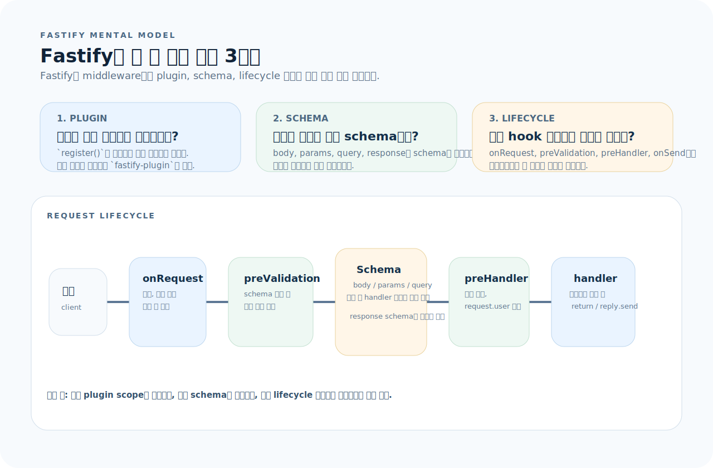
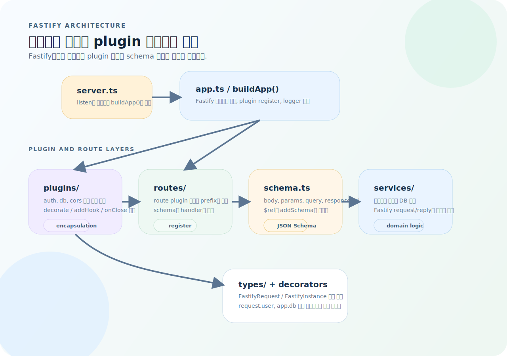
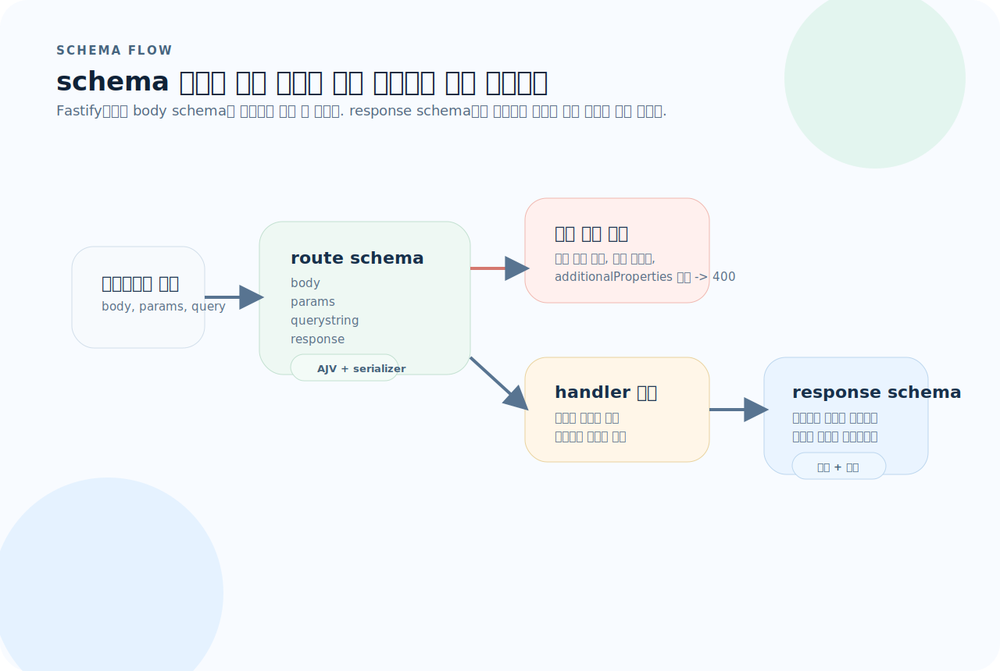
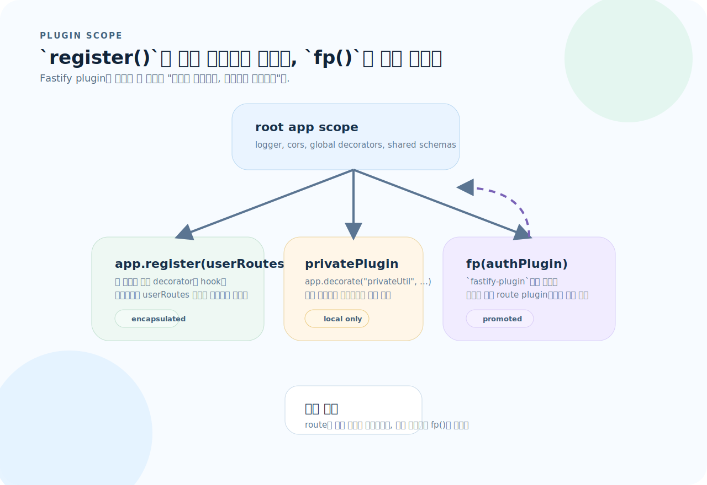

# Fastify 완전 가이드

Fastify는 Node.js 위에서 가장 빠른 HTTP 서버 프레임워크 중 하나다. Express의 미들웨어 파이프라인 대신 **플러그인 캡슐화**와 **JSON Schema 기반 자동 검증·직렬화**를 중심에 둔다. 이 글을 읽고 나면 Fastify의 플러그인 시스템, 스키마 검증, lifecycle hooks, WebSocket을 활용한 프로덕션 API를 설계할 수 있다.

---

## 1. Fastify의 사고방식

Fastify는 Express처럼 "미들웨어를 앞에서부터 붙인다"는 감각으로 읽으면 절반만 이해하게 된다. plugin 스코프, schema, lifecycle 단계를 먼저 보는 편이 훨씬 정확하다.



이 그림은 이 문서 전체를 읽는 기준표다. 먼저 아래 세 질문으로 읽으면 된다.

1. **plugin:** 이 기능은 어느 스코프에 등록되고 어디까지 보이는가?
2. **schema:** 입력과 출력은 어떤 JSON Schema로 고정되는가?
3. **lifecycle:** 어느 hook 단계에서 인증, 로깅, 입력 보정, 응답 후처리를 넣을 것인가?

---

## 2. 프로젝트 구조

아래 구조도는 Fastify 프로젝트를 "파일 트리"가 아니라 "plugin과 schema의 흐름"으로 다시 정리한 것이다.



이 그림을 기준으로 보면 구조가 빠르게 잡힌다.

- `server.ts`는 listen만 담당하고 `buildApp()`을 실행한다.
- `app.ts`는 Fastify 인스턴스를 만들고 공통 plugin을 register한다.
- `routes/`는 route plugin 단위로 prefix와 schema를 묶는다.
- `schema.ts`는 입력과 출력 계약을 담당하고, `services/`는 비즈니스 로직을 담당한다.

```
src/
├── app.ts                # Fastify 인스턴스 생성, 플러그인 등록
├── server.ts             # 서버 기동
├── plugins/
│   ├── cors.ts           # CORS 플러그인
│   ├── auth.ts           # 인증 데코레이터
│   └── db.ts             # DB 연결 플러그인
├── routes/
│   ├── user/
│   │   ├── index.ts      # 라우트 정의 + schema
│   │   ├── schema.ts     # JSON Schema 분리
│   │   └── handler.ts    # 핸들러 로직
│   └── health.ts
├── services/
│   └── user.service.ts
└── types/
    └── index.ts
```

### 초기화

```bash
mkdir my-api && cd my-api
npm init -y
npm install fastify @fastify/cors @fastify/websocket
npm install -D typescript @types/node tsx
npx tsc --init
```

---

## 3. 앱 생성과 플러그인 등록

### app.ts

```ts
import Fastify, { FastifyInstance } from "fastify";
import cors from "@fastify/cors";
import { userRoutes } from "./routes/user";
import { healthRoute } from "./routes/health";
import { authPlugin } from "./plugins/auth";

export async function buildApp(): Promise<FastifyInstance> {
  const app = Fastify({
    logger: {
      level: process.env.LOG_LEVEL ?? "info",
      transport:
        process.env.NODE_ENV === "development"
          ? { target: "pino-pretty" }
          : undefined,
    },
  });

  // ── 플러그인 등록 (순서 중요) ──
  await app.register(cors, {
    origin: ["http://localhost:3000"],
    credentials: true,
  });

  await app.register(authPlugin);             // 인증 데코레이터 등록
  await app.register(healthRoute);            // /health
  await app.register(userRoutes, { prefix: "/api/users" });

  return app;
}
```

### server.ts

```ts
import { buildApp } from "./app";

async function start() {
  const app = await buildApp();
  const port = Number(process.env.PORT) || 3000;

  try {
    await app.listen({ port, host: "0.0.0.0" });
  } catch (err) {
    app.log.error(err);
    process.exit(1);
  }
}

start();
```

---

## 4. JSON Schema 기반 검증과 직렬화

Fastify의 가장 큰 차별점이다. 라우트에 `schema`를 선언하면:
- **입력(body, querystring, params)은 자동 검증**되어 잘못된 요청에 400을 반환한다.
- **출력(response)은 자동 직렬화**되어 불필요한 필드가 제거되고 성능이 최적화된다.



실무에서는 이 그림처럼 `response schema`까지 같이 생각해야 한다.

- body, params, query 검증은 handler 전에 끝난다.
- 검증 실패는 직접 검사 코드를 쓰지 않아도 400으로 응답된다.
- `response` schema를 선언하면 출력 필드가 정리되고 직렬화 경로도 최적화된다.

### 인라인 스키마

```ts
app.post("/users", {
  schema: {
    body: {
      type: "object",
      required: ["name", "email"],
      properties: {
        name: { type: "string", minLength: 1, maxLength: 100 },
        email: { type: "string", format: "email" },
        age: { type: "integer", minimum: 0, maximum: 200 },
      },
      additionalProperties: false,
    },
    response: {
      201: {
        type: "object",
        properties: {
          id: { type: "string", format: "uuid" },
          name: { type: "string" },
          email: { type: "string" },
          createdAt: { type: "string", format: "date-time" },
        },
      },
    },
  },
  handler: async (request, reply) => {
    const { name, email } = request.body as { name: string; email: string };
    const user = await userService.create({ name, email });
    reply.status(201).send(user);
  },
});
```

### 스키마 분리와 $ref 활용

```ts
// src/routes/user/schema.ts
export const userSchema = {
  $id: "user",
  type: "object",
  properties: {
    id: { type: "string", format: "uuid" },
    name: { type: "string" },
    email: { type: "string", format: "email" },
    createdAt: { type: "string", format: "date-time" },
  },
};

export const createUserSchema = {
  body: {
    type: "object",
    required: ["name", "email"],
    properties: {
      name: { type: "string", minLength: 1, maxLength: 100 },
      email: { type: "string", format: "email" },
    },
    additionalProperties: false,
  },
  response: {
    201: { $ref: "user#" },
  },
};
```

```ts
// 라우트에서 사용
app.addSchema(userSchema);          // 공유 스키마 등록

app.post("/users", {
  schema: createUserSchema,
  handler: createUserHandler,
});
```

### TypeBox로 타입 안전한 스키마

JSON Schema를 직접 작성하는 대신 TypeBox를 쓰면 TypeScript 타입과 JSON Schema를 동시에 생성한다.

```bash
npm install @sinclair/typebox
```

```ts
import { Type, Static } from "@sinclair/typebox";

const CreateUserBody = Type.Object({
  name: Type.String({ minLength: 1, maxLength: 100 }),
  email: Type.String({ format: "email" }),
});

type CreateUserBody = Static<typeof CreateUserBody>;

// 라우트에서 사용 — 타입 추론이 자동으로 된다
app.post<{ Body: CreateUserBody }>("/users", {
  schema: { body: CreateUserBody },
  handler: async (request, reply) => {
    const { name, email } = request.body;   // 타입 안전
    // ...
  },
});
```

---

## 5. 플러그인 시스템

Fastify의 핵심 아키텍처다. 모든 기능은 플러그인으로 캡슐화된다.



이 그림이 핵심이다.

- `register()`는 기본적으로 하위 스코프를 만든다.
- 스코프 안에서 decorate한 값은 같은 스코프와 자식에게만 보인다.
- 여러 route plugin에서 공유해야 하는 기능은 `fastify-plugin`으로 감싸서 위로 올린다.

### 플러그인의 스코프

```ts
import fp from "fastify-plugin";

// ── 캡슐화된 플러그인 (기본) ──
// register()로 등록한 플러그인은 해당 스코프에만 보인다
async function privatePlugin(app: FastifyInstance) {
  app.decorate("privateUtil", () => "only in this scope");
}

// ── 전역 플러그인 ──
// fastify-plugin으로 감싸면 부모 스코프로 전파된다
export const authPlugin = fp(async (app: FastifyInstance) => {
  app.decorate("authenticate", async (request: FastifyRequest) => {
    const token = request.headers.authorization?.split(" ")[1];
    if (!token) throw app.httpErrors.unauthorized("Missing token");
    // 토큰 검증 로직
    request.user = verifyToken(token);
  });
});
```

### 데코레이터로 요청에 속성 추가

Express의 `req.user`처럼 요청에 속성을 추가하되, **타입 안전하게** 한다.

```ts
// 타입 선언
declare module "fastify" {
  interface FastifyRequest {
    user: { id: string; email: string; role: string };
  }
}

// 데코레이터 등록
app.decorateRequest("user", null);

// preHandler hook에서 설정
app.addHook("preHandler", async (request) => {
  if (request.routeOptions.config.requireAuth) {
    await app.authenticate(request);
  }
});
```

### DB 플러그인

```ts
// src/plugins/db.ts
import fp from "fastify-plugin";
import { drizzle } from "drizzle-orm/node-postgres";
import { Pool } from "pg";

export const dbPlugin = fp(async (app) => {
  const pool = new Pool({ connectionString: process.env.DATABASE_URL });
  const db = drizzle(pool);

  app.decorate("db", db);

  app.addHook("onClose", async () => {
    await pool.end();
  });
});

// 타입 확장
declare module "fastify" {
  interface FastifyInstance {
    db: ReturnType<typeof drizzle>;
  }
}
```

---

## 6. Lifecycle Hooks

도입부 그림의 하단 타임라인이 바로 lifecycle hooks의 감각이다. Express 미들웨어보다 정밀한 요청 흐름 제어가 가능하다.

- `onRequest`는 가장 앞에서 로깅, 초기 인증 같은 작업에 맞다.
- `preValidation`은 schema 검증 전에 입력을 보정할 때 유용하다.
- `preHandler`는 검증 후 권한 검사나 request.user 주입에 적합하다.
- `onResponse`와 `onError`는 응답 관측과 장애 로그 수집에 잘 맞는다.

```ts
// ── 요청 로깅 ──
app.addHook("onRequest", async (request) => {
  request.log.info({ url: request.url, method: request.method }, "incoming");
});

// ── 인증 (preHandler) ──
app.addHook("preHandler", async (request, reply) => {
  if (request.routeOptions.config.requireAuth) {
    const token = request.headers.authorization?.split(" ")[1];
    if (!token) {
      reply.status(401).send({ message: "Unauthorized" });
      return;
    }
    request.user = verifyToken(token);
  }
});

// ── 응답 시간 측정 ──
app.addHook("onResponse", async (request, reply) => {
  request.log.info(
    { statusCode: reply.statusCode, elapsed: reply.elapsedTime },
    "completed",
  );
});

// ── 에러 로깅 ──
app.addHook("onError", async (request, reply, error) => {
  request.log.error({ err: error }, "request error");
});
```

### 라우트별 hook

```ts
app.get("/admin/stats", {
  preHandler: [authenticateHook, authorizeAdmin],
  handler: async (request, reply) => {
    // 인증 + 관리자 권한 확인 후 실행
  },
});
```

---

## 7. 라우트 구성

### 라우트 플러그인 패턴

```ts
// src/routes/user/index.ts
import { FastifyInstance } from "fastify";
import { createUserSchema, listUsersSchema, getUserSchema } from "./schema";
import { UserService } from "../../services/user.service";

export async function userRoutes(app: FastifyInstance) {
  const service = new UserService(app.db);

  app.get("/", {
    schema: listUsersSchema,
    handler: async (request, reply) => {
      const { page, size } = request.query as { page: number; size: number };
      return service.list(page, size);
    },
  });

  app.get("/:id", {
    schema: getUserSchema,
    handler: async (request, reply) => {
      const { id } = request.params as { id: string };
      const user = await service.getById(id);
      if (!user) {
        reply.status(404).send({ message: "User not found" });
        return;
      }
      return user;
    },
  });

  app.post("/", {
    schema: createUserSchema,
    handler: async (request, reply) => {
      const user = await service.create(request.body as CreateUserBody);
      reply.status(201).send(user);
    },
  });
}
```

---

## 8. 에러 처리

```ts
// ── @fastify/sensible로 편리한 HTTP 에러 ──
import sensible from "@fastify/sensible";
await app.register(sensible);

// 사용
app.get("/:id", async (request, reply) => {
  const user = await service.getById(id);
  if (!user) throw app.httpErrors.notFound("User not found");
  return user;
});

// ── 커스텀 에러 핸들러 ──
app.setErrorHandler((error, request, reply) => {
  request.log.error({ err: error }, "error handler");

  // Fastify validation 에러
  if (error.validation) {
    reply.status(400).send({
      message: "Validation failed",
      errors: error.validation,
    });
    return;
  }

  // 의도된 HTTP 에러
  if (error.statusCode) {
    reply.status(error.statusCode).send({ message: error.message });
    return;
  }

  // 예상치 못한 에러
  reply.status(500).send({ message: "Internal Server Error" });
});
```

---

## 9. WebSocket

```bash
npm install @fastify/websocket
```

```ts
import websocket from "@fastify/websocket";

await app.register(websocket);

app.get("/ws", { websocket: true }, (socket, request) => {
  socket.on("message", (message) => {
    const data = JSON.parse(message.toString());
    socket.send(JSON.stringify({ echo: data }));
  });

  socket.on("close", () => {
    request.log.info("WebSocket closed");
  });
});
```

### 채팅 서버 패턴

```ts
const clients = new Set<WebSocket>();

app.get("/chat", { websocket: true }, (socket, request) => {
  clients.add(socket);

  socket.on("message", (message) => {
    // 모든 클라이언트에 브로드캐스트
    for (const client of clients) {
      if (client !== socket && client.readyState === 1) {
        client.send(message.toString());
      }
    }
  });

  socket.on("close", () => {
    clients.delete(socket);
  });
});
```

---

## 10. 테스트

Fastify는 `inject()`로 HTTP 포트 없이 in-process 테스트를 지원한다.

```ts
import { describe, it, expect, beforeAll, afterAll } from "vitest";
import { buildApp } from "../src/app";
import { FastifyInstance } from "fastify";

let app: FastifyInstance;

beforeAll(async () => {
  app = await buildApp();
  await app.ready();
});

afterAll(async () => {
  await app.close();
});

describe("POST /api/users", () => {
  it("creates a user with valid input", async () => {
    const res = await app.inject({
      method: "POST",
      url: "/api/users",
      payload: { name: "lee", email: "lee@example.com" },
    });

    expect(res.statusCode).toBe(201);
    const body = JSON.parse(res.payload);
    expect(body.name).toBe("lee");
    expect(body.email).toBe("lee@example.com");
  });

  it("returns 400 for invalid email", async () => {
    const res = await app.inject({
      method: "POST",
      url: "/api/users",
      payload: { name: "lee", email: "not-email" },
    });

    expect(res.statusCode).toBe(400);
  });

  it("rejects additional properties", async () => {
    const res = await app.inject({
      method: "POST",
      url: "/api/users",
      payload: { name: "lee", email: "lee@test.com", admin: true },
    });

    expect(res.statusCode).toBe(400);
  });
});

describe("GET /api/users/:id", () => {
  it("returns 404 for non-existent user", async () => {
    const res = await app.inject({
      method: "GET",
      url: "/api/users/nonexistent",
    });

    expect(res.statusCode).toBe(404);
  });
});
```

---

## 11. Express에서 Fastify로 전환

| Express | Fastify |
|---------|---------|
| `app.use(middleware)` | `app.addHook("preHandler", ...)` 또는 `app.register(plugin)` |
| `req.user = ...` | `app.decorateRequest("user", null)` + hook |
| `express.json()` | 내장 (자동 JSON 파싱) |
| body 검증 라이브러리 | JSON Schema 내장 |
| `app.use(authMiddleware)` | `app.addHook("preHandler", ...)` |
| `express-async-errors` | async 에러 자동 처리 (내장) |

---

## 12. 자주 하는 실수

| 실수 | 원인과 해결 |
|------|-------------|
| Express 미들웨어 패턴 그대로 적용 | `register()` 플러그인과 hooks를 쓴다. `app.use()`는 Express 호환용 |
| schema 없이 라우트 등록 | schema를 선언해야 자동 검증·직렬화 최적화가 붙는다 |
| 플러그인 캡슐화 범위 무시 | `register()`는 해당 스코프에만 보인다. 전역이면 `fastify-plugin` 사용 |
| `inject()` 테스트 미활용 | HTTP 포트 없이 in-process 테스트가 가능하다 |
| async plugin 등록 순서 실수 | `await app.register()` 또는 `after()`로 순서를 보장 |
| reply에 `return` 대신 `send()` | Fastify는 `return`으로 응답을 보낼 수 있다. `send()`는 명시적 응답 |
| response schema에서 필드 누락 | response schema에 없는 필드는 자동으로 제거된다 (보안 이점) |

---

## 13. 빠른 참조

```ts
// ── 앱 생성 ──
const app = Fastify({ logger: true });

// ── 라우트 ──
app.get("/", handler);
app.post("/", { schema: { body: ... }, handler });
app.register(routePlugin, { prefix: "/api" });

// ── 플러그인 ──
app.register(cors, { origin: "*" });
app.register(fp(async (app) => { app.decorate("key", value); }));

// ── Hooks ──
app.addHook("onRequest", async (req) => { ... });
app.addHook("preHandler", async (req, reply) => { ... });
app.addHook("onResponse", async (req, reply) => { ... });

// ── 데코레이터 ──
app.decorate("util", fn);          // 인스턴스 데코레이터
app.decorateRequest("user", null); // request 데코레이터

// ── 에러 ──
throw app.httpErrors.notFound();
throw app.httpErrors.unauthorized();
app.setErrorHandler((err, req, reply) => { ... });

// ── 테스트 ──
const res = await app.inject({ method: "GET", url: "/" });
expect(res.statusCode).toBe(200);
```
