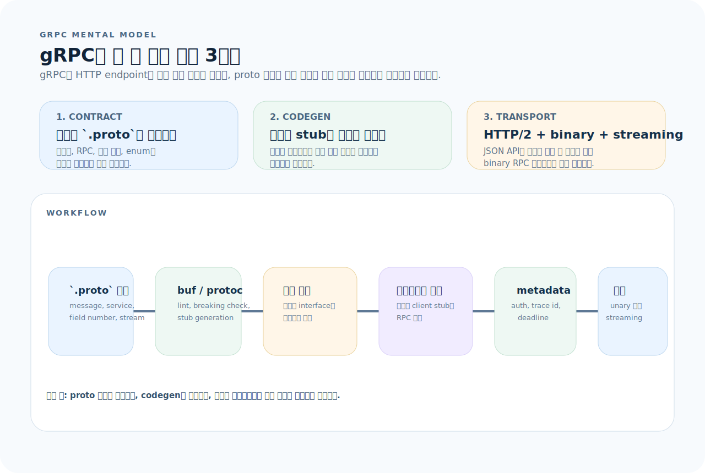
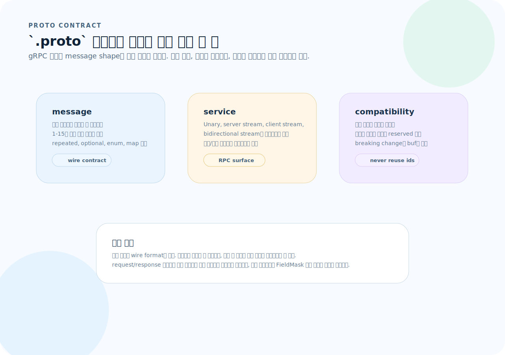
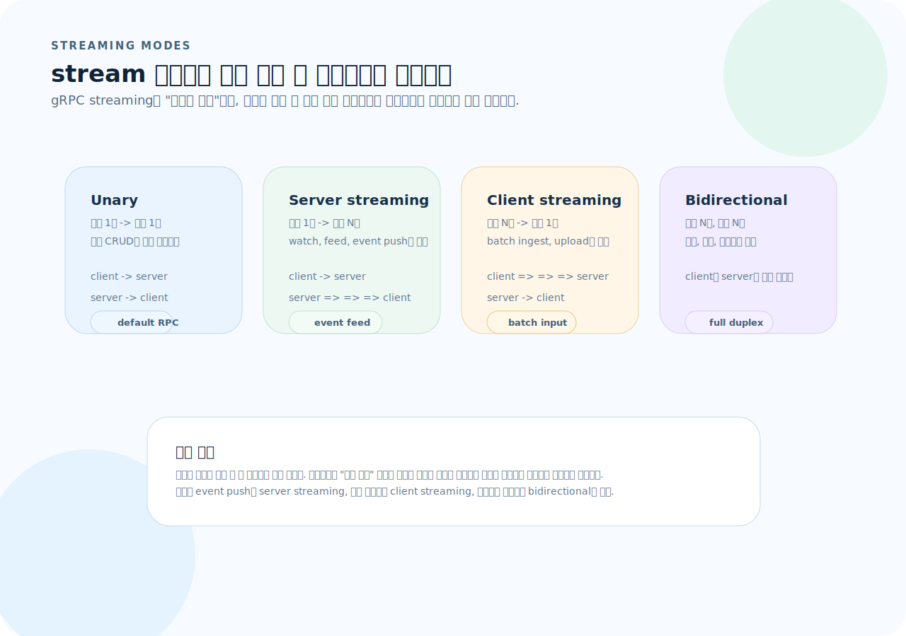
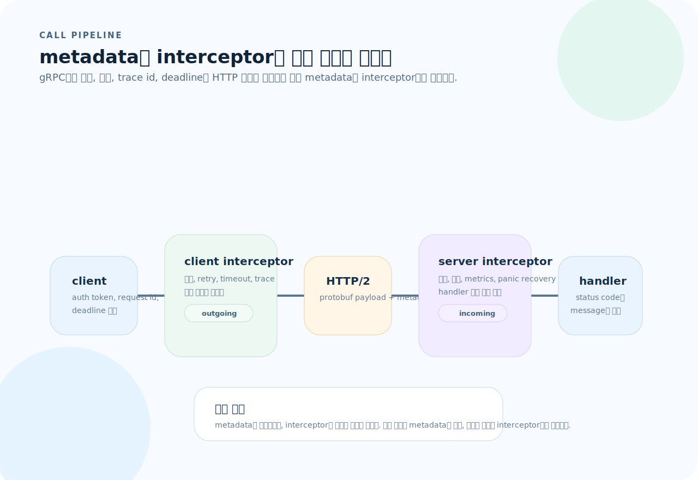

# gRPC 완전 가이드

gRPC는 Google이 만든 고성능 RPC 프레임워크다. `.proto` 파일로 서비스 계약을 먼저 정의하고, Protocol Buffers로 바이너리 직렬화하며, HTTP/2 위에서 양방향 스트리밍까지 지원한다. REST가 사람이 읽기 쉬운 JSON을 HTTP에 싣는다면, gRPC는 **기계 간 통신에 최적화된 바이너리 프로토콜**이다. 이 글을 읽고 나면 `.proto` 설계부터 서버/클라이언트 구현, 스트리밍, 운영까지 gRPC를 제대로 다룰 수 있다.

---

## 1. gRPC의 사고방식

gRPC는 REST의 대체 문법이 아니라, 계약과 호출 방식 자체가 다른 프로토콜이다. endpoint를 직접 설계하는 감각보다 `.proto`와 codegen을 중심으로 읽는 편이 훨씬 정확하다.



이 그림은 이 문서 전체를 읽는 기준표다. 먼저 아래 세 질문으로 읽으면 된다.

1. **계약:** 어떤 message와 RPC 시그니처가 `.proto`에서 고정되는가?
2. **생성:** 어떤 언어의 서버/클라이언트 코드가 `buf`나 `protoc`로 생성되는가?
3. **전송:** 이 호출이 unary인지 streaming인지, 그리고 metadata/interceptor가 어디를 감싸는가?

| | REST | gRPC |
|---|------|------|
| 계약 | OpenAPI(선택) | `.proto`(필수) |
| 직렬화 | JSON (텍스트) | Protocol Buffers (바이너리) |
| 전송 | HTTP/1.1 or HTTP/2 | HTTP/2 전용 |
| 스트리밍 | 단방향(SSE 등) | 양방향 네이티브 |
| 코드 생성 | 선택 | 필수 (protoc) |
| 디버깅 | curl, Postman | grpcurl, Postman gRPC |
| 주 용도 | 클라이언트-서버 | 서비스 간 통신 |

**핵심:** gRPC는 "스키마를 먼저 정의하고 -> 코드를 자동 생성하고 -> 생성된 인터페이스를 구현하는" 워크플로다.

---

## 2. Protocol Buffers (.proto)

`.proto` 파일은 gRPC의 모든 것이 시작되는 지점이다.



이 그림을 기준으로 보면 `.proto`는 세 층으로 읽힌다.

- `message`는 wire format 계약이다. 특히 필드 번호가 핵심이다.
- `service`는 unary/streaming 시그니처를 고정하는 RPC 표면이다.
- `compatibility`는 reserved, breaking change 감지처럼 운영 규칙을 포함한다.

### 메시지 정의

```protobuf
syntax = "proto3";
package bookstore;
option go_package = "github.com/myapp/proto/bookstore";

// 메시지 — 필드 번호가 바이너리 직렬화 키
message Book {
  string id = 1;
  string title = 2;
  string author = 3;
  int32 published_year = 4;
  repeated string tags = 5;       // 배열
  optional string isbn = 6;       // 선택 필드
  BookStatus status = 7;          // enum
}

enum BookStatus {
  BOOK_STATUS_UNSPECIFIED = 0;    // 0번은 항상 UNSPECIFIED
  BOOK_STATUS_AVAILABLE = 1;
  BOOK_STATUS_BORROWED = 2;
}
```

### 필드 번호 규칙

- **필드 번호는 한번 정하면 절대 바꾸지 않는다.** 바이너리 직렬화의 키이므로, 변경하면 기존 데이터와 호환성이 깨진다.
- **삭제할 필드는 `reserved`로 표시한다.** 나중에 같은 번호/이름이 재사용되는 것을 방지한다.
- **1–15번은 1바이트, 16–2047은 2바이트.** 자주 쓰는 필드는 1–15번에 배치한다.

```protobuf
message User {
  reserved 3, 7;              // 필드 번호 예약
  reserved "old_name";        // 필드 이름 예약

  string id = 1;
  string email = 2;
  // 3번은 과거에 사용되었으므로 재사용 금지
  string name = 4;
}
```

### 서비스 정의

```protobuf
service BookService {
  // Unary — 단일 요청, 단일 응답
  rpc GetBook(GetBookRequest) returns (GetBookResponse);
  rpc CreateBook(CreateBookRequest) returns (Book);
  rpc UpdateBook(UpdateBookRequest) returns (Book);
  rpc DeleteBook(DeleteBookRequest) returns (google.protobuf.Empty);
  rpc ListBooks(ListBooksRequest) returns (ListBooksResponse);

  // Server streaming — 서버가 여러 응답을 스트리밍
  rpc WatchBooks(WatchBooksRequest) returns (stream BookEvent);

  // Client streaming — 클라이언트가 여러 요청을 스트리밍
  rpc BatchCreateBooks(stream CreateBookRequest) returns (BatchCreateResponse);

  // Bidirectional streaming — 양방향
  rpc Chat(stream ChatMessage) returns (stream ChatMessage);
}
```

### 요청/응답 메시지 설계

```protobuf
message GetBookRequest {
  string id = 1;
}

message GetBookResponse {
  Book book = 1;
}

message ListBooksRequest {
  int32 page_size = 1;
  string page_token = 2;       // cursor 기반 페이지네이션
  string filter = 3;            // 예: "author=lee"
}

message ListBooksResponse {
  repeated Book books = 1;
  string next_page_token = 2;
  int32 total_count = 3;
}

message CreateBookRequest {
  string title = 1;
  string author = 2;
  int32 published_year = 3;
  repeated string tags = 4;
}

message UpdateBookRequest {
  string id = 1;
  string title = 2;
  string author = 3;
  google.protobuf.FieldMask update_mask = 4;  // 부분 업데이트
}

message DeleteBookRequest {
  string id = 1;
}
```

---

## 3. 코드 생성

### protoc 직접 사용

```bash
# Go
protoc \
  --go_out=. --go_opt=paths=source_relative \
  --go-grpc_out=. --go-grpc_opt=paths=source_relative \
  proto/bookstore.proto

# Python
python -m grpc_tools.protoc \
  -I proto \
  --python_out=. --grpc_python_out=. \
  proto/bookstore.proto
```

### buf 사용 (권장)

`buf`는 protoc을 감싸는 현대적 도구로, 린트·브레이킹 체인지 감지·코드 생성을 통합한다.

```yaml
# buf.yaml
version: v2
lint:
  use:
    - STANDARD
breaking:
  use:
    - FILE
```

```yaml
# buf.gen.yaml
version: v2
plugins:
  - remote: buf.build/protocolbuffers/go
    out: gen/go
    opt: paths=source_relative
  - remote: buf.build/grpc/go
    out: gen/go
    opt: paths=source_relative
```

```bash
buf lint                    # .proto 린트
buf breaking --against .git#branch=main  # 호환성 깨짐 감지
buf generate                # 코드 생성
```

---

## 4. Go 서버 구현

```go
package main

import (
	"context"
	"log"
	"net"

	"google.golang.org/grpc"
	"google.golang.org/grpc/codes"
	"google.golang.org/grpc/status"
	pb "github.com/myapp/proto/bookstore"
)

// ── 서비스 구현 ──
type bookServer struct {
	pb.UnimplementedBookServiceServer
	books map[string]*pb.Book
}

func newBookServer() *bookServer {
	return &bookServer{books: make(map[string]*pb.Book)}
}

func (s *bookServer) GetBook(
	ctx context.Context,
	req *pb.GetBookRequest,
) (*pb.GetBookResponse, error) {
	book, ok := s.books[req.Id]
	if !ok {
		return nil, status.Errorf(codes.NotFound, "book %s not found", req.Id)
	}
	return &pb.GetBookResponse{Book: book}, nil
}

func (s *bookServer) CreateBook(
	ctx context.Context,
	req *pb.CreateBookRequest,
) (*pb.Book, error) {
	if req.Title == "" {
		return nil, status.Error(codes.InvalidArgument, "title is required")
	}

	id := generateID()
	book := &pb.Book{
		Id:            id,
		Title:         req.Title,
		Author:        req.Author,
		PublishedYear: req.PublishedYear,
		Tags:          req.Tags,
		Status:        pb.BookStatus_BOOK_STATUS_AVAILABLE,
	}
	s.books[id] = book
	return book, nil
}

func (s *bookServer) ListBooks(
	ctx context.Context,
	req *pb.ListBooksRequest,
) (*pb.ListBooksResponse, error) {
	var result []*pb.Book
	for _, book := range s.books {
		result = append(result, book)
	}
	return &pb.ListBooksResponse{
		Books:      result,
		TotalCount: int32(len(result)),
	}, nil
}

// ── 서버 기동 ──
func main() {
	lis, err := net.Listen("tcp", ":50051")
	if err != nil {
		log.Fatalf("failed to listen: %v", err)
	}

	grpcServer := grpc.NewServer(
		grpc.UnaryInterceptor(loggingInterceptor),
	)
	pb.RegisterBookServiceServer(grpcServer, newBookServer())

	log.Println("gRPC server listening on :50051")
	if err := grpcServer.Serve(lis); err != nil {
		log.Fatalf("failed to serve: %v", err)
	}
}
```

---

## 5. Go 클라이언트 구현

```go
package main

import (
	"context"
	"log"
	"time"

	"google.golang.org/grpc"
	"google.golang.org/grpc/credentials/insecure"
	pb "github.com/myapp/proto/bookstore"
)

func main() {
	// ── 연결 ──
	conn, err := grpc.NewClient(
		"localhost:50051",
		grpc.WithTransportCredentials(insecure.NewCredentials()),
	)
	if err != nil {
		log.Fatalf("failed to connect: %v", err)
	}
	defer conn.Close()

	client := pb.NewBookServiceClient(conn)

	// ── Unary 호출 ──
	ctx, cancel := context.WithTimeout(context.Background(), 5*time.Second)
	defer cancel()

	// 생성
	book, err := client.CreateBook(ctx, &pb.CreateBookRequest{
		Title:  "Clean Code",
		Author: "Robert Martin",
		Tags:   []string{"programming", "best-practices"},
	})
	if err != nil {
		log.Fatalf("CreateBook failed: %v", err)
	}
	log.Printf("Created: %v", book)

	// 조회
	resp, err := client.GetBook(ctx, &pb.GetBookRequest{Id: book.Id})
	if err != nil {
		log.Fatalf("GetBook failed: %v", err)
	}
	log.Printf("Got: %v", resp.Book)

	// 목록
	list, err := client.ListBooks(ctx, &pb.ListBooksRequest{PageSize: 10})
	if err != nil {
		log.Fatalf("ListBooks failed: %v", err)
	}
	log.Printf("Total books: %d", list.TotalCount)
}
```

---

## 6. 스트리밍

stream 키워드는 "실시간"이라는 분위기보다, 요청과 응답 중 누가 여러 번 보내는지를 고정하는 선택이다.



그림처럼 먼저 데이터 흐름의 방향과 횟수를 기준으로 고르면 된다.

- 단일 요청과 단일 응답이면 unary다.
- 서버가 계속 밀어주면 server streaming이다.
- 클라이언트가 여러 개를 모아 보내면 client streaming이다.
- 양쪽이 동시에 흘러야 하면 bidirectional streaming이다.

### Server Streaming

서버가 하나의 요청에 여러 응답을 순차적으로 보낸다.

```protobuf
rpc WatchBooks(WatchBooksRequest) returns (stream BookEvent);
```

```go
// 서버
func (s *bookServer) WatchBooks(
	req *pb.WatchBooksRequest,
	stream pb.BookService_WatchBooksServer,
) error {
	for event := range s.eventChannel {
		if err := stream.Send(event); err != nil {
			return err
		}
	}
	return nil
}

// 클라이언트
stream, err := client.WatchBooks(ctx, &pb.WatchBooksRequest{})
if err != nil {
	log.Fatal(err)
}
for {
	event, err := stream.Recv()
	if err == io.EOF {
		break
	}
	if err != nil {
		log.Fatal(err)
	}
	log.Printf("Event: %v", event)
}
```

### Client Streaming

클라이언트가 여러 요청을 보내고, 서버가 하나의 응답을 반환한다.

```protobuf
rpc BatchCreateBooks(stream CreateBookRequest) returns (BatchCreateResponse);
```

```go
// 클라이언트
stream, err := client.BatchCreateBooks(ctx)
if err != nil {
	log.Fatal(err)
}

books := []*pb.CreateBookRequest{
	{Title: "Book 1", Author: "Author 1"},
	{Title: "Book 2", Author: "Author 2"},
}
for _, book := range books {
	if err := stream.Send(book); err != nil {
		log.Fatal(err)
	}
}

resp, err := stream.CloseAndRecv()
if err != nil {
	log.Fatal(err)
}
log.Printf("Created %d books", resp.CreatedCount)
```

### Bidirectional Streaming

양쪽이 동시에 스트리밍한다.

```protobuf
rpc Chat(stream ChatMessage) returns (stream ChatMessage);
```

```go
stream, err := client.Chat(ctx)
if err != nil {
	log.Fatal(err)
}

// 수신 goroutine
go func() {
	for {
		msg, err := stream.Recv()
		if err == io.EOF {
			return
		}
		if err != nil {
			log.Fatal(err)
		}
		log.Printf("Received: %s", msg.Text)
	}
}()

// 송신
for _, text := range messages {
	if err := stream.Send(&pb.ChatMessage{Text: text}); err != nil {
		log.Fatal(err)
	}
}
stream.CloseSend()
```

---

## 7. 에러 처리

gRPC는 표준 상태 코드를 사용한다. HTTP 상태 코드와 매핑은 다르다.

```go
import (
	"google.golang.org/grpc/codes"
	"google.golang.org/grpc/status"
)

// 에러 반환
return nil, status.Error(codes.NotFound, "book not found")
return nil, status.Errorf(codes.InvalidArgument, "title is required")
return nil, status.Error(codes.PermissionDenied, "admin access required")
return nil, status.Error(codes.AlreadyExists, "book already exists")

// 에러 확인 (클라이언트)
resp, err := client.GetBook(ctx, req)
if err != nil {
	st, ok := status.FromError(err)
	if ok {
		switch st.Code() {
		case codes.NotFound:
			log.Printf("Book not found: %s", st.Message())
		case codes.InvalidArgument:
			log.Printf("Invalid request: %s", st.Message())
		default:
			log.Printf("RPC error: %v", st)
		}
	}
}
```

### 주요 상태 코드

| gRPC Code | HTTP 매핑 | 용도 |
|-----------|----------|------|
| `OK` | 200 | 성공 |
| `InvalidArgument` | 400 | 잘못된 요청 |
| `NotFound` | 404 | 리소스 없음 |
| `AlreadyExists` | 409 | 중복 |
| `PermissionDenied` | 403 | 권한 없음 |
| `Unauthenticated` | 401 | 인증 실패 |
| `Internal` | 500 | 서버 내부 에러 |
| `Unavailable` | 503 | 서비스 이용 불가 |
| `DeadlineExceeded` | 504 | 타임아웃 |

---

## 8. Interceptor (미들웨어)

gRPC의 미들웨어에 해당한다. 로깅, 인증, 모니터링 등에 사용한다.



이 그림의 핵심은 역할 분리다.

- metadata는 authorization, request id, deadline 같은 호출 데이터다.
- interceptor는 그 호출을 감싸는 공통 코드다.
- 인증, 로깅, metrics, retry 같은 횡단 관심사는 handler 밖 interceptor로 뺀다.

```go
// Unary Interceptor — 요청/응답 로깅
func loggingInterceptor(
	ctx context.Context,
	req any,
	info *grpc.UnaryServerInfo,
	handler grpc.UnaryHandler,
) (any, error) {
	start := time.Now()
	resp, err := handler(ctx, req)
	log.Printf(
		"method=%s duration=%s error=%v",
		info.FullMethod, time.Since(start), err,
	)
	return resp, err
}

// 인증 Interceptor
func authInterceptor(
	ctx context.Context,
	req any,
	info *grpc.UnaryServerInfo,
	handler grpc.UnaryHandler,
) (any, error) {
	md, ok := metadata.FromIncomingContext(ctx)
	if !ok {
		return nil, status.Error(codes.Unauthenticated, "missing metadata")
	}
	tokens := md.Get("authorization")
	if len(tokens) == 0 {
		return nil, status.Error(codes.Unauthenticated, "missing token")
	}
	// 토큰 검증...
	return handler(ctx, req)
}

// 서버에 Interceptor 적용
grpcServer := grpc.NewServer(
	grpc.ChainUnaryInterceptor(
		loggingInterceptor,
		authInterceptor,
	),
)
```

---

## 9. Metadata (헤더)

gRPC에서 HTTP 헤더에 해당하는 것이 metadata다. 위 호출 파이프라인 그림에서처럼, metadata는 interceptor와 handler가 읽는 입력 데이터다.

```go
import "google.golang.org/grpc/metadata"

// 클라이언트 — metadata 전송
md := metadata.Pairs(
	"authorization", "Bearer "+token,
	"x-request-id", uuid.New().String(),
)
ctx := metadata.NewOutgoingContext(ctx, md)
resp, err := client.GetBook(ctx, req)

// 서버 — metadata 수신
md, ok := metadata.FromIncomingContext(ctx)
if ok {
	tokens := md.Get("authorization")
	requestIDs := md.Get("x-request-id")
}
```

---

## 10. 디버깅 도구

gRPC는 바이너리 프로토콜이라 `curl`로는 안 된다.

```bash
# grpcurl — CLI gRPC 클라이언트
grpcurl -plaintext localhost:50051 list
grpcurl -plaintext localhost:50051 describe bookstore.BookService
grpcurl -plaintext \
  -d '{"title": "Clean Code", "author": "Martin"}' \
  localhost:50051 bookstore.BookService/CreateBook

# 서비스 reflection 활성화 (서버)
import "google.golang.org/grpc/reflection"
reflection.Register(grpcServer)

# grpcui — 웹 UI
grpcui -plaintext localhost:50051
```

---

## 11. 프로덕션 체크리스트

### TLS 설정

```go
// 서버
creds, _ := credentials.NewServerTLSFromFile("cert.pem", "key.pem")
grpcServer := grpc.NewServer(grpc.Creds(creds))

// 클라이언트
creds, _ := credentials.NewClientTLSFromFile("cert.pem", "")
conn, _ := grpc.NewClient("server:50051", grpc.WithTransportCredentials(creds))
```

### Health Check

```go
import "google.golang.org/grpc/health"
import healthpb "google.golang.org/grpc/health/grpc_health_v1"

healthServer := health.NewServer()
healthpb.RegisterHealthServer(grpcServer, healthServer)
healthServer.SetServingStatus("bookstore.BookService", healthpb.HealthCheckResponse_SERVING)
```

### Graceful Shutdown

```go
quit := make(chan os.Signal, 1)
signal.Notify(quit, syscall.SIGTERM, syscall.SIGINT)
<-quit

log.Println("Shutting down...")
grpcServer.GracefulStop()
```

---

## 12. 자주 하는 실수

| 실수 | 원인과 해결 |
|------|-------------|
| `.proto` 수정 후 codegen 재실행 안 함 | `.proto`를 바꾸면 `protoc` 또는 `buf generate`를 반드시 재실행 |
| 생성된 코드를 직접 수정 | 자동 생성 파일은 수정 금지. `.proto`를 고치고 재생성 |
| REST처럼 JSON으로 디버깅 시도 | `grpcurl`, `grpcui`, Postman gRPC 탭을 사용 |
| 필드 번호 변경으로 호환성 깨짐 | 필드 번호는 불변. 삭제할 필드는 `reserved`로 표시 |
| TLS 미설정으로 연결 실패 | 로컬은 `-plaintext`, 프로덕션은 TLS 인증서 설정 |
| context deadline 미설정 | 클라이언트 호출 시 항상 timeout이 있는 context 사용 |
| `Unimplemented` 에러 | 서버에 `UnimplementedXxxServer`를 embed했지만 메서드를 구현 안 함 |
| enum 0번에 의미 부여 | proto3에서 0은 기본값. 항상 `UNSPECIFIED`로 남겨둔다 |

---

## 13. 빠른 참조

```protobuf
// ── proto 기본 구조 ──
syntax = "proto3";
package myapp;
option go_package = "myapp/proto";

message Msg { string field = 1; }
service Svc { rpc Method(Req) returns (Resp); }

// ── 필드 타입 ──
string, int32, int64, float, double, bool
bytes                          // 바이너리 데이터
repeated string tags = 5;     // 배열
optional string note = 6;     // 선택
map<string, int32> scores = 7; // 맵
google.protobuf.Timestamp     // 시간
google.protobuf.Empty          // 빈 메시지
```

```bash
# ── 코드 생성 ──
buf generate                    # buf (권장)
protoc --go_out=. --go-grpc_out=. proto/*.proto

# ── 디버깅 ──
grpcurl -plaintext localhost:50051 list
grpcurl -plaintext -d '{"id":"1"}' localhost:50051 myapp.Svc/Method

# ── 서버 실행 ──
go run ./cmd/server
```
