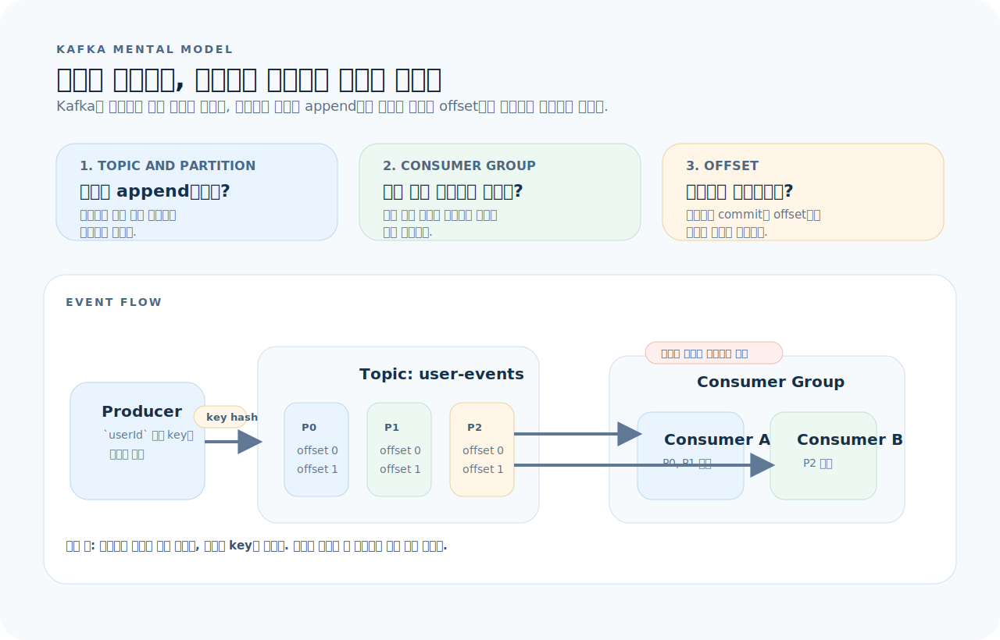
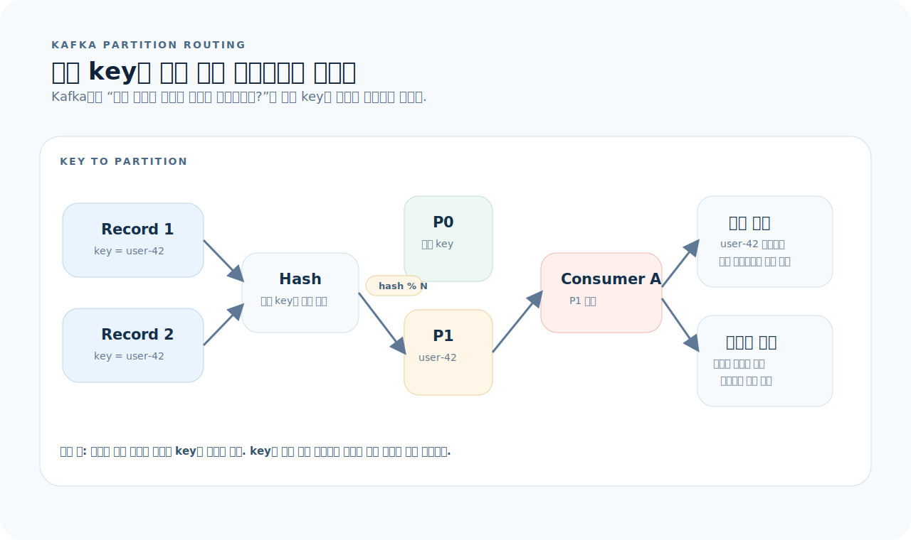
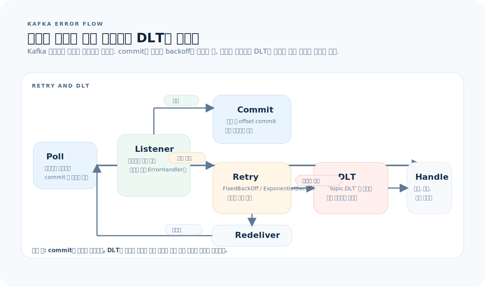

# Kafka 완전 가이드

Apache Kafka는 분산 이벤트 스트리밍 플랫폼이다. 메시지 큐처럼 비동기 통신에 쓰이지만, 로그 기반 저장이라 메시지를 소비한 뒤에도 보존하고 재처리할 수 있다. 이 글을 읽고 나면 Kafka의 토픽·파티션·컨슈머 그룹 모델을 이해하고, Spring Boot에서 프로듀서/컨슈머를 구현할 수 있다.

먼저 아래 세 질문을 기준으로 읽으면 Kafka 코드가 훨씬 빨리 정리된다.

1. **토픽 설계:** 이 이벤트는 어떤 토픽에, 어떤 키로 파티셔닝되어야 하는가?
2. **컨슈머 그룹:** 이 컨슈머는 어떤 그룹에 속하고, 파티션은 어떻게 분배되는가?
3. **전달 보장:** 이 파이프라인은 at-least-once인가, exactly-once가 필요한가?

---

## 1. Kafka의 사고방식

Kafka는 메일함이 아니라 커밋 로그(commit log)다. 메시지는 토픽의 파티션에 순서대로 append되고, 오프셋으로 위치를 추적한다.



이 그림은 이 문서 전체를 읽는 기준표다. 먼저 아래 세 질문으로 읽으면 된다.

1. **토픽 설계:** 어떤 이벤트를 같은 토픽에 넣고, 어떤 키로 파티셔닝할 것인가?
2. **컨슈머 그룹:** 같은 그룹 안에서 파티션이 어떤 인스턴스에 배분되는가?
3. **전달 보장:** offset commit 시점을 어디에 두고, 실패 시 어디로 흘려보낼 것인가?

그림을 왼쪽에서 오른쪽으로 읽으면 Kafka는 "한 번 읽고 사라지는 큐"가 아니라 "파티션에 append되는 로그"라는 점이 핵심이다. 프로듀서는 키를 기준으로 파티션을 선택하고, 컨슈머 그룹은 각 파티션을 나눠 맡아 offset을 추적한다. 따라서 Kafka 설계는 `키와 파티션`, `그룹 단위 병렬성`, `offset과 재처리` 세 축으로 읽어야 한다.

**핵심 개념:**

| 개념 | 의미 |
|------|------|
| **Topic** | 메시지 카테고리. 하나의 로그 스트림 |
| **Partition** | 토픽의 하위 단위. 순서 보장의 단위 |
| **Offset** | 파티션 내 메시지 위치. 컨슈머가 추적 |
| **Producer** | 메시지를 토픽에 쓰는 쪽 |
| **Consumer** | 메시지를 토픽에서 읽는 쪽 |
| **Consumer Group** | 컨슈머 집합. 파티션이 그룹 내에서 분배됨 |
| **Broker** | Kafka 서버 노드 |
| **Replication** | 파티션의 복제본. 장애 대비 |

**Kafka vs 메시지 큐 차이:**

| | 전통 메시지 큐 (RabbitMQ) | Kafka |
|---|---|---|
| 소비 후 메시지 | 삭제됨 | 보존됨 (retention 기간 동안) |
| 재처리 | 불가 | offset 되감기로 가능 |
| 순서 보장 | 큐 단위 | 파티션 단위 |
| 처리량 | 중간 | 매우 높음 |
| 패턴 | 작업 분배 (work queue) | 이벤트 스트리밍 + 작업 분배 |

---

## 2. 로컬 환경 구성

### Docker Compose

```yaml
services:
  kafka:
    image: confluentinc/cp-kafka:7.6.0
    ports: ["9092:9092"]
    environment:
      KAFKA_NODE_ID: 1
      KAFKA_PROCESS_ROLES: broker,controller
      KAFKA_CONTROLLER_QUORUM_VOTERS: 1@kafka:9093
      KAFKA_LISTENERS: PLAINTEXT://0.0.0.0:9092,CONTROLLER://0.0.0.0:9093
      KAFKA_ADVERTISED_LISTENERS: PLAINTEXT://localhost:9092
      KAFKA_CONTROLLER_LISTENER_NAMES: CONTROLLER
      KAFKA_LISTENER_SECURITY_PROTOCOL_MAP: PLAINTEXT:PLAINTEXT,CONTROLLER:PLAINTEXT
      KAFKA_OFFSETS_TOPIC_REPLICATION_FACTOR: 1
      CLUSTER_ID: "local-kraft-cluster-001"
```

### CLI 도구

```bash
# 토픽 생성
kafka-topics --bootstrap-server localhost:9092 \
  --create --topic user-events --partitions 3 --replication-factor 1

# 토픽 목록
kafka-topics --bootstrap-server localhost:9092 --list

# 토픽 상세
kafka-topics --bootstrap-server localhost:9092 --describe --topic user-events

# 메시지 생산
echo '{"type":"USER_CREATED","userId":1}' | \
  kafka-console-producer --bootstrap-server localhost:9092 --topic user-events

# 메시지 소비
kafka-console-consumer --bootstrap-server localhost:9092 \
  --topic user-events --from-beginning --group test-group
```

---

## 3. Spring Boot — Producer

### 의존성

```kotlin
// build.gradle.kts
dependencies {
    implementation("org.springframework.kafka:spring-kafka")
}
```

### 설정

```yaml
# application.yml
spring:
  kafka:
    bootstrap-servers: localhost:9092
    producer:
      key-serializer: org.apache.kafka.common.serialization.StringSerializer
      value-serializer: org.springframework.kafka.support.serializer.JsonSerializer
      acks: all                    # 모든 replica가 확인해야 전송 성공
      retries: 3
```

### 이벤트 발행

```java
// 이벤트 정의
public record UserCreatedEvent(
    Long userId,
    String email,
    LocalDateTime occurredAt
) {}

// Producer 서비스
@Service
public class EventPublisher {
    private final KafkaTemplate<String, Object> kafkaTemplate;

    public EventPublisher(KafkaTemplate<String, Object> kafkaTemplate) {
        this.kafkaTemplate = kafkaTemplate;
    }

    public void publishUserCreated(User user) {
        var event = new UserCreatedEvent(
            user.getId(), user.getEmail(), LocalDateTime.now());

        kafkaTemplate.send("user-events", user.getId().toString(), event)
            .whenComplete((result, ex) -> {
                if (ex != null) {
                    log.error("이벤트 발행 실패: {}", event, ex);
                } else {
                    log.info("이벤트 발행: topic={}, partition={}, offset={}",
                        result.getRecordMetadata().topic(),
                        result.getRecordMetadata().partition(),
                        result.getRecordMetadata().offset());
                }
            });
    }
}
```

### Service에서 호출

```java
@Service
@Transactional
public class UserService {
    private final UserRepository userRepository;
    private final EventPublisher eventPublisher;

    public UserResponse create(UserCreateRequest request) {
        User user = userRepository.save(User.from(request));
        eventPublisher.publishUserCreated(user);
        return UserResponse.from(user);
    }
}
```

---

## 4. Spring Boot — Consumer

### 설정

```yaml
spring:
  kafka:
    consumer:
      group-id: my-service
      auto-offset-reset: earliest    # 처음부터 읽기 (latest: 최신부터)
      key-deserializer: org.apache.kafka.common.serialization.StringDeserializer
      value-deserializer: org.springframework.kafka.support.serializer.JsonDeserializer
      properties:
        spring.json.trusted.packages: "com.example.*"
```

### 이벤트 소비

```java
@Component
public class UserEventConsumer {

    @KafkaListener(topics = "user-events", groupId = "notification-service")
    public void handleUserCreated(UserCreatedEvent event) {
        log.info("사용자 생성 이벤트 수신: userId={}", event.userId());
        notificationService.sendWelcome(event.userId(), event.email());
    }
}
```

### 수동 커밋

```java
@KafkaListener(
    topics = "order-events",
    groupId = "payment-service",
    containerFactory = "manualAckListenerFactory"
)
public void handleOrder(OrderEvent event, Acknowledgment ack) {
    try {
        paymentService.process(event);
        ack.acknowledge();          // 처리 성공 시 커밋
    } catch (RetryableException e) {
        // ack 안 하면 재전달됨
        log.warn("재시도 예정: {}", event, e);
    }
}

@Configuration
public class KafkaConfig {
    @Bean
    public ConcurrentKafkaListenerContainerFactory<String, Object>
            manualAckListenerFactory(ConsumerFactory<String, Object> cf) {
        var factory = new ConcurrentKafkaListenerContainerFactory<String, Object>();
        factory.setConsumerFactory(cf);
        factory.getContainerProperties()
            .setAckMode(ContainerProperties.AckMode.MANUAL);
        return factory;
    }
}
```

---

## 5. 토픽 설계

토픽 설계는 이름짓기보다 "같은 엔터티 이벤트가 같은 파티션으로 모이느냐"가 먼저다.



- 같은 `key`는 항상 같은 파티션으로 가므로 같은 사용자나 주문 단위의 순서가 보장된다.
- 파티션 수가 곧 그룹 내부 최대 병렬성이다. 컨슈머를 늘려도 파티션보다 많으면 남는 인스턴스가 생긴다.
- 키를 비우면 round-robin에 가까워져 처리량은 좋아질 수 있지만, 엔터티 단위 순서는 잃기 쉽다.

### 파티셔닝 전략

```
같은 키 → 같은 파티션 → 순서 보장
```

```java
// 사용자 ID를 키로 → 같은 사용자의 이벤트는 순서 보장
kafkaTemplate.send("user-events", userId.toString(), event);

// 주문 ID를 키로 → 같은 주문의 상태 변경은 순서 보장
kafkaTemplate.send("order-events", orderId.toString(), event);
```

### 토픽 이름 규칙

```
{도메인}.{이벤트 유형}
user.created
order.placed
payment.completed
inventory.reserved
```

### 이벤트 스키마

```java
// 공통 이벤트 envelope
public record DomainEvent<T>(
    String eventId,           // UUID
    String eventType,         // "USER_CREATED"
    T payload,
    LocalDateTime occurredAt,
    String source             // "user-service"
) {
    public static <T> DomainEvent<T> of(String type, T payload) {
        return new DomainEvent<>(
            UUID.randomUUID().toString(), type, payload,
            LocalDateTime.now(), "my-service"
        );
    }
}
```

---

## 6. 에러 처리와 Dead Letter Topic

Kafka 에러 처리는 "예외를 잡아먹는 것"이 아니라, 재시도 횟수와 offset commit 위치를 제어해 실패 메시지를 추적 가능하게 만드는 작업이다.



- 처리 성공 전에는 commit하지 않아야 같은 레코드를 다시 받을 수 있다.
- `DefaultErrorHandler`는 backoff와 재시도 횟수를 제어하고, 한도를 넘기면 DLT로 보낸다.
- DLT는 실패를 숨기는 곳이 아니라 별도 모니터링과 수동 재처리의 시작점이다.

```java
@Configuration
public class KafkaConfig {

    @Bean
    public ConcurrentKafkaListenerContainerFactory<String, Object>
            kafkaListenerContainerFactory(ConsumerFactory<String, Object> cf,
                                          KafkaTemplate<String, Object> template) {
        var factory = new ConcurrentKafkaListenerContainerFactory<String, Object>();
        factory.setConsumerFactory(cf);

        // 3번 재시도 후 DLT로 전송
        var recoverer = new DeadLetterPublishingRecoverer(template,
            (record, ex) -> new TopicPartition(record.topic() + ".DLT", -1));

        factory.setCommonErrorHandler(
            new DefaultErrorHandler(recoverer, new FixedBackOff(1000L, 3)));

        return factory;
    }
}
```

DLT(Dead Letter Topic) 소비자를 별도로 등록해서 실패한 메시지를 모니터링하거나 수동 재처리한다.

```java
@KafkaListener(topics = "user-events.DLT", groupId = "dlt-handler")
public void handleDlt(ConsumerRecord<String, Object> record) {
    log.error("DLT 수신: topic={}, key={}, value={}",
        record.topic(), record.key(), record.value());
    alertService.notifyDeadLetter(record);
}
```

---

## 7. 테스트

### 내장 Kafka

```java
@SpringBootTest
@EmbeddedKafka(
    partitions = 1,
    topics = {"user-events"},
    brokerProperties = {"listeners=PLAINTEXT://localhost:9093"}
)
class UserEventTest {
    @Autowired KafkaTemplate<String, Object> template;
    @Autowired UserEventConsumer consumer;

    @Test
    void 이벤트_발행_소비() throws Exception {
        var event = new UserCreatedEvent(1L, "a@b.com", LocalDateTime.now());
        template.send("user-events", "1", event).get();

        // 비동기이므로 약간의 대기 필요
        Awaitility.await().atMost(Duration.ofSeconds(10))
            .untilAsserted(() ->
                verify(notificationService).sendWelcome(1L, "a@b.com"));
    }
}
```

### Testcontainers

```java
@SpringBootTest
@Testcontainers
class KafkaIntegrationTest {
    @Container
    static KafkaContainer kafka = new KafkaContainer(
        DockerImageName.parse("confluentinc/cp-kafka:7.6.0"));

    @DynamicPropertySource
    static void kafkaProperties(DynamicPropertyRegistry registry) {
        registry.add("spring.kafka.bootstrap-servers", kafka::getBootstrapServers);
    }
}
```

---

## 8. 운영 체크리스트

| 항목 | 확인 |
|------|------|
| 파티션 수는 컨슈머 수 이상인가 | 컨슈머가 파티션보다 많으면 놀게 된다 |
| `acks=all`로 설정했는가 | 데이터 유실 방지 |
| 컨슈머 group.id가 서비스별로 분리되어 있는가 | 같은 ID면 메시지를 나눠 받는다 |
| DLT가 구성되어 있는가 | 실패 메시지 추적 가능해야 한다 |
| 이벤트 스키마에 버전 필드가 있는가 | 하위 호환 진화를 위해 필요 |
| retention.ms를 의식적으로 설정했는가 | 기본 7일. 재처리 기간 결정 |

---

## 9. 자주 하는 실수

| 실수 | 올바른 방법 |
|------|-------------|
| 파티션 1개로 운영 | 처리량과 병렬성을 위해 파티션을 충분히 준다 |
| 키 없이 메시지 전송 | 순서 보장이 필요하면 반드시 키를 지정 |
| 컨슈머에서 무거운 동기 작업 | 별도 스레드풀이나 비동기 처리 |
| 에러 무시하고 auto-commit | 수동 커밋 또는 DLT로 실패 관리 |
| 이벤트에 엔티티 전체를 담기 | 필요한 필드만 담은 이벤트 스키마 설계 |
| DB 트랜잭션과 Kafka 전송을 원자적으로 가정 | Outbox 패턴 또는 트랜잭셔널 메시징 고려 |

---

## 10. 빠른 참조

```java
// ── Producer ──
kafkaTemplate.send("topic", key, event);
kafkaTemplate.send("topic", partition, key, event);

// ── Consumer ──
@KafkaListener(topics = "topic", groupId = "group")
void handle(Event event) { }

@KafkaListener(topics = "topic", groupId = "group")
void handle(ConsumerRecord<String, Event> record) { }

// ── 수동 커밋 ──
void handle(Event event, Acknowledgment ack) {
    process(event);
    ack.acknowledge();
}

// ── CLI ──
// kafka-topics --create --topic t --partitions 3 --bootstrap-server localhost:9092
// kafka-console-producer --topic t --bootstrap-server localhost:9092
// kafka-console-consumer --topic t --from-beginning --group g --bootstrap-server localhost:9092
// kafka-consumer-groups --describe --group g --bootstrap-server localhost:9092
```
