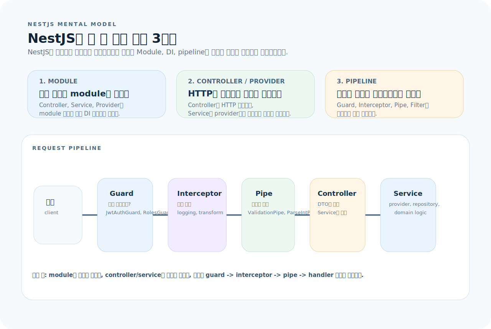
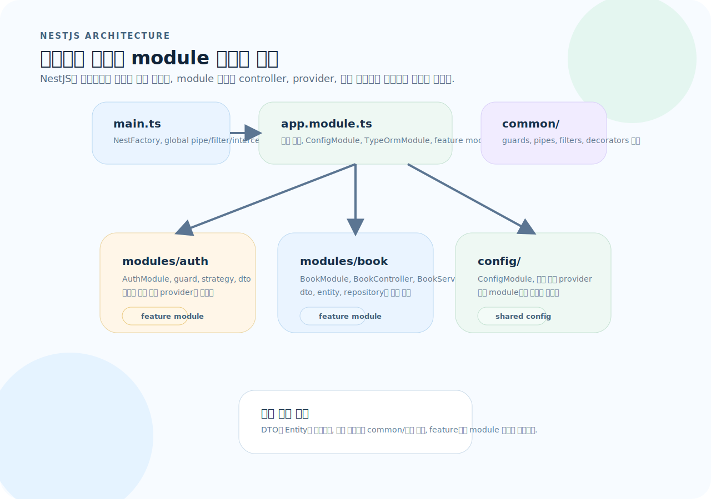
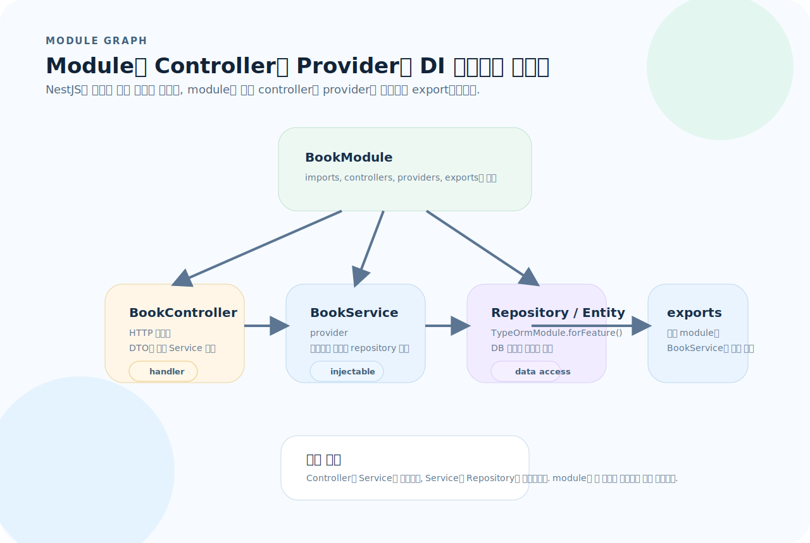
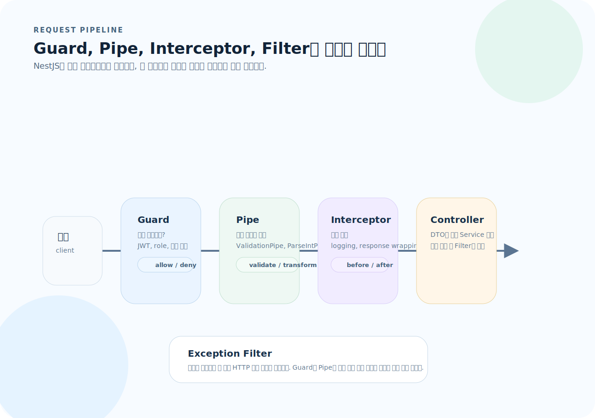

# NestJS 완전 가이드

NestJS는 Node.js 위에서 "구조를 강제하는" 프레임워크다. Express와 달리 Module → Controller → Service 계층을 데코레이터와 DI(의존성 주입) 컨테이너로 wiring한다. 이 글을 읽고 나면 NestJS의 아키텍처를 이해하고, Guard·Interceptor·Filter를 활용한 프로덕션 API를 설계할 수 있다.

---

## 1. NestJS의 사고방식

NestJS는 Express처럼 자유롭게 조립하는 프레임워크가 아니라, module과 DI 컨테이너를 중심으로 구조를 강제하는 프레임워크다.



이 그림은 이 문서 전체를 읽는 기준표다. 먼저 아래 세 질문으로 읽으면 된다.

1. **module:** 어떤 기능 경계를 하나의 module로 묶을 것인가?
2. **provider:** controller와 service를 어떻게 나누고 DI로 연결할 것인가?
3. **pipeline:** guard, pipe, interceptor, filter를 어느 목적으로 둘 것인가?

### 세 가지 구성 요소

- **Module** — 기능의 경계. 관련된 Controller, Service, Provider를 하나로 묶는다.
- **Controller** — HTTP 진입점. 라우트를 선언하고 요청/응답을 매핑한다.
- **Provider (Service)** — 비즈니스 로직. `@Injectable()`로 표시하고 DI 컨테이너에 등록한다.

### 요청 파이프라인

도입부 그림의 하단 타임라인이 바로 NestJS 요청 파이프라인의 감각이다. NestJS는 목적이 다른 구성 요소를 명시적으로 분리한다.

---

## 2. 프로젝트 구조

아래 구조도는 Nest 프로젝트를 "폴더 목록"이 아니라 "module 경계와 공통 관심사 배치"로 다시 정리한 것이다.



이 그림을 기준으로 보면 구조가 빠르게 잡힌다.

- `main.ts`는 부트스트랩과 글로벌 설정 지점이다.
- `app.module.ts`는 루트 모듈로서 feature module을 묶는다.
- `common/`은 filter, guard, interceptor, decorator 같은 횡단 관심사를 모은다.
- `modules/` 아래에서 기능별 module 경계를 만든다.

```
src/
├── main.ts                    # 부트스트랩, 글로벌 설정
├── app.module.ts              # 루트 모듈
├── common/                    # 공유 유틸리티
│   ├── decorators/
│   ├── filters/
│   ├── guards/
│   ├── interceptors/
│   └── pipes/
├── config/
│   └── config.module.ts
└── modules/
    ├── auth/
    │   ├── auth.module.ts
    │   ├── auth.controller.ts
    │   ├── auth.service.ts
    │   ├── auth.guard.ts
    │   ├── strategies/
    │   └── dto/
    └── book/
        ├── book.module.ts
        ├── book.controller.ts
        ├── book.service.ts
        ├── dto/
        │   ├── create-book.dto.ts
        │   └── update-book.dto.ts
        └── entities/
            └── book.entity.ts
```

### 초기화

```bash
npm i -g @nestjs/cli
nest new my-api
cd my-api

# 모듈 생성
nest generate module modules/book
nest generate controller modules/book
nest generate service modules/book
```

---

## 3. Module — 기능의 경계



이 그림이 module의 핵심 역할을 보여준다.

- module은 controller, provider, repository를 조립하는 선언 지점이다.
- controller는 service를 주입받고, service는 repository나 다른 provider를 주입받는다.
- `exports`에 넣은 provider만 다른 module에서 사용할 수 있다.

```ts
// src/modules/book/book.module.ts
import { Module } from "@nestjs/common";
import { TypeOrmModule } from "@nestjs/typeorm";
import { BookController } from "./book.controller";
import { BookService } from "./book.service";
import { Book } from "./entities/book.entity";

@Module({
  imports: [TypeOrmModule.forFeature([Book])],
  controllers: [BookController],
  providers: [BookService],
  exports: [BookService],   // 다른 모듈에서 사용 가능하게 노출
})
export class BookModule {}
```

```ts
// src/app.module.ts — 루트 모듈
import { Module } from "@nestjs/common";
import { ConfigModule } from "@nestjs/config";
import { TypeOrmModule } from "@nestjs/typeorm";
import { BookModule } from "./modules/book/book.module";
import { AuthModule } from "./modules/auth/auth.module";

@Module({
  imports: [
    ConfigModule.forRoot({ isGlobal: true }),
    TypeOrmModule.forRoot({
      type: "postgres",
      url: process.env.DATABASE_URL,
      autoLoadEntities: true,
      synchronize: process.env.NODE_ENV !== "production",
    }),
    BookModule,
    AuthModule,
  ],
})
export class AppModule {}
```

---

## 4. Controller — HTTP 진입점

```ts
// src/modules/book/book.controller.ts
import {
  Controller, Get, Post, Put, Delete,
  Body, Param, Query, HttpCode, HttpStatus,
  UseGuards, ParseIntPipe,
} from "@nestjs/common";
import { BookService } from "./book.service";
import { CreateBookDto } from "./dto/create-book.dto";
import { UpdateBookDto } from "./dto/update-book.dto";
import { JwtAuthGuard } from "../auth/auth.guard";
import { PaginationDto } from "../../common/dto/pagination.dto";

@Controller("books")
export class BookController {
  constructor(private readonly bookService: BookService) {}

  @Get()
  findAll(@Query() query: PaginationDto) {
    return this.bookService.findAll(query);
  }

  @Get(":id")
  findOne(@Param("id", ParseIntPipe) id: number) {
    return this.bookService.findOne(id);
  }

  @Post()
  @UseGuards(JwtAuthGuard)
  @HttpCode(HttpStatus.CREATED)
  create(@Body() dto: CreateBookDto) {
    return this.bookService.create(dto);
  }

  @Put(":id")
  @UseGuards(JwtAuthGuard)
  update(
    @Param("id", ParseIntPipe) id: number,
    @Body() dto: UpdateBookDto,
  ) {
    return this.bookService.update(id, dto);
  }

  @Delete(":id")
  @UseGuards(JwtAuthGuard)
  @HttpCode(HttpStatus.NO_CONTENT)
  remove(@Param("id", ParseIntPipe) id: number) {
    return this.bookService.remove(id);
  }
}
```

---

## 5. Service — 비즈니스 로직

```ts
// src/modules/book/book.service.ts
import { Injectable, NotFoundException } from "@nestjs/common";
import { InjectRepository } from "@nestjs/typeorm";
import { Repository } from "typeorm";
import { Book } from "./entities/book.entity";
import { CreateBookDto } from "./dto/create-book.dto";
import { UpdateBookDto } from "./dto/update-book.dto";
import { PaginationDto } from "../../common/dto/pagination.dto";

@Injectable()
export class BookService {
  constructor(
    @InjectRepository(Book)
    private readonly bookRepo: Repository<Book>,
  ) {}

  async findAll(query: PaginationDto) {
    const { page = 1, size = 20 } = query;
    const [data, total] = await this.bookRepo.findAndCount({
      skip: (page - 1) * size,
      take: size,
      order: { createdAt: "DESC" },
    });
    return { data, total, page, size };
  }

  async findOne(id: number): Promise<Book> {
    const book = await this.bookRepo.findOneBy({ id });
    if (!book) throw new NotFoundException(`Book #${id} not found`);
    return book;
  }

  async create(dto: CreateBookDto): Promise<Book> {
    const book = this.bookRepo.create(dto);
    return this.bookRepo.save(book);
  }

  async update(id: number, dto: UpdateBookDto): Promise<Book> {
    const book = await this.findOne(id);        // 없으면 NotFoundException
    Object.assign(book, dto);
    return this.bookRepo.save(book);
  }

  async remove(id: number): Promise<void> {
    const book = await this.findOne(id);
    await this.bookRepo.remove(book);
  }
}
```

---

## 6. DTO와 Validation

NestJS는 `class-validator`와 `class-transformer`로 자동 검증을 제공한다.



이 그림을 기준으로 보면 DTO 검증이 어느 위치에 있는지가 분명해진다.

- Guard는 접근 가능 여부를 판단한다.
- Pipe는 DTO 검증과 타입 변환을 담당한다.
- Interceptor는 전후 로깅과 응답 래핑 같은 횡단 관심사를 처리한다.
- Filter는 실패 흐름에서 최종 응답 형식을 정리한다.

```bash
npm install class-validator class-transformer
```

### main.ts에 전역 ValidationPipe 등록

```ts
// src/main.ts
import { NestFactory } from "@nestjs/core";
import { ValidationPipe } from "@nestjs/common";
import { AppModule } from "./app.module";

async function bootstrap() {
  const app = await NestFactory.create(AppModule);

  app.useGlobalPipes(
    new ValidationPipe({
      whitelist: true,          // DTO에 없는 필드 자동 제거
      forbidNonWhitelisted: true, // 정의되지 않은 필드가 오면 400
      transform: true,          // query/param을 자동 타입 변환
    }),
  );

  app.enableCors({ origin: "http://localhost:3000" });
  app.setGlobalPrefix("api");

  await app.listen(process.env.PORT ?? 3000);
}
bootstrap();
```

### DTO 정의

```ts
// src/modules/book/dto/create-book.dto.ts
import { IsString, IsInt, IsOptional, Min, Max, MinLength, MaxLength } from "class-validator";

export class CreateBookDto {
  @IsString()
  @MinLength(1)
  @MaxLength(200)
  title: string;

  @IsString()
  @MinLength(1)
  @MaxLength(100)
  author: string;

  @IsString()
  @IsOptional()
  isbn?: string;

  @IsInt()
  @Min(1000)
  @Max(2100)
  @IsOptional()
  publishedYear?: number;
}
```

```ts
// src/modules/book/dto/update-book.dto.ts
import { PartialType } from "@nestjs/mapped-types";
import { CreateBookDto } from "./create-book.dto";

// PartialType — 모든 필드를 optional로 변환
export class UpdateBookDto extends PartialType(CreateBookDto) {}
```

---

## 7. Entity

```ts
// src/modules/book/entities/book.entity.ts
import {
  Entity, PrimaryGeneratedColumn, Column,
  CreateDateColumn, UpdateDateColumn,
} from "typeorm";

@Entity("books")
export class Book {
  @PrimaryGeneratedColumn()
  id: number;

  @Column({ length: 200 })
  title: string;

  @Column({ length: 100 })
  author: string;

  @Column({ nullable: true })
  isbn?: string;

  @Column({ nullable: true })
  publishedYear?: number;

  @CreateDateColumn()
  createdAt: Date;

  @UpdateDateColumn()
  updatedAt: Date;
}
```

---

## 8. Guard — 인가

위 파이프라인 그림에서 가장 앞쪽 판단기가 Guard다. Guard는 "이 요청이 접근 가능한가?"를 판단한다.

```ts
// src/modules/auth/auth.guard.ts
import { Injectable, CanActivate, ExecutionContext, UnauthorizedException } from "@nestjs/common";
import { JwtService } from "@nestjs/jwt";
import { Request } from "express";

@Injectable()
export class JwtAuthGuard implements CanActivate {
  constructor(private readonly jwtService: JwtService) {}

  canActivate(context: ExecutionContext): boolean {
    const request = context.switchToHttp().getRequest<Request>();
    const token = this.extractToken(request);
    if (!token) throw new UnauthorizedException("Missing token");

    try {
      const payload = this.jwtService.verify(token);
      request["user"] = payload;
      return true;
    } catch {
      throw new UnauthorizedException("Invalid token");
    }
  }

  private extractToken(request: Request): string | undefined {
    const [type, token] = request.headers.authorization?.split(" ") ?? [];
    return type === "Bearer" ? token : undefined;
  }
}
```

### 역할 기반 가드

```ts
import { SetMetadata } from "@nestjs/common";

export const Roles = (...roles: string[]) => SetMetadata("roles", roles);

@Injectable()
export class RolesGuard implements CanActivate {
  constructor(private reflector: Reflector) {}

  canActivate(context: ExecutionContext): boolean {
    const requiredRoles = this.reflector.get<string[]>("roles", context.getHandler());
    if (!requiredRoles) return true;

    const { user } = context.switchToHttp().getRequest();
    return requiredRoles.includes(user.role);
  }
}

// 사용
@Delete(":id")
@UseGuards(JwtAuthGuard, RolesGuard)
@Roles("admin")
remove(@Param("id") id: number) { ... }
```

---

## 9. Interceptor — 전후 처리

Interceptor는 요청 전후에 로직을 끼워넣는다. 파이프라인 그림에서처럼 Guard처럼 차단을 담당하는 것이 아니라, 정상 흐름의 전후 처리에 집중한다.

```ts
// 응답 시간 측정
@Injectable()
export class LoggingInterceptor implements NestInterceptor {
  intercept(context: ExecutionContext, next: CallHandler): Observable<any> {
    const now = Date.now();
    const req = context.switchToHttp().getRequest();
    return next.handle().pipe(
      tap(() => {
        console.log(`${req.method} ${req.url} ${Date.now() - now}ms`);
      }),
    );
  }
}

// 응답 래핑 — { data: ..., timestamp: ... }
@Injectable()
export class TransformInterceptor implements NestInterceptor {
  intercept(context: ExecutionContext, next: CallHandler): Observable<any> {
    return next.handle().pipe(
      map((data) => ({
        data,
        timestamp: new Date().toISOString(),
      })),
    );
  }
}

// 전역 등록
app.useGlobalInterceptors(new LoggingInterceptor());
```

---

## 10. Exception Filter — 에러 처리

파이프라인 그림의 마지막 단계가 Exception Filter다. 정상 흐름을 바꾸는 것이 아니라, 예외가 발생했을 때 최종 HTTP 응답 형식을 정리한다.

```ts
// NestJS 내장 예외 — 자동으로 적절한 HTTP 상태코드 반환
throw new NotFoundException("Book not found");       // 404
throw new BadRequestException("Invalid input");      // 400
throw new UnauthorizedException("Invalid token");    // 401
throw new ForbiddenException("Access denied");       // 403
throw new ConflictException("Email already exists"); // 409
```

### 커스텀 Exception Filter

```ts
import { ExceptionFilter, Catch, ArgumentsHost, HttpException } from "@nestjs/common";

@Catch(HttpException)
export class HttpExceptionFilter implements ExceptionFilter {
  catch(exception: HttpException, host: ArgumentsHost) {
    const ctx = host.switchToHttp();
    const response = ctx.getResponse();
    const request = ctx.getRequest();
    const status = exception.getStatus();

    response.status(status).json({
      statusCode: status,
      message: exception.message,
      path: request.url,
      timestamp: new Date().toISOString(),
    });
  }
}

// 전역 등록
app.useGlobalFilters(new HttpExceptionFilter());
```

---

## 11. Pipe — 검증과 변환

Pipe는 DTO 검증과 파라미터 변환을 담당한다. 즉 "이 값이 유효한가?"와 "문자열을 원하는 타입으로 바꿔야 하는가?"를 처리하는 지점이다.

```ts
// 내장 Pipe
@Get(":id")
findOne(@Param("id", ParseIntPipe) id: number) { ... }      // string → number
findOne(@Param("id", ParseUUIDPipe) id: string) { ... }      // UUID 검증

// ValidationPipe — DTO 자동 검증 (main.ts에서 전역 등록)
@Post()
create(@Body() dto: CreateBookDto) { ... }  // class-validator로 자동 검증
```

---

## 12. 커스텀 데코레이터

```ts
import { createParamDecorator, ExecutionContext } from "@nestjs/common";

// @CurrentUser() — req.user를 추출하는 데코레이터
export const CurrentUser = createParamDecorator(
  (data: string, ctx: ExecutionContext) => {
    const request = ctx.switchToHttp().getRequest();
    const user = request.user;
    return data ? user?.[data] : user;
  },
);

// 사용
@Get("profile")
@UseGuards(JwtAuthGuard)
getProfile(@CurrentUser() user: UserPayload) {
  return user;
}

@Get("my-id")
@UseGuards(JwtAuthGuard)
getMyId(@CurrentUser("id") userId: string) {
  return { userId };
}
```

---

## 13. 테스트

NestJS는 테스트 유틸리티가 내장되어 있다.

### 단위 테스트

```ts
import { Test, TestingModule } from "@nestjs/testing";
import { BookService } from "./book.service";
import { getRepositoryToken } from "@nestjs/typeorm";
import { Book } from "./entities/book.entity";

describe("BookService", () => {
  let service: BookService;
  const mockRepo = {
    findOneBy: vi.fn(),
    findAndCount: vi.fn(),
    create: vi.fn(),
    save: vi.fn(),
    remove: vi.fn(),
  };

  beforeEach(async () => {
    const module: TestingModule = await Test.createTestingModule({
      providers: [
        BookService,
        { provide: getRepositoryToken(Book), useValue: mockRepo },
      ],
    }).compile();

    service = module.get<BookService>(BookService);
  });

  it("should throw NotFoundException for non-existent book", async () => {
    mockRepo.findOneBy.mockResolvedValue(null);
    await expect(service.findOne(999)).rejects.toThrow("not found");
  });

  it("should create a book", async () => {
    const dto = { title: "Test", author: "Author" };
    const book = { id: 1, ...dto };
    mockRepo.create.mockReturnValue(book);
    mockRepo.save.mockResolvedValue(book);

    const result = await service.create(dto);
    expect(result.title).toBe("Test");
  });
});
```

### E2E 테스트

```ts
import { Test } from "@nestjs/testing";
import { INestApplication, ValidationPipe } from "@nestjs/common";
import request from "supertest";
import { AppModule } from "../src/app.module";

describe("BookController (e2e)", () => {
  let app: INestApplication;

  beforeAll(async () => {
    const module = await Test.createTestingModule({
      imports: [AppModule],
    }).compile();

    app = module.createNestApplication();
    app.useGlobalPipes(new ValidationPipe({ whitelist: true }));
    await app.init();
  });

  afterAll(async () => {
    await app.close();
  });

  it("POST /api/books — 201", () => {
    return request(app.getHttpServer())
      .post("/api/books")
      .send({ title: "Test", author: "Author" })
      .expect(201);
  });

  it("POST /api/books — 400 invalid body", () => {
    return request(app.getHttpServer())
      .post("/api/books")
      .send({ title: "" })
      .expect(400);
  });
});
```

---

## 14. Express vs NestJS 비교

| 기준 | Express | NestJS |
|------|---------|--------|
| 구조 | 자유 (직접 결정) | Module/Controller/Service 강제 |
| DI | 없음 | @Injectable + 내장 IoC 컨테이너 |
| 검증 | zod 등 직접 구성 | class-validator + ValidationPipe |
| 에러 처리 | 에러 미들웨어 직접 작성 | Exception Filter 내장 |
| 인증/인가 | 미들웨어 직접 작성 | Guard + Passport 통합 |
| 마이크로서비스 | 직접 구성 | @nestjs/microservices 내장 |
| 학습 곡선 | 낮음 | 높음 (DI, 데코레이터, 파이프라인) |
| 적합 규모 | 소~중 | 중~대 |

---

## 15. 자주 하는 실수

| 실수 | 원인과 해결 |
|------|-------------|
| 데코레이터만 달고 module providers에 등록 안 함 | `@Injectable()`만으로는 부족. module의 `providers` 배열에 명시 |
| DTO와 Entity를 같은 클래스로 사용 | DTO는 API 경계 계약, Entity는 DB 매핑. 반드시 분리 |
| Guard와 Interceptor 목적 혼동 | Guard = "접근 가능?", Interceptor = "전후 변환" |
| `main.ts` 전역 설정 누락 | `ValidationPipe`, `setGlobalPrefix`, `enableCors` 등 글로벌 설정 필수 |
| `@Body()` 타입만 달고 실제 검증 안 됨 | DTO에 `class-validator` 데코레이터가 있어야 ValidationPipe이 동작 |
| 순환 의존성 | `forwardRef()`로 해결하거나, 모듈 구조를 재설계 |
| 테스트에서 DI 컨테이너 미구성 | `Test.createTestingModule()`에 필요한 provider를 모두 등록 |

---

## 16. 빠른 참조

```ts
// ── 모듈 ──
@Module({
  imports: [...],
  controllers: [MyController],
  providers: [MyService],
  exports: [MyService],
})

// ── 컨트롤러 ──
@Controller("resource")
class MyController {
  constructor(private service: MyService) {}
  @Get() findAll() {}
  @Get(":id") findOne(@Param("id", ParseIntPipe) id: number) {}
  @Post() @HttpCode(201) create(@Body() dto: CreateDto) {}
  @Put(":id") update(@Param("id") id: number, @Body() dto: UpdateDto) {}
  @Delete(":id") @HttpCode(204) remove(@Param("id") id: number) {}
}

// ── 서비스 ──
@Injectable()
class MyService {
  constructor(@InjectRepository(Entity) private repo: Repository<Entity>) {}
}

// ── 요청 파이프라인 순서 ──
// Middleware → Guard → Interceptor(전) → Pipe → Handler → Interceptor(후) → Filter(에러)
```
