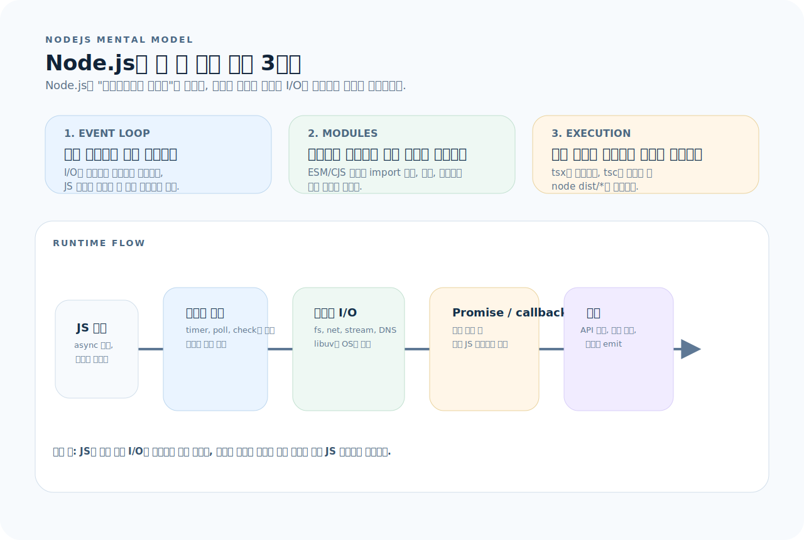
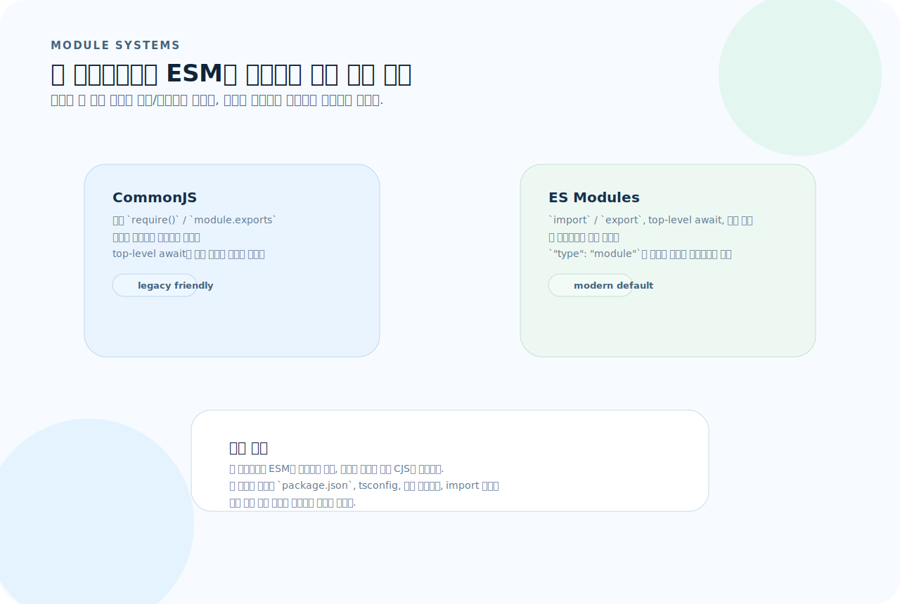
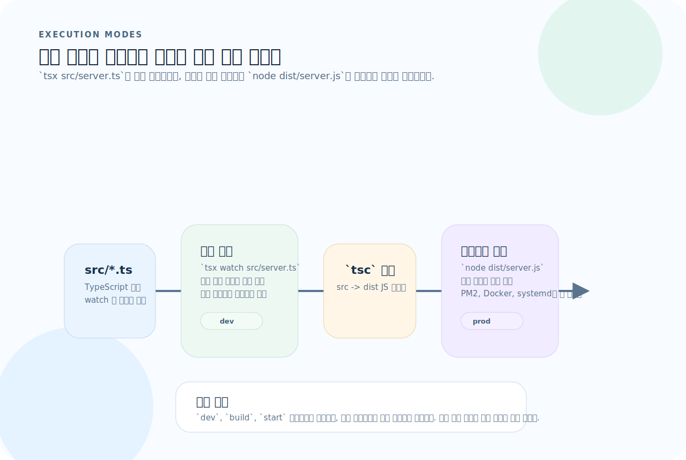
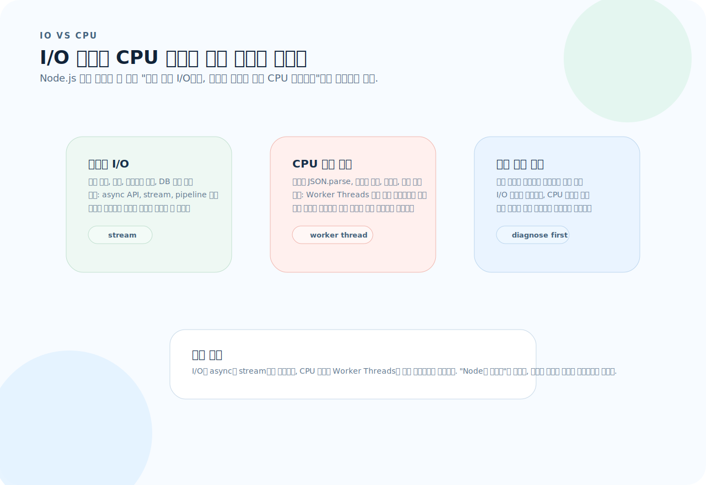

# Node.js 완전 가이드

Node.js는 Chrome V8 엔진 위에서 동작하는 JavaScript 런타임이다. 단순히 "브라우저 밖에서 JS를 실행하는 도구"가 아니라, **이벤트 루프 기반 비동기 I/O 모델**이 핵심이다. 이 글을 읽고 나면 Node.js의 동작 원리를 이해하고, 패키지 관리부터 프로덕션 배포까지 제대로 다룰 수 있다.

---

## 1. Node.js의 사고방식

Node.js는 "브라우저 밖에서 JS를 실행한다"는 설명으로는 부족하다. 이벤트 루프와 비동기 I/O를 먼저 이해해야 나머지 도구 선택도 자연스럽게 따라온다.



이 그림은 이 문서 전체를 읽는 기준표다. 먼저 아래 세 질문으로 읽으면 된다.

1. **event loop:** 이 작업이 메인 스레드를 오래 점유하는가?
2. **modules:** 프로젝트 전체에서 CJS와 ESM 중 무엇을 기준으로 통일할 것인가?
3. **execution:** 개발 실행과 배포 실행을 어떻게 분리할 것인가?

### 단일 스레드 + 이벤트 루프

Node.js는 **싱글 스레드**로 동작한다. CPU 코어 하나로 모든 요청을 처리한다. 그런데도 빠른 이유는 **이벤트 루프**가 I/O 작업을 비동기로 처리하기 때문이다.

```
   ┌───────────────────────────┐
┌─>│         timers            │  setTimeout, setInterval
│  └─────────────┬─────────────┘
│  ┌─────────────┴─────────────┐
│  │     pending callbacks     │  I/O 에러 콜백 등
│  └─────────────┬─────────────┘
│  ┌─────────────┴─────────────┐
│  │       idle, prepare       │  내부 전용
│  └─────────────┬─────────────┘
│  ┌─────────────┴─────────────┐
│  │          poll             │  I/O 콜백 (fs, net 등)
│  └─────────────┬─────────────┘
│  ┌─────────────┴─────────────┐
│  │          check            │  setImmediate
│  └─────────────┬─────────────┘
│  ┌─────────────┴─────────────┐
│  │      close callbacks      │  socket.on('close')
│  └─────────────┬─────────────┘
└─────────────────┘
```

### 핵심 원칙

| 원칙 | 의미 |
|------|------|
| 절대 이벤트 루프를 블로킹하지 마라 | CPU 집약적 작업(대용량 JSON 파싱, 암호화 등)은 Worker Thread로 분리 |
| 에러는 반드시 처리하라 | 처리되지 않은 Promise rejection은 프로세스를 종료시킨다 |
| 콜백보다 async/await | 가독성과 에러 핸들링 모두 우월하다 |

---

## 2. 모듈 시스템 — CommonJS vs ESM



실무에서는 이 그림처럼 "무엇이 더 현대적인가"보다 "프로젝트 전체에서 무엇으로 통일할 것인가"가 더 중요하다.

- 새 프로젝트면 ESM이 기본 선택지다.
- 오래된 코드베이스나 도구 제약이 강하면 CJS를 유지할 수 있다.
- 가장 나쁜 경우는 실행 환경, tsconfig, import 경로가 서로 다른 모듈 체계를 가리키는 것이다.

### CommonJS (CJS)

```js
// math.js
function add(a, b) { return a + b; }
module.exports = { add };

// app.js
const { add } = require("./math");
```

### ES Modules (ESM)

```js
// math.js
export function add(a, b) { return a + b; }

// app.js
import { add } from "./math.js";
```

### 어떤 것을 쓸 것인가?

| 기준 | CJS | ESM |
|------|-----|-----|
| Node 지원 | 모든 버전 | 12+ (안정: 14+) |
| 활성화 방법 | 기본값 | `"type": "module"` in package.json 또는 `.mjs` 확장자 |
| Top-level await | 불가 | 가능 |
| `__dirname` | 내장 | `import.meta.dirname` (Node 21+) 또는 `fileURLToPath` |
| 트렌드 | 레거시 | **표준** |

**2024년 이후**: 새 프로젝트는 ESM을 기본으로 쓴다.

```json
// package.json
{
  "type": "module"
}
```

---

## 3. package.json — 프로젝트의 중심

```json
{
  "name": "my-api",
  "version": "1.0.0",
  "type": "module",
  "engines": { "node": ">=20" },
  "packageManager": "pnpm@9.15.0",
  "scripts": {
    "dev": "tsx watch src/server.ts",
    "build": "tsc",
    "start": "node dist/server.js",
    "test": "vitest",
    "lint": "eslint src/"
  },
  "dependencies": {
    "express": "^4.21.0"
  },
  "devDependencies": {
    "tsx": "^4.19.0",
    "typescript": "^5.6.0",
    "@types/express": "^5.0.0"
  }
}
```

### scripts 규칙

| 스크립트 | 용도 |
|----------|------|
| `dev` | 개발 모드 (watch + 소스 직접 실행) |
| `build` | TypeScript → JavaScript 컴파일 |
| `start` | 빌드 결과를 프로덕션으로 실행 |
| `test` | 테스트 실행 |
| `lint` | 코드 검사 |

### pre/post 훅

```json
{
  "scripts": {
    "prebuild": "rm -rf dist",
    "build": "tsc",
    "postbuild": "echo 'Build complete'"
  }
}
```

---

## 4. 패키지 관리자 비교

### npm vs pnpm vs yarn

| 기능 | npm | pnpm | yarn |
|------|-----|------|------|
| 설치 속도 | 보통 | **빠름** (하드 링크) | 빠름 |
| 디스크 사용 | 높음 (프로젝트별 복사) | **낮음** (글로벌 저장소) | 높음 |
| 유령 의존성 | 있음 | **차단** (strict) | 있음 |
| 모노레포 | workspaces | workspaces | workspaces |
| lockfile | package-lock.json | pnpm-lock.yaml | yarn.lock |

**유령 의존성(Phantom dependency)**: node_modules의 flat 구조 때문에 package.json에 명시하지 않은 패키지도 `require`/`import` 가능. pnpm은 심볼릭 링크 방식으로 이를 차단한다.

### pnpm 기본 사용

```bash
# 설치
npm install -g pnpm

# 의존성 추가
pnpm add express                  # dependencies
pnpm add -D typescript            # devDependencies

# 실행
pnpm dev                          # npm run dev 와 동일
pnpm exec tsc --init              # 로컬 패키지 실행

# monorepo에서
pnpm --filter @app/api dev        # 특정 패키지만 실행
pnpm --filter @app/api add zod    # 특정 패키지에 의존성 추가
pnpm -r build                     # 모든 패키지 빌드
```

---

## 5. TypeScript 실행



이 그림이 `dev`, `build`, `start` 스크립트를 왜 분리해야 하는지 보여준다.

- 개발에서는 `tsx watch`로 소스를 직접 실행한다.
- 프로덕션에서는 `tsc`로 빌드한 결과만 `node dist/*`로 실행한다.
- 배포 환경에서는 tsx 편의 실행보다 빌드 산출물 실행이 예측 가능하다.

### 개발 환경 — tsx

```bash
pnpm add -D tsx

# 단일 실행
npx tsx src/server.ts

# watch 모드 — 파일 변경 시 자동 재시작
npx tsx watch src/server.ts
```

### 프로덕션 — 빌드 후 실행

```bash
# 1. 빌드
npx tsc

# 2. 실행
node dist/server.js
```

### tsconfig.json 핵심 설정

```json
{
  "compilerOptions": {
    "target": "ES2022",
    "module": "NodeNext",
    "moduleResolution": "NodeNext",
    "outDir": "dist",
    "rootDir": "src",
    "strict": true,
    "esModuleInterop": true,
    "skipLibCheck": true,
    "forceConsistentCasingInImports": true
  },
  "include": ["src"],
  "exclude": ["node_modules", "dist"]
}
```

---

## 6. 핵심 내장 모듈

### fs — 파일 시스템

```js
import { readFile, writeFile, mkdir } from "node:fs/promises";
import { existsSync } from "node:fs";

// 읽기
const content = await readFile("config.json", "utf-8");
const config = JSON.parse(content);

// 쓰기
await writeFile("output.json", JSON.stringify(data, null, 2));

// 디렉터리 생성
await mkdir("logs", { recursive: true });

// 존재 확인
if (existsSync("config.json")) { /* ... */ }
```

### path — 경로 처리

```js
import { join, resolve, basename, extname, dirname } from "node:path";

join("src", "utils", "helper.ts");   // "src/utils/helper.ts"
resolve("./config");                  // "/absolute/path/config"
basename("/a/b/file.ts");            // "file.ts"
extname("file.ts");                  // ".ts"
dirname("/a/b/file.ts");            // "/a/b"
```

### child_process — 외부 프로세스 실행

```js
import { exec, execFile } from "node:child_process/promises";

// 셸 명령 실행
const { stdout } = await exec("git log --oneline -5");
console.log(stdout);

// 직접 실행 (셸 우회 — 더 안전)
const { stdout: ver } = await execFile("node", ["--version"]);
```

### crypto

```js
import { randomUUID, randomBytes, createHash } from "node:crypto";

const id = randomUUID();           // "a1b2c3d4-..."
const token = randomBytes(32).toString("hex");
const hash = createHash("sha256").update("data").digest("hex");
```

---

## 7. 이벤트와 스트림

이벤트 루프 문맥에서 스트림을 이해해야 한다. 스트림은 "파일 처리 API"가 아니라, 큰 I/O를 메모리 효율적으로 쪼개는 방식이다.

### EventEmitter

```js
import { EventEmitter } from "node:events";

const emitter = new EventEmitter();

emitter.on("order:created", (order) => {
  console.log(`New order: ${order.id}`);
});

emitter.emit("order:created", { id: 1, total: 50000 });
```

### 스트림 — 대용량 데이터 처리

```js
import { createReadStream, createWriteStream } from "node:fs";
import { pipeline } from "node:stream/promises";
import { createGzip } from "node:zlib";

// 파일 복사 (메모리 효율적)
await pipeline(
  createReadStream("input.log"),
  createWriteStream("output.log"),
);

// 파일 압축
await pipeline(
  createReadStream("input.log"),
  createGzip(),
  createWriteStream("input.log.gz"),
);
```

> **왜 스트림인가?** 10GB 파일을 `readFile`로 읽으면 메모리가 10GB 필요하다. 스트림은 chunk 단위(기본 64KB)로 처리하므로 메모리를 거의 쓰지 않는다.

---

## 8. 환경변수 관리

### .env 파일 (Node 20.6+)

```bash
# .env
DATABASE_URL=postgresql://localhost:5432/mydb
PORT=3000
NODE_ENV=development
```

```bash
# Node 20.6+ 네이티브 지원
node --env-file=.env dist/server.js

# tsx에서도 동작
tsx --env-file=.env src/server.ts
```

### dotenv (구버전 호환)

```bash
pnpm add dotenv
```

```js
import "dotenv/config";  // 파일 최상단에서 import
console.log(process.env.DATABASE_URL);
```

### 환경변수 검증 패턴

```ts
import { z } from "zod";

const envSchema = z.object({
  DATABASE_URL: z.string().url(),
  PORT: z.coerce.number().default(3000),
  NODE_ENV: z.enum(["development", "production", "test"]).default("development"),
});

export const env = envSchema.parse(process.env);
// 잘못된 환경변수가 있으면 앱이 즉시 실패 → 빠른 발견
```

---

## 9. 에러 핸들링

### 처리되지 않은 에러 잡기

```js
// 반드시 등록 — 안 하면 프로세스가 조용히 죽는다
process.on("unhandledRejection", (reason) => {
  console.error("Unhandled Rejection:", reason);
  process.exit(1);
});

process.on("uncaughtException", (error) => {
  console.error("Uncaught Exception:", error);
  process.exit(1);
});
```

### async/await 에러 패턴

```ts
// ❌ try/catch없이 무시
const data = await fetchSomething();

// ✅ 항상 에러 처리
try {
  const data = await fetchSomething();
} catch (error) {
  if (error instanceof NetworkError) {
    // 재시도 로직
  }
  throw error;  // 처리 불가한 에러는 상위로 전파
}
```

---

## 10. Worker Threads — CPU 집약 작업



이 그림처럼 먼저 문제 유형을 구분해야 한다.

- 느린 파일/네트워크/DB 대기라면 async API와 stream이 해법이다.
- 무거운 계산이라면 Worker Threads나 별도 프로세스로 분리해야 한다.
- 두 문제를 구분하지 않으면 이벤트 루프를 계속 막는 구조가 남는다.

```ts
// worker.ts
import { parentPort, workerData } from "node:worker_threads";

function heavyComputation(data: number[]): number {
  return data.reduce((sum, n) => sum + Math.sqrt(n), 0);
}

const result = heavyComputation(workerData);
parentPort?.postMessage(result);
```

```ts
// main.ts
import { Worker } from "node:worker_threads";

function runWorker(data: number[]): Promise<number> {
  return new Promise((resolve, reject) => {
    const worker = new Worker("./worker.ts", { workerData: data });
    worker.on("message", resolve);
    worker.on("error", reject);
  });
}

const result = await runWorker([1, 2, 3, 4, 5]);
```

---

## 11. Monorepo (pnpm workspace)

### 구조

```
my-project/
├── pnpm-workspace.yaml
├── package.json
├── packages/
│   ├── api/              # 백엔드
│   │   ├── package.json  # name: "@app/api"
│   │   └── src/
│   ├── web/              # 프론트엔드
│   │   ├── package.json  # name: "@app/web"
│   │   └── src/
│   └── shared/           # 공유 코드
│       ├── package.json  # name: "@app/shared"
│       └── src/
```

```yaml
# pnpm-workspace.yaml
packages:
  - "packages/*"
```

```json
// packages/api/package.json
{
  "name": "@app/api",
  "dependencies": {
    "@app/shared": "workspace:*"
  }
}
```

```bash
# 전체 의존성 설치
pnpm install

# 특정 패키지 실행
pnpm --filter @app/api dev
pnpm --filter @app/web build

# 모든 패키지 빌드 (의존성 순서 자동)
pnpm -r build

# 특정 패키지에 의존성 추가
pnpm --filter @app/api add zod
```

---

## 12. 프로덕션 체크리스트

### Graceful Shutdown

```ts
import { createServer } from "node:http";

const server = createServer(app);

function gracefulShutdown(signal: string) {
  console.log(`${signal} received. Shutting down...`);
  server.close(() => {
    // DB 연결 정리, 큐 정리 등
    process.exit(0);
  });

  // 5초 내에 종료되지 않으면 강제 종료
  setTimeout(() => process.exit(1), 5000);
}

process.on("SIGTERM", () => gracefulShutdown("SIGTERM"));
process.on("SIGINT", () => gracefulShutdown("SIGINT"));

server.listen(3000);
```

### 클러스터 모드 (멀티코어 활용)

```ts
import cluster from "node:cluster";
import { availableParallelism } from "node:os";

const numCPUs = availableParallelism();

if (cluster.isPrimary) {
  for (let i = 0; i < numCPUs; i++) {
    cluster.fork();
  }
  cluster.on("exit", (worker) => {
    console.log(`Worker ${worker.process.pid} died. Restarting...`);
    cluster.fork();
  });
} else {
  // 각 워커에서 서버 실행
  import("./server.js");
}
```

### 프로덕션 실행

```bash
# PM2 사용 (프로세스 관리자)
npm install -g pm2
pm2 start dist/server.js -i max     # 클러스터 모드
pm2 monit                           # 모니터링
pm2 logs                            # 로그 확인

# Docker에서
FROM node:22-slim
WORKDIR /app
COPY package.json pnpm-lock.yaml ./
RUN corepack enable && pnpm install --frozen-lockfile --prod
COPY dist/ dist/
USER node
CMD ["node", "dist/server.js"]
```

---

## 13. Node.js 버전 관리

```bash
# nvm 사용
nvm install 22
nvm use 22
nvm alias default 22

# 프로젝트별 고정
echo "22" > .node-version
# 또는 .nvmrc

# package.json에 명시
{
  "engines": { "node": ">=20" }
}

# corepack으로 패키지 매니저 버전도 고정
corepack enable
corepack use pnpm@latest
```

---

## 14. 자주 하는 실수

| 실수 | 원인과 해결 |
|------|-------------|
| 이벤트 루프 블로킹 | `JSON.parse(거대한문자열)`, 동기 `fs.readFileSync` → Worker Thread 또는 스트림 사용 |
| `unhandledRejection` 미처리 | async 함수에서 throw된 에러가 어디서도 catch 안 됨 → 전역 핸들러 등록 |
| `require`와 `import` 혼용 | CJS/ESM 혼용 시 에러 → `"type": "module"` 통일 후 ESM 사용 |
| `node_modules` 직접 수정 | 업데이트/재설치 시 사라짐 → patch-package 또는 pnpm patch 사용 |
| `__dirname` 없다는 에러 | ESM에서는 `import.meta.dirname` (Node 21+) 또는 `fileURLToPath(import.meta.url)` 사용 |
| 루트·하위 패키지 매니저 혼용 | `packageManager` 필드와 corepack으로 강제 |
| 소스 실행과 빌드 실행 혼동 | `tsx src/server.ts`(개발) vs `node dist/server.js`(프로덕션)은 별개 모드 |

---

## 15. 빠른 참조

```bash
# ── 실행 ──
node app.js                    # JS 직접 실행
tsx src/server.ts              # TS 소스 직접 실행
tsx watch src/server.ts        # watch 모드
node --env-file=.env dist/server.js  # 환경변수 로드 실행

# ── 디버깅 ──
node --inspect src/server.js       # Chrome DevTools 연결 가능
node --inspect-brk src/server.js   # 첫 줄에서 대기

# ── 패키지 관리 ──
pnpm add <패키지>              # dependencies 추가
pnpm add -D <패키지>           # devDependencies 추가
pnpm remove <패키지>           # 제거
pnpm exec <명령>              # 로컬 패키지 실행
pnpm dlx <패키지>             # 설치 없이 일회성 실행 (npx 대체)

# ── 모노레포 ──
pnpm --filter <name> <cmd>     # 특정 패키지에서 실행
pnpm -r <cmd>                  # 모든 패키지에서 실행
pnpm -r --parallel <cmd>       # 병렬 실행

# ── 버전 관리 ──
nvm use 22                     # Node 버전 전환
corepack enable                # 패키지 매니저 버전 고정
```
