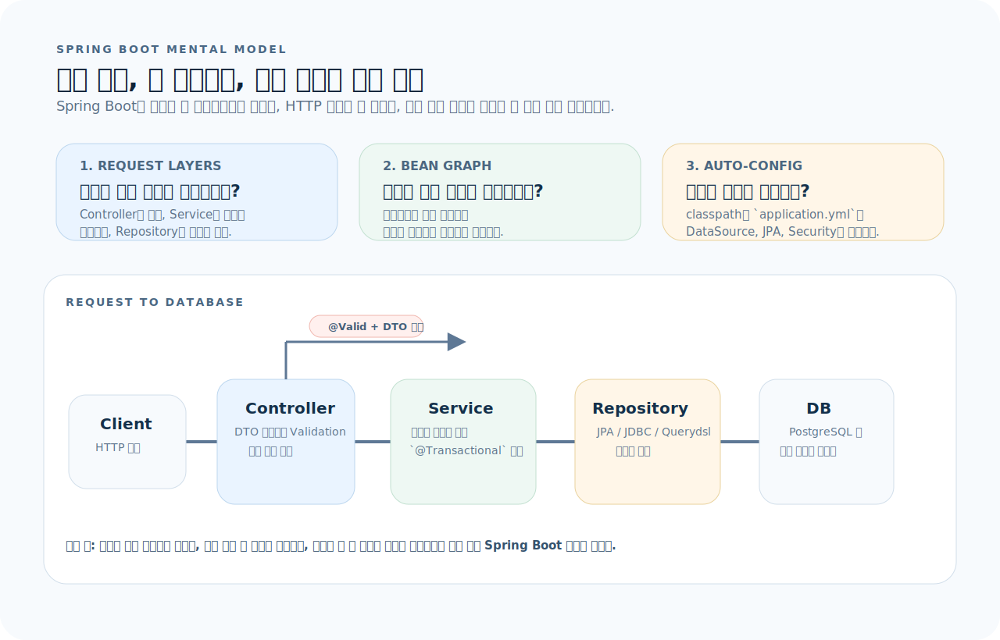
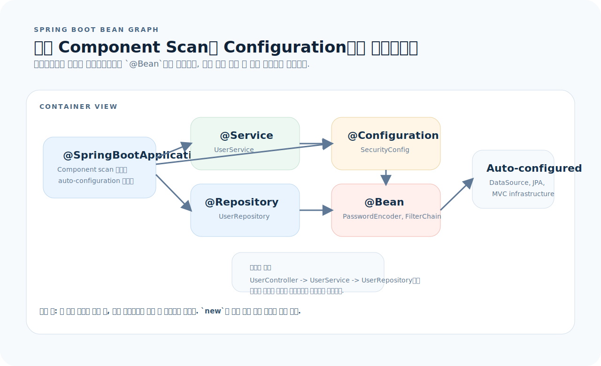
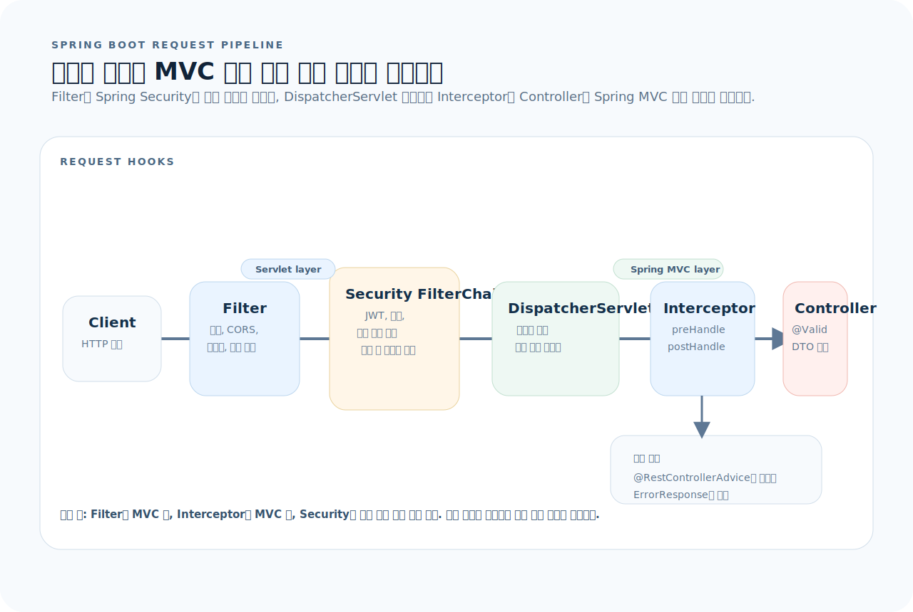

# Spring Boot 완전 가이드

Spring Boot는 Java/Kotlin으로 프로덕션 수준 백엔드를 빠르게 세우는 프레임워크다. 자동 구성(auto-configuration)이 보일러플레이트를 줄이고, 의존성 주입(DI)과 어노테이션 기반 선언이 구조를 강제한다. 이 글을 읽고 나면 Spring Boot 3.x 프로젝트를 설계하고, REST API를 구현하며, 계층 간 의존성을 제어할 수 있다.

먼저 아래 세 질문을 기준으로 읽으면 Spring Boot 코드가 훨씬 빨리 정리된다.

1. **빈 등록:** 이 클래스는 어떤 어노테이션으로 Spring 컨테이너에 등록되고, 어떤 스코프로 관리되는가?
2. **요청 흐름:** HTTP 요청이 Controller → Service → Repository를 어떤 순서로 통과하고, 트랜잭션 경계는 어디인가?
3. **자동 구성:** `application.yml`의 어떤 프로퍼티가 어떤 빈의 동작을 결정하는가?

---

## 1. Spring Boot의 사고방식

Spring Boot는 기능 목록보다 요청 하나가 어떤 계층을 어떤 규칙으로 통과하는지 먼저 잡는 편이 훨씬 이해가 빠르다.



이 그림은 이 문서 전체를 읽는 기준표다. 먼저 아래 세 질문으로 읽으면 된다.

1. **빈 등록:** 어떤 클래스가 컨테이너 빈이 되고, 설정값은 어디서 주입되는가?
2. **요청 흐름:** 요청이 `Controller → Service → Repository`를 어떤 순서로 지나며 어디서 트랜잭션이 열리는가?
3. **자동 구성:** `application.yml`의 프로퍼티가 어떤 인프라 빈 동작을 바꾸는가?

그림을 왼쪽에서 오른쪽으로 읽으면 Spring Boot는 "웹 프레임워크 + DI 컨테이너 + 자동 구성"의 결합이라는 점이 보인다. 즉 Spring Boot 코드는 `요청 계층`, `빈 그래프`, `설정 기반 자동 구성` 세 가지를 함께 읽어야 제대로 해석된다.

핵심 구조는 세 계층이다:

- **Controller**: HTTP 입구. 요청을 받고 응답을 만든다. 비즈니스 로직은 넣지 않는다.
- **Service**: 비즈니스 로직과 트랜잭션 경계. 여러 Repository를 조합한다.
- **Repository**: 데이터 액세스. JPA, JDBC, 외부 API 호출을 감싼다.

**Spring의 핵심 원리**: 모든 주요 클래스는 Spring 컨테이너가 관리하는 빈(Bean)이다. 개발자는 `new`를 직접 쓰지 않고 생성자 주입을 선언한다. 컨테이너가 의존성 그래프를 해석하고 인스턴스를 주입한다.

---

## 2. 프로젝트 구조

```
my-app/
├── build.gradle.kts
├── settings.gradle.kts
├── compose.yaml                     # 로컬 인프라 (PostgreSQL, Redis 등)
├── Makefile                         # run, test, lint, smoke 진입점
├── src/
│   ├── main/
│   │   ├── java/com/example/myapp/
│   │   │   ├── MyApplication.java   # @SpringBootApplication 진입점
│   │   │   ├── config/              # 설정 클래스
│   │   │   │   ├── SecurityConfig.java
│   │   │   │   └── WebConfig.java
│   │   │   ├── domain/              # 엔티티, 값 객체
│   │   │   │   └── User.java
│   │   │   ├── repository/          # Spring Data JPA 인터페이스
│   │   │   │   └── UserRepository.java
│   │   │   ├── service/             # 비즈니스 로직
│   │   │   │   └── UserService.java
│   │   │   ├── controller/          # REST 컨트롤러
│   │   │   │   └── UserController.java
│   │   │   ├── dto/                 # 요청/응답 DTO
│   │   │   │   ├── UserRequest.java
│   │   │   │   └── UserResponse.java
│   │   │   └── exception/           # 예외 처리
│   │   │       ├── ErrorResponse.java
│   │   │       └── GlobalExceptionHandler.java
│   │   └── resources/
│   │       ├── application.yml      # 메인 설정
│   │       ├── application-local.yml
│   │       └── db/migration/        # Flyway 마이그레이션
│   │           └── V1__init.sql
│   └── test/
│       └── java/com/example/myapp/
│           ├── controller/
│           │   └── UserControllerTest.java
│           ├── service/
│           │   └── UserServiceTest.java
│           └── integration/
│               └── UserIntegrationTest.java
└── gradle/wrapper/
```

### 초기 설정

```bash
# Spring Initializr로 생성
curl https://start.spring.io/starter.zip \
  -d type=gradle-project-kotlin \
  -d language=java \
  -d bootVersion=3.4.0 \
  -d baseDir=my-app \
  -d groupId=com.example \
  -d artifactId=my-app \
  -d dependencies=web,data-jpa,postgresql,validation,security,flyway \
  -o my-app.zip

unzip my-app.zip && cd my-app
```

---

## 3. 앱 생성과 구성

### 진입점

```java
@SpringBootApplication   // @Configuration + @EnableAutoConfiguration + @ComponentScan
public class MyApplication {
    public static void main(String[] args) {
        SpringApplication.run(MyApplication.class, args);
    }
}
```

### application.yml

```yaml
server:
  port: 8080
  servlet:
    context-path: /api

spring:
  datasource:
    url: jdbc:postgresql://localhost:5432/mydb
    username: ${DB_USER:postgres}
    password: ${DB_PASS:postgres}
  jpa:
    hibernate:
      ddl-auto: validate    # 운영: validate, 개발: update
    open-in-view: false      # OSIV 끄기 (lazy loading 명시 강제)
    properties:
      hibernate:
        format_sql: true
        default_batch_fetch_size: 100
  flyway:
    enabled: true
    locations: classpath:db/migration

logging:
  level:
    com.example: DEBUG
    org.hibernate.SQL: DEBUG
```

### 프로파일

```yaml
# application-local.yml
spring:
  datasource:
    url: jdbc:postgresql://localhost:5432/mydb_dev
logging:
  level:
    root: DEBUG

# application-prod.yml
spring:
  datasource:
    url: ${DATABASE_URL}
logging:
  level:
    root: WARN
```

```bash
# 프로파일 지정 실행
SPRING_PROFILES_ACTIVE=local ./gradlew bootRun
```

---

## 4. 의존성 주입

Spring의 근본 원리다. 컨테이너가 빈의 생성과 주입을 관리한다.



- `@ComponentScan`은 스테레오타입 어노테이션이 붙은 클래스를 찾아 빈으로 등록한다.
- `@Configuration` 안의 `@Bean` 메서드는 외부 라이브러리 객체나 세밀한 설정이 필요한 빈을 생성할 때 쓴다.
- 자동 구성은 `application.yml`과 classpath를 읽고 기반 빈을 먼저 만들고, 애플리케이션 빈은 그 위에 연결된다.

### 빈 등록 스테레오타입

```java
@Component          // 범용 빈
@Service            // 비즈니스 로직 빈
@Repository         // 데이터 액세스 빈 (예외 변환 추가)
@Controller         // MVC 컨트롤러
@RestController     // @Controller + @ResponseBody
@Configuration      // 설정 클래스 (내부에 @Bean 메서드 정의)
```

### 생성자 주입 (권장)

```java
@Service
public class UserService {
    private final UserRepository userRepository;
    private final PasswordEncoder passwordEncoder;

    // 생성자가 하나면 @Autowired 생략 가능
    public UserService(UserRepository userRepository,
                       PasswordEncoder passwordEncoder) {
        this.userRepository = userRepository;
        this.passwordEncoder = passwordEncoder;
    }
}
```

### @Configuration과 @Bean

```java
@Configuration
public class SecurityConfig {

    @Bean
    public PasswordEncoder passwordEncoder() {
        return new BCryptPasswordEncoder();
    }

    @Bean
    public SecurityFilterChain filterChain(HttpSecurity http) throws Exception {
        return http
            .csrf(csrf -> csrf.disable())
            .sessionManagement(sm -> sm.sessionCreationPolicy(STATELESS))
            .authorizeHttpRequests(auth -> auth
                .requestMatchers("/api/v1/auth/**").permitAll()
                .anyRequest().authenticated()
            )
            .build();
    }
}
```

---

## 5. Controller — HTTP 입구

### REST 컨트롤러

```java
@RestController
@RequestMapping("/api/v1/users")
public class UserController {
    private final UserService userService;

    public UserController(UserService userService) {
        this.userService = userService;
    }

    @GetMapping
    public List<UserResponse> list() {
        return userService.findAll();
    }

    @GetMapping("/{id}")
    public UserResponse getById(@PathVariable Long id) {
        return userService.findById(id);
    }

    @PostMapping
    @ResponseStatus(HttpStatus.CREATED)
    public UserResponse create(@Valid @RequestBody UserCreateRequest request) {
        return userService.create(request);
    }

    @PutMapping("/{id}")
    public UserResponse update(@PathVariable Long id,
                               @Valid @RequestBody UserUpdateRequest request) {
        return userService.update(id, request);
    }

    @DeleteMapping("/{id}")
    @ResponseStatus(HttpStatus.NO_CONTENT)
    public void delete(@PathVariable Long id) {
        userService.delete(id);
    }
}
```

### 쿼리 파라미터와 페이지네이션

```java
@GetMapping("/search")
public Page<UserResponse> search(
        @RequestParam(defaultValue = "") String keyword,
        @RequestParam(defaultValue = "0") int page,
        @RequestParam(defaultValue = "20") int size) {
    Pageable pageable = PageRequest.of(page, size, Sort.by("createdAt").descending());
    return userService.search(keyword, pageable);
}
```

---

## 6. DTO와 Validation

### 요청/응답 분리

```java
// 요청 DTO — record 사용
public record UserCreateRequest(
    @NotBlank @Size(max = 100) String name,
    @NotBlank @Email String email,
    @NotBlank @Size(min = 8, max = 100) String password
) {}

public record UserUpdateRequest(
    @NotBlank @Size(max = 100) String name,
    @Email String email
) {}

// 응답 DTO
public record UserResponse(
    Long id,
    String name,
    String email,
    LocalDateTime createdAt
) {
    public static UserResponse from(User user) {
        return new UserResponse(
            user.getId(),
            user.getName(),
            user.getEmail(),
            user.getCreatedAt()
        );
    }
}
```

### Validation 어노테이션

```java
@NotNull          // null 금지
@NotBlank         // null, "", " " 금지
@NotEmpty         // null, "" 금지 (빈 컬렉션도)
@Size(min, max)   // 문자열/컬렉션 크기
@Min @Max         // 숫자 범위
@Email            // 이메일 형식
@Pattern(regexp)  // 정규식
@Past @Future     // 날짜 제약
@Positive         // 양수
```

---

## 7. Service — 비즈니스 로직

```java
@Service
@Transactional(readOnly = true)    // 기본 읽기 전용
public class UserService {
    private final UserRepository userRepository;
    private final PasswordEncoder passwordEncoder;

    public UserService(UserRepository userRepository,
                       PasswordEncoder passwordEncoder) {
        this.userRepository = userRepository;
        this.passwordEncoder = passwordEncoder;
    }

    public List<UserResponse> findAll() {
        return userRepository.findAll().stream()
            .map(UserResponse::from)
            .toList();
    }

    public UserResponse findById(Long id) {
        User user = userRepository.findById(id)
            .orElseThrow(() -> new NotFoundException("User not found: " + id));
        return UserResponse.from(user);
    }

    @Transactional                  // 쓰기 트랜잭션
    public UserResponse create(UserCreateRequest request) {
        if (userRepository.existsByEmail(request.email())) {
            throw new ConflictException("Email already exists");
        }

        User user = User.builder()
            .name(request.name())
            .email(request.email())
            .password(passwordEncoder.encode(request.password()))
            .build();

        return UserResponse.from(userRepository.save(user));
    }

    @Transactional
    public UserResponse update(Long id, UserUpdateRequest request) {
        User user = userRepository.findById(id)
            .orElseThrow(() -> new NotFoundException("User not found: " + id));
        user.update(request.name(), request.email());
        return UserResponse.from(user);    // dirty checking으로 자동 저장
    }

    @Transactional
    public void delete(Long id) {
        if (!userRepository.existsById(id)) {
            throw new NotFoundException("User not found: " + id);
        }
        userRepository.deleteById(id);
    }
}
```

---

## 8. 예외 처리

### 전역 예외 핸들러

```java
@RestControllerAdvice
public class GlobalExceptionHandler {

    @ExceptionHandler(NotFoundException.class)
    @ResponseStatus(HttpStatus.NOT_FOUND)
    public ErrorResponse handleNotFound(NotFoundException e) {
        return new ErrorResponse("NOT_FOUND", e.getMessage());
    }

    @ExceptionHandler(ConflictException.class)
    @ResponseStatus(HttpStatus.CONFLICT)
    public ErrorResponse handleConflict(ConflictException e) {
        return new ErrorResponse("CONFLICT", e.getMessage());
    }

    @ExceptionHandler(MethodArgumentNotValidException.class)
    @ResponseStatus(HttpStatus.BAD_REQUEST)
    public ErrorResponse handleValidation(MethodArgumentNotValidException e) {
        String message = e.getBindingResult().getFieldErrors().stream()
            .map(f -> f.getField() + ": " + f.getDefaultMessage())
            .collect(Collectors.joining(", "));
        return new ErrorResponse("VALIDATION_ERROR", message);
    }

    @ExceptionHandler(Exception.class)
    @ResponseStatus(HttpStatus.INTERNAL_SERVER_ERROR)
    public ErrorResponse handleUnexpected(Exception e) {
        log.error("Unexpected error", e);
        return new ErrorResponse("INTERNAL_ERROR", "서버 오류가 발생했습니다");
    }
}

public record ErrorResponse(String code, String message) {}
```

---

## 9. 필터와 인터셉터

요청 파이프라인은 레이어 이름보다 "어떤 훅이 어느 단계에서 실행되는가"로 보는 편이 정확하다.



- `Filter`는 서블릿 레벨이라 Spring MVC 밖에서도 동작한다.
- Spring Security는 필터 체인 안에서 인증과 인가를 먼저 처리한다.
- `Interceptor`는 `DispatcherServlet`이 핸들러를 찾은 뒤 Controller 전후에 개입한다.

### Filter — 서블릿 레벨

```java
@Component
@Order(1)
public class RequestLoggingFilter extends OncePerRequestFilter {
    @Override
    protected void doFilterInternal(HttpServletRequest request,
                                    HttpServletResponse response,
                                    FilterChain chain) throws ServletException, IOException {
        long start = System.currentTimeMillis();
        chain.doFilter(request, response);
        long elapsed = System.currentTimeMillis() - start;
        log.info("{} {} → {} ({}ms)",
            request.getMethod(), request.getRequestURI(),
            response.getStatus(), elapsed);
    }
}
```

### Interceptor — Spring MVC 레벨

```java
@Component
public class AuthInterceptor implements HandlerInterceptor {
    @Override
    public boolean preHandle(HttpServletRequest request,
                             HttpServletResponse response,
                             Object handler) {
        // true 반환 시 계속 진행, false 시 중단
        return true;
    }
}

@Configuration
public class WebConfig implements WebMvcConfigurer {
    private final AuthInterceptor authInterceptor;

    public WebConfig(AuthInterceptor authInterceptor) {
        this.authInterceptor = authInterceptor;
    }

    @Override
    public void addInterceptors(InterceptorRegistry registry) {
        registry.addInterceptor(authInterceptor)
            .addPathPatterns("/api/**")
            .excludePathPatterns("/api/v1/auth/**");
    }
}
```

---

## 10. Spring Security

```java
@Configuration
@EnableWebSecurity
public class SecurityConfig {

    @Bean
    public SecurityFilterChain filterChain(HttpSecurity http) throws Exception {
        return http
            .csrf(csrf -> csrf.disable())
            .cors(cors -> cors.configurationSource(corsConfig()))
            .sessionManagement(sm ->
                sm.sessionCreationPolicy(SessionCreationPolicy.STATELESS))
            .authorizeHttpRequests(auth -> auth
                .requestMatchers(HttpMethod.POST, "/api/v1/auth/**").permitAll()
                .requestMatchers("/health/**").permitAll()
                .requestMatchers("/api/v1/admin/**").hasRole("ADMIN")
                .anyRequest().authenticated()
            )
            .addFilterBefore(jwtFilter(), UsernamePasswordAuthenticationFilter.class)
            .build();
    }

    @Bean
    public PasswordEncoder passwordEncoder() {
        return new BCryptPasswordEncoder();
    }

    private CorsConfigurationSource corsConfig() {
        CorsConfiguration config = new CorsConfiguration();
        config.setAllowedOrigins(List.of("http://localhost:3000"));
        config.setAllowedMethods(List.of("GET", "POST", "PUT", "DELETE"));
        config.setAllowedHeaders(List.of("*"));
        UrlBasedCorsConfigurationSource source = new UrlBasedCorsConfigurationSource();
        source.registerCorsConfiguration("/**", config);
        return source;
    }
}
```

---

## 11. DB 마이그레이션 — Flyway

```sql
-- src/main/resources/db/migration/V1__create_users.sql
CREATE TABLE users (
    id         BIGSERIAL    PRIMARY KEY,
    name       VARCHAR(100) NOT NULL,
    email      VARCHAR(255) NOT NULL UNIQUE,
    password   VARCHAR(255) NOT NULL,
    role       VARCHAR(20)  NOT NULL DEFAULT 'USER',
    created_at TIMESTAMP    NOT NULL DEFAULT now(),
    updated_at TIMESTAMP    NOT NULL DEFAULT now()
);

-- V2__create_posts.sql
CREATE TABLE posts (
    id         BIGSERIAL    PRIMARY KEY,
    title      VARCHAR(300) NOT NULL,
    content    TEXT,
    author_id  BIGINT       NOT NULL REFERENCES users(id),
    created_at TIMESTAMP    NOT NULL DEFAULT now()
);
```

```yaml
# application.yml
spring:
  flyway:
    enabled: true
    locations: classpath:db/migration
    baseline-on-migrate: true
```

파일 이름 규칙: `V{version}__{description}.sql` — 버전은 순서 보장용이다.

---

## 12. 테스트

### 단위 테스트

```java
@ExtendWith(MockitoExtension.class)
class UserServiceTest {
    @Mock UserRepository userRepository;
    @Mock PasswordEncoder passwordEncoder;
    @InjectMocks UserService userService;

    @Test
    void findById_존재하는_사용자() {
        User user = User.builder().id(1L).name("alice").email("a@b.com").build();
        given(userRepository.findById(1L)).willReturn(Optional.of(user));

        UserResponse result = userService.findById(1L);

        assertThat(result.name()).isEqualTo("alice");
    }

    @Test
    void findById_없는_사용자() {
        given(userRepository.findById(1L)).willReturn(Optional.empty());

        assertThatThrownBy(() -> userService.findById(1L))
            .isInstanceOf(NotFoundException.class);
    }
}
```

### 통합 테스트 — MockMvc

```java
@SpringBootTest
@AutoConfigureMockMvc
@Transactional
class UserControllerTest {
    @Autowired MockMvc mockMvc;
    @Autowired ObjectMapper objectMapper;

    @Test
    void 사용자_생성() throws Exception {
        var request = new UserCreateRequest("alice", "a@b.com", "password123");

        mockMvc.perform(post("/api/v1/users")
                .contentType(MediaType.APPLICATION_JSON)
                .content(objectMapper.writeValueAsString(request)))
            .andExpect(status().isCreated())
            .andExpect(jsonPath("$.name").value("alice"))
            .andExpect(jsonPath("$.email").value("a@b.com"));
    }
}
```

### Testcontainers

```java
@SpringBootTest
@Testcontainers
class UserIntegrationTest {
    @Container
    static PostgreSQLContainer<?> postgres =
        new PostgreSQLContainer<>("postgres:16-alpine");

    @DynamicPropertySource
    static void configureProperties(DynamicPropertyRegistry registry) {
        registry.add("spring.datasource.url", postgres::getJdbcUrl);
        registry.add("spring.datasource.username", postgres::getUsername);
        registry.add("spring.datasource.password", postgres::getPassword);
    }

    @Autowired UserRepository userRepository;

    @Test
    void 실제_DB에_저장_조회() {
        User user = User.builder().name("bob").email("b@b.com").password("enc").build();
        userRepository.save(user);

        assertThat(userRepository.findByEmail("b@b.com")).isPresent();
    }
}
```

---

## 13. Actuator와 Health Check

```yaml
# build.gradle.kts
dependencies {
    implementation("org.springframework.boot:spring-boot-starter-actuator")
}

# application.yml
management:
  endpoints:
    web:
      exposure:
        include: health,info,metrics
  endpoint:
    health:
      show-details: when-authorized
```

```bash
curl http://localhost:8080/actuator/health
# {"status":"UP","components":{"db":{"status":"UP"},"redis":{"status":"UP"}}}
```

---

## 14. 자주 하는 실수

| 실수 | 올바른 방법 |
|------|-------------|
| Controller에 비즈니스 로직 작성 | Service 계층으로 분리. Controller는 입출력만 |
| `@Transactional` 없이 여러 DB 작업 | Service 메서드에 `@Transactional` 선언 |
| `open-in-view: true` 방치 | `false`로 바꾸고 필요한 곳에서 fetch join |
| Entity를 API 응답으로 직접 반환 | DTO(record)로 변환해서 반환 |
| 필드 주입 `@Autowired` 사용 | 생성자 주입 사용 (테스트 용이) |
| Flyway 없이 `ddl-auto: update` 운영 | Flyway/Liquibase로 스키마 버전 관리 |
| 예외를 Controller마다 개별 처리 | `@RestControllerAdvice`로 전역 처리 |
| 테스트 없이 배포 | 최소한 Controller + Service 단위 테스트 |

---

## 15. 빠른 참조

```java
// ── 진입점 ──
@SpringBootApplication
public class App { public static void main(String[] a) { SpringApplication.run(App.class, a); } }

// ── Controller ──
@RestController
@RequestMapping("/api/v1/items")
public class ItemController {
    @GetMapping             List<Item> list() { }
    @GetMapping("/{id}")    Item get(@PathVariable Long id) { }
    @PostMapping            @ResponseStatus(CREATED) Item create(@Valid @RequestBody Req r) { }
    @PutMapping("/{id}")    Item update(@PathVariable Long id, @Valid @RequestBody Req r) { }
    @DeleteMapping("/{id}") @ResponseStatus(NO_CONTENT) void delete(@PathVariable Long id) { }
}

// ── Service ──
@Service @Transactional(readOnly = true)
public class ItemService {
    @Transactional public Item create(Req r) { }
}

// ── Validation ──
public record Req(@NotBlank String name, @Email String email, @Min(0) int age) {}

// ── 예외 ──
@RestControllerAdvice
public class Handler {
    @ExceptionHandler(NotFoundException.class) @ResponseStatus(NOT_FOUND)
    ErrorResponse handle(NotFoundException e) { return new ErrorResponse("NOT_FOUND", e.getMessage()); }
}

// ── 테스트 ──
@SpringBootTest @AutoConfigureMockMvc
class Test {
    @Autowired MockMvc mvc;
    @Test void test() throws Exception {
        mvc.perform(get("/api/v1/items")).andExpect(status().isOk());
    }
}

// ── 실행 ──
// ./gradlew bootRun
// SPRING_PROFILES_ACTIVE=local ./gradlew bootRun
// ./gradlew test
```
