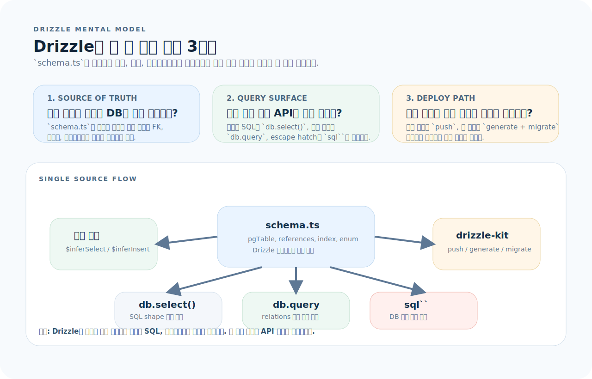
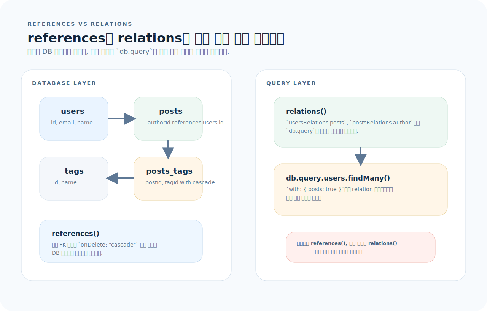
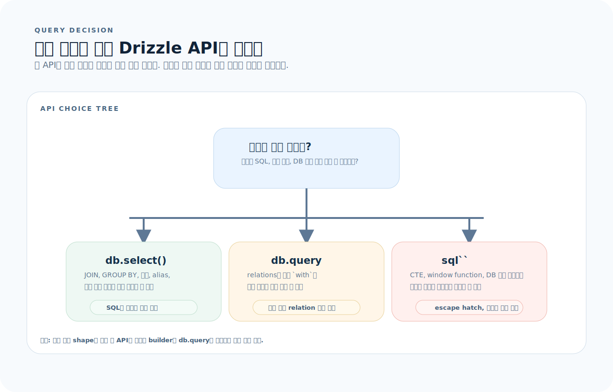
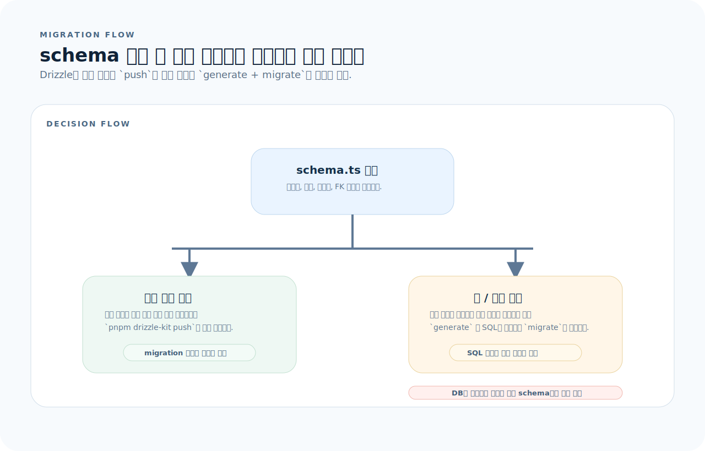

# Drizzle ORM 완전 가이드

Drizzle ORM은 TypeScript 네이티브 ORM이다. "SQL을 아는 개발자가 타입 안전하게 쿼리를 쓰는 것"이 설계 철학이다. Prisma와 달리 코드 생성 없이 스키마 정의에서 타입이 자동 추론되고, 생성되는 SQL을 예측할 수 있다. 이 글을 읽고 나면 Drizzle로 스키마를 설계하고, 마이그레이션을 관리하며, 타입 안전한 쿼리를 자유롭게 작성할 수 있다.

---

## 1. Drizzle의 사고방식

Drizzle는 "ORM이 뭘 대신해 주는가?"보다 "어떤 코드가 단일 진실 공급원인가?"를 먼저 잡는 편이 이해가 빠르다. `schema.ts` 하나가 타입, 쿼리 표면, 마이그레이션 흐름 전체를 묶기 때문이다.



이 그림은 이 문서 전체를 읽는 기준표다. 먼저 아래 세 질문으로 읽으면 된다.

1. **Source of truth:** 어떤 테이블 정의가 타입과 SQL shape를 동시에 결정하는가?
2. **Query surface:** `db.select()`, `db.query`, `sql\`\`` 중 지금 무엇을 써야 하는가?
3. **Deploy path:** 지금 필요한 것이 빠른 로컬 반영인지, 리뷰 가능한 migration 이력인지?

뒤 섹션들은 이 세 질문을 순서대로 구체화한다. 스키마와 relations는 "무엇을 어떻게 모델링하는가", 조회 API와 트랜잭션은 "어떻게 읽고 쓰는가", 마이그레이션은 "어떻게 배포 가능한 변경으로 만든다"를 설명한다.

---

## 2. 설치와 초기 설정

```bash
# PostgreSQL 기준
pnpm add drizzle-orm postgres
pnpm add -D drizzle-kit
```

### drizzle.config.ts

```ts
import { defineConfig } from "drizzle-kit";

export default defineConfig({
  schema: "./src/db/schema.ts",
  out: "./drizzle",               // 마이그레이션 파일 디렉터리
  dialect: "postgresql",
  dbCredentials: {
    url: process.env.DATABASE_URL!,
  },
});
```

### DB 클라이언트 초기화

```ts
// src/db/index.ts
import { drizzle } from "drizzle-orm/postgres-js";
import postgres from "postgres";
import * as schema from "./schema";

const client = postgres(process.env.DATABASE_URL!);
export const db = drizzle(client, { schema });
```

---

## 3. 스키마 정의

Drizzle에서는 스키마 코드가 단순한 타입 선언이 아니라 DB 제약과 애플리케이션 타입의 공통 출발점이다. 그래서 이 섹션은 이후 `relations`, `db.query`, 마이그레이션 섹션의 기반이 된다.

### 기본 테이블

```ts
// src/db/schema.ts
import {
  pgTable, uuid, text, varchar, integer,
  timestamp, boolean, serial, pgEnum,
} from "drizzle-orm/pg-core";

// Enum 정의
export const roleEnum = pgEnum("role", ["user", "admin", "editor"]);

// Users 테이블
export const users = pgTable("users", {
  id: uuid("id").defaultRandom().primaryKey(),
  email: varchar("email", { length: 255 }).notNull().unique(),
  name: varchar("name", { length: 100 }).notNull(),
  role: roleEnum("role").default("user").notNull(),
  isActive: boolean("is_active").default(true).notNull(),
  createdAt: timestamp("created_at").defaultNow().notNull(),
  updatedAt: timestamp("updated_at").defaultNow().notNull(),
});

// Posts 테이블
export const posts = pgTable("posts", {
  id: serial("id").primaryKey(),
  title: varchar("title", { length: 300 }).notNull(),
  content: text("content"),
  published: boolean("published").default(false).notNull(),
  authorId: uuid("author_id")
    .notNull()
    .references(() => users.id, { onDelete: "cascade" }),
  createdAt: timestamp("created_at").defaultNow().notNull(),
});

// Tags 테이블
export const tags = pgTable("tags", {
  id: serial("id").primaryKey(),
  name: varchar("name", { length: 50 }).notNull().unique(),
});

// 다대다 관계 — junction 테이블
export const postsTags = pgTable("posts_tags", {
  postId: integer("post_id")
    .notNull()
    .references(() => posts.id, { onDelete: "cascade" }),
  tagId: integer("tag_id")
    .notNull()
    .references(() => tags.id, { onDelete: "cascade" }),
});
```

### 타입 자동 추론

```ts
// 스키마에서 타입 추출 — 별도 interface 정의 불필요
export type User = typeof users.$inferSelect;       // 조회 시 타입
export type NewUser = typeof users.$inferInsert;     // 삽입 시 타입

export type Post = typeof posts.$inferSelect;
export type NewPost = typeof posts.$inferInsert;
```

> `$inferSelect`는 모든 필드 포함 (default 포함), `$inferInsert`는 default가 있는 필드를 optional로 만든다.

---

## 4. Relations 정의

`references()`와 `relations()`는 서로 대체재가 아니다. 하나는 DB 무결성을, 다른 하나는 Drizzle 쿼리 API의 탐색 경로를 설명한다.



그림 기준으로 먼저 보면 된다.

- `references()`는 DB에 실제 FK 제약과 삭제 규칙을 만든다.
- `relations()`는 `db.query`에서 어떤 `with` 경로를 안전하게 따라갈지 알려준다.
- 둘 중 하나만 있으면 무결성 또는 중첩 조회 편의성 중 하나가 비게 된다.

Drizzle의 relation은 쿼리 API(`db.query`)에서 `with`를 사용하기 위한 **메타데이터 선언**이다. DB 제약조건(FK)과는 별개이므로 `references()`와 함께 정의해야 한다.

```ts
import { relations } from "drizzle-orm";

export const usersRelations = relations(users, ({ many }) => ({
  posts: many(posts),
}));

export const postsRelations = relations(posts, ({ one, many }) => ({
  author: one(users, {
    fields: [posts.authorId],
    references: [users.id],
  }),
  tags: many(postsTags),
}));

export const postsTagsRelations = relations(postsTags, ({ one }) => ({
  post: one(posts, {
    fields: [postsTags.postId],
    references: [posts.id],
  }),
  tag: one(tags, {
    fields: [postsTags.tagId],
    references: [tags.id],
  }),
}));

export const tagsRelations = relations(tags, ({ many }) => ({
  posts: many(postsTags),
}));
```

---

## 5. CRUD — Select

Drizzle는 조회를 세 가지 표면으로 제공한다. 어떤 문제를 푸는지 먼저 정하면 코드가 단순해진다.



그림 기준으로 분류하면 된다.

- SQL 모양을 세밀하게 제어하려면 `db.select()` 빌더를 쓴다.
- relation 그래프를 따라 중첩 결과를 읽고 싶으면 `db.query`를 쓴다.
- DB 고유 기능이나 escape hatch가 필요하면 `sql\`\``로 내려간다.

### 기본 조회

```ts
import { eq, and, or, gt, like, desc, asc, count, sql } from "drizzle-orm";

// 전체 조회
const allUsers = await db.select().from(users);

// 조건 조회
const activeAdmins = await db
  .select()
  .from(users)
  .where(and(eq(users.role, "admin"), eq(users.isActive, true)));

// 특정 컬럼만
const emails = await db
  .select({ id: users.id, email: users.email })
  .from(users);

// LIKE 검색
const results = await db
  .select()
  .from(users)
  .where(like(users.name, "%lee%"));

// 정렬 + 페이지네이션
const page = await db
  .select()
  .from(users)
  .orderBy(desc(users.createdAt))
  .limit(20)
  .offset(0);
```

### JOIN

```ts
// INNER JOIN
const postsWithAuthor = await db
  .select({
    postTitle: posts.title,
    authorName: users.name,
    authorEmail: users.email,
  })
  .from(posts)
  .innerJoin(users, eq(posts.authorId, users.id))
  .where(eq(posts.published, true));

// LEFT JOIN
const usersWithPosts = await db
  .select()
  .from(users)
  .leftJoin(posts, eq(users.id, posts.authorId));
```

### Query API — relations 기반 조회

```ts
// Prisma 스타일의 중첩 조회
const usersWithPosts = await db.query.users.findMany({
  with: {
    posts: {
      where: eq(posts.published, true),
      orderBy: [desc(posts.createdAt)],
      limit: 5,
    },
  },
});

// 단일 조회
const user = await db.query.users.findFirst({
  where: eq(users.email, "lee@example.com"),
  with: { posts: true },
});
```

### 집계

```ts
const stats = await db
  .select({
    role: users.role,
    userCount: count(users.id),
  })
  .from(users)
  .groupBy(users.role);
```

---

## 6. CRUD — Insert, Update, Delete

### Insert

```ts
// 단일 삽입
const [newUser] = await db
  .insert(users)
  .values({ email: "kim@example.com", name: "Kim" })
  .returning();

// 다건 삽입
await db.insert(users).values([
  { email: "a@example.com", name: "A" },
  { email: "b@example.com", name: "B" },
]);

// UPSERT — ON CONFLICT
await db
  .insert(users)
  .values({ email: "kim@example.com", name: "Kim Updated" })
  .onConflictDoUpdate({
    target: users.email,
    set: { name: "Kim Updated", updatedAt: new Date() },
  });
```

### Update

```ts
const [updated] = await db
  .update(users)
  .set({ name: "New Name", updatedAt: new Date() })
  .where(eq(users.id, userId))
  .returning();
```

### Delete

```ts
await db.delete(users).where(eq(users.id, userId));
```

---

## 7. 트랜잭션

```ts
const result = await db.transaction(async (tx) => {
  const [newUser] = await tx
    .insert(users)
    .values({ email: "lee@example.com", name: "Lee" })
    .returning();

  await tx
    .insert(posts)
    .values({ title: "First Post", authorId: newUser.id });

  return newUser;
});

// 중첩 트랜잭션 (savepoint)
await db.transaction(async (tx) => {
  await tx.insert(users).values({ email: "a@example.com", name: "A" });

  try {
    await tx.transaction(async (tx2) => {
      await tx2.insert(users).values({ email: "b@example.com", name: "B" });
      throw new Error("rollback inner");
    });
  } catch {
    // 내부 savepoint만 롤백, 외부 트랜잭션은 유지
  }
});
```

---

## 8. Raw SQL

```ts
import { sql } from "drizzle-orm";

// Raw SQL 사용
const result = await db.execute(
  sql`SELECT * FROM users WHERE email = ${email}`
);

// 쿼리 빌더에서 sql`` 사용
const users = await db
  .select()
  .from(users)
  .where(sql`${users.email} ILIKE ${"%" + search + "%"}`);

// 타입이 있는 raw SQL
const result = await db.execute<{ total: number }>(
  sql`SELECT COUNT(*) as total FROM users`
);
```

---

## 9. 마이그레이션

마이그레이션은 "지금 당장 DB를 맞추는 작업"과 "팀이 리뷰할 변경 이력"을 분리해서 이해하면 헷갈리지 않는다.



그림 기준으로 기억하면 된다.

- `db push`는 로컬 개발 속도를 높이는 도구다.
- `generate + migrate`는 SQL 파일을 리뷰하고 배포 순서를 통제하기 위한 흐름이다.
- 마이그레이션 파일은 스키마 정의의 결과물이지, 스키마를 대신하는 원본이 아니다.

### 개발 흐름: db push

스키마를 빠르게 반복할 때 사용. 마이그레이션 파일을 생성하지 않는다.

```bash
pnpm drizzle-kit push
```

### 프로덕션 흐름: generate + migrate

```bash
# 1. 스키마 변경 후 마이그레이션 생성
pnpm drizzle-kit generate

# 2. 생성된 파일 확인
ls drizzle/
# 0000_initial.sql
# 0001_add_posts_table.sql

# 3. 마이그레이션 실행
pnpm drizzle-kit migrate
```

### 코드에서 마이그레이션 실행

```ts
import { migrate } from "drizzle-orm/postgres-js/migrator";
import { drizzle } from "drizzle-orm/postgres-js";
import postgres from "postgres";

const client = postgres(process.env.DATABASE_URL!, { max: 1 });
const db = drizzle(client);

await migrate(db, { migrationsFolder: "./drizzle" });
await client.end();
```

### Drizzle Studio — 브라우저 DB 탐색기

```bash
pnpm drizzle-kit studio
# → http://local.drizzle.studio
```

---

## 10. 인덱스와 제약조건

```ts
import { pgTable, varchar, index, uniqueIndex } from "drizzle-orm/pg-core";

export const users = pgTable(
  "users",
  {
    id: uuid("id").defaultRandom().primaryKey(),
    email: varchar("email", { length: 255 }).notNull(),
    name: varchar("name", { length: 100 }).notNull(),
    orgId: uuid("org_id").notNull(),
  },
  (table) => [
    uniqueIndex("users_email_idx").on(table.email),
    index("users_org_id_idx").on(table.orgId),
    // 복합 인덱스
    index("users_org_name_idx").on(table.orgId, table.name),
  ],
);
```

---

## 11. 실전 패턴

### Repository 패턴

```ts
// src/modules/user/user.repository.ts
import { db } from "@/db";
import { users, NewUser } from "@/db/schema";
import { eq } from "drizzle-orm";

export const userRepository = {
  async findById(id: string) {
    return db.query.users.findFirst({
      where: eq(users.id, id),
    });
  },

  async findByEmail(email: string) {
    return db.query.users.findFirst({
      where: eq(users.email, email),
    });
  },

  async create(data: NewUser) {
    const [user] = await db.insert(users).values(data).returning();
    return user;
  },

  async update(id: string, data: Partial<NewUser>) {
    const [user] = await db
      .update(users)
      .set({ ...data, updatedAt: new Date() })
      .where(eq(users.id, id))
      .returning();
    return user;
  },

  async delete(id: string) {
    await db.delete(users).where(eq(users.id, id));
  },
};
```

### Seed 스크립트

```ts
// src/db/seed.ts
import { db } from "./index";
import { users, posts } from "./schema";

async function seed() {
  console.log("Seeding...");

  // 기존 데이터 삭제 (개발 환경에서만)
  await db.delete(posts);
  await db.delete(users);

  const [user] = await db
    .insert(users)
    .values({ email: "admin@example.com", name: "Admin", role: "admin" })
    .returning();

  await db.insert(posts).values([
    { title: "First Post", content: "Hello world", authorId: user.id, published: true },
    { title: "Draft", content: "WIP", authorId: user.id },
  ]);

  console.log("Seed complete");
  process.exit(0);
}

seed();
```

```json
// package.json
{
  "scripts": {
    "db:push": "drizzle-kit push",
    "db:generate": "drizzle-kit generate",
    "db:migrate": "drizzle-kit migrate",
    "db:studio": "drizzle-kit studio",
    "db:seed": "tsx src/db/seed.ts"
  }
}
```

---

## 12. Drizzle vs Prisma

| 기준 | Drizzle | Prisma |
|------|---------|--------|
| 스키마 언어 | TypeScript | Prisma SDL (.prisma) |
| 코드 생성 | 불필요 (추론) | `prisma generate` 필수 |
| 쿼리 스타일 | SQL-like builder | 독자적 API |
| SQL 예측 가능성 | ✅ 높음 | ⚠️ 추상화 뒤에 숨겨짐 |
| Raw SQL | `sql\`\`` 자연스럽게 혼합 | `$queryRaw` 별도 API |
| 타입 안전성 | ✅ 스키마에서 추론 | ✅ 코드 생성으로 보장 |
| 학습 곡선 | SQL을 안다면 낮음 | 독자적 API 학습 필요 |
| 생태계 | 성장 중 | 성숙 |

---

## 13. 자주 하는 실수

| 실수 | 원인과 해결 |
|------|-------------|
| 스키마 수정 후 `db:push` 누락 | 코드와 DB가 불일치 → 런타임 에러. 변경 후 반드시 push/migrate |
| `$inferSelect` vs `$inferInsert` 혼동 | Select는 모든 필드 필수, Insert는 default 있는 필드 optional |
| relation만 정의하고 `references()` 누락 | relation은 쿼리 API용 메타데이터. FK 제약은 `references()`로 별도 선언 |
| `.toSQL()`로 검증하지 않음 | 복잡한 쿼리는 `.toSQL()`로 생성 SQL 확인 |
| DB 연결 풀 미설정 | `postgres(url, { max: 10 })`으로 커넥션 풀 설정 |
| 마이그레이션 파일 수동 편집 | 생성된 SQL은 직접 수정하지 말고, 스키마를 수정 후 재생성 |

---

## 14. 빠른 참조

```ts
// ── 스키마 ──
pgTable("name", { ... }, (t) => [...indexes])
uuid("col").defaultRandom().primaryKey()
varchar("col", { length: 255 }).notNull().unique()
timestamp("col").defaultNow()
.references(() => other.id, { onDelete: "cascade" })

// ── 타입 추출 ──
type T = typeof table.$inferSelect;  // 조회용
type N = typeof table.$inferInsert;  // 삽입용

// ── 조건 ──
eq(col, val)  and(a, b)  or(a, b)
gt(col, val)  gte(col, val)  lt(col, val)  lte(col, val)
like(col, "%pattern%")  isNull(col)  isNotNull(col)
inArray(col, [1,2,3])  between(col, lo, hi)

// ── 쿼리 ──
db.select().from(t).where().orderBy().limit().offset()
db.insert(t).values({}).returning()
db.update(t).set({}).where().returning()
db.delete(t).where()
db.query.t.findFirst({ where, with })
db.query.t.findMany({ where, with, orderBy, limit })

// ── 마이그레이션 ──
drizzle-kit push       // 개발: 스키마 직접 반영
drizzle-kit generate   // 프로덕션: SQL 파일 생성
drizzle-kit migrate    // 프로덕션: SQL 실행
drizzle-kit studio     // DB 탐색기
```
