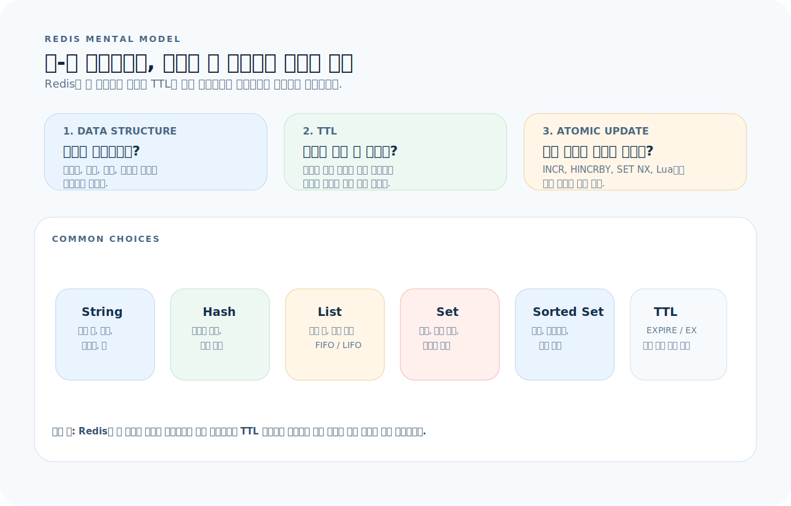
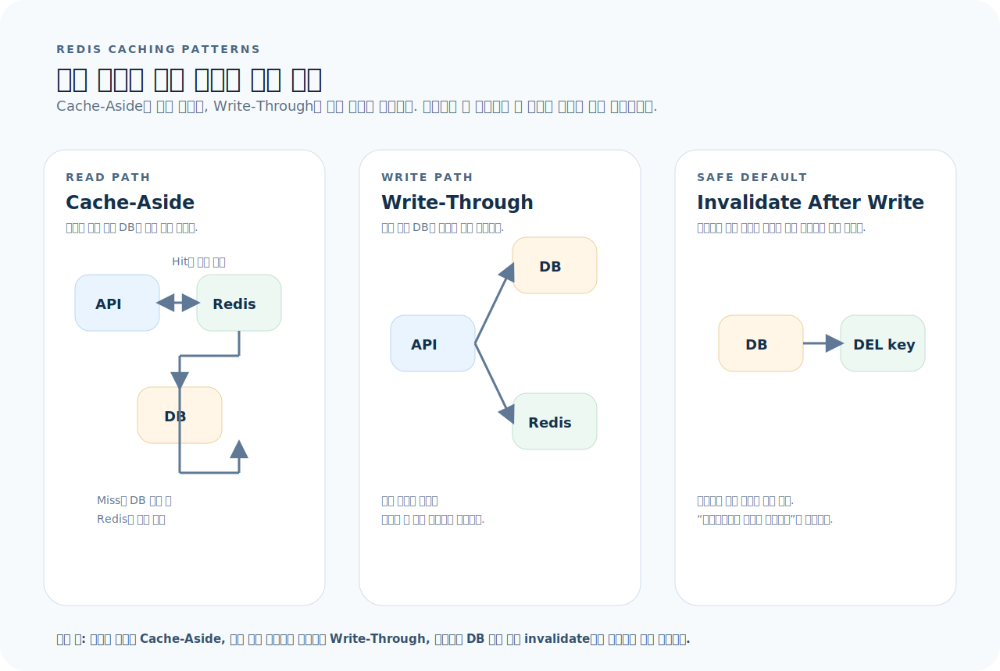
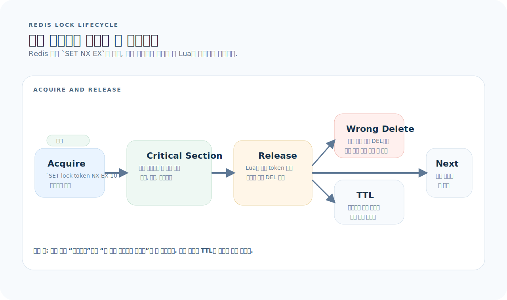

# Redis 완전 가이드

Redis는 인메모리 키-값 데이터 저장소다. 캐시, 세션, 메시지 브로커, 속도 제한, 순위표 등 "빠른 읽기/쓰기가 필요한 거의 모든 곳"에서 쓰인다. 데이터 구조(String, Hash, List, Set, Sorted Set)를 네이티브로 지원하기 때문에 단순 캐시를 넘어서는 다양한 패턴을 제공한다. 이 글을 읽고 나면 Redis의 자료구조, 캐싱 전략, 그리고 Python/Java 양쪽에서의 실무 사용법을 다룰 수 있다.

먼저 아래 세 질문을 기준으로 읽으면 Redis 코드가 훨씬 빨리 정리된다.

1. **자료구조 선택:** 이 데이터는 String, Hash, List, Set, Sorted Set 중 어디에 넣는 것이 맞는가?
2. **만료 전략:** 이 키의 TTL은 몇 초이고, 캐시 미스 시 어떤 전략(Cache-Aside, Write-Through)을 쓰는가?
3. **일관성 경계:** 이 캐시 데이터가 DB와 어떤 지점에서 불일치할 수 있고, 그 허용 범위는 어디까지인가?

---

## 1. Redis의 사고방식

Redis는 "빠른 읽기"를 위한 도구가 아니라, "메모리에 데이터 구조를 올려놓고 원자적으로 조작하는" 서버다.



이 그림은 이 문서 전체를 읽는 기준표다. 먼저 아래 세 질문으로 읽으면 된다.

1. **자료구조 선택:** 값 하나인지, 객체인지, 순서가 필요한지에 따라 어떤 타입을 고를 것인가?
2. **만료 전략:** 이 키는 얼마 동안만 유효하고, 만료 후 다시 어떻게 채울 것인가?
3. **일관성 경계:** DB와 어긋나도 괜찮은가, 아니면 쓰기 직후 바로 무효화해야 하는가?

그림을 왼쪽에서 오른쪽으로 읽으면 Redis는 "메모리 위 자료구조 서버"라는 점이 먼저 보인다. 즉 Redis 코드는 `자료구조 선택`, `TTL 설계`, `원자적 갱신` 세 가지를 함께 결정해야 한다.

**핵심 특성:**
- 싱글 스레드 이벤트 루프 → 명령 하나가 원자적
- 데이터 구조를 네이티브로 지원 → O(1) 해시 조회, O(log N) 정렬 집합
- 디스크 지속성 선택 가능 (RDB 스냅샷, AOF 로그)
- Pub/Sub, Stream 등 메시징 기능 내장

**Redis를 쓰는 대표 시나리오:**

| 시나리오 | 자료구조 | 예 |
|----------|----------|-----|
| 캐시 | String, Hash | DB 쿼리 결과 캐싱 |
| 세션 저장소 | Hash | 사용자 세션 데이터 |
| 속도 제한 | String + INCR | API rate limiting |
| 순위표 | Sorted Set | 게임 랭킹 |
| 대기열 | List, Stream | 작업 큐, 이벤트 스트림 |
| 분산 락 | String + NX | 중복 실행 방지 |
| 실시간 카운터 | String + INCR | 좋아요, 조회수 |

---

## 2. 로컬 환경과 기본 명령

### Docker Compose

```yaml
services:
  redis:
    image: redis:7-alpine
    ports: ["6379:6379"]
    command: redis-server --maxmemory 256mb --maxmemory-policy allkeys-lru
```

### CLI 기본

```bash
redis-cli

# String
SET user:1:name "alice"
GET user:1:name               # "alice"
SET token:abc "user:1" EX 3600   # 1시간 TTL
TTL token:abc                    # 남은 초
DEL token:abc

# 숫자
SET counter 0
INCR counter                     # 1
INCRBY counter 10                # 11
DECR counter                     # 10

# 만료
EXPIRE key 300                   # 5분 후 삭제
PEXPIRE key 1500                 # 1.5초 후 삭제
PERSIST key                      # 만료 제거

# 키 탐색
KEYS user:*                      # 패턴 매치 (운영 금지)
SCAN 0 MATCH user:* COUNT 100   # 안전한 반복 탐색
EXISTS key
TYPE key
```

---

## 3. 자료구조

### Hash — 객체 저장

```bash
HSET user:1 name "alice" email "a@b.com" role "user"
HGET user:1 name                 # "alice"
HGETALL user:1                   # 전체 필드
HDEL user:1 role
HEXISTS user:1 email             # 1
HINCRBY user:1 login_count 1
```

### List — 큐/스택

```bash
LPUSH queue:tasks "task1" "task2"   # 왼쪽 삽입
RPOP queue:tasks                     # 오른쪽 꺼내기 (FIFO 큐)
LRANGE queue:tasks 0 -1              # 전체 조회
LLEN queue:tasks                     # 길이
BRPOP queue:tasks 30                 # 블로킹 팝 (30초 대기)
```

### Set — 고유 값 집합

```bash
SADD tags:post:1 "java" "spring" "jpa"
SMEMBERS tags:post:1                 # 전체 멤버
SISMEMBER tags:post:1 "java"         # 1
SCARD tags:post:1                    # 3
SINTER tags:post:1 tags:post:2       # 교집합
SUNION tags:post:1 tags:post:2       # 합집합
```

### Sorted Set — 점수 기반 정렬

```bash
ZADD leaderboard 100 "alice" 85 "bob" 92 "carol"
ZRANGE leaderboard 0 -1 WITHSCORES          # 오름차순
ZREVRANGE leaderboard 0 2 WITHSCORES        # 상위 3명
ZSCORE leaderboard "alice"                   # 100
ZRANK leaderboard "alice"                    # 순위 (0-based)
ZINCRBY leaderboard 5 "bob"                  # 점수 +5
```

---

## 4. Python — redis-py

### 설치와 연결

```bash
uv add redis
```

```python
import redis

r = redis.Redis(host="localhost", port=6379, db=0, decode_responses=True)

# 기본 조작
r.set("key", "value", ex=3600)    # 1시간 TTL
r.get("key")                       # "value"
r.delete("key")
r.exists("key")                    # 0

# Hash
r.hset("user:1", mapping={"name": "alice", "email": "a@b.com"})
r.hgetall("user:1")                # {"name": "alice", "email": "a@b.com"}

# Sorted Set
r.zadd("board", {"alice": 100, "bob": 85})
r.zrevrange("board", 0, 9, withscores=True)  # Top 10

# Pipeline — 여러 명령을 한 번에 전송
with r.pipeline() as pipe:
    pipe.set("a", 1)
    pipe.set("b", 2)
    pipe.incr("counter")
    results = pipe.execute()        # [True, True, 1]
```

### FastAPI 세션 주입

```python
from redis.asyncio import Redis as AsyncRedis

async def get_redis() -> AsyncRedis:
    return AsyncRedis(host="localhost", port=6379, decode_responses=True)

@router.get("/cached/{key}")
async def get_cached(key: str, redis: AsyncRedis = Depends(get_redis)):
    value = await redis.get(f"cache:{key}")
    if value is None:
        raise HTTPException(404, "Cache miss")
    return {"key": key, "value": value}
```

---

## 5. Java — Spring Data Redis

### 의존성

```kotlin
// build.gradle.kts
dependencies {
    implementation("org.springframework.boot:spring-boot-starter-data-redis")
}
```

### 설정

```yaml
spring:
  data:
    redis:
      host: localhost
      port: 6379
      timeout: 3000
```

### RedisTemplate

```java
@Configuration
public class RedisConfig {
    @Bean
    public RedisTemplate<String, Object> redisTemplate(
            RedisConnectionFactory factory) {
        RedisTemplate<String, Object> template = new RedisTemplate<>();
        template.setConnectionFactory(factory);
        template.setKeySerializer(new StringRedisSerializer());
        template.setValueSerializer(new GenericJackson2JsonRedisSerializer());
        return template;
    }
}
```

```java
@Service
public class CacheService {
    private final RedisTemplate<String, Object> redisTemplate;

    public CacheService(RedisTemplate<String, Object> redisTemplate) {
        this.redisTemplate = redisTemplate;
    }

    public void set(String key, Object value, Duration ttl) {
        redisTemplate.opsForValue().set(key, value, ttl);
    }

    public Object get(String key) {
        return redisTemplate.opsForValue().get(key);
    }

    public void delete(String key) {
        redisTemplate.delete(key);
    }

    // Hash 조작
    public void setHash(String key, String field, Object value) {
        redisTemplate.opsForHash().put(key, field, value);
    }

    public Map<Object, Object> getHash(String key) {
        return redisTemplate.opsForHash().entries(key);
    }
}
```

### @Cacheable — 선언적 캐싱

```java
@Configuration
@EnableCaching
public class CacheConfig {
    @Bean
    public RedisCacheManager cacheManager(RedisConnectionFactory factory) {
        RedisCacheConfiguration config = RedisCacheConfiguration.defaultCacheConfig()
            .entryTtl(Duration.ofMinutes(30))
            .serializeValuesWith(
                SerializationPair.fromSerializer(new GenericJackson2JsonRedisSerializer()));

        return RedisCacheManager.builder(factory)
            .cacheDefaults(config)
            .build();
    }
}

@Service
public class UserService {
    @Cacheable(value = "users", key = "#id")
    public UserResponse findById(Long id) {
        return UserResponse.from(userRepository.findById(id).orElseThrow());
    }

    @CacheEvict(value = "users", key = "#id")
    public void update(Long id, UserUpdateRequest request) {
        // 업데이트 후 캐시 삭제
    }

    @CacheEvict(value = "users", allEntries = true)
    public void clearAllCache() { }
}
```

---

## 6. 캐싱 패턴

캐싱 전략은 API 코드보다 흐름도로 먼저 이해하는 편이 빠르다. 읽기 경로와 쓰기 경로를 분리해서 보면 실수가 줄어든다.



- `Cache-Aside`는 읽기 트래픽이 많고 캐시 미스 시 DB를 한 번 더 읽어도 괜찮을 때 기본 선택이다.
- 쓰기 이후에는 캐시를 직접 갱신하기보다 삭제(`invalidate`)가 더 안전하다.
- `Write-Through`는 일관성은 좋지만 쓰기 지연이 늘고, 모든 쓰기가 캐시를 거치므로 적용 범위를 좁게 잡아야 한다.

### Cache-Aside (Lazy Loading)

```
1. 캐시 조회 → Hit → 반환
2. 캐시 조회 → Miss → DB 조회 → 캐시 저장 → 반환
```

```python
async def get_user(user_id: int) -> dict:
    cache_key = f"user:{user_id}"
    cached = await redis.get(cache_key)
    if cached:
        return json.loads(cached)

    user = await db.fetch_user(user_id)
    await redis.set(cache_key, json.dumps(user), ex=1800)
    return user
```

### Write-Through

```
1. DB 저장 → 캐시 저장 → 반환
```

### Cache Invalidation

```python
async def update_user(user_id: int, data: dict):
    await db.update_user(user_id, data)
    await redis.delete(f"user:{user_id}")    # 캐시 무효화
```

**규칙:** 캐시 무효화는 DB 쓰기 직후에 실행한다. 업데이트보다 삭제가 안전하다.

---

## 7. 분산 락

Redis 락은 "키가 있으면 막는다" 정도로 이해하면 release 단계에서 쉽게 깨진다. 획득과 해제를 한 묶음으로 봐야 한다.



- 획득은 `SET key token NX EX ttl`처럼 원자적으로 해야 한다.
- 해제는 `DEL lock`이 아니라 "내가 잡은 토큰인지 비교 후 삭제"여야 한다.
- TTL이 없으면 프로세스 비정상 종료 시 영구 락이 남는다.

```python
import redis

def acquire_lock(r: redis.Redis, lock_key: str, ttl: int = 10) -> str | None:
    import uuid
    token = str(uuid.uuid4())
    if r.set(lock_key, token, nx=True, ex=ttl):
        return token
    return None

def release_lock(r: redis.Redis, lock_key: str, token: str) -> bool:
    # Lua 스크립트로 원자적 비교+삭제
    script = """
    if redis.call('get', KEYS[1]) == ARGV[1] then
        return redis.call('del', KEYS[1])
    else
        return 0
    end
    """
    return r.eval(script, 1, lock_key, token)
```

```java
// Spring — Redisson 사용
@Service
public class DistributedLockService {
    private final RedissonClient redisson;

    public void executeWithLock(String key, Runnable action) {
        RLock lock = redisson.getLock("lock:" + key);
        try {
            if (lock.tryLock(5, 10, TimeUnit.SECONDS)) {
                action.run();
            }
        } catch (InterruptedException e) {
            Thread.currentThread().interrupt();
        } finally {
            if (lock.isHeldByCurrentThread()) {
                lock.unlock();
            }
        }
    }
}
```

---

## 8. Pub/Sub

```bash
# 터미널 1 — 구독
redis-cli SUBSCRIBE news:tech

# 터미널 2 — 발행
redis-cli PUBLISH news:tech "Redis 7.4 released"
```

```python
# Python Publisher
await redis.publish("notifications", json.dumps({"type": "alert", "msg": "hi"}))

# Python Subscriber
pubsub = redis.pubsub()
await pubsub.subscribe("notifications")
async for message in pubsub.listen():
    if message["type"] == "message":
        data = json.loads(message["data"])
```

---

## 9. 운영 체크리스트

| 항목 | 확인 |
|------|------|
| maxmemory 설정 | 메모리 초과 시 OOM 방지. `maxmemory-policy allkeys-lru` 권장 |
| 키 네이밍 규칙 | `서비스:엔티티:ID` 형태 (예: `user:1:profile`) |
| TTL 정책 | 모든 캐시 키에 TTL 설정. 무기한 키는 메모리 누수 원인 |
| KEYS 명령 금지 | 운영에서는 SCAN 사용 |
| 직렬화 방식 통일 | JSON 또는 MessagePack. 혼용 금지 |
| 연결 풀 설정 | 연결 수 제한과 타임아웃 설정 |

---

## 10. 자주 하는 실수

| 실수 | 올바른 방법 |
|------|-------------|
| TTL 없이 캐시 저장 | 모든 캐시 키에 적절한 TTL 설정 |
| `KEYS *` 운영 환경에서 사용 | `SCAN`으로 증분 탐색 |
| 캐시와 DB 불일치 무시 | Write 시 캐시 삭제(invalidation) 패턴 적용 |
| 큰 값을 하나의 키에 저장 | Hash나 여러 키로 분할 |
| 직렬화 없이 객체 저장 | JSON 직렬화 후 저장 |
| 분산 락에서 TTL 없이 SET NX | 반드시 TTL 설정 — 프로세스 죽으면 영구 락 |
| Pub/Sub를 영속 메시지 큐로 사용 | 메시지 보존이 필요하면 Stream이나 Kafka 사용 |

---

## 11. 빠른 참조

```bash
# ── String ──
SET key value EX 3600            # 1시간 TTL
GET key
DEL key
INCR counter

# ── Hash ──
HSET user:1 name alice email a@b.com
HGET user:1 name
HGETALL user:1

# ── List ──
LPUSH queue task1
RPOP queue
LRANGE queue 0 -1

# ── Set ──
SADD tags java spring
SMEMBERS tags
SINTER set1 set2

# ── Sorted Set ──
ZADD board 100 alice 85 bob
ZREVRANGE board 0 9 WITHSCORES

# ── 만료 ──
EXPIRE key 300
TTL key

# ── 키 탐색 ──
SCAN 0 MATCH user:* COUNT 100
EXISTS key
TYPE key
```
