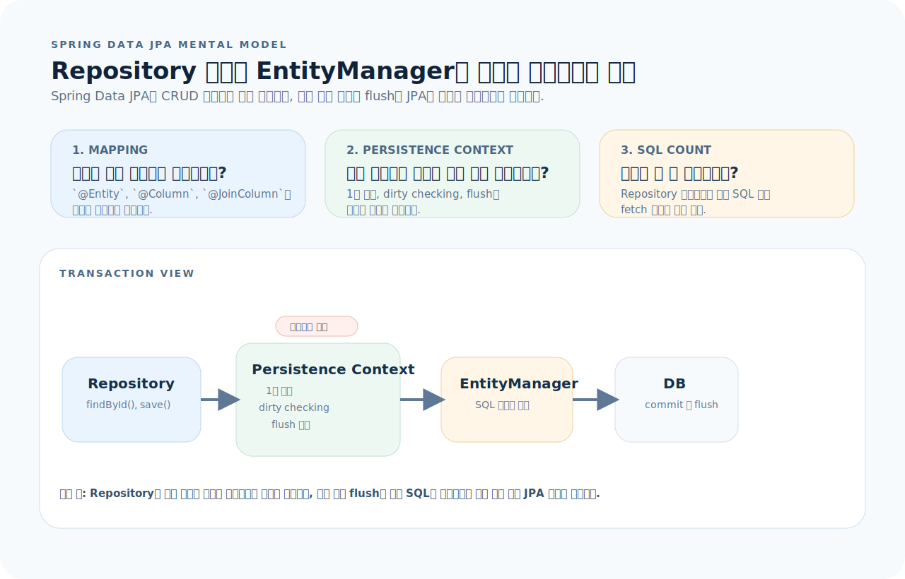
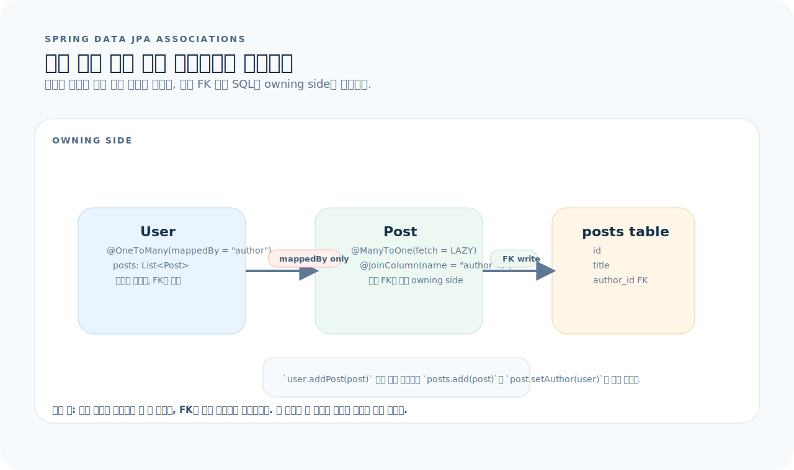
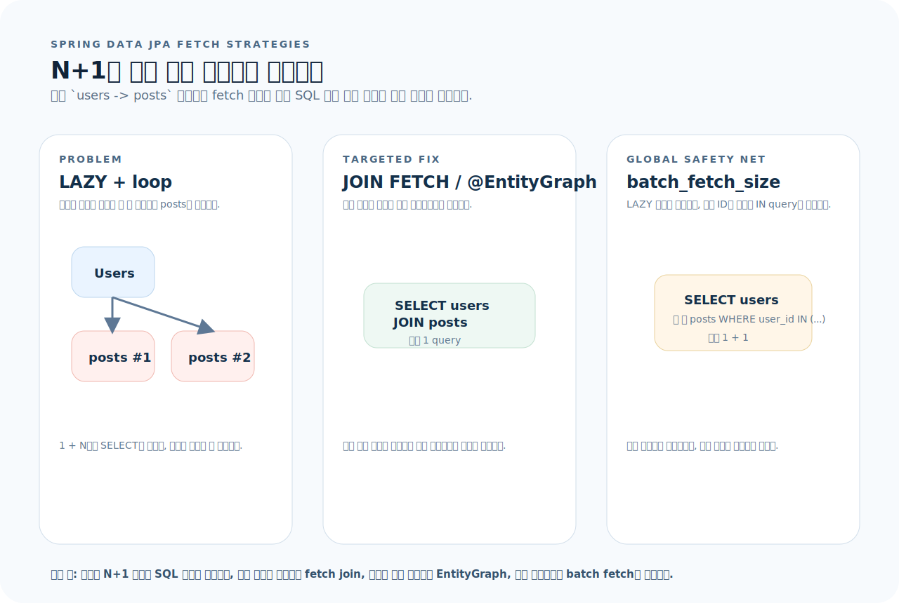

# Spring Data JPA 완전 가이드

Spring Data JPA는 JPA(Java Persistence API) 위에 Repository 추상화를 얹은 데이터 액세스 프레임워크다. 인터페이스만 선언하면 CRUD 구현이 자동 생성되고, 메서드 이름으로 쿼리를 만들며, 페이지네이션과 정렬이 내장되어 있다. 이 글을 읽고 나면 엔티티 설계, Repository 쿼리, fetch 전략, 트랜잭션 관리까지 실무에서 Spring Data JPA를 다룰 수 있다.

먼저 아래 세 질문을 기준으로 읽으면 JPA 코드가 훨씬 빨리 정리된다.

1. **엔티티 매핑:** 이 테이블은 어떤 클래스에 매핑되고, 연관관계는 어떤 방향과 fetch 전략으로 설정되는가?
2. **쿼리 전략:** 이 조회는 메서드 이름, JPQL, 네이티브 SQL, Querydsl 중 어디서 가장 읽기 쉬운가?
3. **N+1 문제:** 이 조회에서 연관 엔티티를 몇 번의 쿼리로 가져오는가?

---

## 1. Spring Data JPA의 사고방식

JPA는 "객체의 상태를 DB 테이블과 동기화하는" ORM이다. Spring Data JPA는 그 위에 "인터페이스 선언만으로 Repository를 구현해 주는" 레이어를 더한다.



이 그림은 이 문서 전체를 읽는 기준표다. 먼저 아래 세 질문으로 읽으면 된다.

1. **엔티티 매핑:** 이 객체는 어느 테이블과 컬럼에 연결되고, 어떤 필드가 연관관계의 주인인가?
2. **영속성 컨텍스트:** 같은 트랜잭션 안에서 조회, 수정, flush가 어떤 순서로 일어나는가?
3. **쿼리 수:** 이 코드가 실제로 몇 번의 SQL을 날리는지, N+1이 생기지 않는지 어떻게 확인할 것인가?

그림을 왼쪽에서 오른쪽으로 읽으면 Spring Data JPA는 `Repository 추상화`, `EntityManager`, `영속성 컨텍스트`가 겹쳐 있는 구조다. 즉 코드를 읽을 때는 엔티티 클래스뿐 아니라 트랜잭션 경계와 실제 SQL 수까지 같이 봐야 한다.

**영속성 컨텍스트(Persistence Context):**
- 1차 캐시: 같은 트랜잭션 내에서 같은 ID 조회 시 DB를 다시 치지 않는다
- Dirty Checking: 엔티티 필드를 변경하면 트랜잭션 커밋 시 자동 UPDATE
- 쓰기 지연: INSERT/UPDATE를 모았다가 flush 시점에 한 번에 실행

---

## 2. 의존성과 설정

### Gradle

```kotlin
// build.gradle.kts
dependencies {
    implementation("org.springframework.boot:spring-boot-starter-data-jpa")
    runtimeOnly("org.postgresql:postgresql")
}
```

### application.yml

```yaml
spring:
  datasource:
    url: jdbc:postgresql://localhost:5432/mydb
    username: ${DB_USER:postgres}
    password: ${DB_PASS:postgres}
  jpa:
    hibernate:
      ddl-auto: validate        # 운영: validate, 개발 초기: update
    open-in-view: false          # OSIV 끄기 — lazy loading을 서비스에서 명시
    properties:
      hibernate:
        format_sql: true
        default_batch_fetch_size: 100    # N+1 완화용 batch fetch
    show-sql: false              # 운영에서는 끈다 (logging으로 대체)

logging:
  level:
    org.hibernate.SQL: DEBUG              # 실행 SQL
    org.hibernate.orm.jdbc.bind: TRACE    # 바인드 파라미터
```

---

## 3. 엔티티 설계

### 기본 엔티티

```java
@Entity
@Table(name = "users")
public class User {

    @Id
    @GeneratedValue(strategy = GenerationType.IDENTITY)
    private Long id;

    @Column(nullable = false, length = 100)
    private String name;

    @Column(nullable = false, unique = true)
    private String email;

    @Column(nullable = false)
    private String password;

    @Enumerated(EnumType.STRING)
    @Column(nullable = false, length = 20)
    private Role role = Role.USER;

    @Column(nullable = false, updatable = false)
    private LocalDateTime createdAt;

    @Column(nullable = false)
    private LocalDateTime updatedAt;

    protected User() {}    // JPA 기본 생성자 (protected)

    @Builder
    public User(String name, String email, String password) {
        this.name = name;
        this.email = email;
        this.password = password;
        this.createdAt = LocalDateTime.now();
        this.updatedAt = LocalDateTime.now();
    }

    public void update(String name, String email) {
        this.name = name;
        if (email != null) this.email = email;
        this.updatedAt = LocalDateTime.now();
    }

    // getter 생략
}
```

### BaseEntity — 공통 감사 필드

```java
@MappedSuperclass
@EntityListeners(AuditingEntityListener.class)
public abstract class BaseEntity {

    @CreatedDate
    @Column(updatable = false)
    private LocalDateTime createdAt;

    @LastModifiedDate
    private LocalDateTime updatedAt;

    // getter
}

// 사용
@Entity
public class User extends BaseEntity {
    @Id @GeneratedValue(strategy = GenerationType.IDENTITY)
    private Long id;
    // ...
}

// 활성화
@Configuration
@EnableJpaAuditing
public class JpaConfig {}
```

---

## 4. 연관관계 매핑

연관관계는 어노테이션 이름보다 "외래 키를 누가 갖고 업데이트하는가"를 먼저 보는 편이 정확하다.



- 외래 키가 있는 쪽이 연관관계의 주인이고, 실제 SQL UPDATE/INSERT도 그쪽에서 결정된다.
- `mappedBy`는 "반대편이 소유자"라는 선언이지, 외래 키를 만드는 옵션이 아니다.
- 양방향이면 `addPost()` 같은 편의 메서드로 두 필드를 함께 맞춰야 객체 그래프와 DB 상태가 어긋나지 않는다.

### @ManyToOne / @OneToMany

```java
@Entity
public class Post {
    @Id @GeneratedValue(strategy = GenerationType.IDENTITY)
    private Long id;

    @Column(nullable = false)
    private String title;

    @ManyToOne(fetch = FetchType.LAZY)     // 항상 LAZY
    @JoinColumn(name = "author_id", nullable = false)
    private User author;
}

@Entity
public class User {
    // ...

    @OneToMany(mappedBy = "author", cascade = CascadeType.ALL, orphanRemoval = true)
    private List<Post> posts = new ArrayList<>();

    public void addPost(Post post) {
        posts.add(post);
        post.setAuthor(this);
    }
}
```

### @ManyToMany

```java
// 중간 엔티티를 직접 만드는 방식을 권장
@Entity
public class PostTag {
    @Id @GeneratedValue(strategy = GenerationType.IDENTITY)
    private Long id;

    @ManyToOne(fetch = FetchType.LAZY)
    @JoinColumn(name = "post_id")
    private Post post;

    @ManyToOne(fetch = FetchType.LAZY)
    @JoinColumn(name = "tag_id")
    private Tag tag;
}
```

### @OneToOne

```java
@Entity
public class UserProfile {
    @Id
    private Long id;     // User와 같은 PK 공유

    @OneToOne(fetch = FetchType.LAZY)
    @MapsId
    @JoinColumn(name = "id")
    private User user;

    private String bio;
    private String avatarUrl;
}
```

**연관관계 규칙:**
- `@ManyToOne`은 항상 `LAZY`로 설정한다 (기본이 `EAGER`이므로 반드시 명시)
- `@OneToMany`는 기본이 `LAZY`다
- 양방향은 꼭 필요할 때만. 단방향 `@ManyToOne`이면 충분한 경우가 많다
- `cascade`는 부모가 자식의 생명주기를 완전히 관리할 때만 쓴다

---

## 5. Repository

### 기본 CRUD

```java
public interface UserRepository extends JpaRepository<User, Long> {
    // JpaRepository가 제공하는 메서드:
    // save(), findById(), findAll(), deleteById(), count(), existsById() ...
}
```

### 메서드 이름 쿼리

```java
public interface UserRepository extends JpaRepository<User, Long> {
    Optional<User> findByEmail(String email);
    List<User> findByRole(Role role);
    boolean existsByEmail(String email);
    List<User> findByNameContainingIgnoreCase(String keyword);
    List<User> findByCreatedAtAfter(LocalDateTime date);
    List<User> findByRoleAndNameContaining(Role role, String keyword);
    long countByRole(Role role);
    void deleteByEmail(String email);
}
```

**메서드 이름 키워드:**

| 키워드 | 예 | SQL |
|--------|-----|-----|
| `findBy` | `findByName(name)` | `WHERE name = ?` |
| `Containing` | `findByNameContaining(s)` | `WHERE name LIKE '%s%'` |
| `Between` | `findByAgeBetween(a, b)` | `WHERE age BETWEEN a AND b` |
| `LessThan` | `findByAgeLessThan(n)` | `WHERE age < n` |
| `OrderBy` | `findByRoleOrderByNameAsc(r)` | `ORDER BY name ASC` |
| `In` | `findByIdIn(ids)` | `WHERE id IN (?)` |
| `IsNull` | `findByDeletedAtIsNull()` | `WHERE deleted_at IS NULL` |
| `Top/First` | `findTop5ByOrderByCreatedAtDesc()` | `LIMIT 5` |

### JPQL

```java
@Query("SELECT u FROM User u WHERE u.email = :email AND u.role = :role")
Optional<User> findByEmailAndRole(@Param("email") String email,
                                  @Param("role") Role role);

@Query("SELECT u FROM User u JOIN FETCH u.posts WHERE u.id = :id")
Optional<User> findByIdWithPosts(@Param("id") Long id);

@Modifying
@Query("UPDATE User u SET u.role = :role WHERE u.id = :id")
int updateRole(@Param("id") Long id, @Param("role") Role role);
```

### 네이티브 SQL

```java
@Query(value = "SELECT * FROM users WHERE email ILIKE :pattern", nativeQuery = true)
List<User> searchByEmail(@Param("pattern") String pattern);
```

### 페이지네이션

```java
public interface UserRepository extends JpaRepository<User, Long> {
    Page<User> findByRole(Role role, Pageable pageable);
    Slice<User> findByNameContaining(String keyword, Pageable pageable);
}

// 사용
Pageable pageable = PageRequest.of(0, 20, Sort.by("createdAt").descending());
Page<User> page = userRepository.findByRole(Role.USER, pageable);

page.getContent();        // List<User>
page.getTotalElements();  // 전체 수
page.getTotalPages();     // 전체 페이지 수
page.hasNext();
```

---

## 6. N+1 문제 해결

N+1은 "코드 한 줄"이 아니라 "실행된 SQL 수"로 봐야 보인다. 아래처럼 문제와 해결책을 쿼리 개수 관점에서 비교하면 판단이 빨라진다.



- 기본 LAZY 접근에서 루프 안의 `getPosts()`가 추가 SELECT를 만든다.
- `JOIN FETCH`는 한 번의 쿼리로 강하게 묶고, `@EntityGraph`는 메서드 선언 수준에서 의도를 드러낸다.
- `default_batch_fetch_size`는 전역 안전망이지만, "항상 함께 필요한 연관"을 완전히 대체하진 못한다.

### 문제 상황

```java
// N+1: User 1건 조회 → Post를 N번 추가 조회
List<User> users = userRepository.findAll();
for (User user : users) {
    user.getPosts().size();    // LAZY 로딩 → 각 User마다 SELECT 발생
}
```

### 해결 1: Fetch Join

```java
@Query("SELECT u FROM User u JOIN FETCH u.posts WHERE u.role = :role")
List<User> findByRoleWithPosts(@Param("role") Role role);
```

### 해결 2: @EntityGraph

```java
@EntityGraph(attributePaths = {"posts"})
List<User> findByRole(Role role);
```

### 해결 3: Batch Fetch Size (전역)

```yaml
spring:
  jpa:
    properties:
      hibernate:
        default_batch_fetch_size: 100
```

이렇게 설정하면 LAZY 로딩 시 개별 SELECT 대신 `WHERE id IN (?, ?, ..., ?)` 배치 쿼리를 날린다.

**선택 기준:**
- 항상 함께 쓰이는 연관 → Fetch Join
- 조건에 따라 필요한 연관 → EntityGraph
- 전역 안전망 → batch_fetch_size

---

## 7. Querydsl

복잡한 동적 쿼리에서 JPQL 문자열 대신 타입 안전 빌더를 쓴다.

### 설정

```kotlin
// build.gradle.kts
dependencies {
    implementation("com.querydsl:querydsl-jpa:5.1.0:jakarta")
    annotationProcessor("com.querydsl:querydsl-apt:5.1.0:jakarta")
    annotationProcessor("jakarta.persistence:jakarta.persistence-api")
    annotationProcessor("jakarta.annotation:jakarta.annotation-api")
}
```

### 사용

```java
@Repository
public class UserQueryRepository {
    private final JPAQueryFactory queryFactory;

    public UserQueryRepository(EntityManager em) {
        this.queryFactory = new JPAQueryFactory(em);
    }

    public List<User> search(String keyword, Role role, Pageable pageable) {
        QUser user = QUser.user;

        return queryFactory
            .selectFrom(user)
            .where(
                containsKeyword(user, keyword),
                eqRole(user, role)
            )
            .offset(pageable.getOffset())
            .limit(pageable.getPageSize())
            .orderBy(user.createdAt.desc())
            .fetch();
    }

    private BooleanExpression containsKeyword(QUser user, String keyword) {
        return keyword != null
            ? user.name.containsIgnoreCase(keyword)
            : null;    // null 반환 시 where 조건에서 무시됨
    }

    private BooleanExpression eqRole(QUser user, Role role) {
        return role != null ? user.role.eq(role) : null;
    }
}
```

---

## 8. 트랜잭션

```java
@Service
@Transactional(readOnly = true)       // 클래스 레벨: 기본 읽기 전용
public class UserService {

    @Transactional                     // 쓰기 메서드만 readOnly=false
    public UserResponse create(UserCreateRequest request) {
        User user = userRepository.save(User.from(request));
        return UserResponse.from(user);
    }

    public UserResponse findById(Long id) {
        // readOnly=true → flush 스킵, 스냅샷 비교 스킵 → 성능 이점
        User user = userRepository.findById(id)
            .orElseThrow(() -> new NotFoundException("User not found"));
        return UserResponse.from(user);
    }

    @Transactional
    public void transfer(Long fromId, Long toId, int amount) {
        // 같은 트랜잭션 안에서 두 엔티티를 수정
        Account from = accountRepository.findById(fromId).orElseThrow();
        Account to = accountRepository.findById(toId).orElseThrow();
        from.withdraw(amount);           // dirty checking
        to.deposit(amount);              // dirty checking
        // 커밋 시 두 UPDATE가 같은 TX에서 실행
    }
}
```

**주의:** `@Transactional`이 동작하려면 외부에서 호출해야 한다. 같은 클래스의 다른 메서드에서 내부 호출하면 프록시를 거치지 않아 트랜잭션이 적용되지 않는다.

---

## 9. 테스트

### Repository 테스트

```java
@DataJpaTest
class UserRepositoryTest {
    @Autowired UserRepository userRepository;

    @Test
    void 이메일로_조회() {
        User user = User.builder()
            .name("alice").email("a@b.com").password("enc").build();
        userRepository.save(user);

        Optional<User> found = userRepository.findByEmail("a@b.com");

        assertThat(found).isPresent();
        assertThat(found.get().getName()).isEqualTo("alice");
    }

    @Test
    void 역할별_페이지_조회() {
        // given
        userRepository.saveAll(List.of(
            User.builder().name("a").email("a@b.com").password("e").role(Role.USER).build(),
            User.builder().name("b").email("b@b.com").password("e").role(Role.USER).build(),
            User.builder().name("c").email("c@b.com").password("e").role(Role.ADMIN).build()
        ));

        // when
        Page<User> page = userRepository.findByRole(
            Role.USER, PageRequest.of(0, 10));

        // then
        assertThat(page.getContent()).hasSize(2);
        assertThat(page.getTotalElements()).isEqualTo(2);
    }
}
```

### Testcontainers와 함께

```java
@DataJpaTest
@Testcontainers
@AutoConfigureTestDatabase(replace = AutoConfigureTestDatabase.Replace.NONE)
class UserRepositoryIntegrationTest {
    @Container
    static PostgreSQLContainer<?> postgres =
        new PostgreSQLContainer<>("postgres:16-alpine");

    @DynamicPropertySource
    static void configureProperties(DynamicPropertyRegistry registry) {
        registry.add("spring.datasource.url", postgres::getJdbcUrl);
        registry.add("spring.datasource.username", postgres::getUsername);
        registry.add("spring.datasource.password", postgres::getPassword);
    }
}
```

---

## 10. 자주 하는 실수

| 실수 | 올바른 방법 |
|------|-------------|
| `@ManyToOne`을 EAGER로 방치 | 항상 `fetch = FetchType.LAZY` 명시 |
| N+1 문제 무시 | Fetch Join, EntityGraph, batch_fetch_size로 해결 |
| `open-in-view: true` 방치 | `false`로 설정. Service에서 필요한 데이터를 확정 |
| Entity를 직접 API 응답으로 반환 | DTO(record)로 변환 후 반환 |
| `@Transactional` 없이 여러 엔티티 수정 | Service 메서드에 `@Transactional` 선언 |
| 양방향 연관관계 남용 | 필요 없으면 단방향 `@ManyToOne`만 유지 |
| `ddl-auto: update`로 운영 | Flyway로 스키마 버전 관리 |
| equals/hashCode 미구현 | ID 또는 비즈니스 키 기반으로 구현 |

---

## 11. 빠른 참조

```java
// ── Repository ──
public interface Repo extends JpaRepository<Entity, Long> {
    Optional<Entity> findByEmail(String email);
    List<Entity> findByStatusOrderByCreatedAtDesc(Status s);
    Page<Entity> findByRole(Role r, Pageable p);
    boolean existsByEmail(String email);

    @Query("SELECT e FROM Entity e JOIN FETCH e.items WHERE e.id = :id")
    Optional<Entity> findByIdWithItems(@Param("id") Long id);

    @EntityGraph(attributePaths = {"items"})
    List<Entity> findByStatus(Status s);

    @Modifying @Query("UPDATE Entity e SET e.status = :s WHERE e.id = :id")
    int updateStatus(@Param("id") Long id, @Param("s") Status s);
}

// ── Entity ──
@Entity @Table(name = "entities")
public class Entity {
    @Id @GeneratedValue(strategy = IDENTITY) Long id;
    @ManyToOne(fetch = LAZY) @JoinColumn(name = "parent_id") Parent parent;
    @OneToMany(mappedBy = "parent", cascade = ALL, orphanRemoval = true) List<Child> children;
}

// ── 페이지 ──
PageRequest.of(0, 20, Sort.by("createdAt").descending());

// ── 트랜잭션 ──
@Service @Transactional(readOnly = true)
class Svc {
    @Transactional void write() { }   // readOnly=false
    Entity read() { }                  // readOnly=true 유지
}
```
