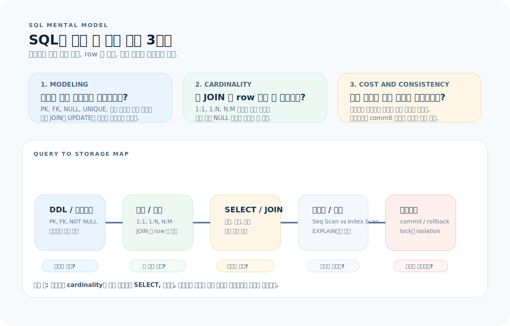
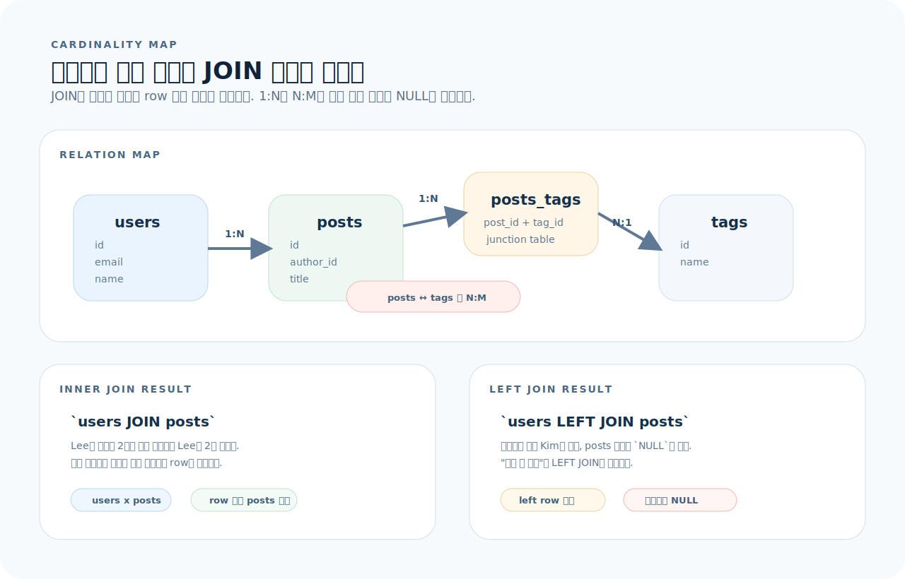
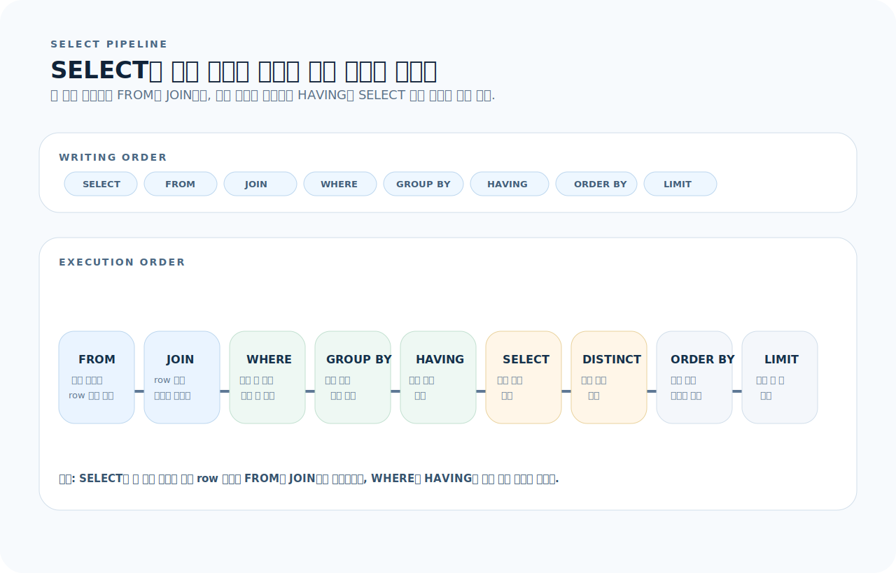
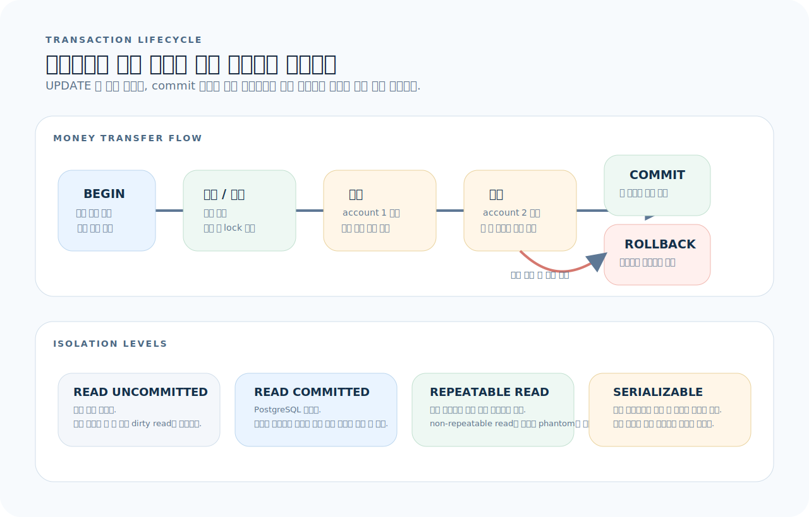

# SQL 완전 가이드

SQL은 관계형 데이터베이스와 대화하는 유일한 언어다. ORM을 쓰더라도, 느린 쿼리를 디버깅하고 데이터 설계를 검토하려면 SQL을 직접 읽고 쓸 수 있어야 한다. 이 글을 읽고 나면 테이블 설계, 쿼리 작성, 인덱스 전략, 트랜잭션까지 실무에 필요한 SQL을 다룰 수 있다. (PostgreSQL 기준, 대부분의 문법은 MySQL/SQLite에도 적용된다.)

---

## 1. SQL의 사고방식

SQL은 문법 목록으로 외우기보다, 데이터가 어떤 구조로 저장되고 어떤 row 집합으로 흘러가며 어떤 경계에서 안전해지는지를 먼저 잡는 편이 훨씬 이해가 빠르다.



이 그림은 이 문서 전체를 읽는 기준표다. 먼저 아래 세 질문으로 읽으면 된다.

1. **모델링:** 이 데이터는 어떤 테이블, 키, 제약조건으로 저장되는가?
2. **Cardinality:** 이 JOIN 뒤에 결과 row 수가 왜 늘거나 줄어드는가?
3. **비용과 일관성:** 이 쿼리는 어떤 실행 경로를 타고, 어떤 트랜잭션 경계에서 보호되는가?

뒤 섹션들은 이 세 질문을 순서대로 구체화한다. DDL과 관계는 "어떻게 저장되는가", SELECT·JOIN·인덱스는 "어떻게 읽는가", 트랜잭션은 "어떻게 안전하게 바꾸는가"를 설명한다.

---

## 2. 테이블 설계 — DDL

DDL은 컬럼을 나열하는 작업이 아니라, 이후의 JOIN과 트랜잭션이 의존할 데이터 구조를 고정하는 작업이다. 아래 예시는 이 문서 전반에서 재사용할 기본 스키마다.

### CREATE TABLE

```sql
CREATE TABLE users (
    id          SERIAL PRIMARY KEY,
    email       VARCHAR(255) NOT NULL UNIQUE,
    name        VARCHAR(100) NOT NULL,
    role        VARCHAR(20)  NOT NULL DEFAULT 'user',
    is_active   BOOLEAN      NOT NULL DEFAULT true,
    created_at  TIMESTAMP    NOT NULL DEFAULT now(),
    updated_at  TIMESTAMP    NOT NULL DEFAULT now()
);

CREATE TABLE posts (
    id          SERIAL PRIMARY KEY,
    title       VARCHAR(300) NOT NULL,
    content     TEXT,
    published   BOOLEAN      NOT NULL DEFAULT false,
    author_id   INT          NOT NULL REFERENCES users(id) ON DELETE CASCADE,
    created_at  TIMESTAMP    NOT NULL DEFAULT now()
);

CREATE TABLE tags (
    id   SERIAL PRIMARY KEY,
    name VARCHAR(50) NOT NULL UNIQUE
);

-- 다대다 관계 — junction 테이블
CREATE TABLE posts_tags (
    post_id INT NOT NULL REFERENCES posts(id) ON DELETE CASCADE,
    tag_id  INT NOT NULL REFERENCES tags(id)  ON DELETE CASCADE,
    PRIMARY KEY (post_id, tag_id)
);
```

### 컬럼 타입 선택 기준

| 용도 | PostgreSQL | MySQL | 비고 |
|------|-----------|-------|------|
| 자동 증가 PK | `SERIAL` / `BIGSERIAL` | `INT AUTO_INCREMENT` | UUID도 가능: `UUID DEFAULT gen_random_uuid()` |
| 짧은 문자열 | `VARCHAR(n)` | `VARCHAR(n)` | 이메일, 이름 등 |
| 긴 텍스트 | `TEXT` | `TEXT` | 본문, 설명 |
| 정수 | `INT` / `BIGINT` | `INT` / `BIGINT` | |
| 소수 (금액) | `NUMERIC(10,2)` | `DECIMAL(10,2)` | **절대 FLOAT 사용 금지** — 부동소수점 오차 |
| 참/거짓 | `BOOLEAN` | `TINYINT(1)` | |
| 시간 | `TIMESTAMP` | `DATETIME` | 시간대: `TIMESTAMPTZ` 권장 |
| JSON | `JSONB` | `JSON` | PostgreSQL의 JSONB는 인덱싱 가능 |

### ALTER TABLE

```sql
-- 컬럼 추가
ALTER TABLE users ADD COLUMN bio TEXT;

-- 컬럼 삭제
ALTER TABLE users DROP COLUMN bio;

-- 컬럼 타입 변경
ALTER TABLE users ALTER COLUMN name TYPE VARCHAR(200);

-- NOT NULL 추가
ALTER TABLE users ALTER COLUMN name SET NOT NULL;

-- 기본값 변경
ALTER TABLE users ALTER COLUMN role SET DEFAULT 'editor';
```

---

## 3. 관계와 Cardinality

관계는 테이블이 몇 개인지를 설명하는 것이 아니라, 한 행이 다른 행을 몇 개까지 만날 수 있는지를 설명한다. 이 감각이 있어야 JOIN 뒤 결과 row 수를 예측할 수 있다.



그림 기준으로 먼저 보면 된다.

- `users -> posts`는 1:N이라서 `users JOIN posts` 결과가 게시글 수만큼 늘어난다.
- `posts -> posts_tags -> tags`는 N:M이라서 junction 테이블을 거쳐야 중복과 삭제 규칙을 제어할 수 있다.
- `LEFT JOIN`은 왼쪽 행을 유지하고, 오른쪽 매칭 실패를 `NULL`로 남긴다.

### 세 가지 관계

- `1:1` — `users ↔ user_profiles`: 한 유저에 하나의 프로필
- `1:N` — `users ↔ posts`: 한 유저가 여러 게시글
- `N:M` — `posts ↔ tags`: 게시글과 태그가 다대다

### FK 설정

```sql
-- ON DELETE 옵션
REFERENCES users(id) ON DELETE CASCADE    -- 부모 삭제 시 자식도 삭제
REFERENCES users(id) ON DELETE SET NULL   -- 부모 삭제 시 NULL로 설정
REFERENCES users(id) ON DELETE RESTRICT   -- 자식이 있으면 삭제 불가 (기본값)
```

> **Cardinality 주의**: `users JOIN posts`하면 posts가 N개인 만큼 결과 row가 늘어난다. 1:N 관계에서 JOIN 결과가 예상과 다르면 cardinality를 확인한다.

---

## 4. SELECT — 데이터 조회

SELECT는 위에서 아래로 작성하지만, DB는 다른 순서로 실행한다. 결과가 예상과 다를 때는 항상 "지금 row 집합이 어느 단계에서 바뀌었는가?"를 기준으로 읽어야 한다.



그림을 기준으로 디버깅하면 빠르다.

- row 수가 너무 많으면 `FROM`과 `JOIN` 단계의 cardinality부터 본다.
- 필터가 안 먹는 것처럼 보이면 `WHERE`와 `HAVING`이 각각 어느 단계에서 적용되는지 구분한다.
- 느린 정렬이나 페이지네이션은 마지막 `ORDER BY`와 `LIMIT` 비용까지 같이 본다.

### 기본 구문

```sql
SELECT id, email, name
FROM users
WHERE is_active = true AND role = 'admin'
ORDER BY created_at DESC
LIMIT 20 OFFSET 0;
```

### SQL 실행 순서

작성 순서와 실행 순서는 다르다. 그래서 쿼리를 읽을 때는 아래 순서를 먼저 떠올리는 편이 안전하다.

```
실행 순서:
1. FROM       — 어떤 테이블에서?
2. JOIN       — 어떤 테이블과 결합?
3. WHERE      — 어떤 조건으로 필터?
4. GROUP BY   — 어떻게 그룹화?
5. HAVING     — 그룹 필터?
6. SELECT     — 어떤 컬럼을?
7. DISTINCT   — 중복 제거?
8. ORDER BY   — 어떤 순서로?
9. LIMIT      — 몇 개까지?
```

### WHERE 조건

```sql
-- 비교
WHERE price > 1000
WHERE price BETWEEN 1000 AND 5000
WHERE status IN ('active', 'pending')
WHERE name IS NOT NULL

-- 패턴 매칭
WHERE email LIKE '%@gmail.com'       -- 대소문자 구분
WHERE email ILIKE '%@gmail.com'      -- 대소문자 무시 (PostgreSQL)

-- 복합 조건
WHERE (role = 'admin' OR role = 'editor') AND is_active = true
```

---

## 5. JOIN

### JOIN 종류

```sql
-- INNER JOIN — 양쪽 모두 존재하는 데이터만
SELECT p.title, u.name AS author
FROM posts p
INNER JOIN users u ON p.author_id = u.id;

-- LEFT JOIN — 왼쪽 테이블의 모든 행 + 오른쪽 매칭 (없으면 NULL)
SELECT u.name, p.title
FROM users u
LEFT JOIN posts p ON u.id = p.author_id;

-- RIGHT JOIN — 오른쪽 테이블 기준 (LEFT JOIN 뒤집기와 동일, 거의 안 쓴다)
-- FULL OUTER JOIN — 양쪽 모두 포함 (매칭 없으면 NULL)
```

### 다대다 JOIN

```sql
-- posts와 tags를 junction 테이블을 통해 JOIN
SELECT p.title, t.name AS tag
FROM posts p
JOIN posts_tags pt ON p.id = pt.post_id
JOIN tags t ON pt.tag_id = t.id
WHERE p.published = true;
```

### Self JOIN

```sql
-- 상사-부하 관계
SELECT e.name AS employee, m.name AS manager
FROM employees e
LEFT JOIN employees m ON e.manager_id = m.id;
```

---

## 6. 집계 — GROUP BY

```sql
-- 역할별 사용자 수
SELECT role, COUNT(*) AS user_count
FROM users
GROUP BY role;

-- 작성자별 게시글 수 (3개 이상만)
SELECT u.name, COUNT(p.id) AS post_count
FROM users u
JOIN posts p ON u.id = p.author_id
GROUP BY u.name
HAVING COUNT(p.id) >= 3
ORDER BY post_count DESC;
```

### 집계 함수

| 함수 | 용도 |
|------|------|
| `COUNT(*)` | 행 수 |
| `COUNT(DISTINCT col)` | 고유값 수 |
| `SUM(col)` | 합계 |
| `AVG(col)` | 평균 |
| `MIN(col)` / `MAX(col)` | 최솟값 / 최댓값 |

---

## 7. 서브쿼리와 CTE

### 서브쿼리

```sql
-- 게시글이 있는 사용자만
SELECT * FROM users
WHERE id IN (SELECT DISTINCT author_id FROM posts);

-- 평균보다 비싼 상품
SELECT * FROM products
WHERE price > (SELECT AVG(price) FROM products);
```

### CTE (Common Table Expression)

복잡한 쿼리를 단계별로 분리한다. 서브쿼리보다 가독성이 좋다.

```sql
WITH active_authors AS (
    SELECT author_id, COUNT(*) AS post_count
    FROM posts
    WHERE published = true
    GROUP BY author_id
    HAVING COUNT(*) >= 5
)
SELECT u.name, a.post_count
FROM users u
JOIN active_authors a ON u.id = a.author_id
ORDER BY a.post_count DESC;
```

### Recursive CTE — 계층 데이터

```sql
-- 카테고리 트리 순회
WITH RECURSIVE category_tree AS (
    -- 루트 노드
    SELECT id, name, parent_id, 1 AS depth
    FROM categories
    WHERE parent_id IS NULL

    UNION ALL

    -- 자식 노드
    SELECT c.id, c.name, c.parent_id, ct.depth + 1
    FROM categories c
    JOIN category_tree ct ON c.parent_id = ct.id
)
SELECT * FROM category_tree ORDER BY depth, name;
```

---

## 8. INSERT / UPDATE / DELETE

```sql
-- INSERT
INSERT INTO users (email, name) VALUES ('lee@example.com', 'Lee');
INSERT INTO users (email, name) VALUES
    ('a@example.com', 'A'),
    ('b@example.com', 'B');

-- UPSERT (PostgreSQL)
INSERT INTO users (email, name)
VALUES ('lee@example.com', 'Lee Updated')
ON CONFLICT (email)
DO UPDATE SET name = EXCLUDED.name, updated_at = now();

-- INSERT ... RETURNING
INSERT INTO users (email, name)
VALUES ('kim@example.com', 'Kim')
RETURNING id, email;

-- UPDATE
UPDATE users SET name = 'Lee', updated_at = now() WHERE id = 1;

-- DELETE
DELETE FROM users WHERE id = 1;

-- TRUNCATE — 전체 삭제 (빠르지만 롤백 불가)
TRUNCATE TABLE logs;
```

---

## 9. 인덱스

### 인덱스의 원리

인덱스가 없으면 **Sequential Scan** — 테이블 전체를 읽는다.
인덱스가 있으면 **Index Scan** — B-Tree를 타고 즉시 찾는다.

### 인덱스 생성

```sql
-- 단일 컬럼
CREATE INDEX idx_users_email ON users (email);

-- 복합 인덱스 — 왼쪽부터 매칭 (leftmost prefix)
CREATE INDEX idx_posts_author_created ON posts (author_id, created_at DESC);
-- ✅ WHERE author_id = 1                       (사용)
-- ✅ WHERE author_id = 1 AND created_at > ...   (사용)
-- ❌ WHERE created_at > ...                     (미사용 — 첫 번째 컬럼 누락)

-- 부분 인덱스 (PostgreSQL)
CREATE INDEX idx_active_users ON users (email) WHERE is_active = true;

-- GIN 인덱스 (JSONB, 배열, 전문검색)
CREATE INDEX idx_posts_tags ON posts USING GIN (tags_jsonb);
```

### 인덱스를 달아야 하는 곳

| 상황 | 예시 |
|------|------|
| WHERE 절에 자주 등장 | `WHERE status = 'active'` |
| JOIN 조건 | `ON p.author_id = u.id` |
| ORDER BY | `ORDER BY created_at DESC` |
| UNIQUE 제약 | 자동으로 인덱스 생성 |

### 인덱스를 달면 안 되는 곳

- 행이 적은 테이블 (< 1000건)
- INSERT/UPDATE가 매우 빈번한 컬럼
- 카디널리티가 극히 낮은 컬럼 (`boolean` 등)

---

## 10. EXPLAIN — 쿼리 분석

```sql
EXPLAIN ANALYZE
SELECT p.title, u.name
FROM posts p
JOIN users u ON p.author_id = u.id
WHERE p.published = true
ORDER BY p.created_at DESC
LIMIT 10;
```

### 실행 계획 읽기

```
Limit  (cost=0.57..12.84 rows=10)
  → Nested Loop  (cost=0.57..245.32 rows=200)
     → Index Scan Backward using idx_posts_created on posts p
           Filter: (published = true)
     → Index Scan using users_pkey on users u
           Index Cond: (id = p.author_id)
Planning Time: 0.3ms
Execution Time: 0.8ms
```

| 키워드 | 의미 |
|--------|------|
| `Seq Scan` | 전체 테이블 스캔 (느림) → 인덱스 필요 |
| `Index Scan` | 인덱스 사용 (빠름) |
| `Index Only Scan` | 인덱스만으로 데이터 반환 (가장 빠름) |
| `Nested Loop` | 행마다 내부 테이블 조회 |
| `Hash Join` | 해시 테이블 빌드 후 매칭 |
| `Sort` | 정렬 (인덱스가 없으면 발생) |
| `rows=N` | 예상 행 수 |

---

## 11. 트랜잭션

트랜잭션은 여러 문장을 하나의 작업 단위로 묶고, 실패하면 전부 되돌리며, 동시에 실행되는 다른 트랜잭션과 얼마나 격리할지도 정하는 장치다.



그림 기준으로 기억하면 된다.

- `BEGIN` 이후의 변경은 `COMMIT` 전까지 확정되지 않는다.
- 중간 단계 하나라도 실패하면 `ROLLBACK`으로 전체 작업을 되돌린다.
- 격리 수준은 다른 트랜잭션의 중간 상태를 얼마나 보지 않게 할지를 정한다.

```sql
BEGIN;

UPDATE accounts SET balance = balance - 1000 WHERE id = 1;
UPDATE accounts SET balance = balance + 1000 WHERE id = 2;

COMMIT;
-- 하나라도 실패하면 ROLLBACK;
```

### ACID 속성

| 속성 | 의미 |
|------|------|
| Atomicity | 전부 성공 or 전부 실패 |
| Consistency | 제약조건 항상 보장 |
| Isolation | 동시 트랜잭션 간 간섭 차단 |
| Durability | 커밋된 데이터는 영구 보존 |

### Isolation Level

| 레벨 | Dirty Read | Non-repeatable Read | Phantom Read |
|------|-----------|-------------------|-------------|
| READ UNCOMMITTED | ✓ | ✓ | ✓ |
| READ COMMITTED | ✗ | ✓ | ✓ |
| REPEATABLE READ | ✗ | ✗ | ✓ |
| SERIALIZABLE | ✗ | ✗ | ✗ |

```sql
-- PostgreSQL 기본값: READ COMMITTED
SET TRANSACTION ISOLATION LEVEL SERIALIZABLE;
```

---

## 12. Window Function

집계와 달리 행을 그룹으로 합치지 않고, **각 행에 계산 결과를 붙인다.**

```sql
-- 작성자별 게시글 순위
SELECT
    title,
    author_id,
    created_at,
    ROW_NUMBER() OVER (PARTITION BY author_id ORDER BY created_at DESC) AS row_num,
    RANK()       OVER (PARTITION BY author_id ORDER BY created_at DESC) AS rank,
    LAG(title)   OVER (PARTITION BY author_id ORDER BY created_at) AS prev_title,
    LEAD(title)  OVER (PARTITION BY author_id ORDER BY created_at) AS next_title
FROM posts;
```

| 함수 | 용도 |
|------|------|
| `ROW_NUMBER()` | 순번 (중복 없음) |
| `RANK()` | 순위 (동순위 건너뜀) |
| `DENSE_RANK()` | 순위 (동순위 안 건너뜀) |
| `LAG(col, n)` | 이전 n번째 행의 값 |
| `LEAD(col, n)` | 다음 n번째 행의 값 |
| `SUM() OVER()` | 누적 합계 |
| `AVG() OVER()` | 이동 평균 |

---

## 13. 실전 패턴

### 페이지네이션

```sql
-- Offset 방식 (간단하지만 대용량에서 느림)
SELECT * FROM posts
ORDER BY created_at DESC
LIMIT 20 OFFSET 40;

-- Cursor 방식 (대용량에서 안정적)
SELECT * FROM posts
WHERE created_at < '2024-01-15T00:00:00'
ORDER BY created_at DESC
LIMIT 20;
```

### Soft Delete

```sql
ALTER TABLE users ADD COLUMN deleted_at TIMESTAMP;

-- "삭제"
UPDATE users SET deleted_at = now() WHERE id = 1;

-- 조회 시 제외
SELECT * FROM users WHERE deleted_at IS NULL;
```

### JSONB 활용 (PostgreSQL)

```sql
-- JSONB 컬럼
ALTER TABLE users ADD COLUMN preferences JSONB DEFAULT '{}';

-- 값 조회
SELECT preferences->>'theme' AS theme FROM users;
SELECT preferences->'notifications'->>'email' FROM users;

-- 조건 검색
SELECT * FROM users WHERE preferences @> '{"theme": "dark"}';

-- 값 업데이트
UPDATE users
SET preferences = jsonb_set(preferences, '{theme}', '"light"')
WHERE id = 1;
```

---

## 14. 자주 하는 실수

| 실수 | 원인과 해결 |
|------|-------------|
| `LEFT JOIN` 결과 행 수 증가 미예상 | 1:N 관계에서 JOIN → N배 행. `EXPLAIN` 확인 |
| 인덱스 없이 대용량 조회 | `EXPLAIN ANALYZE`로 Seq Scan 확인 → 인덱스 추가 |
| `SELECT *` 남용 | 필요한 컬럼만 명시 → 네트워크/메모리 절약 |
| `NULL` 비교에 `=` 사용 | `WHERE col = NULL` ❌ → `WHERE col IS NULL` ✅ |
| 금액에 `FLOAT` 사용 | 부동소수점 오차 → `NUMERIC(10,2)` 사용 |
| 트랜잭션 범위 과대 | 긴 트랜잭션은 lock 경합 유발 → 가능한 짧게 |
| migration 없이 스키마 수동 변경 | 환경 간 불일치 → 마이그레이션 파일로 관리 |

---

## 15. 빠른 참조

```sql
-- ── DDL ──
CREATE TABLE t (col TYPE CONSTRAINT, ...);
ALTER TABLE t ADD COLUMN col TYPE;
ALTER TABLE t DROP COLUMN col;
DROP TABLE t;
CREATE INDEX idx ON t (col);

-- ── DML ──
SELECT col FROM t WHERE cond ORDER BY col LIMIT n OFFSET m;
INSERT INTO t (col) VALUES (val) RETURNING *;
UPDATE t SET col = val WHERE cond;
DELETE FROM t WHERE cond;

-- ── JOIN ──
INNER JOIN t2 ON t1.fk = t2.pk
LEFT JOIN t2 ON t1.fk = t2.pk

-- ── 집계 ──
SELECT col, COUNT(*) FROM t GROUP BY col HAVING COUNT(*) > n;

-- ── 트랜잭션 ──
BEGIN; ... COMMIT; / ROLLBACK;

-- ── 분석 ──
EXPLAIN ANALYZE SELECT ...;
```
