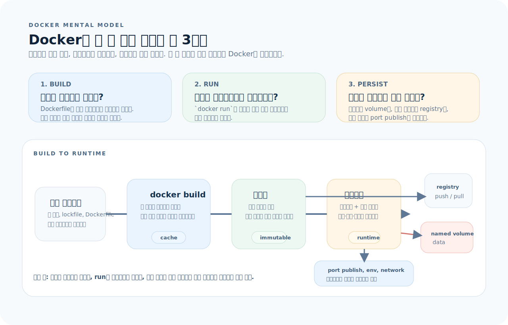
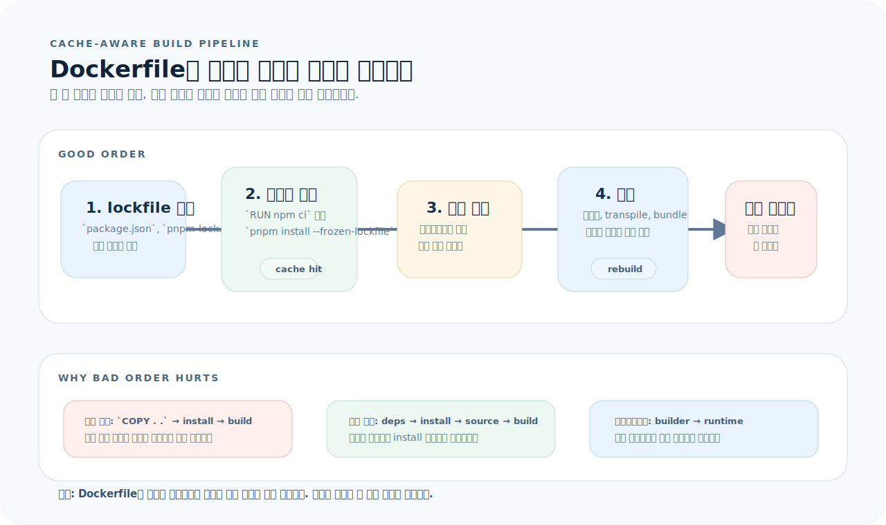
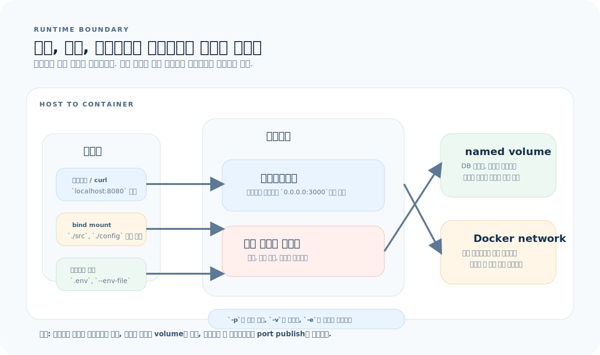

# Docker 완전 가이드

Docker는 애플리케이션을 격리된 컨테이너로 패키징하고 실행하는 도구다. 핵심은 "어디서 실행하든 같은 환경을 재현한다"는 점이다. 이 글은 Docker를 명령어 모음이 아니라 `빌드`, `실행`, `영속화`라는 세 개의 경계로 이해하도록 정리한다.

---

## 1. Docker의 사고방식

Docker는 기능을 외우기보다, 어떤 것이 이미지로 굳고 어떤 것이 컨테이너에서 살아 움직이며 어떤 데이터가 밖에 남는지를 먼저 잡는 편이 훨씬 이해가 빠르다.



이 문서는 먼저 아래 세 질문으로 읽으면 된다.

1. **빌드:** 어떤 파일이 이미지 레이어로 굳고, 무엇이 캐시를 깨는가?
2. **실행:** 포트, 환경변수, 명령은 컨테이너 시작 시 어디에 연결되는가?
3. **영속화:** 재시작 후에도 남겨야 할 데이터는 볼륨으로 어떻게 분리할 것인가?

그림을 기준으로 읽으면 Docker는 세 문장으로 요약된다.

- 이미지는 Dockerfile로 만든 불변 스냅샷이다.
- 컨테이너는 이미지를 기반으로 실행되는 프로세스와 쓰기 가능한 레이어다.
- 레지스트리, 볼륨, 포트 매핑은 컨테이너를 밖의 세계와 연결하는 경계다.

### 핵심 개념

| 개념 | 의미 | 비유 |
|------|------|------|
| Image | 레이어로 구성된 불변 실행 템플릿 | 클래스 정의 |
| Container | 이미지 위에서 실행 중인 인스턴스 | 객체 인스턴스 |
| Dockerfile | 이미지를 만드는 절차를 적은 파일 | 클래스 작성 코드 |
| Registry | 이미지를 저장하고 배포하는 원격 저장소 | 패키지 레지스트리 |
| Volume | 컨테이너와 분리된 영속 데이터 저장소 | 외장 디스크 |

---

## 2. 기본 명령어

### 이미지

```bash
docker build -t my-app .             # 현재 디렉터리에서 이미지 빌드
docker build -t my-app:v1 .          # 태그 지정
docker images                        # 로컬 이미지 목록
docker rmi my-app                    # 이미지 삭제
docker pull postgres:16              # Registry에서 이미지 다운로드
docker push myrepo/my-app:v1         # Registry에 이미지 업로드
```

### 컨테이너

```bash
docker run my-app                    # 컨테이너 실행 (포그라운드)
docker run -d my-app                 # 백그라운드 실행
docker run -d --name api my-app      # 이름 지정
docker run -p 8080:3000 my-app       # 포트 매핑 (호스트:컨테이너)
docker run -v ./data:/app/data my-app  # 볼륨 마운트
docker run --rm my-app               # 종료 시 자동 삭제
docker run -it my-app sh             # 대화형 셸 접속
docker run --env-file .env my-app    # 환경변수 파일 전달

docker ps                            # 실행 중인 컨테이너
docker ps -a                         # 모든 컨테이너 (종료 포함)
docker stop api                      # 정지 (SIGTERM)
docker kill api                      # 강제 종료 (SIGKILL)
docker rm api                        # 삭제
docker logs -f api                   # 로그 추적
docker exec -it api sh               # 실행 중인 컨테이너에 접속
docker inspect api                   # 컨테이너 상세 정보
```

### 정리

```bash
docker system prune                  # 미사용 컨테이너, 이미지, 네트워크 삭제
docker system prune -a               # 모든 미사용 이미지까지 삭제
docker volume prune                  # 미사용 볼륨 삭제
docker system df                     # 디스크 사용량 확인
```

---

## 3. Dockerfile과 빌드 파이프라인

Dockerfile을 읽을 때는 "레이어를 어떤 순서로 쌓는가"를 먼저 봐야 한다. 캐시가 잘 맞는 Dockerfile은 빌드 시간이 짧고, 멀티스테이지를 함께 쓰면 최종 이미지도 작아진다.



이 그림에서 먼저 봐야 할 점은 세 가지다.

- lockfile처럼 잘 안 바뀌는 파일을 먼저 복사해야 의존성 설치 레이어를 재사용할 수 있다.
- 소스 코드는 가장 늦게 복사해야 작은 변경이 전체 빌드를 다시 실행시키지 않는다.
- 최종 스테이지에는 실행에 필요한 산출물만 남겨야 이미지 크기와 공격 표면이 줄어든다.

### Dockerfile 기본 명령어

| 명령 | 용도 | 예시 |
|------|------|------|
| `FROM` | 베이스 이미지 지정 | `FROM node:22-slim` |
| `WORKDIR` | 작업 디렉터리 설정 | `WORKDIR /app` |
| `COPY` | 파일 복사 | `COPY package.json ./` |
| `ADD` | 파일 복사 + URL/tar 처리 | 일반적으로 `COPY` 권장 |
| `RUN` | 빌드 시 명령 실행 | `RUN npm install` |
| `CMD` | 컨테이너 기본 시작 명령 | `CMD ["node", "server.js"]` |
| `ENTRYPOINT` | 강한 시작 명령 고정 | `ENTRYPOINT ["./entrypoint.sh"]` |
| `ENV` | 환경변수 설정 | `ENV NODE_ENV=production` |
| `EXPOSE` | 문서상 포트 선언 | `EXPOSE 3000` |
| `ARG` | 빌드 시 인자 | `ARG NODE_VERSION=22` |
| `USER` | 실행 사용자 지정 | `USER node` |

### Node.js Dockerfile

```dockerfile
FROM node:22-slim
WORKDIR /app

# 1. 의존성 파일을 먼저 복사해 캐시를 최대화한다.
COPY package.json pnpm-lock.yaml ./
RUN corepack enable && pnpm install --frozen-lockfile

# 2. 소스 코드는 나중에 복사한다.
COPY . .

# 3. 애플리케이션 빌드
RUN pnpm build

# 4. 프로덕션 실행
USER node
EXPOSE 3000
CMD ["node", "dist/server.js"]
```

### Python Dockerfile

```dockerfile
FROM python:3.12-slim
WORKDIR /app

RUN apt-get update && apt-get install -y --no-install-recommends \
    gcc libpq-dev && rm -rf /var/lib/apt/lists/*

COPY requirements.txt ./
RUN pip install --no-cache-dir -r requirements.txt

COPY . .

USER nobody
EXPOSE 8000
CMD ["uvicorn", "app.main:app", "--host", "0.0.0.0", "--port", "8000"]
```

### Go Dockerfile

```dockerfile
FROM golang:1.24 AS builder
WORKDIR /app
COPY go.mod go.sum ./
RUN go mod download
COPY . .
RUN CGO_ENABLED=0 GOOS=linux go build -o server ./cmd/server

FROM alpine:3.20
RUN apk --no-cache add ca-certificates
COPY --from=builder /app/server /usr/local/bin/server
USER nobody
EXPOSE 8080
CMD ["server"]
```

### 레이어 캐싱

Dockerfile의 각 명령은 레이어를 만든다. 변경되지 않은 레이어는 캐시에서 재사용된다. 자주 변하는 것은 아래로 내리는 것이 기본 원칙이다.

```dockerfile
# ❌ 나쁜 순서 — 소스 변경 시 install부터 다시 실행
COPY . .
RUN npm install
RUN npm run build

# ✅ 좋은 순서 — 소스 변경해도 install은 캐시
COPY package.json package-lock.json ./    # 1. 의존성 파일
RUN npm ci                                # 2. 의존성 설치
COPY . .                                  # 3. 소스 코드
RUN npm run build                         # 4. 빌드
```

### 멀티스테이지 빌드

빌드 도구와 devDependencies를 최종 이미지에 남기지 않으려면 멀티스테이지를 사용한다.

```dockerfile
# ── Stage 1: 빌드 ──
FROM node:22-slim AS builder
WORKDIR /app
COPY package.json pnpm-lock.yaml ./
RUN corepack enable && pnpm install --frozen-lockfile
COPY . .
RUN pnpm build

# ── Stage 2: 프로덕션 ──
FROM node:22-slim
WORKDIR /app
COPY --from=builder /app/dist ./dist
COPY --from=builder /app/node_modules ./node_modules
COPY --from=builder /app/package.json ./
USER node
EXPOSE 3000
CMD ["node", "dist/server.js"]
```

효과는 단순하다.

- 빌드 도구와 소스 코드가 최종 이미지에서 제거된다.
- devDependencies를 제외하기 쉬워진다.
- 이미지 크기와 취약점 스캔 대상이 함께 줄어든다.

### `.dockerignore`

빌드 컨텍스트에 불필요한 파일을 넣지 않으면 빌드가 빨라지고 캐시도 덜 깨진다.

```gitignore
# .dockerignore
node_modules/
dist/
.git/
.env
.env.*
*.md
.vscode/
__pycache__/
.pytest_cache/
```

> `.dockerignore`가 없으면 `COPY . .`가 `node_modules`, `.git`, 테스트 산출물까지 컨텍스트에 포함시킨다.

---

## 4. 런타임 경계: 포트, 볼륨, 환경변수

컨테이너를 실행할 때는 "무엇을 안으로 넣고 무엇을 밖으로 노출할지"를 먼저 결정해야 한다. 이 경계를 잘못 잡으면 로컬에서는 되지만 운영에서는 재현되지 않는 문제가 생긴다.



그림 아래 운영 규칙은 짧다.

- `-p`는 컨테이너 포트를 호스트에 공개하는 규칙이지, 앱 내부 포트를 바꾸는 옵션이 아니다.
- bind mount는 호스트 파일을 즉시 반영할 때 쓰고, named volume은 데이터 영속성이 필요할 때 쓴다.
- 환경변수는 컨테이너 시작 시 주입되며, Dockerfile에 하드코딩할 값과 분리해야 한다.

### 포트 매핑

```bash
docker run -p 호스트:컨테이너 image

# 예시
docker run -p 8080:3000 my-app             # localhost:8080 → 컨테이너:3000
docker run -p 127.0.0.1:8080:3000 my-app   # 로컬 인터페이스에만 바인딩
docker run -P my-app                       # EXPOSE된 포트를 랜덤 호스트 포트에 매핑
```

### 볼륨

```bash
# Bind mount — 호스트 디렉터리를 컨테이너에 마운트
docker run -v $(pwd)/data:/app/data my-app

# Named volume — Docker가 관리하는 영속 볼륨
docker volume create my-data
docker run -v my-data:/app/data my-app

# 읽기 전용
docker run -v ./config:/app/config:ro my-app

# tmpfs — 메모리에 저장 (임시)
docker run --tmpfs /tmp my-app
```

### 환경변수 전달

```bash
docker run -e NODE_ENV=production my-app
docker run -e PORT=3000 -e LOG_LEVEL=info my-app
docker run --env-file .env my-app
```

---

## 5. 이미지 최적화

### 베이스 이미지 선택

| 이미지 | 크기 | 적합 상황 |
|--------|------|----------|
| `node:22` | ~1GB | 거의 사용하지 않음 |
| `node:22-slim` | ~200MB | 대부분의 Node.js 서비스 |
| `node:22-alpine` | ~130MB | musl libc 호환이 확인된 경우 |
| `python:3.12-slim` | ~150MB | 대부분의 Python 서비스 |
| `golang:1.24` | ~800MB | 빌드 전용 스테이지 |
| `alpine:3.20` | ~7MB | Go/Rust 바이너리 실행용 |
| `gcr.io/distroless/static` | ~2MB | 최소 실행 환경 |

### 이미지 크기 줄이기

```dockerfile
# 1. slim/alpine 베이스 사용
FROM node:22-slim

# 2. RUN 명령 합치기
RUN apt-get update && apt-get install -y --no-install-recommends \
    curl ca-certificates && rm -rf /var/lib/apt/lists/*

# 3. 프로덕션 의존성만 설치
RUN pnpm install --frozen-lockfile --prod

# 4. 멀티스테이지로 빌드 도구 제외

# 5. .dockerignore로 불필요한 파일 제외
```

---

## 6. 보안

```dockerfile
# 1. root로 실행하지 않기
USER node
USER nobody

# 2. 최소 베이스 이미지 사용
FROM gcr.io/distroless/static

# 3. 빌드 시 시크릿 전달 (BuildKit)
RUN --mount=type=secret,id=npmrc,target=/root/.npmrc npm install

# 4. 특정 버전 고정
FROM node:22.11.0-slim    # ✅ 특정 버전
# FROM node:latest        # ❌ 버전 변동
```

보안 관점에서 실무 기본 원칙은 다음 네 가지다.

- root 대신 non-root 사용자로 실행한다.
- `latest` 대신 구체적인 태그를 쓴다.
- 시크릿은 이미지 레이어에 남기지 않는다.
- 최종 이미지에서 패키지 수를 줄여 취약점 표면을 축소한다.

---

## 7. 디버깅

```bash
# 실행 중인 컨테이너에 셸 접속
docker exec -it api sh
docker exec -it api bash

# 컨테이너 파일 시스템 확인
docker exec api ls -la /app
docker exec api cat /app/config.json

# 종료된 컨테이너 로그 확인
docker logs api
docker logs --tail 50 api
docker logs --since 5m api

# 이미지 레이어 분석
docker history my-app
docker inspect my-app

# 실행 환경 빠르게 확인
docker run --rm -it my-app sh
```

---

## 8. 자주 하는 실수

| 실수 | 원인과 해결 |
|------|-------------|
| `COPY` 순서로 캐시가 자주 깨짐 | 의존성 파일 복사 → install → 소스 복사 순서를 지킨다 |
| `.dockerignore` 미설정 | `node_modules/`, `.git/`, 빌드 산출물을 제외한다 |
| 포트 매핑 방향을 혼동 | `-p 호스트:컨테이너` 순서를 기억한다 |
| root로 실행 | `USER node` 또는 `USER nobody`를 설정한다 |
| `latest` 태그 사용 | 특정 버전을 고정해 재현 가능성을 확보한다 |
| 멀티스테이지 미사용 | 빌드 스테이지와 실행 스테이지를 분리한다 |
| `RUN`마다 파일이 남음 | `apt-get update && install && rm`을 한 레이어로 묶는다 |
| 컨테이너 안에서 직접 수정 | Dockerfile 또는 마운트된 소스를 수정하고 재빌드한다 |

---

## 9. 빠른 참조

```bash
# ── 빌드 ──
docker build -t name:tag .
docker build -t name --target stage .
docker build --no-cache -t name .

# ── 실행 ──
docker run -d --name c -p H:C -v V:M -e KEY=val image cmd
docker run --rm -it image sh

# ── 관리 ──
docker ps [-a]
docker logs [-f] [--tail N] name
docker exec -it name sh
docker stop name && docker rm name

# ── 정리 ──
docker system prune [-a]
docker volume prune
```

```dockerfile
# ── Dockerfile 패턴 ──
FROM base AS builder
WORKDIR /app
COPY deps-file ./
RUN install-deps
COPY . .
RUN build

FROM base-slim
COPY --from=builder /app/output ./
USER non-root
EXPOSE port
CMD ["run"]
```
