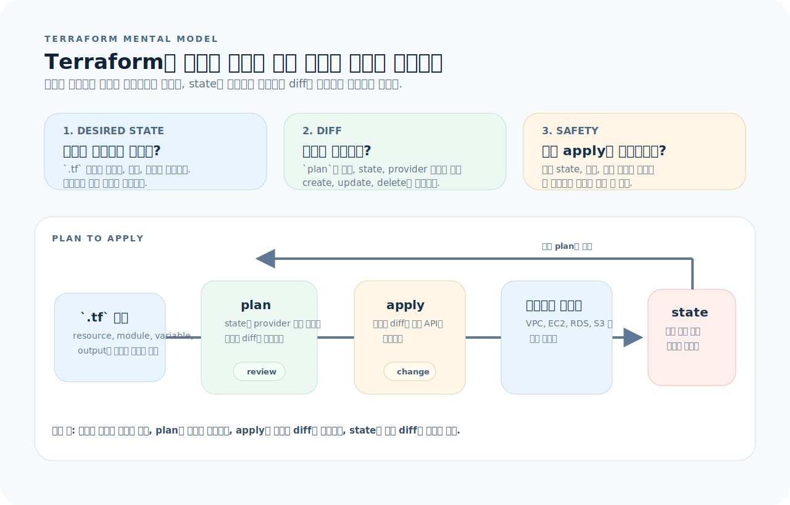
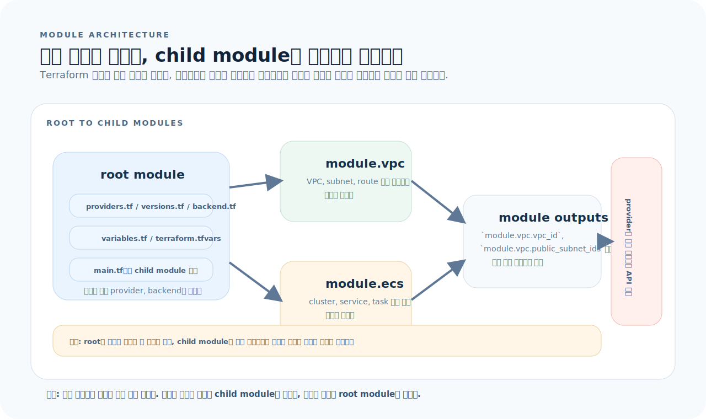
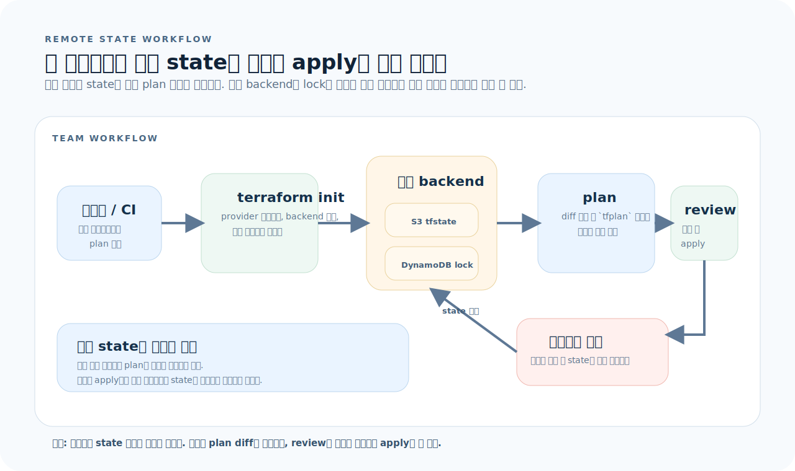

# Terraform 완전 가이드

Terraform은 인프라를 코드로 선언하고, 변경 전 diff를 검토한 뒤, 동일한 결과를 반복 적용하는 IaC 도구다. 핵심은 리소스를 "명령으로 만드는 것"이 아니라 "원하는 상태를 선언하고 실제 상태와 비교하는 것"이다. 이 글은 Terraform을 문법 모음이 아니라 `desired state`, `module`, `state workflow`라는 세 축으로 이해하도록 정리한다.

---

## 1. Terraform의 사고방식

Terraform은 리소스를 만드는 순서를 손으로 적는 도구가 아니다. `.tf` 파일에 원하는 상태를 선언하고, `tfstate`와 실제 인프라를 비교해 안전하게 변경하는 도구다. 그래서 가장 먼저 봐야 할 것은 문법보다도 `plan`이 어떻게 계산되는지다.



이 문서는 먼저 아래 세 질문으로 읽으면 된다.

1. **원하는 상태:** 어떤 리소스가 어떤 속성으로 존재해야 하는가?
2. **변경 차이:** Terraform은 현재 `state`와 실제 리소스를 기준으로 어떤 diff를 계산하는가?
3. **안전 장치:** 팀은 어떤 백엔드와 리뷰 절차로 `apply`를 통제하는가?

그림 기준으로 Terraform의 핵심은 세 문장으로 요약된다.

- `.tf` 파일은 명령이 아니라 원하는 상태를 선언한다.
- `plan`은 코드, state, provider 응답을 합쳐 diff를 계산한다.
- `apply`는 그 diff만 실제 인프라에 반영하고 state를 갱신한다.

### 핵심 개념

| 개념 | 의미 |
|------|------|
| 선언적 | "어떻게 만들까"보다 "무엇이 존재해야 하나"를 적는다 |
| Idempotent | 여러 번 apply해도 원하는 상태가 같으면 결과가 같다 |
| State | Terraform이 관리 중인 리소스의 현재 스냅샷이다 |
| Provider | AWS/GCP/Azure 같은 외부 API와 통신하는 플러그인이다 |
| Plan | 코드와 현재 상태를 비교해 계산한 변경 사항이다 |

---

## 2. 프로젝트 구조와 모듈 경계

Terraform은 파일 수보다도 root module과 child module의 경계를 명확하게 나누는 것이 중요하다. 루트는 환경별 조립을 담당하고, 하위 모듈은 재사용 가능한 인프라 단위를 책임진다.



그림을 기준으로 구조를 읽으면 빠르다.

- root module은 provider, backend, 변수, 환경별 조합을 관리한다.
- child module은 VPC, ECS, DB처럼 재사용 가능한 리소스 묶음을 제공한다.
- module output을 다음 module input으로 연결해 의존 관계를 노출한다.

```text
infra/
├── main.tf
├── variables.tf
├── outputs.tf
├── terraform.tfvars
├── providers.tf
├── versions.tf
├── backend.tf
└── modules/
    ├── vpc/
    │   ├── main.tf
    │   ├── variables.tf
    │   └── outputs.tf
    └── ecs/
        ├── main.tf
        ├── variables.tf
        └── outputs.tf
```

이 구조가 실무에서 중요한 이유는 단순하다.

- 환경별 값은 root module에서만 바꾸고, child module 코드는 재사용한다.
- provider와 backend 설정이 한곳에 모여 팀 운영 규칙이 명확해진다.
- 모듈 경계가 분명할수록 변경 영향 범위를 `plan`으로 읽기 쉬워진다.

---

## 3. 기본 블록

### Provider

```hcl
# providers.tf
terraform {
  required_version = ">= 1.7"

  required_providers {
    aws = {
      source  = "hashicorp/aws"
      version = "~> 5.0"
    }
  }
}

provider "aws" {
  region = var.aws_region
}
```

### Variable

```hcl
# variables.tf
variable "aws_region" {
  description = "AWS 리전"
  type        = string
  default     = "ap-northeast-2"
}

variable "environment" {
  description = "배포 환경"
  type        = string
  validation {
    condition     = contains(["dev", "staging", "prod"], var.environment)
    error_message = "environment는 dev, staging, prod 중 하나여야 합니다."
  }
}

variable "db_password" {
  description = "DB 비밀번호"
  type        = string
  sensitive   = true
}

variable "tags" {
  type = map(string)
  default = {
    Project = "my-app"
    Team    = "backend"
  }
}
```

```hcl
# terraform.tfvars
aws_region  = "ap-northeast-2"
environment = "dev"
```

### Resource

```hcl
# main.tf
resource "aws_s3_bucket" "logs" {
  bucket = "${var.environment}-my-app-logs"
  tags   = var.tags
}

resource "aws_s3_bucket_versioning" "logs" {
  bucket = aws_s3_bucket.logs.id
  versioning_configuration {
    status = "Enabled"
  }
}
```

### Data Source

```hcl
data "aws_caller_identity" "current" {}
data "aws_region" "current" {}

data "aws_ami" "ubuntu" {
  most_recent = true
  owners      = ["099720109477"]

  filter {
    name   = "name"
    values = ["ubuntu/images/hvm-ssd/ubuntu-*-amd64-server-*"]
  }
}

resource "aws_instance" "web" {
  ami           = data.aws_ami.ubuntu.id
  instance_type = "t3.micro"
}
```

### Output

```hcl
# outputs.tf
output "bucket_arn" {
  description = "로그 버킷 ARN"
  value       = aws_s3_bucket.logs.arn
}

output "account_id" {
  value = data.aws_caller_identity.current.account_id
}
```

이 블록들을 읽을 때는 다음 순서가 편하다.

- `variable`과 `locals`가 어떤 입력값을 만드는지 본다.
- `data`가 기존 리소스나 외부 정보를 어디서 가져오는지 확인한다.
- `resource`와 `module`이 실제 변경 대상을 만든다.
- `output`은 다른 모듈이나 운영자가 소비할 값을 노출한다.

---

## 4. 워크플로우

Terraform CLI는 단순한 명령 모음이 아니라 "초기화 → 검증 → diff 확인 → 반영" 순서의 안전 장치다.

```bash
# 1. 초기화
terraform init

# 2. 포맷팅
terraform fmt -recursive

# 3. 유효성 검사
terraform validate

# 4. 변경 사항 미리보기
terraform plan

# 5. 적용
terraform apply
terraform apply -auto-approve

# 6. 제거
terraform destroy
```

### plan 저장 및 활용

```bash
terraform plan -out=tfplan
terraform apply tfplan

terraform show -json tfplan > plan.json
```

운영에서는 이 순서를 짧게 줄이지 않는 편이 좋다.

- `fmt`와 `validate`는 문법과 기본 구조 오류를 빨리 잡는다.
- `plan -out=tfplan`은 리뷰한 변경만 정확히 apply하게 만든다.
- JSON plan은 자동화 리뷰, 정책 검사, 비용 분석 입력으로 쓰기 좋다.

---

## 5. State 관리와 팀 워크플로우

Terraform에서 가장 중요한 운영 자산은 코드보다도 state다. state가 꼬이면 `plan`이 잘못된 diff를 계산하고, 잘못된 diff는 곧 실제 인프라 사고로 이어진다.



이 섹션의 읽는 기준은 세 가지다.

- state는 로컬 파일이 아니라 팀이 공유하는 원격 백엔드에 둔다.
- apply 전에는 잠금과 리뷰 절차가 있어야 동시에 같은 상태를 바꾸지 않는다.
- 기존 리소스를 이름만 바꾸고 싶을 때는 코드 변경보다 `terraform state` 명령이 먼저다.

### 원격 State

```hcl
# backend.tf
terraform {
  backend "s3" {
    bucket         = "my-terraform-state"
    key            = "infra/terraform.tfstate"
    region         = "ap-northeast-2"
    dynamodb_table = "terraform-locks"
    encrypt        = true
  }
}
```

### State 명령어

```bash
terraform state list
terraform state show aws_s3_bucket.logs
terraform state mv aws_s3_bucket.logs aws_s3_bucket.app_logs
terraform state rm aws_s3_bucket.logs

terraform import aws_s3_bucket.logs my-existing-bucket
```

> `terraform.tfstate`를 직접 편집하지 않는다. 상태가 어긋나면 복구 비용이 매우 크다.

---

## 6. 모듈 재사용

### 모듈 구조

```hcl
# modules/vpc/variables.tf
variable "cidr_block" {
  type    = string
  default = "10.0.0.0/16"
}

variable "environment" {
  type = string
}
```

```hcl
# modules/vpc/main.tf
resource "aws_vpc" "main" {
  cidr_block           = var.cidr_block
  enable_dns_hostnames = true

  tags = {
    Name        = "${var.environment}-vpc"
    Environment = var.environment
  }
}

resource "aws_subnet" "public" {
  count             = 2
  vpc_id            = aws_vpc.main.id
  cidr_block        = cidrsubnet(var.cidr_block, 8, count.index)
  availability_zone = data.aws_availability_zones.available.names[count.index]

  tags = {
    Name = "${var.environment}-public-${count.index}"
  }
}
```

```hcl
# modules/vpc/outputs.tf
output "vpc_id" {
  value = aws_vpc.main.id
}

output "public_subnet_ids" {
  value = aws_subnet.public[*].id
}
```

### 모듈 사용

```hcl
# main.tf
module "vpc" {
  source      = "./modules/vpc"
  cidr_block  = "10.0.0.0/16"
  environment = var.environment
}

module "ecs" {
  source     = "./modules/ecs"
  vpc_id     = module.vpc.vpc_id
  subnet_ids = module.vpc.public_subnet_ids
}
```

모듈을 잘 쪼개는 기준은 다음과 같다.

- 함께 바뀌는 리소스는 같은 모듈에 둔다.
- 다른 환경에서도 재사용할 수 있는 입력과 출력만 노출한다.
- 리소스 내부 이름보다 모듈 경계가 읽히도록 `module.xxx.output` 흐름을 명확히 한다.

---

## 7. 반복과 조건

### `count`

```hcl
resource "aws_instance" "web" {
  count         = var.instance_count
  ami           = data.aws_ami.ubuntu.id
  instance_type = "t3.micro"

  tags = {
    Name = "web-${count.index}"
  }
}
```

### `for_each`

```hcl
variable "buckets" {
  type    = set(string)
  default = ["logs", "backups", "assets"]
}

resource "aws_s3_bucket" "this" {
  for_each = var.buckets
  bucket   = "${var.environment}-${each.value}"
}
```

### 조건

```hcl
resource "aws_cloudwatch_log_group" "app" {
  count = var.enable_logging ? 1 : 0
  name  = "/app/${var.environment}"
}
```

### `dynamic` 블록

```hcl
resource "aws_security_group" "web" {
  name   = "web-sg"
  vpc_id = module.vpc.vpc_id

  dynamic "ingress" {
    for_each = var.ingress_rules
    content {
      from_port   = ingress.value.port
      to_port     = ingress.value.port
      protocol    = "tcp"
      cidr_blocks = ingress.value.cidr_blocks
    }
  }
}
```

---

## 8. Locals

```hcl
locals {
  common_tags = {
    Project     = "my-app"
    Environment = var.environment
    ManagedBy   = "terraform"
  }

  name_prefix = "${var.environment}-my-app"
}

resource "aws_s3_bucket" "logs" {
  bucket = "${local.name_prefix}-logs"
  tags   = local.common_tags
}
```

`locals`는 세 가지 상황에서 특히 유용하다.

- 여러 리소스에서 반복되는 태그나 이름 규칙을 한곳에 모을 때
- 긴 표현식을 재사용 가능한 중간 계산값으로 정리할 때
- 모듈 입력값을 조합해 사람이 읽기 쉬운 이름 체계를 만들 때

---

## 9. 실전 예제: VPC + EC2 + RDS

```hcl
module "vpc" {
  source      = "./modules/vpc"
  environment = var.environment
}

resource "aws_security_group" "web" {
  vpc_id = module.vpc.vpc_id

  ingress {
    from_port   = 80
    to_port     = 80
    protocol    = "tcp"
    cidr_blocks = ["0.0.0.0/0"]
  }

  egress {
    from_port   = 0
    to_port     = 0
    protocol    = "-1"
    cidr_blocks = ["0.0.0.0/0"]
  }
}

resource "aws_security_group" "db" {
  vpc_id = module.vpc.vpc_id

  ingress {
    from_port       = 5432
    to_port         = 5432
    protocol        = "tcp"
    security_groups = [aws_security_group.web.id]
  }
}

resource "aws_instance" "web" {
  ami                    = data.aws_ami.ubuntu.id
  instance_type          = "t3.micro"
  subnet_id              = module.vpc.public_subnet_ids[0]
  vpc_security_group_ids = [aws_security_group.web.id]

  tags = merge(local.common_tags, { Name = "${local.name_prefix}-web" })
}

resource "aws_db_instance" "main" {
  engine                 = "postgres"
  engine_version         = "16"
  instance_class         = "db.t3.micro"
  allocated_storage      = 20
  db_name                = "myapp"
  username               = "admin"
  password               = var.db_password
  skip_final_snapshot    = true
  vpc_security_group_ids = [aws_security_group.db.id]
  db_subnet_group_name   = aws_db_subnet_group.main.name

  tags = local.common_tags
}
```

이 예제에서 중요한 점은 리소스 개수가 아니라 경계다.

- `module.vpc`가 네트워크 기반을 제공한다.
- `web` SG와 `db` SG가 통신 방향을 강제한다.
- DB 비밀번호는 변수로 주입하고 state/plan 노출 범위를 통제해야 한다.

---

## 10. 자주 하는 실수

| 실수 | 원인과 해결 |
|------|-------------|
| `plan` 없이 바로 `apply` | 항상 `plan`으로 diff를 검토한 뒤 적용한다 |
| state 파일 직접 수정 | `terraform state` 명령만 사용한다 |
| credential을 `.tf`에 하드코딩 | 환경변수 또는 클라우드 자격 증명 체계를 사용한다 |
| `init` 누락으로 provider 에러 | 새 환경이나 backend 변경 후 `terraform init`을 먼저 실행한다 |
| 리소스 이름 변경으로 destroy/create 발생 | 단순 이름 변경이면 `terraform state mv`를 검토한다 |
| 버전 미고정으로 환경별 차이 발생 | `required_version`과 provider `version`을 고정한다 |
| 원격 state 미사용 | 팀 작업은 S3 + DynamoDB 같은 원격 backend와 잠금이 필수다 |
| `sensitive` 누락 | 비밀번호나 토큰은 `sensitive = true`로 표시한다 |

---

## 11. 빠른 참조

```bash
# ── 워크플로우 ──
terraform init
terraform fmt -recursive
terraform validate
terraform plan [-out=tfplan]
terraform apply [tfplan]
terraform destroy

# ── State ──
terraform state list
terraform state show <resource>
terraform state mv <from> <to>
terraform state rm <resource>
terraform import <resource> <id>

# ── 디버깅 ──
terraform show -json tfplan
terraform console
TF_LOG=DEBUG terraform plan
```

```hcl
provider "aws" { region = "..." }
resource "type" "name" { ... }
data "type" "name" { ... }
variable "name" { type = string }
output "name" { value = ... }
module "name" { source = "..." }
locals { key = value }
```
