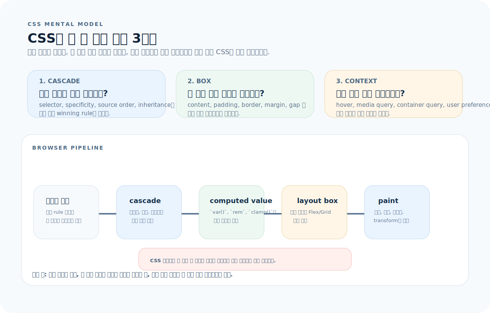
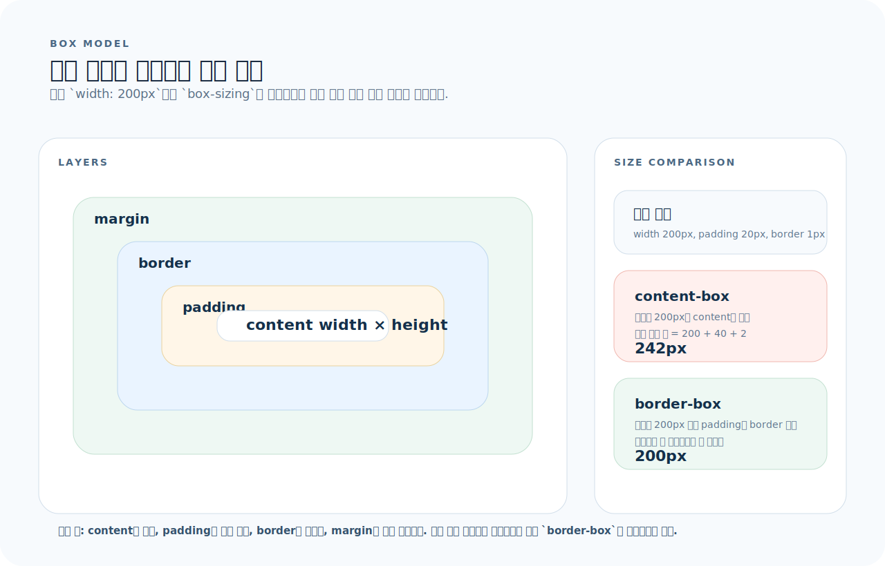
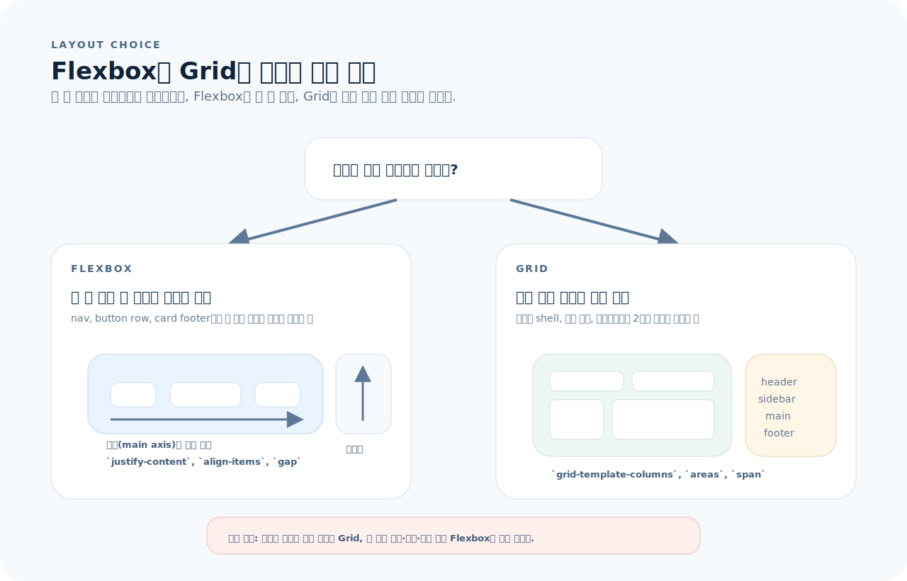
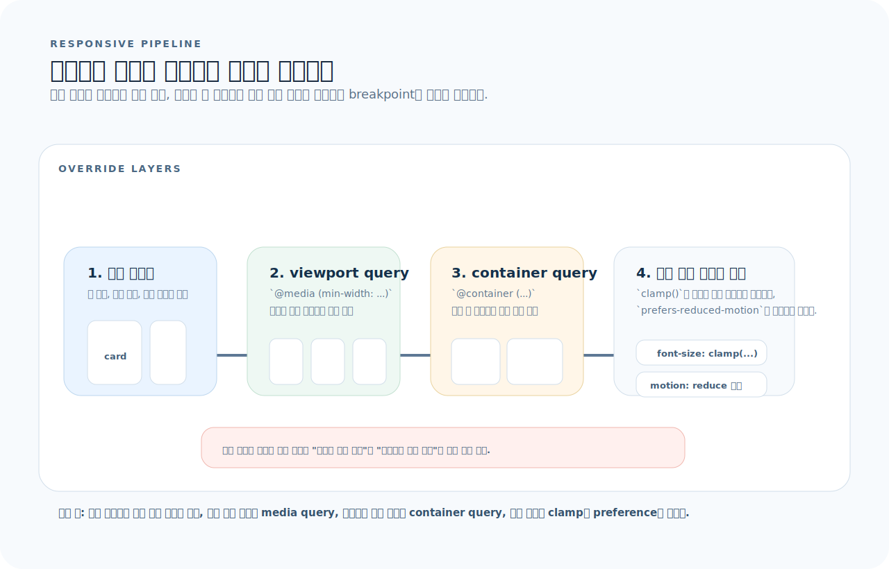

# CSS 완전 가이드

CSS는 웹의 시각적 표현을 담당하는 유일한 언어다. React든 Vue든, 화면에 보이는 모든 것은 결국 CSS로 배치되고 스타일링된다. 이 글을 읽고 나면 박스 모델, Flexbox, Grid, 반응형 설계, 애니메이션까지 실무에서 CSS를 자유롭게 다룰 수 있다.

---

## 1. CSS를 읽는 기준

CSS를 속성 목록으로 외우기보다, 선언 하나가 브라우저 안에서 어떤 단계를 거쳐 최종 픽셀로 바뀌는지 먼저 보는 편이 훨씬 빠르다.



- 먼저 어떤 규칙이 이기는지 `cascade`를 본다.
- 다음으로 그 값이 박스의 어느 층과 어떤 레이아웃 시스템을 바꾸는지 본다.
- 마지막으로 viewport, container, state, 사용자 설정이 언제 값을 다시 계산하는지 본다.

먼저 아래 세 질문으로 읽으면 된다.

1. 지금 문제는 "이 규칙이 왜 안 먹지?" 같은 cascade 문제인가, 아니면 레이아웃 계산 문제인가?
2. 이 속성은 content, padding, border, margin 중 어느 층을 바꾸는가?
3. 이 값은 viewport, container, pseudo-class, 사용자 preference 때문에 언제 다시 바뀌는가?

---

## 2. 박스 모델

모든 HTML 요소는 **박스**다. `width`와 `height`를 볼 때는 content 영역만 말하는지, 최종 테두리까지 포함하는지부터 먼저 구분해야 한다.



- `width`/`height`의 기본 대상은 content 영역이다.
- `padding`과 `border`를 더한 값이 실제 차지 크기가 되므로, 대부분의 앱에서는 `border-box`가 더 직관적이다.
- `margin`은 박스 바깥 여백이라 배경과 클릭 영역에 포함되지 않는다.

### box-sizing

```css
/* ❌ content-box (기본값) — width에 padding/border 미포함 */
.box { width: 200px; padding: 20px; border: 1px solid; }
/* 실제 너비: 200 + 40 + 2 = 242px */

/* ✅ border-box — width에 padding/border 포함 */
*, *::before, *::after { box-sizing: border-box; }
.box { width: 200px; padding: 20px; border: 1px solid; }
/* 실제 너비: 200px (직관적) */
```

> **모든 프로젝트에서 `box-sizing: border-box`를 전역 리셋으로 적용한다.**

---

## 3. 선택자와 특이도(Specificity)

CSS 문제의 절반은 레이아웃 자체보다 "왜 이 선언이 안 이겼지?"에서 시작한다. 이 섹션은 cascade의 승자를 찾는 기준표다.

### 선택자 종류

```css
/* 요소 */
p { color: black; }

/* 클래스 */
.card { padding: 1rem; }

/* ID */
#header { height: 60px; }

/* 속성 */
input[type="email"] { border-color: blue; }

/* 의사 클래스 */
a:hover { color: red; }
li:first-child { font-weight: bold; }
li:nth-child(2n) { background: #f5f5f5; }

/* 의사 요소 */
p::first-line { font-weight: bold; }
.icon::before { content: "→"; }

/* 결합자 */
.card .title { }       /* 하위(공백) */
.card > .title { }     /* 직계 자식 */
h2 + p { }             /* 인접 형제 */
h2 ~ p { }             /* 일반 형제 */
```

### 특이도 계산

```
특이도: (inline, ID, class, element)

style=""               → (1, 0, 0, 0)
#header                → (0, 1, 0, 0)
.card.active           → (0, 0, 2, 0)
div.card               → (0, 0, 1, 1)
p                      → (0, 0, 0, 1)

높은 특이도가 이김.
같으면 나중에 선언된 것이 이김.
!important는 특이도를 무시 — 가능한 사용하지 않는다.
```

---

## 4. Flexbox — 1차원 레이아웃

Flexbox와 Grid는 경쟁 관계가 아니라 역할 분담이다. 한 축의 정렬과 분배면 Flexbox, 행과 열을 동시에 설계해야 하면 Grid로 가면 된다.



- Flexbox는 부모가 주축과 교차축을 정하고, 자식이 그 축 안에서 늘어나거나 정렬된다.
- Grid는 부모가 열과 행의 track을 먼저 만들고, 자식이 그 칸이나 area를 차지한다.
- 실무에서는 페이지 shell은 Grid, 카드 내부나 버튼 줄은 Flexbox인 조합이 가장 흔하다.

```css
.container {
  display: flex;
  flex-direction: row;        /* row | column */
  justify-content: center;    /* 주축 정렬 */
  align-items: center;        /* 교차축 정렬 */
  gap: 1rem;                  /* 아이템 간 간격 */
  flex-wrap: wrap;            /* 줄 바꿈 허용 */
}
```

### justify-content (주축)

| 값 | 효과 |
|----|------|
| `flex-start` | 시작점에 모음 (기본) |
| `flex-end` | 끝점에 모음 |
| `center` | 가운데 |
| `space-between` | 양 끝 배치, 사이 균등 |
| `space-around` | 양쪽 균등 여백 |
| `space-evenly` | 모든 간격 동일 |

### align-items (교차축)

| 값 | 효과 |
|----|------|
| `stretch` | 교차축 꽉 채움 (기본) |
| `flex-start` | 위쪽 정렬 |
| `flex-end` | 아래쪽 정렬 |
| `center` | 가운데 정렬 |
| `baseline` | 텍스트 기준선 정렬 |

### flex 아이템 속성

```css
.item {
  flex: 1;                     /* flex-grow: 1, flex-shrink: 1, flex-basis: 0 */
  flex: 0 0 200px;             /* 고정 200px, 늘어남/줄어듦 없음 */
  align-self: flex-end;        /* 개별 아이템 교차축 정렬 */
  order: -1;                   /* 순서 변경 */
}
```

### 실전 패턴

```css
/* 네비게이션 바 */
.navbar {
  display: flex;
  justify-content: space-between;
  align-items: center;
  padding: 0 1rem;
  height: 60px;
}

/* 가운데 정렬 (수평 + 수직) */
.center {
  display: flex;
  justify-content: center;
  align-items: center;
  min-height: 100vh;
}

/* 푸터 하단 고정 */
body {
  display: flex;
  flex-direction: column;
  min-height: 100vh;
}
main { flex: 1; }
```

---

## 5. Grid — 2차원 레이아웃

```css
.grid {
  display: grid;
  grid-template-columns: repeat(3, 1fr);   /* 3열 균등 */
  grid-template-rows: auto;
  gap: 1rem;
}
```

### grid-template-columns 패턴

```css
/* 고정 + 유동 */
grid-template-columns: 250px 1fr;               /* 사이드바 + 메인 */
grid-template-columns: 250px 1fr 300px;          /* 3열 레이아웃 */

/* 반응형 카드 — 가장 자주 쓰는 패턴 */
grid-template-columns: repeat(auto-fill, minmax(300px, 1fr));

/* 명시적 이름 */
grid-template-columns: [sidebar-start] 250px [sidebar-end main-start] 1fr [main-end];
```

### Grid 아이템 배치

```css
.item {
  grid-column: 1 / 3;          /* 1열부터 3열 전까지 (2열 차지) */
  grid-row: 1 / 2;             /* 1행 */
  grid-column: span 2;         /* 2열 차지 */
}
```

### grid-template-areas — 영역 이름 배치

```css
.layout {
  display: grid;
  grid-template-areas:
    "header  header"
    "sidebar main"
    "footer  footer";
  grid-template-columns: 250px 1fr;
  grid-template-rows: 60px 1fr 40px;
  min-height: 100vh;
}

.header  { grid-area: header; }
.sidebar { grid-area: sidebar; }
.main    { grid-area: main; }
.footer  { grid-area: footer; }
```

---

## 6. 반응형 디자인

반응형은 breakpoint를 많이 넣는 작업이 아니라, 기본 스타일 하나 위에 어떤 조건이 어떤 범위에서 값을 덮어쓰는지 관리하는 작업이다.



- 기본값은 모바일 기준으로 가장 좁은 레이아웃부터 둔다.
- viewport 기반 `@media`는 페이지 전체의 레이아웃을 바꿀 때 쓴다.
- `@container`는 카드 같은 컴포넌트 내부 배치를 부모 폭 기준으로 바꿀 때 쓴다.
- `clamp()`와 사용자 preference를 함께 쓰면 breakpoint 수를 줄일 수 있다.

### 모바일 우선 (Mobile First)

```css
/* 기본: 모바일 */
.grid {
  display: grid;
  grid-template-columns: 1fr;
  gap: 1rem;
}

/* 태블릿 */
@media (min-width: 768px) {
  .grid {
    grid-template-columns: repeat(2, 1fr);
  }
}

/* 데스크톱 */
@media (min-width: 1024px) {
  .grid {
    grid-template-columns: repeat(3, 1fr);
  }
}
```

### 자주 쓰는 breakpoint

| 이름 | 값 |
|------|------|
| sm | `640px` |
| md | `768px` |
| lg | `1024px` |
| xl | `1280px` |
| 2xl | `1536px` |

### 컨테이너 쿼리

```css
.card-container {
  container-type: inline-size;
}

@container (min-width: 400px) {
  .card {
    display: flex;
    flex-direction: row;
  }
}
```

---

## 7. CSS 변수 (Custom Properties)

```css
:root {
  /* 색상 */
  --color-primary: #2563eb;
  --color-primary-hover: #1d4ed8;
  --color-bg: #ffffff;
  --color-text: #1a1a1a;
  --color-border: #e5e7eb;

  /* 간격 */
  --space-xs: 0.25rem;
  --space-sm: 0.5rem;
  --space-md: 1rem;
  --space-lg: 2rem;
  --space-xl: 4rem;

  /* 타이포그래피 */
  --font-sans: system-ui, -apple-system, sans-serif;
  --font-mono: ui-monospace, monospace;
  --text-sm: 0.875rem;
  --text-base: 1rem;
  --text-lg: 1.25rem;
  --text-xl: 1.5rem;

  /* 기타 */
  --radius: 0.375rem;
  --shadow: 0 1px 3px rgb(0 0 0 / 0.1);
}

/* 다크모드 */
@media (prefers-color-scheme: dark) {
  :root {
    --color-bg: #0a0a0a;
    --color-text: #ededed;
    --color-border: #2a2a2a;
  }
}

/* 사용 */
.button {
  background: var(--color-primary);
  color: white;
  padding: var(--space-sm) var(--space-md);
  border-radius: var(--radius);
  font-family: var(--font-sans);
}

.button:hover {
  background: var(--color-primary-hover);
}
```

---

## 8. 단위

| 단위 | 기준 | 용도 |
|------|------|------|
| `px` | 절대 | 보더, 그림자 등 고정값 |
| `rem` | 루트 font-size (보통 16px) | 폰트 크기, 간격 |
| `em` | 부모 font-size | 상대적 패딩 |
| `%` | 부모 요소 | 너비 |
| `vw` / `vh` | 뷰포트 너비/높이 | 전체 화면 레이아웃 |
| `dvh` | 동적 뷰포트 높이 | 모바일에서 `100vh` 대체 |
| `fr` | Grid 비율 | Grid 열/행 |

### clamp() — 반응형 값

```css
/* clamp(최소, 기본, 최대) */
h1 { font-size: clamp(1.5rem, 4vw, 3rem); }
.container { width: clamp(300px, 90%, 1200px); }
```

---

## 9. 포지셔닝

```css
/* static — 기본값 (문서 흐름) */
/* relative — 자신의 원래 위치 기준 이동 */
.relative { position: relative; top: 10px; }

/* absolute — 가장 가까운 positioned 부모 기준 */
.parent { position: relative; }
.child  { position: absolute; top: 0; right: 0; }

/* fixed — 뷰포트 기준 (스크롤해도 고정) */
.fixed-header { position: fixed; top: 0; width: 100%; z-index: 100; }

/* sticky — 스크롤 따라가다 특정 위치에 고정 */
.sticky-nav { position: sticky; top: 0; }
```

---

## 10. 트랜지션과 애니메이션

### 트랜지션

```css
.button {
  background: var(--color-primary);
  transition: background 200ms ease, transform 150ms ease;
}

.button:hover {
  background: var(--color-primary-hover);
  transform: translateY(-1px);
}
```

### 키프레임 애니메이션

```css
@keyframes fadeIn {
  from { opacity: 0; transform: translateY(10px); }
  to   { opacity: 1; transform: translateY(0); }
}

.card {
  animation: fadeIn 300ms ease forwards;
}

/* 스피너 */
@keyframes spin {
  to { transform: rotate(360deg); }
}

.spinner {
  width: 24px;
  height: 24px;
  border: 3px solid var(--color-border);
  border-top-color: var(--color-primary);
  border-radius: 50%;
  animation: spin 600ms linear infinite;
}
```

### 모션 감소 설정 존중

```css
@media (prefers-reduced-motion: reduce) {
  *, *::before, *::after {
    animation-duration: 0.01ms !important;
    transition-duration: 0.01ms !important;
  }
}
```

---

## 11. 유용한 패턴

### 전역 리셋

```css
*, *::before, *::after {
  box-sizing: border-box;
  margin: 0;
}

html {
  -webkit-text-size-adjust: none;
  text-size-adjust: none;
}

body {
  min-height: 100vh;
  line-height: 1.6;
  font-family: system-ui, sans-serif;
  -webkit-font-smoothing: antialiased;
}

img, picture, video, canvas, svg {
  display: block;
  max-width: 100%;
}

input, button, textarea, select {
  font: inherit;
}
```

### 스크롤 스냅

```css
.carousel {
  display: flex;
  overflow-x: auto;
  scroll-snap-type: x mandatory;
  gap: 1rem;
}

.carousel > .slide {
  scroll-snap-align: start;
  flex: 0 0 100%;
}
```

### 텍스트 말줄임

```css
/* 한 줄 말줄임 */
.truncate {
  overflow: hidden;
  text-overflow: ellipsis;
  white-space: nowrap;
}

/* 여러 줄 말줄임 */
.line-clamp {
  display: -webkit-box;
  -webkit-line-clamp: 3;
  -webkit-box-orient: vertical;
  overflow: hidden;
}
```

### 시각적으로 숨기되 스크린 리더에 노출

```css
.sr-only {
  position: absolute;
  width: 1px;
  height: 1px;
  padding: 0;
  margin: -1px;
  overflow: hidden;
  clip: rect(0, 0, 0, 0);
  white-space: nowrap;
  border-width: 0;
}
```

---

## 12. CSS 스타일링 방식 비교

| 방식 | 장점 | 단점 |
|------|------|------|
| CSS Modules | 스코핑 자동, 기존 CSS 지식 활용 | 동적 스타일 번거로움 |
| Tailwind CSS | 유틸리티 클래스로 빠른 개발 | HTML이 길어짐, 학습 곡선 |
| styled-components | JS에서 동적 스타일, 컴포넌트 캡슐화 | 런타임 비용, 번들 크기 |
| Vanilla CSS | 추가 의존성 없음 | 스코핑 직접 관리 |

---

## 13. 자주 하는 실수

| 실수 | 원인과 해결 |
|------|-------------|
| `box-sizing` 미설정 | 전역 리셋에 `border-box` 적용 |
| 마진 겹침 (margin collapse) | 인접 블록의 상하 마진은 합쳐짐. `gap`이나 Flex/Grid 사용 |
| 데스크톱 우선 코딩 | 모바일 기본 → `min-width` 미디어 쿼리로 확장 |
| 고정 `px`로 폰트/간격 | `rem`, `clamp()` 사용 |
| 100vh 모바일 문제 | 모바일 주소 바 때문에 넘침. `100dvh` 또는 `min-height: 100vh` |
| `z-index` 전쟁 | stacking context 이해. 불필요한 z-index 제거 |
| `!important` 남용 | 특이도를 낮추거나 선언 순서로 해결 |

---

## 14. 빠른 참조

```css
/* ── 레이아웃 ── */
display: flex | grid | block | inline-flex;
justify-content: center | space-between;
align-items: center | stretch;
gap: 1rem;
grid-template-columns: repeat(auto-fill, minmax(300px, 1fr));

/* ── 크기 ── */
width: clamp(300px, 90%, 1200px);
min-height: 100dvh;

/* ── 반응형 ── */
@media (min-width: 768px) { }
@container (min-width: 400px) { }

/* ── 간격 ── */
padding: var(--space-md);
margin-block: var(--space-lg);   /* 상하 마진 */
margin-inline: auto;              /* 수평 중앙 */

/* ── 트랜지션 ── */
transition: property 200ms ease;

/* ── 폰트 ── */
font-size: clamp(1rem, 2.5vw, 2rem);
line-height: 1.6;
```
