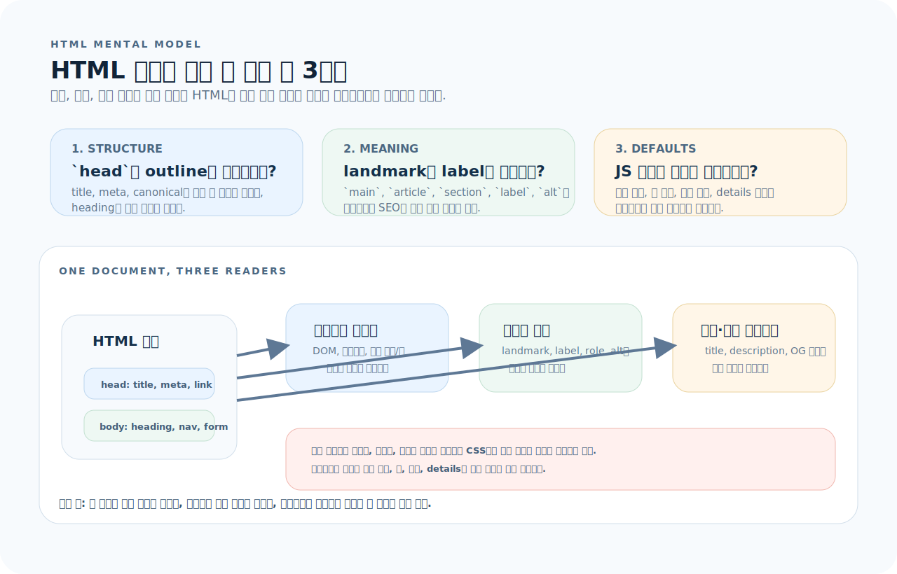
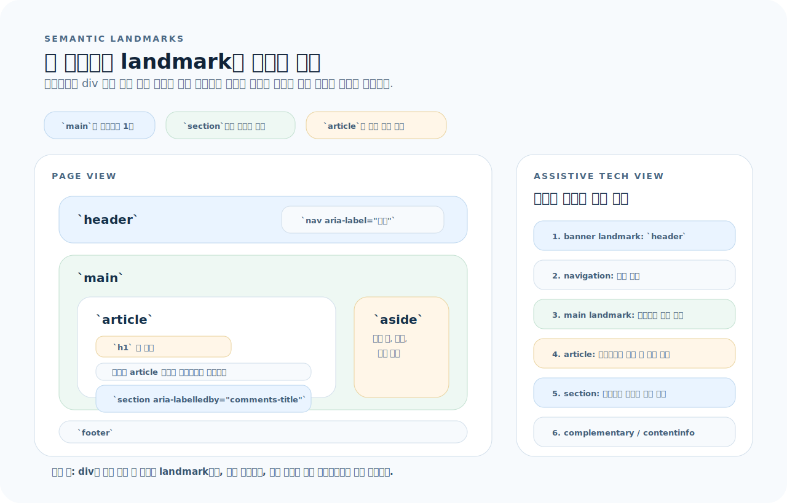
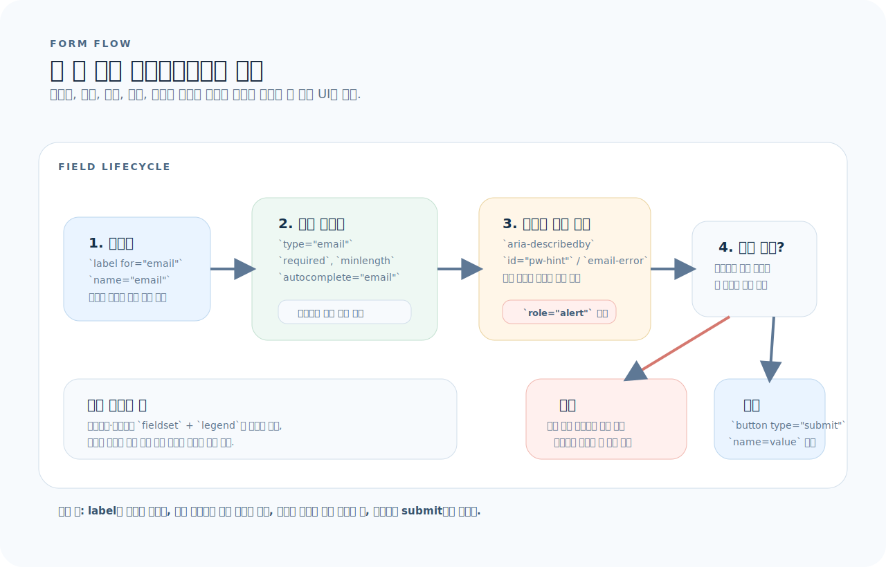

# HTML 완전 가이드

React든 Next.js든, 화면에 렌더링되는 최종 결과물은 HTML이다. JSX는 HTML을 생성하는 도구일 뿐이다. 시맨틱 마크업과 접근성을 모르면 프레임워크 위에서 만드는 UI는 껍데기에 불과하다. 이 글을 읽으면 올바른 HTML 구조를 설계할 수 있다.

---

## 1. HTML을 읽는 기준

HTML을 태그 목록으로 외우기보다, 문서 하나가 브라우저와 보조기술에 어떤 신호를 보내는지 먼저 잡는 편이 훨씬 빠르다.



- `head`는 검색, 공유, 탭 제목처럼 화면 밖 계약을 만든다.
- `body`의 시맨틱 구조는 보이는 레이아웃보다 먼저 landmark와 heading outline을 만든다.
- 링크, 폼, 미디어는 JavaScript 전에 기본 동작이 있으므로 먼저 네이티브 HTML로 설계한다.

먼저 아래 세 질문으로 읽으면 된다.

1. 이 태그는 화면만 꾸미는가, 아니면 문서 구조와 의미를 함께 전달하는가?
2. 스크린 리더와 크롤러는 이 마크업을 어떤 landmark, label, metadata로 읽는가?
3. 이 상호작용은 JavaScript 없이도 `<a>`, `<form>`, `<button>`, `<details>`로 기본 동작을 확보하는가?

---

## 2. 문서 기본 구조

문서 기본 구조는 단순히 외워야 할 뼈대가 아니라, `head`와 `body`의 책임을 분리하는 최소 계약이다.

```html
<!DOCTYPE html>
<html lang="ko">
<head>
  <meta charset="UTF-8" />
  <meta name="viewport" content="width=device-width, initial-scale=1.0" />
  <meta name="description" content="페이지 설명 — SEO에 직결" />
  <title>페이지 제목</title>
  <link rel="stylesheet" href="/styles.css" />
  <link rel="icon" href="/favicon.ico" />
</head>
<body>
  <!-- 콘텐츠 -->
  <script src="/app.js" defer></script>
</body>
</html>
```

### `<head>` 필수 메타 태그

| 태그 | 역할 |
|------|------|
| `<meta charset="UTF-8">` | 문자 인코딩 (필수) |
| `<meta name="viewport" ...>` | 모바일 반응형 (필수) |
| `<meta name="description">` | SEO 검색 결과 설명 |
| `<title>` | 탭 제목 + SEO |
| `<link rel="canonical">` | 중복 URL 방지 |

### OG 태그 (소셜 공유)

```html
<meta property="og:title" content="제목" />
<meta property="og:description" content="설명" />
<meta property="og:image" content="https://example.com/og.png" />
<meta property="og:url" content="https://example.com/page" />
<meta property="og:type" content="article" />
```

---

## 3. 시맨틱 태그

시맨틱 태그는 **의미**를 가진다. 스크린 리더, SEO 크롤러, 브라우저 모두 이 의미를 읽는다.



- `header`, `nav`, `main`, `footer`는 페이지 landmark로 바로 인식된다.
- `article`은 독립 배포 가능한 덩어리이고, `section`은 같은 주제의 묶음이다.
- `section`을 쓸 때는 제목이나 `aria-labelledby`로 문맥을 같이 제공해야 한다.

### 레이아웃 시맨틱

```html
<body>
  <header>
    <nav aria-label="메인 내비게이션">
      <ul>
        <li><a href="/">홈</a></li>
        <li><a href="/about">소개</a></li>
      </ul>
    </nav>
  </header>

  <main>
    <article>
      <h1>글 제목</h1>
      <p>본문...</p>

      <section aria-labelledby="comments-title">
        <h2 id="comments-title">댓글</h2>
        <!-- 댓글 목록 -->
      </section>
    </article>

    <aside>
      <h2>관련 글</h2>
      <!-- 사이드 콘텐츠 -->
    </aside>
  </main>

  <footer>
    <p>&copy; 2025</p>
  </footer>
</body>
```

### 태그별 역할

| 태그 | 역할 | 규칙 |
|------|------|------|
| `<header>` | 페이지/섹션 머리글 | 여러 개 가능 |
| `<nav>` | 내비게이션 링크 그룹 | `aria-label`로 구분 |
| `<main>` | 주요 콘텐츠 | **페이지당 하나** |
| `<article>` | 독립적 콘텐츠 (블로그 글, 뉴스 등) | 단독 배포 가능 여부 |
| `<section>` | 주제별 그룹 | `aria-labelledby`로 제목 연결 |
| `<aside>` | 부가 정보, 사이드바 | |
| `<footer>` | 페이지/섹션 바닥글 | 여러 개 가능 |

### div vs 시맨틱

```html
<!-- ❌ div 남용 -->
<div class="header">
  <div class="nav">...</div>
</div>
<div class="content">...</div>

<!-- ✅ 시맨틱 -->
<header>
  <nav aria-label="메인">...</nav>
</header>
<main>...</main>
```

> `<div>`는 의미가 없는 래퍼에만 쓴다. **CSS 스타일링 목적의 컨테이너**가 필요할 때 `<div>`가 적합하다.

---

## 4. 헤딩 계층

헤딩은 문서의 **개요(outline)**를 만든다. 시각적 크기가 아니라 **논리적 계층**이 중요하다.

```html
<!-- ✅ 올바른 계층 -->
<h1>웹 개발 가이드</h1>
  <h2>프론트엔드</h2>
    <h3>HTML</h3>
    <h3>CSS</h3>
  <h2>백엔드</h2>
    <h3>Node.js</h3>

<!-- ❌ 레벨 건너뛰기 -->
<h1>제목</h1>
<h3>소제목</h3>    <!-- h2를 건너뜀 -->
```

| 규칙 | 설명 |
|------|------|
| `<h1>`은 페이지당 하나 | 페이지의 대주제 |
| 레벨을 건너뛰지 않는다 | h1 → h2 → h3 순서 |
| 시각적 크기는 CSS로 | `<h2>`를 작게 보이게 하려면 CSS 사용 |

---

## 5. 텍스트 콘텐츠 태그

```html
<!-- 단락 -->
<p>일반 텍스트 단락</p>

<!-- 강조 -->
<strong>중요한 텍스트</strong>    <!-- 의미적 강조 (굵게) -->
<em>강조 텍스트</em>             <!-- 의미적 강조 (기울임) -->
<b>시각적 굵게</b>               <!-- 의미 없는 굵게 -->
<i>시각적 기울임</i>             <!-- 의미 없는 기울임 -->

<!-- 인용 -->
<blockquote cite="https://example.com">
  <p>인용문 텍스트</p>
</blockquote>
<q>짧은 인용</q>

<!-- 코드 -->
<code>inline code</code>
<pre><code>
  여러 줄 코드 블록
</code></pre>

<!-- 시간 -->
<time datetime="2025-01-15">2025년 1월 15일</time>

<!-- 약어 -->
<abbr title="HyperText Markup Language">HTML</abbr>
```

---

## 6. 목록

```html
<!-- 순서 없는 목록 -->
<ul>
  <li>항목 1</li>
  <li>항목 2</li>
</ul>

<!-- 순서 있는 목록 -->
<ol>
  <li>첫 번째 단계</li>
  <li>두 번째 단계</li>
</ol>

<!-- 설명 목록 (용어 + 정의) -->
<dl>
  <dt>HTML</dt>
  <dd>웹의 구조를 정의하는 마크업 언어</dd>
  <dt>CSS</dt>
  <dd>웹의 시각적 표현을 담당하는 스타일시트 언어</dd>
</dl>
```

---

## 7. 링크와 이미지

### 링크

```html
<!-- 같은 사이트 -->
<a href="/about">소개</a>

<!-- 외부 — 보안 속성 필수 -->
<a href="https://example.com" target="_blank" rel="noopener noreferrer">외부 링크</a>

<!-- 다운로드 -->
<a href="/file.pdf" download>PDF 다운로드</a>

<!-- 앵커 -->
<a href="#section-2">섹션 2로 이동</a>
<section id="section-2">...</section>
```

### 이미지

```html
<!-- 기본 — alt 필수 -->


<!-- 장식용 이미지 — alt 비움 -->


<!-- 반응형 이미지 -->


<!-- picture — 아트 디렉션 -->
<picture>
  <source media="(min-width: 1024px)" srcset="/hero-wide.webp" />
  <source media="(min-width: 640px)" srcset="/hero-medium.webp" />
  
</picture>

<!-- lazy loading -->

```

---

## 8. 테이블

```html
<table>
  <caption>2025년 1분기 매출</caption>
  <thead>
    <tr>
      <th scope="col">월</th>
      <th scope="col">매출</th>
      <th scope="col">성장률</th>
    </tr>
  </thead>
  <tbody>
    <tr>
      <td>1월</td>
      <td>1,200만</td>
      <td>+5%</td>
    </tr>
    <tr>
      <td>2월</td>
      <td>1,350만</td>
      <td>+12.5%</td>
    </tr>
  </tbody>
</table>
```

| 요소 | 역할 |
|------|------|
| `<caption>` | 테이블 제목 (접근성 필수) |
| `<thead>` / `<tbody>` / `<tfoot>` | 구조적 구분 |
| `<th scope="col">` | 열 헤더 |
| `<th scope="row">` | 행 헤더 |

> 레이아웃에 `<table>`을 쓰지 않는다. 데이터 표시 목적에만 사용한다.

---

## 9. 폼

폼은 입력 칸을 나열하는 문제가 아니라, 레이블, 입력, 힌트, 검증, 제출이 한 흐름으로 이어지게 만드는 문제다.



- `label`/`id`와 `name`이 연결되어야 브라우저, 스크린 리더, 서버가 같은 필드를 본다.
- 힌트와 오류는 `aria-describedby`나 `role="alert"`로 필드에 다시 연결해야 한다.
- `type`, `required`, `autocomplete` 같은 네이티브 속성으로 기본 검증과 입력 경험을 먼저 확보한다.

### 기본 폼

```html
<form action="/api/login" method="POST">
  <div>
    <label for="email">이메일</label>
    <input id="email" name="email" type="email" required
           placeholder="user@example.com"
           autocomplete="email" />
  </div>

  <div>
    <label for="password">비밀번호</label>
    <input id="password" name="password" type="password" required
           minlength="8"
           autocomplete="current-password" />
    <p id="pw-hint">8자 이상 입력하세요</p>
  </div>

  <button type="submit">로그인</button>
</form>
```

### input 타입

| type | 용도 | 내장 검증 |
|------|------|-----------|
| `text` | 일반 텍스트 | `pattern` 정규식 |
| `email` | 이메일 | 이메일 형식 검증 |
| `password` | 비밀번호 | `minlength` |
| `number` | 숫자 | `min`, `max`, `step` |
| `tel` | 전화번호 | 모바일 숫자 키패드 |
| `url` | URL | URL 형식 검증 |
| `date` | 날짜 | 날짜 피커 |
| `file` | 파일 업로드 | `accept` |
| `checkbox` | 체크박스 | |
| `radio` | 라디오 | `name`으로 그룹 |
| `search` | 검색 | 지우기 버튼 |
| `hidden` | 숨김 값 | |

### 검증 속성

```html
<input type="text" required />                      <!-- 필수 -->
<input type="text" minlength="3" maxlength="20" />  <!-- 길이 제한 -->
<input type="number" min="0" max="100" step="5" />  <!-- 범위 + 단위 -->
<input type="text" pattern="[A-Za-z]{3}" />         <!-- 정규식 -->
```

### 기타 폼 요소

```html
<!-- 선택 -->
<label for="country">국가</label>
<select id="country" name="country">
  <option value="">선택하세요</option>
  <option value="kr">한국</option>
  <option value="us">미국</option>
</select>

<!-- 여러 줄 입력 -->
<label for="bio">자기소개</label>
<textarea id="bio" name="bio" rows="4"></textarea>

<!-- 라디오 그룹 -->
<fieldset>
  <legend>구독 플랜</legend>
  <label><input type="radio" name="plan" value="free" /> 무료</label>
  <label><input type="radio" name="plan" value="pro" /> 프로</label>
</fieldset>
```

---

## 10. 접근성 (a11y)

이전 섹션의 폼 흐름을 더 넓게 확장한 것이 접근성이다. 핵심은 "보이는 요소"와 "읽히는 의미"를 따로 만들지 않는 것이다.

### 핵심 규칙

```html
<!-- 1. 클릭 가능한 요소는 <button> -->
<!-- ❌ -->
<div class="btn" onclick="handleClick()">클릭</div>
<!-- ✅ -->
<button type="button" onclick="handleClick()">클릭</button>

<!-- 2. label과 input 연결 -->
<label for="name">이름</label>
<input id="name" type="text" />

<!-- 3. img에 alt -->


<!-- 4. 아이콘 버튼에 aria-label -->
<button type="button" aria-label="메뉴 닫기">
  <svg>...</svg>
</button>

<!-- 5. 에러 메시지는 aria-describedby -->
<input id="email" type="email" aria-describedby="email-error" aria-invalid="true" />
<p id="email-error" role="alert">올바른 이메일을 입력하세요</p>
```

### ARIA 역할과 속성

| 속성 | 용도 |
|------|------|
| `role="alert"` | 실시간 알림 (스크린 리더가 즉시 읽음) |
| `role="dialog"` | 모달 대화상자 |
| `role="status"` | 상태 변경 알림 |
| `aria-label` | 보이지 않는 레이블 |
| `aria-labelledby` | 다른 요소를 레이블로 참조 |
| `aria-describedby` | 추가 설명 연결 |
| `aria-hidden="true"` | 스크린 리더에서 숨김 |
| `aria-expanded` | 펼침/접힘 상태 |
| `aria-live="polite"` | 동적 콘텐츠 변경 알림 |

### 키보드 접근성

```html
<!-- skip link — 키보드 사용자가 nav 건너뛰기 -->
<a href="#main-content" class="sr-only focus:not-sr-only">
  본문으로 건너뛰기
</a>

<!-- 커스텀 포커스 가능 요소 -->
<div tabindex="0" role="button" onkeydown="handleKeyDown(event)">
  커스텀 위젯
</div>
<!-- tabindex="0": 자연스러운 탭 순서에 추가 -->
<!-- tabindex="-1": 프로그래밍으로만 포커스 가능 -->
<!-- tabindex="양수": 사용 금지 (순서 혼란) -->
```

### 시각적으로 숨기되 스크린 리더에 노출

```css
.sr-only {
  position: absolute;
  width: 1px;
  height: 1px;
  padding: 0;
  margin: -1px;
  overflow: hidden;
  clip: rect(0, 0, 0, 0);
  white-space: nowrap;
  border-width: 0;
}
```

---

## 11. 미디어와 임베드

```html
<!-- 비디오 -->
<video controls width="640" preload="metadata">
  <source src="/video.mp4" type="video/mp4" />
  <source src="/video.webm" type="video/webm" />
  <track kind="subtitles" src="/subs-ko.vtt" srclang="ko" label="한국어" />
  브라우저가 비디오를 지원하지 않습니다.
</video>

<!-- 오디오 -->
<audio controls>
  <source src="/audio.mp3" type="audio/mpeg" />
</audio>

<!-- iframe (외부 콘텐츠) -->
<iframe
  src="https://www.youtube.com/embed/VIDEO_ID"
  title="비디오 제목"
  width="560" height="315"
  loading="lazy"
  allowfullscreen
></iframe>
```

---

## 12. 대화형 HTML 요소

프레임워크 없이도 HTML만으로 동작하는 인터랙티브 요소들이 있다.

```html
<!-- 아코디언 -->
<details>
  <summary>자주 묻는 질문</summary>
  <p>답변 내용이 여기에 표시됩니다.</p>
</details>

<!-- 기본 열림 -->
<details open>
  <summary>펼쳐진 섹션</summary>
  <p>처음부터 열려 있음.</p>
</details>

<!-- 모달 다이얼로그 -->
<dialog id="my-dialog">
  <h2>확인</h2>
  <p>정말 삭제하시겠습니까?</p>
  <form method="dialog">
    <button value="cancel">취소</button>
    <button value="confirm">확인</button>
  </form>
</dialog>

<button onclick="document.getElementById('my-dialog').showModal()">
  다이얼로그 열기
</button>

<!-- 진행바 -->
<label for="progress">업로드 진행률</label>
<progress id="progress" value="70" max="100">70%</progress>

<!-- 측정기 -->
<meter value="0.7" min="0" max="1" low="0.3" high="0.7" optimum="1">70%</meter>
```

---

## 13. SEO를 위한 구조화 데이터

```html
<!-- JSON-LD (구글 권장) -->
<script type="application/ld+json">
{
  "@context": "https://schema.org",
  "@type": "Article",
  "headline": "HTML 완전 가이드",
  "author": {
    "@type": "Person",
    "name": "작성자"
  },
  "datePublished": "2025-01-15",
  "description": "HTML 시맨틱, 접근성, 폼을 완벽하게 다루는 가이드"
}
</script>
```

---

## 14. 자주 하는 실수

| 실수 | 원인과 해결 |
|------|-------------|
| 모든 것을 `<div>`로 마크업 | 시맨틱 태그를 먼저 쓰고, 의미 없는 래퍼만 `<div>` |
| `<div onClick>` | 키보드/포커스 불가. `<button>` 사용 |
| `` alt 누락 | 콘텐츠 이미지는 설명, 장식은 `alt=""` |
| `<label>` — `<input>` 미연결 | `for`/`id` 일치 또는 `<label>` 안에 `<input>` |
| 헤딩 레벨 건너뛰기 | h1 → h2 → h3 순서 지키기 |
| `target="_blank"` 보안 | `rel="noopener noreferrer"` 추가 |
| 레이아웃에 `<table>` 사용 | Flexbox/Grid 사용. `<table>`은 데이터 전용 |
| `autocomplete` 미설정 | 로그인 폼에 `autocomplete` 속성 필수 |

---

## 15. 빠른 참조

```html
<!-- ── 시맨틱 구조 ── -->
<header>     <!-- 머리글 -->
<nav>        <!-- 내비게이션 -->
<main>       <!-- 주요 콘텐츠 (페이지당 1개) -->
<article>    <!-- 독립 콘텐츠 -->
<section>    <!-- 주제별 그룹 -->
<aside>      <!-- 부가 정보 -->
<footer>     <!-- 바닥글 -->

<!-- ── 접근성 ── -->

<button aria-label="닫기">✕</button>
<div role="alert">에러 발생</div>
<input aria-describedby="hint" />

<!-- ── 폼 ── -->
<input type="email" required autocomplete="email" />
<input type="text" pattern="[A-Za-z]{3}" />
<select>, <textarea>, <fieldset> + <legend>

<!-- ── 인터랙티브 ── -->
<details><summary>토글</summary>내용</details>
<dialog id="d">...</dialog>
```
