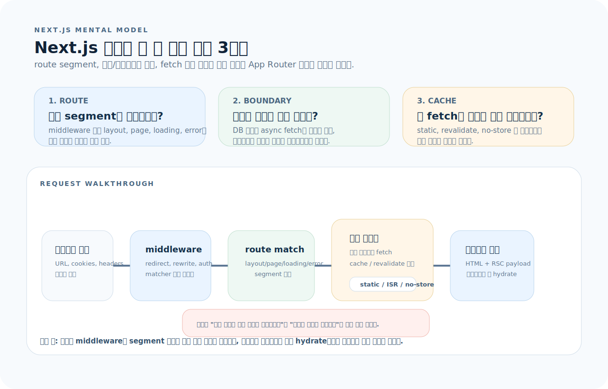
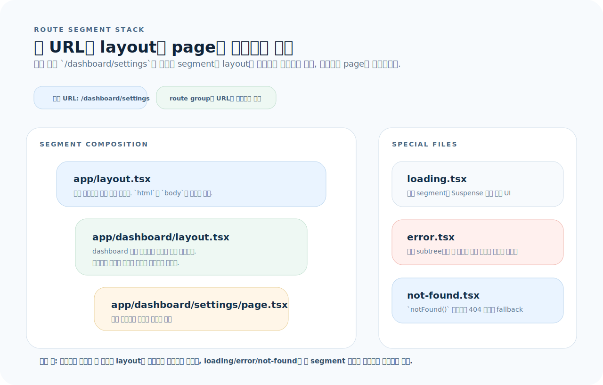
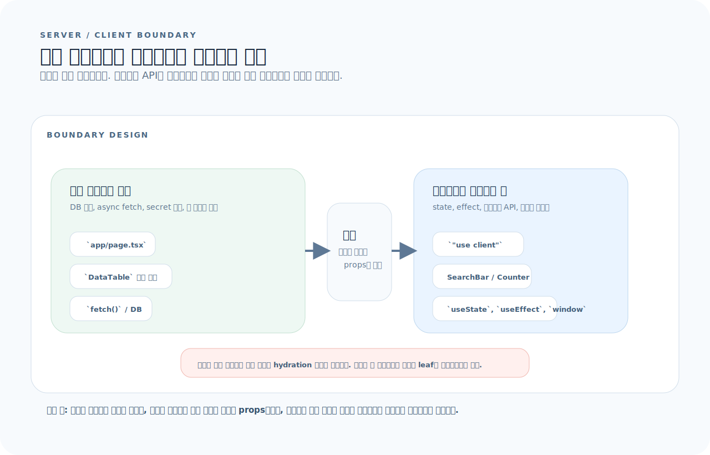
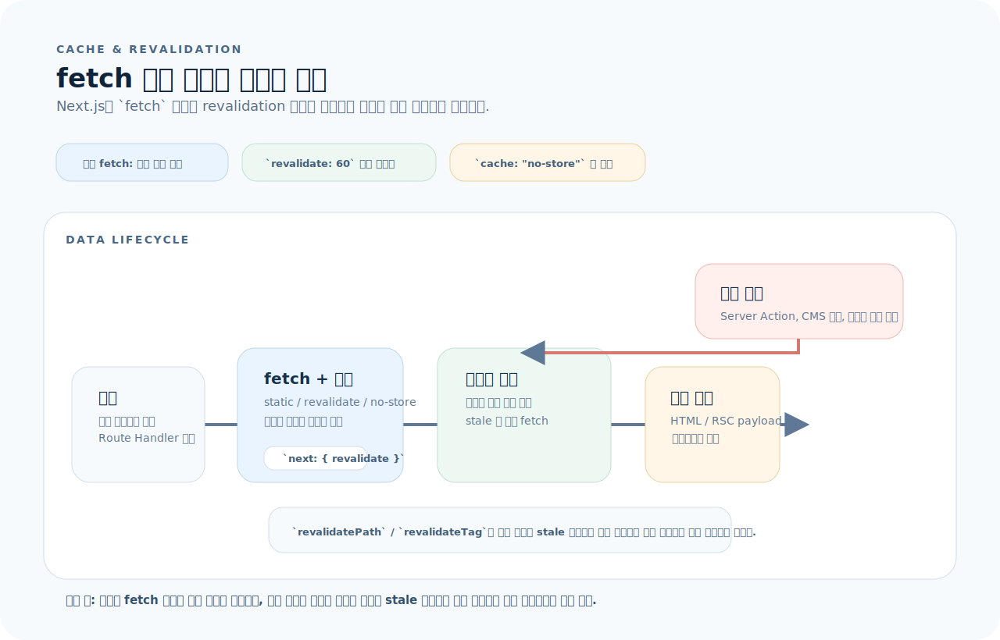

# Next.js 완전 가이드

Next.js는 React 위에 파일 기반 라우팅, 서버/클라이언트 분리, 빌드 규약을 강하게 얹는 풀스택 프레임워크다. App Router(Next.js 13+)를 기준으로, 이 글을 읽으면 프로젝트 구조부터 서버 컴포넌트, 데이터 페칭, 미들웨어까지 Next.js를 실무에서 다룰 수 있다.

---

## 1. Next.js를 읽는 기준

Next.js는 파일 목록으로 외우기보다, 요청 하나가 어떤 route segment를 통과하고 어디서 서버 렌더와 클라이언트 하이드레이션으로 갈라지는지 먼저 보는 편이 훨씬 빠르다.



- URL은 middleware와 route segment 매칭을 거쳐 layout/page 체인으로 조립된다.
- 서버 컴포넌트가 기본이며, 인터랙션이 필요한 부분만 작은 클라이언트 섬으로 잘라 넣는다.
- `fetch` 캐시 정책과 `revalidate`가 렌더링 모드를 사실상 결정한다.

먼저 아래 세 질문으로 읽으면 된다.

1. 이 요청은 어떤 segment, layout, 특수 파일을 통과해 최종 화면이 되는가?
2. 이 컴포넌트는 서버에 두어야 하는가, 클라이언트에 두어야 하는가?
3. 이 데이터는 정적, 재검증, 매 요청 중 어떤 캐시 전략이 맞는가?

---

## 2. 프로젝트 구조

```
app/
├── layout.tsx            # 루트 레이아웃
├── page.tsx              # / (홈)
├── loading.tsx           # 로딩 UI
├── error.tsx             # 에러 UI
├── not-found.tsx         # 404 UI
├── globals.css
├── dashboard/
│   ├── layout.tsx        # /dashboard 레이아웃
│   ├── page.tsx          # /dashboard
│   └── settings/
│       └── page.tsx      # /dashboard/settings
├── blog/
│   ├── page.tsx          # /blog
│   └── [slug]/
│       └── page.tsx      # /blog/:slug (동적 라우트)
├── api/
│   └── users/
│       └── route.ts      # API Route: /api/users
public/
middleware.ts
next.config.ts
```

---

## 3. 라우팅

App Router는 폴더 트리보다, 한 URL이 어떤 segment 파일들을 쌓아 올리는지로 읽는 편이 더 정확하다.



- `layout.tsx`는 매칭된 segment마다 바깥에서 안쪽으로 감싼다.
- `page.tsx`가 실제 화면 콘텐츠를 제공하고, `loading.tsx`와 `error.tsx`는 해당 segment 경계에 붙는다.
- route group은 구조를 나누되 URL에는 나타나지 않는다.

### 파일 기반 라우팅

| 파일 | 역할 |
|------|------|
| `page.tsx` | URL에 매핑되는 페이지 (이 파일이 있어야 라우트가 활성화) |
| `layout.tsx` | 하위 라우트에 공유되는 껍데기 (상태 유지) |
| `loading.tsx` | Suspense 경계 — 자동 로딩 UI |
| `error.tsx` | ErrorBoundary — 자동 에러 UI |
| `not-found.tsx` | 404 페이지 |
| `route.ts` | API Route (GET, POST 등) |

### 동적 라우트

```
app/blog/[slug]/page.tsx        → /blog/hello-world
app/shop/[...slug]/page.tsx     → /shop/a/b/c (catch-all)
app/shop/[[...slug]]/page.tsx   → /shop 또는 /shop/a/b (optional catch-all)
```

```tsx
// app/blog/[slug]/page.tsx
type Props = { params: Promise<{ slug: string }> };

export default async function BlogPost({ params }: Props) {
  const { slug } = await params;
  // slug를 사용해 데이터 조회
  return <article>...</article>;
}
```

### 라우트 그룹

폴더 이름을 `(이름)`으로 감싸면 URL에 영향 없이 라우트를 정리할 수 있다.

```
app/
├── (marketing)/
│   ├── layout.tsx       # 마케팅 전용 레이아웃
│   ├── page.tsx         # /
│   └── about/page.tsx   # /about
├── (app)/
│   ├── layout.tsx       # 앱 전용 레이아웃 (인증된 사용자)
│   └── dashboard/page.tsx  # /dashboard
```

---

## 4. 서버 컴포넌트 vs 클라이언트 컴포넌트

App Router의 핵심은 "페이지 전체를 클라이언트로 보내지 말고, 인터랙션이 필요한 부분만 클라이언트로 분리한다"는 데 있다.



- 서버 컴포넌트는 DB 접근과 async fetch를 담당하고, 결과를 직렬화 가능한 props로 넘긴다.
- 클라이언트 컴포넌트는 state, effect, 브라우저 API, 이벤트 핸들러를 담당한다.
- 경계를 크게 잡을수록 번들이 커지고 hydration 비용이 늘어나므로 가능한 한 작게 유지한다.

### 기본 규칙

```
서버 컴포넌트 (기본)          클라이언트 컴포넌트
─────────────────          ──────────────────
"use client" 없음            "use client" 선언
DB 직접 접근 가능              브라우저 API 사용
async/await 가능              useState/useEffect 사용
번들에 포함 안 됨              번들에 포함
이벤트 핸들러 불가             onClick 등 사용
```

```tsx
// ✅ 서버 컴포넌트 (기본)
import { db } from "@/lib/db";

export default async function UserList() {
  const users = await db.user.findMany();
  return (
    <ul>
      {users.map(u => <li key={u.id}>{u.name}</li>)}
    </ul>
  );
}
```

```tsx
// ✅ 클라이언트 컴포넌트
"use client";
import { useState } from "react";

export default function Counter() {
  const [count, setCount] = useState(0);
  return <button onClick={() => setCount(c => c + 1)}>{count}</button>;
}
```

### 컴포넌트 경계 설계

```tsx
// ✅ 서버 컴포넌트 안에 클라이언트 컴포넌트를 삽입
// app/dashboard/page.tsx (서버)
import { SearchBar } from "@/components/search-bar"; // "use client"

export default async function Dashboard() {
  const data = await fetchData();
  return (
    <div>
      <h1>{data.title}</h1>
      <SearchBar />           {/* 인터랙션이 필요한 부분만 클라이언트 */}
      <DataTable rows={data.rows} />  {/* 서버 컴포넌트 */}
    </div>
  );
}
```

> **핵심**: 클라이언트 영역을 **최소한**으로 유지한다. 전체 페이지가 아닌, 인터랙션이 필요한 컴포넌트만 `"use client"`로 분리한다.

---

## 5. layout.tsx

```tsx
// app/layout.tsx — 루트 레이아웃 (필수)
import type { Metadata } from "next";

export const metadata: Metadata = {
  title: "My App",
  description: "앱 설명",
};

export default function RootLayout({ children }: { children: React.ReactNode }) {
  return (
    <html lang="ko">
      <body>
        <header><nav>...</nav></header>
        <main>{children}</main>
        <footer>...</footer>
      </body>
    </html>
  );
}
```

```tsx
// app/dashboard/layout.tsx — 중첩 레이아웃
export default function DashboardLayout({ children }: { children: React.ReactNode }) {
  return (
    <div className="flex">
      <aside className="w-64">사이드바</aside>
      <section className="flex-1">{children}</section>
    </div>
  );
}
```

레이아웃 특징:
- 라우트 전환 시 **상태가 유지**된다 (리렌더링 안 됨)
- 하위 라우트에 **자동 적용**된다
- `<html>`과 `<body>`는 **루트 레이아웃에만** 존재

---

## 6. 데이터 페칭

Next.js 데이터 페칭은 단순히 `fetch`를 어디서 호출하느냐의 문제가 아니라, 결과를 얼마나 오래 캐시하고 언제 다시 무효화하느냐의 문제다.



- 기본 `fetch()`는 정적으로 캐시될 수 있고, `revalidate`를 주면 ISR처럼 주기 재검증된다.
- `cache: "no-store"`는 매 요청마다 새로 가져오는 동적 렌더링으로 간다.
- Server Action이나 관리 화면 변경 이후에는 `revalidatePath`나 `revalidateTag`로 관련 경로를 다시 stale 처리한다.

### 서버 컴포넌트에서 직접 fetch

```tsx
// app/posts/page.tsx
async function getPosts() {
  const res = await fetch("https://api.example.com/posts", {
    next: { revalidate: 60 },  // ISR: 60초마다 재검증
  });
  if (!res.ok) throw new Error("Failed to fetch");
  return res.json();
}

export default async function PostsPage() {
  const posts = await getPosts();
  return (
    <ul>
      {posts.map((p: any) => <li key={p.id}>{p.title}</li>)}
    </ul>
  );
}
```

### 캐싱 전략

```tsx
// 정적 (빌드 시 캐시, 기본값)
fetch("https://api.example.com/data");

// ISR (주기적 재검증)
fetch("https://api.example.com/data", { next: { revalidate: 60 } });

// 동적 (매 요청마다)
fetch("https://api.example.com/data", { cache: "no-store" });
```

### 페이지 레벨 동적 설정

```tsx
// 이 페이지는 항상 동적으로 렌더링
export const dynamic = "force-dynamic";

// 이 페이지는 빌드 시 정적 생성
export const dynamic = "force-static";
```

---

## 7. Server Actions

서버에서 실행되는 함수를 클라이언트에서 직접 호출할 수 있다.

```tsx
// app/actions.ts
"use server";

import { db } from "@/lib/db";
import { revalidatePath } from "next/cache";

export async function createPost(formData: FormData) {
  const title = formData.get("title") as string;
  const content = formData.get("content") as string;

  await db.post.create({ data: { title, content } });
  revalidatePath("/posts");
}
```

```tsx
// app/posts/new/page.tsx
import { createPost } from "@/app/actions";

export default function NewPost() {
  return (
    <form action={createPost}>
      <input name="title" required />
      <textarea name="content" required />
      <button type="submit">작성</button>
    </form>
  );
}
```

### 클라이언트에서 Server Action 호출

```tsx
"use client";
import { useTransition } from "react";
import { createPost } from "@/app/actions";

export function CreateButton() {
  const [isPending, startTransition] = useTransition();

  const handleClick = () => {
    const formData = new FormData();
    formData.set("title", "새 글");
    formData.set("content", "내용");
    startTransition(() => createPost(formData));
  };

  return (
    <button onClick={handleClick} disabled={isPending}>
      {isPending ? "저장 중..." : "저장"}
    </button>
  );
}
```

---

## 8. API Routes

```tsx
// app/api/users/route.ts
import { NextRequest, NextResponse } from "next/server";

export async function GET() {
  const users = await db.user.findMany();
  return NextResponse.json(users);
}

export async function POST(request: NextRequest) {
  const body = await request.json();
  const user = await db.user.create({ data: body });
  return NextResponse.json(user, { status: 201 });
}
```

```tsx
// 동적 API Route: app/api/users/[id]/route.ts
type Params = { params: Promise<{ id: string }> };

export async function GET(_: NextRequest, { params }: Params) {
  const { id } = await params;
  const user = await db.user.findUnique({ where: { id } });
  if (!user) return NextResponse.json({ error: "Not found" }, { status: 404 });
  return NextResponse.json(user);
}
```

---

## 9. Metadata & SEO

```tsx
// 정적 메타데이터
export const metadata: Metadata = {
  title: "블로그",
  description: "기술 블로그",
  openGraph: {
    title: "블로그",
    description: "기술 블로그",
    images: ["/og.png"],
  },
};

// 동적 메타데이터
export async function generateMetadata({ params }: Props): Promise<Metadata> {
  const { slug } = await params;
  const post = await getPost(slug);
  return {
    title: post.title,
    description: post.excerpt,
    openGraph: { images: [post.coverImage] },
  };
}
```

---

## 10. 미들웨어

```tsx
// middleware.ts (프로젝트 루트)
import { NextResponse } from "next/server";
import type { NextRequest } from "next/server";

export function middleware(request: NextRequest) {
  const token = request.cookies.get("token")?.value;

  // 인증되지 않은 사용자 → 로그인 페이지로
  if (!token && request.nextUrl.pathname.startsWith("/dashboard")) {
    return NextResponse.redirect(new URL("/login", request.url));
  }

  return NextResponse.next();
}

export const config = {
  matcher: ["/dashboard/:path*", "/settings/:path*"],
};
```

---

## 11. loading.tsx / error.tsx / not-found.tsx

```tsx
// app/dashboard/loading.tsx
export default function Loading() {
  return <div className="animate-pulse">로딩 중...</div>;
}

// app/dashboard/error.tsx
"use client"; // 에러 바운더리는 반드시 클라이언트
export default function Error({ error, reset }: { error: Error; reset: () => void }) {
  return (
    <div>
      <h2>문제가 발생했습니다</h2>
      <p>{error.message}</p>
      <button onClick={reset}>다시 시도</button>
    </div>
  );
}

// app/not-found.tsx
export default function NotFound() {
  return (
    <div>
      <h2>페이지를 찾을 수 없습니다</h2>
      <a href="/">홈으로 돌아가기</a>
    </div>
  );
}
```

---

## 12. 정적 생성 (generateStaticParams)

```tsx
// app/blog/[slug]/page.tsx
export async function generateStaticParams() {
  const posts = await getAllPosts();
  return posts.map((post) => ({ slug: post.slug }));
}

export default async function BlogPost({ params }: Props) {
  const { slug } = await params;
  const post = await getPost(slug);
  return <article>{post.content}</article>;
}
```

---

## 13. 이미지 최적화

```tsx
import Image from "next/image";

// 로컬 이미지
import heroImage from "@/public/hero.png";

export default function Hero() {
  return (
    <Image
      src={heroImage}
      alt="히어로 이미지"
      priority             // LCP 이미지는 priority
      placeholder="blur"   // 블러 플레이스홀더
    />
  );
}

// 외부 이미지
<Image
  src="https://cdn.example.com/photo.jpg"
  alt="설명"
  width={800}
  height={600}
/>
```

```ts
// next.config.ts — 외부 이미지 도메인 설정
const config = {
  images: {
    remotePatterns: [
      { protocol: "https", hostname: "cdn.example.com" },
    ],
  },
};
export default config;
```

---

## 14. 환경 변수

```bash
# .env.local
DATABASE_URL="postgresql://..."         # 서버에서만 접근
NEXT_PUBLIC_API_URL="https://api.com"   # 클라이언트에서도 접근
```

| 접두사 | 서버 | 클라이언트 |
|--------|------|-----------|
| 없음 | ✅ | ❌ |
| `NEXT_PUBLIC_` | ✅ | ✅ |

> 비밀 키(DB URL, API Secret)는 절대 `NEXT_PUBLIC_` 접두사를 붙이지 않는다.

---

## 15. 자주 하는 실수

| 실수 | 원인과 해결 |
|------|-------------|
| 서버 컴포넌트에서 `useState` | 상태가 필요하면 `"use client"` 선언 |
| 서버 컴포넌트에서 `window`, `document` | 브라우저 API는 클라이언트 전용 |
| 전체 페이지를 `"use client"` | 인터랙션 부분만 클라이언트로 분리 |
| `layout.tsx`와 `page.tsx` 혼동 | layout은 공유 껍데기, page는 콘텐츠 |
| API 키를 `NEXT_PUBLIC_`에 노출 | 서버 전용 키는 접두사 없이 |
| `fetch` 캐시 미이해 | 기본 정적, `no-store`로 동적 전환 |
| `error.tsx`에 `"use client"` 누락 | 에러 바운더리는 반드시 클라이언트 |

---

## 16. 빠른 참조

```bash
# 명령어
npx create-next-app@latest     # 프로젝트 생성
next dev                       # 개발 서버
next build                     # 프로덕션 빌드
next start                     # 빌드 결과 실행
```

```
# 파일 규약
page.tsx        → 페이지
layout.tsx      → 레이아웃
loading.tsx     → 로딩 UI
error.tsx       → 에러 UI
not-found.tsx   → 404
route.ts        → API Route
middleware.ts   → 미들웨어 (루트)

# 라우트 패턴
[slug]          → 동적 세그먼트
[...slug]       → catch-all
[[...slug]]     → optional catch-all
(group)         → 라우트 그룹 (URL 무영향)
```
