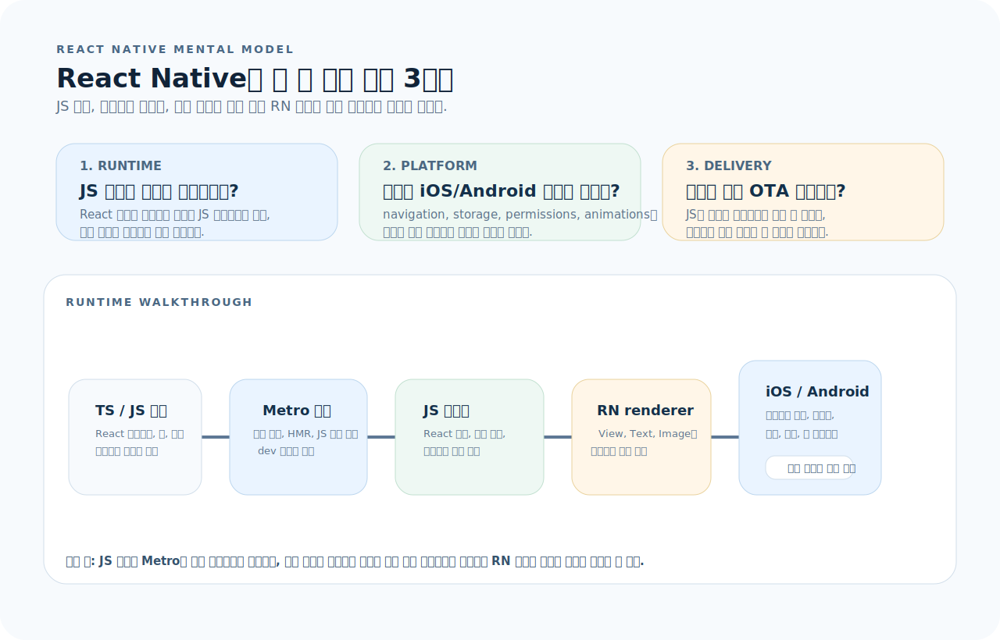
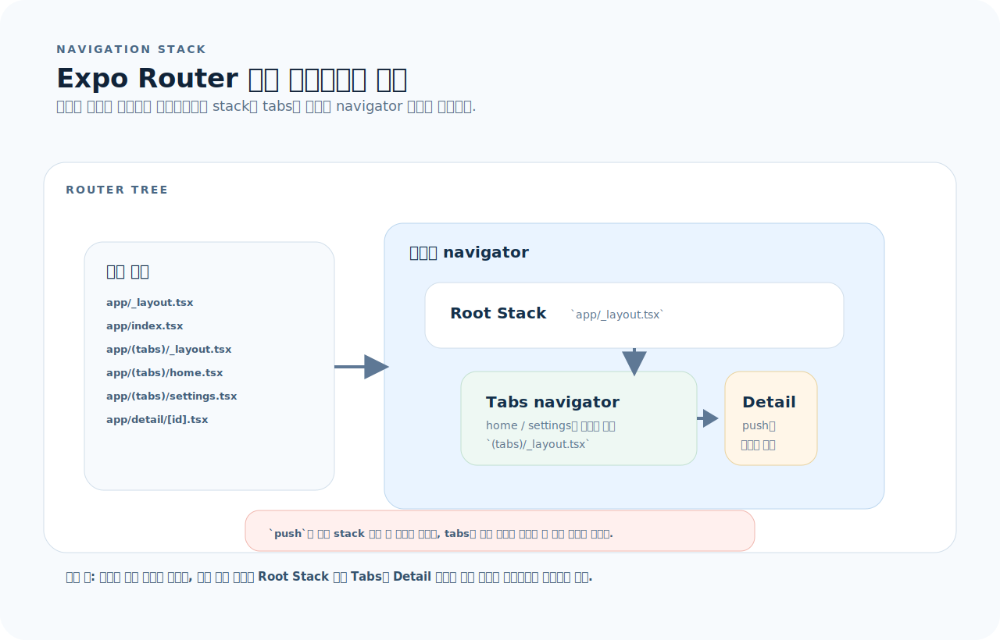
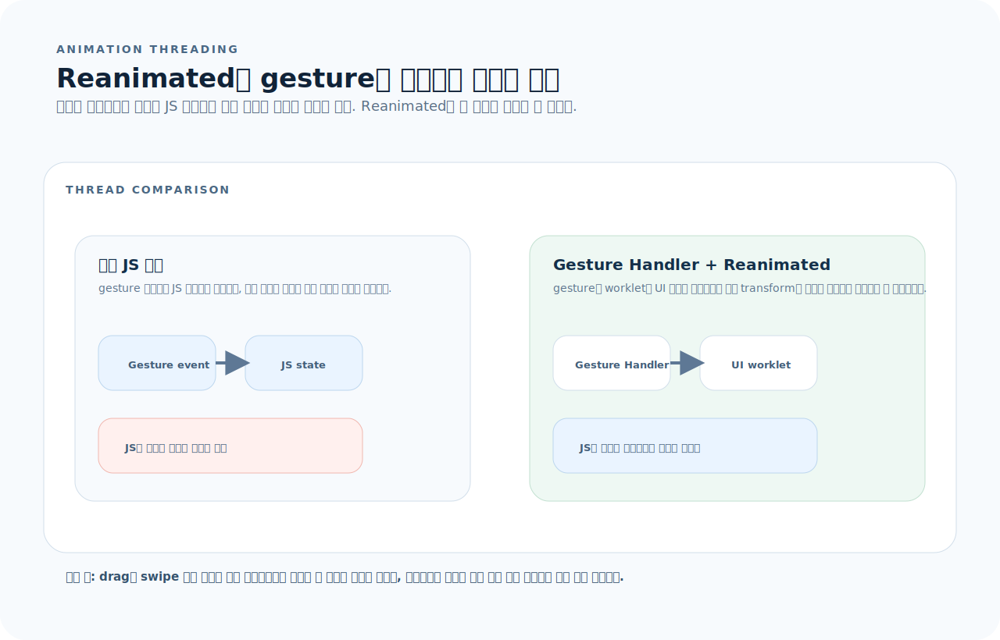
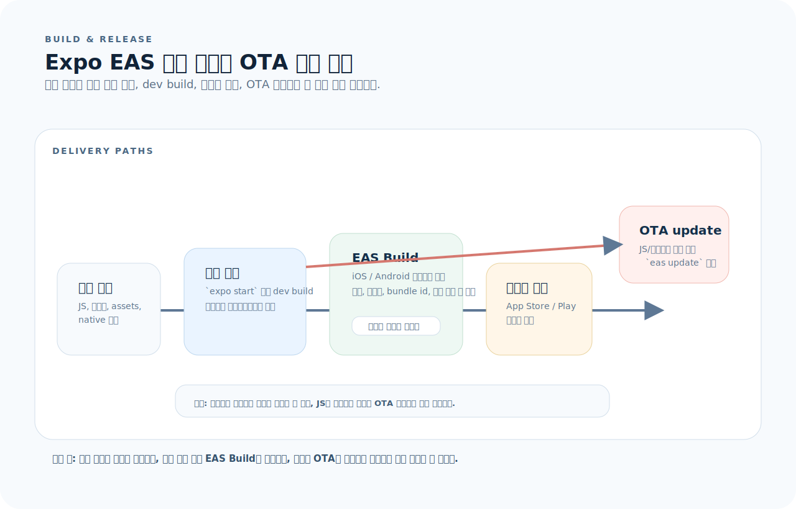

# React Native 완전 가이드

React Native(RN)는 React로 iOS/Android 네이티브 앱을 만드는 프레임워크다. 화면은 React로 작성하지만, 실행·배포·디버깅은 **네이티브 앱의 제약**을 그대로 받는다. 이 글을 읽으면 프로젝트 구조, 핵심 컴포넌트, 내비게이션, 성능 최적화까지 RN 개발에 필요한 전체 그림을 잡을 수 있다.

---

## 1. React Native를 읽는 기준

React Native는 "React 문법으로 앱을 만든다"는 감각만으로 읽으면 절반만 이해하게 된다. JS 코드가 어디서 실행되고, 어떤 부분이 네이티브 제약을 받고, 배포가 어떤 경로로 나가는지 먼저 잡는 편이 훨씬 빠르다.



- 앱 화면은 JS/TS로 작성하지만 최종 렌더 대상은 iOS/Android 네이티브 뷰다.
- 네비게이션, 애니메이션, 저장소, 빌드는 모두 네이티브 플랫폼 제약을 받는다.
- Expo와 EAS는 개발 서버, 빌드, OTA 업데이트 경로를 표준화해 준다.

먼저 아래 세 질문으로 읽으면 된다.

1. 이 코드는 JS 런타임, 네이티브 뷰, 빌드 설정 중 어디에 영향을 주는가?
2. 이 변경은 화면 전환, 성능, 배포 경로 중 어느 층의 문제인가?
3. 이 기능은 Expo 기본 기능으로 끝나는가, 아니면 네이티브 설정이나 새 빌드가 필요한가?

---

## 2. 프로젝트 구조

```
├── app/                    # Expo Router 기반 라우팅
│   ├── _layout.tsx         # 루트 레이아웃
│   ├── index.tsx           # 홈 화면
│   └── (tabs)/
│       ├── _layout.tsx     # 탭 내비게이션
│       ├── home.tsx
│       └── settings.tsx
├── components/
├── hooks/
├── lib/                    # API, 유틸리티
├── assets/                 # 이미지, 폰트
├── android/                # 네이티브 Android 설정
├── ios/                    # 네이티브 iOS 설정
├── app.json                # Expo 설정
├── babel.config.js
└── package.json
```

### Expo vs React Native CLI

| 항목 | Expo (권장) | RN CLI (Bare) |
|------|-------------|---------------|
| 셋업 | `npx create-expo-app` | `npx react-native init` |
| 네이티브 코드 접근 | `expo prebuild`로 필요 시 | 처음부터 가능 |
| OTA 업데이트 | EAS Update 내장 | 직접 구현 |
| 네이티브 모듈 | Expo Modules API | 직접 브릿지 |
| 추천 대상 | 대부분의 프로젝트 | 깊은 네이티브 커스텀 필요 시 |

---

## 3. 핵심 컴포넌트

RN은 웹 HTML 태그 대신 **네이티브 컴포넌트**를 사용한다.

```tsx
import { View, Text, Image, ScrollView, Pressable, TextInput } from "react-native";

export default function Profile() {
  return (
    <ScrollView style={{ flex: 1, padding: 16 }}>
      <Image
        source={{ uri: "https://example.com/avatar.jpg" }}
        style={{ width: 80, height: 80, borderRadius: 40 }}
      />
      <Text style={{ fontSize: 20, fontWeight: "bold" }}>홍길동</Text>
      <TextInput
        placeholder="상태 메시지"
        style={{ borderWidth: 1, borderColor: "#ccc", padding: 8, borderRadius: 8 }}
      />
      <Pressable
        onPress={() => console.log("pressed")}
        style={({ pressed }) => ({
          backgroundColor: pressed ? "#1d4ed8" : "#2563eb",
          padding: 12,
          borderRadius: 8,
          alignItems: "center",
        })}
      >
        <Text style={{ color: "white" }}>저장</Text>
      </Pressable>
    </ScrollView>
  );
}
```

### 웹 → RN 매핑

| 웹 | RN |
|----|----|
| `<div>` | `<View>` |
| `<p>`, `<span>` | `<Text>` |
| `` | `<Image>` |
| `<input>` | `<TextInput>` |
| `<button>` | `<Pressable>` |
| `<scroll>` | `<ScrollView>` |

> RN에는 CSS가 없다. **StyleSheet** 또는 인라인 스타일 객체를 사용한다.

---

## 4. 스타일링

### StyleSheet

```tsx
import { StyleSheet, View, Text } from "react-native";

export default function Card() {
  return (
    <View style={styles.card}>
      <Text style={styles.title}>제목</Text>
    </View>
  );
}

const styles = StyleSheet.create({
  card: {
    backgroundColor: "#fff",
    borderRadius: 12,
    padding: 16,
    // 그림자 (iOS)
    shadowColor: "#000",
    shadowOffset: { width: 0, height: 2 },
    shadowOpacity: 0.1,
    shadowRadius: 4,
    // 그림자 (Android)
    elevation: 3,
  },
  title: {
    fontSize: 18,
    fontWeight: "600",
    color: "#1a1a1a",
  },
});
```

### Flexbox (기본 레이아웃)

RN의 기본 `flexDirection`은 **`column`**이다 (웹은 `row`).

```tsx
// 수직 중앙 정렬
<View style={{ flex: 1, justifyContent: "center", alignItems: "center" }}>
  <Text>가운데</Text>
</View>

// 수평 배치
<View style={{ flexDirection: "row", gap: 8 }}>
  <View style={{ flex: 1, backgroundColor: "red" }} />
  <View style={{ flex: 2, backgroundColor: "blue" }} />
</View>
```

---

## 5. 내비게이션

RN 내비게이션은 "지금 어떤 화면이 보이느냐"보다, 어떤 navigator가 어떤 화면을 감싸고 있는지를 트리로 이해해야 덜 헷갈린다.



- 루트 `_layout.tsx`가 최상위 Stack을 만들고, 그 아래에 Tabs나 nested Stack이 들어간다.
- `router.push()`는 현재 stack 위에 새 화면을 올리고, `replace()`는 현재 항목을 교체한다.
- 파일 기반 구조를 쓰더라도 결국 런타임에서는 stack, tabs, modal 같은 navigator 계층으로 실행된다.

### Expo Router (파일 기반, 권장)

```tsx
// app/_layout.tsx
import { Stack } from "expo-router";

export default function RootLayout() {
  return (
    <Stack>
      <Stack.Screen name="index" options={{ title: "홈" }} />
      <Stack.Screen name="detail/[id]" options={{ title: "상세" }} />
    </Stack>
  );
}
```

```tsx
// app/(tabs)/_layout.tsx
import { Tabs } from "expo-router";

export default function TabLayout() {
  return (
    <Tabs>
      <Tabs.Screen name="home" options={{ title: "홈" }} />
      <Tabs.Screen name="settings" options={{ title: "설정" }} />
    </Tabs>
  );
}
```

```tsx
// 화면 이동
import { router } from "expo-router";

// push
router.push("/detail/123");

// replace (뒤로 가기 불가)
router.replace("/login");

// back
router.back();
```

### React Navigation (설정 기반)

```tsx
import { NavigationContainer } from "@react-navigation/native";
import { createNativeStackNavigator } from "@react-navigation/native-stack";

const Stack = createNativeStackNavigator();

export default function App() {
  return (
    <NavigationContainer>
      <Stack.Navigator>
        <Stack.Screen name="Home" component={HomeScreen} />
        <Stack.Screen name="Detail" component={DetailScreen} />
      </Stack.Navigator>
    </NavigationContainer>
  );
}

// 화면에서 이동
function HomeScreen({ navigation }) {
  return (
    <Pressable onPress={() => navigation.navigate("Detail", { id: 123 })}>
      <Text>상세보기</Text>
    </Pressable>
  );
}
```

---

## 6. 리스트 — FlatList

긴 리스트는 반드시 **FlatList**를 사용한다. `ScrollView`에 많은 아이템을 렌더하면 메모리 폭발.

```tsx
import { FlatList, Text, View } from "react-native";

type Item = { id: string; title: string };

export default function ItemList({ items }: { items: Item[] }) {
  return (
    <FlatList
      data={items}
      keyExtractor={(item) => item.id}
      renderItem={({ item }) => (
        <View style={{ padding: 16, borderBottomWidth: 1, borderColor: "#eee" }}>
          <Text>{item.title}</Text>
        </View>
      )}
      // 성능 최적화
      getItemLayout={(_, index) => ({
        length: 52,               // 아이템 높이 고정 시
        offset: 52 * index,
        index,
      })}
      windowSize={5}              // 화면 밖 렌더 영역 (기본 21 → 줄여서 메모리 절약)
      maxToRenderPerBatch={10}    // 배치당 렌더 수
      initialNumToRender={10}     // 초기 렌더 수
      removeClippedSubviews       // 화면 밖 뷰 제거 (Android)
    />
  );
}
```

### SectionList

```tsx
import { SectionList } from "react-native";

<SectionList
  sections={[
    { title: "A", data: ["Alice", "Alex"] },
    { title: "B", data: ["Bob", "Brian"] },
  ]}
  keyExtractor={(item, index) => item + index}
  renderItem={({ item }) => <Text>{item}</Text>}
  renderSectionHeader={({ section }) => <Text style={{ fontWeight: "bold" }}>{section.title}</Text>}
/>
```

---

## 7. 상태 관리와 데이터 페칭

### React Query (TanStack Query)

```tsx
import { useQuery, useMutation, useQueryClient } from "@tanstack/react-query";

function useUsers() {
  return useQuery({
    queryKey: ["users"],
    queryFn: () => fetch("/api/users").then(r => r.json()),
  });
}

function useCreateUser() {
  const queryClient = useQueryClient();
  return useMutation({
    mutationFn: (data: CreateUserDto) =>
      fetch("/api/users", { method: "POST", body: JSON.stringify(data) }),
    onSuccess: () => queryClient.invalidateQueries({ queryKey: ["users"] }),
  });
}
```

### Zustand (가벼운 전역 상태)

```tsx
import { create } from "zustand";

type AuthStore = {
  token: string | null;
  setToken: (token: string | null) => void;
};

const useAuthStore = create<AuthStore>((set) => ({
  token: null,
  setToken: (token) => set({ token }),
}));
```

---

## 8. 플랫폼별 코드

```tsx
import { Platform, StyleSheet } from "react-native";

// 조건 분기
const padding = Platform.OS === "ios" ? 20 : 16;

// Platform.select
const styles = StyleSheet.create({
  container: {
    ...Platform.select({
      ios: { shadowColor: "#000", shadowOpacity: 0.1 },
      android: { elevation: 3 },
    }),
  },
});

// 파일 기반 분리
// Button.ios.tsx  → iOS에서 자동 로드
// Button.android.tsx → Android에서 자동 로드
```

---

## 9. 로컬 저장소

```tsx
// AsyncStorage — 간단한 키-값 저장
import AsyncStorage from "@react-native-async-storage/async-storage";

await AsyncStorage.setItem("token", "abc123");
const token = await AsyncStorage.getItem("token");
await AsyncStorage.removeItem("token");

// SecureStore (Expo) — 민감한 데이터
import * as SecureStore from "expo-secure-store";

await SecureStore.setItemAsync("accessToken", token);
const stored = await SecureStore.getItemAsync("accessToken");
```

---

## 10. 애니메이션

RN 애니메이션은 API 선택이 곧 성능 선택이다. 특히 gesture 기반 인터랙션은 JS 스레드가 아니라 UI 스레드에 가까운 경로를 써야 끊김이 줄어든다.



- 일반 JS 기반 상태 업데이트는 JS 스레드가 바쁠 때 프레임 드랍이 생기기 쉽다.
- Reanimated worklet과 Gesture Handler는 UI 스레드 쪽에서 더 직접적으로 움직임을 계산해 드래그와 스프링이 안정적이다.
- 복잡한 인터랙션일수록 `Animated`와 Reanimated를 섞기보다 한 경로로 통일하는 편이 낫다.

### Reanimated (권장)

```tsx
import Animated, {
  useSharedValue,
  useAnimatedStyle,
  withSpring,
} from "react-native-reanimated";

export default function AnimatedBox() {
  const offset = useSharedValue(0);

  const animatedStyle = useAnimatedStyle(() => ({
    transform: [{ translateX: offset.value }],
  }));

  return (
    <>
      <Animated.View style={[styles.box, animatedStyle]} />
      <Pressable onPress={() => { offset.value = withSpring(offset.value + 50); }}>
        <Text>이동</Text>
      </Pressable>
    </>
  );
}
```

### Gesture Handler + Reanimated

```tsx
import { Gesture, GestureDetector } from "react-native-gesture-handler";
import Animated, { useSharedValue, useAnimatedStyle, withSpring } from "react-native-reanimated";

export default function DraggableBox() {
  const translateX = useSharedValue(0);
  const translateY = useSharedValue(0);

  const pan = Gesture.Pan()
    .onUpdate((e) => {
      translateX.value = e.translationX;
      translateY.value = e.translationY;
    })
    .onEnd(() => {
      translateX.value = withSpring(0);
      translateY.value = withSpring(0);
    });

  const style = useAnimatedStyle(() => ({
    transform: [
      { translateX: translateX.value },
      { translateY: translateY.value },
    ],
  }));

  return (
    <GestureDetector gesture={pan}>
      <Animated.View style={[{ width: 80, height: 80, backgroundColor: "blue" }, style]} />
    </GestureDetector>
  );
}
```

---

## 11. 디버깅

```bash
# Metro 번들러
npx expo start               # Expo
npx react-native start       # CLI

# 캐시 초기화
npx expo start --clear
npx react-native start --reset-cache

# 네이티브 빌드 정리
cd android && ./gradlew clean && cd ..
cd ios && pod install && cd ..
```

### 디버깅 도구

| 도구 | 용도 |
|------|------|
| React DevTools | 컴포넌트 트리, props/state 확인 |
| Flipper | 네트워크, 레이아웃, DB 검사 |
| `console.log` | Metro 번들러 터미널에 출력 |
| Xcode / Android Studio | 네이티브 크래시 로그 |

---

## 12. 빌드와 배포

RN 배포는 "코드 수정 = 바로 배포"가 아니다. JS만 바뀐 것인지, 네이티브 설정이 바뀐 것인지에 따라 경로가 달라진다.



- JS/스타일 수정만이면 `eas update` 같은 OTA 경로로 배포할 수 있다.
- 네이티브 모듈, 권한, 앱 아이콘, `app.json`의 식별자 변경은 새 빌드가 필요하다.
- 개발 단계에서는 `expo start`와 dev build로 확인하고, 릴리스는 EAS Build와 스토어 제출로 나간다.

### Expo EAS

```bash
# 설치
npm install -g eas-cli
eas login

# 개발 빌드
eas build --platform ios --profile development

# 프로덕션 빌드
eas build --platform all --profile production

# 앱 스토어 배포
eas submit --platform ios
eas submit --platform android

# OTA 업데이트 (JS만 변경 시)
eas update --branch production
```

### app.json 주요 설정

```json
{
  "expo": {
    "name": "MyApp",
    "slug": "myapp",
    "version": "1.0.0",
    "ios": {
      "bundleIdentifier": "com.example.myapp",
      "buildNumber": "1"
    },
    "android": {
      "package": "com.example.myapp",
      "versionCode": 1
    }
  }
}
```

---

## 13. 자주 하는 실수

| 실수 | 원인과 해결 |
|------|-------------|
| `ScrollView`에 긴 리스트 | `FlatList` / `SectionList` 사용 |
| 웹 CSS 그대로 적용 | RN은 Flexbox만 (기본 `column`), 단위 없는 숫자 사용 |
| 인라인 함수로 리렌더 폭발 | `useCallback`, `React.memo` 적용 |
| `key` 누락 또는 index 사용 | 고유 ID를 `keyExtractor`에 전달 |
| 네이티브 변경 후 캐시 미정리 | `gradlew clean`, `pod install` 후 재빌드 |
| Animated API vs Reanimated 혼용 | Reanimated로 통일 (UI 스레드 실행) |
| Android/iOS 차이 무시 | `Platform.OS`로 분기, 두 플랫폼 테스트 |

---

## 14. 빠른 참조

```bash
# Expo 명령어
npx create-expo-app myapp
npx expo start
eas build --platform all
eas update --branch production
```

```tsx
// 핵심 import
import { View, Text, Image, FlatList, Pressable,
         TextInput, ScrollView, StyleSheet, Platform } from "react-native";

// 내비게이션 (Expo Router)
import { router } from "expo-router";
router.push("/detail/123");

// 스타일
StyleSheet.create({ ... })

// 리스트
<FlatList data={[]} keyExtractor={i => i.id} renderItem={({ item }) => ...} />

// 애니메이션 (Reanimated)
useSharedValue / useAnimatedStyle / withSpring / withTiming
```
