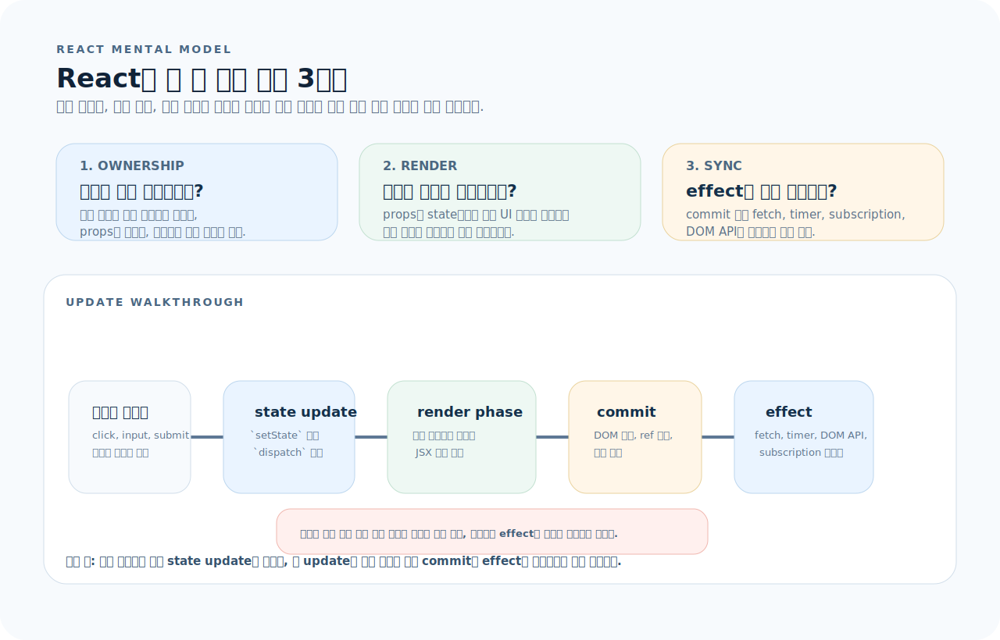
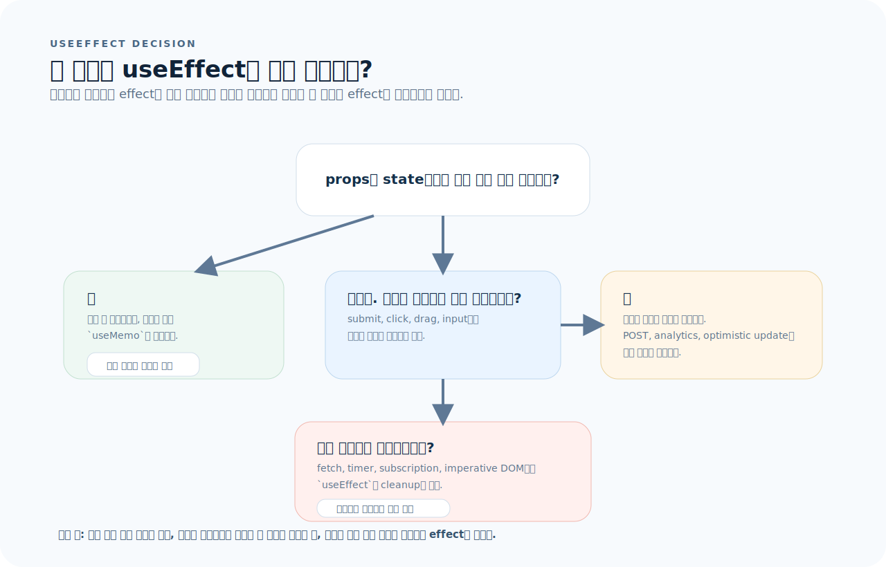
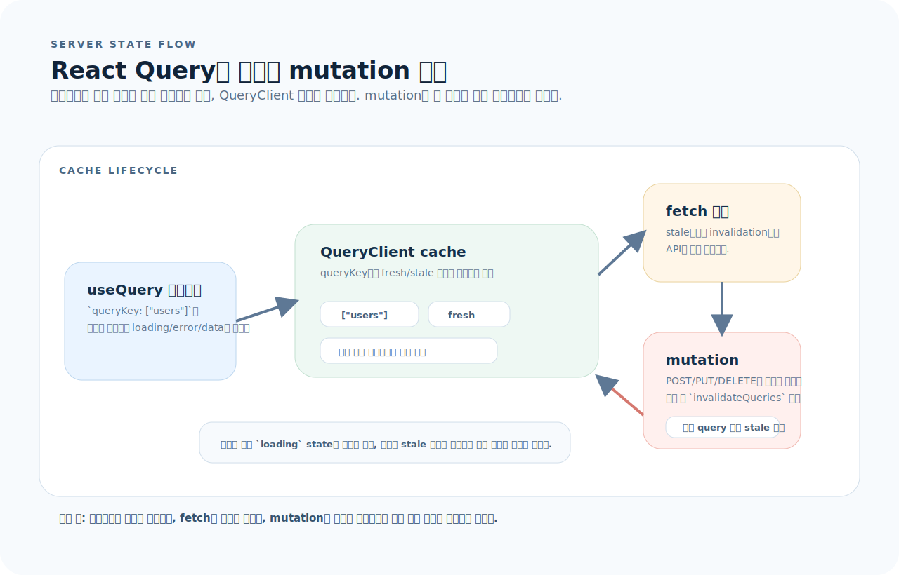
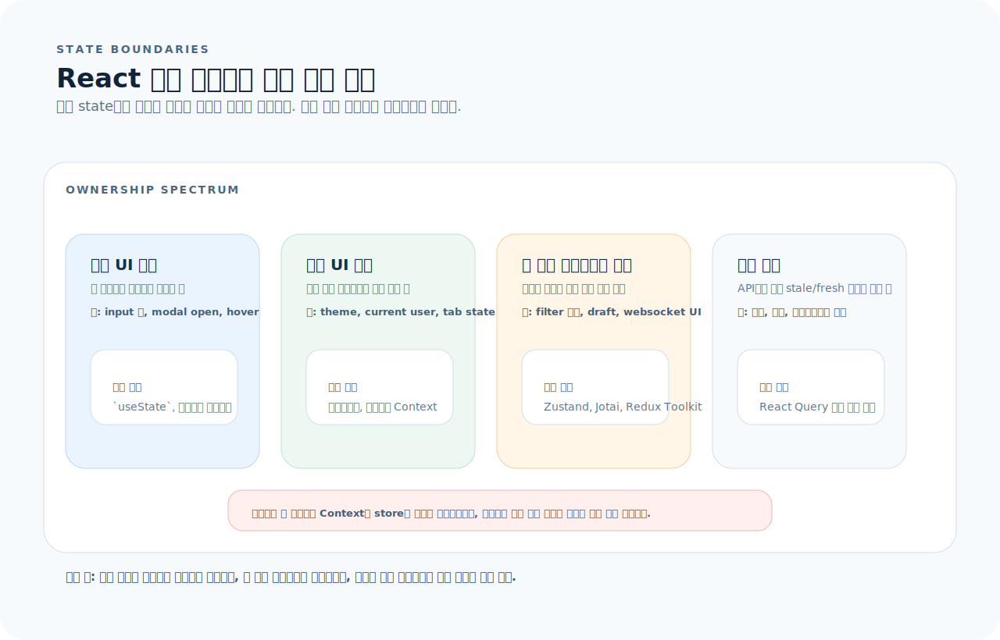

# React 완전 가이드

React는 UI를 **컴포넌트 트리**로 구성하는 라이브러리다. 문법보다 먼저 "상태는 어디에 있어야 하고, 어떤 컴포넌트가 어떤 책임을 가지는가"를 이해해야 한다. 이 글을 읽으면 컴포넌트 설계, 훅, 상태 관리, 성능 최적화까지 React를 실무 수준으로 다룰 수 있다.

---

## 1. React를 읽는 기준

React는 훅 목록보다, 이벤트 하나가 컴포넌트 트리 안에서 어떻게 상태를 바꾸고 다시 렌더를 일으키는지 먼저 보는 편이 훨씬 빠르다.



- 상태는 누가 소유하는지 먼저 정하고, props는 아래로 내린다.
- 렌더는 props와 state만으로 UI를 계산하는 순수 단계로 유지한다.
- effect는 commit 이후에 외부 시스템과 동기화할 때만 쓴다.

먼저 아래 세 질문으로 읽으면 된다.

1. 이 값은 어떤 컴포넌트가 소유해야 하고, 어디까지 props로 내려야 하는가?
2. 이 로직은 렌더 중 계산, 이벤트 핸들러, effect 중 어디에 있어야 하는가?
3. 이 데이터는 로컬 UI 상태인가, 여러 컴포넌트가 공유하는 클라이언트 상태인가, 서버 상태인가?

---

## 2. 컴포넌트

### 함수 컴포넌트

```tsx
type ButtonProps = {
  label: string;
  variant?: "primary" | "secondary";
  onClick: () => void;
};

function Button({ label, variant = "primary", onClick }: ButtonProps) {
  return (
    <button className={`btn btn-${variant}`} onClick={onClick}>
      {label}
    </button>
  );
}
```

### children

```tsx
function Card({ title, children }: { title: string; children: React.ReactNode }) {
  return (
    <div className="card">
      <h2>{title}</h2>
      <div>{children}</div>
    </div>
  );
}

// 사용
<Card title="알림">
  <p>새로운 메시지가 있습니다.</p>
</Card>
```

### 조건부 렌더링

```tsx
function Status({ isOnline }: { isOnline: boolean }) {
  return (
    <div>
      {isOnline ? <span className="green">온라인</span> : <span className="gray">오프라인</span>}
      {isOnline && <p>현재 활동 중</p>}
    </div>
  );
}
```

### 리스트 렌더링

```tsx
function UserList({ users }: { users: User[] }) {
  return (
    <ul>
      {users.map((user) => (
        <li key={user.id}>{user.name}</li>   {/* key는 고유 ID */}
      ))}
    </ul>
  );
}
```

> **key에 배열 인덱스를 쓰지 않는다.** 순서가 변하면 React가 요소를 잘못 재사용하여 상태가 꼬인다.

---

## 3. useState

```tsx
const [count, setCount] = useState(0);

// 직접 값
setCount(5);

// 이전 값 기반 (함수 업데이트 — 안전한 방식)
setCount(prev => prev + 1);
```

### 객체/배열 상태

```tsx
const [user, setUser] = useState({ name: "", email: "" });

// ✅ 불변 업데이트
setUser(prev => ({ ...prev, name: "홍길동" }));

const [items, setItems] = useState<string[]>([]);

// 추가
setItems(prev => [...prev, "새 항목"]);
// 삭제
setItems(prev => prev.filter(item => item !== "대상"));
// 수정
setItems(prev => prev.map(item => item === "old" ? "new" : item));
```

---

## 4. useEffect

`useEffect`는 **외부 시스템과의 동기화**용이다. 상태 계산에 쓰지 않는다.



- props와 state만으로 계산 가능한 값은 렌더 중에 계산하거나 필요할 때만 `useMemo`를 쓴다.
- 버튼 클릭, 제출 같은 사용자 이벤트가 직접 시작하는 작업은 이벤트 핸들러에 둔다.
- fetch, timer, subscription, imperative DOM처럼 외부 시스템과 맞물릴 때만 `useEffect`와 cleanup을 둔다.

```tsx
// API 호출
useEffect(() => {
  const controller = new AbortController();

  async function fetchData() {
    const res = await fetch("/api/users", { signal: controller.signal });
    const data = await res.json();
    setUsers(data);
  }
  fetchData();

  return () => controller.abort();   // cleanup
}, []);  // 마운트 시 한 번

// DOM 조작
useEffect(() => {
  document.title = `(${count}) 알림`;
}, [count]);  // count 변경 시

// 이벤트 리스너
useEffect(() => {
  function handleResize() { setWidth(window.innerWidth); }
  window.addEventListener("resize", handleResize);
  return () => window.removeEventListener("resize", handleResize);
}, []);
```

### useEffect가 필요 없는 경우

```tsx
// ❌ effect로 파생 상태 계산
const [items, setItems] = useState<Item[]>([]);
const [filtered, setFiltered] = useState<Item[]>([]);

useEffect(() => {
  setFiltered(items.filter(i => i.active));   // 불필요한 리렌더 유발
}, [items]);

// ✅ 렌더 중에 계산
const filtered = items.filter(i => i.active);

// ✅ 비용이 큰 계산은 useMemo
const filtered = useMemo(() => items.filter(i => i.active), [items]);
```

---

## 5. useRef

```tsx
// DOM 접근
const inputRef = useRef<HTMLInputElement>(null);

function handleClick() {
  inputRef.current?.focus();
}

<input ref={inputRef} />

// 리렌더 없이 값 유지
const renderCount = useRef(0);
renderCount.current += 1;  // 리렌더 트리거하지 않음
```

---

## 6. useReducer

복잡한 상태 로직을 하나의 함수로 관리한다.

```tsx
type State = { count: number; step: number };
type Action =
  | { type: "increment" }
  | { type: "decrement" }
  | { type: "setStep"; payload: number }
  | { type: "reset" };

function reducer(state: State, action: Action): State {
  switch (action.type) {
    case "increment": return { ...state, count: state.count + state.step };
    case "decrement": return { ...state, count: state.count - state.step };
    case "setStep":   return { ...state, step: action.payload };
    case "reset":     return { count: 0, step: 1 };
  }
}

function Counter() {
  const [state, dispatch] = useReducer(reducer, { count: 0, step: 1 });

  return (
    <div>
      <p>{state.count}</p>
      <button onClick={() => dispatch({ type: "increment" })}>+</button>
      <button onClick={() => dispatch({ type: "decrement" })}>-</button>
    </div>
  );
}
```

---

## 7. Context

prop drilling 없이 데이터를 하위 트리에 전달한다.

```tsx
// 1. Context 생성
type Theme = "light" | "dark";
const ThemeContext = createContext<Theme>("light");

// 2. Provider
function App() {
  const [theme, setTheme] = useState<Theme>("light");
  return (
    <ThemeContext.Provider value={theme}>
      <Main />
      <button onClick={() => setTheme(t => t === "light" ? "dark" : "light")}>
        테마 전환
      </button>
    </ThemeContext.Provider>
  );
}

// 3. 소비
function ThemedButton() {
  const theme = useContext(ThemeContext);
  return <button className={theme}>버튼</button>;
}
```

> Context가 변경되면 **소비하는 모든 컴포넌트가 리렌더**된다. 자주 변하는 값(마우스 위치 등)에는 부적합하다.

---

## 8. 커스텀 훅

상태 + 로직을 재사용 가능한 단위로 추출한다.

```tsx
// useToggle
function useToggle(initial = false) {
  const [value, setValue] = useState(initial);
  const toggle = useCallback(() => setValue(v => !v), []);
  return [value, toggle] as const;
}

// useDebounce
function useDebounce<T>(value: T, delay: number): T {
  const [debounced, setDebounced] = useState(value);
  useEffect(() => {
    const timer = setTimeout(() => setDebounced(value), delay);
    return () => clearTimeout(timer);
  }, [value, delay]);
  return debounced;
}

// useLocalStorage
function useLocalStorage<T>(key: string, initialValue: T) {
  const [stored, setStored] = useState<T>(() => {
    const item = localStorage.getItem(key);
    return item ? JSON.parse(item) : initialValue;
  });

  useEffect(() => {
    localStorage.setItem(key, JSON.stringify(stored));
  }, [key, stored]);

  return [stored, setStored] as const;
}
```

---

## 9. 폼 처리

### Controlled Component

```tsx
function LoginForm() {
  const [email, setEmail] = useState("");
  const [password, setPassword] = useState("");

  function handleSubmit(e: React.FormEvent) {
    e.preventDefault();
    login({ email, password });
  }

  return (
    <form onSubmit={handleSubmit}>
      <input
        type="email"
        value={email}
        onChange={e => setEmail(e.target.value)}
        required
      />
      <input
        type="password"
        value={password}
        onChange={e => setPassword(e.target.value)}
        required
      />
      <button type="submit">로그인</button>
    </form>
  );
}
```

### React Hook Form (복잡한 폼)

```tsx
import { useForm } from "react-hook-form";
import { zodResolver } from "@hookform/resolvers/zod";
import { z } from "zod";

const schema = z.object({
  email: z.string().email("올바른 이메일을 입력하세요"),
  password: z.string().min(8, "8자 이상"),
});

type FormData = z.infer<typeof schema>;

function SignupForm() {
  const { register, handleSubmit, formState: { errors } } = useForm<FormData>({
    resolver: zodResolver(schema),
  });

  const onSubmit = (data: FormData) => console.log(data);

  return (
    <form onSubmit={handleSubmit(onSubmit)}>
      <input {...register("email")} />
      {errors.email && <span>{errors.email.message}</span>}

      <input type="password" {...register("password")} />
      {errors.password && <span>{errors.password.message}</span>}

      <button type="submit">가입</button>
    </form>
  );
}
```

---

## 10. 성능 최적화

### React.memo

```tsx
// props가 변하지 않으면 리렌더 방지
const ExpensiveList = React.memo(function ExpensiveList({ items }: { items: Item[] }) {
  return (
    <ul>
      {items.map(item => <li key={item.id}>{item.name}</li>)}
    </ul>
  );
});
```

### useMemo / useCallback

```tsx
// 비용 큰 계산 캐싱
const sortedItems = useMemo(
  () => items.sort((a, b) => a.name.localeCompare(b.name)),
  [items]
);

// 콜백 참조 안정화 (자식 컴포넌트에 전달 시)
const handleClick = useCallback((id: string) => {
  setSelected(id);
}, []);
```

### 언제 최적화하는가

```
1. 성능 문제가 실제로 존재하는지 먼저 확인
2. React DevTools Profiler로 병목 컴포넌트 식별
3. 해당 컴포넌트에만 memo/useMemo/useCallback 적용
```

> 모든 곳에 `memo`를 쓰면 오히려 코드만 복잡해진다. **측정 후 최적화**한다.

---

## 11. 데이터 페칭 패턴

서버 상태는 컴포넌트가 직접 `loading/data/error`를 모두 들고 있는 로컬 상태라기보다, 캐시와 동기화 규칙을 가진 별도 계층으로 보는 편이 맞다.



- `queryKey`가 캐시 항목을 식별하고, `useQuery`는 그 캐시를 구독한다.
- 데이터가 stale이면 fetch 함수가 다시 실행되고, 성공 결과가 캐시에 저장되면서 구독 컴포넌트가 갱신된다.
- mutation은 서버를 바꾼 뒤 `invalidateQueries`로 관련 캐시를 다시 최신화한다.

### React Query (TanStack Query)

```tsx
import { useQuery, useMutation, useQueryClient } from "@tanstack/react-query";

function useUsers() {
  return useQuery({
    queryKey: ["users"],
    queryFn: () => fetch("/api/users").then(r => r.json()),
    staleTime: 5 * 60 * 1000,   // 5분간 fresh
  });
}

function UserList() {
  const { data: users, isPending, error } = useUsers();

  if (isPending) return <p>로딩 중...</p>;
  if (error) return <p>에러: {error.message}</p>;

  return (
    <ul>
      {users.map((u: User) => <li key={u.id}>{u.name}</li>)}
    </ul>
  );
}

// Mutation
function useCreateUser() {
  const queryClient = useQueryClient();
  return useMutation({
    mutationFn: (data: CreateUserDto) =>
      fetch("/api/users", {
        method: "POST",
        headers: { "Content-Type": "application/json" },
        body: JSON.stringify(data),
      }).then(r => r.json()),
    onSuccess: () => {
      queryClient.invalidateQueries({ queryKey: ["users"] });
    },
  });
}
```

---

## 12. 상태 관리 라이브러리 비교

상태 관리 도구를 고를 때는 기능 수보다 **소유권과 변경 범위**를 먼저 봐야 한다.



- 한 컴포넌트 안에서 끝나는 값이면 `useState`나 `useReducer`가 기본이다.
- 여러 단계 하위에 전달만 필요한 값은 먼저 끌어올리고, 정말 넓게 공유할 때 Context를 쓴다.
- 앱 전역의 클라이언트 상태는 Zustand/Jotai/Redux 같은 store를 검토하고, API 기반 서버 상태는 React Query로 분리한다.

| 라이브러리 | 특징 | 추천 상황 |
|-----------|------|-----------|
| `useState` / Context | 내장, 한 컴포넌트 or 소규모 공유 | 소규모 앱, 끌어올리기로 충분할 때 |
| Zustand | 작고 빠름, boilerplate 최소 | 중규모 전역 상태 |
| Jotai | 원자적 상태, 세밀한 리렌더 제어 | 독립적 상태가 많을 때 |
| Redux Toolkit | 표준적, DevTools 강력 | 대규모 앱, 팀 표준 |
| React Query | 서버 상태 전용 (캐시, 동기화) | API 데이터 관리 |

### Zustand 예제

```tsx
import { create } from "zustand";

type CounterStore = {
  count: number;
  increment: () => void;
  reset: () => void;
};

const useCounterStore = create<CounterStore>((set) => ({
  count: 0,
  increment: () => set((s) => ({ count: s.count + 1 })),
  reset: () => set({ count: 0 }),
}));

function Counter() {
  const { count, increment } = useCounterStore();
  return <button onClick={increment}>{count}</button>;
}
```

---

## 13. 컴포넌트 설계 패턴

### Compound Components

```tsx
function Tabs({ children }: { children: React.ReactNode }) {
  const [active, setActive] = useState(0);
  return (
    <TabsContext.Provider value={{ active, setActive }}>
      {children}
    </TabsContext.Provider>
  );
}

Tabs.List = function TabList({ children }: { children: React.ReactNode }) {
  return <div role="tablist">{children}</div>;
};

Tabs.Panel = function TabPanel({ index, children }: { index: number; children: React.ReactNode }) {
  const { active } = useContext(TabsContext);
  return active === index ? <div>{children}</div> : null;
};

// 사용
<Tabs>
  <Tabs.List>
    <Tabs.Tab index={0}>탭1</Tabs.Tab>
    <Tabs.Tab index={1}>탭2</Tabs.Tab>
  </Tabs.List>
  <Tabs.Panel index={0}>내용 1</Tabs.Panel>
  <Tabs.Panel index={1}>내용 2</Tabs.Panel>
</Tabs>
```

### Render Props / Children as Function

```tsx
function Toggle({ children }: { children: (props: { on: boolean; toggle: () => void }) => React.ReactNode }) {
  const [on, setOn] = useState(false);
  return <>{children({ on, toggle: () => setOn(v => !v) })}</>;
}

<Toggle>
  {({ on, toggle }) => (
    <button onClick={toggle}>{on ? "ON" : "OFF"}</button>
  )}
</Toggle>
```

---

## 14. 자주 하는 실수

| 실수 | 원인과 해결 |
|------|-------------|
| effect로 파생 상태 계산 | 렌더 중에 계산하거나 `useMemo` 사용 |
| 상태를 너무 아래에 → prop drilling | 공통 부모로 끌어올리기, Context, 상태 라이브러리 |
| key에 배열 인덱스 | 데이터 고유 ID를 key로 |
| value 있는데 onChange 없음 | controlled input은 반드시 onChange 바인딩 |
| useEffect 의존성 누락 | 의존성 배열 정확히 작성, ESLint rule 활용 |
| 모든 곳에 memo/useCallback | 측정 후 병목 지점에만 적용 |
| setState 직후 값 읽기 | state 업데이트는 비동기. 다음 렌더에 반영 |

---

## 15. 빠른 참조

```tsx
// ── 상태 ──
const [v, setV] = useState(initial);
const [state, dispatch] = useReducer(reducer, init);

// ── 부수 효과 ──
useEffect(() => { ... return cleanup; }, [deps]);

// ── 참조 ──
const ref = useRef<HTMLDivElement>(null);

// ── 컨텍스트 ──
const ctx = createContext(defaultValue);
const value = useContext(ctx);

// ── 성능 ──
const memoized = useMemo(() => compute(a, b), [a, b]);
const cb = useCallback(() => fn(a), [a]);
const MemoComp = React.memo(Component);

// ── 패턴 ──
// 리스트: items.map(i => <C key={i.id} />)
// 조건: {cond && <C />} or {cond ? <A /> : <B />}
// 폼: <form onSubmit={handleSubmit}>
// 이벤트: onClick, onChange, onSubmit
```
