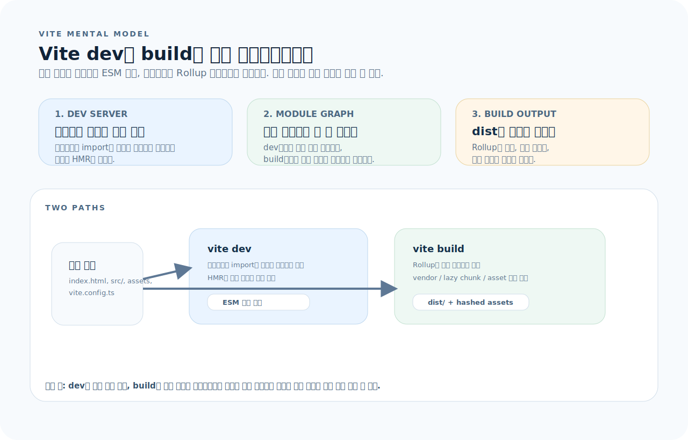
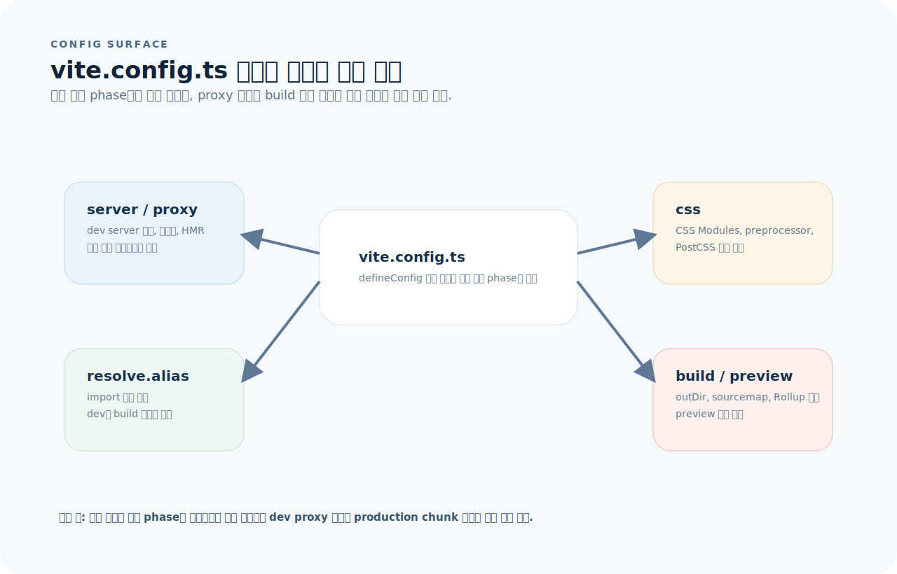
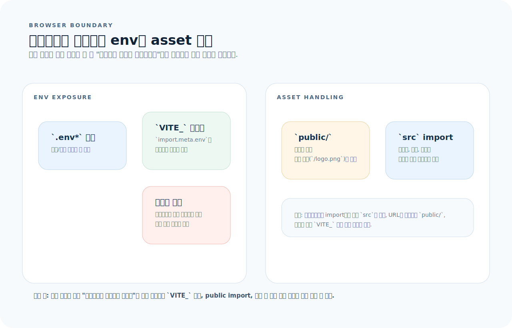
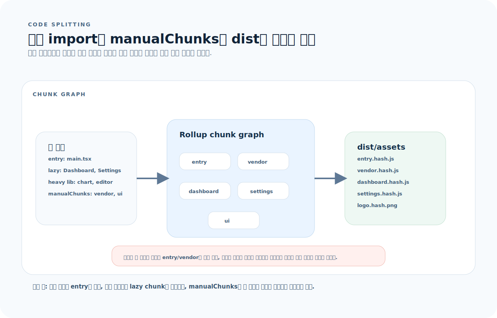

# Vite 완전 가이드

Vite는 프론트엔드 빌드 도구다. 개발 서버는 네이티브 ESM으로 즉시 서빙하고, 프로덕션 빌드는 Rollup으로 최적화한다. `npm run dev`가 무엇을 실행하는지 모르면 빌드 에러를 앱 코드 문제로 오해한다. 이 글을 읽으면 Vite 설정, 플러그인, 환경변수, 최적화를 다룰 수 있다.

---

## 1. Vite를 읽는 기준

Vite는 하나의 도구처럼 보이지만, 실제로는 개발 서버와 프로덕션 빌드가 꽤 다른 방식으로 움직인다. 어떤 설정이 어느 단계에 적용되는지부터 먼저 잡는 편이 훨씬 빠르다.



- `vite dev`는 브라우저의 ESM 요청을 받아 필요한 모듈만 즉석 변환한다.
- `vite build`는 Rollup으로 전체 의존성 그래프를 분석해 청크와 해시 에셋을 만든다.
- `vite.config.ts`의 각 옵션은 dev 전용, build 전용, 양쪽 공통으로 나뉜다.

먼저 아래 세 질문으로 읽으면 된다.

1. 지금 보고 있는 문제는 dev 서버/HMR 문제인가, build 결과 청크 문제인가?
2. 이 설정은 `server`, `resolve`, `css`, `build` 중 어느 단계에 영향을 주는가?
3. 이 값이나 파일은 브라우저 번들에 들어가야 하는가, 아니면 개발 환경이나 서버에만 남아야 하는가?

---

## 2. 핵심 원리

Vite에서 가장 많이 헷갈리는 지점은 `vite dev`와 `vite build`가 같은 파이프라인이 아니라는 점이다.

- 개발 서버는 필요한 모듈만 온디맨드 변환하므로 시작이 빠르다.
- 프로덕션 빌드는 전체 그래프를 묶어 최적화하므로 chunk 구조와 캐시 전략이 중요하다.
- 따라서 dev에서 잘 되던 코드가 build에서 깨지면 대개 번들링, 경로 해석, 환경 변수 노출 문제를 의심해야 한다.

**Webpack과의 차이**: Webpack은 모든 파일을 번들링한 후 서빙 → 프로젝트가 커지면 시작이 느림. Vite는 필요한 모듈만 온디맨드 변환 → 프로젝트 크기와 무관하게 빠른 시작.

---

## 3. 프로젝트 구조

```
├── index.html              # 진입점 (루트에 위치)
├── src/
│   ├── main.tsx            # 앱 코드 진입점
│   ├── App.tsx
│   └── vite-env.d.ts       # Vite 타입 선언
├── public/                 # 정적 파일 (빌드 시 루트로 복사)
├── vite.config.ts          # Vite 설정
├── .env                    # 환경변수
├── .env.local              # 로컬 환경변수 (gitignore)
└── tsconfig.json
```

> `index.html`은 `public/`이 아닌 **프로젝트 루트**에 있다. Vite가 이 파일을 진입점으로 사용한다.

---

## 4. vite.config.ts

`vite.config.ts`는 한 파일이지만, 실제로는 개발 서버, 모듈 해석, CSS 변환, 빌드 출력처럼 서로 다른 표면을 제어한다.



- `server`와 `proxy`는 개발 서버에서만 동작한다.
- `resolve.alias`는 dev와 build 모두의 import 해석에 관여한다.
- `css`와 `build.rollupOptions`는 최종 번들 구조와 스타일 처리 경로를 바꾼다.

```ts
import { defineConfig } from "vite";
import react from "@vitejs/plugin-react";
import path from "path";

export default defineConfig({
  plugins: [react()],

  // 개발 서버
  server: {
    port: 3000,
    open: true,                             // 브라우저 자동 열기
    proxy: {
      "/api": {
        target: "http://localhost:8000",     // API 프록시
        changeOrigin: true,
      },
      "/ws": {
        target: "ws://localhost:8000",       // WebSocket 프록시
        ws: true,
      },
    },
  },

  // 경로 alias
  resolve: {
    alias: {
      "@": path.resolve(__dirname, "./src"),
      "@components": path.resolve(__dirname, "./src/components"),
    },
  },

  // 빌드
  build: {
    outDir: "dist",
    sourcemap: true,                        // 소스맵 생성
    rollupOptions: {
      output: {
        manualChunks: {
          vendor: ["react", "react-dom"],    // 벤더 청크 분리
        },
      },
    },
  },

  // 프리뷰 서버 (빌드 결과 확인)
  preview: {
    port: 4173,
  },
});
```

### tsconfig.json alias 연동

```json
{
  "compilerOptions": {
    "baseUrl": ".",
    "paths": {
      "@/*": ["./src/*"],
      "@components/*": ["./src/components/*"]
    }
  }
}
```

---

## 5. 환경변수

환경변수와 정적 파일은 모두 "무엇이 브라우저에 노출되는가"라는 같은 질문으로 보면 훨씬 덜 헷갈린다.



- `VITE_` 접두사가 있는 값만 `import.meta.env`를 통해 클라이언트로 들어간다.
- `public/` 파일은 그대로 복사되고, `src`에서 import한 파일은 번들링과 해싱을 거친다.
- 민감한 값이나 서버 전용 리소스는 이 두 경로 밖에 둬야 한다.

```bash
# .env
VITE_API_URL=https://api.example.com
VITE_APP_TITLE=My App

# 서버에서만 쓰이는 값 (클라이언트에 노출 안 됨)
DATABASE_URL=postgresql://...
```

```ts
// 클라이언트에서 접근
const apiUrl = import.meta.env.VITE_API_URL;
const mode = import.meta.env.MODE;          // "development" | "production"
const isDev = import.meta.env.DEV;          // boolean
const isProd = import.meta.env.PROD;        // boolean
```

| 접두사 | 클라이언트 노출 |
|--------|---------------|
| `VITE_` | ✅ 노출됨 |
| 없음 | ❌ 서버 전용 |

### .env 파일 우선순위 (높은 순)

```
.env.local              # 항상 로드, gitignore
.env.[mode].local       # 모드별 로컬
.env.[mode]             # 모드별 (.env.production)
.env                    # 기본
```

### 타입 안전한 환경변수

```ts
// src/vite-env.d.ts
/// <reference types="vite/client" />

interface ImportMetaEnv {
  readonly VITE_API_URL: string;
  readonly VITE_APP_TITLE: string;
}

interface ImportMeta {
  readonly env: ImportMetaEnv;
}
```

---

## 6. 정적 파일

```
public/
├── favicon.ico          # /favicon.ico로 접근
├── robots.txt           # /robots.txt로 접근
└── images/
    └── logo.png         # /images/logo.png로 접근
```

```tsx
// public/ 내 파일 — 절대 경로로 접근


// src/ 내 파일 — import로 처리 (해싱 + 최적화)
import heroImg from "@/assets/hero.png";


// CSS에서
.hero { background-image: url("@/assets/bg.jpg"); }
```

| 위치 | 처리 방식 |
|------|-----------|
| `public/` | 그대로 복사, 해싱 없음 |
| `src/` (import) | 번들링, 해싱, 최적화 |

---

## 7. 플러그인

```ts
// React
import react from "@vitejs/plugin-react";

// SWC (더 빠른 React 변환)
import react from "@vitejs/plugin-react-swc";

// SVG를 React 컴포넌트로
import svgr from "vite-plugin-svgr";

// 자동 ESLint
import eslint from "vite-plugin-eslint";

export default defineConfig({
  plugins: [
    react(),
    svgr(),
    eslint(),
  ],
});
```

### 자주 쓰는 플러그인

| 플러그인 | 용도 |
|---------|------|
| `@vitejs/plugin-react` | React Fast Refresh |
| `@vitejs/plugin-react-swc` | SWC 기반 빠른 빌드 |
| `vite-plugin-svgr` | SVG → React 컴포넌트 |
| `vite-plugin-pwa` | PWA 지원 |
| `vite-tsconfig-paths` | tsconfig paths 자동 연동 |

---

## 8. CSS 처리

```ts
// CSS Modules — .module.css 확장자 자동 인식
import styles from "./Button.module.css";
<button className={styles.primary}>클릭</button>

// PostCSS — postcss.config.js만 있으면 자동 적용
// Tailwind CSS — PostCSS 플러그인으로 동작
```

```ts
// vite.config.ts — CSS 설정
export default defineConfig({
  css: {
    modules: {
      localsConvention: "camelCase",  // kebab-case → camelCase
    },
    preprocessorOptions: {
      scss: {
        additionalData: `@use "@/styles/variables" as *;`,
      },
    },
  },
});
```

---

## 9. 코드 스플리팅

코드 스플리팅은 "chunk가 많아 보이게 만들기"보다, 초기 화면에 필요한 것과 나중에 불러도 되는 것을 분리하는 문제다.



- entry와 vendor는 초기에 필요한 최소 집합으로 유지한다.
- `React.lazy()` 같은 동적 import는 라우트 단위 지연 로딩으로 이어진다.
- `manualChunks`는 큰 의존성을 의도적으로 분리하지만, 과하면 오히려 요청 수만 늘릴 수 있다.

```tsx
// React.lazy — 라우트 레벨 분할
import { lazy, Suspense } from "react";

const Dashboard = lazy(() => import("./pages/Dashboard"));
const Settings = lazy(() => import("./pages/Settings"));

function App() {
  return (
    <Suspense fallback={<div>로딩...</div>}>
      <Routes>
        <Route path="/dashboard" element={<Dashboard />} />
        <Route path="/settings" element={<Settings />} />
      </Routes>
    </Suspense>
  );
}
```

```ts
// 수동 청크 분리
// vite.config.ts
build: {
  rollupOptions: {
    output: {
      manualChunks: {
        vendor: ["react", "react-dom", "react-router-dom"],
        ui: ["@radix-ui/react-dialog", "@radix-ui/react-dropdown-menu"],
      },
    },
  },
}
```

---

## 10. 빌드 분석

```bash
# 번들 크기 분석
npm install -D rollup-plugin-visualizer
```

```ts
import { visualizer } from "rollup-plugin-visualizer";

export default defineConfig({
  plugins: [
    react(),
    visualizer({ open: true }),   // 빌드 후 자동으로 분석 차트 열기
  ],
});
```

```bash
# 빌드 결과 확인
vite build
ls -la dist/assets/     # 각 청크 크기 확인
```

---

## 11. 자주 하는 실수

| 실수 | 원인과 해결 |
|------|-------------|
| `VITE_` 접두어 없이 env 사용 | 클라이언트에 노출하려면 `VITE_` 필수 |
| `index.html` 위치 혼동 | 프로젝트 루트에 위치. `public/` 아님 |
| proxy 미설정 → CORS | `server.proxy`로 API 프록시 설정 |
| dev와 build 동작 차이 | dev는 ESM 서빙, build는 Rollup 번들 — 다를 수 있음 |
| alias 설정 후 TS 에러 | `vite.config.ts`와 `tsconfig.json` 양쪽 모두 설정 |
| `process.env` 사용 | Vite는 `import.meta.env` 사용 |
| public 파일 import 시도 | public은 절대 경로 접근, import 하지 않음 |

---

## 12. 빠른 참조

```bash
# 명령어
npm create vite@latest my-app -- --template react-ts
vite                    # 개발 서버
vite build              # 프로덕션 빌드
vite preview            # 빌드 결과 미리보기
```

```ts
// 환경변수
import.meta.env.VITE_API_URL    // 커스텀
import.meta.env.MODE            // "development" | "production"
import.meta.env.DEV             // boolean
import.meta.env.PROD            // boolean

// 설정 핵심
defineConfig({
  plugins: [react()],
  server: { port, proxy },
  resolve: { alias },
  build: { outDir, sourcemap, rollupOptions },
  css: { modules, preprocessorOptions },
})
```
