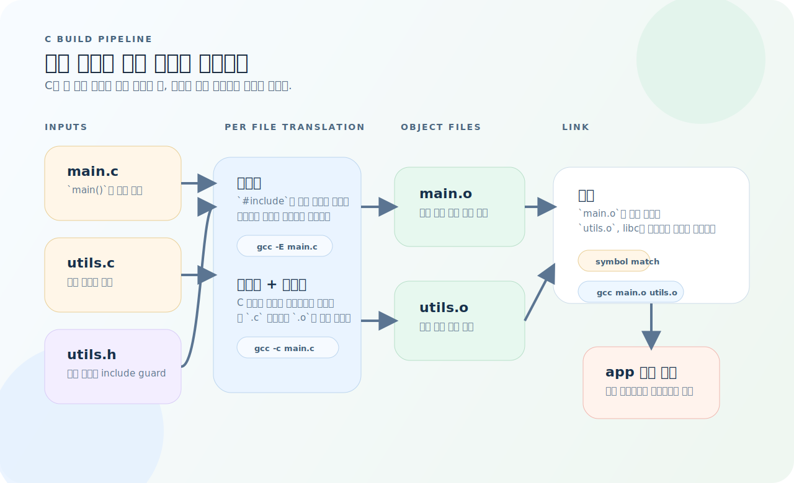
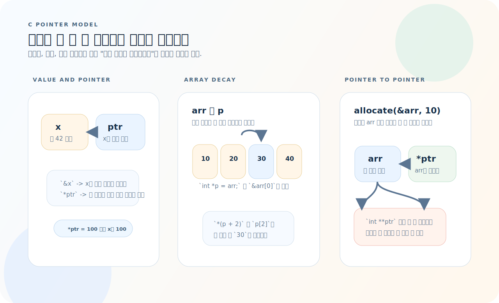
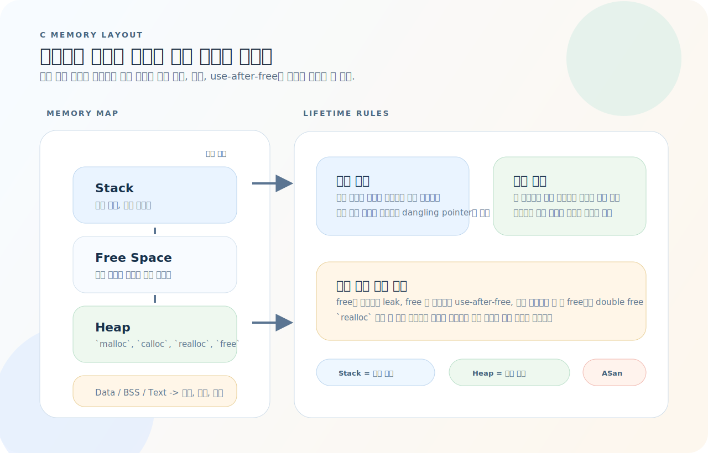
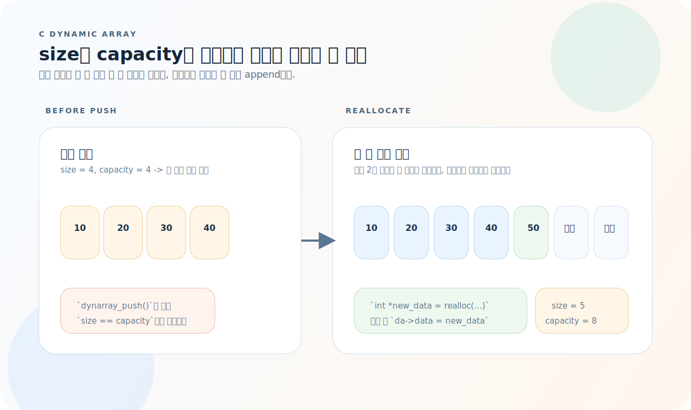

# C 완전 가이드

C는 운영체제, 네트워크, 임베디드 등 시스템 프로그래밍의 근간이다. 문법 자체는 작지만, **메모리 수명**, **주소 기반 접근**, **컴파일과 링크 단계**를 같이 이해해야 실전 코드가 읽힌다. 이 글은 개념을 따로 외우기보다 "값이 어디에 놓이고 어떻게 이어지는가"를 기준으로 C를 정리한다.

먼저 아래 세 질문을 기준으로 읽으면 흐름이 빨라진다.

1. 이 값은 스택, 힙, 전역 영역 중 어디에 있고 누가 수명을 책임지는가?
2. 지금 전달되는 것은 값의 복사본인가, 아니면 원본 주소인가?
3. 문제는 전처리, 컴파일, 링크 중 어느 단계에서 드러나는가?

---

## 1. 컴파일과 링크 흐름

C는 소스 파일을 한 번에 실행 파일로 바꾸지 않는다. 각 `.c` 파일이 독립적으로 번역되고, 마지막에 링크 단계에서 심볼이 합쳐진다.



- 전처리 단계에서 `#include`, `#define`, 조건부 컴파일이 실제 C 코드로 펼쳐진다.
- 각 `.c` 파일은 별도로 컴파일되어 `.o`가 되고, 링크 단계에서 함수 정의와 외부 라이브러리가 결합된다.
- 헤더는 선언을 공유하는 용도이고, 함수 본문 같은 정의는 한 번만 링크되도록 `.c` 파일에 둔다.

```text
소스(.c) -> 전처리 -> 컴파일 -> 어셈블 -> 오브젝트(.o) -> 링크 -> 실행 파일

gcc -E main.c               # 전처리 결과 (.i)
gcc -S main.c               # 어셈블리 (.s)
gcc -c main.c               # 오브젝트 (.o)
gcc main.o utils.o -o app   # 링크 -> 실행 파일
```

```bash
# 권장 컴파일 플래그
gcc -std=c99 -Wall -Wextra -Werror -O2 -g main.c -o app
#   -std=c99   : C99 표준
#   -Wall      : 주요 경고 활성화
#   -Wextra    : 추가 경고
#   -Werror    : 경고를 에러로 취급
#   -O2        : 최적화 레벨 2
#   -g         : 디버그 정보 포함
```

### 헤더와 소스 분리

```c
// utils.h — 선언만
#ifndef UTILS_H
#define UTILS_H

int add(int a, int b);
void print_array(const int *arr, size_t len);

#endif
```

```c
// utils.c — 정의
#include "utils.h"
#include <stdio.h>

int add(int a, int b) {
    return a + b;
}

void print_array(const int *arr, size_t len) {
    for (size_t i = 0; i < len; i++) {
        printf("%d ", arr[i]);
    }
    printf("\n");
}
```

> **헤더(.h)에는 선언만, 소스(.c)에는 정의.** 이 규칙을 어기면 중복 심볼 링크 에러가 발생한다.

---

## 2. 기본 타입

| 타입 | 크기 (일반적) | 범위 |
|------|-------------|------|
| `char` | 1B | -128 ~ 127 |
| `unsigned char` | 1B | 0 ~ 255 |
| `short` | 2B | -32,768 ~ 32,767 |
| `int` | 4B | -2^31 ~ 2^31 - 1 |
| `unsigned int` | 4B | 0 ~ 2^32 - 1 |
| `long` | 4/8B | 플랫폼 의존 |
| `float` | 4B | ~7자리 유효 |
| `double` | 8B | ~15자리 유효 |
| `size_t` | 4/8B | 부호 없는 크기 |

### 고정 크기 정수 (권장)

```c
#include <stdint.h>

int8_t   a;   // 정확히 8비트
int16_t  b;   // 정확히 16비트
int32_t  c;   // 정확히 32비트
int64_t  d;   // 정확히 64비트
uint32_t e;   // 부호 없는 32비트
```

---

## 3. 포인터와 간접 참조

포인터는 **값 자체가 아니라 값이 놓인 주소를 저장하는 변수**다. C에서 헷갈리는 지점은 대부분 "몇 번 따라가야 실제 값이 나오는가"에서 생긴다.



- `&x`는 주소를 꺼내고, `*ptr`은 그 주소를 따라가 실제 값을 읽거나 쓴다.
- 배열 이름은 첫 요소 주소로 읽히기 때문에 `p[2]`와 `*(p + 2)`가 같은 칸을 가리킨다.
- 함수가 포인터 변수 자체를 새 메모리로 바꾸려면 `int **`처럼 한 단계 더 감싼 포인터를 받아야 한다.

```c
int x = 42;
int *ptr = &x;        // ptr은 x의 주소를 가리킴

printf("%d\n", *ptr); // 역참조: 42
*ptr = 100;           // x가 100으로 변경
printf("%d\n", x);    // 100
```

### 포인터와 배열

```c
int arr[5] = {10, 20, 30, 40, 50};

int *p = arr;         // 배열 이름 = 첫 번째 요소의 주소
printf("%d\n", *(p + 2));  // 30 (포인터 산술)
printf("%d\n", p[2]);      // 30 (동일)
```

### 이중 포인터

```c
// 함수에서 포인터를 변경하려면 이중 포인터
void allocate(int **ptr, size_t n) {
    *ptr = malloc(sizeof(int) * n);
}

int *arr = NULL;
allocate(&arr, 10);
// arr이 이제 할당된 메모리를 가리킴
free(arr);
```

### void 포인터

```c
void *generic = malloc(100);       // 어떤 타입이든 가리킬 수 있음
int *int_ptr = (int *)generic;     // 사용 시 캐스팅 필요
```

---

## 4. 메모리 구역과 수명

메모리 관리는 `malloc`과 `free`만 외워서는 정리가 안 된다. 먼저 "이 값이 어느 구역에 있고 언제 사라지는가"를 잡아야 버그를 줄일 수 있다.



- 스택은 함수 호출과 함께 자동으로 잡히고, 스코프를 벗어나면 바로 회수된다.
- 힙은 `malloc` 계열로 직접 잡고 `free`로 직접 해제해야 하며, 수명 관리 책임이 코드에 남는다.
- 전역/정적 데이터는 프로그램 시작부터 종료까지 유지되고, 코드 영역은 읽기 전용 명령어가 놓인다.

### malloc / calloc / realloc / free

```c
// malloc — 할당 (초기화 안 됨)
int *arr = malloc(sizeof(int) * n);
if (!arr) {
    perror("malloc failed");
    return 1;
}

// calloc — 할당 + 0 초기화
int *arr = calloc(n, sizeof(int));

// realloc — 크기 변경
int *new_arr = realloc(arr, sizeof(int) * new_n);
if (!new_arr) {
    free(arr);   // 원본은 여전히 유효
    return 1;
}
arr = new_arr;

// free — 해제
free(arr);
arr = NULL;    // dangling pointer 방지
```

### 메모리 버그 유형

| 버그 | 설명 |
|------|------|
| 메모리 누수 | `malloc` 후 `free` 안 함 |
| Use-after-free | `free` 후 포인터 사용 |
| Double free | 같은 포인터 두 번 `free` |
| Buffer overflow | 배열 경계 초과 접근 |
| Dangling pointer | `free` 후 포인터 미초기화 |

```bash
# 검증 도구
valgrind --leak-check=full ./app
gcc -fsanitize=address -g main.c -o app   # AddressSanitizer
```

---

## 5. 문자열

C의 문자열은 **널 종료(`\0`) char 배열**이다.

```c
char str[] = "hello";        // {'h','e','l','l','o','\0'} — 6바이트
char *ptr = "hello";         // 문자열 리터럴 (읽기 전용)

// 안전한 문자열 조작
#include <string.h>

strlen(str);                 // 길이 (널 제외) → 5
strcmp(a, b);                // 비교: 0이면 같음
strncpy(dst, src, n);       // 복사 (최대 n바이트)
strncat(dst, src, n);       // 이어붙이기

// 안전한 입력
char buf[256];
fgets(buf, sizeof(buf), stdin);   // sizeof에 널 종료 포함
```

---

## 6. 구조체

```c
typedef struct {
    char name[50];
    int age;
    double gpa;
} Student;

Student s = {"홍길동", 20, 3.8};
printf("%s: %d세\n", s.name, s.age);

// 포인터를 통한 접근
Student *ptr = &s;
printf("%s\n", ptr->name);   // -> 연산자
```

### 구조체와 동적 할당

```c
typedef struct Node {
    int value;
    struct Node *next;
} Node;

Node *create_node(int value) {
    Node *node = malloc(sizeof(Node));
    if (!node) return NULL;
    node->value = value;
    node->next = NULL;
    return node;
}

void free_list(Node *head) {
    while (head) {
        Node *tmp = head;
        head = head->next;
        free(tmp);
    }
}
```

---

## 7. 전처리기

```c
// 매크로
#define MAX(a, b) ((a) > (b) ? (a) : (b))
#define ARRAY_SIZE(arr) (sizeof(arr) / sizeof((arr)[0]))

// 조건부 컴파일
#ifdef DEBUG
    printf("debug: x = %d\n", x);
#endif

// 인클루드 가드
#ifndef MYHEADER_H
#define MYHEADER_H
// 선언...
#endif
```

---

## 8. 파일 I/O

```c
#include <stdio.h>

// 텍스트 파일 읽기
FILE *fp = fopen("data.txt", "r");
if (!fp) {
    perror("fopen");
    return 1;
}

char line[256];
while (fgets(line, sizeof(line), fp)) {
    printf("%s", line);
}
fclose(fp);

// 텍스트 파일 쓰기
FILE *fp = fopen("output.txt", "w");
fprintf(fp, "name: %s, age: %d\n", name, age);
fclose(fp);

// 바이너리 파일
FILE *fp = fopen("data.bin", "rb");
int buf[100];
size_t count = fread(buf, sizeof(int), 100, fp);
fclose(fp);
```

---

## 9. 함수 포인터

```c
// 선언
int (*operation)(int, int);

// 사용
int add(int a, int b) { return a + b; }
int sub(int a, int b) { return a - b; }

operation = add;
printf("%d\n", operation(3, 4));   // 7

// 콜백 패턴
void apply(int *arr, size_t n, int (*fn)(int)) {
    for (size_t i = 0; i < n; i++) {
        arr[i] = fn(arr[i]);
    }
}

int square(int x) { return x * x; }
apply(arr, 5, square);

// qsort — 표준 라이브러리 정렬
int compare_int(const void *a, const void *b) {
    return (*(const int *)a) - (*(const int *)b);
}
qsort(arr, n, sizeof(int), compare_int);
```

---

## 10. 비트 연산

```c
unsigned int a = 0b1010;   // 10
unsigned int b = 0b1100;   // 12

a & b;     // AND:  0b1000 (8)
a | b;     // OR:   0b1110 (14)
a ^ b;     // XOR:  0b0110 (6)
~a;        // NOT
a << 2;    // 왼쪽 시프트: 0b101000 (40)
a >> 1;    // 오른쪽 시프트: 0b0101 (5)

// 실전 패턴
#define SET_BIT(x, n)    ((x) |= (1U << (n)))
#define CLEAR_BIT(x, n)  ((x) &= ~(1U << (n)))
#define CHECK_BIT(x, n)  ((x) & (1U << (n)))
#define TOGGLE_BIT(x, n) ((x) ^= (1U << (n)))
```

---

## 11. 동적 배열 성장 패턴

동적 배열의 핵심은 "가득 찼을 때 더 큰 버퍼로 갈아탄 뒤 주소를 교체한다"는 한 가지 규칙이다.



- `size < capacity`인 동안에는 마지막 칸 뒤에 바로 값을 붙이면 된다.
- 꽉 차면 보통 `capacity`를 2배로 늘린 새 버퍼를 확보하고, 기존 데이터를 옮긴 뒤 포인터를 교체한다.
- `realloc` 결과는 임시 포인터에 먼저 받고 성공했을 때만 원본 포인터를 바꾸는 편이 안전하다.

```c
typedef struct {
    int *data;
    size_t size;
    size_t capacity;
} DynArray;

DynArray *dynarray_create(size_t initial_cap) {
    DynArray *da = malloc(sizeof(DynArray));
    if (!da) return NULL;
    da->data = malloc(sizeof(int) * initial_cap);
    if (!da->data) { free(da); return NULL; }
    da->size = 0;
    da->capacity = initial_cap;
    return da;
}

int dynarray_push(DynArray *da, int value) {
    if (da->size == da->capacity) {
        size_t new_cap = da->capacity * 2;
        int *new_data = realloc(da->data, sizeof(int) * new_cap);
        if (!new_data) return -1;
        da->data = new_data;
        da->capacity = new_cap;
    }
    da->data[da->size++] = value;
    return 0;
}

void dynarray_free(DynArray *da) {
    if (da) {
        free(da->data);
        free(da);
    }
}
```

---

## 12. 자주 하는 실수

| 실수 | 원인과 해결 |
|------|-------------|
| `sizeof(ptr)` vs `sizeof(*ptr)` | 포인터 크기(8B)와 데이터 크기 구분. `sizeof(*ptr) * n` |
| `malloc` 반환값 미검사 | `if (!ptr) return 1;` 즉시 확인 |
| 문자열 버퍼 크기 부족 | 널 종료 문자 1바이트 포함 |
| `.h`에 정의 → 중복 심볼 | 헤더는 선언만, include guard 필수 |
| `free` 후 포인터 재사용 | `ptr = NULL` 설정 |
| 배열 경계 초과 | 인덱스 범위 검사, `size_t` 사용 |
| 정수 오버플로우 | 범위 확인, `int64_t` 등 고정 크기 타입 |
| 초기화 안 된 변수 사용 | 선언 시 초기화 또는 `calloc` 사용 |

---

## 13. 빠른 참조

```bash
# 빌드
gcc -std=c99 -Wall -Wextra -Werror -g main.c -o app
make && make test

# 디버깅
valgrind --leak-check=full ./app
gcc -fsanitize=address -g main.c -o app && ./app
gdb ./app
```

```c
// 할당
int *p = malloc(sizeof(int) * n);  if (!p) return 1;
int *p = calloc(n, sizeof(int));   // 0 초기화
free(p); p = NULL;

// 문자열
strlen(s);  strcmp(a, b);  strncpy(dst, src, n);
fgets(buf, sizeof(buf), stdin);

// 구조체
typedef struct { int x; } T;
T *p = malloc(sizeof(T));  p->x = 1;  free(p);

// 정렬
qsort(arr, n, sizeof(int), compare_fn);
```
