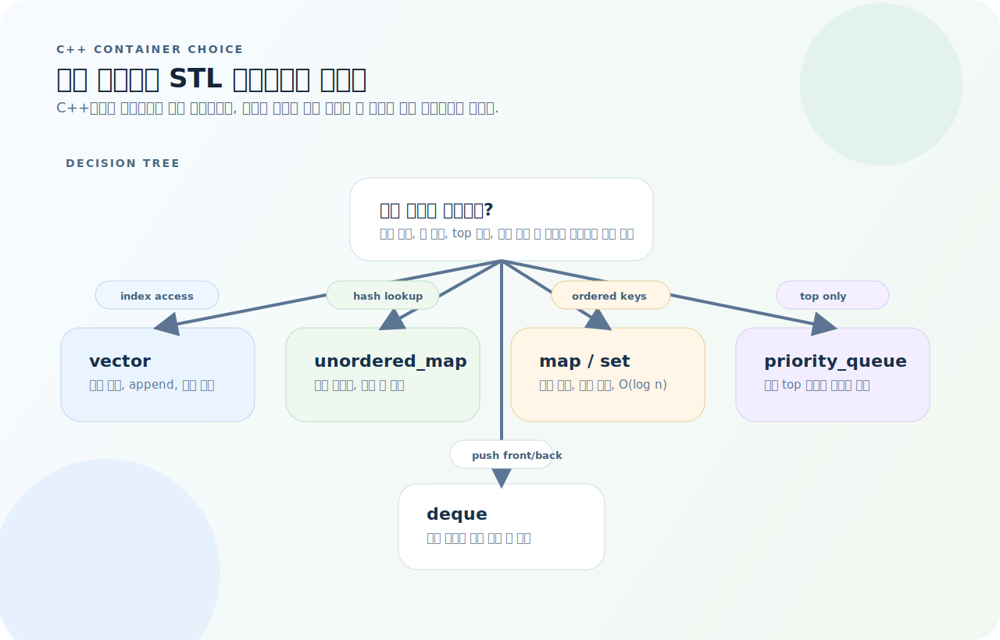
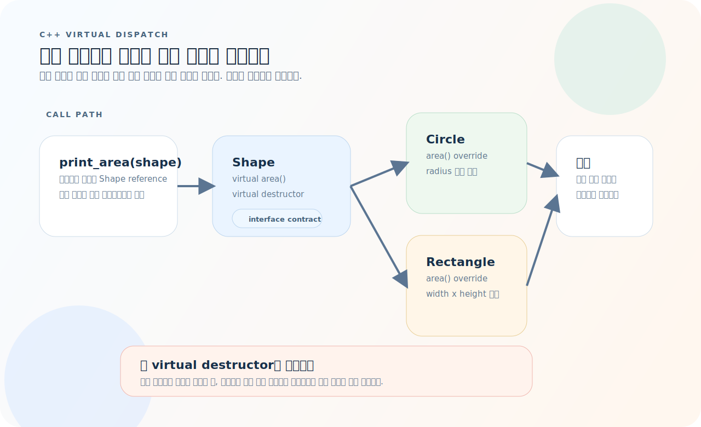
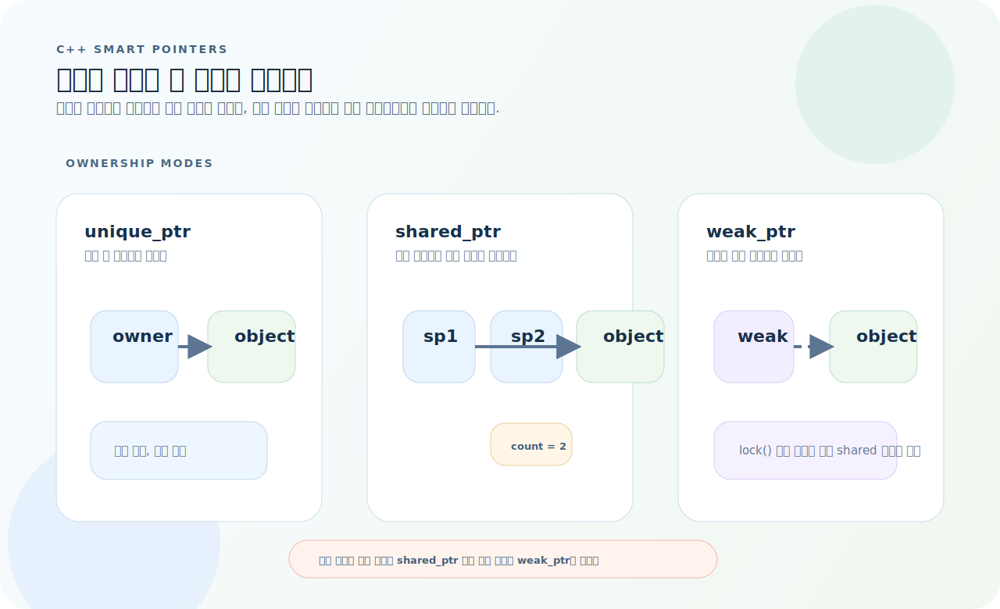
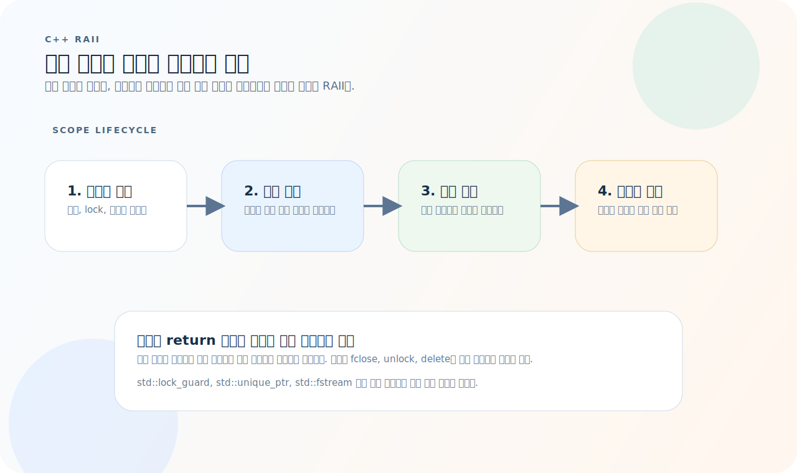

# C++ 완전 가이드

C++는 시스템 프로그래밍부터 알고리즘 풀이까지 쓰임새에 따라 완전히 다른 언어처럼 느껴진다. 실제로는 문법보다 **소유권**, **호출 방식**, **템플릿과 컨테이너 조합**을 먼저 잡아야 코드가 읽힌다. 이 글은 모던 C++(C++17/20) 기준으로 STL, 메모리 관리, 스마트 포인터, 템플릿, 빌드까지 실무 관점으로 정리한다.

먼저 아래 세 질문을 기준으로 읽으면 구조가 훨씬 빠르게 잡힌다.

1. 이 값은 복사해도 되는가, 아니면 스코프나 스마트 포인터로 수명을 묶어야 하는가?
2. 이 호출은 정적으로 결정되는가, 아니면 가상 함수로 런타임 dispatch가 필요한가?
3. 직접 자료구조를 만들기보다 STL 컨테이너와 알고리즘 조합으로 표현할 수 있는가?

---

## 1. 기본 문법

### 변수와 타입

```cpp
int x = 42;
double pi = 3.14;
bool flag = true;
char ch = 'A';

auto value = 42;           // 컴파일러가 타입 추론
const int MAX = 100;       // 컴파일 타임 상수
constexpr int SIZE = 256;  // 컴파일 타임 계산 보장
```

### 참조와 포인터

```cpp
int x = 10;
int &ref = x;     // 참조: x의 별칭 (초기화 후 변경 불가)
int *ptr = &x;    // 포인터: x의 주소

ref = 20;         // x도 20
*ptr = 30;        // x도 30

// const 참조 — 수정 불가, 복사 없음
void print(const std::string &s) {
    std::cout << s << "\n";
}
```

### 구조화된 바인딩 (C++17)

```cpp
auto [key, value] = std::pair{1, "hello"};

std::map<std::string, int> m = {{"a", 1}, {"b", 2}};
for (const auto &[k, v] : m) {
    std::cout << k << ": " << v << "\n";
}
```

---

## 2. 문자열

```cpp
#include <string>
using namespace std;

string s = "hello";
s.size();              // 5
s.empty();             // false
s += " world";         // "hello world"
s.substr(0, 5);        // "hello"
s.find("world");       // 6 (없으면 string::npos)

// 문자열 ↔ 숫자
int n = stoi("42");
double d = stod("3.14");
string ns = to_string(42);

// string_view (C++17) — 복사 없는 읽기 전용 뷰
void print(std::string_view sv) {
    std::cout << sv << "\n";
}
```

---

## 3. STL 컨테이너

STL은 "이름을 외우는 것"보다 "어떤 접근 패턴을 원하는가"로 고르는 편이 훨씬 빠르다.



- 임의 접근과 순차 순회가 중심이면 `vector`가 기본값이다.
- 키 기반 조회가 핵심이면 정렬 유지 여부에 따라 `unordered_map`과 `map`을 나눈다.
- top 원소만 빠르게 보고 싶으면 `priority_queue`, 양끝 삽입이 많으면 `deque`가 맞다.

### vector — 동적 배열

```cpp
vector<int> v = {1, 2, 3};
v.push_back(4);
v.pop_back();
v.size();                  // 3
v[0];                      // 1
v.at(0);                   // 1 (범위 검사)

// 초기화
vector<int> zeros(10, 0);         // 크기 10, 모두 0
vector<vector<int>> grid(n, vector<int>(m, 0));  // n×m 2D 배열

// 순회
for (const auto &elem : v) { ... }
for (size_t i = 0; i < v.size(); i++) { ... }
```

### map / unordered_map

```cpp
// map — 정렬된 키 (Red-Black Tree, O(log n))
map<string, int> m;
m["apple"] = 3;
m.count("apple");        // 1 (존재 여부)
m.erase("apple");

// unordered_map — 해시 (O(1) 평균)
unordered_map<string, int> um;
um["key"] = 42;
if (auto it = um.find("key"); it != um.end()) {
    cout << it->second;    // 42
}
```

### set / unordered_set

```cpp
set<int> s = {3, 1, 2};          // 정렬: {1, 2, 3}
s.insert(4);
s.count(3);                       // 1
s.erase(2);

unordered_set<int> us = {3, 1, 2};  // 해시
```

### stack / queue / priority_queue

```cpp
stack<int> st;
st.push(1); st.top(); st.pop();

queue<int> q;
q.push(1); q.front(); q.back(); q.pop();

priority_queue<int> maxpq;                           // 최대 힙
priority_queue<int, vector<int>, greater<int>> minpq; // 최소 힙
```

### 컨테이너 선택 기준

| 컨테이너 | 탐색 | 삽입/삭제 | 용도 |
|----------|------|-----------|------|
| `vector` | O(n) | O(1) 끝 | 순서 보존, 임의 접근 |
| `unordered_map` | O(1) | O(1) | 키-값 빠른 조회 |
| `map` | O(log n) | O(log n) | 정렬된 키 필요 시 |
| `set` | O(log n) | O(log n) | 정렬된 고유 원소 |
| `priority_queue` | O(1) top | O(log n) | 최대/최소 빠른 조회 |
| `deque` | O(1) 양끝 | O(1) 양끝 | 양쪽 삽입/삭제 |

---

## 4. 알고리즘

```cpp
#include <algorithm>
#include <numeric>

vector<int> v = {5, 3, 1, 4, 2};

sort(v.begin(), v.end());                    // 오름차순
sort(v.begin(), v.end(), greater<int>());    // 내림차순

// 커스텀 정렬
sort(v.begin(), v.end(), [](int a, int b) {
    return abs(a) < abs(b);   // 절대값 기준
});

// 탐색
binary_search(v.begin(), v.end(), 3);        // true/false
auto it = lower_bound(v.begin(), v.end(), 3); // >= 3인 첫 위치
auto it = upper_bound(v.begin(), v.end(), 3); // > 3인 첫 위치

// 기타
reverse(v.begin(), v.end());
auto mx = *max_element(v.begin(), v.end());
int sum = accumulate(v.begin(), v.end(), 0);
```

---

## 5. 람다

```cpp
// 기본
auto add = [](int a, int b) { return a + b; };
add(3, 4);  // 7

// 캡처
int x = 10;
auto fn = [x](int a) { return a + x; };     // 값 캡처 (복사)
auto fn = [&x](int a) { return a + x; };    // 참조 캡처
auto fn = [=](int a) { return a + x; };     // 모든 변수 값 캡처
auto fn = [&](int a) { x += a; };           // 모든 변수 참조 캡처

// STL에서 활용
sort(v.begin(), v.end(), [](const auto &a, const auto &b) {
    return a.score > b.score;
});
```

---

## 6. 클래스

```cpp
class Student {
public:
    Student(std::string name, int age)
        : name_(std::move(name)), age_(age) {}

    const std::string &name() const { return name_; }
    int age() const { return age_; }

    void set_age(int age) { age_ = age; }

private:
    std::string name_;
    int age_;
};
```

### 상속과 다형성

가상 함수는 "부모 타입으로 받아도 실제 객체의 구현을 호출한다"는 한 가지 규칙으로 이해하면 된다.



- `Shape` 참조나 포인터로 받아도 실제 객체가 `Circle`이면 `Circle::area()`가 호출된다.
- 이 동작은 가상 함수 테이블을 통한 런타임 dispatch로 이루어지고, `virtual`이 없으면 정적 바인딩이 된다.
- 소멸자를 `virtual`로 두면 부모 포인터로 삭제해도 자식 소멸자가 안전하게 실행된다.

```cpp
class Shape {
public:
    virtual ~Shape() = default;
    virtual double area() const = 0;   // 순수 가상 함수
};

class Circle : public Shape {
public:
    explicit Circle(double r) : radius_(r) {}
    double area() const override { return 3.14159 * radius_ * radius_; }
private:
    double radius_;
};

class Rectangle : public Shape {
public:
    Rectangle(double w, double h) : w_(w), h_(h) {}
    double area() const override { return w_ * h_; }
private:
    double w_, h_;
};

// 다형성
void print_area(const Shape &s) {
    std::cout << s.area() << "\n";
}
```

---

## 7. 스마트 포인터

스마트 포인터는 "누가 소유권을 가지는가"를 타입으로 드러내는 도구다. 포인터 종류를 고르면 해제 규칙도 거의 같이 결정된다.



- `unique_ptr`는 단독 소유다. 복사 대신 이동만 허용되므로 기본 선택으로 가장 안전하다.
- `shared_ptr`는 참조 카운트를 공유하고, 마지막 소유자가 사라질 때 자원이 해제된다.
- `weak_ptr`는 카운트를 늘리지 않는 관찰자여서 순환 참조를 끊을 때 쓴다.

```cpp
#include <memory>

// unique_ptr — 단독 소유 (기본 선택)
auto ptr = std::make_unique<Student>("홍길동", 20);
ptr->name();   // 사용
// 스코프 벗어나면 자동 해제

// shared_ptr — 공유 소유 (참조 카운팅)
auto sp1 = std::make_shared<Student>("김철수", 25);
auto sp2 = sp1;   // 참조 카운트 2
// 마지막 shared_ptr 소멸 시 해제

// weak_ptr — 순환 참조 방지
std::weak_ptr<Student> wp = sp1;
if (auto locked = wp.lock()) {
    // locked가 유효할 때만 사용
}
```

| 종류 | 소유 방식 | 사용 시점 |
|------|-----------|-----------|
| `unique_ptr` | 단독 소유 | 기본 선택 |
| `shared_ptr` | 공유 소유 | 여러 곳에서 참조 시 |
| `weak_ptr` | 비소유 관찰 | 순환 참조 방지 |

> **`new`/`delete` 직접 사용을 피한다.** `make_unique`/`make_shared`를 쓴다.

---

## 8. 템플릿

```cpp
// 함수 템플릿
template <typename T>
T max_val(T a, T b) {
    return (a > b) ? a : b;
}

max_val(3, 5);       // int
max_val(3.14, 2.71); // double

// 클래스 템플릿
template <typename T>
class Stack {
public:
    void push(const T &val) { data_.push_back(val); }
    T pop() {
        T val = data_.back();
        data_.pop_back();
        return val;
    }
    bool empty() const { return data_.empty(); }
private:
    std::vector<T> data_;
};

Stack<int> intStack;
Stack<std::string> strStack;
```

### Concepts (C++20)

```cpp
template <typename T>
concept Sortable = requires(T a, T b) {
    { a < b } -> std::convertible_to<bool>;
};

template <Sortable T>
void my_sort(std::vector<T> &v) {
    std::sort(v.begin(), v.end());
}
```

---

## 9. 에러 처리

```cpp
// 예외
try {
    if (denominator == 0) {
        throw std::invalid_argument("Division by zero");
    }
    result = numerator / denominator;
} catch (const std::invalid_argument &e) {
    std::cerr << "Error: " << e.what() << "\n";
} catch (const std::exception &e) {
    std::cerr << "Unexpected: " << e.what() << "\n";
}

// optional (C++17) — 예외 대신 빈 값
std::optional<int> find_index(const std::vector<int> &v, int target) {
    for (size_t i = 0; i < v.size(); i++) {
        if (v[i] == target) return static_cast<int>(i);
    }
    return std::nullopt;
}

auto idx = find_index(v, 42);
if (idx) {
    std::cout << "Found at " << *idx << "\n";
}
```

---

## 10. IO 최적화 (알고리즘 풀이)

```cpp
#include <bits/stdc++.h>
using namespace std;

int main() {
    ios::sync_with_stdio(false);
    cin.tie(nullptr);

    int n;
    cin >> n;

    vector<int> v(n);
    for (auto &x : v) cin >> x;

    sort(v.begin(), v.end());

    for (const auto &x : v) cout << x << "\n";
    // endl 대신 "\n" — endl은 flush를 강제하여 느림

    return 0;
}
```

---

## 11. RAII

**Resource Acquisition Is Initialization** — 자원 수명을 스코프로 묶는다.



- 생성자에서 자원을 얻고 소멸자에서 정리하면 `return`, `throw`, 조기 종료가 섞여도 누수가 줄어든다.
- RAII 객체는 "자원을 가진 값"처럼 다루고, 스코프를 벗어나는 순간 정리 작업이 자동으로 실행된다.
- 파일, mutex, 소켓, 메모리처럼 짝이 맞아야 하는 자원에 특히 효과적이다.

```cpp
class FileHandle {
public:
    explicit FileHandle(const char *path)
        : fp_(fopen(path, "r")) {
        if (!fp_) throw std::runtime_error("Cannot open file");
    }
    ~FileHandle() { if (fp_) fclose(fp_); }

    // 복사 금지
    FileHandle(const FileHandle &) = delete;
    FileHandle &operator=(const FileHandle &) = delete;

    // 이동 허용
    FileHandle(FileHandle &&other) noexcept : fp_(other.fp_) { other.fp_ = nullptr; }

    FILE *get() const { return fp_; }

private:
    FILE *fp_;
};
// 스코프 벗어나면 자동으로 fclose
```

---

## 12. 자주 하는 실수

| 실수 | 원인과 해결 |
|------|-------------|
| 컨테이너 선택을 감으로 | 시간복잡도 비교 후 선택 |
| 불필요한 복사 | `const &`로 받기, `std::move` 활용 |
| comparator strict weak ordering 위반 | `<=` 사용 금지, 동등 시 `false` 반환 |
| IO 최적화 누락 | `sync_with_stdio(false)`, `cin.tie(nullptr)` |
| `new`/`delete` 직접 사용 | `make_unique`/`make_shared` 사용 |
| `endl` 남용 | `"\n"` 사용 (flush 불필요 시) |
| 범위 기반 for에서 복사 | `const auto &` 사용 |

---

## 13. 빠른 참조

```cpp
// 컨테이너
vector<int> v; map<string, int> m; unordered_map<string, int> um;
set<int> s; stack<int> st; queue<int> q;
priority_queue<int> pq;

// 알고리즘
sort(v.begin(), v.end());
binary_search(v.begin(), v.end(), x);
lower_bound / upper_bound
reverse / max_element / min_element / accumulate

// 스마트 포인터
auto p = make_unique<T>(...);
auto p = make_shared<T>(...);

// 빌드
g++ -std=c++17 -O2 -Wall main.cpp -o app
g++ -std=c++20 -Wall -Wextra -Werror -g main.cpp -o app
```
