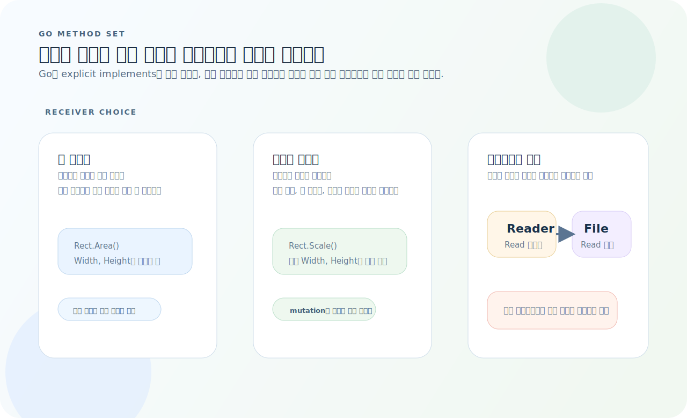
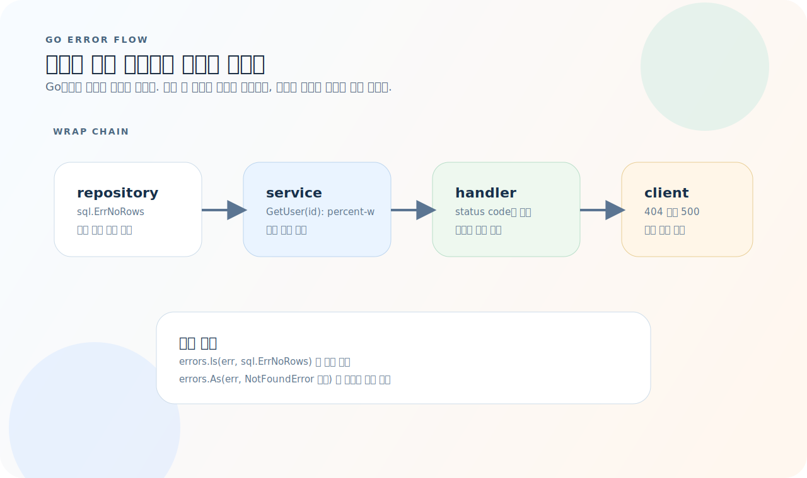
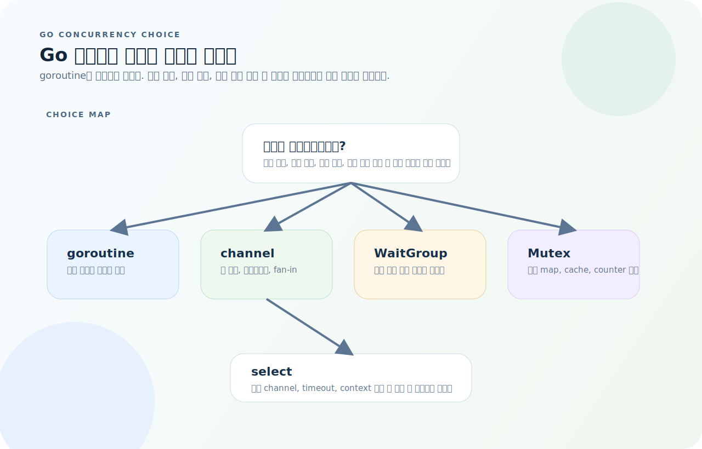
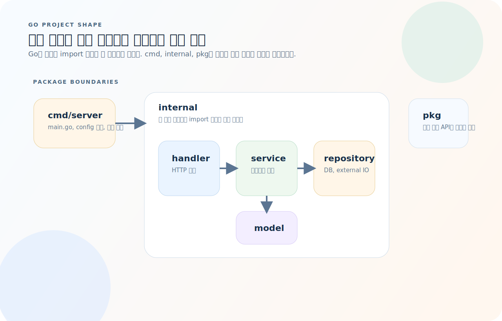

# Go 완전 가이드

Go는 단순한 문법으로 구조를 강하게 드러내는 언어다. 표준 라이브러리 중심 설계, 명시적 에러 처리, goroutine 기반 동시성이 핵심인데, 실제로는 이 셋을 어떤 규칙으로 연결하는지가 더 중요하다. 이 글은 Go 프로젝트를 읽고, 서버를 작성하고, 동시성 코드를 다루는 기준을 먼저 잡아준다.

먼저 아래 세 질문을 기준으로 읽으면 Go 코드가 훨씬 빨리 정리된다.

1. 이 함수는 `context`와 `error`를 어디서 받고 어디까지 전파하는가?
2. 이 타입은 값으로 복사해도 되는가, 아니면 포인터 리시버와 메서드 집합이 필요한가?
3. 이 문제는 channel로 메시지를 흐르게 해야 하는가, 아니면 `Mutex`로 공유 상태를 잠그는 편이 맞는가?

---

## 1. 기본 문법

### 변수와 타입

```go
var x int = 10
var s string = "hello"
y := 42                    // 짧은 선언 (함수 내에서만)
const MaxSize = 100

// 기본 타입
// int, int8, int16, int32, int64
// uint, uint8(byte), uint16, uint32, uint64
// float32, float64
// bool, string, rune (= int32, 유니코드)
```

### 함수

```go
func add(a, b int) int {
    return a + b
}

// 다중 반환값
func divide(a, b float64) (float64, error) {
    if b == 0 {
        return 0, fmt.Errorf("division by zero")
    }
    return a / b, nil
}

// 이름 있는 반환값
func swap(a, b int) (x, y int) {
    return b, a
}
```

### 제어문

```go
// if — 초기화 구문 포함 가능
if val, err := strconv.Atoi(s); err == nil {
    fmt.Println(val)
}

// for — Go의 유일한 반복문
for i := 0; i < 10; i++ { }
for i, v := range slice { }     // 인덱스 + 값
for k, v := range myMap { }     // 키 + 값
for condition { }                // while 역할
for { }                          // 무한 루프

// switch
switch status {
case "active":
    // ...
case "inactive":
    // ...
default:
    // ...
}
```

---

## 2. 자료구조

### 슬라이스

```go
// 생성
s := []int{1, 2, 3}
s := make([]int, 0, 10)      // len=0, cap=10

// 추가
s = append(s, 4, 5)

// 슬라이싱
sub := s[1:3]                 // [2, 3]

// 순회
for i, v := range s {
    fmt.Printf("%d: %d\n", i, v)
}

// 길이, 용량
len(s)
cap(s)
```

### 맵

```go
m := map[string]int{
    "apple":  3,
    "banana": 5,
}

// 접근
val, ok := m["apple"]         // ok로 존재 여부 확인
if !ok {
    fmt.Println("not found")
}

// 삭제
delete(m, "apple")
```

### 구조체

```go
type User struct {
    ID    int
    Name  string
    Email string
}

u := User{ID: 1, Name: "홍길동", Email: "hong@example.com"}
fmt.Println(u.Name)

// 포인터
p := &u
p.Name = "김철수"
```

---

## 3. 메서드와 인터페이스

Go 메서드는 "어떤 리시버를 쓰는가"와 "그 메서드 집합이 어떤 인터페이스를 만족하는가"를 같이 봐야 이해가 빠르다.



- 값 리시버는 복사된 값으로 동작하고, 포인터 리시버는 원본 상태를 바꿀 수 있다.
- 인터페이스 구현은 명시 선언이 아니라 메서드 집합 일치로 결정된다.
- 호출 측이 작은 인터페이스를 정의하면 구현체는 더 느슨하게 교체할 수 있다.

### 메서드

```go
type Rect struct {
    Width, Height float64
}

// 값 리시버 — 읽기 전용
func (r Rect) Area() float64 {
    return r.Width * r.Height
}

// 포인터 리시버 — 상태 변경
func (r *Rect) Scale(factor float64) {
    r.Width *= factor
    r.Height *= factor
}
```

### 인터페이스

```go
// 인터페이스는 호출 측에서 정의하는 것이 Go의 관례
type Reader interface {
    Read(p []byte) (n int, err error)
}

type Writer interface {
    Write(p []byte) (n int, err error)
}

// 작은 인터페이스를 조합
type ReadWriter interface {
    Reader
    Writer
}
```

> Go 인터페이스는 **암시적**(implicit)이다. `implements` 키워드 없이, 메서드만 구현하면 인터페이스를 만족한다.

---

## 4. 에러 처리

Go의 에러 처리는 예외 대신 "값을 위로 올리면서 문맥을 덧붙인다"는 흐름으로 보는 편이 정확하다.



- 하위 계층은 원인 에러를 만들고, 상위 계층은 `%w`로 문맥을 추가하면서 그대로 전달한다.
- 호출자는 `errors.Is`와 `errors.As`로 체인을 따라가며 특정 원인이나 타입을 판별한다.
- 에러를 삼키기보다, 어느 계층에서 어떤 문맥을 붙였는지 남기는 것이 디버깅에 유리하다.

```go
// 기본 패턴 — 에러는 일반 값
result, err := doSomething()
if err != nil {
    return fmt.Errorf("doSomething failed: %w", err)   // %w: 에러 래핑
}

// 커스텀 에러 타입
type NotFoundError struct {
    Resource string
    ID       string
}

func (e *NotFoundError) Error() string {
    return fmt.Sprintf("%s not found: %s", e.Resource, e.ID)
}

// 에러 검사
var nfe *NotFoundError
if errors.As(err, &nfe) {
    // NotFoundError 처리
}
if errors.Is(err, sql.ErrNoRows) {
    // 특정 에러 비교
}
```

### 에러 래핑 체인

```go
// 호출 스택에서 문맥을 추가하며 래핑
func GetUser(id string) (*User, error) {
    user, err := repo.FindByID(id)
    if err != nil {
        return nil, fmt.Errorf("GetUser(%s): %w", id, err)
    }
    return user, nil
}
```

---

## 5. 동시성

Go 동시성은 goroutine만 늘리는 것이 아니라, 어떤 동기화 도구를 선택할지 결정하는 문제다.



- 작업 분리와 결과 전달이 목적이면 goroutine + channel 조합이 자연스럽다.
- 여러 작업 완료를 기다리기만 하면 `WaitGroup`, 공유 상태 보호가 핵심이면 `Mutex`가 더 직접적이다.
- `select`는 여러 channel, 취소, timeout 중 어느 이벤트를 먼저 받을지 고르는 지점이다.

### goroutine

```go
func main() {
    go worker("A")   // 새 goroutine에서 실행
    go worker("B")
    time.Sleep(time.Second)
}

func worker(name string) {
    fmt.Printf("worker %s started\n", name)
}
```

### channel

```go
ch := make(chan int)         // 버퍼 없는 채널
ch := make(chan int, 10)     // 버퍼 있는 채널

// 보내기 / 받기
go func() { ch <- 42 }()
val := <-ch

// range로 닫힐 때까지 수신
go func() {
    for i := 0; i < 5; i++ {
        ch <- i
    }
    close(ch)
}()

for v := range ch {
    fmt.Println(v)
}
```

### select

```go
select {
case msg := <-ch1:
    fmt.Println("ch1:", msg)
case msg := <-ch2:
    fmt.Println("ch2:", msg)
case <-time.After(5 * time.Second):
    fmt.Println("timeout")
}
```

### sync.WaitGroup

```go
var wg sync.WaitGroup

for i := 0; i < 5; i++ {
    wg.Add(1)
    go func(id int) {
        defer wg.Done()
        fmt.Printf("worker %d\n", id)
    }(i)
}

wg.Wait()   // 모든 goroutine 완료 대기
```

### sync.Mutex

```go
type SafeCounter struct {
    mu sync.Mutex
    v  map[string]int
}

func (c *SafeCounter) Inc(key string) {
    c.mu.Lock()
    defer c.mu.Unlock()
    c.v[key]++
}
```

> 모든 문제를 channel로 풀 필요는 없다. 공유 상태 보호에는 `Mutex`가 더 적합한 경우가 많다.

---

## 6. Context

```go
// 타임아웃
ctx, cancel := context.WithTimeout(context.Background(), 5*time.Second)
defer cancel()

// HTTP 핸들러에서
func handler(w http.ResponseWriter, r *http.Request) {
    ctx := r.Context()
    result, err := doWork(ctx)
    if err != nil {
        if errors.Is(err, context.DeadlineExceeded) {
            http.Error(w, "timeout", http.StatusGatewayTimeout)
            return
        }
        http.Error(w, err.Error(), http.StatusInternalServerError)
        return
    }
    json.NewEncoder(w).Encode(result)
}

// 값 전달 (인증 정보 등)
type ctxKey string
const userKey ctxKey = "user"

ctx = context.WithValue(ctx, userKey, currentUser)
user := ctx.Value(userKey).(*User)
```

> 함수 첫 인자로 `ctx context.Context`를 처음부터 넣는다.

---

## 7. HTTP 서버

### 표준 라이브러리 (net/http)

```go
func main() {
    mux := http.NewServeMux()
    mux.HandleFunc("GET /users", listUsers)
    mux.HandleFunc("POST /users", createUser)
    mux.HandleFunc("GET /users/{id}", getUser)   // Go 1.22+ 패턴

    log.Fatal(http.ListenAndServe(":8080", mux))
}

func listUsers(w http.ResponseWriter, r *http.Request) {
    users := []User{{ID: 1, Name: "홍길동"}}
    w.Header().Set("Content-Type", "application/json")
    json.NewEncoder(w).Encode(users)
}

func getUser(w http.ResponseWriter, r *http.Request) {
    id := r.PathValue("id")   // Go 1.22+
    // ...
}
```

### 미들웨어

```go
func logging(next http.Handler) http.Handler {
    return http.HandlerFunc(func(w http.ResponseWriter, r *http.Request) {
        start := time.Now()
        next.ServeHTTP(w, r)
        log.Printf("%s %s %v", r.Method, r.URL.Path, time.Since(start))
    })
}

// 적용
handler := logging(mux)
http.ListenAndServe(":8080", handler)
```

---

## 8. JSON

```go
type User struct {
    ID    int    `json:"id"`
    Name  string `json:"name"`
    Email string `json:"email,omitempty"`   // 비어있으면 생략
}

// 직렬화
data, err := json.Marshal(user)

// 역직렬화
var u User
err := json.Unmarshal(data, &u)

// HTTP 응답/요청에서
json.NewEncoder(w).Encode(user)        // 응답
json.NewDecoder(r.Body).Decode(&input) // 요청
```

---

## 9. 테스트

```go
// user_test.go
func TestAdd(t *testing.T) {
    got := add(2, 3)
    want := 5
    if got != want {
        t.Errorf("add(2, 3) = %d, want %d", got, want)
    }
}

// 테이블 기반 테스트
func TestDivide(t *testing.T) {
    tests := []struct {
        name    string
        a, b    float64
        want    float64
        wantErr bool
    }{
        {"normal", 10, 2, 5, false},
        {"zero", 10, 0, 0, true},
    }

    for _, tt := range tests {
        t.Run(tt.name, func(t *testing.T) {
            got, err := divide(tt.a, tt.b)
            if (err != nil) != tt.wantErr {
                t.Fatalf("unexpected error: %v", err)
            }
            if got != tt.want {
                t.Errorf("got %f, want %f", got, tt.want)
            }
        })
    }
}
```

```bash
go test ./...              # 전체 테스트
go test -v ./pkg/...       # 상세 출력
go test -run TestAdd       # 특정 테스트
go test -race ./...        # 레이스 디텍터
go test -cover ./...       # 커버리지
```

---

## 10. 프로젝트 구조

Go 프로젝트는 폴더 이름보다 "어디까지 외부에 공개할지"와 "HTTP에서 비즈니스 로직까지 어떻게 흐를지"가 중요하다.



- `cmd/`는 실행 진입점만 두고, 실제 로직은 `internal/` 아래 패키지로 분리한다.
- `handler -> service -> repository` 흐름으로 두면 `net/http` 의존과 도메인 로직을 분리하기 쉽다.
- `pkg/`는 정말 외부 공개가 필요한 경우에만 두고, 나머지는 `internal/`에 감추는 편이 안전하다.

```
project/
├── cmd/
│   └── server/
│       └── main.go        # 진입점
├── internal/              # 외부 import 불가
│   ├── handler/           # HTTP 핸들러
│   ├── service/           # 비즈니스 로직
│   ├── repository/        # 데이터 접근
│   └── model/             # 도메인 모델
├── pkg/                   # 외부 공개 패키지
├── go.mod
├── go.sum
├── Makefile
└── docker-compose.yml
```

---

## 11. 자주 하는 실수

| 실수 | 원인과 해결 |
|------|-------------|
| 포인터/값 리시버 혼동 | 상태 변경 → 포인터 리시버 `*T` |
| 인터페이스를 너무 크게 | 메서드 1–2개로 시작 |
| context 뒤늦게 추가 | 함수 첫 인자로 처음부터 포함 |
| goroutine 누수 | context 취소, channel 닫기 확인 |
| nil map에 쓰기 | `make(map[K]V)` 초기화 필수 |
| range 변수 캡처 | Go 1.22+에서 해결. 이전 버전은 루프 변수 복사 |
| 에러 무시 (`_ = fn()`) | 에러는 반드시 확인 또는 명시적 무시 |

---

## 12. 빠른 참조

```bash
go mod init module/path    # 모듈 초기화
go mod tidy                # 의존성 정리
go run .                   # 실행
go build ./...             # 빌드
go test ./...              # 테스트
go test -race ./...        # 레이스 디텍터
go fmt ./...               # 포맷팅
go vet ./...               # 정적 분석
```

```go
// 에러
if err != nil { return fmt.Errorf("context: %w", err) }

// 동시성
go func() { ... }()
ch := make(chan T, bufSize)
var wg sync.WaitGroup
var mu sync.Mutex

// HTTP
http.HandleFunc("GET /path", handler)
http.ListenAndServe(":8080", mux)

// JSON
json.Marshal(v) / json.Unmarshal(data, &v)
```
