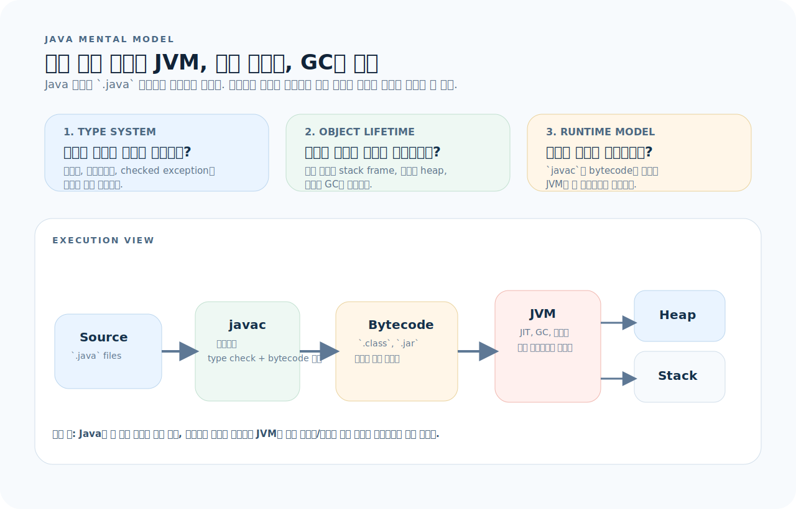
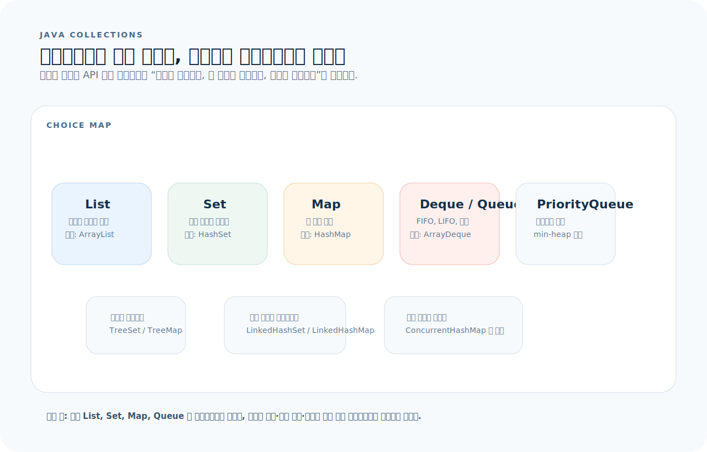
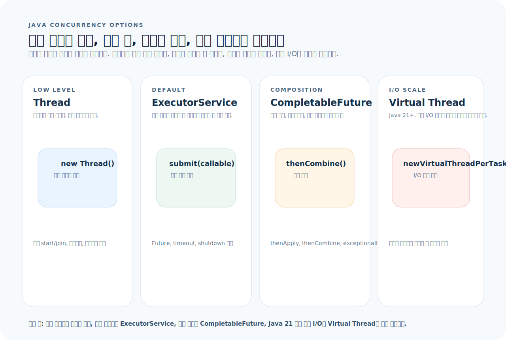

# Java 완전 가이드

Java는 정적 타입, 클래스 기반 객체지향 언어다. JVM 위에서 돌아가므로 플랫폼에 의존하지 않고, 강한 타입 시스템과 가비지 컬렉션이 메모리 안전을 보장한다. 이 글을 읽고 나면 Java 21 기준의 핵심 문법, 컬렉션, 동시성, 그리고 프로젝트 구조를 읽고 쓸 수 있다.



먼저 아래 세 질문을 기준으로 읽으면 Java 코드가 훨씬 빨리 정리된다.

1. 이 타입은 어떤 클래스 계층에 속하고, 인터페이스는 무엇을 강제하는가?
2. 이 객체는 어디서 생성되고, 어떤 스코프에서 GC 대상이 되는가?
3. 이 코드는 checked exception을 강제하는가, unchecked로 흘리는가?

그림을 왼쪽에서 오른쪽으로 읽으면 Java 코드는 소스 문법만이 아니라 `컴파일된 바이트코드`, `JVM 메모리 모델`, `타입/예외 규칙` 위에서 동작한다. 그래서 이 문서는 문법을 외우기보다 "타입이 어떻게 강제되는가", "객체가 어디에 살아남는가", "병렬 실행을 어떤 도구로 맡길 것인가"를 읽는 기준으로 삼는다.

---

## 1. 기본 문법

### 변수와 타입

```java
// 기본 타입 (primitive)
int count = 10;
long id = 100L;
double rate = 3.14;
float score = 9.5f;
boolean active = true;
char grade = 'A';
byte flags = 0x1F;

// 참조 타입
String name = "hello";
var items = new ArrayList<String>();   // Java 10+ 로컬 변수 타입 추론

// 상수
final int MAX_SIZE = 100;
static final String DEFAULT_ROLE = "user";
```

### 배열

```java
int[] nums = {1, 2, 3, 4, 5};
String[] names = new String[10];
int[][] matrix = new int[3][4];

// 접근
int first = nums[0];
int length = nums.length;      // 배열은 .length (메서드 아님)
```

### 제어문

```java
// if
if (score >= 90) {
    grade = 'A';
} else if (score >= 80) {
    grade = 'B';
} else {
    grade = 'C';
}

// switch (전통)
switch (status) {
    case "active":
        handle(); break;
    case "inactive":
        disable(); break;
    default:
        log();
}

// switch 표현식 (Java 14+)
String label = switch (status) {
    case "active" -> "활성";
    case "inactive" -> "비활성";
    default -> "알 수 없음";
};

// for
for (int i = 0; i < 10; i++) { }
for (String item : items) { }           // enhanced for

// while
while (condition) { }
do { } while (condition);
```

### 함수 (메서드)

```java
public int add(int a, int b) {
    return a + b;
}

// 가변 인자
public int sum(int... nums) {
    return Arrays.stream(nums).sum();
}

// 제네릭 메서드
public <T> List<T> listOf(T... items) {
    return List.of(items);
}
```

---

## 2. 클래스와 객체

### 기본 클래스

```java
public class User {
    private final Long id;
    private String name;
    private String email;

    public User(Long id, String name, String email) {
        this.id = id;
        this.name = name;
        this.email = email;
    }

    // getter
    public Long getId() { return id; }
    public String getName() { return name; }
    public String getEmail() { return email; }

    // setter
    public void setName(String name) { this.name = name; }

    @Override
    public String toString() {
        return "User{id=%d, name='%s'}".formatted(id, name);
    }

    @Override
    public boolean equals(Object o) {
        if (this == o) return true;
        if (!(o instanceof User u)) return false;
        return Objects.equals(id, u.id);
    }

    @Override
    public int hashCode() {
        return Objects.hash(id);
    }
}
```

### Record (Java 16+)

```java
// 불변 데이터 캐리어 — equals, hashCode, toString 자동 생성
public record UserDto(Long id, String name, String email) {}

// 사용
var dto = new UserDto(1L, "alice", "alice@example.com");
String name = dto.name();    // getter가 아니라 컴포넌트 접근자
```

### 상속과 인터페이스

```java
// 인터페이스
public interface Repository<T, ID> {
    T findById(ID id);
    List<T> findAll();
    T save(T entity);
    void deleteById(ID id);
}

// 추상 클래스
public abstract class BaseEntity {
    private LocalDateTime createdAt;
    private LocalDateTime updatedAt;

    public abstract Long getId();
}

// 구현
public class UserRepository implements Repository<User, Long> {
    @Override
    public User findById(Long id) { /* ... */ }
    // ...
}

// sealed 클래스 (Java 17+)
public sealed interface Shape
    permits Circle, Rectangle, Triangle {}

public record Circle(double radius) implements Shape {}
public record Rectangle(double w, double h) implements Shape {}
public record Triangle(double a, double b, double c) implements Shape {}
```

### enum

```java
public enum Status {
    ACTIVE("활성"),
    INACTIVE("비활성"),
    DELETED("삭제됨");

    private final String label;

    Status(String label) { this.label = label; }

    public String getLabel() { return label; }
}

// 사용
Status s = Status.ACTIVE;
String label = s.getLabel();
```

---

## 3. 컬렉션 프레임워크

Java 컬렉션은 인터페이스 → 구현체 계층으로 읽는다. `List`, `Set`, `Map`이 핵심이고, 나머지는 이 셋의 변형이다.



- 순서와 인덱스가 중요하면 `List`, 중복 제거가 목적이면 `Set`, 키 조회가 중심이면 `Map`부터 고른다.
- 대부분의 기본 선택은 `ArrayList`, `HashSet`, `HashMap`, `ArrayDeque`다.
- 정렬, 삽입 순서 보존, 동시성 요구가 생길 때만 `TreeMap`, `LinkedHashMap`, `ConcurrentHashMap` 같은 특수 구현체로 좁혀 간다.

### List

```java
// 불변 리스트
List<String> names = List.of("a", "b", "c");

// 가변 리스트
List<String> list = new ArrayList<>();
list.add("x");
list.add(0, "y");            // 인덱스 삽입
list.get(0);                  // 조회
list.set(0, "z");             // 교체
list.remove(0);               // 인덱스 삭제
list.remove("x");             // 값 삭제
list.size();
list.isEmpty();
list.contains("z");
```

### Map

```java
// 불변 맵
Map<String, Integer> scores = Map.of("alice", 90, "bob", 85);

// 가변 맵
Map<String, Integer> map = new HashMap<>();
map.put("alice", 90);
map.get("alice");              // 90
map.getOrDefault("carol", 0); // 0
map.containsKey("alice");
map.remove("alice");

// 순회
for (var entry : map.entrySet()) {
    System.out.println(entry.getKey() + "=" + entry.getValue());
}
map.forEach((k, v) -> System.out.println(k + "=" + v));

// 유용한 메서드
map.putIfAbsent("bob", 0);
map.computeIfAbsent("carol", k -> k.length());
map.merge("alice", 1, Integer::sum);   // 값 누적
```

### Set

```java
Set<String> tags = new HashSet<>();
tags.add("java");
tags.add("spring");
tags.contains("java");        // true
tags.remove("java");

// 집합 연산
Set<String> a = Set.of("x", "y", "z");
Set<String> b = Set.of("y", "z", "w");
// 교집합: retainAll, 합집합: addAll, 차집합: removeAll (가변 Set에서)
```

### Queue / Deque

```java
Deque<Integer> stack = new ArrayDeque<>();
stack.push(1);
stack.push(2);
stack.pop();                   // 2

Queue<Integer> queue = new ArrayDeque<>();
queue.offer(1);
queue.offer(2);
queue.poll();                  // 1

PriorityQueue<Integer> pq = new PriorityQueue<>();    // min-heap
pq.offer(3); pq.offer(1); pq.offer(2);
pq.poll();                     // 1
```

---

## 4. Stream API

Stream은 컬렉션을 함수형으로 변환·필터·집계하는 파이프라인이다. 원본을 변경하지 않고, lazy 평가된다.

```java
List<String> names = List.of("Alice", "Bob", "Charlie", "David");

// 필터 + 변환 + 수집
List<String> result = names.stream()
    .filter(n -> n.length() > 3)
    .map(String::toLowerCase)
    .sorted()
    .toList();                 // [alice, charlie, david]

// 집계
long count = names.stream().filter(n -> n.startsWith("A")).count();
Optional<String> first = names.stream().filter(n -> n.startsWith("C")).findFirst();

// reduce
int total = List.of(1, 2, 3, 4).stream()
    .reduce(0, Integer::sum);  // 10

// groupBy
Map<Integer, List<String>> byLength = names.stream()
    .collect(Collectors.groupingBy(String::length));

// joining
String csv = names.stream().collect(Collectors.joining(", "));

// 배열을 Stream으로
int[] nums = {1, 2, 3};
IntStream.of(nums).sum();
Arrays.stream(nums).max();
```

---

## 5. Optional

`null`을 직접 다루는 대신 `Optional`로 값의 존재/부재를 명시한다.

```java
// 생성
Optional<String> opt = Optional.of("value");
Optional<String> empty = Optional.empty();
Optional<String> nullable = Optional.ofNullable(maybeNull);

// 사용
opt.isPresent();              // true
opt.isEmpty();                // false (Java 11+)
String val = opt.orElse("default");
String val2 = opt.orElseThrow(() -> new NotFoundException("not found"));

// 체이닝
Optional<String> upper = opt
    .filter(s -> s.length() > 3)
    .map(String::toUpperCase);

// flatMap — Optional을 반환하는 함수 체이닝
Optional<String> result = findUser(id)
    .flatMap(user -> findAddress(user.getAddressId()))
    .map(Address::getCity);
```

---

## 6. 예외 처리

Java는 checked exception과 unchecked exception을 구분한다.

```
Throwable
├── Error                    // JVM 수준 오류, 잡지 않는다
└── Exception
    ├── IOException          // checked — 반드시 선언하거나 잡아야
    ├── SQLException         // checked
    └── RuntimeException     // unchecked — 선언 없이 전파
        ├── NullPointerException
        ├── IllegalArgumentException
        └── IllegalStateException
```

### 기본 패턴

```java
try {
    var data = readFile(path);
    process(data);
} catch (FileNotFoundException e) {
    log.warn("파일 없음: {}", path);
    throw new ServiceException("파일을 찾을 수 없습니다", e);
} catch (IOException e) {
    throw new ServiceException("파일 읽기 실패", e);
} finally {
    cleanup();
}
```

### try-with-resources

```java
// AutoCloseable 구현체는 자동으로 close()
try (var reader = new BufferedReader(new FileReader(path));
     var writer = new BufferedWriter(new FileWriter(out))) {
    String line;
    while ((line = reader.readLine()) != null) {
        writer.write(line);
        writer.newLine();
    }
}   // reader, writer 자동 close
```

### 커스텀 예외

```java
public class BusinessException extends RuntimeException {
    private final String code;

    public BusinessException(String code, String message) {
        super(message);
        this.code = code;
    }

    public BusinessException(String code, String message, Throwable cause) {
        super(message, cause);
        this.code = code;
    }

    public String getCode() { return code; }
}
```

---

## 7. 동시성

동시성 도구는 전부 비슷해 보이지만 책임이 다르다. "스레드를 직접 다룰지", "작업 제출만 할지", "비동기 합성을 할지"를 먼저 구분해야 한다.



- 직접 `Thread`를 만드는 코드는 학습용에 가깝고, 실무 기본값은 `ExecutorService`다.
- 여러 비동기 결과를 합치고 예외를 체이닝하려면 `CompletableFuture`가 맞다.
- Java 21 이후 I/O 바운드 대량 동시성은 `Virtual Thread`가 가장 단순한 선택이 된다.

### Thread와 ExecutorService

```java
// 직접 Thread 생성 — 실무에서는 거의 쓰지 않는다
Thread t = new Thread(() -> System.out.println("hello"));
t.start();

// ExecutorService — 스레드 풀 관리
ExecutorService pool = Executors.newFixedThreadPool(4);

Future<String> future = pool.submit(() -> {
    Thread.sleep(1000);
    return "done";
});

String result = future.get();           // 블로킹
String result2 = future.get(5, TimeUnit.SECONDS);  // 타임아웃
pool.shutdown();
```

### CompletableFuture

```java
CompletableFuture.supplyAsync(() -> fetchUser(id))
    .thenApply(user -> user.getName())
    .thenAccept(name -> log.info("User: {}", name))
    .exceptionally(ex -> {
        log.error("조회 실패", ex);
        return null;
    });

// 병렬 합성
var userFuture = CompletableFuture.supplyAsync(() -> fetchUser(id));
var ordersFuture = CompletableFuture.supplyAsync(() -> fetchOrders(id));

userFuture.thenCombine(ordersFuture, (user, orders) ->
    new UserWithOrders(user, orders)
).thenAccept(this::render);
```

### Virtual Thread (Java 21+)

```java
// 가상 스레드 — 경량 스레드, I/O 바운드 작업에 적합
try (var executor = Executors.newVirtualThreadPerTaskExecutor()) {
    IntStream.range(0, 10_000).forEach(i ->
        executor.submit(() -> {
            Thread.sleep(Duration.ofSeconds(1));
            return i;
        })
    );
}   // close()에서 모든 작업 완료 대기

// 직접 생성
Thread.startVirtualThread(() -> {
    // 경량 스레드에서 실행
});
```

### 동기화

```java
// synchronized
private final Object lock = new Object();

synchronized (lock) {
    // 임계 영역
}

// ReentrantLock — 더 세밀한 제어
private final ReentrantLock lock = new ReentrantLock();

lock.lock();
try {
    // 임계 영역
} finally {
    lock.unlock();
}

// ConcurrentHashMap — lock-free 읽기
ConcurrentHashMap<String, Integer> map = new ConcurrentHashMap<>();
map.put("count", 0);
map.compute("count", (k, v) -> v + 1);

// AtomicInteger
AtomicInteger counter = new AtomicInteger(0);
counter.incrementAndGet();
counter.compareAndSet(1, 2);
```

---

## 8. I/O와 NIO

### 파일 읽기/쓰기 (NIO)

```java
// 파일 읽기
String content = Files.readString(Path.of("data.txt"));
List<String> lines = Files.readAllLines(Path.of("data.txt"));

// 파일 쓰기
Files.writeString(Path.of("out.txt"), "hello");
Files.write(Path.of("out.txt"), lines);

// 대용량 파일 — 줄 단위 스트림
try (Stream<String> stream = Files.lines(Path.of("big.txt"))) {
    stream.filter(line -> line.contains("ERROR"))
          .forEach(System.out::println);
}

// 디렉터리 탐색
try (Stream<Path> paths = Files.walk(Path.of("src"))) {
    paths.filter(p -> p.toString().endsWith(".java"))
         .forEach(System.out::println);
}
```

### HTTP Client (Java 11+)

```java
HttpClient client = HttpClient.newHttpClient();

HttpRequest request = HttpRequest.newBuilder()
    .uri(URI.create("https://api.example.com/users"))
    .header("Accept", "application/json")
    .GET()
    .build();

HttpResponse<String> response = client.send(
    request, HttpResponse.BodyHandlers.ofString());

int status = response.statusCode();
String body = response.body();
```

---

## 9. 제네릭

```java
// 제네릭 클래스
public class Result<T> {
    private final T value;
    private final String error;

    private Result(T value, String error) {
        this.value = value;
        this.error = error;
    }

    public static <T> Result<T> ok(T value) {
        return new Result<>(value, null);
    }

    public static <T> Result<T> fail(String error) {
        return new Result<>(null, error);
    }

    public boolean isSuccess() { return error == null; }
    public T getValue() { return value; }
    public String getError() { return error; }
}

// 바운드 타입
public <T extends Comparable<T>> T max(T a, T b) {
    return a.compareTo(b) >= 0 ? a : b;
}

// 와일드카드
public void printAll(List<? extends Number> nums) {
    nums.forEach(System.out::println);
}

public void addAll(List<? super Integer> list) {
    list.add(1);
    list.add(2);
}
```

---

## 10. 어노테이션

어노테이션은 메타데이터를 코드에 붙이는 장치다. Spring, JPA, JUnit 등 Java 생태계 전체가 어노테이션 위에서 돈다.

```java
// 표준 어노테이션
@Override                // 부모 메서드를 덮어쓴다고 선언
@Deprecated              // 더 이상 사용하지 않는다
@SuppressWarnings("unchecked")  // 경고 억제
@FunctionalInterface     // 함수형 인터페이스 선언

// 커스텀 어노테이션
@Retention(RetentionPolicy.RUNTIME)
@Target(ElementType.METHOD)
public @interface Timed {
    String value() default "";
}

// 사용
@Timed("user-fetch")
public User findUser(Long id) { /* ... */ }
```

---

## 11. 프로젝트 구조

```
my-app/
├── build.gradle.kts        # Gradle 빌드 설정
├── settings.gradle.kts
├── src/
│   ├── main/
│   │   ├── java/
│   │   │   └── com/example/myapp/
│   │   │       ├── MyApplication.java
│   │   │       ├── domain/
│   │   │       │   ├── User.java
│   │   │       │   └── UserRepository.java
│   │   │       ├── service/
│   │   │       │   └── UserService.java
│   │   │       └── controller/
│   │   │           └── UserController.java
│   │   └── resources/
│   │       ├── application.yml
│   │       └── db/migration/
│   └── test/
│       └── java/
│           └── com/example/myapp/
│               ├── service/
│               │   └── UserServiceTest.java
│               └── controller/
│                   └── UserControllerTest.java
├── gradlew
└── gradle/
    └── wrapper/
```

---

## 12. 자주 하는 실수

| 실수 | 올바른 방법 |
|------|-------------|
| `==`로 String 비교 | `"abc".equals(str)` — 참조가 아니라 값을 비교 |
| `null` 직접 반환 후 체크 누락 | `Optional`을 반환하거나 예외를 던진다 |
| checked exception을 삼키기 | 최소한 로그를 남기고 원인 예외를 체이닝한다 |
| raw type 사용 `List list` | `List<String> list`로 타입 파라미터를 명시 |
| `ConcurrentModificationException` | 순회 중 컬렉션 수정 금지, `Iterator.remove()` 사용 |
| mutable 객체를 `Map` 키로 사용 | 키는 불변이어야 한다 (`record` 또는 `final` 필드) |
| `Date`/`Calendar` 사용 | `java.time` 패키지: `LocalDate`, `Instant`, `ZonedDateTime` |

---

## 13. 빠른 참조

```java
// ── 변수 ──
var x = 42;                              // 로컬 타입 추론
final int MAX = 100;                     // 상수

// ── 컬렉션 생성 ──
List.of(1, 2, 3);                        // 불변 리스트
Map.of("a", 1, "b", 2);                  // 불변 맵
Set.of("x", "y");                        // 불변 셋
new ArrayList<>(List.of(1, 2, 3));       // 가변 리스트

// ── Stream ──
list.stream().filter(x -> x > 0).map(String::valueOf).toList();
list.stream().collect(Collectors.groupingBy(User::getRole));

// ── Optional ──
Optional.ofNullable(value).orElse(fallback);
Optional.ofNullable(value).map(v -> transform(v)).orElseThrow();

// ── 문자열 ──
"hello %s, age %d".formatted(name, age);  // Java 15+
String.join(", ", list);
str.strip();                              // trim 대신 유니코드 인식 strip

// ── 날짜 ──
LocalDate.now();
LocalDateTime.now();
Instant.now();
Duration.ofSeconds(30);

// ── 파일 ──
Files.readString(Path.of("file.txt"));
Files.writeString(Path.of("out.txt"), content);

// ── Record ──
record Point(int x, int y) {}

// ── Switch 표현식 ──
var result = switch (value) {
    case 1 -> "one";
    case 2 -> "two";
    default -> "other";
};

// ── Pattern matching (Java 21+) ──
if (obj instanceof String s && s.length() > 3) { }
switch (shape) {
    case Circle c -> Math.PI * c.radius() * c.radius();
    case Rectangle r -> r.w() * r.h();
    default -> 0;
}

// ── Virtual Thread ──
Thread.startVirtualThread(() -> task());
Executors.newVirtualThreadPerTaskExecutor();
```
