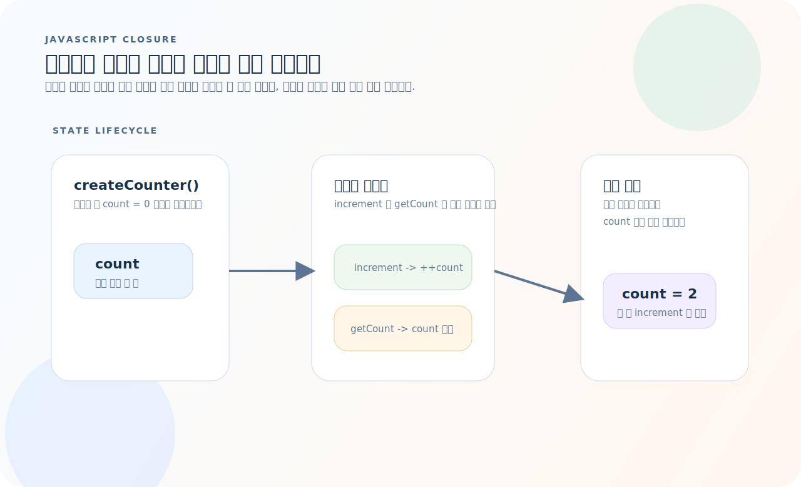
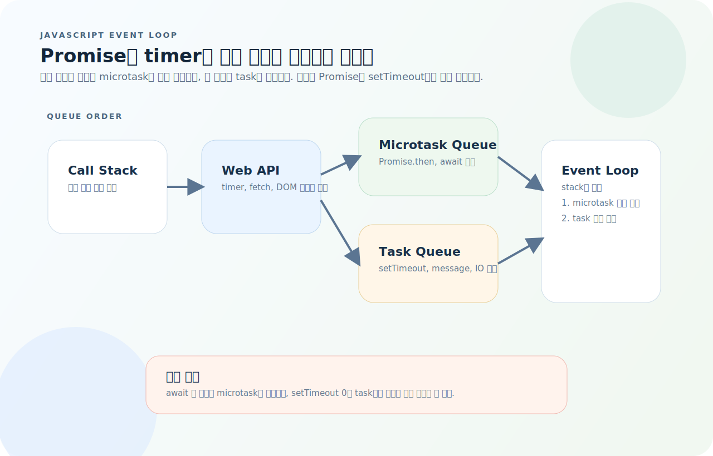
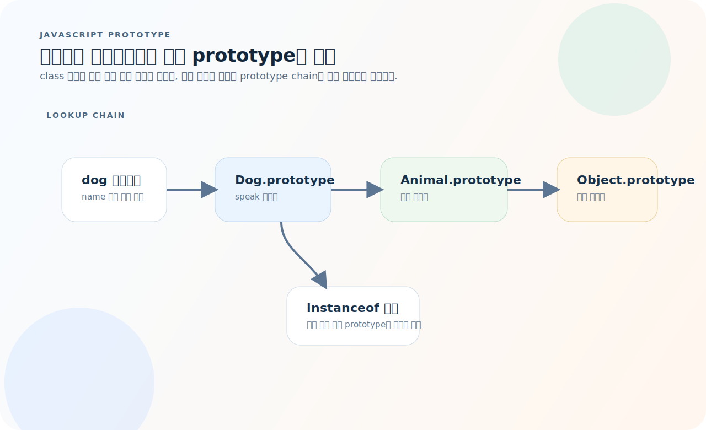
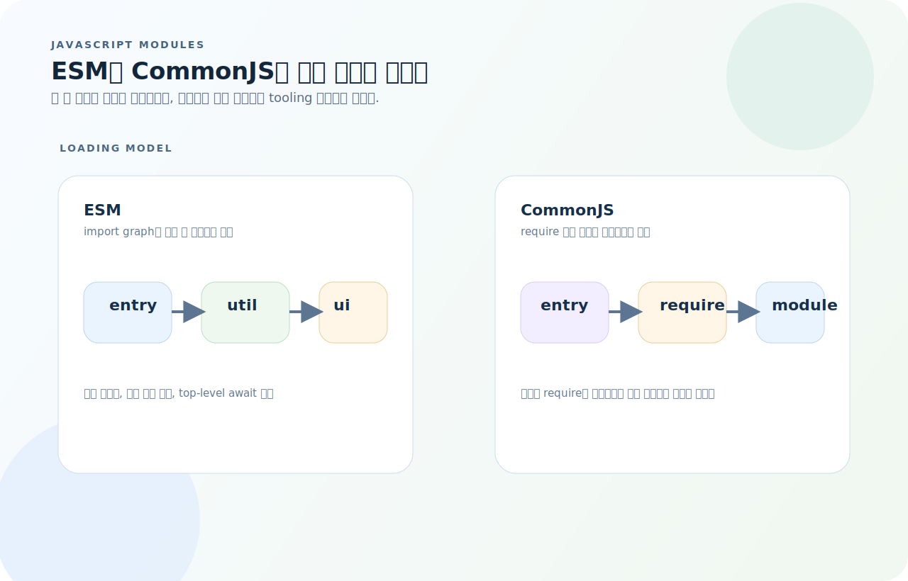

# JavaScript 완전 가이드

JavaScript는 웹의 유일한 프로그래밍 언어이자, Node.js를 통해 서버에서도 동작한다. TypeScript가 주력이더라도 결국 JS 런타임 위에서 실행되므로, 스코프와 클로저, event loop, 프로토타입, 모듈 로딩을 같이 이해해야 한다. 이 글은 문법보다 실행 모델을 먼저 잡는 방향으로 JavaScript를 정리한다.

먼저 아래 세 질문을 기준으로 읽으면 JavaScript 코드가 훨씬 빨리 읽힌다.

1. 이 변수는 어떤 스코프에 있고, 함수가 끝난 뒤에도 클로저로 살아남는가?
2. 이 비동기 코드는 event loop에서 어떤 큐를 거쳐 언제 실행되는가?
3. 이 메서드는 객체 자신의 속성인가, 프로토타입 체인 위에서 찾아지는가?

---

## 1. 변수 선언

```js
const name = "홍길동";    // 재할당 불가 (기본 선택)
let count = 0;            // 재할당 가능
// var은 사용하지 않는다 (함수 스코프, 호이스팅 문제)
```

| 키워드 | 스코프 | 재할당 | 호이스팅 |
|--------|--------|--------|----------|
| `const` | 블록 | ❌ | TDZ |
| `let` | 블록 | ✅ | TDZ |
| `var` | 함수 | ✅ | undefined |

> `const`가 기본. 재할당이 필요할 때만 `let`. `var`는 쓰지 않는다.

---

## 2. 타입

```js
// 원시 타입 (primitive)
typeof 42;            // "number"
typeof "hello";       // "string"
typeof true;          // "boolean"
typeof undefined;     // "undefined"
typeof null;          // "object" (역사적 버그)
typeof Symbol();      // "symbol"
typeof 42n;           // "bigint"

// 참조 타입
typeof {};            // "object"
typeof [];            // "object" — Array.isArray()로 구분
typeof function(){};  // "function"
```

### 동등 비교

```js
// ❌ == (타입 변환 발생)
0 == "";       // true
null == undefined;  // true

// ✅ === (타입까지 비교)
0 === "";      // false
null === undefined; // false
```

> 항상 `===` / `!==`를 사용한다.

---

## 3. 함수

함수는 선언 문법보다 "어떤 상태를 닫아두는가"를 먼저 봐야 한다. JavaScript에서 함수는 코드 조각이 아니라 스코프를 기억하는 객체다.



- 내부 함수는 외부 함수가 끝난 뒤에도 자신이 캡처한 변수를 계속 읽고 쓸 수 있다.
- 같은 팩토리 함수에서 만들어진 메서드는 같은 렉시컬 환경을 공유한다.
- 상태를 숨기고 공개 메서드만 노출하는 패턴이 클로저의 가장 흔한 활용이다.

```js
// 함수 선언 (호이스팅됨)
function add(a, b) {
  return a + b;
}

// 화살표 함수 (this 바인딩 없음)
const add = (a, b) => a + b;

// 기본값
function greet(name = "세계") {
  return `안녕, ${name}!`;
}

// 나머지 매개변수
function sum(...nums) {
  return nums.reduce((acc, n) => acc + n, 0);
}
```

### 클로저

```js
function createCounter() {
  let count = 0;
  return {
    increment: () => ++count,
    getCount: () => count,
  };
}

const counter = createCounter();
counter.increment();   // 1
counter.increment();   // 2
counter.getCount();    // 2
```

---

## 4. 객체와 배열

### 객체

```js
const user = { name: "홍길동", age: 25 };

// 접근
user.name;
user["name"];

// 구조 분해
const { name, age } = user;

// 스프레드 (얕은 복사)
const updated = { ...user, age: 26 };

// 계산된 속성명
const key = "email";
const obj = { [key]: "hong@example.com" };

// Optional chaining + Nullish coalescing
const city = user?.address?.city ?? "서울";
```

### 배열

```js
const nums = [1, 2, 3, 4, 5];

// 변환 (원본 불변)
nums.map(n => n * 2);           // [2, 4, 6, 8, 10]
nums.filter(n => n > 3);        // [4, 5]
nums.find(n => n > 3);          // 4
nums.some(n => n > 3);          // true
nums.every(n => n > 0);         // true
nums.reduce((acc, n) => acc + n, 0);  // 15

// 구조 분해
const [first, second, ...rest] = nums;

// 스프레드
const combined = [...nums, 6, 7];

// 포함 여부
nums.includes(3);   // true

// 정렬 (원본 변경!)
nums.sort((a, b) => a - b);        // 오름차순
nums.toSorted((a, b) => a - b);    // 원본 불변 (ES2023)
```

---

## 5. 비동기

JavaScript 비동기는 "병렬 실행"보다 "언제 콜백이 다시 스택에 올라오는가"를 보는 편이 정확하다.



- 현재 call stack이 비면 microtask queue가 먼저 비워지고, 그 다음에 task queue가 처리된다.
- `Promise.then`과 `await` 이후 코드는 microtask로 이어지고, `setTimeout`은 task queue에 들어간다.
- `Promise.all`은 병렬 시작을 묶는 도구이지, event loop 자체를 바꾸는 것은 아니다.

### Promise

```js
function fetchUser(id) {
  return fetch(`/api/users/${id}`)
    .then(res => {
      if (!res.ok) throw new Error(`HTTP ${res.status}`);
      return res.json();
    });
}

// 체이닝
fetchUser(1)
  .then(user => console.log(user.name))
  .catch(err => console.error(err));
```

### async/await

```js
async function getUser(id) {
  const res = await fetch(`/api/users/${id}`);
  if (!res.ok) throw new Error(`HTTP ${res.status}`);
  return res.json();
}

// 에러 처리
try {
  const user = await getUser(1);
} catch (err) {
  console.error("Failed:", err.message);
}
```

### 병렬 실행

```js
// Promise.all — 모두 성공해야 함
const [users, posts] = await Promise.all([
  fetch("/api/users").then(r => r.json()),
  fetch("/api/posts").then(r => r.json()),
]);

// Promise.allSettled — 실패해도 결과 반환
const results = await Promise.allSettled([
  fetch("/api/a"),
  fetch("/api/b"),
]);
// results[0].status === "fulfilled" | "rejected"
```

---

## 6. 클래스

```js
class Animal {
  #name;   // private 필드

  constructor(name) {
    this.#name = name;
  }

  get name() { return this.#name; }

  speak() {
    return `${this.#name} makes a sound`;
  }
}

class Dog extends Animal {
  #breed;

  constructor(name, breed) {
    super(name);
    this.#breed = breed;
  }

  speak() {
    return `${this.name} barks`;
  }
}
```

---

## 7. 프로토타입

클래스 문법을 쓰더라도 런타임에서는 결국 프로토타입 체인으로 메서드를 찾는다.



- 인스턴스에 없는 속성은 `Dog.prototype`, `Animal.prototype`, `Object.prototype` 순서로 올라가며 찾는다.
- 클래스 메서드는 인스턴스마다 복사되지 않고 보통 `prototype` 객체에 놓인다.
- `instanceof`는 이 체인 안에 특정 생성자의 `prototype`이 있는지 검사한다.

```js
// 모든 객체는 프로토타입 체인을 가진다
const arr = [1, 2, 3];
// arr → Array.prototype → Object.prototype → null

// 클래스는 프로토타입의 문법적 설탕
typeof Dog;                           // "function"
Dog.prototype.speak;                  // 메서드가 여기에 존재
new Dog("Rex", "Lab") instanceof Animal;  // true
```

---

## 8. 모듈 시스템

모듈 시스템은 문법 차이만이 아니라 "의존성을 언제 분석하느냐"가 다르다.



- ESM은 import 그래프를 정적으로 분석할 수 있어서 트리 쉐이킹과 순환 의존성 추적에 유리하다.
- CommonJS는 `require()`가 실행될 때 모듈을 불러오므로 런타임 분기가 자유롭지만 분석 가능성은 낮다.
- 브라우저와 최신 Node 환경에서는 ESM을 기본으로 보고, 레거시 패키지와 섞일 때만 CJS 경계를 의식하면 된다.

### ESM (ES Modules) — 표준

```js
// 내보내기
export function add(a, b) { return a + b; }
export const PI = 3.14;
export default class App { }

// 가져오기
import App, { add, PI } from "./math.js";
import * as math from "./math.js";

// 동적 import
const module = await import("./heavy-module.js");
```

### CommonJS — Node.js 레거시

```js
// 내보내기
module.exports = { add, PI };
// 또는
exports.add = (a, b) => a + b;

// 가져오기
const { add } = require("./math");
```

| | ESM | CommonJS |
|--|-----|----------|
| 문법 | `import`/`export` | `require`/`module.exports` |
| 로딩 | 정적 분석 (트리 쉐이킹) | 런타임 동적 |
| 설정 | `"type": "module"` 또는 `.mjs` | 기본 또는 `.cjs` |

---

## 9. 이터레이터와 제너레이터

```js
// for...of
for (const item of [1, 2, 3]) { }
for (const char of "hello") { }
for (const [key, val] of map) { }

// 제너레이터
function* range(start, end) {
  for (let i = start; i < end; i++) {
    yield i;
  }
}

for (const n of range(0, 5)) {
  console.log(n);   // 0, 1, 2, 3, 4
}
```

---

## 10. Map / Set

```js
// Map — 키가 어떤 타입이든 가능
const map = new Map();
map.set("key", "value");
map.set(42, "number key");
map.get("key");       // "value"
map.has("key");       // true
map.size;             // 2
map.delete("key");

// Set — 고유 값만 저장
const set = new Set([1, 2, 2, 3]);
set.add(4);
set.has(3);           // true
set.size;             // 4
[...set];             // [1, 2, 3, 4]
```

---

## 11. 에러 처리

```js
// try/catch/finally
try {
  const data = JSON.parse(input);
} catch (err) {
  if (err instanceof SyntaxError) {
    console.error("Invalid JSON:", err.message);
  } else {
    throw err;   // 알 수 없는 에러는 다시 던짐
  }
} finally {
  cleanup();
}

// 커스텀 에러
class AppError extends Error {
  constructor(message, statusCode) {
    super(message);
    this.name = "AppError";
    this.statusCode = statusCode;
  }
}
```

---

## 12. 유용한 패턴

```js
// 디바운스
function debounce(fn, delay) {
  let timer;
  return (...args) => {
    clearTimeout(timer);
    timer = setTimeout(() => fn(...args), delay);
  };
}

// 딥 클론
const clone = structuredClone(original);   // 브라우저 + Node 17+

// Object 유틸리티
Object.keys(obj);        // 키 배열
Object.values(obj);      // 값 배열
Object.entries(obj);     // [키, 값] 배열
Object.fromEntries(entries); // 배열 → 객체
Object.assign({}, a, b); // 얕은 병합
```

---

## 13. 자주 하는 실수

| 실수 | 원인과 해결 |
|------|-------------|
| `await` 누락 | Promise 객체가 그대로 넘어옴 |
| `==` 사용 | `===`로 정확한 비교 |
| `undefined` vs `null` 혼동 | `??`로 둘 다 처리, `===`로 구분 |
| `var` 사용 | `const`/`let`으로 대체 |
| 배열 복사 시 참조만 복사 | `[...arr]` 또는 `structuredClone` |
| `this` 컨텍스트 유실 | 화살표 함수 또는 `.bind()` |
| `sort()` 원본 변경 | `.toSorted()` 또는 복사 후 정렬 |
| ESM/CJS 충돌 | `package.json`의 `"type"` 확인 |

---

## 14. 빠른 참조

```js
// 변수
const x = 1;  let y = 2;

// 함수
const fn = (a, b) => a + b;

// 객체/배열
const { name } = obj;         // 구조 분해
const arr2 = [...arr, item];  // 스프레드
obj?.prop ?? "default";       // 옵셔널 + 널리시

// 배열 메서드
.map() .filter() .find() .some() .every() .reduce()
.includes() .flat() .flatMap()

// 비동기
const data = await fetch(url).then(r => r.json());
const [a, b] = await Promise.all([p1, p2]);

// 모듈
import { fn } from "./module.js";
export function fn() { }
```
