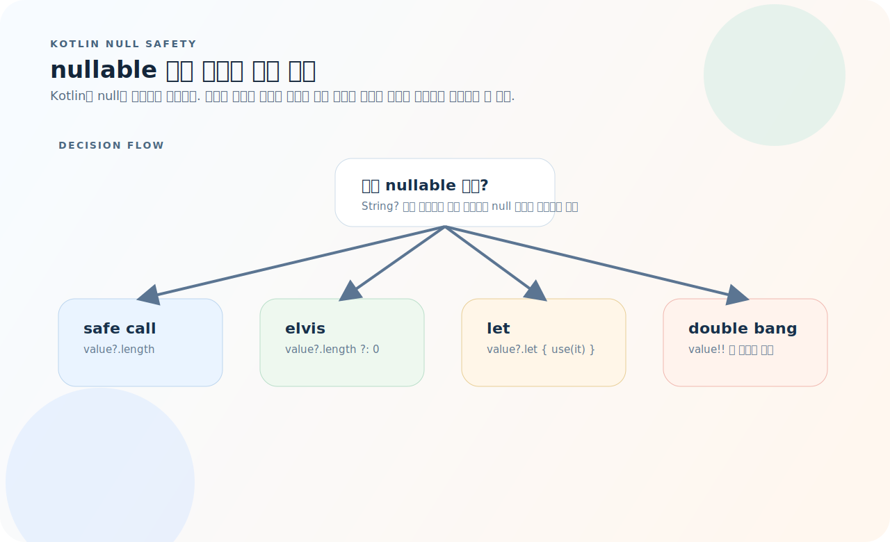
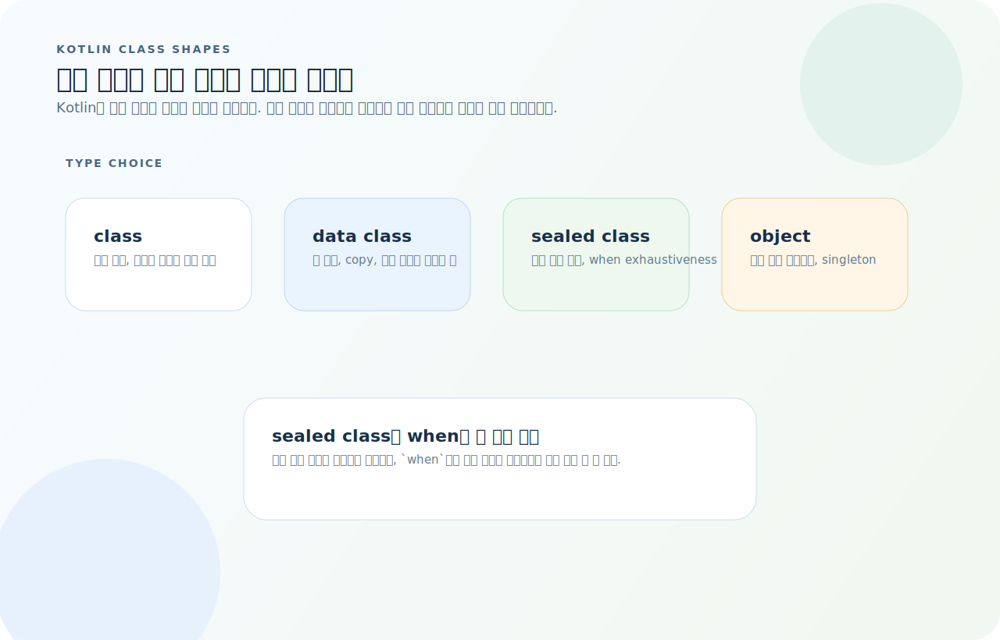
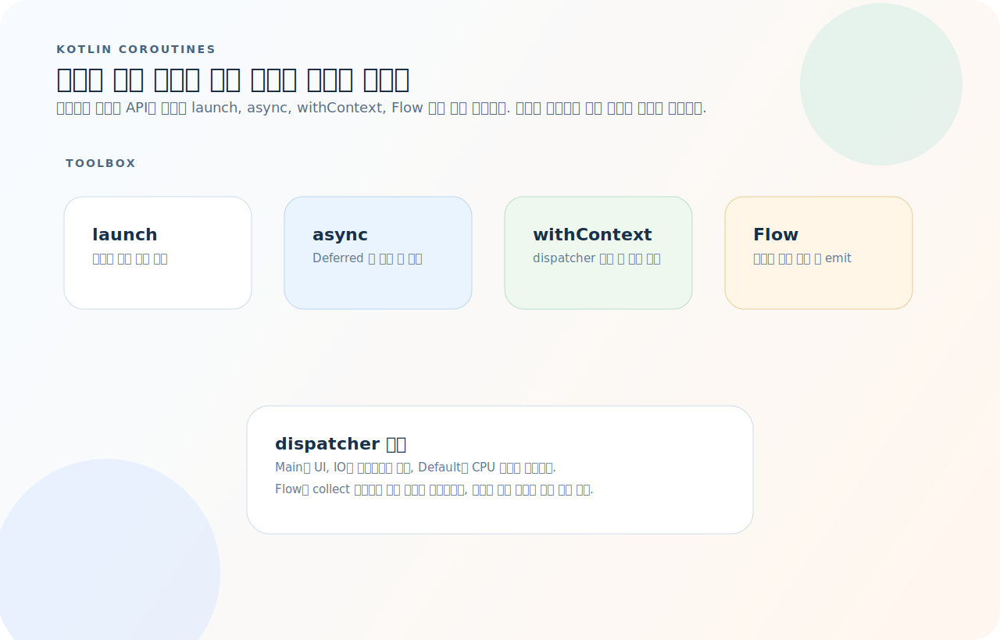
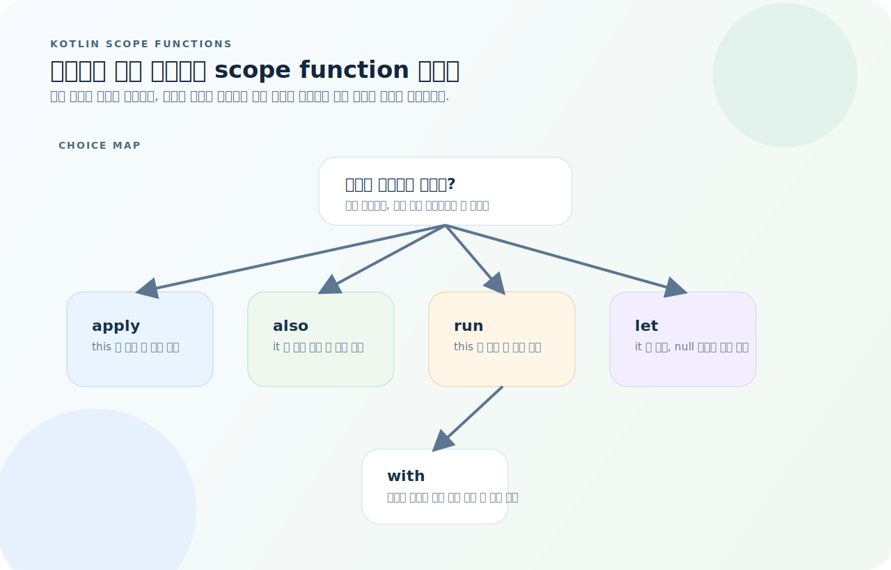

# Kotlin 완전 가이드

Kotlin은 JVM 위에서 동작하는 현대적 언어로, Android 공식 언어이자 서버 사이드(Spring Boot 등)에서도 활발히 사용된다. 다만 문법이 간결하다고 해서 사고 방식까지 단순한 것은 아니다. Null Safety, 클래스 모델링, 코루틴, 스코프 함수를 어떤 기준으로 쓰는지가 코드 품질을 크게 좌우한다. 이 글은 Kotlin을 실무에서 읽고 쓰는 기준부터 잡는다.

먼저 아래 세 질문을 기준으로 읽으면 Kotlin 코드가 훨씬 빨리 정리된다.

1. 이 값은 nullable인가, 어떤 연산자로 null 분기를 안전하게 없앨 것인가?
2. 이 상태를 일반 class, data class, sealed class, object 중 무엇으로 표현해야 하는가?
3. 이 비동기 작업은 어떤 scope와 dispatcher에서 실행되고, 단일 값인지 스트림인지 무엇을 반환하는가?

---

## 1. 변수와 타입

```kotlin
val name: String = "홍길동"     // 불변 (재할당 불가)
var count: Int = 0              // 가변

// 타입 추론
val message = "안녕"            // String
val pi = 3.14                   // Double
val flag = true                 // Boolean

// 상수 (컴파일 타임)
const val MAX_SIZE = 100
```

### 기본 타입

| 타입 | 설명 |
|------|------|
| `Int`, `Long` | 정수 |
| `Double`, `Float` | 부동소수점 |
| `Boolean` | 참/거짓 |
| `Char` | 문자 |
| `String` | 문자열 |
| `Unit` | 반환값 없음 (Java의 `void`) |
| `Nothing` | 정상 반환 불가 (예외만 던짐) |

### 문자열 템플릿

```kotlin
val name = "세계"
println("안녕, $name!")                    // 변수
println("길이: ${name.length}")           // 표현식
```

---

## 2. Null Safety

Kotlin의 타입 시스템은 **컴파일 타임에 null을 방지**한다.



- nullable 타입은 `?.`로 안전 호출하고, 기본값이 필요하면 `?:`로 분기를 닫는다.
- null이 아닐 때만 블록을 실행하려면 `?.let { ... }` 패턴이 가장 흔하다.
- `!!`는 타입 시스템을 우회하므로 마지막 수단으로만 남겨야 한다.

```kotlin
var name: String = "홍길동"     // null 불가
var nickname: String? = null    // null 허용 (? 접미사)

// 안전 호출
nickname?.length                // null이면 null 반환

// 엘비스 연산자
val len = nickname?.length ?: 0 // null이면 0

// let — null이 아닐 때만 실행
nickname?.let { println(it) }

// !! — null이면 NPE (가능한 사용 금지)
val len = nickname!!.length
```

> `!!`는 최후의 수단. `?.`, `?:`, `let`으로 안전하게 처리한다.

---

## 3. 함수

```kotlin
// 기본
fun add(a: Int, b: Int): Int {
    return a + b
}

// 표현식 본문
fun add(a: Int, b: Int): Int = a + b

// 기본값 + 이름 있는 인자
fun greet(name: String, greeting: String = "안녕") = "$greeting, $name!"
greet("세계")                           // "안녕, 세계!"
greet("세계", greeting = "Hello")       // "Hello, 세계!"

// 가변 인자
fun sum(vararg nums: Int): Int = nums.sum()
sum(1, 2, 3)

// 확장 함수
fun String.isEmail(): Boolean = this.contains("@")
"test@example.com".isEmail()   // true
```

### 고차 함수와 람다

```kotlin
fun operate(a: Int, b: Int, op: (Int, Int) -> Int): Int = op(a, b)

operate(3, 4) { a, b -> a + b }   // 7

// 후행 람다
listOf(1, 2, 3).map { it * 2 }    // [2, 4, 6]

// 함수 참조
listOf("a", "bb", "ccc").sortedBy(String::length)
```

---

## 4. 클래스

Kotlin의 클래스 문법은 간결하지만, 어떤 종류의 클래스를 고르느냐에 따라 생성되는 의미가 크게 달라진다.



- 순수 값 묶음이면 `data class`, 제한된 상태 집합이면 `sealed class`, 전역 단일 인스턴스면 `object`가 맞다.
- `sealed class`와 `when`을 같이 쓰면 분기 누락을 컴파일러가 잡아준다.
- 역할이 분명해질수록 `copy`, `equals`, exhaustiveness 같은 언어 기능을 바로 활용할 수 있다.

### 기본 클래스

```kotlin
class User(
    val id: Int,
    val name: String,
    var email: String,
)

val user = User(1, "홍길동", "hong@example.com")
user.name          // "홍길동"
user.email = "new@example.com"
```

### data class — 값 객체

```kotlin
data class Point(val x: Int, val y: Int)
// equals, hashCode, toString, copy 자동 생성

val p1 = Point(1, 2)
val p2 = p1.copy(x = 3)   // Point(3, 2)

// 구조 분해
val (x, y) = p1
```

### sealed class — 제한된 상속

```kotlin
sealed class Result<out T> {
    data class Success<T>(val data: T) : Result<T>()
    data class Error(val message: String) : Result<Nothing>()
    data object Loading : Result<Nothing>()
}

fun handle(result: Result<String>) {
    when (result) {
        is Result.Success -> println(result.data)
        is Result.Error -> println(result.message)
        is Result.Loading -> println("로딩 중...")
    }
}
```

### enum class

```kotlin
enum class Status(val code: Int) {
    ACTIVE(1),
    INACTIVE(0),
    SUSPENDED(-1);

    fun isActive(): Boolean = this == ACTIVE
}
```

### object — 싱글턴

```kotlin
object Database {
    fun connect() { }
}
Database.connect()

// companion object — 정적 메서드 역할
class User(val name: String) {
    companion object {
        fun fromJson(json: String): User = User(json)
    }
}
User.fromJson("홍길동")
```

---

## 5. 인터페이스와 상속

```kotlin
interface Drawable {
    fun draw()
    fun description(): String = "Drawable"   // 기본 구현
}

abstract class Shape(val name: String) {
    abstract fun area(): Double
}

class Circle(val radius: Double) : Shape("원"), Drawable {
    override fun area(): Double = Math.PI * radius * radius
    override fun draw() { println("○") }
}
```

---

## 6. 컬렉션

```kotlin
// 불변 (기본)
val list = listOf(1, 2, 3)
val set = setOf(1, 2, 3)
val map = mapOf("a" to 1, "b" to 2)

// 가변
val mutableList = mutableListOf(1, 2, 3)
mutableList.add(4)

val mutableMap = mutableMapOf("a" to 1)
mutableMap["b"] = 2
```

### 컬렉션 연산

```kotlin
val items = listOf(1, 2, 3, 4, 5)

items.map { it * 2 }              // [2, 4, 6, 8, 10]
items.filter { it > 3 }           // [4, 5]
items.find { it > 3 }             // 4
items.any { it > 3 }              // true
items.all { it > 0 }              // true
items.groupBy { if (it % 2 == 0) "짝" else "홀" }
items.sortedByDescending { it }   // [5, 4, 3, 2, 1]
items.take(3)                     // [1, 2, 3]
items.sumOf { it }                // 15
items.associateBy { it }          // Map<Int, Int>

// flatMap
listOf(listOf(1, 2), listOf(3, 4)).flatMap { it }  // [1, 2, 3, 4]

// zip
listOf("a", "b").zip(listOf(1, 2))  // [(a, 1), (b, 2)]
```

---

## 7. when 표현식

```kotlin
// 값 매칭
when (x) {
    0 -> "zero"
    in 1..10 -> "1~10"
    else -> "other"
}

// 타입 체크
when (obj) {
    is String -> obj.length           // 스마트 캐스트
    is Int -> obj + 1
    else -> throw IllegalArgumentException()
}

// 조건식
when {
    score >= 90 -> "A"
    score >= 80 -> "B"
    else -> "C"
}
```

---

## 8. 코루틴

코루틴은 단순히 "스레드를 덜 쓰는 비동기"가 아니라, 어떤 결과 형태와 실행 문맥이 필요한지에 따라 도구를 고르는 모델이다.



- 반환값이 필요 없으면 `launch`, 단일 값을 병렬로 모으려면 `async/await`, 컨텍스트 전환만 필요하면 `withContext`가 맞다.
- 여러 값을 시간에 따라 흘려보내려면 `Flow`를 쓰고, 최종 소비 지점에서 `collect`한다.
- dispatcher 선택은 UI, I/O, CPU 작업의 성격을 분리하는 장치다.

```kotlin
import kotlinx.coroutines.*

// 기본
fun main() = runBlocking {
    launch {
        delay(1000)
        println("World")
    }
    println("Hello")
}
// Hello → (1초) → World

// suspend 함수
suspend fun fetchUser(id: Int): User {
    delay(1000)   // 비동기 대기
    return User(id, "홍길동")
}

// 병렬 실행
suspend fun loadDashboard() = coroutineScope {
    val users = async { fetchUsers() }
    val posts = async { fetchPosts() }
    Dashboard(users.await(), posts.await())
}
```

### CoroutineScope / Dispatcher

```kotlin
// Dispatchers
Dispatchers.Main       // UI 스레드 (Android)
Dispatchers.IO         // 네트워크/파일 I/O
Dispatchers.Default    // CPU 집약 작업

// withContext — 디스패처 전환
suspend fun readFile(): String = withContext(Dispatchers.IO) {
    File("data.txt").readText()
}
```

### Flow — 비동기 스트림

```kotlin
fun numbers(): Flow<Int> = flow {
    for (i in 1..5) {
        delay(100)
        emit(i)
    }
}

numbers()
    .filter { it % 2 == 0 }
    .map { it * 10 }
    .collect { println(it) }   // 20, 40
```

---

## 9. 스코프 함수

스코프 함수는 다섯 개를 외우기보다 "무엇을 반환해야 하는가"와 "객체를 `this`로 볼지 `it`로 볼지"로 고르면 된다.



- 객체 자체를 유지하면서 부수 효과만 넣고 싶으면 `also`, 객체를 구성하고 그대로 돌려주고 싶으면 `apply`가 맞다.
- 람다 결과를 돌려받고 싶으면 `let`, `run`, `with`를 검토한다.
- null 체크와 변환은 `let`, 설정 후 계산은 `run`, 단순 묶음 호출은 `with`가 가장 읽기 쉽다.

| 함수 | 객체 참조 | 반환 | 용도 |
|------|----------|------|------|
| `let` | `it` | 람다 결과 | null 체크, 변환 |
| `run` | `this` | 람다 결과 | 객체 설정 + 결과 |
| `with` | `this` | 람다 결과 | 그룹 호출 |
| `apply` | `this` | 객체 | 객체 초기화 |
| `also` | `it` | 객체 | 부수 효과 (로깅 등) |

```kotlin
// let
val length = name?.let { it.length } ?: 0

// apply — 빌더 패턴
val user = User().apply {
    this.name = "홍길동"
    this.email = "hong@example.com"
}

// also — 디버깅
val result = compute()
    .also { println("result: $it") }
```

---

## 10. Android 연동

### Activity

```kotlin
class MainActivity : ComponentActivity() {
    override fun onCreate(savedInstanceState: Bundle?) {
        super.onCreate(savedInstanceState)
        setContent {
            MyApp()
        }
    }
}
```

### Gradle

```kotlin
// build.gradle.kts
plugins {
    id("com.android.application")
    kotlin("android")
}

android {
    compileSdk = 34
    defaultConfig {
        applicationId = "com.example.myapp"
        minSdk = 24
        targetSdk = 34
    }
}
```

```bash
./gradlew assembleDebug    # 디버그 APK 빌드
./gradlew test             # 단위 테스트
./gradlew clean            # 빌드 정리
```

---

## 11. 자주 하는 실수

| 실수 | 원인과 해결 |
|------|-------------|
| `!!` 남용 | `?.let`, `?:` 사용 |
| `var` 남용 | `val` 기본, 필요시만 `var` |
| 가변 컬렉션 기본 사용 | `listOf`/`mapOf` 불변 기본 |
| 코루틴 스코프 미관리 | `viewModelScope` 등 생명주기 스코프 사용 |
| `when` 분기 누락 | sealed class + `when` → 컴파일러가 체크 |
| 패키지/클래스명 변경 후 manifest 미반영 | `AndroidManifest.xml` 동기화 |

---

## 12. 빠른 참조

```kotlin
// 변수
val x = 1; var y = 2

// Null Safety
value?.length  ?: 0
value?.let { use(it) }

// 컬렉션
listOf(1,2,3).map { }.filter { }.sortedBy { }

// 클래스
data class User(val name: String)
sealed class Result { ... }
object Singleton { }

// 코루틴
launch { }  async { }.await()
withContext(Dispatchers.IO) { }
flow { emit(value) }.collect { }

// 빌드
./gradlew assembleDebug
./gradlew test
```
