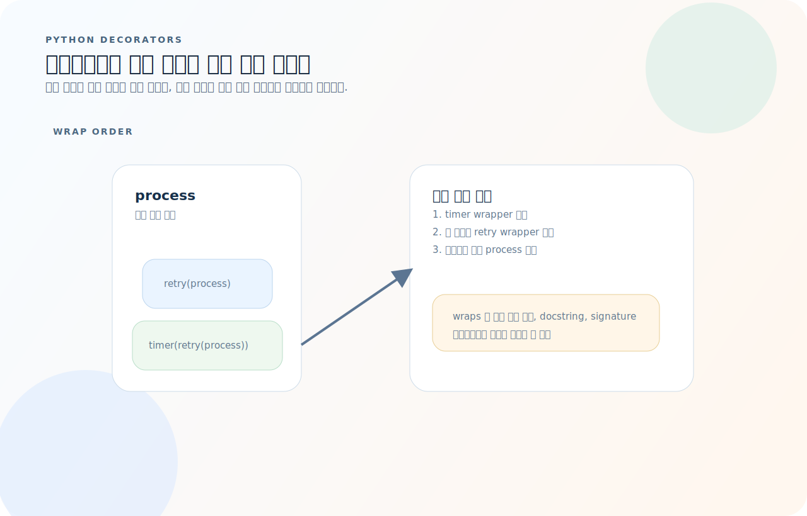
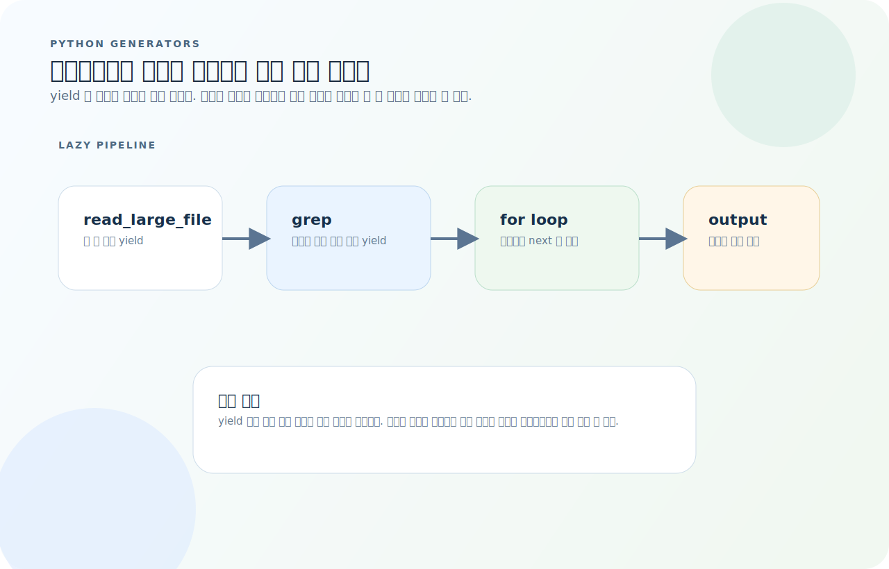
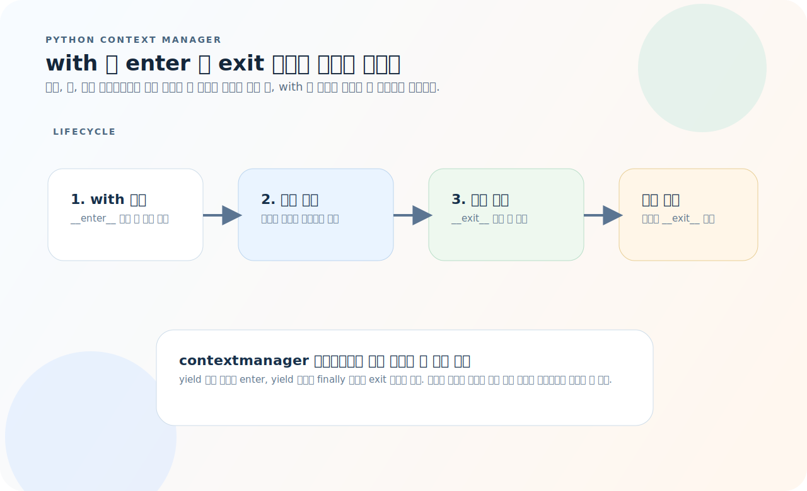
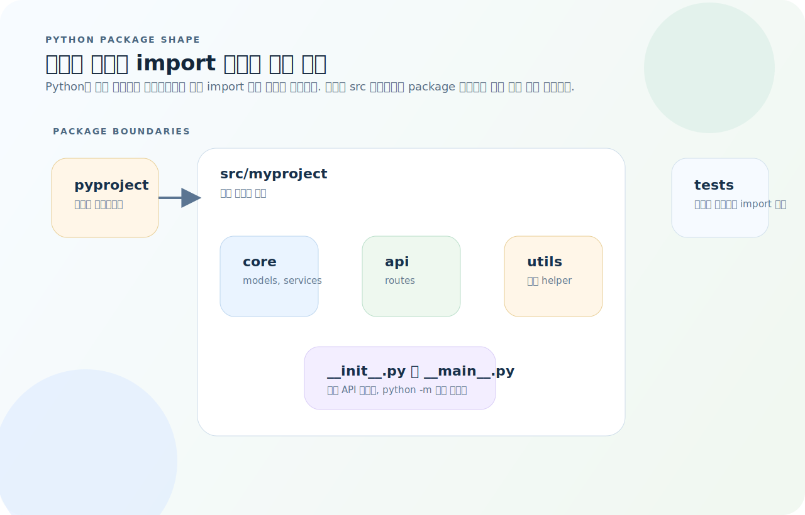

# Python 완전 가이드

Python은 문법이 읽기 쉬운 대신, 실행 시점의 규칙을 놓치면 코드가 왜 그렇게 동작하는지 감이 흐려지기 쉽다. 특히 데코레이터, 제너레이터, 컨텍스트 매니저, import 시스템은 "문법은 짧지만 의미는 깊은" 기능들이다. 이 글은 기능 목록보다 실행 모델을 먼저 잡는 방식으로 Python을 정리한다.

먼저 아래 세 질문을 기준으로 읽으면 긴 Python 코드도 훨씬 빨리 읽힌다.

1. 이 함수는 즉시 실행되는가, 아니면 데코레이터나 제너레이터로 한 번 더 감싸져 있는가?
2. 이 자원은 `with` 블록을 벗어날 때 어떻게 정리되는가?
3. 이 이름은 어느 모듈과 패키지 경계를 통해 import 되었는가?

## 목차
1. [기본 문법](#1-기본-문법)
2. [데이터 타입](#2-데이터-타입)
3. [문자열](#3-문자열)
4. [컬렉션 — list, dict, set, tuple](#4-컬렉션--list-dict-set-tuple)
5. [함수](#5-함수)
6. [클래스](#6-클래스)
7. [데코레이터](#7-데코레이터)
8. [제너레이터와 이터레이터](#8-제너레이터와-이터레이터)
9. [컨텍스트 매니저](#9-컨텍스트-매니저)
10. [타입 힌트](#10-타입-힌트)
11. [예외 처리](#11-예외-처리)
12. [모듈과 패키지](#12-모듈과-패키지)
13. [유용한 표준 라이브러리](#13-유용한-표준-라이브러리)
14. [자주 하는 실수](#14-자주-하는-실수)
15. [빠른 참조](#15-빠른-참조)

---

## 1. 기본 문법

### 변수와 할당

```python
# 타입 선언 없이 할당
name = "Alice"
age = 30
pi = 3.14
is_active = True

# 다중 할당
x, y, z = 1, 2, 3
a = b = c = 0

# swap — 임시 변수 필요 없음
x, y = y, x
```

### 조건문

```python
score = 85

if score >= 90:
    grade = "A"
elif score >= 80:
    grade = "B"
else:
    grade = "C"

# 삼항 연산자
status = "pass" if score >= 60 else "fail"

# 연속 비교 (chained comparison)
if 0 < score < 100:
    print("유효한 점수")
```

### 반복문

```python
# for — iterable 순회
for i in range(5):          # 0, 1, 2, 3, 4
    print(i)

for i in range(2, 10, 3):   # 2, 5, 8
    print(i)

# enumerate — 인덱스와 값을 동시에
fruits = ["apple", "banana", "cherry"]
for idx, fruit in enumerate(fruits):
    print(f"{idx}: {fruit}")

# zip — 여러 iterable 병렬 순회
names = ["Alice", "Bob"]
scores = [90, 85]
for name, score in zip(names, scores):
    print(f"{name}: {score}")

# while
count = 0
while count < 5:
    count += 1

# for-else — break 없이 정상 종료 시 else 실행
for n in range(2, 10):
    for d in range(2, n):
        if n % d == 0:
            break
    else:
        print(f"{n}은 소수")
```

### Comprehension

```python
# list comprehension
squares = [x ** 2 for x in range(10)]
evens = [x for x in range(20) if x % 2 == 0]

# dict comprehension
word_lengths = {w: len(w) for w in ["hello", "world"]}

# set comprehension
unique_lengths = {len(w) for w in ["aa", "bb", "ccc"]}

# 중첩 comprehension
matrix = [[1, 2], [3, 4], [5, 6]]
flat = [x for row in matrix for x in row]  # [1, 2, 3, 4, 5, 6]

# generator expression — 메모리 절약 (괄호)
total = sum(x ** 2 for x in range(1000000))
```

---

## 2. 데이터 타입

### 숫자

```python
# int — 크기 제한 없음
big = 10 ** 100
binary = 0b1010      # 10
octal = 0o77         # 63
hexa = 0xFF          # 255
readable = 1_000_000 # 언더스코어 구분

# float — IEEE 754 배정밀도
pi = 3.14159
sci = 1.5e-3         # 0.0015

# 부동소수점 비교 주의
0.1 + 0.2 == 0.3     # False!
import math
math.isclose(0.1 + 0.2, 0.3)  # True

# Decimal — 정밀 계산
from decimal import Decimal
price = Decimal("19.99") * 3   # Decimal('59.97')
```

### bool

```python
# Falsy 값: False, 0, 0.0, "", [], {}, set(), None
# Truthy: 그 외 전부

# bool은 int의 서브클래스
True + True   # 2
False + 1     # 1

# any / all
any([False, False, True])   # True
all([True, True, False])    # False
```

### None

```python
result = None

# None 비교는 반드시 is 사용
if result is None:
    print("결과 없음")

# is not
if result is not None:
    print("결과 있음")
```

---

## 3. 문자열

### 기본 조작

```python
s = "Hello, World!"

s.lower()           # "hello, world!"
s.upper()           # "HELLO, WORLD!"
s.strip()           # 양쪽 공백 제거
s.split(", ")       # ["Hello", "World!"]
", ".join(["a", "b"])  # "a, b"
s.replace("World", "Python")  # "Hello, Python!"
s.startswith("Hello")  # True
s.find("World")     # 7 (없으면 -1)
s.count("l")        # 3
```

### f-string (Python 3.6+)

```python
name = "Alice"
age = 30

# 기본
print(f"이름: {name}, 나이: {age}")

# 표현식
print(f"내년 나이: {age + 1}")

# 포맷 지정
pi = 3.14159
print(f"파이: {pi:.2f}")       # "파이: 3.14"
print(f"{'hi':>10}")           # "        hi" (우측 정렬)
print(f"{'hi':<10}")           # "hi        " (좌측 정렬)
print(f"{'hi':^10}")           # "    hi    " (가운데 정렬)
print(f"{1000000:,}")          # "1,000,000"
print(f"{255:#x}")             # "0xff"

# 디버깅용 (Python 3.8+)
x = 42
print(f"{x = }")               # "x = 42"
```

### 멀티라인 문자열

```python
# 삼중 따옴표
text = """
첫 번째 줄
두 번째 줄
"""

# textwrap.dedent로 들여쓰기 제거
import textwrap
def help_message():
    return textwrap.dedent("""\
        사용법: command [options]
        옵션:
          -h  도움말
          -v  버전
    """)
```

### 정규표현식

```python
import re

text = "전화: 010-1234-5678, 이메일: test@example.com"

# 검색
match = re.search(r"\d{3}-\d{4}-\d{4}", text)
if match:
    print(match.group())  # "010-1234-5678"

# 모두 찾기
phones = re.findall(r"\d{3}-\d{4}-\d{4}", text)

# 치환
cleaned = re.sub(r"\d", "*", text)

# 그룹
pattern = r"(?P<area>\d{3})-(?P<mid>\d{4})-(?P<last>\d{4})"
m = re.search(pattern, text)
if m:
    print(m.group("area"))  # "010"

# 컴파일 — 반복 사용 시 성능 이점
phone_re = re.compile(r"\d{3}-\d{4}-\d{4}")
phone_re.findall(text)
```

---

## 4. 컬렉션 — list, dict, set, tuple

### list

```python
nums = [1, 2, 3, 4, 5]

# 인덱싱·슬라이싱
nums[0]       # 1
nums[-1]      # 5
nums[1:3]     # [2, 3]
nums[::-1]    # [5, 4, 3, 2, 1] (역순)
nums[::2]     # [1, 3, 5] (짝수 인덱스)

# 수정
nums.append(6)
nums.extend([7, 8])
nums.insert(0, 0)     # 맨 앞에 삽입
nums.pop()             # 마지막 제거 후 반환
nums.pop(0)            # 인덱스 0 제거
nums.remove(3)         # 값 3 첫 번째 제거

# 정렬
nums.sort()                      # in-place
nums.sort(reverse=True)          # 내림차순
sorted_nums = sorted(nums)      # 새 리스트 반환
sorted(nums, key=lambda x: -x)  # 키 함수

# 언패킹
first, *rest = [1, 2, 3, 4]     # first=1, rest=[2, 3, 4]
first, *mid, last = [1, 2, 3, 4] # first=1, mid=[2, 3], last=4
```

### dict

```python
user = {"name": "Alice", "age": 30, "role": "admin"}

# 접근
user["name"]                  # "Alice" (키 없으면 KeyError)
user.get("email", "없음")     # "없음" (기본값)

# 수정
user["email"] = "a@b.com"     # 추가·수정
del user["role"]               # 삭제
user.pop("age", None)          # 제거 후 반환 (없으면 None)

# 순회
for key, value in user.items():
    print(f"{key}: {value}")

# 병합 (Python 3.9+)
defaults = {"theme": "dark", "lang": "ko"}
overrides = {"lang": "en"}
config = defaults | overrides  # {"theme": "dark", "lang": "en"}

# defaultdict — 키 없을 때 기본값 자동 생성
from collections import defaultdict
counter = defaultdict(int)
for word in ["a", "b", "a", "a"]:
    counter[word] += 1         # {"a": 3, "b": 1}

# 그룹핑
groups = defaultdict(list)
for name, dept in [("Alice", "eng"), ("Bob", "eng"), ("Carol", "hr")]:
    groups[dept].append(name)
```

### set

```python
a = {1, 2, 3, 4}
b = {3, 4, 5, 6}

a | b    # 합집합: {1, 2, 3, 4, 5, 6}
a & b    # 교집합: {3, 4}
a - b    # 차집합: {1, 2}
a ^ b    # 대칭차: {1, 2, 5, 6}

a.add(5)
a.discard(10)     # 없어도 에러 없음
a.remove(1)       # 없으면 KeyError

# in 검사: O(1) — list의 O(n)보다 압도적으로 빠름
valid_ids = {1001, 1002, 1003}
if user_id in valid_ids:
    pass
```

### tuple

```python
# 불변 시퀀스 — dict 키나 set 원소로 사용 가능
point = (3, 4)
x, y = point

# namedtuple — 필드 이름으로 접근
from collections import namedtuple
Point = namedtuple("Point", ["x", "y"])
p = Point(3, 4)
print(p.x, p.y)   # 3, 4
```

### 시간복잡도 비교

| 연산 | list | dict | set |
|------|------|------|-----|
| 접근 (인덱스/키) | O(1) | O(1) | — |
| 검색 (`in`) | O(n) | O(1) | O(1) |
| 삽입 | O(1)* | O(1) | O(1) |
| 삭제 | O(n) | O(1) | O(1) |
| 정렬 | O(n log n) | — | — |

*`append`는 amortized O(1), `insert(0, x)`는 O(n)

---

## 5. 함수

### 기본 정의

```python
def greet(name: str, greeting: str = "안녕하세요") -> str:
    return f"{greeting}, {name}!"

greet("Alice")                # "안녕하세요, Alice!"
greet("Bob", greeting="Hi")   # "Hi, Bob!"
```

### *args, **kwargs

```python
def log(*args, **kwargs):
    print("args:", args)       # 튜플
    print("kwargs:", kwargs)   # 딕셔너리

log(1, 2, 3, level="INFO")
# args: (1, 2, 3)
# kwargs: {"level": "INFO"}

# 언패킹으로 전달
def add(a, b, c):
    return a + b + c

nums = [1, 2, 3]
add(*nums)   # 6

config = {"a": 1, "b": 2, "c": 3}
add(**config)  # 6
```

### 키워드 전용 인자

```python
# * 뒤의 인자는 반드시 키워드로 전달해야 함
def fetch(url: str, *, timeout: int = 30, retries: int = 3):
    pass

fetch("https://api.example.com", timeout=10)  # OK
# fetch("https://api.example.com", 10)         # TypeError
```

### 클로저

```python
def make_counter(start: int = 0):
    count = start
    def increment():
        nonlocal count
        count += 1
        return count
    return increment

counter = make_counter()
counter()   # 1
counter()   # 2
```

### 람다

```python
# 짧은 일회성 함수
double = lambda x: x * 2

# 정렬 키로 자주 사용
users = [("Alice", 30), ("Bob", 25), ("Carol", 35)]
sorted(users, key=lambda u: u[1])   # 나이순 정렬

# map / filter
list(map(lambda x: x ** 2, [1, 2, 3]))    # [1, 4, 9]
list(filter(lambda x: x > 2, [1, 2, 3]))  # [3]
```

### functools 유틸리티

```python
from functools import lru_cache, partial, reduce

# lru_cache — 메모이제이션
@lru_cache(maxsize=128)
def fib(n: int) -> int:
    if n < 2:
        return n
    return fib(n - 1) + fib(n - 2)

fib(100)  # 즉시 계산

# partial — 인자 고정
import json
pretty_json = partial(json.dumps, indent=2, ensure_ascii=False)
print(pretty_json({"이름": "Alice"}))

# reduce — 누적
reduce(lambda acc, x: acc + x, [1, 2, 3, 4], 0)  # 10
```

---

## 6. 클래스

### 기본 클래스

```python
class User:
    # 클래스 변수
    _id_counter = 0

    def __init__(self, name: str, email: str):
        User._id_counter += 1
        self.id = User._id_counter
        self.name = name
        self.email = email

    def __repr__(self) -> str:
        return f"User(id={self.id}, name={self.name!r})"

    def __eq__(self, other: object) -> bool:
        if not isinstance(other, User):
            return NotImplemented
        return self.id == other.id
```

### dataclass (Python 3.7+)

```python
from dataclasses import dataclass, field

@dataclass
class Product:
    name: str
    price: float
    tags: list[str] = field(default_factory=list)

    @property
    def display_price(self) -> str:
        return f"₩{self.price:,.0f}"

p = Product("노트북", 1500000, ["전자기기"])
print(p)  # Product(name='노트북', price=1500000, tags=['전자기기'])

# frozen=True — 불변 객체
@dataclass(frozen=True)
class Point:
    x: float
    y: float

# slots=True — 메모리 절약 (Python 3.10+)
@dataclass(slots=True)
class Coord:
    lat: float
    lng: float
```

### 상속

```python
class Animal:
    def __init__(self, name: str):
        self.name = name

    def speak(self) -> str:
        raise NotImplementedError

class Dog(Animal):
    def speak(self) -> str:
        return f"{self.name}: 멍멍!"

class Cat(Animal):
    def speak(self) -> str:
        return f"{self.name}: 야옹!"

# 다형성
animals: list[Animal] = [Dog("바둑이"), Cat("나비")]
for a in animals:
    print(a.speak())
```

### 프로토콜 (구조적 타이핑, Python 3.8+)

```python
from typing import Protocol

class Drawable(Protocol):
    def draw(self) -> None: ...

class Circle:
    def draw(self) -> None:
        print("원 그리기")

class Square:
    def draw(self) -> None:
        print("사각형 그리기")

# Circle, Square는 Drawable을 상속하지 않지만 draw()가 있으므로 호환
def render(shape: Drawable) -> None:
    shape.draw()

render(Circle())   # OK
render(Square())   # OK
```

### 추상 클래스

```python
from abc import ABC, abstractmethod

class Repository(ABC):
    @abstractmethod
    def find_by_id(self, id: int) -> dict | None:
        pass

    @abstractmethod
    def save(self, entity: dict) -> None:
        pass

class InMemoryRepo(Repository):
    def __init__(self):
        self._store: dict[int, dict] = {}

    def find_by_id(self, id: int) -> dict | None:
        return self._store.get(id)

    def save(self, entity: dict) -> None:
        self._store[entity["id"]] = entity
```

### 매직 메서드

```python
class Vector:
    def __init__(self, x: float, y: float):
        self.x = x
        self.y = y

    def __add__(self, other: "Vector") -> "Vector":
        return Vector(self.x + other.x, self.y + other.y)

    def __abs__(self) -> float:
        return (self.x ** 2 + self.y ** 2) ** 0.5

    def __repr__(self) -> str:
        return f"Vector({self.x}, {self.y})"

    def __len__(self) -> int:
        return 2

    def __getitem__(self, idx: int) -> float:
        return (self.x, self.y)[idx]

v = Vector(3, 4)
abs(v)           # 5.0
v + Vector(1, 2) # Vector(4, 6)
v[0]             # 3
```

---

## 7. 데코레이터

데코레이터는 "함수를 바꾸는 문법"이라기보다, 호출 전에 래퍼를 한 층 더 씌우는 변환이다.



- `@decorator`는 정의 시점에 함수를 받아 새 함수를 돌려주는 문법 설탕이다.
- 여러 데코레이터를 쌓으면 아래에서 위로 적용되고, 실제 호출은 바깥 래퍼부터 안쪽으로 들어간다.
- `functools.wraps`를 써야 원래 함수 이름과 docstring이 유지된다.

### 기본 데코레이터

```python
import time
from functools import wraps

def timer(func):
    @wraps(func)  # 원래 함수의 이름·독스트링 유지
    def wrapper(*args, **kwargs):
        start = time.perf_counter()
        result = func(*args, **kwargs)
        elapsed = time.perf_counter() - start
        print(f"{func.__name__}: {elapsed:.4f}초")
        return result
    return wrapper

@timer
def slow_function():
    time.sleep(1)

slow_function()  # "slow_function: 1.0012초"
```

### 인자를 받는 데코레이터

```python
def retry(max_retries: int = 3, delay: float = 1.0):
    def decorator(func):
        @wraps(func)
        def wrapper(*args, **kwargs):
            for attempt in range(1, max_retries + 1):
                try:
                    return func(*args, **kwargs)
                except Exception as e:
                    if attempt == max_retries:
                        raise
                    print(f"재시도 {attempt}/{max_retries}: {e}")
                    time.sleep(delay)
        return wrapper
    return decorator

@retry(max_retries=5, delay=0.5)
def unstable_api_call():
    pass
```

### 클래스 데코레이터

```python
def singleton(cls):
    instances = {}
    @wraps(cls)
    def get_instance(*args, **kwargs):
        if cls not in instances:
            instances[cls] = cls(*args, **kwargs)
        return instances[cls]
    return get_instance

@singleton
class Database:
    def __init__(self):
        print("DB 연결")

db1 = Database()
db2 = Database()
print(db1 is db2)  # True
```

### 데코레이터 누적

```python
# 아래에서 위로 적용
@timer              # 2. timer(validated(process))
@retry(max_retries=3) # 1. retry(process)
def process(data: dict):
    pass
```

---

## 8. 제너레이터와 이터레이터

제너레이터는 값을 한 번에 다 만들지 않고, 소비자가 요청할 때마다 다음 값을 계산하는 lazy 파이프라인으로 이해하는 편이 빠르다.



- `yield`를 만나면 함수 상태를 저장한 채 멈추고, 다음 `next()` 호출 때 이어서 실행한다.
- 여러 제너레이터를 연결하면 대용량 데이터도 메모리 O(1)에 가깝게 처리할 수 있다.
- `yield from`은 중첩 iterable을 바깥 제너레이터에 그대로 위임하는 문법이다.

### 제너레이터 함수

```python
def count_up(start: int = 0):
    """무한 카운터"""
    n = start
    while True:
        yield n
        n += 1

# 필요한 만큼만 소비
counter = count_up(1)
next(counter)   # 1
next(counter)   # 2

# 유한 제너레이터
def fibonacci():
    a, b = 0, 1
    while True:
        yield a
        a, b = b, a + b

# 처음 10개
from itertools import islice
list(islice(fibonacci(), 10))  # [0, 1, 1, 2, 3, 5, 8, 13, 21, 34]
```

### 파일 읽기 — 제너레이터의 실전 활용

```python
def read_large_file(path: str):
    """대용량 파일을 메모리에 한꺼번에 올리지 않고 한 줄씩 처리"""
    with open(path) as f:
        for line in f:
            yield line.strip()

# 파이프라인 구성
def grep(lines, pattern: str):
    for line in lines:
        if pattern in line:
            yield line

# 체이닝 — 메모리 O(1)로 처리
errors = grep(read_large_file("app.log"), "ERROR")
for error in errors:
    print(error)
```

### yield from

```python
def flatten(nested):
    for item in nested:
        if isinstance(item, list):
            yield from flatten(item)
        else:
            yield item

list(flatten([1, [2, [3, 4]], 5]))  # [1, 2, 3, 4, 5]
```

### itertools

```python
from itertools import chain, groupby, product, combinations, permutations

# chain — 여러 iterable 연결
list(chain([1, 2], [3, 4]))  # [1, 2, 3, 4]

# groupby — 연속된 같은 키끼리 그룹핑 (정렬 필요!)
data = sorted([("A", 1), ("B", 2), ("A", 3)], key=lambda x: x[0])
for key, group in groupby(data, key=lambda x: x[0]):
    print(key, list(group))

# product — 데카르트 곱
list(product("AB", [1, 2]))  # [("A",1),("A",2),("B",1),("B",2)]

# combinations / permutations
list(combinations([1, 2, 3], 2))   # [(1,2),(1,3),(2,3)]
list(permutations([1, 2, 3], 2))   # [(1,2),(1,3),(2,1),(2,3),(3,1),(3,2)]
```

---

## 9. 컨텍스트 매니저

컨텍스트 매니저는 `try/finally`를 반복해서 쓰지 않도록, 자원 획득과 정리를 하나의 프로토콜로 묶는다.



- `with` 진입 시 `__enter__`가 실행되고, 블록을 벗어날 때는 예외 유무와 관계없이 `__exit__`가 호출된다.
- `contextmanager` 데코레이터는 같은 흐름을 generator 한 개로 간결하게 표현한 문법이다.
- 파일, 락, 임시 디렉터리처럼 짝이 맞아야 하는 자원을 다룰 때 특히 유용하다.

### with 문

```python
# 기본 — 파일, 락, DB 연결 등 리소스 자동 정리
with open("data.txt", "w") as f:
    f.write("hello")
# f.close()가 자동으로 호출됨

# 여러 컨텍스트 매니저 (Python 3.10+ 괄호 가능)
with (
    open("input.txt") as fin,
    open("output.txt", "w") as fout,
):
    fout.write(fin.read())
```

### 직접 만들기 — 클래스 방식

```python
class Timer:
    def __enter__(self):
        self.start = time.perf_counter()
        return self

    def __exit__(self, exc_type, exc_val, exc_tb):
        self.elapsed = time.perf_counter() - self.start
        print(f"소요 시간: {self.elapsed:.4f}초")
        return False  # 예외를 전파 (True면 억제)

with Timer() as t:
    time.sleep(0.5)
# "소요 시간: 0.5002초"
```

### 직접 만들기 — contextmanager 데코레이터

```python
from contextlib import contextmanager

@contextmanager
def temp_directory():
    import tempfile, shutil
    path = tempfile.mkdtemp()
    try:
        yield path        # yield 이전 = __enter__, 이후 = __exit__
    finally:
        shutil.rmtree(path)

with temp_directory() as tmpdir:
    print(f"임시 디렉터리: {tmpdir}")
# 블록 끝나면 자동 삭제
```

---

## 10. 타입 힌트

### 기본 타입

```python
# Python 3.10+ — 내장 타입 소문자 그대로 사용
name: str = "Alice"
age: int = 30
scores: list[int] = [90, 85, 92]
config: dict[str, str] = {"key": "value"}
point: tuple[float, float] = (3.0, 4.0)
ids: set[int] = {1, 2, 3}

# Union — 여러 타입 중 하나
value: int | str = "hello"         # Python 3.10+
from typing import Union
value: Union[int, str] = "hello"   # Python 3.9 이하

# Optional — None일 수 있음
result: str | None = None          # Python 3.10+
from typing import Optional
result: Optional[str] = None       # Python 3.9 이하
```

### 함수 시그니처

```python
from typing import Callable, TypeVar

# 콜백 타입
def apply(func: Callable[[int, int], int], a: int, b: int) -> int:
    return func(a, b)

# TypeVar — 제네릭
T = TypeVar("T")

def first(items: list[T]) -> T | None:
    return items[0] if items else None

# Python 3.12+ — 제네릭 함수 문법
def first[T](items: list[T]) -> T | None:
    return items[0] if items else None
```

### TypedDict

```python
from typing import TypedDict, NotRequired

class UserDict(TypedDict):
    name: str
    age: int
    email: NotRequired[str]  # 선택적 키

def process_user(user: UserDict) -> str:
    return f"{user['name']} ({user['age']})"

# mypy/pyright가 키 오타, 타입 불일치 검출
process_user({"name": "Alice", "age": 30})
```

### Literal, Final

```python
from typing import Literal, Final

# Literal — 특정 값만 허용
def set_mode(mode: Literal["read", "write"]) -> None:
    pass

set_mode("read")   # OK
# set_mode("exec")  # mypy 에러

# Final — 재할당 방지
MAX_RETRIES: Final = 3
```

---

## 11. 예외 처리

### try / except / else / finally

```python
try:
    result = int("abc")
except ValueError as e:
    print(f"변환 실패: {e}")
except (TypeError, KeyError):
    print("타입 또는 키 에러")
else:
    # 예외가 발생하지 않았을 때만 실행
    print(f"결과: {result}")
finally:
    # 항상 실행
    print("정리 작업")
```

### 커스텀 예외

```python
class AppError(Exception):
    """애플리케이션 기본 예외"""
    pass

class NotFoundError(AppError):
    def __init__(self, entity: str, id: int):
        self.entity = entity
        self.id = id
        super().__init__(f"{entity} #{id}를 찾을 수 없습니다")

class ValidationError(AppError):
    def __init__(self, field: str, message: str):
        self.field = field
        super().__init__(f"{field}: {message}")

# 사용
try:
    raise NotFoundError("User", 42)
except NotFoundError as e:
    print(e)  # "User #42를 찾을 수 없습니다"
```

### 예외 체이닝

```python
try:
    data = json.loads(raw)
except json.JSONDecodeError as e:
    raise ValidationError("body", "잘못된 JSON") from e
# 원래 예외가 __cause__로 보존됨
```

### ExceptionGroup (Python 3.11+)

```python
# 여러 예외를 동시에 발생
def validate(data: dict):
    errors = []
    if not data.get("name"):
        errors.append(ValueError("name 필수"))
    if not data.get("email"):
        errors.append(ValueError("email 필수"))
    if errors:
        raise ExceptionGroup("검증 실패", errors)

try:
    validate({})
except* ValueError as eg:
    for e in eg.exceptions:
        print(e)
```

---

## 12. 모듈과 패키지

Python의 import는 단순한 파일 참조가 아니라 패키지 경계와 실행 위치를 함께 결정한다.



- `src/` 아래 실제 패키지를 두면 테스트와 실행 환경에서 import 경계가 더 분명해진다.
- `__init__.py`는 공개 API를 재노출하는 지점이고, `__main__.py`는 `python -m package` 실행 진입점이다.
- 상대 import는 패키지 문맥이 있어야 하므로, 스크립트 직접 실행보다 모듈 실행 방식이 더 안전하다.

### import 방식

```python
# 모듈 전체
import json

# 특정 이름
from pathlib import Path
from typing import Optional

# 별칭
import numpy as np
from collections import defaultdict as dd

# 조건부 import
try:
    import ujson as json
except ImportError:
    import json
```

### 패키지 구조

```
myproject/
├── pyproject.toml
├── src/
│   └── myproject/
│       ├── __init__.py
│       ├── core/
│       │   ├── __init__.py
│       │   ├── models.py
│       │   └── services.py
│       ├── api/
│       │   ├── __init__.py
│       │   └── routes.py
│       └── utils.py
└── tests/
    ├── conftest.py
    ├── test_models.py
    └── test_services.py
```

### `__init__.py`

```python
# src/myproject/__init__.py
# 패키지의 공개 API 정의
from myproject.core.models import User, Product
from myproject.core.services import UserService

__all__ = ["User", "Product", "UserService"]  # from myproject import * 시 노출되는 이름
```

### `__main__.py` — 패키지 실행

```python
# src/myproject/__main__.py
# python -m myproject 로 실행 시 이 파일이 실행됨
from myproject.core.services import UserService

def main():
    service = UserService()
    service.run()

if __name__ == "__main__":
    main()
```

### 상대 import vs 절대 import

```python
# 절대 import (권장)
from myproject.core.models import User

# 상대 import (같은 패키지 내에서)
from .models import User          # 같은 패키지
from ..utils import helper        # 상위 패키지
# 상대 import는 python -m 으로 실행해야 동작함
```

---

## 13. 유용한 표준 라이브러리

### pathlib — 파일 경로

```python
from pathlib import Path

# 경로 조합
config = Path.home() / ".config" / "app" / "settings.json"

# 파일 읽기/쓰기
text = Path("data.txt").read_text(encoding="utf-8")
Path("output.txt").write_text("결과", encoding="utf-8")

# 디렉터리 탐색
for py_file in Path("src").rglob("*.py"):
    print(py_file)

# 경로 정보
p = Path("/home/user/data.tar.gz")
p.stem       # "data.tar"
p.suffix     # ".gz"
p.suffixes   # [".tar", ".gz"]
p.parent     # Path("/home/user")
p.name       # "data.tar.gz"
p.exists()   # True/False
p.is_file()  # True/False
p.is_dir()   # True/False

# 디렉터리 생성
Path("output/sub").mkdir(parents=True, exist_ok=True)
```

### collections

```python
from collections import Counter, deque, defaultdict, OrderedDict

# Counter — 빈도 계산
words = "the cat sat on the mat".split()
c = Counter(words)
c.most_common(2)    # [("the", 2), ("cat", 1)]
c["the"]            # 2
c["dog"]            # 0 (KeyError 없음)

# deque — 양쪽 O(1) 삽입/삭제
q = deque(maxlen=5)
q.append(1)
q.appendleft(0)
q.pop()
q.popleft()

# 슬라이딩 윈도우
from collections import deque
def sliding_window_max(nums: list[int], k: int) -> list[int]:
    dq: deque[int] = deque()
    result = []
    for i, n in enumerate(nums):
        while dq and nums[dq[-1]] <= n:
            dq.pop()
        dq.append(i)
        if dq[0] <= i - k:
            dq.popleft()
        if i >= k - 1:
            result.append(nums[dq[0]])
    return result
```

### json

```python
import json

# 직렬화
data = {"name": "Alice", "scores": [90, 85]}
json_str = json.dumps(data, indent=2, ensure_ascii=False)

# 역직렬화
parsed = json.loads(json_str)

# 파일 I/O
with open("data.json", "w") as f:
    json.dump(data, f, indent=2, ensure_ascii=False)

with open("data.json") as f:
    loaded = json.load(f)
```

### datetime

```python
from datetime import datetime, timedelta, timezone

# 현재 시각 (UTC)
now = datetime.now(timezone.utc)

# 포맷
now.strftime("%Y-%m-%d %H:%M:%S")   # "2024-01-15 10:30:00"
now.isoformat()                       # "2024-01-15T10:30:00+00:00"

# 파싱
dt = datetime.fromisoformat("2024-01-15T10:30:00+00:00")

# 연산
tomorrow = now + timedelta(days=1)
diff = tomorrow - now   # timedelta(days=1)
```

### dataclasses — 고급 사용

```python
from dataclasses import dataclass, field, asdict, astuple
import json

@dataclass
class Config:
    host: str = "localhost"
    port: int = 8080
    tags: list[str] = field(default_factory=list)

    def to_json(self) -> str:
        return json.dumps(asdict(self), indent=2)

    @classmethod
    def from_json(cls, raw: str) -> "Config":
        return cls(**json.loads(raw))

config = Config(host="0.0.0.0", tags=["prod"])
print(config.to_json())

# __post_init__ — 초기화 후 검증
@dataclass
class Range:
    start: int
    end: int

    def __post_init__(self):
        if self.start >= self.end:
            raise ValueError(f"start({self.start}) >= end({self.end})")
```

### subprocess — 외부 명령 실행

```python
import subprocess

# 간단한 실행
result = subprocess.run(
    ["ls", "-la"],
    capture_output=True,
    text=True,
    check=True,  # 실패 시 CalledProcessError
)
print(result.stdout)

# 타임아웃
try:
    subprocess.run(["sleep", "10"], timeout=5)
except subprocess.TimeoutExpired:
    print("타임아웃")
```

---

## 14. 자주 하는 실수

| 실수 | 원인 | 해결 |
|------|------|------|
| 가변 기본 인자 | `def f(items=[])` — 모든 호출이 같은 리스트 공유 | `items=None` → `items = items or []` 또는 `field(default_factory=list)` |
| `is` vs `==` 혼동 | `is`는 동일 객체 비교, `==`는 값 비교 | 값 비교에는 `==`, `None` 비교에만 `is` |
| shallow copy 실수 | `b = a[:]`는 내부 객체까지 복사 안 함 | `import copy; b = copy.deepcopy(a)` |
| `in list` 성능 | `if x in big_list`는 O(n) | `set`이나 `dict`로 변환 후 검색 |
| f-string 안에 `\` 사용 | `f"{s\n}"` — SyntaxError | 변수에 먼저 담고 `f"{newline}"` |
| `except Exception`으로 전부 삼킴 | 디버깅 불가 | 구체적 예외만 잡고, 로그 남기기 |
| 순환 import | A→B→A 상호 참조 | import를 함수 안으로 이동하거나 구조 분리 |
| `global` 남용 | 전역 상태가 테스트·디버깅을 어렵게 함 | 클래스/함수 인자로 전달 |
| `datetime.now()` (naive) | 타임존 정보 없음 | `datetime.now(timezone.utc)` 사용 |
| dict 순회 중 수정 | `RuntimeError: dictionary changed size` | `list(d.keys())`로 복사 후 순회 |

---

## 15. 빠른 참조

```python
# 타입 변환
int("42")        str(42)        float("3.14")
list("abc")      # ["a", "b", "c"]
set([1, 1, 2])   # {1, 2}
dict(a=1, b=2)   # {"a": 1, "b": 2}

# 내장 함수
len(obj)         type(obj)      isinstance(obj, int)
range(10)        enumerate(it)  zip(a, b)
map(fn, it)      filter(fn, it) sorted(it, key=fn)
min(it)          max(it)        sum(it)
any(it)          all(it)        reversed(it)
abs(x)           round(x, 2)   divmod(10, 3)  # (3, 1)
hash(obj)        id(obj)        dir(obj)
vars(obj)        getattr(o,k)   setattr(o,k,v)
hasattr(o, k)    callable(obj)  repr(obj)

# 문자열 메서드
s.strip()  s.split()  s.join()  s.replace()
s.startswith()  s.endswith()  s.find()  s.count()
s.upper()  s.lower()  s.title()  s.isdigit()

# 리스트 메서드
l.append(x)  l.extend(it)  l.insert(i,x)  l.pop(i)
l.remove(x)  l.sort()  l.reverse()  l.copy()  l.index(x)

# dict 메서드
d.get(k,v)  d.keys()  d.values()  d.items()  d.pop(k,v)
d.setdefault(k,v)  d.update(other)  d | other

# set 메서드
s.add(x)  s.discard(x)  s.remove(x)  s.pop()
s | t  s & t  s - t  s ^ t  s.issubset(t)

# 파일 I/O
Path("f.txt").read_text()  Path("f.txt").write_text("hi")
open("f.txt") as f: f.read()  f.readline()  f.readlines()

# 유용한 import
from pathlib import Path
from dataclasses import dataclass, field
from collections import defaultdict, Counter, deque
from functools import lru_cache, partial
from itertools import chain, groupby, islice, product, combinations
from typing import Optional, Literal, TypeVar, Protocol
from contextlib import contextmanager
from datetime import datetime, timedelta, timezone
import json, re, math, os, sys, subprocess
```
