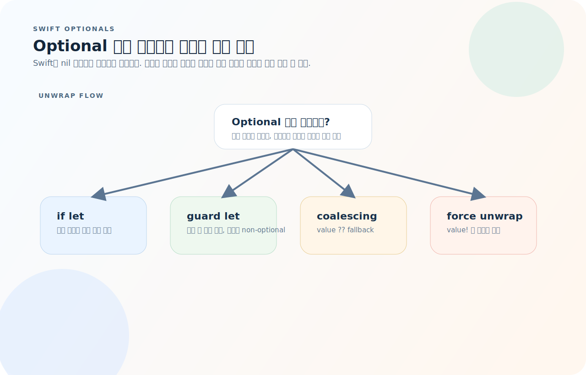
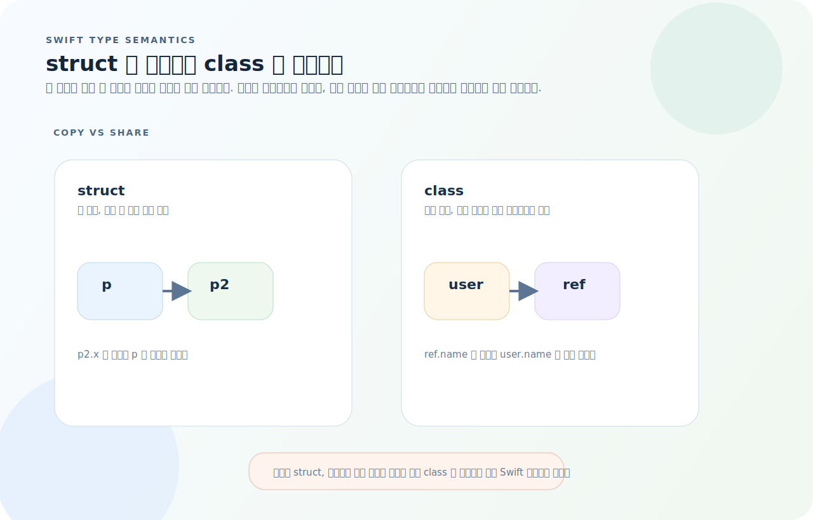
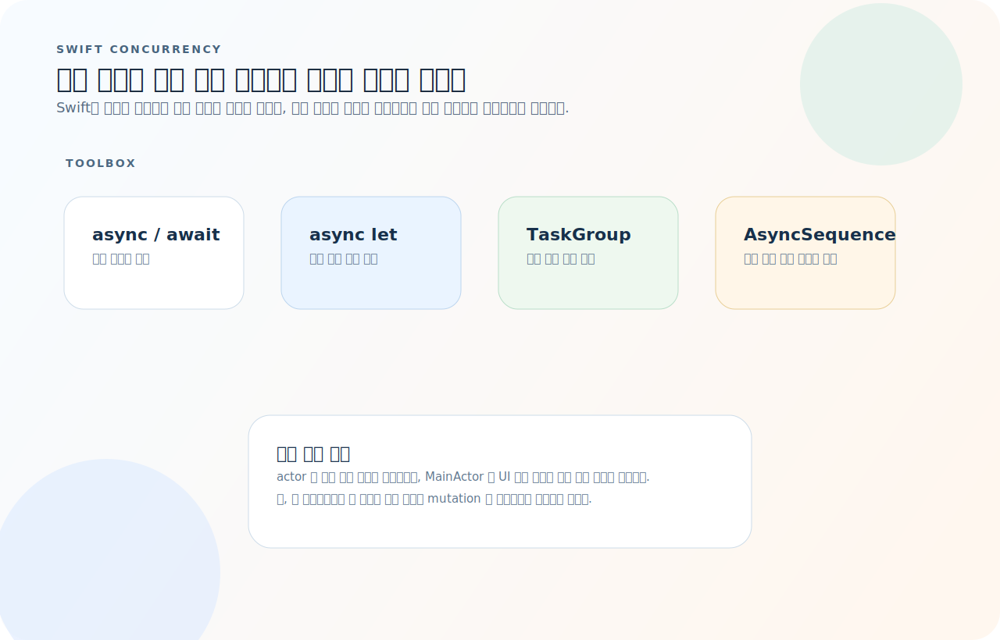
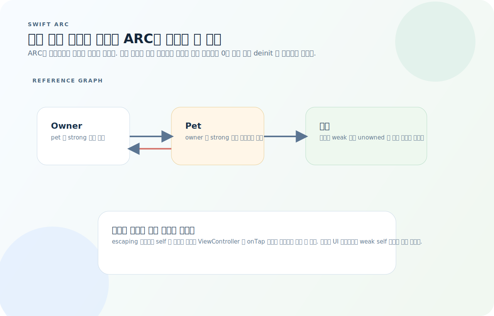

# Swift 완전 가이드

Swift는 문법이 단정해서 읽기 쉬워 보이지만, 실제로는 Optional 처리, 값 타입과 참조 타입의 경계, 구조적 동시성, ARC 규칙을 정확히 알아야 코드가 안정적이다. 이 글은 API 문법보다 런타임에서 무엇이 보장되고 무엇이 위험한지부터 정리한다.

먼저 아래 세 질문을 기준으로 읽으면 Swift 코드가 훨씬 빠르게 이해된다.

1. 이 값은 Optional 인가, 아니면 이미 안전하게 언래핑된 상태인가?
2. 이 타입은 복사되는 값 타입인가, 공유되는 참조 타입인가?
3. 이 비동기 작업과 객체 참조는 언제 종료되고 누가 수명을 책임지는가?

## 목차
1. [기본 문법](#1-기본-문법)
2. [Optional](#2-optional)
3. [컬렉션](#3-컬렉션)
4. [함수와 클로저](#4-함수와-클로저)
5. [구조체와 클래스](#5-구조체와-클래스)
6. [열거형](#6-열거형)
7. [프로토콜](#7-프로토콜)
8. [제네릭](#8-제네릭)
9. [에러 처리](#9-에러-처리)
10. [동시성 — async/await](#10-동시성--asyncawait)
11. [프로퍼티 래퍼와 결과 빌더](#11-프로퍼티-래퍼와-결과-빌더)
12. [메모리 관리 — ARC](#12-메모리-관리--arc)
13. [자주 하는 실수](#13-자주-하는-실수)
14. [빠른 참조](#14-빠른-참조)

---

## 1. 기본 문법

### 변수와 상수

```swift
let name = "Alice"       // 상수 — 재할당 불가
var age = 30             // 변수 — 재할당 가능

// 타입 명시 (보통 추론에 맡김)
let pi: Double = 3.14159
let isActive: Bool = true
let count: Int = 42

// 문자열 보간
let greeting = "이름: \(name), 나이: \(age)"

// 멀티라인 문자열
let text = """
    첫 번째 줄
    두 번째 줄
    들여쓰기는 닫는 """ 기준으로 제거됨
    """
```

### 기본 타입

```swift
// 정수
let a: Int = 42
let b: UInt = 42          // 부호 없는 정수
let hex = 0xFF             // 255
let bin = 0b1010           // 10
let readable = 1_000_000

// 실수
let f: Float = 3.14       // 32비트
let d: Double = 3.14      // 64비트 (기본)

// Bool
let flag = true

// Character
let ch: Character = "A"

// 타입 변환 — 암시적 변환 없음 (명시적 필수)
let intVal = 42
let doubleVal = Double(intVal)
let str = String(intVal)
```

### 조건문

```swift
let score = 85

if score >= 90 {
    print("A")
} else if score >= 80 {
    print("B")
} else {
    print("C")
}

// 삼항 연산자
let status = score >= 60 ? "pass" : "fail"

// switch — exhaustive (모든 경우 처리 필수)
let grade = "B"
switch grade {
case "A":
    print("우수")
case "B", "C":
    print("보통")    // 여러 값 매칭 가능
default:
    print("기타")
}

// switch + where
let point = (2, 3)
switch point {
case let (x, y) where x == y:
    print("대각선 위")
case let (x, y) where x + y < 10:
    print("원점 근처")
default:
    print("기타")
}
```

### 반복문

```swift
// for-in
for i in 0..<5 {          // 0, 1, 2, 3, 4
    print(i)
}

for i in 1...5 {          // 1, 2, 3, 4, 5 (닫힌 범위)
    print(i)
}

// stride
for i in stride(from: 0, to: 10, by: 2) {  // 0, 2, 4, 6, 8
    print(i)
}

// 배열 순회
let fruits = ["apple", "banana"]
for (index, fruit) in fruits.enumerated() {
    print("\(index): \(fruit)")
}

// while
var count = 0
while count < 5 {
    count += 1
}

// repeat-while (do-while)
repeat {
    count -= 1
} while count > 0
```

### 튜플

```swift
let person = (name: "Alice", age: 30)
print(person.name)    // "Alice"
print(person.0)       // "Alice" (인덱스 접근)

// 분해
let (name, age) = person
let (_, ageOnly) = person   // 필요 없는 값 무시

// 함수 다중 반환
func divide(_ a: Int, by b: Int) -> (quotient: Int, remainder: Int) {
    return (a / b, a % b)
}
let result = divide(10, by: 3)
print(result.quotient)   // 3
```

---

## 2. Optional

### 개념

```swift
// Optional = "값이 있거나 없거나(nil)"
var email: String? = nil       // String 또는 nil
email = "test@example.com"

// 일반 타입에 nil 할당 불가
// var name: String = nil  // 컴파일 에러
```

### 안전하게 풀기

Optional은 "값이 있을 수도 없을 수도 있다"는 사실을 타입에 새긴 것이다. 그래서 어떤 문법으로 nil 분기를 닫을지 먼저 정하면 코드가 단순해진다.



- `if let`과 `guard let`은 Optional을 non-optional 값으로 바꾸는 가장 기본적인 분기다.
- 기본값만 필요하면 `??`, 중간 속성을 따라가며 실패를 전파하려면 옵셔널 체이닝이 맞다.
- `!`는 타입 안전 장치를 해제하므로, 값이 반드시 있다고 증명된 경우에만 남겨야 한다.

```swift
let input: String? = "42"

// if let — Optional Binding
if let value = input {
    print("값: \(value)")
} else {
    print("nil")
}

// guard let — Early Return (함수 내에서)
func process(input: String?) {
    guard let value = input else {
        print("nil이므로 종료")
        return
    }
    // value는 여기서 String (non-optional)
    print("처리: \(value)")
}

// if let 축약 (Swift 5.7+)
if let input {           // if let input = input 와 동일
    print(input)
}

// 여러 optional 동시에 풀기
func login(name: String?, password: String?) {
    guard let name, let password else { return }
    print("\(name) 로그인 시도")
}
```

### Nil Coalescing, 옵셔널 체이닝

```swift
// ?? — nil이면 기본값
let displayName = email ?? "알 수 없음"

// 옵셔널 체이닝 — 중간에 nil이면 전체가 nil
struct Company {
    var ceo: Person?
}
struct Person {
    var address: Address?
}
struct Address {
    var city: String
}

let company: Company? = Company(ceo: Person(address: Address(city: "Seoul")))
let city = company?.ceo?.address?.city   // Optional("Seoul")

// map / flatMap
let number: Int? = 42
let str = number.map { String($0) }      // Optional("42")
let parsed: Int? = "99".isEmpty ? nil : Int("99")
let doubled = parsed.flatMap { $0 > 50 ? $0 * 2 : nil }  // Optional(198)
```

### 강제 언래핑과 IUO

```swift
// ! — 강제 언래핑 (nil이면 런타임 크래시!)
let forced = email!  // email이 nil이면 crash

// 암시적 언래핑 옵셔널 (IUO) — 초기화 직후 무조건 값이 있는 경우
// IBOutlet 등에서 사용
var label: UILabel!  // 초기에 nil이지만 viewDidLoad 후에는 항상 있다고 가정
```

---

## 3. 컬렉션

### Array

```swift
var nums = [1, 2, 3, 4, 5]
let empty: [Int] = []

// 접근
nums[0]              // 1
nums.first            // Optional(1)
nums.last             // Optional(5)
nums.count            // 5
nums.isEmpty          // false

// 수정
nums.append(6)
nums.insert(0, at: 0)
nums.remove(at: 0)
nums.removeLast()

// 고차 함수
let doubled = nums.map { $0 * 2 }
let evens = nums.filter { $0 % 2 == 0 }
let sum = nums.reduce(0, +)
let sorted = nums.sorted(by: >)

// compactMap — nil 제거
let strings = ["1", "two", "3"]
let ints = strings.compactMap { Int($0) }   // [1, 3]

// flatMap — 중첩 배열 평탄화
let nested = [[1, 2], [3, 4]]
let flat = nested.flatMap { $0 }             // [1, 2, 3, 4]

// contains / first(where:)
nums.contains(3)                              // true
nums.first(where: { $0 > 3 })                // Optional(4)
```

### Dictionary

```swift
var user: [String: Any] = ["name": "Alice", "age": 30]

// 접근 (항상 Optional 반환)
let name = user["name"]           // Optional
let role = user["role"] ?? "guest" // 기본값

// 수정
user["email"] = "a@b.com"
user.removeValue(forKey: "age")

// 순회
for (key, value) in user {
    print("\(key): \(value)")
}

// 타입 안전한 딕셔너리
let scores: [String: Int] = ["Alice": 90, "Bob": 85]
let sorted = scores.sorted { $0.value > $1.value }

// 그룹핑
let words = ["apple", "ant", "banana", "bat"]
let grouped = Dictionary(grouping: words) { $0.first! }
// ["a": ["apple", "ant"], "b": ["banana", "bat"]]

// mapValues
let doubled = scores.mapValues { $0 * 2 }  // ["Alice": 180, "Bob": 170]
```

### Set

```swift
var a: Set<Int> = [1, 2, 3, 4]
var b: Set<Int> = [3, 4, 5, 6]

a.union(b)          // {1, 2, 3, 4, 5, 6}
a.intersection(b)   // {3, 4}
a.subtracting(b)    // {1, 2}
a.symmetricDifference(b)  // {1, 2, 5, 6}

a.insert(5)
a.remove(1)
a.contains(3)       // true — O(1)
```

---

## 4. 함수와 클로저

### 함수

```swift
// 기본
func greet(name: String) -> String {
    return "안녕, \(name)!"
}

// Argument Label vs Parameter Name
func move(from source: String, to destination: String) {
    print("\(source) → \(destination)")
}
move(from: "A", to: "B")  // 호출 시 라벨 사용

// _ 로 라벨 생략
func square(_ n: Int) -> Int { n * n }
square(5)  // 라벨 없이 호출

// 기본값
func connect(host: String, port: Int = 8080) { }

// 가변 인자
func sum(_ numbers: Int...) -> Int {
    numbers.reduce(0, +)
}
sum(1, 2, 3)  // 6

// inout — 값 타입 수정
func increment(_ value: inout Int) {
    value += 1
}
var x = 10
increment(&x)  // x = 11
```

### 클로저

```swift
// 전체 문법
let add: (Int, Int) -> Int = { (a: Int, b: Int) -> Int in
    return a + b
}

// 축약 단계
let multiply: (Int, Int) -> Int = { a, b in a * b }  // 타입 추론
let divide: (Int, Int) -> Int = { $0 / $1 }          // 단축 인자명

// 후행 클로저 (Trailing Closure)
let names = ["Charlie", "Alice", "Bob"]
let sorted = names.sorted { $0 < $1 }

// 여러 후행 클로저
func fetch(url: String, success: (Data) -> Void, failure: (Error) -> Void) { }
fetch(url: "https://api.example.com") { data in
    print(data)
} failure: { error in
    print(error)
}

// @escaping — 함수 범위를 벗어나 저장/비동기 실행
func fetchData(completion: @escaping (String) -> Void) {
    DispatchQueue.main.async {
        completion("결과")
    }
}

// 캡처 리스트 — 순환 참조 방지
class ViewModel {
    var name = "Alice"

    func load() {
        fetchData { [weak self] result in
            guard let self else { return }
            self.name = result
        }
    }
}
```

---

## 5. 구조체와 클래스

Swift 설계의 핵심은 "기본은 struct, 공유가 필요할 때만 class"라는 원칙이다. 두 타입은 문법보다 복사 방식이 다르다.



- `struct`는 복사되어 독립 상태를 만들고, `class`는 같은 인스턴스를 여러 참조가 공유한다.
- 데이터 모델과 설정 값은 보통 `struct`, 공유 상태와 UIKit 객체는 보통 `class`가 맞다.
- `===`는 참조 동일성만 비교하므로 class 인스턴스에만 의미가 있다.

### 구조체 (값 타입)

```swift
struct Point {
    var x: Double
    var y: Double

    // 계산 프로퍼티
    var magnitude: Double {
        (x * x + y * y).squareRoot()
    }

    // mutating — 값 타입 내부 수정
    mutating func translate(dx: Double, dy: Double) {
        x += dx
        y += dy
    }

    // static
    static let origin = Point(x: 0, y: 0)
}

var p = Point(x: 3, y: 4)
p.translate(dx: 1, dy: 1)  // p = Point(x: 4, y: 5)

// 값 타입 → 복사
var p2 = p
p2.x = 100    // p.x는 여전히 4
```

### 클래스 (참조 타입)

```swift
class User {
    let id: Int
    var name: String

    // 지정 이니셜라이저
    init(id: Int, name: String) {
        self.id = id
        self.name = name
    }

    // 편의 이니셜라이저
    convenience init(name: String) {
        self.init(id: Int.random(in: 1...9999), name: name)
    }

    // 소멸자
    deinit {
        print("\(name) 해제됨")
    }
}

let user = User(name: "Alice")

// 참조 타입 → 같은 인스턴스 공유
let ref = user
ref.name = "Bob"
print(user.name)  // "Bob"

// 동일성 비교
user === ref  // true (같은 인스턴스)
```

### 값 타입 vs 참조 타입 — 선택 기준

| | struct | class |
|---|--------|-------|
| **타입** | 값 타입 (복사) | 참조 타입 (공유) |
| **상속** | 불가 | 가능 |
| **메모리** | 스택 (작은 경우) | 힙 (ARC) |
| **Mutability** | `mutating` 필요 | 자유롭게 수정 |
| **사용 시점** | 데이터 모델, 좌표, 설정 값 | 공유 상태, UIKit 뷰, 뷰모델 |

> **기본은 struct. 상속이나 참조 공유가 필요할 때만 class.**

### 프로퍼티

```swift
class Account {
    // 저장 프로퍼티
    var balance: Double = 0

    // 계산 프로퍼티
    var isOverdrawn: Bool {
        balance < 0
    }

    // 프로퍼티 옵저버
    var limit: Double = 1000 {
        willSet { print("한도 변경 예정: \(newValue)") }
        didSet  { print("한도 변경됨: \(oldValue) → \(limit)") }
    }

    // lazy — 처음 접근 시 초기화
    lazy var history: [String] = {
        print("히스토리 로드")
        return []
    }()

    // static / class
    static var interestRate: Double = 0.05
}
```

### 상속

```swift
class Animal {
    let name: String
    init(name: String) { self.name = name }

    func speak() -> String { "..." }
}

class Dog: Animal {
    override func speak() -> String { "\(name): 멍멍!" }
}

class Cat: Animal {
    override func speak() -> String { "\(name): 야옹!" }
}

// 다형성
let animals: [Animal] = [Dog(name: "바둑이"), Cat(name: "나비")]
for a in animals {
    print(a.speak())
}

// final — 상속/오버라이드 방지
final class Singleton { }
```

---

## 6. 열거형

### 기본 열거형

```swift
enum Direction {
    case north, south, east, west
}

var dir = Direction.north
dir = .south    // 타입 추론으로 축약

switch dir {
case .north: print("북")
case .south: print("남")
case .east:  print("동")
case .west:  print("서")
}
```

### 연관 값 (Associated Values)

```swift
enum NetworkResult {
    case success(data: Data, statusCode: Int)
    case failure(error: Error)
    case loading(progress: Double)
}

let result = NetworkResult.success(data: Data(), statusCode: 200)

switch result {
case .success(let data, let code):
    print("성공 \(code): \(data.count) bytes")
case .failure(let error):
    print("실패: \(error)")
case .loading(let progress):
    print("로딩 중: \(Int(progress * 100))%")
}

// if case — 특정 케이스만 매칭
if case .success(_, let code) = result, code == 200 {
    print("OK")
}
```

### Raw Value

```swift
enum Status: String {
    case active = "active"
    case inactive = "inactive"
    case suspended = "suspended"
}

let s = Status(rawValue: "active")  // Optional(Status.active)
print(Status.active.rawValue)        // "active"

// Int raw value — 자동 증가
enum Priority: Int {
    case low = 0
    case medium    // 1
    case high      // 2
}
```

### 열거형 + 메서드/프로퍼티

```swift
enum Coin: Double {
    case penny = 0.01
    case nickel = 0.05
    case dime = 0.10
    case quarter = 0.25

    var displayName: String {
        switch self {
        case .penny:   return "1센트"
        case .nickel:  return "5센트"
        case .dime:    return "10센트"
        case .quarter: return "25센트"
        }
    }

    static var all: [Coin] {
        [.penny, .nickel, .dime, .quarter]
    }
}

// CaseIterable
enum Season: CaseIterable {
    case spring, summer, fall, winter
}
Season.allCases.count  // 4
```

### 재귀 열거형

```swift
indirect enum ArithExpr {
    case number(Int)
    case add(ArithExpr, ArithExpr)
    case multiply(ArithExpr, ArithExpr)
}

func evaluate(_ expr: ArithExpr) -> Int {
    switch expr {
    case .number(let n):
        return n
    case .add(let left, let right):
        return evaluate(left) + evaluate(right)
    case .multiply(let left, let right):
        return evaluate(left) * evaluate(right)
    }
}

let expr = ArithExpr.add(.number(2), .multiply(.number(3), .number(4)))
evaluate(expr)  // 14
```

---

## 7. 프로토콜

### 기본 프로토콜

```swift
protocol Drawable {
    var color: String { get set }
    func draw()
}

struct Circle: Drawable {
    var color: String
    var radius: Double

    func draw() {
        print("\(color) 원 (r=\(radius))")
    }
}

struct Rectangle: Drawable {
    var color: String
    var width: Double
    var height: Double

    func draw() {
        print("\(color) 사각형 (\(width)x\(height))")
    }
}

// 다형성
let shapes: [Drawable] = [Circle(color: "red", radius: 5), Rectangle(color: "blue", width: 10, height: 20)]
shapes.forEach { $0.draw() }
```

### 프로토콜 확장 — 기본 구현

```swift
protocol Describable {
    var name: String { get }
}

extension Describable {
    var description: String {
        "[\(type(of: self))] \(name)"
    }
}

struct Product: Describable {
    let name: String
    let price: Int
}

Product(name: "키보드", price: 50000).description
// "[Product] 키보드"
```

### 프로토콜 합성

```swift
protocol Named { var name: String { get } }
protocol Aged { var age: Int { get } }

// 여러 프로토콜 동시 요구
func greet(person: Named & Aged) {
    print("\(person.name), \(person.age)세")
}

struct Student: Named, Aged {
    let name: String
    let age: Int
}
```

### 주요 표준 프로토콜

```swift
// Equatable — == 비교
struct Point: Equatable {
    let x: Int, y: Int
    // 모든 저장 프로퍼티가 Equatable이면 자동 합성
}

// Hashable — Dictionary 키, Set 원소
struct User: Hashable {
    let id: Int
    let name: String
}

// Comparable — 정렬
struct Score: Comparable {
    let value: Int
    static func < (lhs: Score, rhs: Score) -> Bool {
        lhs.value < rhs.value
    }
}

// Codable — JSON 직렬화/역직렬화
struct Article: Codable {
    let title: String
    let content: String
    let publishedAt: Date

    enum CodingKeys: String, CodingKey {
        case title
        case content
        case publishedAt = "published_at"  // JSON 키 매핑
    }
}

// 인코딩
let encoder = JSONEncoder()
encoder.dateEncodingStrategy = .iso8601
let data = try encoder.encode(article)

// 디코딩
let decoder = JSONDecoder()
decoder.dateDecodingStrategy = .iso8601
let decoded = try decoder.decode(Article.self, from: data)
```

---

## 8. 제네릭

### 기본 제네릭

```swift
// 제네릭 함수
func swapValues<T>(_ a: inout T, _ b: inout T) {
    let temp = a
    a = b
    b = temp
}

// 제네릭 타입
struct Stack<Element> {
    private var items: [Element] = []

    mutating func push(_ item: Element) {
        items.append(item)
    }

    mutating func pop() -> Element? {
        items.popLast()
    }

    var peek: Element? {
        items.last
    }

    var isEmpty: Bool {
        items.isEmpty
    }
}

var stack = Stack<Int>()
stack.push(1)
stack.push(2)
stack.pop()   // Optional(2)
```

### 제네릭 제약

```swift
// Comparable 제약
func findMin<T: Comparable>(_ array: [T]) -> T? {
    array.min()
}

// 여러 제약
func process<T: Hashable & Codable>(_ item: T) { }

// where 절
func allEqual<T: Equatable>(_ a: T, _ b: T, _ c: T) -> Bool where T: CustomStringConvertible {
    print("비교: \(a), \(b), \(c)")
    return a == b && b == c
}

// associated type
protocol Container {
    associatedtype Item
    mutating func append(_ item: Item)
    var count: Int { get }
    subscript(i: Int) -> Item { get }
}
```

### some / any (Swift 5.7+)

```swift
// some — Opaque Type (구체적 타입은 숨기고 프로토콜만 노출)
func makeShape() -> some Drawable {
    Circle(color: "red", radius: 10)
    // 반환 타입이 항상 같은 구체 타입이어야 함
}

// any — Existential Type (다양한 구체 타입 가능)
func processShapes(_ shapes: [any Drawable]) {
    for shape in shapes {
        shape.draw()
    }
}

// some vs any
// some: 컴파일러가 구체 타입 알고 최적화 가능, 하나의 타입만
// any:  여러 타입 혼합 가능, 런타임 오버헤드 약간 있음
```

---

## 9. 에러 처리

### throws / do-catch

```swift
enum NetworkError: Error {
    case invalidURL
    case noConnection
    case serverError(statusCode: Int)
}

func fetchData(from urlString: String) throws -> Data {
    guard let url = URL(string: urlString) else {
        throw NetworkError.invalidURL
    }
    // ... 네트워크 요청
    return Data()
}

// 호출
do {
    let data = try fetchData(from: "https://api.example.com")
    print("성공: \(data.count) bytes")
} catch NetworkError.invalidURL {
    print("잘못된 URL")
} catch NetworkError.serverError(let code) {
    print("서버 에러: \(code)")
} catch {
    print("기타 에러: \(error)")  // error는 암시적 바인딩
}
```

### try? / try!

```swift
// try? — 실패 시 nil
let data = try? fetchData(from: "bad-url")  // Optional<Data>

// try! — 실패 시 크래시 (절대 실패하지 않는다고 확신할 때만)
let config = try! loadBundledConfig()
```

### Result 타입

```swift
enum AppError: Error {
    case notFound
    case unauthorized
}

func fetchUser(id: Int) -> Result<User, AppError> {
    guard id > 0 else { return .failure(.notFound) }
    return .success(User(id: id, name: "Alice"))
}

// 사용
switch fetchUser(id: 1) {
case .success(let user):
    print(user.name)
case .failure(let error):
    print("에러: \(error)")
}

// get()으로 throws 변환
let user = try fetchUser(id: 1).get()

// map / flatMap
let name = fetchUser(id: 1).map { $0.name }  // Result<String, AppError>
```

### LocalizedError

```swift
enum ValidationError: LocalizedError {
    case tooShort(min: Int)
    case invalidFormat

    var errorDescription: String? {
        switch self {
        case .tooShort(let min):
            return "\(min)자 이상 입력해주세요"
        case .invalidFormat:
            return "형식이 올바르지 않습니다"
        }
    }
}
```

---

## 10. 동시성 — async/await

Swift 동시성은 단순히 `await`를 붙이는 문법이 아니라, 어떤 방식으로 작업을 묶고 어떤 문맥에서 실행할지 정하는 구조적 모델이다.



- 단일 비동기 호출은 `async/await`, 고정 개수 병렬 작업은 `async let`, 동적 개수는 `TaskGroup`이 맞다.
- actor는 공유 가변 상태를 직렬화해 데이터 경쟁을 줄이고, `@MainActor`는 UI 업데이트 문맥을 고정한다.
- `AsyncSequence`는 시간이 흐르며 여러 값을 소비하는 비동기 스트림 모델이다.

### 기본 사용 (Swift 5.5+)

```swift
// async 함수
func fetchUser(id: Int) async throws -> User {
    let url = URL(string: "https://api.example.com/users/\(id)")!
    let (data, _) = try await URLSession.shared.data(from: url)
    return try JSONDecoder().decode(User.self, from: data)
}

// 호출
Task {
    do {
        let user = try await fetchUser(id: 1)
        print(user.name)
    } catch {
        print("에러: \(error)")
    }
}
```

### 구조적 동시성

```swift
// async let — 병렬 실행
func loadDashboard() async throws -> Dashboard {
    async let user = fetchUser(id: 1)
    async let posts = fetchPosts(userId: 1)
    async let notifications = fetchNotifications()

    // 세 요청이 병렬로 실행되고, 여기서 모두 기다림
    return try await Dashboard(
        user: user,
        posts: posts,
        notifications: notifications
    )
}

// TaskGroup — 동적 개수의 병렬 작업
func fetchAllUsers(ids: [Int]) async throws -> [User] {
    try await withThrowingTaskGroup(of: User.self) { group in
        for id in ids {
            group.addTask {
                try await fetchUser(id: id)
            }
        }
        var users: [User] = []
        for try await user in group {
            users.append(user)
        }
        return users
    }
}
```

### Actor — 데이터 경쟁 방지

```swift
actor Counter {
    private var value = 0

    func increment() {
        value += 1
    }

    func getValue() -> Int {
        value
    }
}

let counter = Counter()
await counter.increment()   // actor 메서드는 await 필요
let val = await counter.getValue()

// @MainActor — UI 업데이트
@MainActor
class ViewModel: ObservableObject {
    @Published var items: [String] = []

    func load() async {
        let data = await fetchItems()
        items = data  // 메인 스레드에서 실행 보장
    }
}
```

### AsyncSequence

```swift
// 비동기 시퀀스 소비
func processLines(url: URL) async throws {
    for try await line in url.lines {
        print(line)
    }
}

// AsyncStream — 커스텀 비동기 시퀀스
func countdown(from n: Int) -> AsyncStream<Int> {
    AsyncStream { continuation in
        for i in (0...n).reversed() {
            continuation.yield(i)
            try? await Task.sleep(nanoseconds: 1_000_000_000)
        }
        continuation.finish()
    }
}

for await n in countdown(from: 5) {
    print(n)
}
```

---

## 11. 프로퍼티 래퍼와 결과 빌더

### Property Wrapper

```swift
@propertyWrapper
struct Clamped {
    var wrappedValue: Int {
        didSet { wrappedValue = min(max(wrappedValue, range.lowerBound), range.upperBound) }
    }
    let range: ClosedRange<Int>

    init(wrappedValue: Int, _ range: ClosedRange<Int>) {
        self.range = range
        self.wrappedValue = min(max(wrappedValue, range.lowerBound), range.upperBound)
    }
}

struct Player {
    @Clamped(0...100) var health = 100
    @Clamped(0...999) var score = 0
}

var player = Player()
player.health = 150   // 100으로 클램핑
player.health = -10   // 0으로 클램핑
```

### @propertyWrapper + projectedValue

```swift
@propertyWrapper
struct UserDefault<T> {
    let key: String
    let defaultValue: T

    var wrappedValue: T {
        get { UserDefaults.standard.object(forKey: key) as? T ?? defaultValue }
        set { UserDefaults.standard.set(newValue, forKey: key) }
    }

    // $ 접근 시 반환되는 값
    var projectedValue: Bool {
        UserDefaults.standard.object(forKey: key) != nil
    }
}

struct Settings {
    @UserDefault(key: "theme", defaultValue: "light")
    var theme: String
}

var settings = Settings()
settings.theme = "dark"
settings.$theme  // true (값이 저장되어 있는지)
```

### Result Builder

```swift
@resultBuilder
struct ArrayBuilder<T> {
    static func buildBlock(_ components: T...) -> [T] {
        components
    }
    static func buildOptional(_ component: [T]?) -> [T] {
        component ?? []
    }
    static func buildEither(first component: [T]) -> [T] {
        component
    }
    static func buildEither(second component: [T]) -> [T] {
        component
    }
}

func makeList<T>(@ArrayBuilder<T> _ content: () -> [T]) -> [T] {
    content()
}

let items = makeList {
    "Apple"
    "Banana"
    "Cherry"
}
// ["Apple", "Banana", "Cherry"]
```

---

## 12. 메모리 관리 — ARC

ARC는 자동 메모리 관리이지만, 강한 참조 그래프를 잘못 만들면 자동으로도 해제가 되지 않는다.



- class 인스턴스는 강한 참조 카운트가 0이 될 때만 해제된다.
- 두 객체가 서로를 강하게 잡으면 순환 참조가 생기고, 이때는 `weak` 또는 `unowned`로 고리를 끊어야 한다.
- escaping 클로저는 `self`를 캡처하므로, UI 코드에서는 `[weak self]` 패턴을 자주 쓴다.

### ARC 기본

```swift
// Swift는 ARC(Automatic Reference Counting)로 메모리 관리
// 참조 카운트가 0이 되면 자동 해제

class Person {
    let name: String
    init(name: String) { self.name = name }
    deinit { print("\(name) 해제") }
}

var ref1: Person? = Person(name: "Alice")  // RC = 1
var ref2 = ref1                             // RC = 2
ref1 = nil                                  // RC = 1
ref2 = nil                                  // RC = 0 → "Alice 해제"
```

### 순환 참조 문제와 해결

```swift
// 💀 순환 참조 — 메모리 누수
class Owner {
    var pet: Pet?
    deinit { print("Owner 해제") }
}

class Pet {
    var owner: Owner?   // 강한 참조 → 순환!
    deinit { print("Pet 해제") }
}

var owner: Owner? = Owner()
var pet: Pet? = Pet()
owner?.pet = pet
pet?.owner = owner
owner = nil  // 해제 안 됨!
pet = nil    // 해제 안 됨!

// ✅ weak — Optional, nil 가능
class Pet {
    weak var owner: Owner?  // 약한 참조
    deinit { print("Pet 해제") }
}

// ✅ unowned — Non-optional, 수명이 같거나 짧을 때
class CreditCard {
    unowned let customer: Customer  // customer가 먼저 해제되면 크래시
    init(customer: Customer) { self.customer = customer }
}
```

### 클로저 순환 참조

```swift
class ViewController {
    var name = "Main"
    var onTap: (() -> Void)?

    func setup() {
        // 💀 self를 강하게 캡처 → 순환 참조
        onTap = {
            print(self.name)
        }

        // ✅ 캡처 리스트로 해결
        onTap = { [weak self] in
            guard let self else { return }
            print(self.name)
        }
    }
}
```

---

## 13. 자주 하는 실수

| 실수 | 원인 | 해결 |
|------|------|------|
| 강제 언래핑 `!` 크래시 | nil인 Optional에 `!` 사용 | `if let`, `guard let`, `??` 사용 |
| 순환 참조 메모리 누수 | class 인스턴스 상호 참조, 클로저 캡처 | `weak`, `unowned`, `[weak self]` |
| value type mutation 에러 | `let` 구조체에서 `mutating` 호출 | `var`로 선언 |
| switch exhaustive 에러 | enum 케이스 누락 | 모든 케이스 처리하거나 `default` |
| `==` vs `===` 혼동 | `==`는 값 비교, `===`는 참조(인스턴스) 비교 | class 동일 인스턴스 확인 시 `===` |
| Array 범위 초과 크래시 | `array[index]` 가 범위 밖 | `.first`, `.last`, bounds 체크 |
| async 함수에서 await 누락 | 컴파일 에러 | `try await` 명시 |
| struct에 class 프로퍼티 | struct가 복사되어도 class는 참조 공유 | 의도에 맞게 deep copy 구현 |
| Codable 키 불일치 | JSON 키와 프로퍼티명 다름 | `CodingKeys` enum 정의 |
| escaping 클로저에서 self 누락 | 컴파일 에러 | `self.` 명시 또는 캡처 리스트 |

---

## 14. 빠른 참조

```swift
// 변수
let constant = 1          var variable = 1

// Optional
var x: Int? = nil
x ?? 0                     // nil-coalescing
if let x { }               // optional binding (5.7+)
guard let x else { return } // early return

// 컬렉션
[1, 2, 3]                 // Array
["k": "v"]                // Dictionary
Set([1, 2, 3])             // Set
(1, "a")                   // Tuple

// 고차 함수
.map { }   .filter { }   .reduce(0, +)   .compactMap { }
.flatMap { }   .sorted { }   .forEach { }   .contains { }
.first(where:)   .min()   .max()

// 함수
func f(label param: Type) -> Return { }
func f(_ param: Type) { }   // 라벨 생략
{ (params) -> Return in body }  // 클로저

// 타입
struct S { }               // 값 타입
class C { }                // 참조 타입
enum E { case a, b }       // 열거형
protocol P { }             // 프로토콜
extension T { }            // 확장

// 에러
func f() throws -> T { }
try / try? / try!
do { } catch { }

// 동시성
func f() async throws -> T { }
try await f()
async let x = f()
Task { }
actor A { }

// ARC
weak var ref: T?           // 약한 참조
unowned let ref: T         // 비소유 참조
[weak self] in             // 클로저 캡처 리스트

// Codable
struct M: Codable { }
JSONEncoder().encode(m)
JSONDecoder().decode(M.self, from: data)

// 유용한 프로토콜
Equatable  Hashable  Comparable  Codable
CustomStringConvertible  CaseIterable  Identifiable

// String
"Hello \(name)"            // 보간
"""multiline"""            // 멀티라인
s.count  s.isEmpty  s.contains("x")
s.prefix(3)  s.suffix(3)  s.split(separator: " ")
s.lowercased()  s.uppercased()  s.trimmingCharacters(in: .whitespaces)
```
