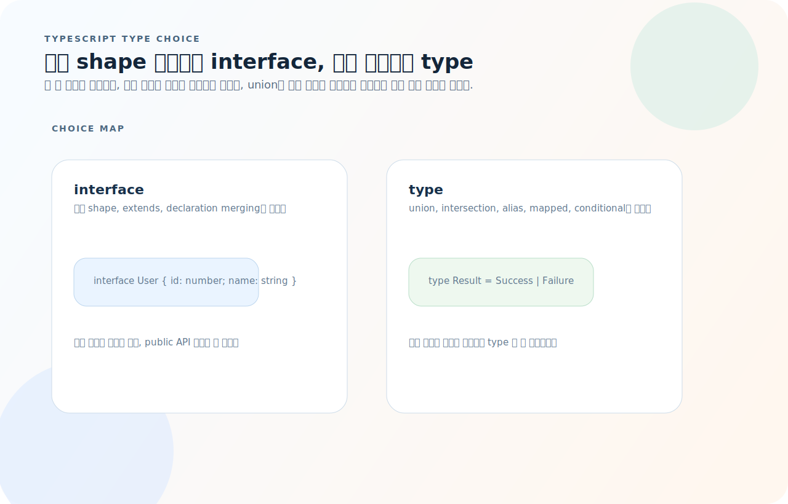
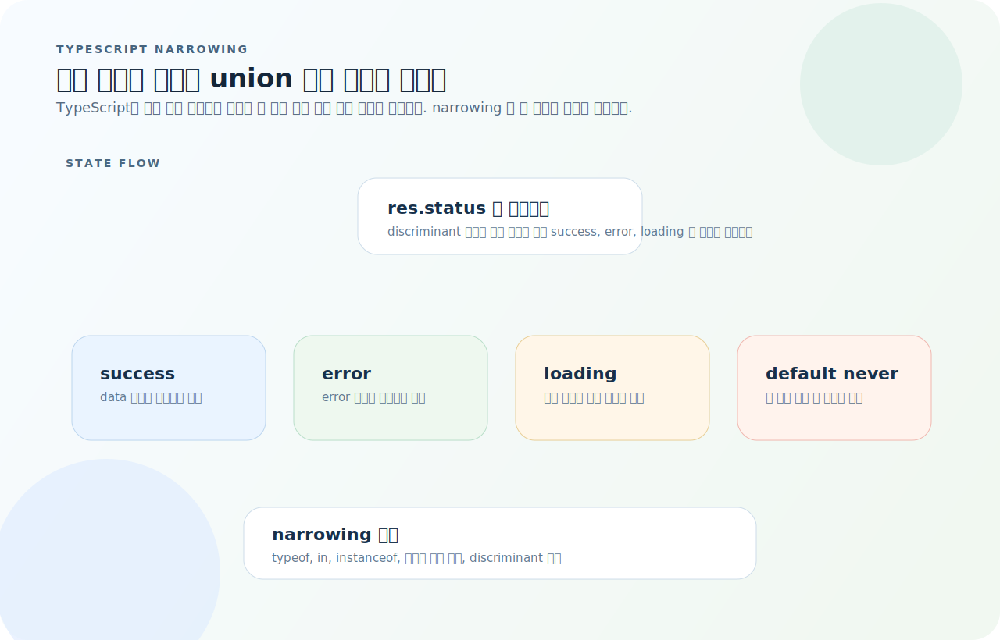
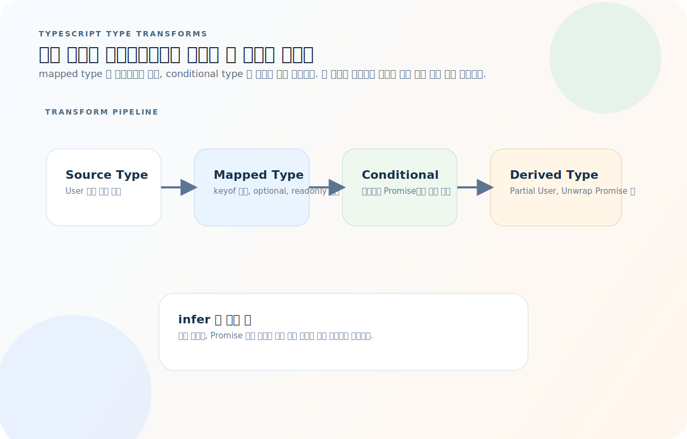
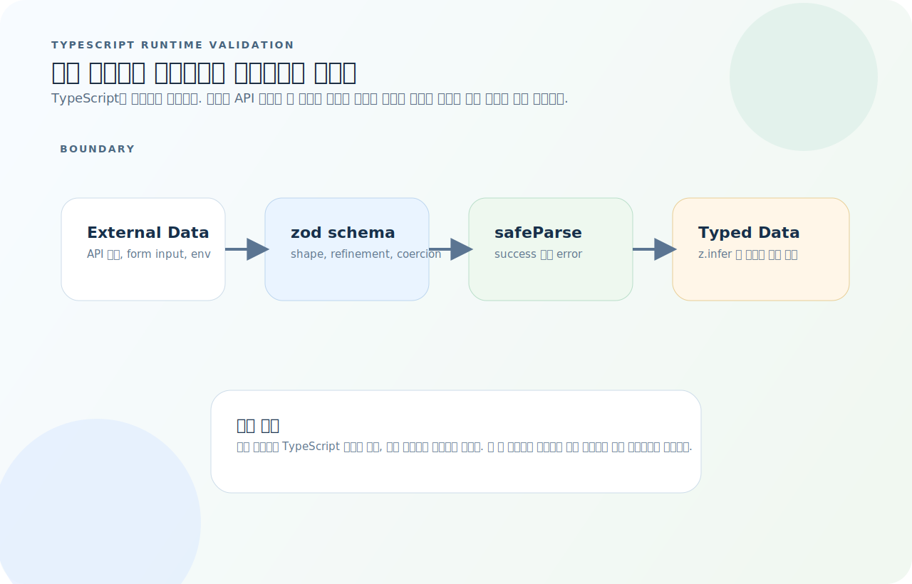

# TypeScript 완전 가이드

TypeScript는 문법을 많이 추가한 언어처럼 보이지만, 실제 핵심은 "런타임에는 없는 타입 정보를 어떻게 설계와 검증에 활용하느냐"에 있다. 객체 타입 표현, union narrowing, 타입 변환, 외부 입력 검증 경계를 먼저 잡으면 문법 양이 훨씬 덜 부담스럽다.

먼저 아래 세 질문을 기준으로 읽으면 TypeScript 코드가 훨씬 빨리 정리된다.

1. 이 정보는 컴파일 타임 타입만 필요한가, 아니면 런타임 검증까지 필요한가?
2. 이 union 값은 지금 어떤 분기로 좁혀졌고, 그 근거는 무엇인가?
3. 이 타입은 직접 선언해야 하는가, 아니면 기존 타입에서 변환해 얻을 수 있는가?

## 목차
1. [기본 타입](#1-기본-타입)
2. [함수 타입](#2-함수-타입)
3. [객체 타입 — interface vs type](#3-객체-타입--interface-vs-type)
4. [Union과 Narrowing](#4-union과-narrowing)
5. [제네릭](#5-제네릭)
6. [유틸리티 타입](#6-유틸리티-타입)
7. [타입 가드](#7-타입-가드)
8. [Mapped Type과 Conditional Type](#8-mapped-type과-conditional-type)
9. [Enum과 const 대안](#9-enum과-const-대안)
10. [모듈과 선언 파일](#10-모듈과-선언-파일)
11. [tsconfig.json 핵심 설정](#11-tsconfigjson-핵심-설정)
12. [런타임 검증 — zod 연동](#12-런타임-검증--zod-연동)
13. [자주 하는 실수](#13-자주-하는-실수)
14. [빠른 참조](#14-빠른-참조)

---

## 1. 기본 타입

### 원시 타입

```ts
const name: string = "Alice";
const age: number = 30;
const isActive: boolean = true;
const nothing: null = null;
const notDefined: undefined = undefined;

// 타입 추론 — 명시하지 않아도 할당 값에서 추론
const greeting = "hello";   // string으로 추론
let count = 0;               // number로 추론
```

### 리터럴 타입

```ts
// const는 리터럴 타입으로 추론
const direction = "north";   // 타입: "north" (string이 아님)
let mode = "dark";           // 타입: string

// as const — 객체/배열을 리터럴 타입으로 고정
const config = {
  host: "localhost",
  port: 3000,
} as const;
// 타입: { readonly host: "localhost"; readonly port: 3000 }

const roles = ["admin", "user", "guest"] as const;
// 타입: readonly ["admin", "user", "guest"]
type Role = (typeof roles)[number]; // "admin" | "user" | "guest"
```

### 배열과 튜플

```ts
// 배열
const nums: number[] = [1, 2, 3];
const names: Array<string> = ["Alice", "Bob"];

// 읽기 전용 배열
const readonlyNums: readonly number[] = [1, 2, 3];
// readonlyNums.push(4); // 에러

// 튜플
const pair: [string, number] = ["Alice", 30];
const [name, age] = pair;

// 라벨 붙은 튜플
type Range = [start: number, end: number];

// 가변 길이 튜플
type StringAndNumbers = [string, ...number[]];
const data: StringAndNumbers = ["scores", 90, 85, 92];
```

### any, unknown, never

```ts
// any — 어떤 타입이든 허용 (타입 검사 무력화, 최대한 피할 것)
let anything: any = 42;
anything = "hello";
anything.nonExistent();  // 에러 안 남! 위험

// unknown — 안전한 any (사용 전 타입 검사 필수)
let input: unknown = "hello";
// input.toUpperCase();   // 에러!
if (typeof input === "string") {
  input.toUpperCase();    // OK
}

// never — 절대 발생하지 않는 값
function throwError(msg: string): never {
  throw new Error(msg);
}

// exhaustive check
type Shape = "circle" | "square";
function area(shape: Shape) {
  switch (shape) {
    case "circle": return;
    case "square": return;
    default:
      const _exhaustive: never = shape; // 새 케이스 추가 시 컴파일 에러
  }
}
```

---

## 2. 함수 타입

### 함수 시그니처

```ts
// 매개변수 타입 + 반환 타입
function add(a: number, b: number): number {
  return a + b;
}

// 화살표 함수
const multiply = (a: number, b: number): number => a * b;

// 선택적 매개변수
function greet(name: string, greeting?: string): string {
  return `${greeting ?? "안녕하세요"}, ${name}!`;
}

// 기본값
function connect(host: string, port: number = 3000): void {
  console.log(`${host}:${port}`);
}

// 나머지 매개변수
function sum(...nums: number[]): number {
  return nums.reduce((acc, n) => acc + n, 0);
}
```

### 함수 타입 표현

```ts
// 타입 별칭으로 함수 타입 정의
type Comparator<T> = (a: T, b: T) => number;
type EventHandler = (event: Event) => void;

// 콜백 패턴
function fetchData(url: string, onSuccess: (data: unknown) => void): void {
  // ...
}

// 오버로드
function parse(input: string): number;
function parse(input: number): string;
function parse(input: string | number): number | string {
  if (typeof input === "string") return parseInt(input, 10);
  return String(input);
}
```

### 제네릭 함수

```ts
function first<T>(items: T[]): T | undefined {
  return items[0];
}

first([1, 2, 3]);       // number | undefined
first(["a", "b"]);      // string | undefined

// 제약 조건
function getLength<T extends { length: number }>(item: T): number {
  return item.length;
}

getLength("hello");      // OK
getLength([1, 2, 3]);    // OK
// getLength(42);         // 에러: number에 length 없음

// 여러 타입 매개변수
function zip<A, B>(a: A[], b: B[]): [A, B][] {
  return a.map((item, i) => [item, b[i]]);
}
```

---

## 3. 객체 타입 — interface vs type

`interface`와 `type`은 겹치는 영역이 많지만, 둘을 섞어서 외우기보다 "무엇을 표현하려는가"로 나누면 훨씬 간단하다.



- 객체 shape를 오래 유지하고 확장할 계획이면 `interface`가 읽기 쉽다.
- union, utility type, primitive alias, mapped type처럼 "변환"이 개입되면 `type`이 자연스럽다.
- 팀 규칙을 정했다면 한 파일 안에서 목적 없이 섞지 않는 편이 타입 설계를 읽기 쉽다.

### interface

```ts
interface User {
  id: number;
  name: string;
  email?: string;          // 선택적 프로퍼티
  readonly createdAt: Date; // 읽기 전용
}

// 확장
interface Admin extends User {
  permissions: string[];
}

// 선언 병합 (Declaration Merging)
interface User {
  role: string;   // 기존 User에 프로퍼티 추가
}
```

### type

```ts
type User = {
  id: number;
  name: string;
  email?: string;
  readonly createdAt: Date;
};

// 확장 — 교차 타입으로
type Admin = User & {
  permissions: string[];
};

// Union — type만 가능
type Result = Success | Failure;
type ID = string | number;

// 원시 타입 별칭 — type만 가능
type Email = string;
type Timestamp = number;
```

### 선택 기준

| | interface | type |
|---|-----------|------|
| 객체 shape 정의 | ✅ | ✅ |
| extends 확장 | ✅ | ❌ (& 사용) |
| 선언 병합 | ✅ | ❌ |
| Union / Intersection | ❌ | ✅ |
| 원시 타입 별칭 | ❌ | ✅ |
| Mapped / Conditional | ❌ | ✅ |

> **객체 shape은 interface, 나머지(union, 변환, 별칭)는 type.**

### 인덱스 시그니처

```ts
// 동적 키
interface StringMap {
  [key: string]: string;
}

// Record 유틸리티로 대체 가능
type StringMap = Record<string, string>;

// 고정 키 + 동적 키
interface Config {
  name: string;
  version: number;
  [key: string]: unknown;  // 추가 키 허용
}
```

---

## 4. Union과 Narrowing

Union 타입은 "불편한 합집합"이 아니라, 분기별 상태를 정확히 표현하고 그 분기 안에서만 안전한 속성을 열어 주는 모델이다.



- `typeof`, `in`, `instanceof`, discriminant 필드는 union을 더 좁은 타입으로 바꾸는 근거다.
- 태그드 유니온은 상태 머신을 표현할 때 가장 읽기 쉽고, `switch`와 exhaustiveness check가 잘 맞는다.
- narrowing 없이 속성에 접근하려고 하면 TypeScript가 일부 분기에서 없는 값일 수 있다고 막는다.

### 기본 Union

```ts
type ID = string | number;

function formatId(id: ID): string {
  // id는 string | number → 공통 메서드만 사용 가능
  // id.toUpperCase();  // 에러!

  // narrowing 필요
  if (typeof id === "string") {
    return id.toUpperCase();    // 여기서 id는 string
  }
  return String(id);             // 여기서 id는 number
}
```

### Discriminated Union (태그드 유니온)

```ts
type ApiResponse =
  | { status: "success"; data: unknown }
  | { status: "error"; error: string }
  | { status: "loading" };

function handleResponse(res: ApiResponse): void {
  switch (res.status) {
    case "success":
      console.log(res.data);    // data 접근 가능
      break;
    case "error":
      console.error(res.error); // error 접근 가능
      break;
    case "loading":
      console.log("로딩 중...");
      break;
  }
}

// 실전 예시: React 상태 관리
type AsyncState<T> =
  | { status: "idle" }
  | { status: "loading" }
  | { status: "success"; data: T }
  | { status: "error"; error: Error };

function renderState<T>(state: AsyncState<T>): string {
  switch (state.status) {
    case "idle":    return "대기 중";
    case "loading": return "로딩 중...";
    case "success": return `완료: ${state.data}`;
    case "error":   return `에러: ${state.error.message}`;
  }
}
```

### Narrowing 기법

```ts
// typeof
function process(value: string | number) {
  if (typeof value === "string") { /* string */ }
}

// instanceof
function handleError(err: unknown) {
  if (err instanceof Error) {
    console.error(err.message);  // Error 타입
  }
}

// in
function move(vehicle: Car | Boat) {
  if ("wheels" in vehicle) {
    vehicle.drive();   // Car 타입
  } else {
    vehicle.sail();    // Boat 타입
  }
}

// 커스텀 타입 가드 (7장에서 자세히)
function isString(value: unknown): value is string {
  return typeof value === "string";
}
```

---

## 5. 제네릭

### 제네릭 타입

```ts
// 제네릭 인터페이스
interface ApiResponse<T> {
  data: T;
  status: number;
  timestamp: Date;
}

const userRes: ApiResponse<User> = {
  data: { id: 1, name: "Alice" },
  status: 200,
  timestamp: new Date(),
};

// 제네릭 타입 별칭
type Nullable<T> = T | null;
type AsyncResult<T> = Promise<ApiResponse<T>>;
```

### 제네릭 제약

```ts
// extends로 제약
function prop<T, K extends keyof T>(obj: T, key: K): T[K] {
  return obj[key];
}

const user = { name: "Alice", age: 30 };
prop(user, "name");   // string
// prop(user, "email"); // 에러: "email"은 keyof User가 아님

// 기본 타입 매개변수
interface PaginatedResult<T, Meta = { total: number; page: number }> {
  items: T[];
  meta: Meta;
}

// 조건부 제약
type IsArray<T> = T extends unknown[] ? true : false;
type A = IsArray<string[]>;  // true
type B = IsArray<number>;    // false
```

### 실전 패턴

```ts
// API 응답 래퍼
async function fetchApi<T>(url: string): Promise<T> {
  const res = await fetch(url);
  if (!res.ok) throw new Error(`HTTP ${res.status}`);
  return res.json() as Promise<T>;
}

const user = await fetchApi<User>("/api/users/1");

// 팩토리 패턴
function createStore<State>(initialState: State) {
  let state = initialState;

  return {
    getState: (): State => state,
    setState: (partial: Partial<State>): void => {
      state = { ...state, ...partial };
    },
  };
}

const store = createStore({ count: 0, name: "app" });
store.setState({ count: 1 });  // Partial<State>로 일부만 수정
```

---

## 6. 유틸리티 타입

### 변환 유틸리티

```ts
interface User {
  id: number;
  name: string;
  email: string;
  age: number;
}

// Partial — 모든 프로퍼티를 optional로
type UpdateUser = Partial<User>;
// { id?: number; name?: string; email?: string; age?: number }

// Required — 모든 프로퍼티를 필수로
type CompleteUser = Required<User>;

// Readonly — 모든 프로퍼티를 readonly로
type FrozenUser = Readonly<User>;

// Pick — 특정 프로퍼티만 선택
type UserSummary = Pick<User, "id" | "name">;
// { id: number; name: string }

// Omit — 특정 프로퍼티 제외
type UserWithoutEmail = Omit<User, "email">;
// { id: number; name: string; age: number }

// Record — 키-값 맵
type Permissions = Record<string, boolean>;
// { [key: string]: boolean }

type StatusMap = Record<"active" | "inactive", User[]>;
// { active: User[]; inactive: User[] }
```

### 추출/배제

```ts
type Status = "active" | "inactive" | "suspended" | "deleted";

// Exclude — 특정 멤버 제거
type ActiveStatus = Exclude<Status, "deleted" | "suspended">;
// "active" | "inactive"

// Extract — 특정 멤버만 추출
type RemovedStatus = Extract<Status, "deleted" | "suspended">;
// "deleted" | "suspended"

// NonNullable — null | undefined 제거
type MaybeString = string | null | undefined;
type DefiniteString = NonNullable<MaybeString>; // string
```

### 함수 관련

```ts
type Fn = (a: string, b: number) => boolean;

// ReturnType — 반환 타입 추출
type R = ReturnType<Fn>;  // boolean

// Parameters — 매개변수 타입 추출
type P = Parameters<Fn>;  // [a: string, b: number]

// Awaited — Promise 언래핑
type Data = Awaited<Promise<string>>;  // string
type DeepData = Awaited<Promise<Promise<number>>>;  // number
```

### 조합 패턴

```ts
// 생성 시 id 불필요, 수정 시 id 필수
type CreateUser = Omit<User, "id">;
type UpdateUser = Partial<Omit<User, "id">> & Pick<User, "id">;

// 응답에서 createdAt, updatedAt 자동 추가
type WithTimestamps<T> = T & {
  createdAt: Date;
  updatedAt: Date;
};

type UserResponse = WithTimestamps<User>;
```

---

## 7. 타입 가드

### 커스텀 타입 가드

```ts
// is 키워드 — 반환이 true일 때 타입 좁히기
function isUser(value: unknown): value is User {
  return (
    typeof value === "object" &&
    value !== null &&
    "id" in value &&
    "name" in value
  );
}

function processInput(input: unknown) {
  if (isUser(input)) {
    console.log(input.name);  // User 타입으로 확정
  }
}
```

### Assertion 함수

```ts
// asserts 키워드 — 실패 시 throw
function assertNonNull<T>(value: T | null | undefined, msg?: string): asserts value is T {
  if (value == null) {
    throw new Error(msg ?? "값이 null/undefined입니다");
  }
}

function process(name: string | null) {
  assertNonNull(name, "이름은 필수입니다");
  console.log(name.toUpperCase());  // string 확정
}
```

### 배열 필터링에서 타입 가드

```ts
const items: (string | null)[] = ["a", null, "b", null, "c"];

// filter만으로는 타입이 좁혀지지 않음
// const strings = items.filter(x => x !== null); // (string | null)[]

// 타입 가드 함수 사용
const strings = items.filter((x): x is string => x !== null); // string[]

// 또는 NonNullable
const nonNull = items.filter((x): x is NonNullable<typeof x> => x !== null);
```

---

## 8. Mapped Type과 Conditional Type

이 섹션의 핵심은 "새 타입을 손으로 다시 적지 말고, 기존 타입에서 기계적으로 변환하라"는 것이다.



- mapped type은 `keyof`를 순회하며 프로퍼티를 일괄 변환한다.
- conditional type은 "배열인가, Promise인가" 같은 패턴 분기를 타입 레벨에서 수행한다.
- `infer`를 쓰면 함수 반환값, Promise 내부 값처럼 구조 안쪽 타입을 뽑아낼 수 있다.

### Mapped Type

```ts
// 모든 프로퍼티에 변환 적용
type Optional<T> = {
  [K in keyof T]?: T[K];
};

type Getters<T> = {
  [K in keyof T as `get${Capitalize<string & K>}`]: () => T[K];
};

type UserGetters = Getters<User>;
// { getId: () => number; getName: () => string; getEmail: () => string; getAge: () => number }

// 특정 프로퍼티만 변환
type ReadonlyExcept<T, K extends keyof T> = {
  readonly [P in keyof T as P extends K ? never : P]: T[P];
} & {
  [P in K]: T[P];
};
```

### Template Literal Type

```ts
type EventName = "click" | "focus" | "blur";
type Handler = `on${Capitalize<EventName>}`;
// "onClick" | "onFocus" | "onBlur"

type CSSProperty = "margin" | "padding";
type Direction = "Top" | "Right" | "Bottom" | "Left";
type SpacingProperty = `${CSSProperty}${Direction}`;
// "marginTop" | "marginRight" | ... | "paddingLeft"
```

### Conditional Type

```ts
// T가 배열이면 원소 타입 추출, 아니면 T 그대로
type Unwrap<T> = T extends Array<infer U> ? U : T;

type A = Unwrap<string[]>;   // string
type B = Unwrap<number>;     // number

// infer — 패턴 매칭으로 타입 추출
type ReturnOf<T> = T extends (...args: unknown[]) => infer R ? R : never;

type R1 = ReturnOf<() => string>;        // string
type R2 = ReturnOf<(x: number) => void>; // void

// Promise 언래핑
type UnwrapPromise<T> = T extends Promise<infer U> ? UnwrapPromise<U> : T;

type D = UnwrapPromise<Promise<Promise<string>>>;  // string
```

---

## 9. Enum과 const 대안

### enum

```ts
// 숫자 enum
enum Direction {
  Up = 0,
  Down,     // 1
  Left,     // 2
  Right,    // 3
}

// 문자열 enum
enum Status {
  Active = "ACTIVE",
  Inactive = "INACTIVE",
  Suspended = "SUSPENDED",
}

const s: Status = Status.Active;
```

### const 대안 (권장)

```ts
// enum은 런타임 객체를 생성 → 번들 크기 증가
// const 대안이 더 가볍고 tree-shaking 가능

// 방법 1: Union 리터럴
type Status = "active" | "inactive" | "suspended";

// 방법 2: as const 객체
const STATUS = {
  Active: "ACTIVE",
  Inactive: "INACTIVE",
  Suspended: "SUSPENDED",
} as const;

type Status = (typeof STATUS)[keyof typeof STATUS];
// "ACTIVE" | "INACTIVE" | "SUSPENDED"

// 방법 3: 배열에서 Union 추출
const ROLES = ["admin", "editor", "viewer"] as const;
type Role = (typeof ROLES)[number]; // "admin" | "editor" | "viewer"
```

### 비교

| | enum | as const |
|---|------|----------|
| 런타임 존재 | ✅ (객체 생성) | ✅ (원본 객체) |
| Tree-shaking | ❌ (번들에 포함) | ✅ |
| 역매핑 (숫자 enum) | ✅ | ❌ |
| 타입 추론 | 별도 타입 | `typeof`로 추출 |
| **추천** | 레거시, 특수 경우 | **대부분의 경우** |

---

## 10. 모듈과 선언 파일

### 모듈 시스템

```ts
// named export
export function fetchUser(id: number): Promise<User> { }
export type { User };
export interface Config { }

// default export
export default class UserService { }

// re-export
export { fetchUser } from "./api";
export type { User } from "./types";
export * from "./utils";
export * as helpers from "./helpers";

// import
import UserService from "./service";
import { fetchUser, type User } from "./api";
import type { Config } from "./config"; // 타입만 import (런타임에 제거됨)
```

### 선언 파일 (.d.ts)

```ts
// types/global.d.ts — 전역 타입 선언
declare global {
  interface Window {
    analytics: AnalyticsClient;
  }

  // 환경 변수 타입
  namespace NodeJS {
    interface ProcessEnv {
      DATABASE_URL: string;
      API_KEY: string;
      NODE_ENV: "development" | "production" | "test";
    }
  }
}

export {}; // 모듈로 만들기 위해 필요

// 서드파티 모듈 타입 선언
declare module "untyped-lib" {
  export function doSomething(input: string): number;
}

// CSS Modules
declare module "*.module.css" {
  const classes: Record<string, string>;
  export default classes;
}

// 이미지
declare module "*.png" {
  const src: string;
  export default src;
}
```

### 타입 구조 설계

```
src/
├── types/
│   ├── index.ts        # 공통 타입 re-export
│   ├── user.ts         # User 도메인 타입
│   ├── api.ts          # API 요청/응답 타입
│   └── global.d.ts     # 전역 타입 선언
├── utils/
│   └── typeGuards.ts   # 타입 가드 함수 모음
```

```ts
// types/user.ts
export interface User {
  id: number;
  name: string;
  email: string;
}

export type CreateUserInput = Omit<User, "id">;
export type UpdateUserInput = Partial<CreateUserInput> & Pick<User, "id">;

// types/api.ts
export type ApiResponse<T> =
  | { success: true; data: T }
  | { success: false; error: string };

// types/index.ts
export type { User, CreateUserInput, UpdateUserInput } from "./user";
export type { ApiResponse } from "./api";
```

---

## 11. tsconfig.json 핵심 설정

```jsonc
{
  "compilerOptions": {
    // 기본
    "target": "ES2022",             // 출력 JS 버전
    "module": "ESNext",             // 모듈 시스템
    "moduleResolution": "bundler",  // 번들러 호환 해석 (Vite, webpack)

    // 엄격 모드 (전부 켜기 권장)
    "strict": true,                 // 아래 전부 포함
    // "strictNullChecks": true,    // null/undefined 엄격 검사
    // "noImplicitAny": true,       // 암시적 any 금지
    // "strictFunctionTypes": true, // 함수 타입 엄격 검사

    // 경로
    "baseUrl": ".",
    "paths": {
      "@/*": ["./src/*"]            // import "@/utils" → "./src/utils"
    },

    // 출력
    "outDir": "dist",
    "declaration": true,            // .d.ts 생성
    "sourceMap": true,

    // 상호운용
    "esModuleInterop": true,        // CJS default import 허용
    "allowSyntheticDefaultImports": true,
    "resolveJsonModule": true,      // JSON import 허용
    "isolatedModules": true,        // 파일 단위 트랜스파일 호환

    // 검사
    "noUnusedLocals": true,
    "noUnusedParameters": true,
    "noFallthroughCasesInSwitch": true,
    "forceConsistentCasingInFileNames": true,

    // JSX (React)
    "jsx": "react-jsx",

    // 라이브러리
    "lib": ["ES2022", "DOM", "DOM.Iterable"],

    "skipLibCheck": true
  },
  "include": ["src"],
  "exclude": ["node_modules", "dist"]
}
```

### 프로젝트별 차이점

| 설정 | Node.js | Vite/React | Next.js |
|------|---------|------------|---------|
| module | `NodeNext` | `ESNext` | `ESNext` |
| moduleResolution | `NodeNext` | `bundler` | `bundler` |
| jsx | — | `react-jsx` | `preserve` |
| target | `ES2022` | `ES2020` | `ES2017` |

---

## 12. 런타임 검증 — zod 연동

TypeScript 타입은 런타임에 사라지므로, 외부 입력을 믿어야 하는 경계에서는 스키마 기반 검증이 따로 필요하다.



- 컴파일러는 코드 작성 시점의 실수를 막아 주지만, API 응답과 폼 입력의 실제 shape는 보장하지 못한다.
- zod 스키마를 통과한 뒤에만 `z.infer` 타입과 런타임 값이 다시 일치한다.
- 즉, 내부 로직은 TS 타입으로, 외부 경계는 스키마로 나눠 보는 것이 가장 안전하다.

### TS 타입의 한계

```ts
// TS 타입은 컴파일 시점에만 존재 → 런타임에 사라짐
interface User {
  name: string;
  age: number;
}

// API 응답, 폼 입력 등 외부 데이터는 보장 불가
const data: User = await res.json(); // 타입은 User지만 실제 데이터는?
// data.name이 실제로 string인지 런타임에 보장 안 됨
```

### zod 스키마

```ts
import { z } from "zod";

// 스키마 정의 (런타임에도 존재)
const UserSchema = z.object({
  name: z.string().min(1, "이름은 필수입니다"),
  age: z.number().int().positive(),
  email: z.string().email().optional(),
});

// 스키마에서 TS 타입 추출 — 이중 정의 방지
type User = z.infer<typeof UserSchema>;
// { name: string; age: number; email?: string }

// 검증
const result = UserSchema.safeParse(unknownData);
if (result.success) {
  const user = result.data; // 타입 안전한 User
} else {
  console.error(result.error.flatten());
}
```

### 실전 패턴

```ts
// API 응답 검증
const ApiResponseSchema = <T extends z.ZodTypeAny>(dataSchema: T) =>
  z.object({
    data: dataSchema,
    status: z.number(),
    message: z.string().optional(),
  });

const UserResponseSchema = ApiResponseSchema(UserSchema);

async function fetchUser(id: number) {
  const res = await fetch(`/api/users/${id}`);
  const json = await res.json();
  return UserResponseSchema.parse(json); // 실패 시 ZodError
}

// 환경 변수 검증
const EnvSchema = z.object({
  DATABASE_URL: z.string().url(),
  PORT: z.coerce.number().default(3000),
  NODE_ENV: z.enum(["development", "production", "test"]),
});

const env = EnvSchema.parse(process.env);
// env.PORT는 number 타입으로 변환됨

// 폼 검증 (React Hook Form 연동)
import { zodResolver } from "@hookform/resolvers/zod";
import { useForm } from "react-hook-form";

const SignupSchema = z.object({
  email: z.string().email(),
  password: z.string().min(8),
  confirmPassword: z.string(),
}).refine(data => data.password === data.confirmPassword, {
  message: "비밀번호가 일치하지 않습니다",
  path: ["confirmPassword"],
});

type SignupForm = z.infer<typeof SignupSchema>;

function SignupPage() {
  const { register, handleSubmit, formState: { errors } } = useForm<SignupForm>({
    resolver: zodResolver(SignupSchema),
  });
}
```

---

## 13. 자주 하는 실수

| 실수 | 원인 | 해결 |
|------|------|------|
| `any`로 도배 | 타입 정의 귀찮음 | `unknown` + narrowing, 제네릭 활용 |
| TS 타입만 믿고 런타임 검증 안 함 | TS 타입은 컴파일 시점에만 존재 | 외부 입력은 zod 등으로 검증 |
| interface vs type 혼용 | 기준 없이 섞어 씀 | 객체 shape → interface, 나머지 → type |
| 타입 단언 `as` 남용 | `as Type`은 타입 검사를 우회 | 타입 가드나 제네릭으로 대체 |
| `!` (non-null assertion) 남용 | `value!`는 null 체크 무시 | `if`, `??`, optional chaining 사용 |
| enum 남용 | 번들 크기 증가, tree-shaking 불가 | `as const` + Union 사용 |
| tsconfig paths와 런타임 불일치 | TS paths는 컴파일러만 이해 | 번들러/런타임에서도 alias 설정 |
| `Object`, `Function` 등 대문자 타입 | 너무 넓은 타입 | `object`, `(...args) => void` 소문자/구체적 타입 |
| 제네릭 없이 함수 중복 | 타입별로 같은 함수 반복 | 제네릭으로 통합 |
| union 타입 narrowing 누락 | `string \| number`에서 바로 메서드 호출 | `typeof`, `in`, 타입 가드로 좁히기 |

---

## 14. 빠른 참조

```ts
// 기본 타입
string  number  boolean  null  undefined
unknown  any  never  void  bigint  symbol

// 배열·튜플
number[]  Array<number>  readonly number[]
[string, number]  [...string[]]

// 객체
interface I { prop: T }           type T = { prop: T }
{ readonly p: T }                 { p?: T }  // optional

// 함수
(a: T, b: U) => R                 // 함수 타입
function f<T>(x: T): T { }        // 제네릭
function f(x: string): void;      // 오버로드

// Union / Intersection
A | B                              // 하나 이상
A & B                              // 둘 다 만족

// 유틸리티 타입
Partial<T>  Required<T>  Readonly<T>
Pick<T, K>  Omit<T, K>  Record<K, V>
Exclude<U, E>  Extract<U, E>  NonNullable<T>
ReturnType<F>  Parameters<F>  Awaited<P>

// 타입 추출
typeof obj                         // 값 → 타입
keyof T                            // 키 유니온
T[K]                               // 인덱스 접근
T extends U ? X : Y                // 조건부 타입
{ [K in keyof T]: V }              // Mapped type
infer U                            // 패턴 매칭

// 타입 가드
typeof x === "string"              // 원시 타입
x instanceof Class                 // 클래스 인스턴스
"key" in obj                       // 프로퍼티 존재
function isX(v: unknown): v is X   // 커스텀 가드

// 타입 단언
value as Type                      // 단언 (최소화할 것)
value satisfies Type               // 타입 만족 검사 (5.0+)

// as const
const x = "a" as const             // 리터럴 타입
const obj = { } as const           // 재귀적 readonly

// 모듈
import type { T } from "./mod"     // 타입만 import
export type { T }                  // 타입만 export

// 선언
declare module "lib" { }           // 서드파티 타입
declare global { }                 // 전역 확장
```
