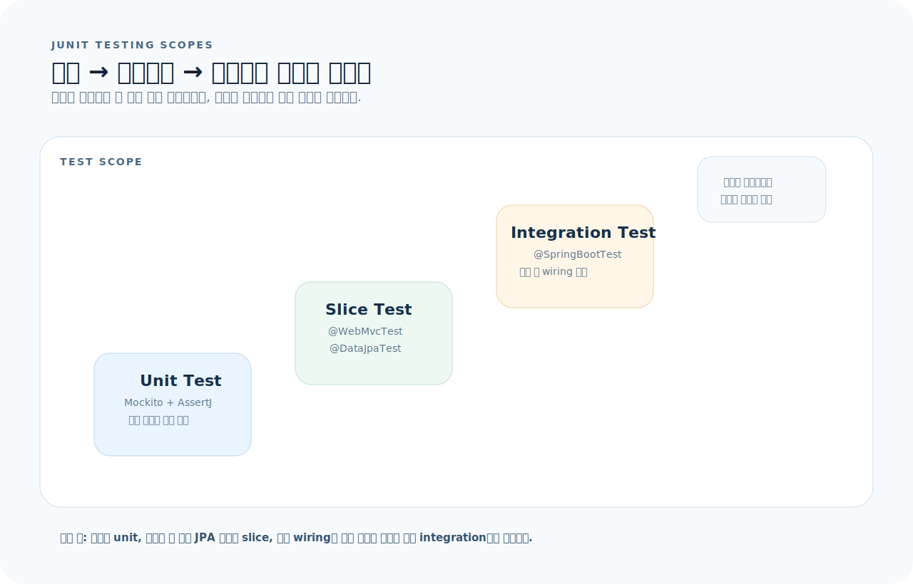
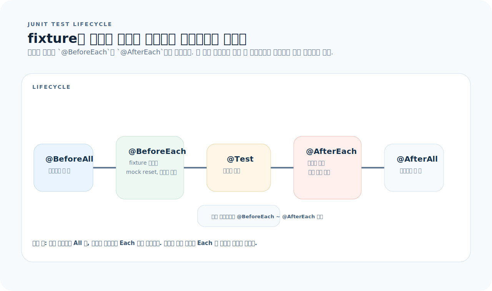
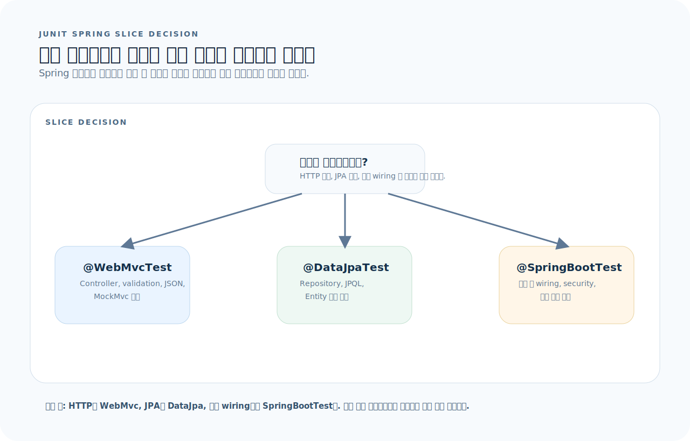

# JUnit 5 완전 가이드

JUnit 5는 Java 테스트의 사실상 표준 프레임워크다. `@Test`로 테스트를 선언하고, AssertJ로 검증하며, Mockito로 의존성을 대체하는 것이 핵심 루프다. 이 글을 읽고 나면 단위 테스트, 통합 테스트, 파라미터화 테스트를 작성하고, Spring Boot 테스트 슬라이스를 다룰 수 있다.



먼저 아래 세 질문을 기준으로 읽으면 JUnit 코드가 훨씬 빨리 정리된다.

1. **테스트 범위:** 이 테스트는 단위(mock), 슬라이스(@DataJpaTest), 통합(@SpringBootTest) 중 어디에 해당하는가?
2. **fixture 관리:** 이 테스트의 사전 조건(데이터, mock)은 어디서 준비하고, 어디서 정리하는가?
3. **실패 원인:** 이 실패는 로직 문제인가, mock 설정 문제인가, 테스트 격리 문제인가?

그림을 위에서 아래로 읽으면 테스트는 범위를 넓힐수록 신뢰도는 올라가지만 속도와 디버깅 난이도는 함께 올라간다. 그래서 JUnit 문서는 `범위 선택`, `fixture 생명주기`, `검증과 mock의 역할 분리`를 기준으로 읽는 편이 가장 빠르다.

---

## 1. 설치와 구조

### Gradle

```kotlin
// build.gradle.kts
dependencies {
    testImplementation("org.springframework.boot:spring-boot-starter-test")
    // starter-test가 포함하는 것들:
    // JUnit 5, AssertJ, Mockito, Hamcrest, JSONPath, MockMvc
}
```

### 프로젝트 구조

```
src/
├── main/java/com/example/myapp/
│   ├── service/UserService.java
│   ├── controller/UserController.java
│   └── repository/UserRepository.java
└── test/java/com/example/myapp/
    ├── service/UserServiceTest.java          # 단위 테스트
    ├── controller/UserControllerTest.java    # MockMvc 테스트
    ├── repository/UserRepositoryTest.java    # @DataJpaTest
    └── integration/UserIntegrationTest.java  # @SpringBootTest
```

---

## 2. 테스트 기본 구조

테스트 메서드 자체보다 준비와 정리가 언제 실행되는지 먼저 잡으면 flaky test를 크게 줄일 수 있다.



- `@BeforeAll`과 `@AfterAll`은 클래스 단위 한 번만 실행된다.
- `@BeforeEach`와 `@AfterEach`는 각 테스트를 감싸므로 fixture 격리의 기본 수단이다.
- 테스트 사이에 상태가 새면 대부분 이 생명주기 설계가 잘못된 경우다.

### 단위 테스트

```java
import org.junit.jupiter.api.Test;
import org.junit.jupiter.api.DisplayName;
import static org.assertj.core.api.Assertions.*;

class CalculatorTest {

    @Test
    @DisplayName("두 수를 더한다")
    void add() {
        Calculator calc = new Calculator();
        int result = calc.add(2, 3);
        assertThat(result).isEqualTo(5);
    }

    @Test
    @DisplayName("0으로 나누면 예외가 발생한다")
    void divideByZero() {
        Calculator calc = new Calculator();
        assertThatThrownBy(() -> calc.divide(10, 0))
            .isInstanceOf(ArithmeticException.class)
            .hasMessageContaining("zero");
    }
}
```

### 생명주기

```java
class LifecycleTest {
    @BeforeAll    // 클래스 시작 전 (static)
    static void initAll() { }

    @BeforeEach   // 각 테스트 전
    void init() { }

    @Test
    void test1() { }

    @Test
    void test2() { }

    @AfterEach    // 각 테스트 후
    void tearDown() { }

    @AfterAll     // 클래스 종료 후 (static)
    static void tearDownAll() { }
}
```

---

## 3. AssertJ — 검증

AssertJ는 JUnit 기본 assert보다 표현력이 높고 자동완성이 잘 된다.

```java
import static org.assertj.core.api.Assertions.*;

// 기본 값 검증
assertThat(value).isEqualTo(expected);
assertThat(value).isNotNull();
assertThat(value).isTrue();
assertThat(value).isBetween(1, 10);

// 문자열
assertThat(name).startsWith("al");
assertThat(name).contains("lic");
assertThat(name).hasSize(5);
assertThat(name).isEqualToIgnoringCase("ALICE");

// 숫자
assertThat(score).isGreaterThan(80);
assertThat(score).isCloseTo(3.14, within(0.01));

// 컬렉션
assertThat(list).hasSize(3);
assertThat(list).contains("a", "b");
assertThat(list).containsExactly("a", "b", "c");     // 순서 포함
assertThat(list).containsExactlyInAnyOrder("c", "a", "b");
assertThat(list).doesNotContain("x");
assertThat(list).isEmpty();

// 객체 필드
assertThat(user).extracting("name", "email")
    .containsExactly("alice", "a@b.com");

// 예외
assertThatThrownBy(() -> service.findById(999L))
    .isInstanceOf(NotFoundException.class)
    .hasMessage("User not found: 999");

assertThatCode(() -> service.validate(input))
    .doesNotThrowAnyException();

// Optional
assertThat(optional).isPresent();
assertThat(optional).isEmpty();
assertThat(optional).hasValue("expected");
```

---

## 4. Mockito — Mock과 Stub

### 기본 사용

```java
@ExtendWith(MockitoExtension.class)
class UserServiceTest {
    @Mock UserRepository userRepository;
    @Mock PasswordEncoder passwordEncoder;
    @InjectMocks UserService userService;

    @Test
    void findById_존재하는_사용자() {
        // given — stub 설정
        User user = User.builder().id(1L).name("alice").email("a@b.com").build();
        given(userRepository.findById(1L)).willReturn(Optional.of(user));

        // when — 실행
        UserResponse result = userService.findById(1L);

        // then — 검증
        assertThat(result.name()).isEqualTo("alice");
        then(userRepository).should().findById(1L);    // 호출 검증
    }

    @Test
    void findById_없는_사용자() {
        given(userRepository.findById(1L)).willReturn(Optional.empty());

        assertThatThrownBy(() -> userService.findById(1L))
            .isInstanceOf(NotFoundException.class);
    }
}
```

### Stub 패턴

```java
// 반환값 설정
given(mock.method(arg)).willReturn(value);
given(mock.method(any())).willReturn(value);
given(mock.method(anyLong())).willReturn(value);

// 예외 설정
given(mock.method(arg)).willThrow(new RuntimeException("error"));

// 연속 호출
given(mock.method(arg))
    .willReturn(first)
    .willReturn(second)
    .willThrow(new RuntimeException());

// void 메서드
willDoNothing().given(mock).voidMethod(arg);
willThrow(new RuntimeException()).given(mock).voidMethod(arg);
```

### 호출 검증

```java
// 호출 횟수 검증
then(mock).should().method(arg);                    // 1번 호출
then(mock).should(times(2)).method(arg);            // 2번 호출
then(mock).should(never()).method(any());            // 호출 안 됨
then(mock).should(atLeastOnce()).method(arg);        // 최소 1번
then(mock).shouldHaveNoMoreInteractions();           // 추가 호출 없음

// 인자 캡처
@Captor ArgumentCaptor<User> userCaptor;

then(userRepository).should().save(userCaptor.capture());
User saved = userCaptor.getValue();
assertThat(saved.getName()).isEqualTo("alice");
```

### Argument Matchers

```java
given(mock.method(anyLong())).willReturn(value);
given(mock.method(any(User.class))).willReturn(value);
given(mock.method(eq("specific"))).willReturn(value);
given(mock.method(argThat(s -> s.startsWith("test")))).willReturn(value);

// 주의: matcher와 리터럴 혼용 금지
// ❌ given(mock.method(anyLong(), "literal"))
// ✅ given(mock.method(anyLong(), eq("literal")))
```

---

## 5. 파라미터화 테스트

```java
@ParameterizedTest
@ValueSource(ints = {1, 2, 3, 4, 5})
void 양수_검증(int number) {
    assertThat(number).isPositive();
}

@ParameterizedTest
@NullAndEmptySource
@ValueSource(strings = {"  ", "\t"})
void 빈_문자열_검증(String input) {
    assertThat(validator.isBlank(input)).isTrue();
}

@ParameterizedTest
@CsvSource({
    "1, 2, 3",
    "10, 20, 30",
    "-1, 1, 0"
})
void 덧셈(int a, int b, int expected) {
    assertThat(calc.add(a, b)).isEqualTo(expected);
}

@ParameterizedTest
@MethodSource("provideUsers")
void 사용자_검증(String name, String email, boolean valid) {
    assertThat(validator.isValid(name, email)).isEqualTo(valid);
}

static Stream<Arguments> provideUsers() {
    return Stream.of(
        Arguments.of("alice", "a@b.com", true),
        Arguments.of("", "a@b.com", false),
        Arguments.of("bob", "", false)
    );
}

@ParameterizedTest
@EnumSource(Role.class)
void 모든_역할(Role role) {
    assertThat(role).isNotNull();
}

@ParameterizedTest
@EnumSource(value = Role.class, names = {"ADMIN", "MANAGER"})
void 관리_역할만(Role role) {
    assertThat(role.isManager()).isTrue();
}
```

---

## 6. Spring Boot 테스트 슬라이스

Spring 테스트는 "많이 띄우는 쪽"이 아니라 "필요한 것만 띄우는 쪽"이 기본이다. 아래 결정 트리로 시작점을 고르면 테스트 속도가 훨씬 좋아진다.



- 컨트롤러 HTTP 계약만 보면 `@WebMvcTest`, JPA만 보면 `@DataJpaTest`가 먼저다.
- 빈 wiring, 시큐리티, DB까지 전체 흐름을 보려는 순간에만 `@SpringBootTest`로 올라간다.
- 슬라이스 테스트는 빠르고 원인이 좁아서, 실패 분석 비용이 낮다.

### @SpringBootTest — 전체 통합

```java
@SpringBootTest
@AutoConfigureMockMvc
@Transactional                   // 각 테스트 후 롤백
class UserIntegrationTest {
    @Autowired MockMvc mockMvc;
    @Autowired ObjectMapper objectMapper;
    @Autowired UserRepository userRepository;

    @Test
    void 사용자_생성_조회_흐름() throws Exception {
        // 생성
        var request = new UserCreateRequest("alice", "a@b.com", "pass1234");
        mockMvc.perform(post("/api/v1/users")
                .contentType(APPLICATION_JSON)
                .content(objectMapper.writeValueAsString(request)))
            .andExpect(status().isCreated())
            .andExpect(jsonPath("$.name").value("alice"));

        // DB 확인
        assertThat(userRepository.findByEmail("a@b.com")).isPresent();
    }
}
```

### @DataJpaTest — Repository 슬라이스

```java
@DataJpaTest
class UserRepositoryTest {
    @Autowired UserRepository userRepository;
    @Autowired TestEntityManager entityManager;

    @Test
    void 이메일_조회() {
        entityManager.persist(User.builder()
            .name("alice").email("a@b.com").password("enc").build());
        entityManager.flush();

        Optional<User> found = userRepository.findByEmail("a@b.com");
        assertThat(found).isPresent();
    }
}
```

### @WebMvcTest — Controller 슬라이스

```java
@WebMvcTest(UserController.class)
class UserControllerSliceTest {
    @Autowired MockMvc mockMvc;
    @MockBean UserService userService;

    @Test
    void 사용자_조회() throws Exception {
        given(userService.findById(1L))
            .willReturn(new UserResponse(1L, "alice", "a@b.com", LocalDateTime.now()));

        mockMvc.perform(get("/api/v1/users/1"))
            .andExpect(status().isOk())
            .andExpect(jsonPath("$.name").value("alice"));
    }

    @Test
    void 없는_사용자_404() throws Exception {
        given(userService.findById(999L))
            .willThrow(new NotFoundException("User not found"));

        mockMvc.perform(get("/api/v1/users/999"))
            .andExpect(status().isNotFound());
    }
}
```

### MockMvc 검증 API

```java
mockMvc.perform(request)
    // 상태
    .andExpect(status().isOk())
    .andExpect(status().isCreated())
    .andExpect(status().isBadRequest())
    .andExpect(status().isNotFound())

    // JSON 본문
    .andExpect(jsonPath("$.name").value("alice"))
    .andExpect(jsonPath("$.items").isArray())
    .andExpect(jsonPath("$.items", hasSize(3)))
    .andExpect(jsonPath("$.items[0].id").isNumber())

    // 헤더
    .andExpect(header().string("Location", "/api/v1/users/1"))

    // 디버깅
    .andDo(print());                // 요청/응답 출력
```

---

## 7. Testcontainers

실제 DB, Redis, Kafka를 Docker로 띄워서 테스트한다.

```kotlin
// build.gradle.kts
dependencies {
    testImplementation("org.testcontainers:testcontainers")
    testImplementation("org.testcontainers:junit-jupiter")
    testImplementation("org.testcontainers:postgresql")
    testImplementation("org.testcontainers:kafka")
}
```

```java
@SpringBootTest
@Testcontainers
class FullIntegrationTest {

    @Container
    static PostgreSQLContainer<?> postgres =
        new PostgreSQLContainer<>("postgres:16-alpine");

    @Container
    static GenericContainer<?> redis =
        new GenericContainer<>("redis:7-alpine").withExposedPorts(6379);

    @DynamicPropertySource
    static void configureProperties(DynamicPropertyRegistry registry) {
        registry.add("spring.datasource.url", postgres::getJdbcUrl);
        registry.add("spring.datasource.username", postgres::getUsername);
        registry.add("spring.datasource.password", postgres::getPassword);
        registry.add("spring.data.redis.host", redis::getHost);
        registry.add("spring.data.redis.port",
            () -> redis.getMappedPort(6379));
    }
}
```

---

## 8. 테스트 유틸리티

### @Nested — 테스트 그룹

```java
class UserServiceTest {
    @Nested
    @DisplayName("findById")
    class FindById {
        @Test void 존재하는_사용자() { }
        @Test void 없는_사용자_예외() { }
    }

    @Nested
    @DisplayName("create")
    class Create {
        @Test void 정상_생성() { }
        @Test void 이메일_중복_예외() { }
    }
}
```

### @Tag — 테스트 필터링

```java
@Tag("slow")
@Test
void 대용량_데이터_테스트() { }

@Tag("integration")
@SpringBootTest
class IntegrationTest { }
```

```bash
# 특정 태그만 실행
./gradlew test -Dgroups=integration
# 특정 태그 제외
./gradlew test -DexcludeGroups=slow
```

### @Disabled

```java
@Disabled("외부 API 연동 대기 중")
@Test
void 외부_연동_테스트() { }
```

---

## 9. 테스트 실행

```bash
# 전체 테스트
./gradlew test

# 특정 클래스
./gradlew test --tests "com.example.UserServiceTest"

# 특정 메서드
./gradlew test --tests "com.example.UserServiceTest.findById_존재하는_사용자"

# 패턴 매치
./gradlew test --tests "*Service*"

# 실패 시 재실행
./gradlew test --rerun

# 상세 출력
./gradlew test --info

# 테스트 리포트
# build/reports/tests/test/index.html
```

---

## 10. 자주 하는 실수

| 실수 | 올바른 방법 |
|------|-------------|
| `@SpringBootTest`로 단위 테스트 작성 | Service 테스트는 `@ExtendWith(MockitoExtension.class)` + Mock |
| 테스트 간 상태 공유 | 각 테스트는 독립적 — `@BeforeEach`에서 초기화 |
| given 없이 mock 호출 | stub 안 된 mock은 null/0 반환 → 예상치 못한 NPE |
| Matcher와 리터럴 혼용 | 모두 matcher이거나 모두 리터럴 |
| `@Transactional` 아닌 통합 테스트에서 데이터 잔류 | `@Transactional`로 자동 롤백 또는 `@AfterEach`에서 정리 |
| 느린 통합 테스트만 작성 | 단위 > 슬라이스 > 통합 순으로 빠른 테스트부터 |
| 검증 없는 테스트 | `assertThat` 없는 테스트는 테스트가 아니다 |

---

## 11. 빠른 참조

```java
// ── 기본 테스트 ──
@Test void 이름() { assertThat(actual).isEqualTo(expected); }

// ── Mock ──
@ExtendWith(MockitoExtension.class)
@Mock Dependency dep;
@InjectMocks Service svc;
given(dep.method(arg)).willReturn(value);
then(dep).should().method(arg);

// ── AssertJ ──
assertThat(value).isEqualTo(expected);
assertThat(list).hasSize(3).contains("a");
assertThatThrownBy(() -> svc.call()).isInstanceOf(Ex.class);

// ── MockMvc ──
@WebMvcTest(Ctrl.class) @MockBean Service svc;
mockMvc.perform(get("/path")).andExpect(status().isOk()).andExpect(jsonPath("$.key").value("v"));

// ── Spring 슬라이스 ──
@DataJpaTest           // Repository 테스트
@WebMvcTest(Ctrl.class) // Controller 테스트
@SpringBootTest         // 전체 통합 테스트

// ── Testcontainers ──
@Container static PostgreSQLContainer<?> pg = new PostgreSQLContainer<>("postgres:16");
@DynamicPropertySource static void props(DynamicPropertyRegistry r) {
    r.add("spring.datasource.url", pg::getJdbcUrl);
}

// ── 실행 ──
// ./gradlew test
// ./gradlew test --tests "*ServiceTest"
```
