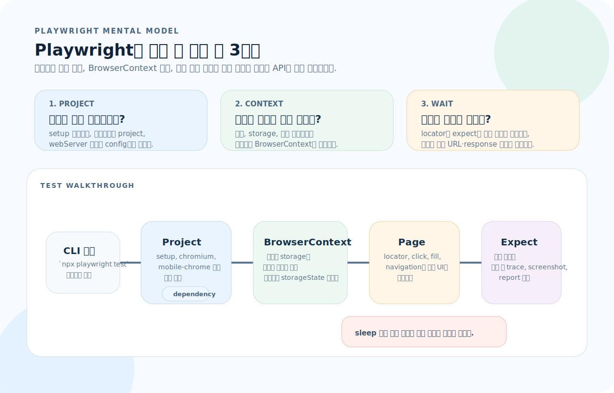
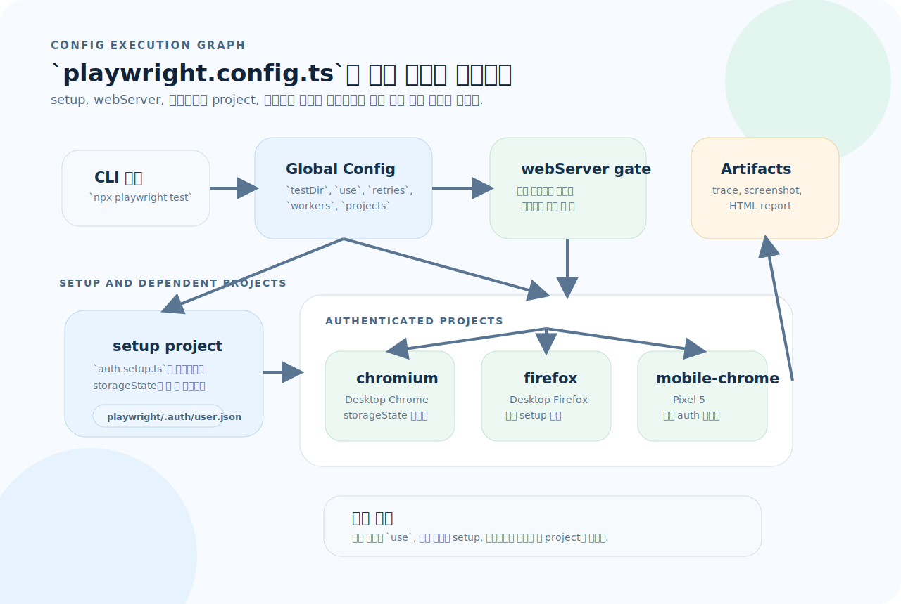
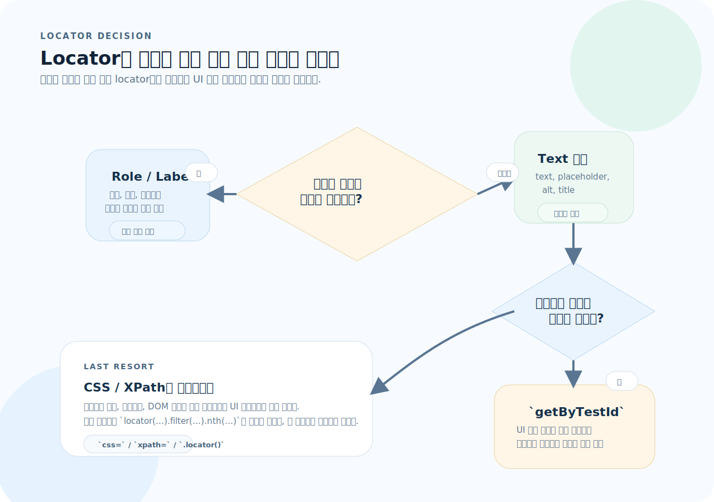
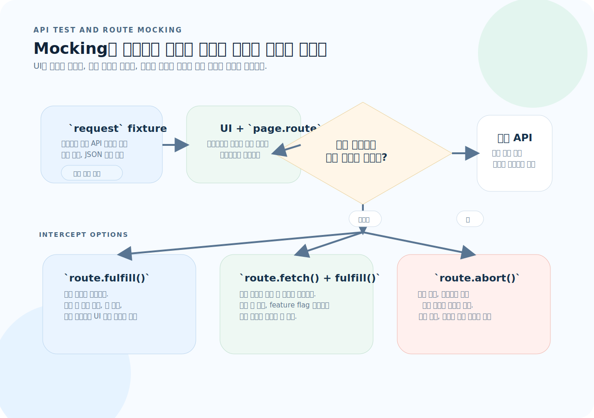

# Playwright 완전 가이드

Playwright는 브라우저 자동화 API 몇 개를 외우는 도구가 아니라, `project -> BrowserContext -> locator/assertion -> report`가 한 흐름으로 맞물리는 테스트 플랫폼이다. 이 문서는 테스트를 어디서 격리하고, 무엇으로 기다리고, 어떤 경계에서 네트워크를 끊을지 빠르게 판단하는 기준을 먼저 잡도록 구성했다.

---

## 1. 설치와 설정

처음 읽을 때는 설치 명령보다 세 가지 질문을 먼저 잡는 편이 빠르다.



- `project`는 브라우저 종류만 고르는 옵션이 아니라, setup 선행 실행과 공통 `use` 옵션을 묶는 실행 단위다.
- 각 테스트는 기본적으로 독립 `BrowserContext`를 쓰므로, 인증 재사용과 상태 격리를 어디서 나눌지 먼저 정해야 한다.
- Playwright의 기다림 전략은 locator와 assertion에 포함되어 있으니, 임의의 sleep보다 "무엇을 기다릴지"를 코드로 선언하는 것이 중요하다.

1. 인증 상태는 어느 setup 프로젝트에서 만들고 어떤 프로젝트가 이를 재사용할 것인가?
2. 테스트 간에 공유되면 안 되는 쿠키, localStorage, 브라우저 탭은 어디서 끊을 것인가?
3. 이 동작은 locator/expect의 자동 대기로 충분한가, 아니면 URL·response·function 조건을 명시해야 하는가?

### 설치

```bash
# 설치
npm init playwright@latest

# 수동 설치
npm install -D @playwright/test
npx playwright install           # 브라우저 바이너리 다운로드

# 특정 브라우저만
npx playwright install chromium
```

### 프로젝트 구조

아래 구조는 파일 트리보다 "setup 결과를 어떤 테스트가 소비하는가"라는 흐름으로 읽으면 이해가 쉽다.

```
project/
├── playwright.config.ts
├── playwright/
│   └── .auth/
│       └── user.json       # storageState 캐시
├── tests/
│   ├── auth.setup.ts        # 인증 설정
│   ├── home.spec.ts
│   ├── login.spec.ts
│   └── fixtures/
│       └── test-data.ts
├── test-results/            # 실행 결과 (gitignore)
└── playwright-report/       # HTML 리포트 (gitignore)
```

---

## 2. playwright.config.ts

`playwright.config.ts`는 단순 옵션 모음이 아니라 테스트 실행 그래프다. setup, 브라우저별 project, webServer, reporter가 어떤 순서로 묶이는지 보면서 읽어야 flaky 원인을 빠르게 찾을 수 있다.



- `setup` 프로젝트가 먼저 로그인 상태를 만들고, 나머지 브라우저 프로젝트가 `dependencies`와 `storageState`로 그 결과를 이어받는다.
- `webServer`는 테스트보다 앞서 앱이 준비되도록 보장하고, `use`는 trace·video·baseURL 같은 공통 실행 규칙을 묶는다.
- 프로젝트가 많아질수록 "공통 옵션"과 "브라우저별 차이"를 config에 드러내야 디버깅이 쉬워진다.

```ts
import { defineConfig, devices } from "@playwright/test";

export default defineConfig({
  // 테스트 디렉터리
  testDir: "./tests",
  testMatch: "**/*.spec.ts",

  // 병렬 실행
  fullyParallel: true,
  workers: process.env.CI ? 1 : undefined,  // CI에서는 단일 워커

  // 재시도
  retries: process.env.CI ? 2 : 0,

  // 리포터
  reporter: process.env.CI
    ? [["html", { open: "never" }], ["github"]]
    : [["html", { open: "on-failure" }]],

  // 전역 설정
  use: {
    baseURL: "http://localhost:3000",
    trace: "on-first-retry",        // 실패 시 트레이스 기록
    screenshot: "only-on-failure",
    video: "retain-on-failure",
  },

  // 브라우저별 프로젝트
  projects: [
    // 인증 설정 (다른 프로젝트보다 먼저 실행)
    {
      name: "setup",
      testMatch: /.*\.setup\.ts/,
    },
    {
      name: "chromium",
      use: {
        ...devices["Desktop Chrome"],
        storageState: "playwright/.auth/user.json",
      },
      dependencies: ["setup"],
    },
    {
      name: "firefox",
      use: {
        ...devices["Desktop Firefox"],
        storageState: "playwright/.auth/user.json",
      },
      dependencies: ["setup"],
    },
    {
      name: "mobile-chrome",
      use: {
        ...devices["Pixel 5"],
        storageState: "playwright/.auth/user.json",
      },
      dependencies: ["setup"],
    },
  ],

  // 테스트 전 앱 서버 시작
  webServer: {
    command: "npm run dev",
    url: "http://localhost:3000",
    reuseExistingServer: !process.env.CI,
    timeout: 120_000,
  },
});
```

---

## 3. 테스트 기본 구조

```ts
import { test, expect } from "@playwright/test";

// 기본 테스트
test("홈페이지가 제목을 보여준다", async ({ page }) => {
  await page.goto("/");
  await expect(page).toHaveTitle(/My App/);
});

// describe로 그룹핑
test.describe("로그인 페이지", () => {
  test.beforeEach(async ({ page }) => {
    await page.goto("/login");
  });

  test("로그인 폼이 보인다", async ({ page }) => {
    await expect(page.getByLabel("이메일")).toBeVisible();
    await expect(page.getByLabel("비밀번호")).toBeVisible();
  });

  test("잘못된 비밀번호로 에러 표시", async ({ page }) => {
    await page.getByLabel("이메일").fill("user@test.com");
    await page.getByLabel("비밀번호").fill("wrong");
    await page.getByRole("button", { name: "로그인" }).click();

    await expect(page.getByText("비밀번호가 올바르지 않습니다")).toBeVisible();
  });
});

// 테스트 제어
test.skip("아직 구현 안 됨", async ({ page }) => { });
test.fixme("버그 수정 후 활성화", async ({ page }) => { });
test.slow(); // 타임아웃 3배

// 태그
test("결제 흐름 @smoke", async ({ page }) => { });
// npx playwright test --grep @smoke
```

### Fixture 확장

```ts
import { test as base, expect } from "@playwright/test";

// 커스텀 Fixture
type MyFixtures = {
  adminPage: Page;
};

const test = base.extend<MyFixtures>({
  adminPage: async ({ browser }, use) => {
    const context = await browser.newContext({
      storageState: "playwright/.auth/admin.json",
    });
    const page = await context.newPage();
    await use(page);
    await context.close();
  },
});

test("관리자 대시보드", async ({ adminPage }) => {
  await adminPage.goto("/admin");
  await expect(adminPage.getByText("관리자 페이지")).toBeVisible();
});

export { test, expect };
```

---

## 4. Locator — 요소 선택

Locator는 셀렉터 문법이 아니라, UI가 바뀌어도 테스트 의도를 얼마나 오래 보존하느냐로 고르는 것이 맞다.



- 역할과 라벨이 드러나는 요소는 `getByRole`, `getByLabel`로 먼저 잡아야 접근성 의미와 테스트 의도가 함께 보존된다.
- 사용자에게 보이는 텍스트나 placeholder는 두 번째 선택지이고, `data-testid`는 안정적인 계약이 있을 때만 쓴다.
- CSS/XPath는 마지막 수단이다. 구조 결합이 강하기 때문에 필터링과 체이닝으로 범위를 줄여도 의미 기반 locator보다 먼저 선택하면 안 된다.

### 사용자 관점 Locator (권장)

```ts
// Role — 가장 권장
page.getByRole("button", { name: "저장" });
page.getByRole("link", { name: "홈으로" });
page.getByRole("heading", { name: "제목", level: 1 });
page.getByRole("textbox", { name: "이메일" });
page.getByRole("checkbox", { name: "약관 동의" });
page.getByRole("tab", { name: "설정" });
page.getByRole("dialog");

// Text
page.getByText("환영합니다");
page.getByText("환영", { exact: false });  // 부분 매칭

// Label — 폼 요소
page.getByLabel("이메일");
page.getByLabel("비밀번호");

// Placeholder
page.getByPlaceholder("검색어를 입력하세요");

// Alt text — 이미지
page.getByAltText("프로필 사진");

// Title
page.getByTitle("닫기");

// Test ID — 다른 방법이 없을 때
page.getByTestId("submit-button");
// HTML: <button data-testid="submit-button">
```

### CSS/XPath Locator (최후의 수단)

```ts
page.locator("css=button.primary");
page.locator("#login-form input[type=email]");
page.locator("xpath=//button[@type='submit']");
```

### Locator 필터링

```ts
// filter — 조건 추가
page.getByRole("listitem").filter({ hasText: "Product" });
page.getByRole("listitem").filter({ has: page.getByRole("heading") });

// nth — 인덱스 (0부터)
page.getByRole("listitem").nth(0);     // 첫 번째
page.getByRole("listitem").first();    // 첫 번째
page.getByRole("listitem").last();     // 마지막

// 체이닝 — 범위를 좁혀 나감
page.getByRole("navigation").getByRole("link", { name: "홈" });
page.locator("article").filter({ hasText: "Playwright" }).getByRole("link");
```

---

## 5. 사용자 인터랙션

### 클릭

```ts
await page.getByRole("button", { name: "저장" }).click();
await page.getByRole("button").dblclick();    // 더블 클릭
await page.getByRole("button").click({ button: "right" }); // 우클릭
await page.getByRole("button").click({ force: true });     // 검사 무시
```

### 입력

```ts
// fill — 기존 값 지우고 입력
await page.getByLabel("이메일").fill("user@test.com");

// type — 한 글자씩 입력 (키보드 이벤트 발생)
await page.getByLabel("검색").pressSequentially("hello", { delay: 100 });

// clear
await page.getByLabel("이메일").clear();

// 파일 업로드
await page.getByLabel("파일 선택").setInputFiles("test.pdf");
await page.getByLabel("파일 선택").setInputFiles([]); // 초기화
```

### 선택

```ts
// select (드롭다운)
await page.getByRole("combobox").selectOption("option-value");
await page.getByRole("combobox").selectOption({ label: "옵션 이름" });

// checkbox / radio
await page.getByRole("checkbox", { name: "약관" }).check();
await page.getByRole("checkbox", { name: "약관" }).uncheck();
await page.getByRole("radio", { name: "남성" }).check();
```

### 키보드와 마우스

```ts
// 키보드
await page.keyboard.press("Enter");
await page.keyboard.press("Control+a");
await page.keyboard.press("Meta+c");       // macOS Cmd+C

// 드래그 앤 드롭
await page.getByTestId("source").dragTo(page.getByTestId("target"));

// 호버
await page.getByText("메뉴").hover();
```

---

## 6. Assertion

### 자동 재시도 Assertion (권장)

```ts
// LocatorAssertions — 자동으로 조건 만족할 때까지 재시도
await expect(page.getByText("저장됨")).toBeVisible();
await expect(page.getByText("저장됨")).not.toBeVisible();
await expect(page.getByRole("button")).toBeEnabled();
await expect(page.getByRole("button")).toBeDisabled();
await expect(page.getByRole("checkbox")).toBeChecked();
await expect(page.getByLabel("이메일")).toHaveValue("user@test.com");
await expect(page.getByLabel("이메일")).toBeEmpty();
await expect(page.getByRole("listitem")).toHaveCount(3);
await expect(page.getByText("제목")).toHaveText("실제 제목");
await expect(page.getByText("제목")).toContainText("제목");
await expect(page.locator(".btn")).toHaveClass(/primary/);
await expect(page.locator(".box")).toHaveCSS("color", "rgb(255, 0, 0)");
await expect(page.locator("input")).toHaveAttribute("type", "email");

// PageAssertions
await expect(page).toHaveTitle(/My App/);
await expect(page).toHaveURL(/dashboard/);
await expect(page).toHaveURL("http://localhost:3000/dashboard");

// 타임아웃 지정
await expect(page.getByText("완료")).toBeVisible({ timeout: 10_000 });
```

### 소프트 Assertion

```ts
// 실패해도 테스트 계속 진행 (마지막에 모아서 실패)
await expect.soft(page.getByText("이름")).toBeVisible();
await expect.soft(page.getByText("이메일")).toBeVisible();
await expect.soft(page.getByText("전화번호")).toBeVisible();
// 하나라도 실패하면 테스트 전체가 실패로 보고됨
```

---

## 7. 페이지 네비게이션과 대기

### 네비게이션

```ts
// 기본 이동
await page.goto("/login");
await page.goto("https://example.com");

// 옵션
await page.goto("/", { waitUntil: "networkidle" });
await page.goto("/", { timeout: 30_000 });

// 뒤로/앞으로
await page.goBack();
await page.goForward();
await page.reload();
```

### 대기 전략

```ts
// ❌ 하드코딩된 대기 — 절대 사용하지 말 것
// await page.waitForTimeout(3000);

// ✅ 자동 재시도 assertion이 대부분의 대기를 처리
await expect(page.getByText("로드 완료")).toBeVisible();

// 네트워크 요청 대기
const responsePromise = page.waitForResponse("**/api/users");
await page.getByRole("button", { name: "새로고침" }).click();
const response = await responsePromise;

// 네비게이션 대기
const navigationPromise = page.waitForURL("**/dashboard");
await page.getByRole("link", { name: "대시보드" }).click();
await navigationPromise;

// 특정 조건 대기
await page.waitForFunction(() => {
  return document.querySelectorAll(".item").length > 5;
});
```

---

## 8. 인증 상태 관리

### 인증 설정 파일

```ts
// tests/auth.setup.ts
import { test as setup, expect } from "@playwright/test";

const authFile = "playwright/.auth/user.json";

setup("인증", async ({ page }) => {
  // 로그인
  await page.goto("/login");
  await page.getByLabel("이메일").fill("user@test.com");
  await page.getByLabel("비밀번호").fill("password123");
  await page.getByRole("button", { name: "로그인" }).click();

  // 로그인 성공 확인
  await expect(page.getByText("대시보드")).toBeVisible();

  // 인증 상태 저장
  await page.context().storageState({ path: authFile });
});
```

### config에서 사용

```ts
// playwright.config.ts
projects: [
  { name: "setup", testMatch: /.*\.setup\.ts/ },
  {
    name: "chromium",
    use: {
      ...devices["Desktop Chrome"],
      storageState: "playwright/.auth/user.json",
    },
    dependencies: ["setup"],
  },
  // 로그인 없이 실행하는 프로젝트
  {
    name: "logged-out",
    use: { ...devices["Desktop Chrome"] },
    testMatch: /.*\.logged-out\.spec\.ts/,
  },
]
```

---

## 9. API 테스트와 Mocking

Mocking은 단순히 응답을 바꾸는 기능이 아니라, 이 테스트가 어느 경계에서 실제 네트워크를 끊는지 결정하는 작업이다.



- `request` fixture는 UI를 거치지 않고 API 계약만 검증할 때 가장 짧은 경로다.
- `page.route + fulfill`은 응답을 완전히 대체하고, `route.fetch + fulfill`은 실제 응답의 일부만 수정하며, `route.abort`는 실패 흐름을 강제로 연다.
- 중요한 것은 mock 코드보다 그 아래의 UI assertion이다. 사용자가 어떤 메시지와 상태를 봐야 하는지를 함께 고정해야 테스트 가치가 생긴다.

### API 테스트

```ts
import { test, expect } from "@playwright/test";

test("API: 사용자 목록 조회", async ({ request }) => {
  const response = await request.get("/api/users");

  expect(response.ok()).toBeTruthy();
  expect(response.status()).toBe(200);

  const users = await response.json();
  expect(users).toHaveLength(3);
  expect(users[0]).toHaveProperty("name");
});

test("API: 사용자 생성", async ({ request }) => {
  const response = await request.post("/api/users", {
    data: { name: "Alice", email: "alice@test.com" },
  });

  expect(response.status()).toBe(201);
  const user = await response.json();
  expect(user.name).toBe("Alice");
});
```

### Route Mocking

```ts
test("API 응답 모킹", async ({ page }) => {
  // 특정 API 응답을 가로채서 변경
  await page.route("**/api/users", async (route) => {
    await route.fulfill({
      status: 200,
      contentType: "application/json",
      body: JSON.stringify([
        { id: 1, name: "Mock User" },
      ]),
    });
  });

  await page.goto("/users");
  await expect(page.getByText("Mock User")).toBeVisible();
});

// 실제 응답 수정
test("API 응답 수정", async ({ page }) => {
  await page.route("**/api/users", async (route) => {
    const response = await route.fetch();
    const json = await response.json();
    json.push({ id: 999, name: "Extra User" });

    await route.fulfill({ response, body: JSON.stringify(json) });
  });

  await page.goto("/users");
});

// 네트워크 에러 시뮬레이션
test("네트워크 에러 처리", async ({ page }) => {
  await page.route("**/api/users", (route) => route.abort("connectionfailed"));

  await page.goto("/users");
  await expect(page.getByText("연결 실패")).toBeVisible();
});
```

---

## 10. 시각적 비교 (스크린샷)

```ts
// 전체 페이지 스냅샷
test("홈 페이지 스냅샷", async ({ page }) => {
  await page.goto("/");
  await expect(page).toHaveScreenshot("home.png");
});

// 특정 요소 스냅샷
test("헤더 스냅샷", async ({ page }) => {
  await page.goto("/");
  const header = page.getByRole("banner");
  await expect(header).toHaveScreenshot("header.png");
});

// 옵션
await expect(page).toHaveScreenshot("full.png", {
  fullPage: true,                     // 전체 스크롤 영역
  maxDiffPixels: 100,                 // 허용 픽셀 차이
  maxDiffPixelRatio: 0.01,            // 허용 비율 (1%)
  mask: [page.locator(".timestamp")], // 동적 요소 마스킹
  animations: "disabled",             // 애니메이션 중지
});

// 스냅샷 업데이트
// npx playwright test --update-snapshots
```

---

## 11. 테스트 구성과 실행

### CLI

```bash
# 전체 실행
npx playwright test

# 특정 파일
npx playwright test login.spec.ts

# 특정 테스트 이름
npx playwright test -g "로그인 성공"

# 특정 프로젝트 (브라우저)
npx playwright test --project=chromium

# 태그
npx playwright test --grep @smoke
npx playwright test --grep-invert @slow

# 병렬 제어
npx playwright test --workers=4

# 브라우저 보면서 실행
npx playwright test --headed

# UI 모드 (인터랙티브)
npx playwright test --ui

# 리포트
npx playwright show-report
```

### 테스트 격리

```ts
// 각 테스트는 새 BrowserContext (독립 세션)
test("테스트 1", async ({ page }) => {
  // 새 컨텍스트, 쿠키/스토리지 없음
});

test("테스트 2", async ({ page }) => {
  // 테스트 1과 완전히 독립
});

// 여러 페이지/탭
test("멀티 탭", async ({ context }) => {
  const page1 = await context.newPage();
  const page2 = await context.newPage();

  await page1.goto("/sender");
  await page2.goto("/receiver");
});
```

---

## 12. 디버깅

```bash
# 디버그 모드 — 브라우저 + Inspector 열림
npx playwright test --debug

# 특정 테스트 디버그
npx playwright test login.spec.ts --debug

# 트레이스 뷰어
npx playwright show-trace test-results/trace.zip

# Codegen — 브라우저 조작을 코드로 기록
npx playwright codegen http://localhost:3000
```

```ts
// 테스트 내부 디버그 포인트
test("디버깅 예시", async ({ page }) => {
  await page.goto("/");
  await page.pause();  // Inspector 열림 — 브레이크포인트처럼 사용
});

// 콘솔 로그 캡처
page.on("console", (msg) => console.log("BROWSER:", msg.text()));

// 페이지 에러 캡처
page.on("pageerror", (err) => console.error("PAGE ERROR:", err));
```

---

## 13. 자주 하는 실수

| 실수 | 원인 | 해결 |
|------|------|------|
| `waitForTimeout` 사용 | 하드코딩 대기 → 느리고 불안정 | `expect(locator).toBeVisible()` 등 자동 재시도 assertion |
| CSS 셀렉터에 의존 | CSS 구조 변경 시 깨짐 | `getByRole`, `getByLabel`, `getByText` 사용 |
| 테스트 간 상태 공유 | 순서 의존성, flaky test | 각 테스트 독립적으로 설계 |
| webServer 설정 누락 | 서버 안 띄우고 테스트 실행 | `playwright.config.ts`에 `webServer` 설정 |
| 동적 콘텐츠 스크린샷 flaky | 시간, 애니메이션 등 변동 | `mask`, `animations: "disabled"` 옵션 |
| `page.click()` 대신 `locator.click()` | Page 메서드는 deprecated 방향 | Locator 기반 API 사용 |
| 인증을 매 테스트마다 반복 | 느린 테스트 | `storageState`로 인증 상태 재사용 |
| `force: true` 남용 | 실제 접근성 문제 숨김 | 요소가 보이고 활성화된 상태인지 먼저 확인 |

---

## 14. 빠른 참조

```ts
import { test, expect } from "@playwright/test";

// 네비게이션
await page.goto("/path");
await page.goBack();
await page.reload();

// Locator (우선순위 순)
page.getByRole("button", { name: "저장" });
page.getByLabel("이메일");
page.getByText("환영합니다");
page.getByPlaceholder("검색");
page.getByAltText("로고");
page.getByTestId("submit");

// 인터랙션
await locator.click();
await locator.fill("text");
await locator.pressSequentially("text", { delay: 50 });
await locator.selectOption("value");
await locator.check();  / .uncheck();
await locator.hover();
await locator.dragTo(target);
await page.keyboard.press("Enter");

// Assertion (자동 재시도)
await expect(locator).toBeVisible();
await expect(locator).toBeHidden();
await expect(locator).toBeEnabled();
await expect(locator).toBeDisabled();
await expect(locator).toBeChecked();
await expect(locator).toHaveText("text");
await expect(locator).toContainText("text");
await expect(locator).toHaveValue("value");
await expect(locator).toHaveCount(3);
await expect(locator).toHaveAttribute("href", "/home");
await expect(locator).toHaveClass(/active/);
await expect(page).toHaveTitle(/App/);
await expect(page).toHaveURL(/dashboard/);
await expect(page).toHaveScreenshot("name.png");

// 필터링
locator.filter({ hasText: "text" });
locator.filter({ has: page.getByRole("img") });
locator.nth(0);  / .first();  / .last();

// 네트워크
await page.route("**/api/**", route => route.fulfill({ body: "{}" }));
const res = page.waitForResponse("**/api/data");

// 실행
// npx playwright test
// npx playwright test --headed
// npx playwright test --ui
// npx playwright test --debug
// npx playwright codegen localhost:3000
// npx playwright show-report
```
