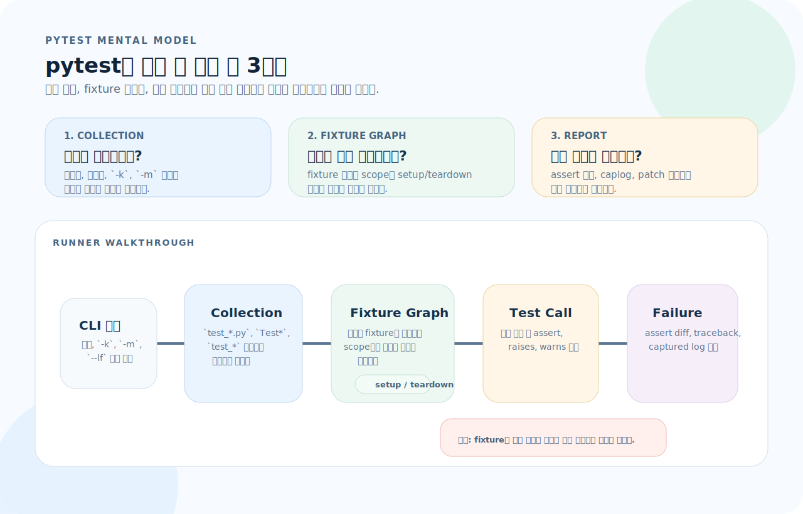
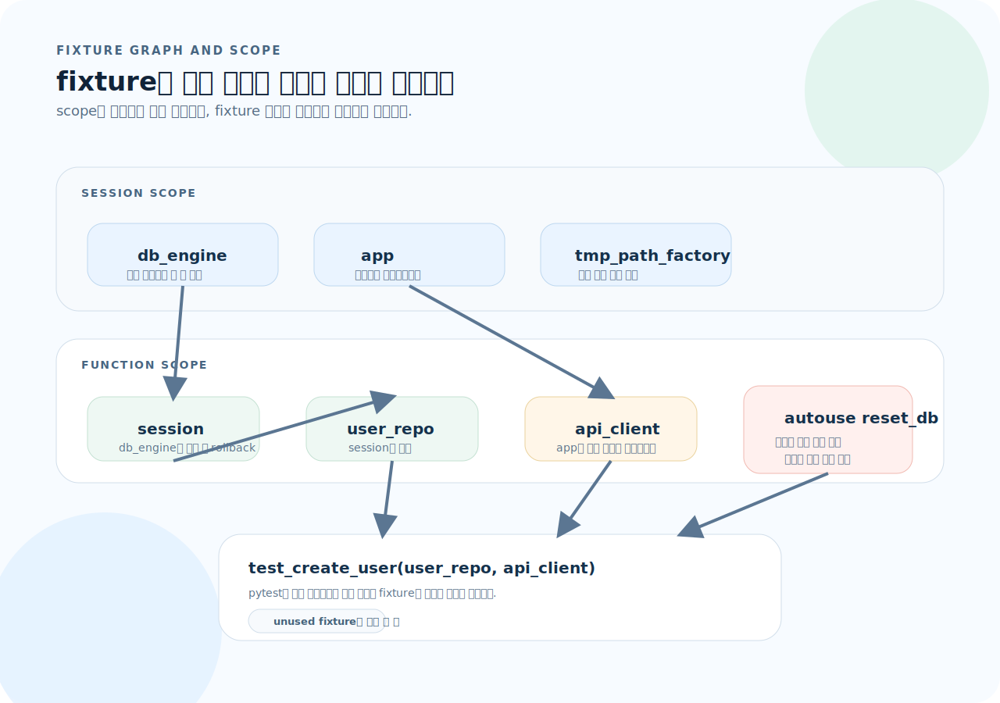
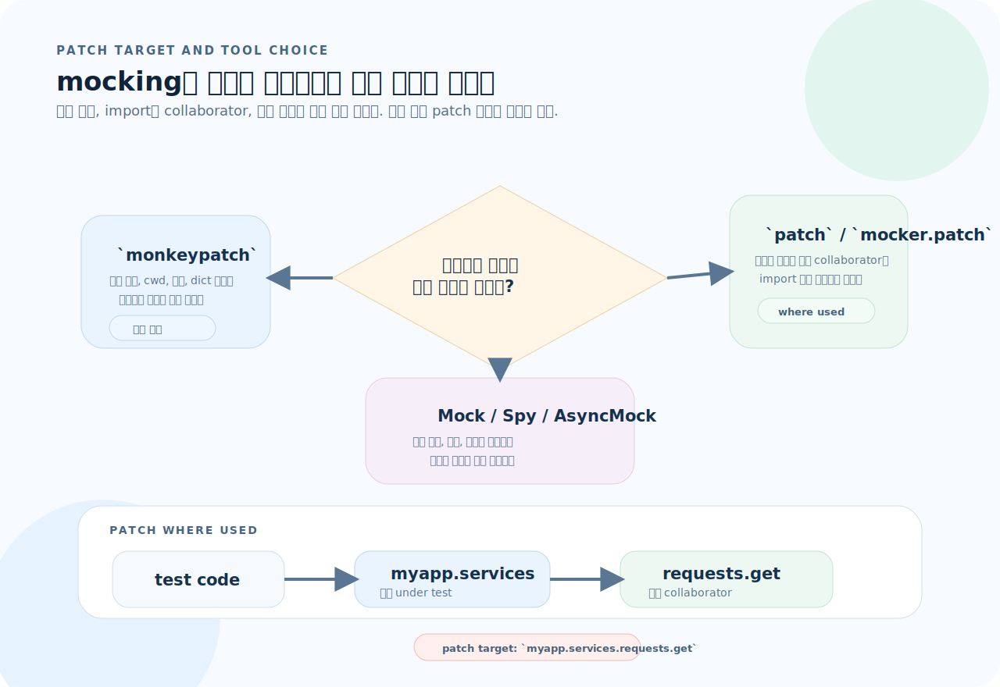
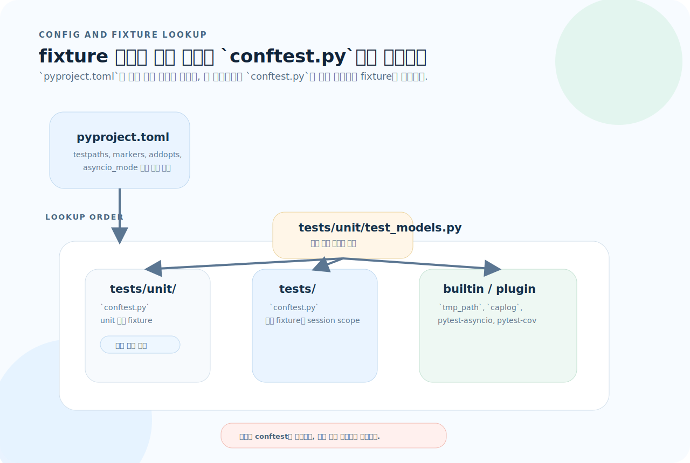

# pytest 완전 가이드

pytest는 `assert` 문법만 배우면 끝나는 도구가 아니라, 수집 규칙과 fixture 의존성 그래프를 읽는 러너다. 이 문서는 어떤 테스트가 수집되고, 어떤 fixture가 먼저 준비되며, 어떤 지점에서 상태를 격리해야 하는지를 기준으로 다시 정리했다.

---

## 1. 설치와 실행

명령어를 외우기 전에 pytest를 어떤 모델로 읽을지부터 잡는 편이 빠르다.



- pytest는 파일을 수집한 뒤 바로 테스트를 실행하는 것이 아니라, 먼저 fixture 그래프를 해석하고 필요한 setup/teardown을 엮는다.
- `-k`, `-m`, 경로 지정은 단순 필터가 아니라 "어떤 테스트 집합을 러너에 넘길지" 정하는 수집 제어 장치다.
- 실패 리포트의 가치는 `assert` 자체보다 fixture와 patch가 어떤 상태를 만들었는지 추적할 수 있을 때 커진다.

1. 이 테스트는 어떤 이름과 경로 규칙으로 수집되는가?
2. 실행 전에 어떤 fixture가 어떤 scope로 준비되고, 실행 후 어디서 정리되는가?
3. 이 실패는 함수 로직 문제인가, fixture 그래프나 patch 대상이 잘못된 문제인가?

### 설치

```bash
# 설치
pip install pytest
# 또는 uv
uv add --dev pytest

# 실행
pytest                           # 전체 테스트
pytest -q                        # 간략 출력
python -m pytest                 # 모듈로 실행 (import 경로 안전)
pytest tests/test_user.py        # 특정 파일
pytest tests/test_user.py::test_create  # 특정 함수
pytest -k "login and not admin"  # 이름 필터
pytest --lf                      # 마지막 실패 테스트만 재실행
pytest --ff                      # 실패 우선 실행
pytest -x                        # 첫 실패에서 중단
pytest -v                        # 상세 출력
pytest -s                        # print 출력 표시
pytest --tb=short                # traceback 간략화
```

### 프로젝트 구조

```
project/
├── pyproject.toml
├── src/
│   └── myapp/
│       ├── __init__.py
│       ├── models.py
│       └── services.py
└── tests/
    ├── conftest.py          # 공통 fixture
    ├── test_models.py
    ├── test_services.py
    └── integration/
        ├── conftest.py      # 통합 테스트 전용 fixture
        └── test_api.py
```

---

## 2. 테스트 기본 구조

### 함수 기반 테스트

```python
# tests/test_calculator.py

def test_add():
    assert 1 + 1 == 2

def test_subtract():
    result = 10 - 3
    assert result == 7
    assert result > 0

def test_string_contains():
    greeting = "Hello, World!"
    assert "World" in greeting
    assert greeting.startswith("Hello")
```

### 클래스 기반 테스트

```python
class TestUser:
    def test_create(self):
        user = User(name="Alice")
        assert user.name == "Alice"

    def test_default_role(self):
        user = User(name="Bob")
        assert user.role == "viewer"

    def test_full_name(self):
        user = User(first="Alice", last="Kim")
        assert user.full_name == "Alice Kim"
```

### setup / teardown

```python
class TestDatabase:
    def setup_method(self):
        """각 테스트 전 실행"""
        self.db = create_test_db()

    def teardown_method(self):
        """각 테스트 후 실행"""
        self.db.close()

    def test_insert(self):
        self.db.insert({"name": "Alice"})
        assert self.db.count() == 1

# 모듈 레벨
def setup_module(module):
    """파일 시작 시 한 번"""
    pass

def teardown_module(module):
    """파일 끝에 한 번"""
    pass
```

> **setup/teardown보다 fixture를 권장** — 더 유연하고 재사용 가능

---

## 3. Assertion

### 기본 assert

```python
# pytest는 assert 실패 시 상세한 비교 정보를 자동 출력
def test_assertions():
    # 동등
    assert result == expected

    # 포함
    assert "error" in message
    assert item in collection

    # 비교
    assert count > 0
    assert 0 < value < 100

    # 참/거짓
    assert is_valid
    assert not is_deleted

    # None
    assert result is None
    assert result is not None

    # 타입
    assert isinstance(user, User)
```

### 컬렉션 비교

```python
def test_list_comparison():
    result = [1, 2, 3]
    expected = [1, 2, 3]
    assert result == expected  # 순서까지 비교

    # 순서 무관 비교
    assert set(result) == set(expected)
    assert sorted(result) == sorted(expected)

def test_dict_comparison():
    result = {"name": "Alice", "age": 30}
    assert result["name"] == "Alice"
    assert "age" in result
    assert result == {"name": "Alice", "age": 30}

    # 부분 비교
    assert result.items() >= {"name": "Alice"}.items()
```

### 부동소수점 비교

```python
def test_float():
    # 직접 비교 주의 — 부동소수점 오차
    assert 0.1 + 0.2 != 0.3  # True!

    # pytest.approx 사용
    assert 0.1 + 0.2 == pytest.approx(0.3)
    assert [0.1 + 0.2, 0.2 + 0.4] == pytest.approx([0.3, 0.6])
    assert result == pytest.approx(expected, abs=1e-6)
    assert result == pytest.approx(expected, rel=0.01)  # 상대 오차 1%
```

---

## 4. Fixture

fixture는 단순 helper 함수가 아니라 pytest가 해석하는 의존성 그래프다. 어떤 fixture가 다른 fixture에 기대는지, 그리고 scope가 얼마나 오래 유지되는지를 함께 보면서 읽어야 한다.



- pytest는 테스트 함수의 매개변수를 보고 필요한 fixture를 역으로 계산한다. 그래서 `user_repo(session)` 같은 선언이 실행 순서를 결정한다.
- scope가 넓을수록 재사용은 쉬워지지만 상태 오염 위험도 커진다. `session`과 `module`은 캐시, `function`은 격리라는 감각으로 선택하는 편이 안전하다.
- `autouse` fixture는 편리하지만 흐름이 숨기 쉬우므로, 무엇을 자동 적용하는지 이름과 역할을 짧고 분명하게 유지해야 한다.

### 기본 fixture

```python
import pytest

@pytest.fixture
def user():
    return User(name="Alice", email="alice@test.com")

@pytest.fixture
def admin_user():
    return User(name="Admin", role="admin")

# 테스트에서 사용 — 매개변수명으로 자동 주입
def test_user_name(user):
    assert user.name == "Alice"

def test_admin_role(admin_user):
    assert admin_user.role == "admin"
```

### Fixture scope

```python
@pytest.fixture(scope="function")  # 기본값 — 매 테스트마다
def fresh_user():
    return User(name="Alice")

@pytest.fixture(scope="module")    # 파일당 한 번
def db_connection():
    conn = create_connection()
    yield conn
    conn.close()

@pytest.fixture(scope="session")   # 전체 테스트 세션에서 한 번
def app():
    app = create_app()
    yield app
    app.shutdown()
```

### yield fixture — setup + teardown

```python
@pytest.fixture
def temp_file():
    # Setup
    path = Path("test_data.txt")
    path.write_text("test content")

    yield path  # 테스트에 전달

    # Teardown (테스트 후 항상 실행)
    path.unlink(missing_ok=True)

def test_read_file(temp_file):
    content = temp_file.read_text()
    assert content == "test content"
```

### Fixture 합성

```python
@pytest.fixture
def db():
    engine = create_engine("sqlite:///:memory:")
    yield engine
    engine.dispose()

@pytest.fixture
def session(db):           # db fixture를 의존성으로 주입
    session = Session(db)
    yield session
    session.rollback()

@pytest.fixture
def user_repo(session):    # session fixture 의존
    return UserRepository(session)

def test_create_user(user_repo):  # 자동으로 db → session → user_repo 순서
    user_repo.create(User(name="Alice"))
    assert user_repo.count() == 1
```

### conftest.py — 공유 fixture

```python
# tests/conftest.py — tests/ 하위 모든 테스트에서 사용 가능
import pytest

@pytest.fixture
def api_client():
    from myapp import create_app
    app = create_app(testing=True)
    with app.test_client() as client:
        yield client

@pytest.fixture(autouse=True)   # 모든 테스트에 자동 적용
def reset_db(db):
    yield
    db.rollback()
```

### 내장 fixture

```python
def test_with_tmp_path(tmp_path):
    """임시 디렉터리 — 테스트 끝나면 자동 정리"""
    file = tmp_path / "data.txt"
    file.write_text("hello")
    assert file.read_text() == "hello"

def test_capture_output(capsys):
    """stdout/stderr 캡처"""
    print("hello")
    captured = capsys.readouterr()
    assert captured.out == "hello\n"

def test_capture_log(caplog):
    """로그 캡처"""
    import logging
    logging.warning("test warning")
    assert "test warning" in caplog.text

def test_with_tempdir(tmp_path_factory):
    """session scope 임시 디렉터리"""
    d = tmp_path_factory.mktemp("data")
    file = d / "test.txt"
    file.write_text("content")
```

---

## 5. 파라미터화

### 기본

```python
@pytest.mark.parametrize("input,expected", [
    ("hello", 5),
    ("", 0),
    ("abc", 3),
])
def test_string_length(input, expected):
    assert len(input) == expected

# id로 테스트 이름 지정
@pytest.mark.parametrize("a,b,expected", [
    pytest.param(1, 2, 3, id="positive"),
    pytest.param(-1, -1, -2, id="negative"),
    pytest.param(0, 0, 0, id="zero"),
])
def test_add(a, b, expected):
    assert add(a, b) == expected
```

### 다중 파라미터화

```python
# 데카르트 곱 — 모든 조합 테스트
@pytest.mark.parametrize("x", [1, 2])
@pytest.mark.parametrize("y", [10, 20])
def test_multiply(x, y):
    assert x * y > 0
# 4개 테스트: (1,10), (1,20), (2,10), (2,20)
```

### Fixture 파라미터화

```python
@pytest.fixture(params=["sqlite", "postgres"])
def db_engine(request):
    engine = create_engine(request.param)
    yield engine
    engine.dispose()

def test_query(db_engine):
    # sqlite, postgres 각각에 대해 실행됨
    result = db_engine.execute("SELECT 1")
    assert result is not None
```

---

## 6. Mark — 테스트 분류와 제어

### 내장 mark

```python
@pytest.mark.skip(reason="아직 구현 안 됨")
def test_future_feature():
    pass

@pytest.mark.skipif(
    sys.platform == "win32",
    reason="Windows에서 미지원"
)
def test_unix_only():
    pass

@pytest.mark.xfail(reason="알려진 버그, 수정 예정")
def test_known_bug():
    assert False  # 실패해도 테스트 통과로 처리

@pytest.mark.xfail(strict=True)  # 성공하면 오히려 실패 처리
def test_should_fail():
    assert False
```

### 커스텀 mark

```python
# pyproject.toml에 등록
# [tool.pytest.ini_options]
# markers = [
#     "slow: 느린 테스트",
#     "integration: 통합 테스트",
#     "smoke: 핵심 기능 테스트",
# ]

@pytest.mark.slow
def test_heavy_computation():
    pass

@pytest.mark.integration
def test_external_api():
    pass

# 실행
# pytest -m slow              # slow만
# pytest -m "not slow"        # slow 제외
# pytest -m "smoke and not integration"
```

---

## 7. monkeypatch — 환경 격리

```python
def test_env_variable(monkeypatch):
    """환경 변수 설정"""
    monkeypatch.setenv("DATABASE_URL", "sqlite:///:memory:")
    monkeypatch.delenv("SECRET_KEY", raising=False)

    config = load_config()
    assert "memory" in config.database_url

def test_mock_function(monkeypatch):
    """함수/메서드 교체"""
    def mock_fetch(url):
        return {"status": 200, "data": "mocked"}

    monkeypatch.setattr("myapp.services.fetch", mock_fetch)

    result = my_service.get_data("https://api.example.com")
    assert result["data"] == "mocked"

def test_mock_attribute(monkeypatch):
    """객체 속성 교체"""
    monkeypatch.setattr(Config, "MAX_RETRIES", 1)
    assert Config.MAX_RETRIES == 1

def test_mock_dict(monkeypatch):
    """딕셔너리 값 변경"""
    monkeypatch.setitem(os.environ, "API_KEY", "test-key")

def test_change_cwd(monkeypatch, tmp_path):
    """작업 디렉터리 변경"""
    monkeypatch.chdir(tmp_path)
    assert Path.cwd() == tmp_path
```

---

## 8. Mock과 Patch

mocking 도구는 비슷해 보여도 적용 지점이 다르다. 환경 변수·작업 디렉터리 같은 프로세스 상태를 바꾸는지, 모듈이 가져다 쓰는 collaborator를 끊는지, 호출 기록까지 검증할지가 먼저 나뉜다.



- `monkeypatch`는 환경 변수, 속성, 작업 디렉터리처럼 "프로세스 상태"를 잠깐 바꿨다가 자동 복원할 때 맞다.
- `patch`나 `mocker.patch`는 정의한 곳이 아니라 "모듈이 실제로 참조하는 경로"를 끊어야 한다. 그래서 `myapp.services.requests.get` 같은 경로가 자주 등장한다.
- 호출 횟수, 인자, 비동기 반환까지 검증하려면 `Mock`, `MagicMock`, `AsyncMock`, `spy`를 조합하는 편이 명확하다.

```python
from unittest.mock import Mock, patch, MagicMock, AsyncMock

# Mock 객체
def test_with_mock():
    repo = Mock(spec=UserRepository)
    repo.find_by_id.return_value = User(id=1, name="Alice")

    service = UserService(repo)
    user = service.get_user(1)

    assert user.name == "Alice"
    repo.find_by_id.assert_called_once_with(1)

# side_effect — 호출마다 다른 동작
def test_side_effect():
    mock = Mock()
    mock.side_effect = [1, 2, 3]
    assert mock() == 1
    assert mock() == 2
    assert mock() == 3

    # 예외 발생
    mock.side_effect = ValueError("에러")
    with pytest.raises(ValueError):
        mock()

# patch — 특정 모듈의 객체를 교체
@patch("myapp.services.requests.get")
def test_api_call(mock_get):
    mock_get.return_value = Mock(
        status_code=200,
        json=Mock(return_value={"name": "Alice"}),
    )

    result = fetch_user(1)
    assert result["name"] == "Alice"

# patch as context manager
def test_with_context():
    with patch("myapp.services.send_email") as mock_send:
        mock_send.return_value = True
        result = register_user("Alice", "alice@test.com")
        assert result is True
        mock_send.assert_called_once()

# MagicMock — 매직 메서드 지원
def test_magic_mock():
    mock = MagicMock()
    mock.__len__.return_value = 5
    assert len(mock) == 5
```

---

## 9. 예외와 경고 테스트

### 예외 검증

```python
def test_raises():
    with pytest.raises(ValueError):
        int("not_a_number")

def test_raises_with_match():
    with pytest.raises(ValueError, match="invalid literal"):
        int("abc")

def test_raises_access_exception():
    with pytest.raises(ZeroDivisionError) as exc_info:
        1 / 0
    assert "division by zero" in str(exc_info.value)

# 특정 예외가 발생하지 않는지 확인
def test_no_exception():
    result = safe_divide(10, 2)  # 예외 없이 정상 반환
    assert result == 5
```

### 경고 검증

```python
def test_warning():
    with pytest.warns(DeprecationWarning):
        deprecated_function()

def test_warning_match():
    with pytest.warns(UserWarning, match="사용 중단"):
        warn_user()
```

---

## 10. 비동기 테스트

```python
# pip install pytest-asyncio
import pytest

@pytest.mark.asyncio
async def test_async_function():
    result = await fetch_data()
    assert result is not None

@pytest.mark.asyncio
async def test_async_context():
    async with AsyncClient() as client:
        response = await client.get("/api/users")
        assert response.status_code == 200

# 비동기 fixture
@pytest.fixture
async def async_client():
    async with AsyncClient(app=app, base_url="http://test") as client:
        yield client

@pytest.mark.asyncio
async def test_create_user(async_client):
    response = await async_client.post("/api/users", json={"name": "Alice"})
    assert response.status_code == 201
```

---

## 11. 설정 — pyproject.toml / conftest.py

pytest 설정은 옵션 모음과 fixture 탐색 규칙이 함께 움직인다. `pyproject.toml`이 전역 수집 규칙을 정하고, `conftest.py`는 디렉터리 경계마다 fixture를 쌓아 올린다.



- `pyproject.toml`은 어떤 파일을 테스트로 볼지, 어떤 marker를 허용할지, 어떤 기본 옵션을 적용할지 전역 기준을 정한다.
- fixture 탐색은 항상 "가장 가까운 `conftest.py` -> 상위 디렉터리 `conftest.py` -> builtin/plugin" 순서로 올라간다.
- 테스트를 읽을 때는 코드보다 먼저 가까운 `conftest.py`를 확인해야 fixture 주입과 patch 범위가 보인다.

### pyproject.toml

```toml
[tool.pytest.ini_options]
# 테스트 디렉터리
testpaths = ["tests"]

# 파일, 클래스, 함수 패턴
python_files = ["test_*.py"]
python_classes = ["Test*"]
python_functions = ["test_*"]

# 기본 옵션
addopts = [
    "-ra",           # 요약에 모든 비통과 테스트 표시
    "--strict-markers",  # 등록 안 된 marker 에러
    "--tb=short",    # traceback 간략화
    "-q",            # 간략 출력
]

# 커스텀 marker
markers = [
    "slow: 느린 테스트",
    "integration: 통합 테스트",
]

# 최소 pytest 버전
minversion = "7.0"

# 비동기 모드 (pytest-asyncio)
asyncio_mode = "auto"

# 경고 필터
filterwarnings = [
    "error",                           # 모든 경고를 에러로
    "ignore::DeprecationWarning",      # DeprecationWarning 무시
]
```

### conftest.py 계층

```python
# tests/conftest.py
import pytest

@pytest.fixture(scope="session")
def app():
    from myapp import create_app
    return create_app(testing=True)

# tests/integration/conftest.py
import pytest

@pytest.fixture
def api_client(app):
    with app.test_client() as client:
        yield client
```

---

## 12. 유용한 플러그인

| 플러그인 | 용도 | 설치 |
|---------|------|------|
| `pytest-asyncio` | 비동기 테스트 | `pip install pytest-asyncio` |
| `pytest-cov` | 커버리지 측정 | `pip install pytest-cov` |
| `pytest-xdist` | 병렬 실행 | `pip install pytest-xdist` |
| `pytest-mock` | `mocker` fixture | `pip install pytest-mock` |
| `pytest-timeout` | 테스트 타임아웃 | `pip install pytest-timeout` |
| `pytest-randomly` | 순서 랜덤화 | `pip install pytest-randomly` |

```bash
# 커버리지
pytest --cov=src --cov-report=html --cov-report=term-missing

# 병렬 실행
pytest -n auto        # CPU 코어 수만큼
pytest -n 4           # 4개 프로세스

# 타임아웃
pytest --timeout=10   # 테스트당 10초
```

```python
# pytest-mock — mocker fixture
def test_with_mocker(mocker):
    mock_send = mocker.patch("myapp.services.send_email")
    mock_send.return_value = True

    register_user("Alice", "alice@test.com")
    mock_send.assert_called_once()

    # spy — 원래 함수 호출하면서 기록
    spy = mocker.spy(user_service, "validate")
    user_service.create(data)
    spy.assert_called_once_with(data)
```

---

## 13. 자주 하는 실수

| 실수 | 원인 | 해결 |
|------|------|------|
| conftest.py 안 읽고 테스트 파악 시도 | fixture 의존성 파악 불가 | conftest.py부터 먼저 읽기 |
| fixture scope 과다 (session) | 테스트 간 상태 오염 | 격리 필요하면 `function` scope |
| assert 메시지 없이 디버깅 어려움 | 실패 시 컨텍스트 부족 | `assert x == y, f"기대: {y}, 실제: {x}"` |
| `monkeypatch` 대신 전역 상태 직접 수정 | 다른 테스트에 영향 | monkeypatch는 자동 복원됨 |
| `import` 경로와 `patch` 경로 불일치 | mock 적용 안 됨 | **사용하는 모듈** 기준으로 patch |
| 플러그인 자동 로드 간섭 | 예상 밖 동작 | `PYTEST_DISABLE_PLUGIN_AUTOLOAD=1` |
| 비동기 테스트에 `@pytest.mark.asyncio` 누락 | 테스트 실행 안 됨 | mark 추가 또는 `asyncio_mode = "auto"` |
| `tmp_path` 안 쓰고 고정 경로 사용 | 환경 의존성, 정리 안 됨 | `tmp_path` 내장 fixture 사용 |
| 테스트 함수명 `test_` 안 붙임 | pytest가 수집 안 함 | `test_` 접두어 필수 |

---

## 14. 빠른 참조

```python
import pytest

# 기본 테스트
def test_basic():
    assert 1 + 1 == 2

# Fixture
@pytest.fixture
def data():
    return {"key": "value"}

@pytest.fixture(scope="session")
def db():
    conn = connect()
    yield conn
    conn.close()

# 파라미터화
@pytest.mark.parametrize("input,expected", [("a", 1), ("b", 2)])
def test_param(input, expected): ...

# 예외
with pytest.raises(ValueError, match="msg"): ...

# 근사값
assert 0.1 + 0.2 == pytest.approx(0.3)

# Mark
@pytest.mark.skip(reason="...")
@pytest.mark.skipif(condition, reason="...")
@pytest.mark.xfail(reason="...")
@pytest.mark.slow

# monkeypatch
monkeypatch.setenv("KEY", "val")
monkeypatch.setattr(module, "func", mock_func)
monkeypatch.delenv("KEY", raising=False)

# 내장 fixture
tmp_path        # Path — 임시 디렉터리
capsys          # stdout/stderr 캡처
caplog          # 로그 캡처
monkeypatch     # 환경 격리
request         # fixture 메타정보

# CLI
# pytest -q                    간략 출력
# pytest -v                    상세 출력
# pytest -x                    첫 실패에서 중단
# pytest -k "name"             이름 필터
# pytest -m "mark"             mark 필터
# pytest --lf                  마지막 실패만
# pytest --co                  수집만 (실행 안 함)
# pytest -s                    print 출력 표시
# pytest --cov=src             커버리지
# pytest -n auto               병렬 실행
```
