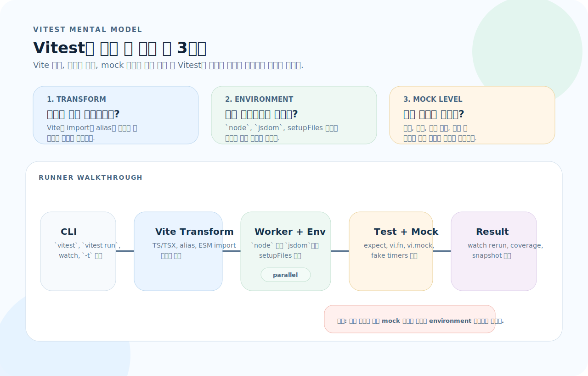
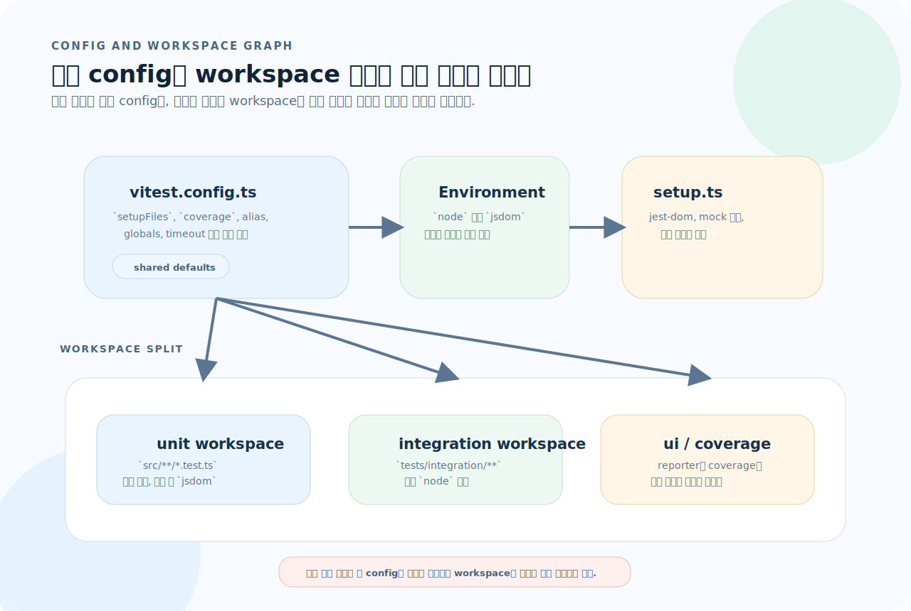
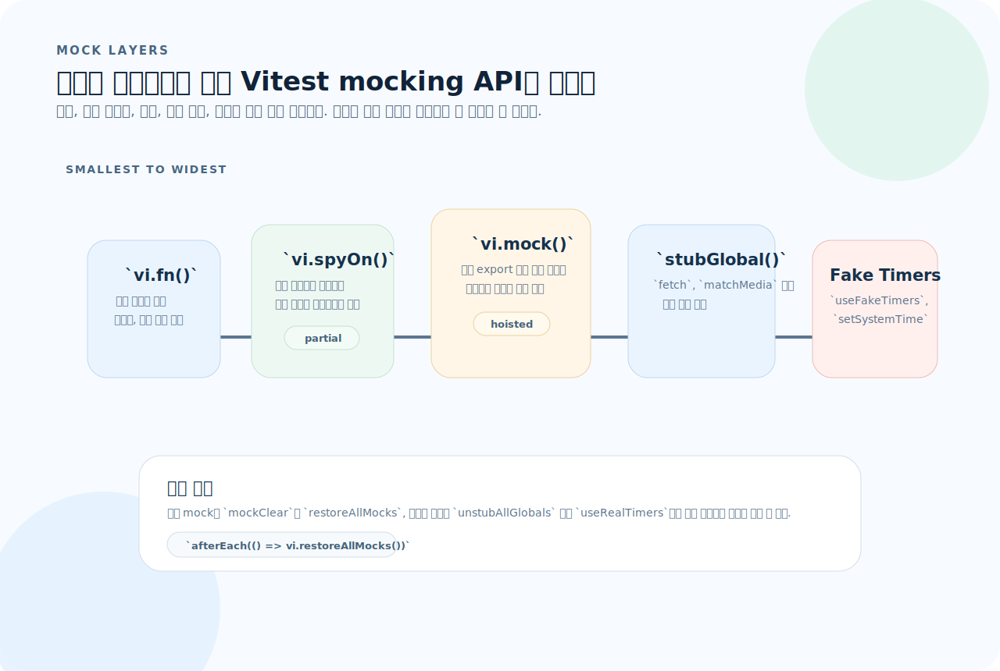
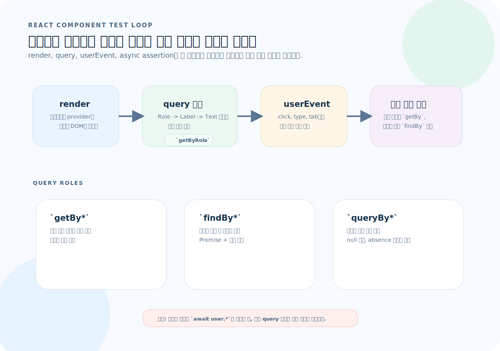

# Vitest 완전 가이드

Vitest는 Jest 호환 API만 흉내 내는 도구가 아니라, Vite의 변환 파이프라인과 테스트 러너가 붙어 있는 실행기다. 이 문서는 어떤 environment에서 코드를 돌릴지, 어떤 레벨에서 모킹할지, 그리고 React 테스트를 어떤 쿼리 흐름으로 읽어야 하는지 중심으로 다시 정리했다.

---

## 1. 설치와 설정

처음 볼 때는 설치 명령보다 Vitest가 어떤 층으로 실행되는지부터 이해하는 편이 낫다.



- Vitest는 테스트 파일을 바로 실행하지 않고, 먼저 Vite 변환과 모듈 그래프를 통과시킨 뒤 worker에서 돌린다.
- `environment`, `setupFiles`, `globals`, `coverage`는 독립 옵션이 아니라 "같은 테스트를 어떤 런타임에서 어떤 전처리와 함께 돌릴지" 정하는 묶음이다.
- 빠른 실행 속도는 공짜가 아니다. 어느 수준에서 mock을 끊고 어떤 파일만 watch 대상으로 삼는지까지 설계해야 체감 성능이 나온다.

1. 이 테스트는 `node`인가 `jsdom`인가, 아니면 workspace로 분리해야 하는가?
2. 이 mock은 함수, 객체 메서드, 모듈, 전역 객체, 시간 중 어느 레벨을 바꾸는가?
3. 이 테스트는 watch에서 빠르게 반복할 unit인가, 별도 설정으로 분리할 integration/e2e인가?

### 설치

```bash
# 설치
npm install -D vitest

# React 테스트 추가
npm install -D @testing-library/react @testing-library/jest-dom jsdom

# 실행
npx vitest           # watch 모드
npx vitest run       # 일회성 (CI용)
```

### 프로젝트 구조

```
project/
├── vitest.config.ts         # 또는 vite.config.ts에 통합
├── src/
│   ├── utils/
│   │   ├── format.ts
│   │   └── format.test.ts   # 코드 옆에 테스트
│   └── components/
│       ├── Button.tsx
│       └── Button.test.tsx
└── tests/                   # 또는 별도 디렉터리
    ├── setup.ts             # 전역 setup
    └── integration/
        └── api.test.ts
```

---

## 2. vitest.config.ts

`vitest.config.ts`는 단일 옵션 파일이 아니라 기본 런타임을 정의하는 곳이고, `vitest.workspace.ts`는 그 기본값을 여러 테스트 집합으로 나누는 확장 지점이다.



- 기본 config에는 공통 `setupFiles`, `coverage`, alias, timeout처럼 모든 테스트가 공유할 규칙을 둔다.
- `environment: "jsdom"`과 `environment: "node"`를 한 덩어리로 섞기보다, workspace에서 unit·integration을 나누는 편이 유지 보수에 유리하다.
- React 테스트가 많아질수록 "공통 전처리"와 "런타임 차이"를 분리해 두어야 watch 속도와 디버깅 경험이 같이 좋아진다.

```ts
import { defineConfig } from "vitest/config";
import react from "@vitejs/plugin-react";

export default defineConfig({
  plugins: [react()],
  test: {
    // 환경 설정
    environment: "jsdom",          // DOM 테스트용 (기본: "node")

    // 전역 import 없이 사용
    globals: true,                  // describe, it, expect 전역 노출

    // 전역 setup
    setupFiles: ["./tests/setup.ts"],

    // 파일 패턴
    include: ["**/*.{test,spec}.{ts,tsx}"],
    exclude: ["node_modules", "dist", "e2e"],

    // 커버리지
    coverage: {
      provider: "v8",              // 또는 "istanbul"
      reporter: ["text", "html", "lcov"],
      include: ["src/**"],
      exclude: ["src/**/*.test.ts", "src/**/*.d.ts"],
      thresholds: {
        lines: 80,
        functions: 80,
        branches: 80,
      },
    },

    // 타임아웃
    testTimeout: 10_000,

    // CSS
    css: true,                     // CSS import 처리

    // 별칭 (vite.config.ts와 공유)
    alias: {
      "@": "./src",
    },
  },
});
```

### setup 파일

```ts
// tests/setup.ts
import "@testing-library/jest-dom";  // toBeInTheDocument() 등 확장 matcher

// 전역 setup/teardown
beforeAll(() => {
  // 전체 테스트 전
});

afterEach(() => {
  // 각 테스트 후 정리
  vi.restoreAllMocks();
});
```

### globals 사용 시 타입 설정

```json
// tsconfig.json
{
  "compilerOptions": {
    "types": ["vitest/globals"]
  }
}
```

---

## 3. 테스트 기본 구조

```ts
import { describe, it, expect, beforeEach, afterEach, vi } from "vitest";

// 기본 테스트
it("1 + 1 = 2", () => {
  expect(1 + 1).toBe(2);
});

// describe로 그룹핑
describe("Calculator", () => {
  describe("add", () => {
    it("두 양수를 더한다", () => {
      expect(add(1, 2)).toBe(3);
    });

    it("음수를 처리한다", () => {
      expect(add(-1, -2)).toBe(-3);
    });
  });
});

// lifecycle
describe("UserService", () => {
  let service: UserService;

  beforeEach(() => {
    service = new UserService();  // 각 테스트 전 새 인스턴스
  });

  afterEach(() => {
    vi.restoreAllMocks();         // mock 복원
  });

  it("사용자를 생성한다", () => {
    const user = service.create({ name: "Alice" });
    expect(user.name).toBe("Alice");
  });
});

// 테스트 제어
it.skip("이 테스트는 건너뜀", () => { });
it.todo("나중에 구현");
it.only("이것만 실행", () => { });    // 디버깅용, 커밋하지 말 것
it.fails("실패해야 통과", () => { throw new Error(); });

// 동시 실행
describe.concurrent("병렬 테스트", () => {
  it("테스트 1", async () => { });
  it("테스트 2", async () => { });
});
```

### each — 파라미터화

```ts
it.each([
  { input: "hello", expected: 5 },
  { input: "", expected: 0 },
  { input: "abc", expected: 3 },
])("문자열 '$input'의 길이는 $expected", ({ input, expected }) => {
  expect(input.length).toBe(expected);
});

// 배열 형태
it.each([
  [1, 2, 3],
  [0, 0, 0],
  [-1, 1, 0],
])("add(%i, %i) = %i", (a, b, expected) => {
  expect(add(a, b)).toBe(expected);
});
```

---

## 4. Matcher — expect API

### 기본 matcher

```ts
// 동등
expect(value).toBe(3);                  // 참조 비교 (===)
expect(obj).toEqual({ a: 1 });          // 깊은 비교
expect(obj).toStrictEqual({ a: 1 });    // 깊은 비교 + undefined 프로퍼티 구분

// 참/거짓
expect(value).toBeTruthy();
expect(value).toBeFalsy();
expect(value).toBeNull();
expect(value).toBeUndefined();
expect(value).toBeDefined();

// 숫자
expect(value).toBeGreaterThan(3);
expect(value).toBeGreaterThanOrEqual(3);
expect(value).toBeLessThan(10);
expect(value).toBeCloseTo(0.3, 5);     // 부동소수점 (소수점 5자리까지)
expect(value).toBeNaN();

// 문자열
expect(str).toMatch(/pattern/);
expect(str).toMatch("substring");
expect(str).toContain("sub");

// 배열/이터러블
expect(arr).toContain(item);
expect(arr).toContainEqual({ id: 1 });  // 깊은 비교
expect(arr).toHaveLength(3);

// 객체
expect(obj).toHaveProperty("key");
expect(obj).toHaveProperty("nested.key", "value");
expect(obj).toMatchObject({ name: "Alice" });  // 부분 매칭
```

### 부정

```ts
expect(value).not.toBe(3);
expect(arr).not.toContain(item);
```

### 비대칭 matcher

```ts
expect(obj).toEqual({
  name: expect.any(String),           // 아무 문자열
  age: expect.any(Number),            // 아무 숫자
  id: expect.stringContaining("usr"), // 부분 문자열
  tags: expect.arrayContaining(["a"]),// 배열에 포함
  meta: expect.objectContaining({ v: 1 }), // 객체 부분 매칭
});

// 배열 정확한 구성 (순서 무관)
expect(arr).toEqual(
  expect.arrayContaining([1, 2, 3])
);
```

### 예외

```ts
expect(() => throwingFn()).toThrow();
expect(() => throwingFn()).toThrow("에러 메시지");
expect(() => throwingFn()).toThrow(TypeError);
expect(() => throwingFn()).toThrowError(/pattern/);
```

---

## 5. Mocking

Vitest의 모킹 API는 비슷해 보여도 바꾸는 대상이 다르다. 함수 하나만 바꾸는지, 객체 메서드를 감시하는지, 모듈 전체를 대체하는지, 브라우저 전역과 시간까지 제어하는지 먼저 구분해야 한다.



- `vi.fn()`은 가장 작은 단위인 함수 대체이고, `vi.spyOn()`은 원래 구현을 유지한 채 호출 기록만 잡거나 일부만 덮을 때 적합하다.
- `vi.mock()`은 모듈 레벨 대체라서 hoisting과 import 순서를 같이 생각해야 한다. 그래서 파일 상단에서 선언하는 패턴이 많다.
- `vi.stubGlobal()`과 `vi.useFakeTimers()`는 함수 mocking이 아니라 런타임 자체를 바꾸는 작업이므로, `afterEach`에서 원복 규칙을 함께 묶어 두는 편이 안전하다.

### vi.fn() — Mock 함수

```ts
// 기본 mock 함수
const mockFn = vi.fn();
mockFn("hello");

expect(mockFn).toHaveBeenCalled();
expect(mockFn).toHaveBeenCalledWith("hello");
expect(mockFn).toHaveBeenCalledTimes(1);

// 반환값 설정
const mock = vi.fn()
  .mockReturnValue(42)                  // 항상 42 반환
  .mockReturnValueOnce(1)               // 첫 호출만 1
  .mockReturnValueOnce(2);              // 두 번째 호출만 2

// 비동기 반환
const asyncMock = vi.fn()
  .mockResolvedValue({ data: "result" })
  .mockRejectedValueOnce(new Error("실패"));

// 구현 제공
const impl = vi.fn((x: number) => x * 2);
impl(3);  // 6
```

### vi.spyOn() — 스파이

```ts
const obj = {
  method(x: number) { return x + 1; },
};

// 원래 구현 유지하면서 호출 기록
const spy = vi.spyOn(obj, "method");
obj.method(5);  // 6 (원래 동작)

expect(spy).toHaveBeenCalledWith(5);

// 구현 교체
spy.mockReturnValue(999);
obj.method(5);  // 999

// 복원
spy.mockRestore();
```

### Mock 검증

```ts
expect(mockFn).toHaveBeenCalled();
expect(mockFn).toHaveBeenCalledOnce();
expect(mockFn).toHaveBeenCalledTimes(3);
expect(mockFn).toHaveBeenCalledWith("arg1", "arg2");
expect(mockFn).toHaveBeenLastCalledWith("last");
expect(mockFn).toHaveBeenNthCalledWith(1, "first");
expect(mockFn).toHaveReturnedWith(42);
```

### 정리

```ts
// 개별 mock 정리
mockFn.mockClear();    // 호출 기록만 초기화
mockFn.mockReset();    // 기록 + 구현 초기화
mockFn.mockRestore();  // 원래 구현 복원 (spyOn만)

// 전체 mock 정리
vi.clearAllMocks();    // 모든 mock 기록 초기화
vi.resetAllMocks();    // 모든 mock 기록 + 구현 초기화
vi.restoreAllMocks();  // 모든 spy 원래 구현 복원
```

---

## 6. 모듈 Mock

### vi.mock() — 모듈 전체 mock

```ts
// 자동 mock — 모든 export를 vi.fn()으로 대체
vi.mock("./utils");

import { formatDate } from "./utils";
// formatDate는 vi.fn()

// 수동 mock — 원하는 구현 제공
vi.mock("./api", () => ({
  fetchUser: vi.fn().mockResolvedValue({ id: 1, name: "Alice" }),
  fetchPosts: vi.fn().mockResolvedValue([]),
}));

import { fetchUser } from "./api";
```

### 부분 mock — importOriginal

```ts
vi.mock("./utils", async (importOriginal) => {
  const actual = await importOriginal<typeof import("./utils")>();
  return {
    ...actual,                              // 나머지는 원래 구현
    formatDate: vi.fn(() => "2024-01-01"),  // 이것만 mock
  };
});
```

### vi.stubGlobal() — 전역 객체 mock

```ts
// fetch mock
const mockFetch = vi.fn().mockResolvedValue({
  ok: true,
  json: () => Promise.resolve({ data: "result" }),
});
vi.stubGlobal("fetch", mockFetch);

// 테스트
const res = await fetch("/api/users");
const data = await res.json();
expect(data).toEqual({ data: "result" });
```

### __mocks__ 디렉터리

```
src/
├── utils/
│   ├── api.ts
│   └── __mocks__/
│       └── api.ts          # vi.mock("./utils/api") 시 자동 사용
```

```ts
// src/utils/__mocks__/api.ts
export const fetchUser = vi.fn().mockResolvedValue({ id: 1, name: "Mock" });
```

---

## 7. 타이머와 날짜 Mock

### 타이머

```ts
beforeEach(() => {
  vi.useFakeTimers();
});

afterEach(() => {
  vi.useRealTimers();
});

it("debounce 동작", () => {
  const fn = vi.fn();
  const debounced = debounce(fn, 300);

  debounced();
  debounced();
  debounced();

  expect(fn).not.toHaveBeenCalled();

  vi.advanceTimersByTime(300);
  expect(fn).toHaveBeenCalledOnce();
});

it("setTimeout 동작", () => {
  const callback = vi.fn();
  setTimeout(callback, 1000);

  vi.advanceTimersByTime(999);
  expect(callback).not.toHaveBeenCalled();

  vi.advanceTimersByTime(1);
  expect(callback).toHaveBeenCalled();
});

// 모든 대기 중인 타이머 실행
vi.runAllTimers();

// 다음 타이머만 실행
vi.runOnlyPendingTimers();
```

### 날짜

```ts
it("현재 날짜 mock", () => {
  const mockDate = new Date("2024-01-15T10:00:00Z");
  vi.setSystemTime(mockDate);

  expect(new Date().toISOString()).toBe("2024-01-15T10:00:00.000Z");
  expect(Date.now()).toBe(mockDate.getTime());
});
```

---

## 8. 비동기 테스트

```ts
// async/await
it("비동기 함수", async () => {
  const result = await fetchUser(1);
  expect(result.name).toBe("Alice");
});

// Promise 반환
it("Promise", () => {
  return fetchUser(1).then((user) => {
    expect(user.name).toBe("Alice");
  });
});

// 비동기 에러
it("비동기 에러 처리", async () => {
  await expect(fetchUser(-1)).rejects.toThrow("Not Found");
  await expect(fetchUser(-1)).rejects.toThrowError(/not found/i);
});

// resolves
it("resolves", async () => {
  await expect(fetchUser(1)).resolves.toEqual({ id: 1, name: "Alice" });
});
```

---

## 9. React 컴포넌트 테스트

React 컴포넌트 테스트는 "렌더 후 텍스트를 찾는다" 정도로 읽으면 불안정해진다. 쿼리 우선순위, 사용자 이벤트, 비동기 화면 전환이 어떻게 이어지는지 한 번에 보는 편이 더 정확하다.



- `render` 다음에는 가능한 한 `getByRole`부터 시작하고, 사라져야 하는 요소는 `queryBy`, 나중에 나타나는 요소는 `findBy`로 역할을 분리한다.
- `userEvent`는 실제 사용자 상호작용에 가까운 비동기 흐름을 만들기 때문에, 상태 전환 뒤에는 `await`와 assertion을 함께 붙여야 한다.
- 테스트의 핵심은 DOM 노드 탐색이 아니라 "사용자가 무엇을 보고, 클릭하고, 기다린 뒤, 어떤 상태를 확인하는가"를 코드 순서에 맞춰 적는 것이다.

### 기본 렌더링

```tsx
import { render, screen } from "@testing-library/react";
import userEvent from "@testing-library/user-event";
import { Counter } from "./Counter";

describe("Counter", () => {
  it("초기값을 렌더한다", () => {
    render(<Counter initialCount={0} />);
    expect(screen.getByText("Count: 0")).toBeInTheDocument();
  });

  it("클릭하면 증가한다", async () => {
    const user = userEvent.setup();
    render(<Counter initialCount={0} />);

    await user.click(screen.getByRole("button", { name: "증가" }));
    expect(screen.getByText("Count: 1")).toBeInTheDocument();
  });

  it("입력을 처리한다", async () => {
    const user = userEvent.setup();
    render(<SearchForm />);

    const input = screen.getByPlaceholderText("검색어");
    await user.type(input, "hello");
    expect(input).toHaveValue("hello");
  });
});
```

### 쿼리 우선순위

```tsx
// 1. Role (가장 권장)
screen.getByRole("button", { name: "저장" });
screen.getByRole("heading", { level: 1 });
screen.getByRole("textbox", { name: "이메일" });

// 2. Label
screen.getByLabelText("이메일");

// 3. Placeholder
screen.getByPlaceholderText("검색어 입력");

// 4. Text
screen.getByText("환영합니다");
screen.getByText(/환영/);

// 5. Display Value
screen.getByDisplayValue("현재 값");

// 6. Alt Text
screen.getByAltText("프로필 사진");

// 7. Test ID (최후의 수단)
screen.getByTestId("custom-element");
```

### 비동기 요소

```tsx
// findBy — 나타날 때까지 기다림
it("로딩 후 데이터 표시", async () => {
  render(<UserList />);

  // 로딩 표시 확인
  expect(screen.getByText("로딩 중...")).toBeInTheDocument();

  // 데이터 로드 대기
  const item = await screen.findByText("Alice");
  expect(item).toBeInTheDocument();

  // 로딩이 사라졌는지 확인
  expect(screen.queryByText("로딩 중...")).not.toBeInTheDocument();
});

// queryBy — 없을 수 있는 요소 (null 반환)
expect(screen.queryByText("에러")).not.toBeInTheDocument();
```

### 커스텀 Hook 테스트

```tsx
import { renderHook, act } from "@testing-library/react";
import { useCounter } from "./useCounter";

it("useCounter", () => {
  const { result } = renderHook(() => useCounter(0));

  expect(result.current.count).toBe(0);

  act(() => {
    result.current.increment();
  });

  expect(result.current.count).toBe(1);
});

// Provider 필요 시
const wrapper = ({ children }: { children: React.ReactNode }) => (
  <QueryClientProvider client={queryClient}>
    {children}
  </QueryClientProvider>
);

const { result } = renderHook(() => useUsers(), { wrapper });
```

---

## 10. 스냅샷 테스트

```ts
// 인라인 스냅샷 (권장)
it("포맷 결과", () => {
  expect(formatUser({ name: "Alice", age: 30 })).toMatchInlineSnapshot(`
    "Alice (30세)"
  `);
});

// 파일 스냅샷
it("컴포넌트 렌더링", () => {
  const { container } = render(<Button>Click</Button>);
  expect(container.firstChild).toMatchSnapshot();
});

// 스냅샷 업데이트
// npx vitest run --update

// 프로퍼티 matcher — 동적 값 처리
expect(user).toMatchSnapshot({
  id: expect.any(Number),
  createdAt: expect.any(Date),
});
```

---

## 11. 테스트 구성과 실행

### CLI

```bash
# 기본
npx vitest              # watch 모드
npx vitest run          # 일회성 실행
npx vitest run file.test.ts  # 특정 파일

# 필터
npx vitest run -t "로그인"    # 테스트 이름 필터
npx vitest run --grep "user"  # 패턴 매칭

# 커버리지
npx vitest run --coverage

# UI 모드
npx vitest --ui            # 브라우저 UI (localhost:51204)

# 디버깅
npx vitest --reporter=verbose  # 상세 출력

# 설정 지정
npx vitest run --config vitest.e2e.config.ts
```

### Workspace 설정

```ts
// vitest.workspace.ts — 여러 설정 동시 실행
import { defineWorkspace } from "vitest/config";

export default defineWorkspace([
  {
    extends: "./vitest.config.ts",
    test: {
      name: "unit",
      include: ["src/**/*.test.ts"],
      environment: "jsdom",
    },
  },
  {
    extends: "./vitest.config.ts",
    test: {
      name: "integration",
      include: ["tests/integration/**/*.test.ts"],
      environment: "node",
    },
  },
]);
```

---

## 12. 자주 하는 실수

| 실수 | 원인 | 해결 |
|------|------|------|
| `vi.restoreAllMocks()` 누락 | mock이 다른 테스트에 누출 | `afterEach`에서 복원 |
| environment 설정 불일치 | DOM API가 node 환경에서 에러 | `environment: "jsdom"` 설정 |
| `async` 테스트에서 `await` 누락 | 테스트가 완료 전에 통과 | `await` 명시 |
| `getBy` vs `queryBy` 혼동 | 없는 요소에 `getBy` → 에러 | 없을 수 있으면 `queryBy`, 기다리려면 `findBy` |
| `vi.mock()` 호이스팅 미인지 | import보다 먼저 실행됨 | 파일 최상단에 배치, 동적 값은 `vi.fn()` 사용 |
| 스냅샷 무분별 사용 | 변경마다 업데이트 필요 | 중요한 출력에만 사용, 인라인 스냅샷 권장 |
| `fireEvent` vs `userEvent` | `fireEvent`는 이벤트만 발생 | `userEvent`가 실제 사용자 동작에 가까움 |
| `act()` 경고 무시 | 상태 업데이트가 테스트 밖에서 발생 | `act()`로 감싸기, RTL은 대부분 자동 처리 |
| `toBe` vs `toEqual` 혼동 | `toBe`는 참조 비교 | 객체/배열은 `toEqual` 사용 |
| CI에서 `vitest` (watch) 사용 | CI가 끝나지 않음 | CI에서는 `vitest run` 사용 |

---

## 13. 빠른 참조

```ts
import { describe, it, expect, vi, beforeEach, afterEach } from "vitest";

// Matcher
expect(v).toBe(3);                    // 참조 비교
expect(v).toEqual(obj);               // 깊은 비교
expect(v).toBeTruthy();               // truthy
expect(v).toBeNull();                 // null
expect(v).toBeDefined();              // not undefined
expect(v).toBeGreaterThan(0);         // >
expect(v).toBeCloseTo(0.3);           // 부동소수점
expect(s).toMatch(/re/);              // 정규식
expect(a).toContain(item);            // 포함
expect(a).toHaveLength(3);            // 길이
expect(o).toHaveProperty("key");      // 프로퍼티
expect(o).toMatchObject({ k: v });    // 부분 매칭
expect(fn).toThrow();                 // 예외
expect(p).resolves.toBe(v);           // Promise 성공
expect(p).rejects.toThrow();          // Promise 실패
expect(v).not.toBe(3);                // 부정

// Mock
const fn = vi.fn();                   // mock 함수
const spy = vi.spyOn(obj, "method");  // spy
vi.mock("./module");                  // 모듈 mock
vi.stubGlobal("fetch", mockFn);       // 전역 mock
fn.mockReturnValue(42);               // 반환값
fn.mockResolvedValue(data);           // 비동기 반환
fn.mockImplementation((x) => x * 2);  // 구현

// Mock 검증
expect(fn).toHaveBeenCalled();
expect(fn).toHaveBeenCalledWith(arg);
expect(fn).toHaveBeenCalledTimes(n);

// Mock 정리
vi.clearAllMocks();    // 기록 초기화
vi.resetAllMocks();    // 기록 + 구현 초기화
vi.restoreAllMocks();  // 원래 구현 복원

// 타이머
vi.useFakeTimers();
vi.advanceTimersByTime(1000);
vi.runAllTimers();
vi.setSystemTime(new Date("2024-01-01"));
vi.useRealTimers();

// React Testing Library
render(<Component />);
screen.getByRole("button", { name: "저장" });
screen.getByText("hello");
screen.getByLabelText("이메일");
screen.queryByText("없을 수도");     // null 가능
await screen.findByText("비동기");   // 대기
await userEvent.setup().click(el);
await userEvent.setup().type(input, "text");

// CLI
// npx vitest              watch 모드
// npx vitest run          일회성
// npx vitest run --coverage  커버리지
// npx vitest --ui         UI 모드
// npx vitest run -t "name"  필터
```
