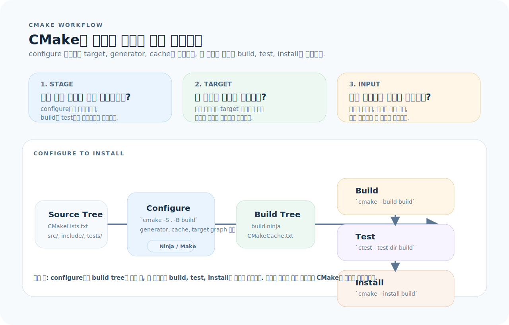
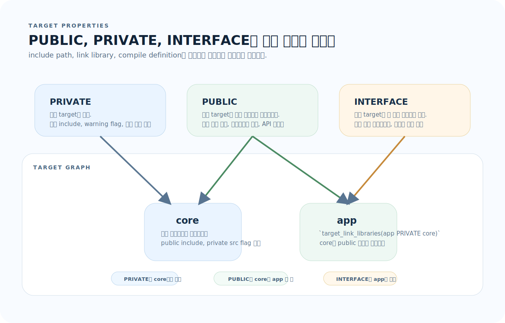
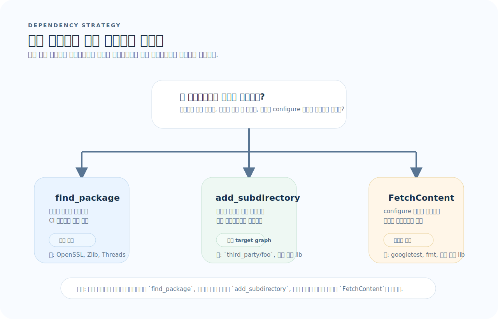
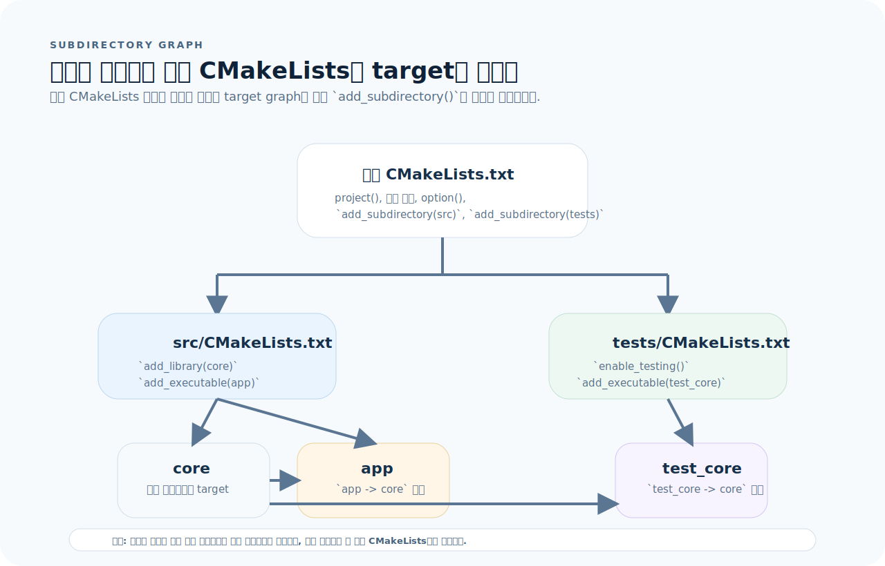

# CMake 완전 가이드

CMake는 문법보다 "무엇이 설정 단계에서 결정되고 무엇이 타깃에 매달리는가"를 먼저 잡아야 덜 헷갈린다. 이 문서는 configure, target, dependency, subdirectory 네 축으로 CMake를 읽는 기준을 잡아준다.

## 목차
1. [기본 개념](#1-기본-개념)
2. [프로젝트 구조와 기본 설정](#2-프로젝트-구조와-기본-설정)
3. [타깃 — 라이브러리와 실행 파일](#3-타깃--라이브러리와-실행-파일)
4. [타깃 프로퍼티 — include, link, compile](#4-타깃-프로퍼티--include-link-compile)
5. [변수와 캐시](#5-변수와-캐시)
6. [제어 흐름](#6-제어-흐름)
7. [find_package — 외부 의존성](#7-find_package--외부-의존성)
8. [FetchContent — 소스에서 의존성 빌드](#8-fetchcontent--소스에서-의존성-빌드)
9. [서브디렉터리와 다중 CMakeLists](#9-서브디렉터리와-다중-cmakelists)
10. [테스트 — CTest 통합](#10-테스트--ctest-통합)
11. [빌드 타입과 설치](#11-빌드-타입과-설치)
12. [자주 하는 실수](#12-자주-하는-실수)
13. [빠른 참조](#13-빠른-참조)

---

## 1. 기본 개념

CMake는 명령어 모음으로 외우기보다, 소스 트리에서 빌드 트리를 조립하는 설정 엔진으로 이해하는 편이 빠르다.



이 그림을 기준으로 먼저 세 가지를 확인하면 된다.

1. **단계:** 지금 만지는 설정이 configure 시점에 결정되는가, build/test/install 시점에 실행되는가?
2. **소유권:** 이 설정은 전역 변수인가, 특정 target의 속성인가?
3. **의존성:** 외부 라이브러리를 시스템 패키지로 찾을지, 소스에 포함할지 어디서 결정하는가?

### CMake란

CMake는 빌드 시스템 **생성기**다. 직접 빌드하지 않고, Makefile이나 Ninja 빌드 파일을 생성한다.

### 핵심 용어

| 용어 | 의미 |
|------|------|
| Source tree | 소스 코드가 있는 디렉터리 (`CMakeLists.txt` 위치) |
| Build tree | 빌드 결과물이 생성되는 디렉터리 (out-of-source) |
| Target | 빌드 산출물 단위 (실행 파일, 라이브러리) |
| Generator | 빌드 파일을 생성하는 백엔드 (Make, Ninja, Xcode 등) |

### 기본 워크플로우

```bash
# 1. 설정 (Configure) — build 디렉터리에 빌드 파일 생성
cmake -S . -B build

# 2. 빌드
cmake --build build

# 3. 테스트
ctest --test-dir build --output-on-failure

# 4. 설치
cmake --install build --prefix /usr/local

# Ninja 사용 (더 빠름)
cmake -S . -B build -G Ninja
cmake --build build
```

---

## 2. 프로젝트 구조와 기본 설정

### 디렉터리 구조

```
myproject/
├── CMakeLists.txt          # 루트 CMake 파일
├── include/
│   └── myproject/
│       ├── core.h
│       └── utils.h
├── src/
│   ├── CMakeLists.txt      # src 서브디렉터리
│   ├── core.cpp
│   ├── utils.cpp
│   └── main.cpp
├── tests/
│   ├── CMakeLists.txt
│   └── test_core.cpp
└── build/                  # 빌드 디렉터리 (gitignore)
```

### 루트 CMakeLists.txt

```cmake
cmake_minimum_required(VERSION 3.20)

# 프로젝트 정의
project(myproject
  VERSION 1.0.0
  LANGUAGES CXX
  DESCRIPTION "내 프로젝트"
)

# C++ 표준
set(CMAKE_CXX_STANDARD 17)
set(CMAKE_CXX_STANDARD_REQUIRED ON)   # 필수 (없으면 빌드 실패)
set(CMAKE_CXX_EXTENSIONS OFF)          # GNU 확장 비활성화

# 서브디렉터리 추가
add_subdirectory(src)
add_subdirectory(tests)
```

---

## 3. 타깃 — 라이브러리와 실행 파일

### 실행 파일

```cmake
# 실행 파일 정의
add_executable(app
  src/main.cpp
  src/utils.cpp
)

# 소스 파일 나중에 추가
add_executable(app src/main.cpp)
target_sources(app PRIVATE src/utils.cpp)
```

### 라이브러리

```cmake
# 정적 라이브러리 (.a / .lib)
add_library(core STATIC
  src/core.cpp
  src/utils.cpp
)

# 공유 라이브러리 (.so / .dylib / .dll)
add_library(core SHARED
  src/core.cpp
)

# 기본값 — BUILD_SHARED_LIBS 옵션으로 제어
add_library(core
  src/core.cpp
)
# cmake -DBUILD_SHARED_LIBS=ON ..

# 헤더 전용 라이브러리
add_library(header_only INTERFACE)
target_include_directories(header_only INTERFACE include/)
```

---

## 4. 타깃 프로퍼티 — include, link, compile

CMake에서 가장 중요한 습관은 `include`, `link`, `compile option`을 전역으로 뿌리지 않고 target 중심으로 묶는 것이다. 아래 그림은 `PUBLIC`, `PRIVATE`, `INTERFACE`가 어디까지 전파되는지 한 번에 보여준다.



- `PRIVATE`는 현재 target 내부 구현에만 남는다.
- `PUBLIC`은 현재 target의 계약이므로 downstream target에도 전파된다.
- `INTERFACE`는 헤더 전용 라이브러리나 소비자 전용 설정처럼 "내가 직접 쓰지 않는 계약"을 표현할 때 쓴다.

### PUBLIC / PRIVATE / INTERFACE

```cmake
# PRIVATE  — 이 타깃만 사용
# PUBLIC   — 이 타깃 + 이 타깃을 링크하는 타깃도 사용
# INTERFACE — 이 타깃을 링크하는 타깃만 사용 (이 타깃은 사용 안 함)
```

| 키워드 | 이 타깃에 적용 | 링크하는 타깃에 전파 |
|--------|:-----------:|:---------------:|
| PRIVATE | ✅ | ❌ |
| PUBLIC | ✅ | ✅ |
| INTERFACE | ❌ | ✅ |

### 헤더 경로

```cmake
target_include_directories(core
  PUBLIC
    ${CMAKE_SOURCE_DIR}/include       # 외부에서도 core 헤더 사용 가능
  PRIVATE
    ${CMAKE_SOURCE_DIR}/src           # core 내부에서만 사용
)
```

### 링크

```cmake
target_link_libraries(app
  PRIVATE core           # app이 core에 의존
  PRIVATE Threads::Threads
)

# core가 PUBLIC include를 가지면 app도 core의 헤더 경로를 자동으로 받음
```

### 컴파일 옵션

```cmake
# 타깃별 컴파일 플래그
target_compile_options(core PRIVATE
  -Wall -Wextra -Wpedantic
)

# 타깃별 정의
target_compile_definitions(core PRIVATE
  DEBUG_MODE
  VERSION="1.0.0"
)

# 타깃별 C++ 표준 (전역 설정 대신)
target_compile_features(core PUBLIC cxx_std_17)
```

---

## 5. 변수와 캐시

### 일반 변수

```cmake
# 설정
set(MY_VAR "hello")
set(SOURCE_FILES src/main.cpp src/utils.cpp)

# 사용
message(STATUS "변수: ${MY_VAR}")
add_executable(app ${SOURCE_FILES})

# 리스트 (세미콜론 구분)
set(MY_LIST a b c)         # "a;b;c"
list(APPEND MY_LIST d)     # "a;b;c;d"
list(LENGTH MY_LIST len)   # 4
```

### 캐시 변수

```cmake
# 캐시 변수 — cmake -D 로 외부에서 설정 가능
set(MY_OPTION "default" CACHE STRING "설명")

# 옵션 (ON/OFF)
option(BUILD_TESTS "테스트 빌드 여부" ON)

if(BUILD_TESTS)
  add_subdirectory(tests)
endif()

# 외부에서 설정
# cmake -DBUILD_TESTS=OFF -S . -B build
```

### 유용한 내장 변수

```cmake
CMAKE_SOURCE_DIR          # 루트 소스 디렉터리
CMAKE_BINARY_DIR          # 루트 빌드 디렉터리
CMAKE_CURRENT_SOURCE_DIR  # 현재 CMakeLists.txt 위치
CMAKE_CURRENT_BINARY_DIR  # 현재 빌드 디렉터리
PROJECT_SOURCE_DIR        # project() 호출 위치
PROJECT_NAME              # 프로젝트 이름
PROJECT_VERSION           # 프로젝트 버전
CMAKE_CXX_COMPILER        # C++ 컴파일러 경로
CMAKE_BUILD_TYPE          # Debug, Release, RelWithDebInfo, MinSizeRel
CMAKE_INSTALL_PREFIX      # 설치 경로
CMAKE_SYSTEM_NAME         # OS 이름 (Linux, Darwin, Windows)
```

---

## 6. 제어 흐름

### 조건문

```cmake
if(BUILD_TESTS)
  add_subdirectory(tests)
endif()

# 비교
if(CMAKE_CXX_COMPILER_ID STREQUAL "GNU")
  message(STATUS "GCC 사용 중")
elseif(CMAKE_CXX_COMPILER_ID STREQUAL "Clang")
  message(STATUS "Clang 사용 중")
elseif(CMAKE_CXX_COMPILER_ID STREQUAL "AppleClang")
  message(STATUS "Apple Clang 사용 중")
endif()

# 버전 비교
if(CMAKE_VERSION VERSION_GREATER_EQUAL "3.24")
  message(STATUS "CMake 3.24 이상")
endif()

# 파일/디렉터리 존재 확인
if(EXISTS "${CMAKE_SOURCE_DIR}/config.h.in")
  configure_file(config.h.in config.h)
endif()

# 정의 여부
if(DEFINED MY_VAR)
  message(STATUS "MY_VAR 정의됨: ${MY_VAR}")
endif()
```

### 반복문

```cmake
set(SOURCES main.cpp utils.cpp core.cpp)

foreach(src IN LISTS SOURCES)
  message(STATUS "소스: ${src}")
endforeach()

# 범위
foreach(i RANGE 1 5)
  message(STATUS "i = ${i}")
endforeach()
```

### 함수와 매크로

```cmake
# 함수 — 스코프 분리
function(add_my_library name)
  add_library(${name} ${ARGN})       # ARGN = 나머지 인자
  target_compile_options(${name} PRIVATE -Wall)
endfunction()

add_my_library(core src/core.cpp src/utils.cpp)

# 매크로 — 호출자 스코프에서 실행 (변수 공유)
macro(set_cxx_standard version)
  set(CMAKE_CXX_STANDARD ${version})
  set(CMAKE_CXX_STANDARD_REQUIRED ON)
endmacro()

set_cxx_standard(17)
```

---

## 7. find_package — 외부 의존성

외부 의존성은 "어떻게 링크하느냐"보다 "어디에서 조달하느냐"를 먼저 정해야 한다. `find_package`, `FetchContent`, `add_subdirectory`는 대체 관계가 아니라 조달 전략이 다르다.



- 시스템 패키지 관리자나 CI 이미지가 이미 제공하는 라이브러리는 `find_package`가 가장 안정적이다.
- 저장소 안에서 함께 개발하는 라이브러리는 `add_subdirectory`로 같은 타깃 그래프에 넣는 편이 단순하다.
- 버전 고정과 재현성이 더 중요하고, 설치 유무를 가정하기 싫다면 `FetchContent`를 쓴다.

### 기본 사용

```cmake
# 시스템에 설치된 패키지 찾기
find_package(Threads REQUIRED)            # 스레드
find_package(OpenSSL REQUIRED)            # OpenSSL
find_package(ZLIB REQUIRED)               # zlib
find_package(Boost 1.70 REQUIRED COMPONENTS filesystem system)

# 링크
target_link_libraries(app PRIVATE
  Threads::Threads
  OpenSSL::SSL
  OpenSSL::Crypto
  ZLIB::ZLIB
  Boost::filesystem
)
```

### 선택적 의존성

```cmake
find_package(OpenSSL QUIET)    # 없어도 에러 안 남

if(OpenSSL_FOUND)
  target_link_libraries(app PRIVATE OpenSSL::SSL)
  target_compile_definitions(app PRIVATE HAS_OPENSSL)
endif()
```

### find_path / find_library

```cmake
# 수동 탐색 — find_package를 지원하지 않는 라이브러리
find_path(PCAP_INCLUDE_DIR pcap.h
  PATHS /usr/include /usr/local/include
)

find_library(PCAP_LIBRARY pcap
  PATHS /usr/lib /usr/local/lib
)

if(PCAP_INCLUDE_DIR AND PCAP_LIBRARY)
  target_include_directories(app PRIVATE ${PCAP_INCLUDE_DIR})
  target_link_libraries(app PRIVATE ${PCAP_LIBRARY})
endif()
```

---

## 8. FetchContent — 소스에서 의존성 빌드

```cmake
include(FetchContent)

# 외부 라이브러리 소스를 다운로드하고 빌드에 포함
FetchContent_Declare(
  googletest
  GIT_REPOSITORY https://github.com/google/googletest.git
  GIT_TAG        v1.14.0
)

FetchContent_Declare(
  fmt
  GIT_REPOSITORY https://github.com/fmtlib/fmt.git
  GIT_TAG        10.1.1
)

# 사용 가능하게 만듦
FetchContent_MakeAvailable(googletest fmt)

# 링크
target_link_libraries(app PRIVATE fmt::fmt)
target_link_libraries(test_app PRIVATE GTest::gtest_main)
```

---

## 9. 서브디렉터리와 다중 CMakeLists

다중 `CMakeLists.txt` 구조에서 루트 파일은 "조립", 하위 파일은 "정의"를 맡는다고 생각하면 헷갈림이 줄어든다.



- 루트 `CMakeLists.txt`는 전역 정책과 `add_subdirectory()` 호출만 관리한다.
- `src/CMakeLists.txt`는 실제 라이브러리와 실행 파일 target을 정의한다.
- `tests/CMakeLists.txt`는 기존 target을 링크해 테스트 실행 파일을 만들고 `add_test()`로 CTest에 등록한다.

### 구조

```cmake
# CMakeLists.txt (루트)
cmake_minimum_required(VERSION 3.20)
project(myproject LANGUAGES CXX)

set(CMAKE_CXX_STANDARD 17)
set(CMAKE_CXX_STANDARD_REQUIRED ON)

add_subdirectory(src)
add_subdirectory(tests)
```

```cmake
# src/CMakeLists.txt
add_library(core
  core.cpp
  utils.cpp
)

target_include_directories(core PUBLIC
  ${CMAKE_SOURCE_DIR}/include
)

add_executable(app main.cpp)
target_link_libraries(app PRIVATE core)
```

```cmake
# tests/CMakeLists.txt
enable_testing()

add_executable(test_core test_core.cpp)
target_link_libraries(test_core PRIVATE core GTest::gtest_main)

add_test(NAME test_core COMMAND test_core)
```

---

## 10. 테스트 — CTest 통합

### 기본

```cmake
# 루트 CMakeLists.txt에서 테스트 활성화
enable_testing()

# 테스트 실행 파일
add_executable(test_core tests/test_core.cpp)
target_link_libraries(test_core PRIVATE core)

# 테스트 등록
add_test(NAME test_core COMMAND test_core)

# 인자 전달
add_test(NAME test_with_args COMMAND test_core --verbose)

# 작업 디렉터리 지정
set_tests_properties(test_core PROPERTIES
  WORKING_DIRECTORY ${CMAKE_SOURCE_DIR}
)
```

### Google Test 연동

```cmake
include(FetchContent)
FetchContent_Declare(
  googletest
  GIT_REPOSITORY https://github.com/google/googletest.git
  GIT_TAG v1.14.0
)
FetchContent_MakeAvailable(googletest)

# Google Test의 test discovery 자동화
include(GoogleTest)

add_executable(test_core tests/test_core.cpp)
target_link_libraries(test_core PRIVATE core GTest::gtest_main)

gtest_discover_tests(test_core)  # add_test 자동 생성
```

### CTest 실행

```bash
ctest --test-dir build                  # 전체 테스트
ctest --test-dir build --output-on-failure  # 실패 시 출력 표시
ctest --test-dir build -R "test_core"   # 이름 필터
ctest --test-dir build -j4              # 4개 병렬
ctest --test-dir build --verbose        # 상세 출력
```

---

## 11. 빌드 타입과 설치

### 빌드 타입

```bash
# 한 줄 빌드 시스템 (Make, Ninja)
cmake -S . -B build -DCMAKE_BUILD_TYPE=Release
cmake -S . -B build -DCMAKE_BUILD_TYPE=Debug

# 멀티 설정 (Xcode, Visual Studio)
cmake -S . -B build
cmake --build build --config Release
```

| 빌드 타입 | 최적화 | 디버그 정보 | assert |
|-----------|:-----:|:--------:|:------:|
| Debug | 없음 | ✅ | ✅ |
| Release | -O3 | ❌ | ❌ |
| RelWithDebInfo | -O2 | ✅ | ❌ |
| MinSizeRel | -Os | ❌ | ❌ |

### 설치

```cmake
# 설치 규칙
install(TARGETS app core
  RUNTIME DESTINATION bin           # 실행 파일
  LIBRARY DESTINATION lib           # 공유 라이브러리
  ARCHIVE DESTINATION lib           # 정적 라이브러리
)

install(DIRECTORY include/
  DESTINATION include
)

install(FILES README.md
  DESTINATION share/doc/myproject
)
```

```bash
cmake --install build --prefix /usr/local
```

---

## 12. 자주 하는 실수

| 실수 | 원인 | 해결 |
|------|------|------|
| build/source 디렉터리 혼재 | 소스 안에서 `cmake .` 실행 | `cmake -S . -B build` 사용 |
| 전역 플래그 사용 | `add_compile_options` 전역 적용 | `target_compile_options` 타깃별 적용 |
| PUBLIC/PRIVATE 미구분 | 의존성이 불필요하게 전파 | 내부만 쓰면 PRIVATE, 외부 노출 시 PUBLIC |
| 헤더 문제를 링크 문제로 착각 | include와 link는 별개 단계 | `target_include_directories`와 `target_link_libraries` 구분 |
| `find_package` 실패를 코드 버그로 오해 | 시스템에 라이브러리 미설치 | `apt install`, `brew install` 등으로 먼저 설치 |
| `cmake_minimum_required` 누락 | 정책 경고 발생 | 첫 줄에 반드시 명시 |
| 캐시 변수 변경 안 됨 | 이전 캐시가 남아 있음 | `build/` 삭제 후 재설정 |
| `file(GLOB)` 사용 | 새 파일 추가 시 감지 안 됨 | 소스 파일 명시적 나열 |

---

## 13. 빠른 참조

```cmake
# 필수 설정
cmake_minimum_required(VERSION 3.20)
project(name VERSION 1.0 LANGUAGES CXX)
set(CMAKE_CXX_STANDARD 17)
set(CMAKE_CXX_STANDARD_REQUIRED ON)

# 타깃
add_executable(app src/main.cpp)
add_library(lib src/lib.cpp)
add_library(header INTERFACE)

# 타깃 설정
target_include_directories(lib PUBLIC include/)
target_link_libraries(app PRIVATE lib)
target_compile_options(app PRIVATE -Wall)
target_compile_definitions(app PRIVATE DEBUG)
target_compile_features(app PUBLIC cxx_std_17)
target_sources(app PRIVATE src/extra.cpp)

# 의존성
find_package(PkgName REQUIRED)
target_link_libraries(app PRIVATE PkgName::PkgName)

# FetchContent
include(FetchContent)
FetchContent_Declare(name GIT_REPOSITORY url GIT_TAG tag)
FetchContent_MakeAvailable(name)

# 서브디렉터리
add_subdirectory(dir)

# 테스트
enable_testing()
add_test(NAME name COMMAND target)

# 설치
install(TARGETS app RUNTIME DESTINATION bin)

# 변수
set(VAR value)
option(OPT "설명" ON)
message(STATUS "msg: ${VAR}")

# 조건
if(condition) ... elseif() ... else() ... endif()
foreach(i IN LISTS list) ... endforeach()

# CLI
# cmake -S . -B build                   설정
# cmake -S . -B build -G Ninja          Ninja 사용
# cmake -DCMAKE_BUILD_TYPE=Release      Release 빌드
# cmake --build build                   빌드
# cmake --build build -j$(nproc)        병렬 빌드
# ctest --test-dir build                테스트
# cmake --install build                 설치
```
