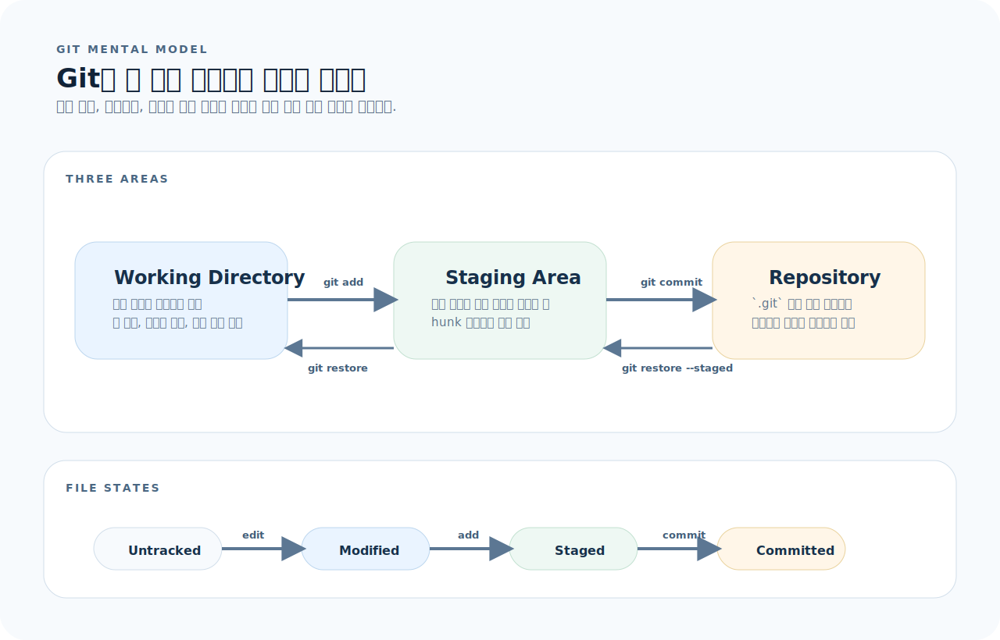
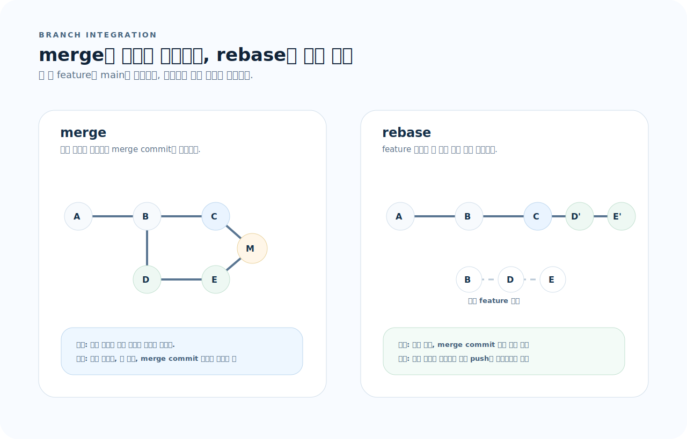
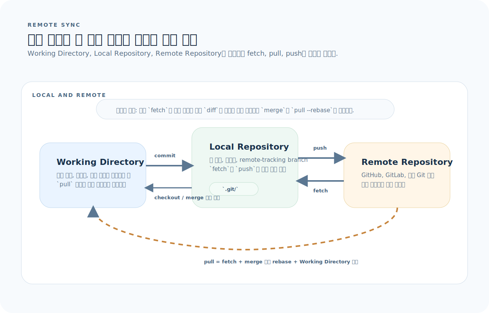
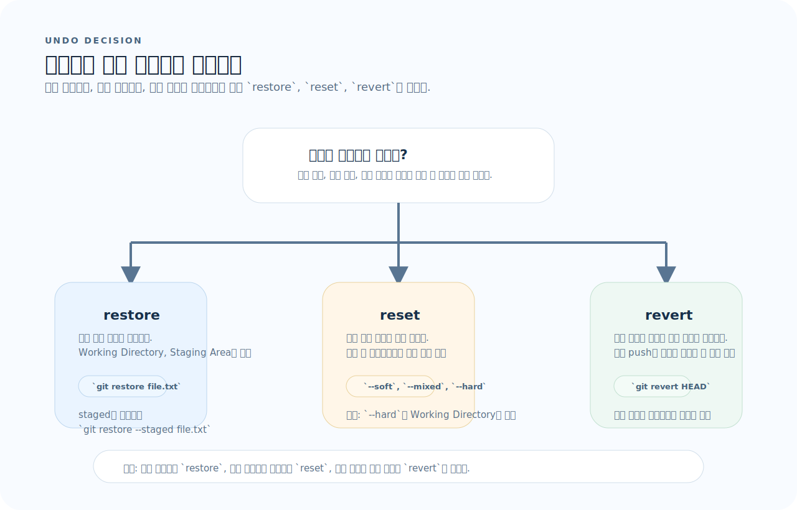

# Git 완전 가이드

Git은 명령어를 많이 아는 것보다 "지금 변경이 어느 영역에 있고, 어떤 명령이 어느 영역을 움직이는가"를 먼저 구분해야 실수가 줄어든다. 이 문서는 세 영역, 브랜치 통합, 원격 동기화, 되돌리기 기준으로 Git을 다시 정리한다.

## 목차
1. [기본 개념 — 세 영역](#1-기본-개념--세-영역)
2. [설정](#2-설정)
3. [기본 워크플로우 — add, commit, status](#3-기본-워크플로우--add-commit-status)
4. [diff — 변경 내용 확인](#4-diff--변경-내용-확인)
5. [브랜치](#5-브랜치)
6. [merge와 rebase](#6-merge와-rebase)
7. [충돌 해결](#7-충돌-해결)
8. [원격 저장소](#8-원격-저장소)
9. [되돌리기 — restore, reset, revert](#9-되돌리기--restore-reset-revert)
10. [stash — 임시 저장](#10-stash--임시-저장)
11. [이력 탐색 — log, blame, bisect](#11-이력-탐색--log-blame-bisect)
12. [rebase -i — 커밋 정리](#12-rebase--i--커밋-정리)
13. [태그](#13-태그)
14. [.gitignore](#14-gitignore)
15. [자주 하는 실수](#15-자주-하는-실수)
16. [빠른 참조](#16-빠른-참조)

---

## 1. 기본 개념 — 세 영역

Git을 처음 헷갈리게 만드는 지점은 파일이 "하나"가 아니라 세 영역 사이를 이동한다는 점이다.



이 그림을 읽는 기준은 세 가지다.

1. **변경 위치:** 지금 수정은 Working Directory에만 있는가, Staging Area까지 올라갔는가?
2. **이동 명령:** `git add`, `git commit`, `git restore`, `git restore --staged` 중 어느 명령이 어디를 움직이는가?
3. **안전성:** 아직 commit되지 않은 변경인지, 이미 Repository에 들어간 기록인지 구분했는가?

| 영역 | 설명 |
|------|------|
| Working Directory | 실제 파일이 있는 디렉터리 |
| Staging Area (Index) | 다음 커밋에 포함될 변경 사항 |
| Repository | 커밋된 스냅샷의 히스토리 |

### 파일 상태

```
Untracked → Staged → Committed
                ↕
           Modified → Staged → Committed
```

```bash
git status          # 현재 파일 상태 확인
git status -s       # 짧은 형식 (M = modified, A = added, ?? = untracked)
```

---

## 2. 설정

```bash
# 필수 설정
git config --global user.name "이름"
git config --global user.email "email@example.com"

# 기본 브랜치명
git config --global init.defaultBranch main

# 에디터
git config --global core.editor "code --wait"

# 줄바꿈 (macOS/Linux)
git config --global core.autocrlf input

# 줄바꿈 (Windows)
git config --global core.autocrlf true

# 설정 확인
git config --global --list

# 전역 gitignore
git config --global core.excludesFile ~/.gitignore_global
```

### 설정 범위

| 범위 | 파일 | 적용 |
|------|------|------|
| `--system` | `/etc/gitconfig` | 시스템 전체 |
| `--global` | `~/.gitconfig` | 현재 사용자 |
| `--local` | `.git/config` | 현재 저장소 |

---

## 3. 기본 워크플로우 — add, commit, status

### 저장소 시작

```bash
# 새 저장소 생성
git init
git init my-project     # 디렉터리 생성 + 초기화

# 기존 저장소 복제
git clone https://github.com/user/repo.git
git clone git@github.com:user/repo.git      # SSH
git clone repo.git my-folder                # 폴더명 지정
```

### add — 스테이징

```bash
git add file.txt              # 파일 하나
git add src/ tests/           # 디렉터리
git add -A                    # 전체 (새 파일 + 수정 + 삭제)
git add -u                    # 추적 중인 파일만 (수정 + 삭제)
git add -p                    # 변경 내 hunk 단위 선택 스테이징
```

### `add -p` — 부분 스테이징

```bash
git add -p file.txt
# y = 이 hunk 추가
# n = 건너뜀
# s = hunk를 더 작게 분할
# e = 직접 편집
# q = 종료
```

하나의 파일에서 관련 없는 변경을 분리해 커밋할 수 있다.

### commit

```bash
git commit -m "feat: 로그인 기능 추가"
git commit                       # 에디터에서 메시지 작성
git commit -am "quick fix"       # add + commit (추적 파일만)
git commit --amend               # 마지막 커밋 수정 (메시지 또는 파일)
git commit --amend --no-edit     # 파일만 추가, 메시지 유지
```

### 커밋 메시지 컨벤션

```
<type>: <subject>

type:
  feat     새 기능
  fix      버그 수정
  refactor 리팩터링
  docs     문서
  test     테스트
  chore    빌드, CI 등
```

---

## 4. diff — 변경 내용 확인

```bash
git diff                    # Working → Staging 차이 (unstaged)
git diff --cached           # Staging → Repository 차이 (staged)
git diff HEAD               # Working → Repository 차이 (전체)
git diff main..feature      # 브랜치 간 차이
git diff main...feature     # 분기점 이후 feature에서만 변경된 것
git diff HEAD~3..HEAD       # 최근 3 커밋 변경

# 옵션
git diff --stat             # 파일별 변경 요약
git diff --name-only        # 변경된 파일 이름만
git diff --word-diff        # 단어 단위 diff
git diff -- path/to/file    # 특정 파일만
```

### `..` vs `...`

```
main:    A — B — C
              \
feature:       D — E

git diff main..feature    → C와 E의 차이 (양쪽 전체 비교)
git diff main...feature   → B 이후 feature에서 변경된 것 (D, E만)
```

---

## 5. 브랜치

```bash
# 목록
git branch                    # 로컬 브랜치
git branch -r                 # 원격 브랜치
git branch -a                 # 전체

# 생성과 전환
git switch -c feature/login   # 생성 + 전환 (권장)
git switch main               # 전환
git switch -                  # 이전 브랜치로 전환

# 삭제
git branch -d feature/login   # 병합된 브랜치 삭제
git branch -D feature/login   # 강제 삭제 (미병합 포함)

# 이름 변경
git branch -m old-name new-name
```

### 브랜치 전략

```
main ──────────────────────────────────────
        \                    / (merge)
         feature/login ─────
              \         / (merge)
               hotfix ──
```

| 브랜치 | 용도 |
|--------|------|
| `main` | 배포 가능 상태 |
| `develop` | 개발 통합 |
| `feature/*` | 기능 개발 |
| `hotfix/*` | 긴급 수정 |
| `release/*` | 배포 준비 |

---

## 6. merge와 rebase

`merge`와 `rebase`는 둘 다 "feature를 main에 합친다"는 목적은 같지만, 이력을 남기는 방식이 완전히 다르다.



- `merge`는 분기 이력을 보존하고 merge commit을 추가한다.
- `rebase`는 feature 커밋을 새 기준 위에 다시 쓰므로 커밋 해시가 바뀐다.
- 이미 공유된 브랜치라면 `merge`, 아직 로컬 정리 단계라면 `rebase`가 안전하다.

### merge

```bash
git switch main
git merge feature/login

# Fast-forward (직선 이력이면 자동)
# main이 feature보다 뒤에 있으면 포인터만 앞으로 이동

# 명시적 merge commit 생성
git merge --no-ff feature/login

# merge 취소
git merge --abort
```

### rebase

```bash
# feature 브랜치를 main 위로 재배치
git switch feature/login
git rebase main

# main 기준으로 최신화 후 merge
git switch main
git merge feature/login   # fast-forward 가능
```

### merge vs rebase

| | merge | rebase |
|--|-------|--------|
| 이력 | 분기 보존 | 직선 이력 |
| 커밋 | merge commit 추가 | 원본 커밋 재작성 |
| 안전성 | 기존 커밋 변경 없음 | **커밋 해시 변경** |
| 협업 | 공유 브랜치에 안전 | **공유 브랜치에 위험** |

> **규칙**: 이미 push한 커밋은 rebase하지 않는다.

---

## 7. 충돌 해결

```bash
git merge feature/login
# CONFLICT 발생

git status                    # 충돌 파일 확인 (both modified)
```

### 충돌 마커

```
<<<<<<< HEAD
현재 브랜치의 내용
=======
병합하려는 브랜치의 내용
>>>>>>> feature/login
```

### 해결 과정

```bash
# 1. 충돌 파일 편집 — 마커 제거, 올바른 코드만 남김
# 2. 해결 완료한 파일 스테이징
git add resolved-file.txt

# 3. 커밋
git merge --continue
# 또는
git commit

# 취소
git merge --abort
```

### 도구 사용

```bash
git mergetool                 # 설정된 머지 도구 실행

# VS Code로 머지 도구 설정
git config --global merge.tool vscode
git config --global mergetool.vscode.cmd 'code --wait $MERGED'
```

---

## 8. 원격 저장소

원격 작업은 "내 작업 폴더"와 "내 로컬 저장소", "원격 저장소"를 구분하면 훨씬 단순해진다.



- `fetch`는 원격 커밋을 로컬 저장소로만 가져오고 작업 파일은 건드리지 않는다.
- `pull`은 `fetch` 뒤에 merge나 rebase까지 이어져 작업 트리까지 바꾼다.
- `push`는 로컬 저장소의 commit을 원격 저장소로 보낼 뿐, Working Directory 내용을 직접 올리는 명령이 아니다.

```bash
# 원격 저장소 확인
git remote -v

# 추가
git remote add origin https://github.com/user/repo.git

# push
git push origin main
git push -u origin main       # upstream 설정 (이후 git push만 사용)
git push                      # upstream 설정 후

# fetch — 원격 변경 다운로드 (병합 안 함)
git fetch origin
git fetch --all               # 모든 원격

# pull — fetch + merge
git pull origin main
git pull --rebase             # fetch + rebase (직선 이력 유지)

# 원격 브랜치 삭제
git push origin --delete feature/done

# 원격 브랜치 추적
git switch -c feature/login origin/feature/login
```

### fetch vs pull

```
fetch: 원격 → 로컬 저장소 (Working Directory 변경 없음)
pull:  원격 → 로컬 저장소 → Working Directory (자동 merge)
```

안전한 습관: `fetch` → `diff` → `merge` (또는 `pull --rebase`)

---

## 9. 되돌리기 — restore, reset, revert

되돌리기 명령은 이름이 비슷하지만 대상이 다르다. 먼저 "파일을 되돌리는가, 커밋을 다시 쓰는가, 이미 공유된 이력을 취소하는가"를 결정해야 한다.



- 작업 파일만 되돌리면 `restore`다.
- 로컬 커밋을 재정리하면 `reset`이지만, `--hard`는 Working Directory까지 지운다.
- 이미 push한 기록을 되돌릴 때는 기존 이력을 보존하는 `revert`를 쓴다.

### restore — 파일 단위 되돌리기

```bash
git restore file.txt                # unstaged 변경 취소 (Working → 마지막 커밋)
git restore --staged file.txt       # staged → unstaged (스테이징 취소)
git restore --source=HEAD~3 file.txt  # 3커밋 전 버전으로 복원
```

### reset — 커밋 이동

```bash
git reset --soft HEAD~1       # 커밋 취소, 변경은 staged에 유지
git reset --mixed HEAD~1      # 커밋 취소, 변경은 unstaged에 유지 (기본값)
git reset --hard HEAD~1       # 커밋 취소 + 변경 삭제 ⚠️

git reset HEAD file.txt       # 파일 unstage (restore --staged와 동일)
```

| 옵션 | HEAD | Staging | Working |
|------|:----:|:-------:|:-------:|
| `--soft` | 이동 | 유지 | 유지 |
| `--mixed` | 이동 | 초기화 | 유지 |
| `--hard` | 이동 | 초기화 | 초기화 |

### revert — 안전한 되돌리기

```bash
git revert HEAD               # 마지막 커밋을 되돌리는 새 커밋 생성
git revert abc1234             # 특정 커밋 되돌리기
git revert HEAD~3..HEAD        # 최근 3개 커밋 되돌리기

# 이미 push한 커밋을 되돌릴 때는 revert 사용
# reset은 로컬 전용
```

---

## 10. stash — 임시 저장

```bash
git stash                       # 현재 변경 치워두기
git stash push -m "WIP: 로그인" # 메시지 포함
git stash -u                    # untracked 파일도 포함

# 목록
git stash list
# stash@{0}: On main: WIP: 로그인
# stash@{1}: WIP on main: abc1234

# 꺼내기
git stash pop                   # 적용 + 삭제
git stash apply                 # 적용만 (삭제 안 함)
git stash apply stash@{1}       # 특정 stash 적용

# 확인
git stash show                  # 변경 요약
git stash show -p               # 전체 diff

# 삭제
git stash drop stash@{0}        # 특정 삭제
git stash clear                 # 전체 삭제
```

---

## 11. 이력 탐색 — log, blame, bisect

### log

```bash
git log                          # 전체 이력
git log --oneline                # 한 줄 요약
git log --oneline --graph --all  # 그래프 시각화
git log -5                       # 최근 5개
git log --author="name"          # 작성자 필터
git log --since="2024-01-01"     # 날짜 필터
git log --grep="fix"             # 커밋 메시지 검색
git log -S "function_name"      # 코드 변경 검색 (pickaxe)
git log -p -- path/to/file       # 특정 파일 변경 이력 + diff
git log --stat                   # 파일별 변경 통계
```

### blame

```bash
git blame file.txt               # 줄별 마지막 수정자
git blame -L 10,20 file.txt      # 10~20번째 줄만
git blame -w file.txt            # 공백 변경 무시
```

### bisect — 이진 탐색으로 버그 커밋 찾기

```bash
git bisect start
git bisect bad                   # 현재가 버그 있음
git bisect good abc1234          # 이 커밋은 정상

# Git이 중간 커밋을 체크아웃 → 테스트 → good/bad 반복
git bisect good                  # 정상이면
git bisect bad                   # 버그면

# 완료
git bisect reset

# 자동화 (테스트 스크립트 사용)
git bisect start HEAD abc1234
git bisect run npm test
```

### grep — 코드 검색

```bash
git grep "pattern"               # 추적 파일에서 검색
git grep -n "TODO"               # 줄 번호 포함
git grep --count "FIXME"         # 파일당 매칭 수
git grep "pattern" HEAD~5        # 5커밋 전 시점에서 검색
```

---

## 12. rebase -i — 커밋 정리

```bash
git rebase -i HEAD~5             # 최근 5커밋 편집
```

에디터에서 커밋 목록이 열린다:

```
pick abc1234 첫 번째 커밋
pick def5678 두 번째 커밋
pick ghi9012 세 번째 커밋
pick jkl3456 네 번째 커밋
pick mno7890 다섯 번째 커밋
```

### 명령어

| 명령 | 역할 |
|------|------|
| `pick` | 커밋 유지 |
| `reword` | 커밋 메시지 수정 |
| `edit` | 커밋 수정 (amend 가능) |
| `squash` | 이전 커밋에 합치기 (메시지 편집) |
| `fixup` | 이전 커밋에 합치기 (메시지 버림) |
| `drop` | 커밋 삭제 |

### 예시: WIP 커밋 정리

```
pick abc1234 feat: 로그인 폼 구현
fixup def5678 WIP
fixup ghi9012 WIP: 마무리
pick jkl3456 feat: 비밀번호 검증
reword mno7890 오타 수정 → fix: 로그인 에러 메시지 수정
```

> 이미 push한 커밋에는 사용하지 않는다. force push가 필요해진다.

---

## 13. 태그

```bash
# 태그 목록
git tag
git tag -l "v1.*"

# Annotated 태그 (권장 — 메타데이터 포함)
git tag -a v1.0.0 -m "Release 1.0.0"

# Lightweight 태그
git tag v1.0.0

# 특정 커밋에 태그
git tag -a v1.0.0 abc1234 -m "Release 1.0.0"

# 태그 push
git push origin v1.0.0
git push origin --tags          # 모든 태그

# 삭제
git tag -d v1.0.0               # 로컬
git push origin --delete v1.0.0 # 원격
```

---

## 14. .gitignore

```gitignore
# 빌드 결과물
build/
dist/
*.o
*.pyc
__pycache__/

# 의존성
node_modules/
venv/
.venv/

# 환경 설정
.env
.env.local
*.local

# IDE
.vscode/settings.json
.idea/
*.swp
*.swo

# OS
.DS_Store
Thumbs.db

# 패턴
*.log              # 확장자
!important.log     # 예외 (무시하지 않음)
logs/              # 디렉터리 전체
doc/**/*.pdf       # 중첩 디렉터리
```

```bash
# 이미 추적 중인 파일을 gitignore 적용
git rm --cached file.txt        # 추적 중지 (파일은 유지)
git rm -r --cached node_modules/ # 디렉터리 전체
```

---

## 15. 자주 하는 실수

| 실수 | 원인 | 해결 |
|------|------|------|
| 상태 모르고 편집 시작 | `status` 확인 누락 | 항상 `git status`부터 |
| 공유 브랜치에서 rebase | 다른 사람의 이력이 꼬임 | 공유 브랜치엔 merge 사용 |
| `reset --hard` 남용 | 변경 사항 복구 불가 | `reflog`로 복구, 평소엔 `revert` 사용 |
| 큰 커밋 하나 | 되돌리기 어려움 | 작은 단위로 나눠 커밋 |
| `.env`를 커밋 | 비밀 정보 노출 | `.gitignore`에 먼저 추가 |
| merge conflict 무작정 해결 | 양쪽 의도 파악 안 함 | `diff`로 양쪽 변경 이해 후 해결 |
| `stash pop` 전 확인 안 함 | 충돌 발생 가능 | `stash show -p`로 먼저 확인 |
| 브랜치 기준점 없이 diff | 전체 차이를 봄 | `diff main...HEAD` 사용 |

---

## 16. 빠른 참조

```bash
# 설정
git config --global user.name "이름"
git config --global user.email "email"

# 기본 워크플로
git status                     # 상태 확인
git add -p file.txt            # 부분 스테이징
git commit -m "type: message"  # 커밋
git push                       # 원격 전송

# diff
git diff                       # unstaged
git diff --cached              # staged
git diff main...HEAD           # 분기점 이후 변경

# 브랜치
git switch -c feature/x        # 생성 + 전환
git switch main                # 전환
git branch -d feature/x        # 삭제

# 병합
git merge feature/x            # merge
git rebase main                # rebase

# 되돌리기
git restore file.txt           # unstaged 취소
git restore --staged file.txt  # staging 취소
git reset --soft HEAD~1        # 커밋 취소 (변경 유지)
git revert HEAD                # 되돌리기 커밋

# 임시 저장
git stash push -m "msg"        # 저장
git stash pop                  # 꺼내기

# 이력
git log --oneline --graph      # 시각화
git blame file.txt             # 줄별 작성자
git bisect start/bad/good      # 버그 이진 탐색

# 원격
git fetch origin               # 다운로드
git pull --rebase              # 동기화
git push -u origin branch      # upstream 설정 + push

# 태그
git tag -a v1.0 -m "Release"   # 태그 생성
git push origin v1.0           # 태그 push
```
