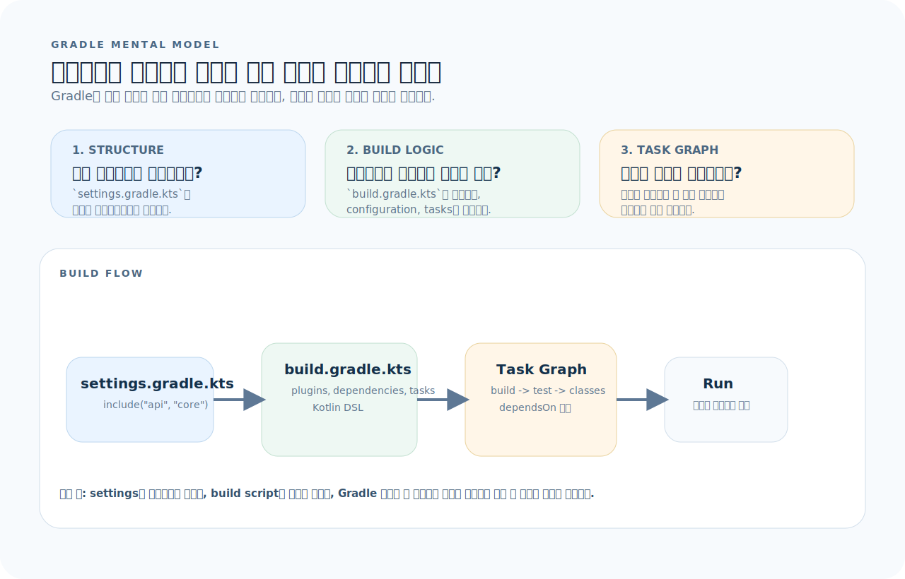
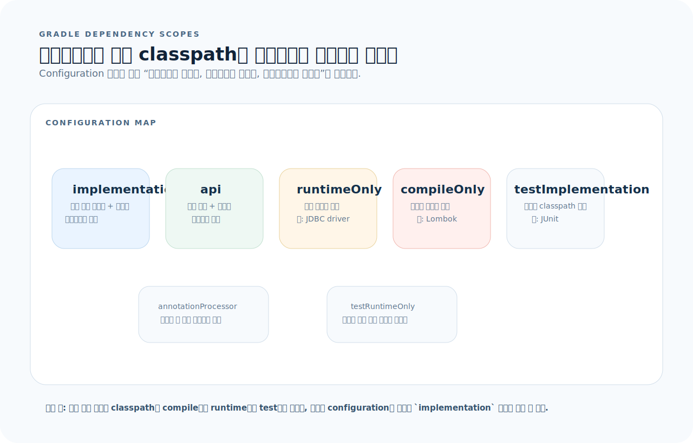
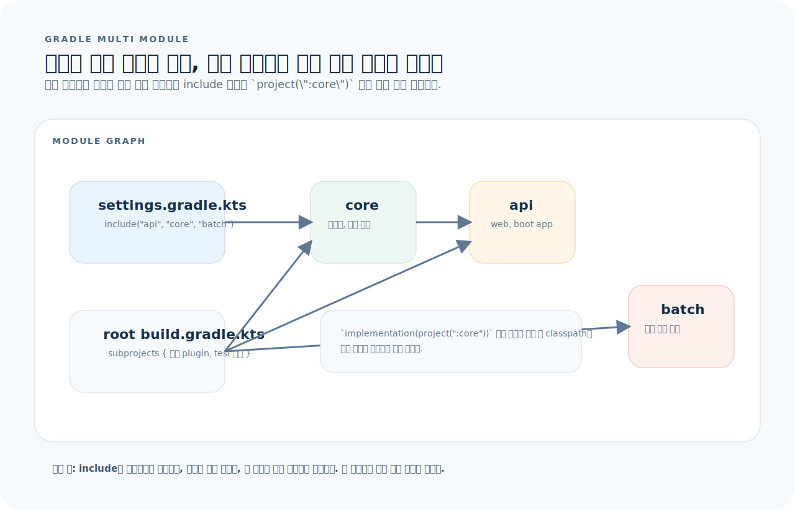

# Gradle 완전 가이드

Gradle은 JVM 생태계의 빌드 자동화 도구다. Maven의 선언적 모델과 Ant의 유연성을 합쳤고, Kotlin DSL(`build.gradle.kts`)로 빌드 스크립트를 작성한다. 이 글을 읽고 나면 Spring Boot 프로젝트의 빌드 설정을 읽고, 의존성을 관리하며, 태스크를 만들고 실행할 수 있다.

먼저 아래 세 질문을 기준으로 읽으면 Gradle 파일이 훨씬 빨리 정리된다.

1. **프로젝트 구조:** `settings.gradle.kts`와 `build.gradle.kts`는 각각 무엇을 선언하는가?
2. **의존성 스코프:** 이 라이브러리는 `implementation`, `api`, `runtimeOnly`, `testImplementation` 중 어디에 넣어야 하는가?
3. **태스크 그래프:** 이 태스크는 어떤 다른 태스크에 의존하고, 어떤 순서로 실행되는가?

---

## 1. Gradle의 사고방식

Gradle은 "빌드 스크립트를 실행하는 러너"가 아니라, "태스크 그래프를 만들고 필요한 것만 실행하는 엔진"이다.



이 그림은 이 문서 전체를 읽는 기준표다. 먼저 아래 세 질문으로 읽으면 된다.

1. **프로젝트 구조:** `settings.gradle.kts`가 어떤 프로젝트를 포함하고, `build.gradle.kts`가 무엇을 정의하는가?
2. **의존성 스코프:** 라이브러리가 컴파일/런타임/테스트 중 어느 classpath에 올라가는가?
3. **태스크 그래프:** `build`, `test`, `bootJar` 같은 태스크가 서로 어떻게 의존하는가?

그림을 왼쪽에서 오른쪽으로 읽으면 Gradle은 "스크립트 한 줄씩 실행"보다 "설정 파일을 읽어 작업 그래프를 만들고 필요한 것만 돌리는 엔진"이라는 점이 먼저 보인다. 그래서 Gradle 파일은 `프로젝트 선언`, `Configuration`, `Task dependency` 세 축으로 읽어야 한다.

**핵심 용어:**
- **Project**: 빌드의 단위. 멀티 프로젝트면 여러 Project가 있다
- **Task**: 빌드의 원자적 작업 단위 (컴파일, 테스트, JAR 패키징 등)
- **Plugin**: Task와 설정을 묶어 제공하는 확장 (java, spring-boot 등)
- **Configuration**: 의존성 스코프 (implementation, testImplementation 등)
- **Wrapper**: 프로젝트에 고정된 Gradle 버전 (`gradlew`)

**항상 Wrapper를 사용한다:**
```bash
./gradlew build      # ✅ 프로젝트 고정 버전
gradle build         # ❌ 시스템 설치 버전 — 버전 불일치 위험
```

---

## 2. 프로젝트 구조

### 단일 프로젝트

```
my-app/
├── build.gradle.kts         # 빌드 설정
├── settings.gradle.kts      # 프로젝트 이름
├── gradle/
│   └── wrapper/
│       ├── gradle-wrapper.jar
│       └── gradle-wrapper.properties
├── gradlew                  # Unix wrapper
├── gradlew.bat              # Windows wrapper
└── src/
    ├── main/
    │   ├── java/
    │   └── resources/
    └── test/
        ├── java/
        └── resources/
```

### settings.gradle.kts

```kotlin
rootProject.name = "my-app"

// 멀티 모듈
// include("api", "core", "batch")
```

### build.gradle.kts — 기본

```kotlin
plugins {
    java
    id("org.springframework.boot") version "3.4.0"
    id("io.spring.dependency-management") version "1.1.6"
}

group = "com.example"
version = "0.0.1-SNAPSHOT"

java {
    toolchain {
        languageVersion = JavaLanguageVersion.of(21)
    }
}

repositories {
    mavenCentral()
}

dependencies {
    // 컴파일 + 런타임
    implementation("org.springframework.boot:spring-boot-starter-web")
    implementation("org.springframework.boot:spring-boot-starter-data-jpa")
    implementation("org.springframework.boot:spring-boot-starter-validation")

    // 런타임만
    runtimeOnly("org.postgresql:postgresql")

    // 컴파일 시점 코드 생성
    annotationProcessor("org.projectlombok:lombok")
    compileOnly("org.projectlombok:lombok")

    // 테스트
    testImplementation("org.springframework.boot:spring-boot-starter-test")
    testImplementation("org.testcontainers:postgresql")
    testRuntimeOnly("org.junit.platform:junit-platform-launcher")
}

tasks.withType<Test> {
    useJUnitPlatform()
}
```

---

## 3. 의존성 관리

스코프는 라이브러리를 어디서 보이게 할지 정하는 규칙이다. 이름만 외우기보다 classpath 관점으로 보면 훨씬 덜 헷갈린다.



- `implementation`은 현재 모듈 내부 컴파일/런타임에 필요하지만 소비자에게는 숨긴다.
- `api`는 현재 모듈과 소비자 모두의 컴파일 classpath에 노출된다.
- `runtimeOnly`, `testImplementation`, `annotationProcessor`는 이름대로 특정 phase에만 보이게 제한한다.

### Configuration (스코프)

| Configuration | 컴파일 | 런타임 | 테스트 | 용도 |
|---|---|---|---|---|
| `implementation` | ✅ | ✅ | | 주 의존성 |
| `api` | ✅ | ✅ | | 의존성을 소비자에게 전파 (java-library 플러그인) |
| `compileOnly` | ✅ | | | 컴파일만 필요 (Lombok) |
| `runtimeOnly` | | ✅ | | 런타임만 필요 (JDBC 드라이버) |
| `annotationProcessor` | | | | 어노테이션 처리 (Lombok, Querydsl) |
| `testImplementation` | | | ✅ | 테스트 의존성 |
| `testRuntimeOnly` | | | ✅ | 테스트 런타임만 |

### BOM과 버전 관리

```kotlin
// Spring Boot가 관리하는 의존성은 버전 생략 가능
dependencies {
    implementation("org.springframework.boot:spring-boot-starter-web")  // 버전 불필요
    implementation("com.google.guava:guava:33.0.0-jre")                 // 외부 라이브러리는 명시
}

// 별도 BOM 임포트
dependencies {
    implementation(platform("org.testcontainers:testcontainers-bom:1.20.4"))
    testImplementation("org.testcontainers:postgresql")      // 버전 불필요
    testImplementation("org.testcontainers:kafka")           // 버전 불필요
}
```

### 의존성 확인

```bash
# 의존성 트리
./gradlew dependencies --configuration runtimeClasspath

# 특정 의존성 검색
./gradlew dependencies | grep kafka

# 의존성 충돌 해결
./gradlew dependencyInsight --dependency slf4j-api
```

---

## 4. 플러그인

```kotlin
plugins {
    java                                                    // Java 빌드
    id("org.springframework.boot") version "3.4.0"          // Spring Boot
    id("io.spring.dependency-management") version "1.1.6"    // 의존성 버전 관리
    id("com.diffplug.spotless") version "6.25.0"             // 코드 포맷팅
    id("org.flywaydb.flyway") version "10.0.0"               // DB 마이그레이션
}
```

**주요 번들 태스크:**

| 플러그인 | 추가되는 태스크 |
|----------|----------------|
| `java` | `compileJava`, `test`, `jar`, `classes` |
| `spring-boot` | `bootRun`, `bootJar`, `bootBuildImage` |
| `application` | `run`, `installDist`, `distZip` |

---

## 5. 태스크

### 내장 태스크

```bash
./gradlew build               # 컴파일 + 테스트 + JAR
./gradlew test                 # 테스트만
./gradlew bootRun              # Spring Boot 실행
./gradlew bootJar              # FAT JAR 생성
./gradlew clean                # build/ 삭제
./gradlew classes              # 컴파일만
./gradlew check                # test + 정적 분석
./gradlew dependencies         # 의존성 트리
./gradlew tasks                # 사용 가능한 태스크 목록
./gradlew tasks --all          # 숨겨진 태스크 포함
```

### 커스텀 태스크

```kotlin
tasks.register("hello") {
    group = "custom"
    description = "인사를 출력한다"
    doLast {
        println("Hello, Gradle!")
    }
}

// 타입이 있는 태스크
tasks.register<Copy>("copyConfig") {
    from("src/main/resources")
    into("build/config")
    include("*.yml")
}

// 태스크 의존성
tasks.register("deploy") {
    dependsOn("bootJar")
    doLast {
        println("배포 실행")
    }
}
```

### 태스크 구성

```kotlin
tasks.withType<Test> {
    useJUnitPlatform()
    maxParallelForks = Runtime.getRuntime().availableProcessors()
    jvmArgs("-XX:+EnableDynamicAgentLoading")
}

tasks.withType<JavaCompile> {
    options.encoding = "UTF-8"
    options.compilerArgs.add("-parameters")
}

tasks.named<Jar>("jar") {
    enabled = false    // Spring Boot에서는 bootJar만 사용
}
```

---

## 6. 멀티 모듈 프로젝트

멀티 모듈은 폴더 구조보다 "어떤 모듈이 어떤 모듈에 의존하는가"가 핵심이다. 루트 빌드는 공통 설정을 주고, 실제 의존성은 모듈 그래프가 결정한다.



- `settings.gradle.kts`의 `include()`가 프로젝트 그래프의 시작점이다.
- 루트 `build.gradle.kts`는 `subprojects {}`로 공통 규칙을 배포하고, 각 모듈은 자기 의존성만 선언한다.
- `api -> core`처럼 모듈 의존성을 선언하면 관련 태스크도 함께 연결되어 빌드 순서가 정해진다.

### 구조

```
my-app/
├── settings.gradle.kts
├── build.gradle.kts              # 루트 (공통 설정)
├── api/
│   ├── build.gradle.kts
│   └── src/
├── core/
│   ├── build.gradle.kts
│   └── src/
└── batch/
    ├── build.gradle.kts
    └── src/
```

### settings.gradle.kts

```kotlin
rootProject.name = "my-app"
include("api", "core", "batch")
```

### 루트 build.gradle.kts

```kotlin
plugins {
    java
    id("org.springframework.boot") version "3.4.0" apply false
    id("io.spring.dependency-management") version "1.1.6" apply false
}

subprojects {
    apply(plugin = "java")
    apply(plugin = "io.spring.dependency-management")

    group = "com.example"
    version = "0.0.1-SNAPSHOT"

    java {
        toolchain {
            languageVersion = JavaLanguageVersion.of(21)
        }
    }

    repositories {
        mavenCentral()
    }

    dependencies {
        testImplementation("org.springframework.boot:spring-boot-starter-test")
    }

    tasks.withType<Test> {
        useJUnitPlatform()
    }
}
```

### 모듈 간 의존성

```kotlin
// api/build.gradle.kts
plugins {
    id("org.springframework.boot")
}

dependencies {
    implementation(project(":core"))    // core 모듈 의존
    implementation("org.springframework.boot:spring-boot-starter-web")
}
```

---

## 7. Gradle Wrapper

```bash
# Wrapper 생성/업데이트
gradle wrapper --gradle-version 8.11

# Wrapper 버전 확인
./gradlew --version

# gradle-wrapper.properties
distributionUrl=https\://services.gradle.org/distributions/gradle-8.11-bin.zip
```

**Wrapper 파일은 반드시 Git에 커밋한다:**
```
# Git에 포함
gradle/wrapper/gradle-wrapper.jar
gradle/wrapper/gradle-wrapper.properties
gradlew
gradlew.bat
```

---

## 8. 프로파일과 환경 변수

```kotlin
// 환경 변수로 Spring 프로파일 지정
tasks.named<org.springframework.boot.gradle.tasks.run.BootRun>("bootRun") {
    systemProperty("spring.profiles.active", System.getenv("PROFILE") ?: "local")
    jvmArgs("-Xmx512m")
}
```

```bash
PROFILE=prod ./gradlew bootRun
```

### gradle.properties

```properties
# gradle.properties (프로젝트 루트)
org.gradle.jvmargs=-Xmx2g -XX:+UseG1GC
org.gradle.parallel=true
org.gradle.caching=true
org.gradle.daemon=true
```

---

## 9. Makefile 연동

Gradle 명령을 Makefile로 감싸면 팀 내 진입점이 통일된다.

```makefile
.PHONY: run test lint build clean

run:
	./gradlew bootRun

test:
	./gradlew test

lint:
	./gradlew spotlessCheck

build:
	./gradlew bootJar

clean:
	./gradlew clean

smoke:
	docker compose up -d
	./gradlew test --tests "*IntegrationTest"
	docker compose down
```

---

## 10. 자주 하는 실수

| 실수 | 올바른 방법 |
|------|-------------|
| `gradle` 대신 시스템 설치 버전 사용 | 항상 `./gradlew` 사용 |
| 모든 의존성을 `implementation`에 넣기 | JDBC 드라이버는 `runtimeOnly`, 테스트는 `testImplementation` |
| `settings.gradle.kts` 없이 멀티 모듈 | 반드시 `include()`로 서브프로젝트 선언 |
| 의존성 버전 직접 관리 | Spring Boot BOM이 관리하는 라이브러리는 버전 생략 |
| `build/` 디렉터리를 Git에 커밋 | `.gitignore`에 `build/` 추가 |
| Wrapper 파일을 `.gitignore`에 넣기 | `gradle/wrapper/`와 `gradlew`는 커밋해야 한다 |
| bootJar 대신 jar 사용 | Spring Boot 앱은 `bootJar`로 FAT JAR 생성 |

---

## 11. 빠른 참조

```bash
# ── 빌드 ──
./gradlew build                # 전체 빌드 (컴파일 + 테스트 + JAR)
./gradlew bootJar              # Spring Boot FAT JAR
./gradlew bootRun              # 앱 실행
./gradlew clean build          # 클린 빌드

# ── 테스트 ──
./gradlew test                 # 전체 테스트
./gradlew test --tests "*ServiceTest"   # 패턴 매치
./gradlew test --rerun         # 캐시 무시 재실행
./gradlew test -i              # 상세 출력

# ── 의존성 ──
./gradlew dependencies         # 의존성 트리
./gradlew dependencyInsight --dependency slf4j

# ── 정보 ──
./gradlew tasks                # 태스크 목록
./gradlew --version            # Gradle 버전
./gradlew --status             # 데몬 상태

# ── 디버깅 ──
./gradlew build --scan         # 빌드 스캔 리포트
./gradlew build --info         # 상세 로그
./gradlew build --stacktrace   # 스택 트레이스
```

```kotlin
// ── build.gradle.kts 핵심 ──
plugins {
    java
    id("org.springframework.boot") version "3.4.0"
    id("io.spring.dependency-management") version "1.1.6"
}

dependencies {
    implementation("group:artifact")          // 컴파일 + 런타임
    runtimeOnly("group:artifact")             // 런타임만
    compileOnly("group:artifact")             // 컴파일만
    testImplementation("group:artifact")      // 테스트
    annotationProcessor("group:artifact")     // 어노테이션 처리
    implementation(project(":module"))         // 모듈 의존
}
```
